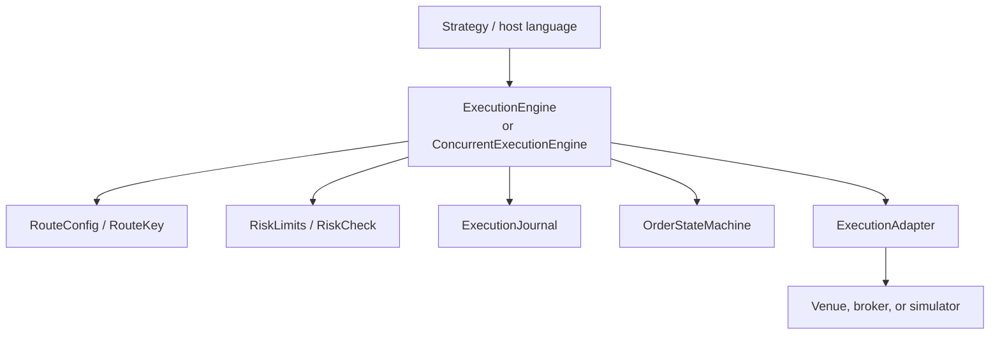
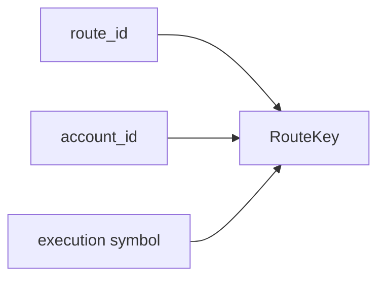
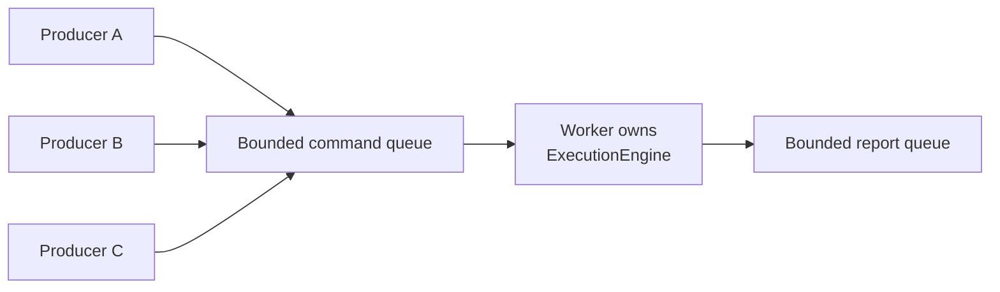

# `of_execution`

[](https://crates.io/crates/of_execution)
[](https://docs.rs/of_execution)
[](https://github.com/gregorian-09/orderflow/actions/workflows/ci.yml)
[](https://opensource.org/license/mit)

`of_execution` is the execution routing and OMS crate for Orderflow. It builds
on `of_execution_core` by adding adapter contracts, route configuration,
bounded event buffers, simulated execution, journals, route-scoped risk,
concurrent command ownership, and reusable order-management helpers.

The crate is additive to the analytics runtime. It does not change market-data
adapter behavior and does not merge execution state into `of_runtime`.
Strategies can read analytics from `of_runtime` and send orders through
`of_execution`, while those two domains stay separate.

## First Release: 0.1.0

`of_execution` publishes as `0.1.0` inside the Orderflow `0.4.0` release. This
is intentional. The market-data runtime and bindings are on the established
`0.4.0` line; execution routing, adapter traits, journals, and OMS helpers are
new public crate surfaces and should carry their own compatibility signal.

Versioning rules:

- `of_execution` depends on `of_execution_core = 0.1`;
- existing analytics crates do not depend on `of_execution`;
- `of_ffi_c 0.4.0`, Python `0.4.0`, and Java `0.4.0` expose execution through
  additive handles/classes backed by this crate;
- future `0.1.x` releases should prefer additive changes and clear migration
  notes for adapter authors.

## Design Goals

- Keep the synchronous engine deterministic and single-owner.
- Preserve route/account/symbol scoped risk accounting.
- Use typed requests and reports on the hot path.
- Use caller-owned bounded event buffers.
- Surface backpressure explicitly instead of hiding it in unbounded queues.
- Keep adapter contracts provider-neutral.
- Provide a concurrent worker without forcing a Tokio/async runtime.
- Make journaling, recovery, and reconciliation additive and replaceable.

## Public API Inventory

Core result and error types:

- [`ExecutionResult<T>`]
- [`ExecutionError`]

Event buffers and adapter metadata:

- [`ExecutionEventBuffer`]
- [`LatencyClass`]
- [`ExecutionCapabilities`]
- [`ExecutionHealth`]
- [`ExecutionAdapter`]

Routing and risk:

- [`RouteConfig`]
- [`RouteKey`]
- [`AllowAllRiskGate`]

Journaling:

- [`JournalCommandKind`]
- [`JournalRecord`]
- [`ExecutionJournal`]
- [`InMemoryJournal`]
- [`WalJournalConfig`]
- [`WalReplayResult`]
- [`WalJournalMetrics`]
- [`WalExecutionJournal`]
- [`WalSegmentConfig`]
- [`WalSegmentMetadata`]
- [`WalSegmentManifest`]
- [`WalSegmentIntegrityReport`]
- [`SegmentedWalExecutionJournal`]
- [`CheckpointPosition`]
- [`ExecutionCheckpoint`]
- [`CheckpointPolicy`]
- [`CheckpointConfig`]
- [`CheckpointManifest`]
- [`ExecutionCheckpointStore`]
- [`FileExecutionCheckpointStore`]
- [`RecoveryCorruptionPolicy`]
- [`RecoveryVenuePolicy`]
- [`RecoveryPlan`]
- [`RecoveredOmsState`]
- [`RecoveryResult`]
- [`recover_oms_state_from_records`]
- [`recover_oms_state_from_segmented_wal`]
- [`recover_latest_checkpoint_from_segmented_wal`]

Engine and simulation:

- [`ExecutionEngine`]
- [`ExecutionMetrics`]
- [`ExecutionRunbookSnapshot`]
- [`SimExecutionAdapter`]
- [`simulated_engine`]
- [`simulated_engine_with_routes`]

Concurrent execution:

- [`ConcurrentExecutionConfig`]
- [`ExecutionCommandKind`]
- [`ExecutionCommand`]
- [`ExecutionCommandReport`]
- [`ConcurrentExecutionError`]
- [`ExecutionCommandSender`]
- [`ConcurrentExecutionEngine`]

OMS helpers:

- [`CommandId`]
- [`RequestId`]
- [`CommandIdGenerator`]
- [`CommandCorrelation`]
- [`ExecutionEventFanout`]
- [`ExecutionEventSubscriber`]
- [`ExecutionAdapterState`]
- [`ExecutionLifecycle`]
- [`ExecutionLifecycleSnapshot`]
- [`FileExecutionJournal`]
- [`ReconciliationAction`]
- [`ReconciliationItem`]
- [`ReconciliationReport`]
- [`ReconciliationIssueKind`]
- [`ReconciliationDetail`]
- [`VenueReconciliationReport`]
- [`ReconciliationPolicyAction`]
- [`ReconciliationPolicy`]
- [`ReconciliationPolicyItem`]
- [`ReconciliationPolicyDecision`]
- [`reconcile_open_orders`]
- [`reconcile_open_orders_detailed`]
- [`evaluate_reconciliation_policy`]
- [`DisconnectPolicy`]
- [`RouteSafetyPolicy`]
- [`AdvancedRiskLimits`]
- [`AdvancedRiskGate`]
- [`Position`]
- [`PositionKey`]
- [`PositionLedger`]
- [`VenueOrderCapabilities`]
- [`NormalizedOrderType`]
- [`normalize_order_type`]
- [`ExecutionTelemetry`]
- [`ShardKey`]
- [`ShardRouter`]
- [`OrderThrottle`]
- [`ReplayDecision`]
- [`ReplayResult`]
- [`replay_simulated_oms`]
- [`ProviderAdapterContext`]
- [`ExecutionAdapterFactory`]
- [`ProviderAdapterSdk`]

## Layer Model



The synchronous [`ExecutionEngine`] is the canonical state owner. The
[`ConcurrentExecutionEngine`] is a wrapper that lets many producer threads
submit commands while one worker thread owns the synchronous engine.

[`ExecutionEngine::runbook_snapshot`] returns a read-only
[`ExecutionRunbookSnapshot`] for operator dashboards and incident checklists. It
summarizes adapter connectivity, route enablement, route-level kill switches,
open versus terminal local orders, core execution counters, whether every
new-order route is blocked, and whether the engine deserves operator attention.
The snapshot is factual only: hosts still own permissions, escalation, and
operator command execution.

## Adapter Contract

Implement [`ExecutionAdapter`] to connect a venue, broker, simulator, REST API,
WebSocket API, FIX session, or native SDK.

Required methods:

- `connect()`
- `submit(req, out)`
- `cancel(req, out)`
- `amend(req, out)`
- `poll(out)`
- `recover_open_orders(out)`
- `capabilities()`
- `health()`

Adapters write canonical `ExecutionEvent` values into caller-owned
[`ExecutionEventBuffer`] instances. They should not leak provider-specific
report structs past the adapter boundary.

## ExecutionEventBuffer

[`ExecutionEventBuffer`] is a bounded event vector used by adapters and engine
calls.

Important behavior:

- `with_capacity(capacity)` allocates bounded storage.
- `push(event)` fails with [`ExecutionError::BufferFull`] when full.
- `clear()` retains capacity for reuse.
- `as_slice()` and `as_mut_slice()` expose currently stored events.
- `drain_into(out)` moves events into another bounded buffer.
- `max_len()` returns configured capacity.

This buffer model matters for low latency and FFI. The caller controls memory
growth and the engine never silently drops order events.

## Route Configuration

[`RouteConfig`] binds:

- `route_id`
- `account_id`
- `symbol`
- `enabled`
- `risk_limits`

The engine indexes routes by [`RouteKey`]:



Open-order count and open notional are calculated only within the matched
route/account/symbol. This allows one engine to handle multiple symbols without
cross-symbol contamination.

Example:

- ES route: max one open order.
- NQ route: max one open order.
- A second ES order is rejected.
- A first NQ order is accepted.

## Synchronous Engine

[`ExecutionEngine<A, R, J>`] owns:

- adapter `A`
- risk gate `R`
- journal `J`
- route table
- order-state machines
- open-order price cache
- metrics
- scratch event buffer

Lifecycle:

1. Build the engine with `ExecutionEngine::new(adapter, risk, journal, routes)`.
2. Call `start()`.
3. Call `submit`, `cancel`, `amend`, `poll`, or `recover_open_orders`.
4. Inspect `order_state`, `metrics`, `health`, `routes`, or `replay_journal`.

Submit path:

1. reject if the engine is not started,
2. validate the request shape,
3. find the configured route,
4. build route-scoped risk context,
5. check route risk limits,
6. check custom risk gate,
7. record the command in the journal,
8. create local pending state,
9. call the adapter,
10. apply returned events through the state machine,
11. record events in the journal,
12. copy events to the caller output buffer.

The adapter never receives a request that failed local validation or pre-trade
risk.

Cancel and amend paths verify the original client order id is known locally.
Amends also check replacement quantity/notional before routing.

## Simulated Execution

[`SimExecutionAdapter`] is deterministic and intended for:

- integration tests,
- binding smoke tests,
- strategy validation,
- replay examples,
- examples that should not touch a live broker.

Helpers:

- [`simulated_engine`] creates a single-route engine.
- [`simulated_engine_with_routes`] creates a multi-route engine.

The multi-route helper uses route-scoped limits and [`AllowAllRiskGate`],
because the engine already enforces each route's [`RiskLimits`].

```rust
use of_execution::{simulated_engine_with_routes, ExecutionEventBuffer, RouteConfig};
use of_execution_core::{
    AccountId, ClientOrderId, ExecutionSymbol, OrderPrice, OrderQty,
    OrderRequest, OrderSide, OrderType, RiskLimits, RouteId, StrategyId,
    TimeInForce,
};

let route = RouteConfig {
    route_id: RouteId::new("SIM")?,
    account_id: AccountId::new("ACC")?,
    symbol: ExecutionSymbol::new("SIM", "ES")?,
    enabled: true,
    risk_limits: RiskLimits {
        kill_switch: false,
        max_order_qty: 100,
        max_order_notional: 1_000_000,
        max_open_orders: 10,
        max_open_notional: 10_000_000,
        price_band_ticks: 0,
    },
};

let mut engine = simulated_engine_with_routes(vec![route]);
engine.start()?;

let req = OrderRequest {
    client_order_id: ClientOrderId::new("C1")?,
    account_id: AccountId::new("ACC")?,
    route_id: RouteId::new("SIM")?,
    strategy_id: StrategyId::new("STRAT")?,
    symbol: ExecutionSymbol::new("SIM", "ES")?,
    side: OrderSide::Buy,
    order_type: OrderType::Limit,
    time_in_force: TimeInForce::Day,
    quantity: OrderQty::new(1)?,
    limit_price: OrderPrice::new(5000)?,
    stop_price: OrderPrice(0),
    ts_exchange_ns: 0,
    ts_recv_ns: 1,
};

let mut events = ExecutionEventBuffer::with_capacity(8);
engine.submit(req, &mut events)?;
assert!(!events.is_empty());
# Ok::<(), Box<dyn std::error::Error>>(())
```

## Journaling

[`ExecutionJournal`] records commands and events:

- `record_command`
- `record_event`
- `replay`

[`InMemoryJournal`] is useful for tests and embedded simulation.
[`FileExecutionJournal`] is an append-only durable implementation in the OMS
helper surface. [`WalExecutionJournal`] is an additive binary WAL-backed
implementation that uses `of_execution_core` WAL frames, sequence numbers,
checksums, and configurable sync policy.

Journal records use [`JournalRecord`]:

- `Command`
- `Event`

Command kinds use [`JournalCommandKind`]:

- `Submit`
- `Cancel`
- `Amend`
- `Poll`
- `RecoverOpenOrders`

Production deployments can replace the journal with a WAL, mmap-backed writer,
database, or replicated log by implementing [`ExecutionJournal`].

### Binary WAL journal

[`WalExecutionJournal`] records the same [`JournalRecord`] model as
[`FileExecutionJournal`], but avoids text formatting on the journal path. It
owns WAL sequence assignment, validates existing bytes before accepting new
records, and replays into the existing journal output type.

```rust
use of_execution::{
    ExecutionJournal, JournalCommandKind, WalExecutionJournal, WalJournalConfig,
};
use of_execution_core::{ClientOrderId, WalSequence, WalSyncPolicy};

let path = std::env::temp_dir().join("orders.ofwal");
let mut journal = WalExecutionJournal::open(
    WalJournalConfig::new(&path).with_sync_policy(WalSyncPolicy::EveryNRecords(32)),
)?;

journal.record_command(
    JournalCommandKind::Submit,
    ClientOrderId::new("C1")?,
    1_000,
)?;
journal.sync()?;

let report = journal.integrity_report()?;
assert!(report.valid);

let metrics = journal.metrics();
assert_eq!(metrics.records_written, 1);

let mut replayed = Vec::new();
let replay = journal.replay_from(WalSequence(1), &mut replayed)?;
assert_eq!(replay.records, replayed.len());
# let _ = std::fs::remove_file(path);
# Ok::<(), Box<dyn std::error::Error>>(())
```

Supported sync policies come from `of_execution_core::WalSyncPolicy`:

- `Never`
- `EveryRecord`
- `EveryNRecords(n)`
- `EveryDurationNs(ns)`
- `Manual`
- `OnRiskBoundary`

[`WalJournalMetrics`] records successful WAL frames/bytes, write latency, sync
latency, sync failures, write failures, segment rotations, and manifest writes.
The snapshot is copyable and allocation-free so hosts can export it out of band
to Prometheus, statsd, or tracing systems without formatting on the order path.

### Segmented WAL journal

[`SegmentedWalExecutionJournal`] uses the same binary WAL frames and
[`ExecutionJournal`] model as [`WalExecutionJournal`], but stores records in an
ordered segment directory:

```text
execution-wal/
  manifest
  wal-000000000001.ofwal
  wal-000000000002.ofwal
```

The journal rotates before appending a normal command/event record when either
`WalSegmentConfig::max_segment_bytes()` or
`WalSegmentConfig::max_segment_records()` would be exceeded. Rotation appends a
`SegmentSeal` WAL frame to the old segment, opens the next segment file, and
updates the manifest. Seal frames consume WAL sequence numbers so checksum and
sequence validation remain continuous across files, but replay skips them and
returns only [`JournalRecord`] values.

```rust
use of_execution::{
    ExecutionJournal, JournalCommandKind, SegmentedWalExecutionJournal,
    WalSegmentConfig,
};
use of_execution_core::{ClientOrderId, WalSequence, WalSyncPolicy};

let root = std::env::temp_dir().join(format!("execution-wal-{}", std::process::id()));
let _ = std::fs::remove_dir_all(&root);
let mut journal = SegmentedWalExecutionJournal::open(
    WalSegmentConfig::new(&root)
        .with_sync_policy(WalSyncPolicy::EveryNRecords(64))
        .with_max_segment_records(1_000_000)
        .with_max_segment_bytes(64 * 1024 * 1024),
)?;

journal.record_command(
    JournalCommandKind::Submit,
    ClientOrderId::new("C1")?,
    1_000,
)?;
journal.sync()?;

let manifest = journal.manifest();
assert!(manifest.active_segment().is_some());
assert_eq!(journal.metrics().records_written, 1);

let mut replayed = Vec::new();
let replay = journal.replay_from(WalSequence(1), &mut replayed)?;
assert_eq!(replay.records, replayed.len());
# let _ = std::fs::remove_dir_all(root);
# Ok::<(), Box<dyn std::error::Error>>(())
```

Recovery does not trust the manifest as source of truth. Opening the journal
scans `wal-*.ofwal` files in segment-id order, validates checksums and
sequences across segment boundaries, reconstructs the manifest, and fails
closed on corrupt or non-contiguous data. The manifest is an operator inventory
and discovery aid.

Use `SegmentedWalExecutionJournal::inspect_root(root)` when an operator or
binding needs a read-only integrity report without creating a new active
segment. The report returns segment count, valid record/byte counts, optional
sequence range, checksum failures, sequence failures, and a `valid` flag. It is
intended for recovery drills, restart checks, and archival validation outside
the order-submission path.

Checkpoint marker records remain a separate additive feature so the
compatibility boundary stays narrow.

### Checkpoint store

[`FileExecutionCheckpointStore`] stores versioned OMS checkpoints outside the
hot order path. Checkpoints are written to a temporary file, flushed, optionally
synced, and atomically renamed into place. Each checkpoint carries a checksum
over its payload, and corrupt checkpoints are rejected on load.

The first checkpoint format captures:

- last fully applied WAL sequence;
- route configuration hash selected by the host;
- open order states;
- position snapshots;
- kill-switch state.

```rust
use of_execution::{
    CheckpointConfig, ExecutionCheckpoint, ExecutionCheckpointStore,
    FileExecutionCheckpointStore,
};
use of_execution_core::WalSequence;

let root = std::env::temp_dir().join(format!("orderflow-checkpoints-{}", std::process::id()));
let _ = std::fs::remove_dir_all(&root);
let mut store = FileExecutionCheckpointStore::open(
    CheckpointConfig::new(&root).with_sync_on_save(false),
)?;

let checkpoint = ExecutionCheckpoint::new(1, WalSequence(42), 1_000)
    .with_route_config_hash(7);

let manifest = store.save_checkpoint(&checkpoint)?;
assert_eq!(manifest.last_applied_sequence, WalSequence(42));

let latest = store.load_latest()?.expect("checkpoint");
assert_eq!(latest.checkpoint_id, 1);
assert!(store.validate_checkpoint(&latest)?);
# let _ = std::fs::remove_dir_all(root);
# Ok::<(), Box<dyn std::error::Error>>(())
```

`CheckpointPolicy` is metadata for hosts and future checkpoint schedulers. This
store does not start background writers or block the OMS worker automatically;
callers decide when to construct and save snapshots.

Use `FileExecutionCheckpointStore::inspect_root(root)` for read-only startup and
operator diagnostics. The report counts discovered, valid, and invalid
checkpoint files, totals checkpoint bytes, and identifies the latest valid
checkpoint id, covered WAL sequence, and creation timestamp. It does not create
the store directory, save checkpoints, prune files, or mutate the checkpoint
root.

### Recovery plan

[`RecoveryPlan`] describes a deterministic replay before recovery starts:

- first WAL sequence to replay;
- optional latest sequence expected by the caller;
- fail-closed corruption policy;
- venue reconciliation policy;
- whether strategy submissions remain disabled after recovery.

[`recover_latest_checkpoint_from_segmented_wal`] loads the newest valid
checkpoint from an [`ExecutionCheckpointStore`], builds a plan from
`last_applied_sequence + 1`, replays the segmented WAL tail, and returns a
[`RecoveryResult`] with [`RecoveredOmsState`].

```rust
use of_execution::{
    recover_latest_checkpoint_from_segmented_wal, CheckpointConfig,
    FileExecutionCheckpointStore, SegmentedWalExecutionJournal, WalSegmentConfig,
};
use of_execution_core::WalSyncPolicy;

let checkpoints = std::env::temp_dir().join(format!(
    "orderflow-checkpoints-recovery-{}",
    std::process::id()
));
let wal = std::env::temp_dir().join(format!("execution-wal-recovery-{}", std::process::id()));
let _ = std::fs::remove_dir_all(&checkpoints);
let _ = std::fs::remove_dir_all(&wal);

let store = FileExecutionCheckpointStore::open(
    CheckpointConfig::new(&checkpoints).with_sync_on_save(false),
)?;
let journal = SegmentedWalExecutionJournal::open(
    WalSegmentConfig::new(&wal).with_sync_policy(WalSyncPolicy::Never),
)?;

let result = recover_latest_checkpoint_from_segmented_wal(&store, &journal)?;
assert!(result.venue_reconciliation_required);
# let _ = std::fs::remove_dir_all(checkpoints);
# let _ = std::fs::remove_dir_all(wal);
# Ok::<(), Box<dyn std::error::Error>>(())
```

Recovery intentionally fails closed when the WAL tail contains an execution
event for an order that was not present in the selected checkpoint. The current
command WAL payload records command kind, id, and timestamp, not the full
`OrderRequest`, so the recovery layer refuses to invent side, strategy, price,
or quantity. Production hosts should checkpoint frequently, require venue
reconciliation, and add full command-payload journaling before relying on
checkpoint-only recovery for long uncheckpointed windows.

## Concurrent Worker

[`ConcurrentExecutionEngine`] gives concurrent producer access while preserving
single-owner order-state mutation.



Properties:

- many producer handles can enqueue commands,
- command queue capacity is explicit,
- report queue capacity is explicit,
- the worker owns adapter and order state,
- reports include command sequence, command kind, result, and events,
- no Tokio runtime is required,
- order-state transitions remain serial and deterministic.

Use [`ExecutionCommandSender`] when producers should not own the worker handle.

Important methods:

- `ConcurrentExecutionEngine::spawn(engine, config)`
- `command_sender()`
- `send(command)`
- `try_send(command)`
- `recv_report()`
- `try_recv_report()`
- `recv_report_timeout(timeout)`
- `request_stop()`
- `join()`

The sender exposes convenience methods:

- `submit(req)`
- `try_submit(req)`
- `cancel(req)`
- `amend(req)`
- `poll()`
- `recover_open_orders()`
- `stop()`

[`ConcurrentExecutionError::Backpressure`] means the bounded command or report
path is full. Callers should retry, pause strategy intent, alert, or trip a
circuit breaker instead of assuming the command was accepted.

## OMS Helper Surface

### Command correlation

[`CommandId`], [`RequestId`], [`CommandIdGenerator`], and
[`CommandCorrelation`] let hosts associate strategy intent, submitted commands,
and reports without relying only on venue ids.

### Event fanout

[`ExecutionEventFanout`] publishes execution events to bounded
[`ExecutionEventSubscriber`] queues.

Full subscriber queues drop deliveries and increment `dropped_events()`.
This is suitable for telemetry or UI subscribers that must not block the main
execution path.

### Lifecycle

[`ExecutionLifecycle`] tracks [`ExecutionAdapterState`] transitions and returns
[`ExecutionLifecycleSnapshot`] values. Use it to expose adapter state changes
such as disconnected, connecting, ready, recovering, degraded, and stopped.

### Durable journal

[`FileExecutionJournal::open(path, sync_on_write)`] creates an append-only
journal. `sync_on_write = true` is safer but slower. `false` is faster but less
durable on sudden power loss.

### Reconciliation

[`reconcile_open_orders(local, venue)`] compares local open-order state against
venue open-order state and returns a [`ReconciliationReport`].

Actions:

- [`ReconciliationAction::Matched`]
- [`ReconciliationAction::VenueOnly`]
- [`ReconciliationAction::LocalOnly`]
- [`ReconciliationAction::RestateFromVenue`]

The function reports differences. It does not mutate state or cancel orders.

Use [`reconcile_open_orders_detailed`] when recovery or live monitoring needs a
more precise discrepancy type:

- [`ReconciliationIssueKind::Matched`]
- [`ReconciliationIssueKind::VenueOnly`]
- [`ReconciliationIssueKind::LocalOnly`]
- [`ReconciliationIssueKind::QuantityMismatch`]
- [`ReconciliationIssueKind::StatusMismatch`]
- [`ReconciliationIssueKind::PriceMismatch`]
- [`ReconciliationIssueKind::Unknown`]

[`ReconciliationPolicy`] maps those issues to host actions such as fail closed,
accept venue truth, cancel venue-only orders, restate venue-only orders, or
require operator approval. [`evaluate_reconciliation_policy`] returns a
[`ReconciliationPolicyDecision`] that keeps submissions disabled until required
host action completes.

[`ExecutionEngine::reconcile_open_orders_with`] and
[`ExecutionEngine::evaluate_reconciliation`] apply the same logic to the
engine's current local non-terminal orders and a venue open-order snapshot.

### Safety policies

[`DisconnectPolicy`] describes route behavior during disconnects:

- `Hold`
- `RejectNew`
- `CancelOpenOrders`
- `Freeze`

[`RouteSafetyPolicy`] combines disconnect policy, kill switch state, and whether
cancels are allowed while killed.

### Advanced risk

[`AdvancedRiskLimits`] and [`AdvancedRiskGate`] add helpers beyond
`RiskLimits`:

- message-rate limit,
- absolute position limit,
- gross notional limit,
- reduce-only mode,
- basic route limits.

### Position ledger

[`PositionLedger`] folds trade execution events into [`Position`] values keyed
by [`PositionKey`]. It tracks net quantity, buy quantity, sell quantity, gross
notional, and average price. It is an OMS-side exposure helper, not a complete
accounting system.

### Normalization

[`VenueOrderCapabilities`] and [`normalize_order_type`] validate canonical
order type and TIF choices against provider capabilities. Unsupported order
types and TIFs return structured [`RiskRejectReason`] values from
`of_execution_core`.

### Telemetry

[`ExecutionTelemetry`] tracks counts and latency totals. It is intentionally
small so deployments can export metrics to Prometheus, statsd, OpenTelemetry,
or internal systems without making this crate depend on any one telemetry
stack.

### Sharding

[`ShardRouter`] maps [`ShardKey`] values to deterministic shard indexes.
Sharding should preserve order lifecycle ordering within a route/account/symbol
scope while allowing independent scopes to run on separate workers.

### Throttling

[`OrderThrottle`] is a token-bucket style helper:

- `new(capacity, refill_per_sec)`
- `allow(now_ns)`
- `tokens()`

Use it before enqueueing commands when a venue or broker has strict message
limits.

### Replay simulation

[`ReplayDecision`], [`ReplayResult`], and [`replay_simulated_oms`] support
deterministic strategy decision replay using the simulated adapter.

### Provider adapter SDK helpers

[`ProviderAdapterContext`], [`ExecutionAdapterFactory`], and
[`ProviderAdapterSdk`] provide reusable scaffolding for adapter authors.

## Error Model

[`ExecutionError`] variants:

- `Disconnected`
- `BufferFull`
- `RouteNotFound`
- `RiskRejected`
- `Core`
- `Adapter`
- `Journal`

[`ConcurrentExecutionError`] variants:

- `Backpressure`
- `Disconnected`
- `Stopped`
- `WorkerPanic`
- `Execution`

Risk rejection is not an adapter failure. It is a structured local decision,
usually accompanied by a rejection event.

## Low-Latency Notes

- Use typed requests, not JSON, on the command path.
- Keep adapter output in caller-owned [`ExecutionEventBuffer`] values.
- Prefer bounded queues for worker and fanout paths.
- Apply pre-trade risk before provider I/O.
- Keep one owner for order-state mutation.
- Do not call strategy code while holding adapter locks.
- Export metrics out of band rather than formatting strings on the hot path.

## When To Use Which API

Use [`ExecutionEngine`] when:

- you are writing Rust,
- one owner thread already exists,
- deterministic synchronous control is desired,
- you are building tests, replay harnesses, or simulations.

Use [`ConcurrentExecutionEngine`] when:

- many producer threads submit commands,
- explicit queue backpressure matters,
- one worker should own adapter and order state,
- you do not want to depend on Tokio.

Use the C/Python/Java concurrent bindings when:

- host-language code needs non-blocking command queueing,
- host code should poll command reports,
- native code should preserve deterministic state internally.

## What This Crate Does Not Do

This crate does not:

- implement a live provider transport,
- parse FIX/REST/WebSocket messages,
- provide financial advice,
- guarantee venue-side execution behavior,
- replace broker-side risk controls,
- make the dashboard secure for remote production access.

Use `of_execution_adapters` for reusable provider scaffolds, and implement
custom [`ExecutionAdapter`] types for broker-specific behavior.

## Documentation

Additional project documentation:

- `docs/handbook/05h-of-execution-reference.md`
- `docs/handbook/09-oms-architecture.md`
- `docs/handbook/10-oms-cookbook.md`
- `docs/handbook/11-low-latency-design.md`
- `docs/handbook/13-recovery-and-operations.md`
