# `of_execution`

[](https://crates.io/crates/of_execution)
[](https://docs.rs/of_execution)
[](https://github.com/gregorian-09/orderflow/actions/workflows/ci.yml)
[](https://opensource.org/license/mit)

`of_execution` is the execution routing and OMS crate for Orderflow. It builds
on `of_execution_core` by adding adapter contracts, route configuration,
bounded event buffers, simulated execution, journals, route-scoped risk,
concurrent command ownership, and reusable order-management helpers.

The crate is additive to the analytics runtime. It does not change market-data
adapter behavior and does not merge execution state into `of_runtime`.
Strategies can read analytics from `of_runtime` and send orders through
`of_execution`, while those two domains stay separate.

## First Release: 0.1.0

`of_execution` publishes as `0.1.0` inside the Orderflow `0.4.0` release. This
is intentional. The market-data runtime and bindings are on the established
`0.4.0` line; execution routing, adapter traits, journals, and OMS helpers are
new public crate surfaces and should carry their own compatibility signal.

Versioning rules:

- `of_execution` depends on `of_execution_core = 0.1`;
- existing analytics crates do not depend on `of_execution`;
- `of_ffi_c 0.4.0`, Python `0.4.0`, and Java `0.4.0` expose execution through
  additive handles/classes backed by this crate;
- future `0.1.x` releases should prefer additive changes and clear migration
  notes for adapter authors.

## Design Goals

- Keep the synchronous engine deterministic and single-owner.
- Preserve route/account/symbol scoped risk accounting.
- Use typed requests and reports on the hot path.
- Use caller-owned bounded event buffers.
- Surface backpressure explicitly instead of hiding it in unbounded queues.
- Keep adapter contracts provider-neutral.
- Provide a concurrent worker without forcing a Tokio/async runtime.
- Make journaling, recovery, and reconciliation additive and replaceable.
- Keep incident evidence collection bounded, verifiable, and outside hot paths.

## Public API Inventory

Core result and error types:

- [`ExecutionResult<T>`]
- [`ExecutionError`]

Event buffers and adapter metadata:

- [`ExecutionEventBuffer`]
- [`LatencyClass`]
- [`ExecutionCapabilities`]
- [`ExecutionHealth`]
- [`ExecutionAdapter`]

Independent drop copy:

- [`DropCopySourceId`]
- [`DropCopyReportId`]
- [`DropCopyReport`]
- [`DropCopyReportBuffer`]
- [`DropCopySourceState`]
- [`DropCopySourceHealth`]
- [`DropCopyAdapter`]
- [`InMemoryDropCopyAdapter`]
- [`DropCopyLateReportPolicy`]
- [`DropCopyDisposition`]
- [`DropCopyCorrelation`]
- [`DropCopyIssueFlags`]
- [`DropCopyObservation`]
- [`DropCopyMetricsSnapshot`]
- [`DropCopyReconciler`]

Scoped kill switches:

- [`KillSwitchId`]
- [`KillSwitchSessionId`]
- [`KillSwitchActorId`]
- [`KillSwitchSourceKind`]
- [`KillSwitchSource`]
- [`KillSwitchScope`]
- [`KillSwitchMode`]
- [`KillSwitchReasonCode`]
- [`KillSwitchStateCertainty`]
- [`KillSwitchActivation`]
- [`KillSwitchCancelResult`]
- [`KillSwitchClear`]
- [`KillSwitchEventKind`]
- [`KillSwitchCancelOutcome`]
- [`KillSwitchEvent`]
- [`KillSwitchOrderContext`]
- [`KillSwitchAffectedOrder`]
- [`KillSwitchAffectedOrderBuffer`]
- [`ActiveKillSwitch`]
- [`KillSwitchDecisionReason`]
- [`KillSwitchDecision`]
- [`KillSwitchRegistry`]
- [`KillSwitchError`]

Production risk:

- [`ProductionRiskPolicyId`]
- [`RiskInstrumentGroupId`]
- [`ProductionRiskScope`]
- [`RiskTradingWindow`]
- [`ProductionRiskLimits`]
- [`ProductionRiskPolicy`]
- [`ProductionRiskCommandKind`]
- [`ProductionRiskCommand`]
- [`ProductionRiskContext`]
- [`ProductionRiskReason`]
- [`ProductionRiskJournalStatus`]
- [`ProductionRiskDecision`]
- [`ProductionRiskError`]
- [`ProductionRiskJournalError`]
- [`ProductionRiskDecisionJournal`]
- [`InMemoryProductionRiskJournal`]
- [`ProductionRiskEngine`]

Order intent and parent/child lifecycle:

- [`OrderIntentId`]
- [`OmsParentOrderId`]
- [`OmsChildOrderId`]
- [`OrderIntentState`]
- [`OmsChildOrderState`]
- [`ExecutionInstruction`]
- [`OrderIntent`]
- [`OmsChildOrder`]
- [`OrderIntentSnapshot`]
- [`OrderIntentError`]
- [`OmsChildCancelTarget`]
- [`OmsChildCancelBuffer`]
- [`OrderIntentRecoverySnapshot`]
- [`OrderIntentLifecycle`]

Routing and risk:

- [`RouteConfig`]
- [`RouteKey`]
- [`AllowAllRiskGate`]

Journaling:

- [`JournalCommandKind`]
- [`JournalRecord`]
- [`ExecutionJournal`]
- [`InMemoryJournal`]
- [`WalJournalConfig`]
- [`WalReplayResult`]
- [`WalJournalMetrics`]
- [`WalExecutionJournal`]
- [`WalSegmentConfig`]
- [`WalSegmentMetadata`]
- [`WalSegmentManifest`]
- [`WalSegmentIntegrityReport`]
- [`SegmentedWalExecutionJournal`]
- [`CheckpointPosition`]
- [`ExecutionCheckpoint`]
- [`CheckpointPolicy`]
- [`CheckpointConfig`]
- [`CheckpointManifest`]
- [`ExecutionCheckpointStore`]
- [`FileExecutionCheckpointStore`]
- [`RecoveryCorruptionPolicy`]
- [`RecoveryVenuePolicy`]
- [`RecoveryPlan`]
- [`RecoveredOmsState`]
- [`RecoveryResult`]
- [`RecoveryReadinessConfig`]
- [`RecoveryReadinessBlocker`]
- [`RecoveryReadinessDecision`]
- [`evaluate_recovery_readiness`]
- [`recover_oms_state_from_records`]
- [`recover_oms_state_from_segmented_wal`]
- [`recover_latest_checkpoint_from_segmented_wal`]

Engine and simulation:

- [`ExecutionEngine`]
- [`ExecutionMetrics`]
- [`ExecutionRunbookSnapshot`]
- [`ExecutionAuditBundleManifest`]
- [`ExecutionAuditArtifactKind`]
- [`ExecutionAuditArtifact`]
- [`ExecutionAuditTimeRange`]
- [`ExecutionAuditBundleProfile`]
- [`ExecutionAuditBundleRequest`]
- [`ExecutionAuditBundleConfig`]
- [`ExecutionAuditBundleExporter`]
- [`ExecutionAuditBundleReport`]
- [`ExecutionAuditBundleVerification`]
- [`ExecutionAuditBundleError`]
- [`ExecutionOperatorController`]
- [`ExecutionOperatorCommand`]
- [`ExecutionOperatorAction`]
- [`ExecutionOperatorOrderScope`]
- [`ExecutionOperatorAuthorization`]
- [`ExecutionOperatorPermissions`]
- [`ExecutionOperatorServices`]
- [`ExecutionOperatorAuditSink`]
- [`InMemoryExecutionOperatorAudit`]
- [`FileExecutionOperatorAudit`]
- [`ExecutionStuckOrderBuffer`]
- [`SimExecutionAdapter`]
- [`CertificationCommandKind`]
- [`CertificationRaceOutcome`]
- [`CertificationScenarioKind`]
- [`CertificationScenario`]
- [`CertificationVenueConfig`]
- [`CertificationVenueError`]
- [`CertificationReport`]
- [`CertificationStepResult`]
- [`CertificationTranscriptEntry`]
- [`CertificationCoverage`]
- [`CertificationVenueSnapshot`]
- [`CertificationVenue`]
- [`simulated_engine`]
- [`simulated_engine_with_routes`]

Concurrent execution:

- [`ConcurrentExecutionConfig`]
- [`ExecutionCommandKind`]
- [`ExecutionCommand`]
- [`ExecutionCommandReport`]
- [`ConcurrentExecutionError`]
- [`ExecutionCommandSender`]
- [`ConcurrentExecutionEngine`]

OMS helpers:

- [`CommandId`]
- [`RequestId`]
- [`CommandIdGenerator`]
- [`CommandCorrelation`]
- [`IdempotencyKey`]
- [`IdempotentExecutionCommand`]
- [`IdempotencyRegistry`]
- [`IdempotencyCheckpoint`]
- [`ExecutionReportKey`]
- [`ExecutionReportDeduplicator`]
- [`ExecutionReportDedupCheckpoint`]
- [`ExecutionEventFanout`]
- [`ExecutionEventSubscriber`]
- [`ExecutionAdapterState`]
- [`ExecutionLifecycle`]
- [`ExecutionLifecycleSnapshot`]
- [`FileExecutionJournal`]
- [`ReconciliationAction`]
- [`ReconciliationItem`]
- [`ReconciliationReport`]
- [`ReconciliationIssueKind`]
- [`ReconciliationDetail`]
- [`VenueReconciliationReport`]
- [`ReconciliationPolicyAction`]
- [`ReconciliationPolicy`]
- [`ReconciliationPolicyItem`]
- [`ReconciliationPolicyDecision`]
- [`reconcile_open_orders`]
- [`reconcile_open_orders_detailed`]
- [`evaluate_reconciliation_policy`]
- [`OmsReconciliationCoordinator`]
- [`OmsReconciliationConfig`]
- [`OmsReconciliationPolicy`]
- [`OmsEvidenceWatermark`]
- [`OmsReconciliationBuffer`]
- [`OmsReconciliationSummary`]
- [`AllocationMethod`]
- [`AllocationLeg`]
- [`AllocationGroup`]
- [`AllocationFill`]
- [`AllocationReport`]
- [`AllocationError`]
- [`AllocationReconciliationIssue`]
- [`AllocationReconciliationDetail`]
- [`AllocationReconciliationReport`]
- [`allocate_block_fill`]
- [`reconcile_allocations`]
- [`DisconnectPolicy`]
- [`RouteSafetyPolicy`]
- [`SafetyCondition`]
- [`SafetyPolicyAction`]
- [`SafetyContext`]
- [`SafetyPolicy`]
- [`SafetyPolicyDecisionItem`]
- [`SafetyPolicyDecision`]
- [`evaluate_safety_policy`]
- [`AdvancedRiskLimits`]
- [`AdvancedRiskGate`]
- [`Position`]
- [`PositionKey`]
- [`PositionLedger`]
- [`LedgerCurrency`]
- [`LedgerAdjustmentId`]
- [`ProductionPositionKey`]
- [`LedgerExecutionIdentity`]
- [`LedgerScopedAdjustmentId`]
- [`LedgerFxRate`]
- [`LedgerFill`]
- [`LedgerFillAttribution`]
- [`LedgerAdjustmentKind`]
- [`LedgerAdjustment`]
- [`LedgerMark`]
- [`ProductionPosition`]
- [`ProductionPositionLedgerConfig`]
- [`LedgerApplyStatus`]
- [`LedgerApplyResult`]
- [`PositionLedgerError`]
- [`ProductionPositionLedger`]
- [`LedgerCheckpointIdentity`]
- [`LedgerCheckpointPosition`]
- [`PositionLedgerCheckpoint`]
- [`PositionLedgerCheckpointConfig`]
- [`PositionLedgerCheckpointManifest`]
- [`PositionLedgerCheckpointStore`]
- [`FilePositionLedgerCheckpointStore`]
- [`ExternalPositionSnapshot`]
- [`PositionReconciliationTolerance`]
- [`PositionReconciliationIssueFlags`]
- [`PositionReconciliationItem`]
- [`PositionReconciliationBuffer`]
- [`PositionReconciliationReport`]
- [`reconcile_production_positions`]
- [`VenueOrderCapabilities`]
- [`NormalizedOrderType`]
- [`normalize_order_type`]
- [`ExecutionTelemetry`]
- [`TimestampSource`]
- [`TimestampPointKind`]
- [`ExecutionTimestampSources`]
- [`ExecutionTimestampTrace`]
- [`ExecutionLatencyAttribution`]
- [`TimestampDisciplineConfig`]
- [`TimestampDisciplineIssueKind`]
- [`TimestampDisciplineIssue`]
- [`TimestampDisciplineReport`]
- [`ShardKey`]
- [`ShardRouter`]
- [`OrderThrottle`]
- [`ReplayDecision`]
- [`ReplayResult`]
- [`replay_simulated_oms`]
- [`ProviderAdapterContext`]
- [`ExecutionAdapterFactory`]
- [`ProviderAdapterSdk`]

## Layer Model

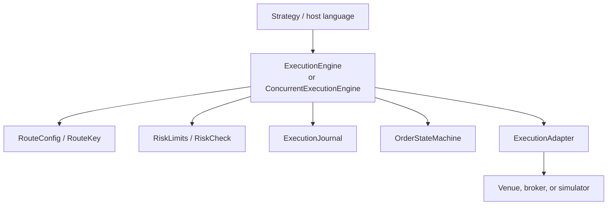

The synchronous [`ExecutionEngine`] is the canonical state owner. The
[`ConcurrentExecutionEngine`] is a wrapper that lets many producer threads
submit commands while one worker thread owns the synchronous engine.

[`ExecutionEngine::runbook_snapshot`] returns a factual
[`ExecutionRunbookSnapshot`] for dashboards and incident checklists. It now
includes global operator pause, route drain/degradation, and available-route
counts in addition to adapter, risk, order, and execution state.

[`ExecutionOperatorController`] executes authenticated, idempotent operational
commands with an audit intent written before any effect and a terminal outcome
written afterward. The host supplies [`ExecutionOperatorAuthorization`]; the
crate does not authenticate users or infer roles. Built-in actions cover:

- pause/resume global submissions;
- drain/restore and degrade/restore one complete route key;
- cancel all or cancel by route, account, strategy, symbol, or order;
- recover provider open orders and inspect stale local orders;
- reconcile, export an audit bundle, rotate WAL, force checkpoint, and clear a
  kill switch through typed [`ExecutionOperatorServices`].

The controller preallocates a bounded receipt horizon and rejects command-id
regressions/collisions. Exact retries return the original receipt. If the
outcome audit write fails after an effect, new submissions are paused and no
later command runs until the same command repairs the missing record.

[`FileExecutionOperatorAudit`] is a single-writer append-only journal with
versioned, checksummed binary frames and contiguous sequence validation.
`ExecutionOperatorController::restore` reconstructs idempotency receipts from
complete intent/outcome pairs; an unpaired intent fails closed because restart
cannot prove whether its side effect occurred. Call `restore_engine_controls`
before strategy flow to reapply successful pause, drain, and degraded-route
state without replaying external side effects.

```rust
use of_execution::{
    simulated_engine_with_routes, ExecutionEventBuffer,
    ExecutionOperatorAction, ExecutionOperatorAuthorization,
    ExecutionOperatorCommand, ExecutionOperatorCommandId,
    ExecutionOperatorController, ExecutionOperatorPermission,
    ExecutionOperatorPermissions, ExecutionStuckOrderBuffer,
    InMemoryExecutionOperatorAudit, NoExternalExecutionOperatorServices,
    RouteConfig,
};
use of_execution_core::{
    AccountId, ExecutionSymbol, RiskLimits, RouteId,
};

let route = RouteConfig {
    route_id: RouteId::new("SIM")?,
    account_id: AccountId::new("ACCOUNT-A")?,
    symbol: ExecutionSymbol::new("XCME", "ESM6")?,
    enabled: true,
    risk_limits: RiskLimits { kill_switch: false, ..RiskLimits::default() },
};
let mut engine = simulated_engine_with_routes(vec![route]);
engine.start()?;
let mut controller = ExecutionOperatorController::with_capacity(64)?;
let mut audit = InMemoryExecutionOperatorAudit::with_capacity(128)?;
let mut services = NoExternalExecutionOperatorServices;
let authorization = ExecutionOperatorAuthorization::from_actor(
    "ops-user",
    ExecutionOperatorPermissions::none()
        .with(ExecutionOperatorPermission::PauseSubmissions),
)?;
let command = ExecutionOperatorCommand::from_reason(
    ExecutionOperatorCommandId::new(1)?,
    ExecutionOperatorAction::PauseSubmissions,
    1_000,
    "venue incident",
)?;
let mut events = ExecutionEventBuffer::with_capacity(64);
let mut stuck = ExecutionStuckOrderBuffer::with_capacity(64)?;
let receipt = controller.execute(
    &mut engine,
    &mut services,
    &mut audit,
    authorization,
    command,
    1_001,
    &mut events,
    &mut stuck,
)?;
assert!(receipt.outcome.is_success());
assert!(engine.runbook_snapshot().submissions_paused);
# Ok::<(), Box<dyn std::error::Error>>(())
```

Operator cancellation bypasses ordinary strategy risk callbacks so emergency
cancel flow cannot be vetoed by a new-order policy. It still journals each
canonical cancel, uses the normal adapter/state-machine path, and returns
partial success/failure counters because external venue actions cannot be
transactionally rolled back.

[`ExecutionEngine::audit_bundle_manifest`] returns an
[`ExecutionAuditBundleManifest`] for incident export workflows. It combines the
runbook snapshot with journal command/event counts and execution metrics. Use
[`ExecutionEngine::audit_bundle_manifest_at`] in deterministic replay tests when
the bundle timestamp must be fixed.

## Incident Audit Bundle Export

[`ExecutionAuditBundleExporter`] turns the engine manifest and deployment-owned
evidence into one bounded, independently verifiable directory. Export is a
control-plane operation: it streams regular files through one reusable buffer,
hashes them with SHA-256, writes a versioned JSON manifest and manifest digest,
verifies the staged directory, and atomically renames it into place. It never
runs implicitly from submit, cancel, amend, report, or market-data paths.

The default [`ExecutionAuditBundleProfile::ProductionIncident`] fails closed
unless at least one present artifact covers every class in
[`ExecutionAuditArtifactKind::PRODUCTION_REQUIRED`]:

| Evidence class | Typical source |
| --- | --- |
| Execution WAL | Closed/rotated `SegmentedWalExecutionJournal` segment range |
| Execution checkpoint | Latest checkpoint at or before the incident boundary |
| Recovery report | Recovery plan, result, and integrity/readiness decision |
| Reconciliation report | OMS/venue/drop-copy/position reconciliation cycle |
| Route config | Already-redacted route and capability snapshot |
| Risk config | Already-redacted limits, policy version, and kill-switch state |
| Adapter health | Health transitions, sequence, queue, and reconnect state |
| Execution metrics | SLI/SLO snapshot and bounded operational counters |
| Market-data WAL | Relevant normalized/raw capture range and integrity report |
| Strategy intent | Parent/child lineage, decisions, and intent records |
| Drop copy | Independent report range and reconciliation watermark |
| Build metadata | Crate/binary versions, commit, target, config schema, deployment id |

[`ExecutionAuditBundleProfile::Custom`] is explicit and requires only artifacts
whose [`ExecutionAuditArtifact::is_required`] flag is true. Use it for tests or
deployment-specific evidence, not to label an incomplete package as a
production incident bundle. Optional missing files remain visible in the
manifest; they are not silently omitted.

```rust,no_run
use std::path::{Path, PathBuf};
use of_execution::{
    ExecutionAuditArtifact, ExecutionAuditArtifactKind as Kind,
    ExecutionAuditBundleConfig, ExecutionAuditBundleExporter,
    ExecutionAuditBundleManifest, ExecutionAuditBundleRequest,
    ExecutionAuditTimeRange,
};

fn export_incident(
    engine_manifest: ExecutionAuditBundleManifest,
    evidence: &Path,
    destination: &Path,
) -> Result<PathBuf, Box<dyn std::error::Error>> {
    // Rotate/close WAL inputs, force a checkpoint, and finish one fresh
    // reconciliation cycle before constructing this source inventory.
    let files = [
        (Kind::ExecutionWal, "execution/wal.ofwal", "execution/wal.ofwal"),
        (Kind::ExecutionCheckpoint, "execution/latest.ofcp", "execution/latest.ofcp"),
        (Kind::RecoveryReport, "reports/recovery.json", "reports/recovery.json"),
        (Kind::ReconciliationReport, "reports/reconciliation.json", "reports/reconciliation.json"),
        (Kind::RouteConfig, "config/routes.redacted.json", "config/routes.redacted.json"),
        (Kind::RiskConfig, "config/risk.redacted.json", "config/risk.redacted.json"),
        (Kind::AdapterHealth, "health/adapters.json", "health/adapters.json"),
        (Kind::ExecutionMetrics, "metrics/execution.json", "metrics/execution.json"),
        (Kind::MarketDataWal, "market-data/range.ofmdwal", "market-data/range.ofmdwal"),
        (Kind::StrategyIntent, "strategy/intents.log", "strategy/intents.log"),
        (Kind::DropCopy, "drop-copy/reports.log", "drop-copy/reports.log"),
    ];

    let mut request = ExecutionAuditBundleRequest::new(
        "INC_2026_0042",
        1_785_000_000_000_000_000,
        ExecutionAuditTimeRange::new(
            1_784_999_900_000_000_000,
            1_785_000_000_000_000_000,
        ),
    )
    .with_execution_manifest(engine_manifest);
    for (kind, source, bundle_path) in files {
        request.push_artifact(
            ExecutionAuditArtifact::from_file(kind, evidence.join(source), bundle_path)
                .with_source_label(kind.as_str()),
        );
    }
    request.push_artifact(ExecutionAuditArtifact::from_bytes(
        Kind::BuildMetadata,
        format!("of_execution={}\n", env!("CARGO_PKG_VERSION")).into_bytes(),
        "metadata/build.txt",
    ));

    let exporter = ExecutionAuditBundleExporter::new(
        ExecutionAuditBundleConfig::new(destination),
    );
    let installed = exporter.export(&request)?;
    let verified = exporter.verify(installed.bundle_path())?;
    assert_eq!(verified.manifest_sha256(), installed.manifest_sha256());
    Ok(installed.bundle_path().to_path_buf())
}
```

Capacity is explicit: the policy bounds manifest entries, each payload,
aggregate payload bytes, encoded manifest bytes, and copy-buffer size. Export
rejects absolute/traversing/non-portable paths, reserved or case-colliding
names, source and bundle symlinks, non-regular files, existing destinations,
digest mismatches, and unlisted files. A failed export removes only its private
staging directory; it never overwrites a completed bundle.

The manifest records logical source labels but never source filesystem paths.
Provide already-redacted route/risk configs and place the destination root on
trusted storage. SHA-256 proves that bytes differ from the recorded package; an
unkeyed digest does not authenticate the collector. Encryption, detached
signature/attestation, identity, legal hold, retention, and chain-of-custody
transfer remain deployment responsibilities. Sign the returned manifest digest
or the immutable package with the organization's approved key service after
export, and keep that attestation outside or in a separately governed evidence
system.

## Adapter Contract

Implement [`ExecutionAdapter`] to connect a venue, broker, simulator, REST API,
WebSocket API, FIX session, or native SDK.

Required methods:

- `connect()`
- `submit(req, out)`
- `cancel(req, out)`
- `amend(req, out)`
- `poll(out)`
- `recover_open_orders(out)`
- `capabilities()`
- `health()`

Adapters write canonical `ExecutionEvent` values into caller-owned
[`ExecutionEventBuffer`] instances. They should not leak provider-specific
report structs past the adapter boundary.

## ExecutionEventBuffer

[`ExecutionEventBuffer`] is a bounded event vector used by adapters and engine
calls.

Important behavior:

- `with_capacity(capacity)` allocates bounded storage.
- `push(event)` fails with [`ExecutionError::BufferFull`] when full.
- `clear()` retains capacity for reuse.
- `as_slice()` and `as_mut_slice()` expose currently stored events.
- `drain_into(out)` moves events into another bounded buffer.
- `max_len()` returns configured capacity.

This buffer model matters for low latency and FFI. The caller controls memory
growth and the engine never silently drops order events.

## Route Configuration

[`RouteConfig`] binds:

- `route_id`
- `account_id`
- `symbol`
- `enabled`
- `risk_limits`

The engine indexes routes by [`RouteKey`]:

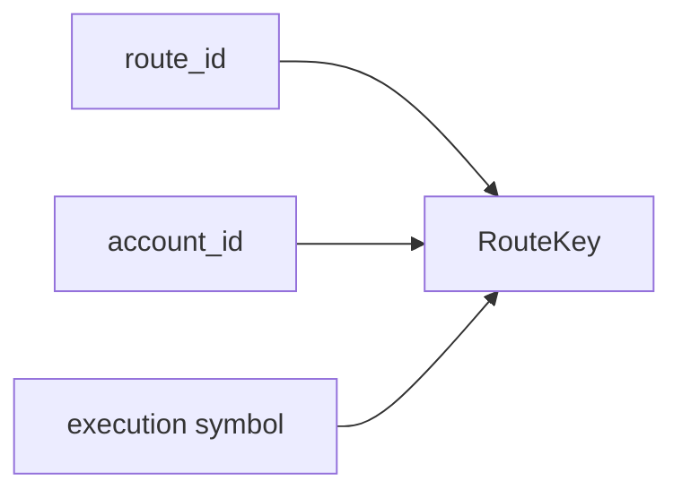

Open-order count and open notional are calculated only within the matched
route/account/symbol. This allows one engine to handle multiple symbols without
cross-symbol contamination.

Example:

- ES route: max one open order.
- NQ route: max one open order.
- A second ES order is rejected.
- A first NQ order is accepted.

## Synchronous Engine

[`ExecutionEngine<A, R, J>`] owns:

- adapter `A`
- risk gate `R`
- journal `J`
- route table
- order-state machines
- open-order price cache
- metrics
- scratch event buffer

Lifecycle:

1. Build the engine with `ExecutionEngine::new(adapter, risk, journal, routes)`.
2. Call `start()`.
3. Call `submit`, `cancel`, `amend`, `poll`, or `recover_open_orders`.
4. Inspect `order_state`, `metrics`, `health`, `routes`, or `replay_journal`.

Submit path:

1. reject if the engine is not started,
2. validate the request shape,
3. find the configured route,
4. build route-scoped risk context,
5. check route risk limits,
6. check custom risk gate,
7. record the command in the journal,
8. create local pending state,
9. call the adapter,
10. apply returned events through the state machine,
11. record events in the journal,
12. copy events to the caller output buffer.

The adapter never receives a request that failed local validation or pre-trade
risk.

Cancel and amend paths verify the original client order id is known locally.
Amends also check replacement quantity/notional before routing.

## Simulated Execution

[`SimExecutionAdapter`] is deterministic and intended for:

- integration tests,
- binding smoke tests,
- strategy validation,
- replay examples,
- examples that should not touch a live broker.

Helpers:

- [`simulated_engine`] creates a single-route engine.
- [`simulated_engine_with_routes`] creates a multi-route engine.

The multi-route helper uses route-scoped limits and [`AllowAllRiskGate`],
because the engine already enforces each route's [`RiskLimits`].

```rust
use of_execution::{simulated_engine_with_routes, ExecutionEventBuffer, RouteConfig};
use of_execution_core::{
    AccountId, ClientOrderId, ExecutionSymbol, OrderPrice, OrderQty,
    OrderRequest, OrderSide, OrderType, RiskLimits, RouteId, StrategyId,
    TimeInForce,
};

let route = RouteConfig {
    route_id: RouteId::new("SIM")?,
    account_id: AccountId::new("ACC")?,
    symbol: ExecutionSymbol::new("SIM", "ES")?,
    enabled: true,
    risk_limits: RiskLimits {
        kill_switch: false,
        max_order_qty: 100,
        max_order_notional: 1_000_000,
        max_open_orders: 10,
        max_open_notional: 10_000_000,
        price_band_ticks: 0,
    },
};

let mut engine = simulated_engine_with_routes(vec![route]);
engine.start()?;

let req = OrderRequest {
    client_order_id: ClientOrderId::new("C1")?,
    account_id: AccountId::new("ACC")?,
    route_id: RouteId::new("SIM")?,
    strategy_id: StrategyId::new("STRAT")?,
    symbol: ExecutionSymbol::new("SIM", "ES")?,
    side: OrderSide::Buy,
    order_type: OrderType::Limit,
    time_in_force: TimeInForce::Day,
    quantity: OrderQty::new(1)?,
    limit_price: OrderPrice::new(5000)?,
    stop_price: OrderPrice(0),
    ts_exchange_ns: 0,
    ts_recv_ns: 1,
};

let mut events = ExecutionEventBuffer::with_capacity(8);
engine.submit(req, &mut events)?;
assert!(!events.is_empty());
# Ok::<(), Box<dyn std::error::Error>>(())
```

## Deterministic Certification Venue

[`CertificationVenue`] is the strict, script-driven counterpart to
[`SimExecutionAdapter`]. Use the convenience simulator when a test only needs
an immediate accept/fill. Use the certification venue when an adapter, OMS,
recovery path, or duplicate guard must prove behavior under an exact sequence
of acknowledgements, fills, rejects, races, replay, and session faults.

The built-in scenarios cover:

| Order flow | Session and delivery faults |
| --- | --- |
| accept, reject, partial fill, full fill | disconnect, reconnect, deterministic slow delivery |
| cancel ack/reject, replace ack/reject | duplicate reports, out-of-order reports, resend |
| fill-versus-cancel/replace race | sequence reset, malformed provider response |
| open-order recovery restatement | bounded history and transcript eviction evidence |

This mirrors the responsibilities of FIX `ExecutionReport(35=8)`, which is
used for order acknowledgement, changes, status, fills, and rejection. A
retransmitted FIX report carries duplicate/replay identity, while venue
certification suites test acknowledgement, partial/complete fills,
cancel/replace, rejects, and abnormal recovery. See the official
[FIX ExecutionReport definition](https://fiximate.fixtrading.org/en/FIX.Latest/msg9.html)
and the
[CME AutoCert+ order-entry manual](https://www.cmegroup.com/tools-information/webhelp/acp-ebs-oe/Content/ebsoeusermanual.pdf).

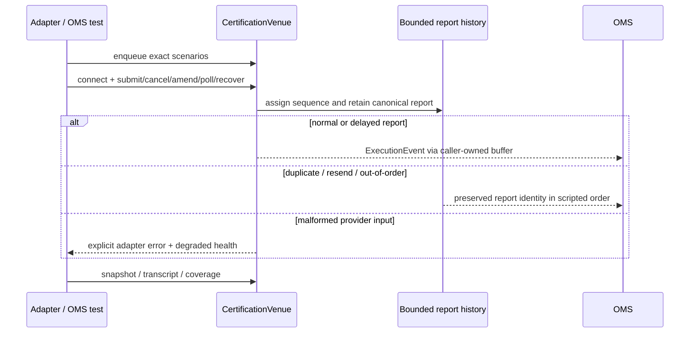

The venue reads no wall clock and uses no randomness. Construction reserves
the configured script, order, delayed-report, history, and transcript
collections. Command paths validate the full scripted action before consuming
it or emitting a report. Newly generated ids use fixed stack formatting;
normal report generation does not format JSON. Bounds are explicit:

- script and tracked-order exhaustion fail closed;
- output-buffer exhaustion returns [`ExecutionError::BufferFull`];
- delayed-report exhaustion returns a typed adapter failure;
- report history and transcript are bounded rings with visible eviction counts;
- replay scenarios preserve original `CertificationReport::sequence()` values;
- invalid provider bytes never become a fabricated canonical event.

The script queue is operation-sensitive. `Accept`, `Reject`, `PartialFill`, and
`FullFill` are consumed by `submit`; cancel and replace outcomes are consumed
by their matching operation; `RecoveryRestatement` is consumed by
`recover_open_orders`; session/delivery controls are consumed one per `poll`.
`CancelReplaceRace` may be consumed by either cancel or amend. A mismatched
operation does not consume the scenario.

```rust
use of_execution::{
    CertificationScenario, CertificationVenue, ExecutionAdapter,
    ExecutionEventBuffer,
};
use of_execution_core::{
    AccountId, ClientOrderId, ExecutionSymbol, OrderPrice, OrderQty,
    OrderRequest, OrderSide, OrderType, RouteId, StrategyId, TimeInForce,
};

let mut venue = CertificationVenue::default();
venue.enqueue_all([
    CertificationScenario::PartialFill {
        quantity: OrderQty(2),
        price: OrderPrice(5_250_00),
    },
    CertificationScenario::RecoveryRestatement,
])?;
venue.connect()?;

let request = OrderRequest {
    client_order_id: ClientOrderId::new("CERT-ORDER-1")?,
    account_id: AccountId::new("ACCOUNT-A")?,
    route_id: RouteId::new("CERT")?,
    strategy_id: StrategyId::new("TWAP-A")?,
    symbol: ExecutionSymbol::new("XCME", "ESM6")?,
    side: OrderSide::Buy,
    order_type: OrderType::Limit,
    time_in_force: TimeInForce::Day,
    quantity: OrderQty(10),
    limit_price: OrderPrice(5_250_00),
    stop_price: OrderPrice(0),
    ts_exchange_ns: 100,
    ts_recv_ns: 101,
};

let mut reports = ExecutionEventBuffer::with_capacity(8);
venue.submit(&request, &mut reports)?;
assert_eq!(reports.len(), 2); // ack, then partial fill

reports.clear();
assert_eq!(venue.recover_open_orders(&mut reports)?, 1);
assert_eq!(reports.len(), 1);
assert_eq!(venue.snapshot().remaining_scenarios(), 0);
# Ok::<(), Box<dyn std::error::Error>>(())
```

`CertificationCoverage::is_complete()` requires all 18 built-in scenario
kinds. `CertificationVenue::transcript()` records scenario, consuming command,
poll index, outcome, first report sequence, and report count. These are
deterministic test artifacts, not a claim of exchange certification. Real
production approval still requires the selected provider profile, credentials,
transport, and official venue test environment.

## Journaling

[`ExecutionJournal`] records commands and events:

- `record_command`
- `record_submit`
- `record_cancel`
- `record_amend`
- `record_event`
- `replay`

The request-aware methods have default implementations that delegate to
`record_command`. Existing third-party journals therefore keep compiling and
retain their original behavior. Binary WAL journals override the methods to
persist complete typed request payloads for deterministic crash recovery.

[`InMemoryJournal`] is useful for tests and embedded simulation.
[`FileExecutionJournal`] is an append-only durable implementation in the OMS
helper surface. [`WalExecutionJournal`] is an additive binary WAL-backed
implementation that uses `of_execution_core` WAL frames, sequence numbers,
checksums, and configurable sync policy.

Journal records use [`JournalRecord`]:

- `Command`
- `Event`

Command kinds use [`JournalCommandKind`]:

- `Submit`
- `Cancel`
- `Amend`

Production deployments can replace the journal with a WAL, mmap-backed writer,
database, or replicated log by implementing [`ExecutionJournal`].

### Binary WAL journal

[`WalExecutionJournal`] records the same [`JournalRecord`] model as
[`FileExecutionJournal`], but avoids text formatting on the journal path. It
owns WAL sequence assignment, validates existing bytes before accepting new
records, and replays into the existing journal output type. New engine writes
use versioned full-payload submit, cancel, and amend frames. Public replay still
projects those commands into the unchanged `JournalRecord::Command` shape.
Readers remain backward compatible with legacy command-only payload version 1.

```rust
use of_execution::{ExecutionJournal, WalExecutionJournal, WalJournalConfig};
use of_execution_core::{
    AccountId, ClientOrderId, ExecutionSymbol, FixedAscii, OrderPrice, OrderQty,
    OrderRequest, OrderSide, OrderType, RouteId, StrategyId, TimeInForce,
    VenueId, InstrumentId, WalSequence, WalSyncPolicy,
};

let path = std::env::temp_dir().join("orders.ofwal");
let mut journal = WalExecutionJournal::open(
    WalJournalConfig::new(&path).with_sync_policy(WalSyncPolicy::EveryNRecords(32)),
)?;

let request = OrderRequest {
    client_order_id: ClientOrderId::new("C1")?,
    account_id: AccountId::new("ACC")?,
    route_id: RouteId::new("SIM")?,
    strategy_id: StrategyId::new("TWAP")?,
    symbol: ExecutionSymbol {
        venue: VenueId::new("SIM")?,
        instrument: InstrumentId::new("ES")?,
    },
    side: OrderSide::Buy,
    order_type: OrderType::Limit,
    time_in_force: TimeInForce::Day,
    quantity: OrderQty(10),
    limit_price: OrderPrice(5_000),
    stop_price: OrderPrice(0),
    ts_exchange_ns: 900,
    ts_recv_ns: 1_000,
};
journal.record_submit(&request)?;
journal.sync()?;

let report = journal.integrity_report()?;
assert!(report.valid);

let metrics = journal.metrics();
assert_eq!(metrics.records_written, 1);

let mut replayed = Vec::new();
let replay = journal.replay_from(WalSequence(1), &mut replayed)?;
assert_eq!(replay.records, replayed.len());
# let _ = std::fs::remove_file(path);
# Ok::<(), Box<dyn std::error::Error>>(())
```

Supported sync policies come from `of_execution_core::WalSyncPolicy`:

- `Never`
- `EveryRecord`
- `EveryNRecords(n)`
- `EveryDurationNs(ns)`
- `Manual`
- `OnRiskBoundary`

[`WalJournalMetrics`] records successful WAL frames/bytes, write latency, sync
latency, sync failures, write failures, segment rotations, and manifest writes.
The snapshot is copyable and allocation-free so hosts can export it out of band
to Prometheus, statsd, or tracing systems without formatting on the order path.

### Segmented WAL journal

[`SegmentedWalExecutionJournal`] uses the same binary WAL frames and
[`ExecutionJournal`] model as [`WalExecutionJournal`], but stores records in an
ordered segment directory:

```text
execution-wal/
  manifest
  wal-000000000001.ofwal
  wal-000000000002.ofwal
```

The journal rotates before appending a normal command/event record when either
`WalSegmentConfig::max_segment_bytes()` or
`WalSegmentConfig::max_segment_records()` would be exceeded. Rotation appends a
`SegmentSeal` WAL frame to the old segment, opens the next segment file, and
updates the manifest. Seal frames consume WAL sequence numbers so checksum and
sequence validation remain continuous across files, but replay skips them and
returns only [`JournalRecord`] values.

```rust
use of_execution::{
    ExecutionJournal, JournalCommandKind, SegmentedWalExecutionJournal,
    WalSegmentConfig,
};
use of_execution_core::{ClientOrderId, WalSequence, WalSyncPolicy};

let root = std::env::temp_dir().join(format!("execution-wal-{}", std::process::id()));
let _ = std::fs::remove_dir_all(&root);
let mut journal = SegmentedWalExecutionJournal::open(
    WalSegmentConfig::new(&root)
        .with_sync_policy(WalSyncPolicy::EveryNRecords(64))
        .with_max_segment_records(1_000_000)
        .with_max_segment_bytes(64 * 1024 * 1024),
)?;

journal.record_command(
    JournalCommandKind::Submit,
    ClientOrderId::new("C1")?,
    1_000,
)?;
journal.sync()?;

let manifest = journal.manifest();
assert!(manifest.active_segment().is_some());
assert_eq!(journal.metrics().records_written, 1);

let mut replayed = Vec::new();
let replay = journal.replay_from(WalSequence(1), &mut replayed)?;
assert_eq!(replay.records, replayed.len());
# let _ = std::fs::remove_dir_all(root);
# Ok::<(), Box<dyn std::error::Error>>(())
```

Recovery does not trust the manifest as source of truth. Opening the journal
scans `wal-*.ofwal` files in segment-id order, validates checksums and
sequences across segment boundaries, reconstructs the manifest, and fails
closed on corrupt or non-contiguous data. The manifest is an operator inventory
and discovery aid.

Use `SegmentedWalExecutionJournal::inspect_root(root)` when an operator or
binding needs a read-only integrity report without creating a new active
segment. The report returns segment count, valid record/byte counts, optional
sequence range, checksum failures, sequence failures, and a `valid` flag. It is
intended for recovery drills, restart checks, and archival validation outside
the order-submission path.

Checkpoint marker records remain a separate additive feature so the
compatibility boundary stays narrow.

### Checkpoint store

[`FileExecutionCheckpointStore`] stores versioned OMS checkpoints outside the
hot order path. Checkpoints are written to a temporary file, flushed, optionally
synced, and atomically renamed into place. Each checkpoint carries a checksum
over its payload, and corrupt checkpoints are rejected on load.

The first checkpoint format captures:

- last fully applied WAL sequence;
- route configuration hash selected by the host;
- open order states;
- position snapshots;
- kill-switch state.

```rust
use of_execution::{
    CheckpointConfig, ExecutionCheckpoint, ExecutionCheckpointStore,
    FileExecutionCheckpointStore,
};
use of_execution_core::WalSequence;

let root = std::env::temp_dir().join(format!("orderflow-checkpoints-{}", std::process::id()));
let _ = std::fs::remove_dir_all(&root);
let mut store = FileExecutionCheckpointStore::open(
    CheckpointConfig::new(&root).with_sync_on_save(false),
)?;

let checkpoint = ExecutionCheckpoint::new(1, WalSequence(42), 1_000)
    .with_route_config_hash(7);

let manifest = store.save_checkpoint(&checkpoint)?;
assert_eq!(manifest.last_applied_sequence, WalSequence(42));

let latest = store.load_latest()?.expect("checkpoint");
assert_eq!(latest.checkpoint_id, 1);
assert!(store.validate_checkpoint(&latest)?);
# let _ = std::fs::remove_dir_all(root);
# Ok::<(), Box<dyn std::error::Error>>(())
```

`CheckpointPolicy` is metadata for hosts and future checkpoint schedulers. This
store does not start background writers or block the OMS worker automatically;
callers decide when to construct and save snapshots.

Use `FileExecutionCheckpointStore::inspect_root(root)` for read-only startup and
operator diagnostics. The report counts discovered, valid, and invalid
checkpoint files, totals checkpoint bytes, and identifies the latest valid
checkpoint id, covered WAL sequence, and creation timestamp. It does not create
the store directory, save checkpoints, prune files, or mutate the checkpoint
root.

### Recovery plan

[`RecoveryPlan`] describes a deterministic replay before recovery starts:

- first WAL sequence to replay;
- optional latest sequence expected by the caller;
- fail-closed corruption policy;
- venue reconciliation policy;
- whether strategy submissions remain disabled after recovery.

[`recover_latest_checkpoint_from_segmented_wal`] loads the newest valid
checkpoint from an [`ExecutionCheckpointStore`], builds a plan from
`last_applied_sequence + 1`, replays the segmented WAL tail, and returns a
[`RecoveryResult`] with [`RecoveredOmsState`].

For operator tooling and language bindings, use
[`recover_latest_checkpoint_from_segmented_wal_roots`]. It opens existing WAL
and checkpoint roots read-only, optionally requires a checkpoint, and never
creates directories, opens append handles, calls a venue, or enables order
submission. [`recover_oms_state_from_segmented_wal_root`] provides the same
read-only root handling when the caller already has a [`RecoveryPlan`].

```rust
use of_execution::{
    recover_latest_checkpoint_from_segmented_wal, CheckpointConfig,
    FileExecutionCheckpointStore, SegmentedWalExecutionJournal, WalSegmentConfig,
};
use of_execution_core::WalSyncPolicy;

let checkpoints = std::env::temp_dir().join(format!(
    "orderflow-checkpoints-recovery-{}",
    std::process::id()
));
let wal = std::env::temp_dir().join(format!("execution-wal-recovery-{}", std::process::id()));
let _ = std::fs::remove_dir_all(&checkpoints);
let _ = std::fs::remove_dir_all(&wal);

let store = FileExecutionCheckpointStore::open(
    CheckpointConfig::new(&checkpoints).with_sync_on_save(false),
)?;
let journal = SegmentedWalExecutionJournal::open(
    WalSegmentConfig::new(&wal).with_sync_policy(WalSyncPolicy::Never),
)?;

let result = recover_latest_checkpoint_from_segmented_wal(&store, &journal)?;
assert!(result.venue_reconciliation_required);
# let _ = std::fs::remove_dir_all(checkpoints);
# let _ = std::fs::remove_dir_all(wal);
# Ok::<(), Box<dyn std::error::Error>>(())
```

Recovery reconstructs pending-new orders from full submit payloads before
applying later execution events. A durable cancel or amend with no subsequent
venue response restores the original order as `PendingCancel` or
`PendingReplace`, making the crash-boundary uncertainty explicit. Legacy
version-1 command records remain readable through the journal replay API, but
read-only state reconstruction fails closed if one is needed after the selected
checkpoint because it lacks the complete request. Production hosts should
checkpoint frequently and must reconcile recovered open orders against venue
truth before submissions resume.

`RecoveryResult::json_report()` emits a bounded schema-versioned operational
summary. It intentionally omits order, account, strategy, and venue identifiers
while reporting checkpoint selection, state counts, replay bounds, and the
submission/reconciliation gates. Treat it as startup evidence, not authority to
trade: `submissions_enabled` remains `false` and
`venue_reconciliation_required` remains `true`.

### Recovery readiness gate

[`evaluate_recovery_readiness`] combines the independent restart evidence into
one typed, fail-closed resume decision:

- segmented WAL integrity;
- checkpoint-store integrity;
- latest recovered WAL sequence;
- whether recovery still disables submissions;
- required venue reconciliation;
- reconciliation policy actions such as venue cancels, local restates, and
  operator approval.

The gate does not perform I/O, replay WAL bytes, mutate checkpoints, call
venues, or enable trading. It is a deterministic policy evaluator over reports
the host already produced during startup. That keeps the low-latency restart
path explicit and lets production hosts replace the policy without replacing
the WAL or checkpoint implementations.

```rust
use of_execution::{
    evaluate_reconciliation_policy, evaluate_recovery_readiness,
    recover_oms_state_from_records, CheckpointStoreIntegrityReport,
    ReconciliationPolicy, RecoveryPlan, RecoveryReadinessConfig,
    VenueReconciliationReport,
    RecoveryVenuePolicy, WalSegmentIntegrityReport,
};
use of_execution_core::WalSequence;

let recovery = recover_oms_state_from_records(
    RecoveryPlan::new(WalSequence(1))
        .with_venue_policy(RecoveryVenuePolicy::HostControlled)
        .with_submissions_disabled(false),
    None,
    &[],
)?;
let mut wal = WalSegmentIntegrityReport::default();
wal.valid = true;
wal.last_sequence = Some(WalSequence(10));
let mut checkpoints = CheckpointStoreIntegrityReport::default();
checkpoints.valid = true;
checkpoints.latest_checkpoint_id = Some(3);
checkpoints.latest_last_applied_sequence = Some(WalSequence(10));
let reconciliation_report = VenueReconciliationReport::default();
let reconciliation =
    evaluate_reconciliation_policy(&reconciliation_report, ReconciliationPolicy::default());

let decision = evaluate_recovery_readiness(
    &recovery,
    &wal,
    &checkpoints,
    Some(&reconciliation),
    RecoveryReadinessConfig::strict(),
);
assert!(decision.is_ready());
# Ok::<(), Box<dyn std::error::Error>>(())
```

## Concurrent Worker

[`ConcurrentExecutionEngine`] gives concurrent producer access while preserving
single-owner order-state mutation.

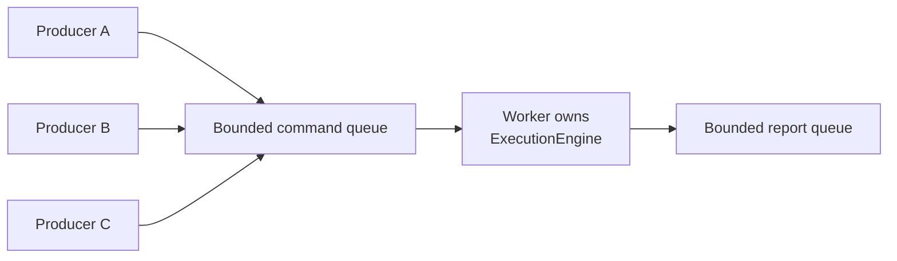

Properties:

- many producer handles can enqueue commands,
- command queue capacity is explicit,
- report queue capacity is explicit,
- the worker owns adapter and order state,
- reports include command sequence, command kind, result, and events,
- no Tokio runtime is required,
- order-state transitions remain serial and deterministic.

Use [`ExecutionCommandSender`] when producers should not own the worker handle.

Important methods:

- `ConcurrentExecutionEngine::spawn(engine, config)`
- `command_sender()`
- `send(command)`
- `try_send(command)`
- `recv_report()`
- `try_recv_report()`
- `recv_report_timeout(timeout)`
- `request_stop()`
- `join()`

The sender exposes convenience methods:

- `submit(req)`
- `try_submit(req)`
- `cancel(req)`
- `amend(req)`
- `poll()`
- `recover_open_orders()`
- `stop()`

[`ConcurrentExecutionError::Backpressure`] means the bounded command or report
path is full. Callers should retry, pause strategy intent, alert, or trip a
circuit breaker instead of assuming the command was accepted.

## OMS Helper Surface

### Command correlation

[`CommandId`], [`RequestId`], [`CommandIdGenerator`], and
[`CommandCorrelation`] let hosts associate strategy intent, submitted commands,
and reports without relying only on venue ids.

### Idempotent command admission

[`IdempotencyRegistry`] protects submit, cancel, and amend commands against
strategy retries, reconnect retries, and replay duplicates without changing
[`ExecutionEngine`]. A key is the pair `(scope_id, request_id)`. The scope keeps
identical request strings from independent gateways, tenants, or sessions from
colliding. [`CommandId`] and the retained client/provider IDs provide the rest
of the trace:

```mermaid
sequenceDiagram
    participant Strategy
    participant Guard as IdempotencyRegistry
    participant WAL as Durable OMS WAL
    participant Adapter
    participant Venue
    Strategy->>Guard: reserve(scope, request, command, parameters)
    alt first request
        Guard-->>Strategy: Accepted(original record)
        Strategy->>WAL: append command + correlation
        Strategy->>Guard: mark_journaled
        Strategy->>Adapter: send with stable provider ID
        Strategy->>Guard: mark_sent
        Adapter->>Venue: provider command
        Venue-->>Adapter: ack / reject
        Adapter-->>Guard: complete
    else matching retry
        Guard-->>Strategy: Duplicate(original state; do not send)
    else same key, different parameters
        Guard-->>Strategy: ParameterMismatch; fail closed
    end
```

The registry compares every semantic field but ignores request transport
timestamps. Therefore, a reconstructed retry may carry a later receive time,
while a changed quantity, price, route, account, symbol, side, order type,
time-in-force, original client ID, or venue ID is rejected. This follows the
common idempotent API rule that the same client token and same parameters return
the original outcome, while changed parameters fail validation. FIX profiles
still own their exact counterparty rules: FIX `ClOrdID(11)` is expected to be
unique in its sender scope, and retransmission behavior must follow the
session/profile contract.

The registry also maintains bounded uniqueness indexes for `CommandId`, current
client order ID, and `AdapterCommandId`. Two distinct retained requests cannot
share any of those identities. Matching retries always return the identities
owned by the original record.

This matches the
[AWS client-token guidance](https://docs.aws.amazon.com/ec2/latest/devguide/ec2-api-idempotency.html),
which returns the original result for a matching token/payload and rejects a
token reused with different parameters. Adapter profiles should also follow
the official FIX definition of
[`ClOrdID(11)`](https://fiximate.fixtrading.org/en/FIX.Latest/tag11.html) and
their counterparty's duplicate/replay rules; the generic registry does not
override venue certification requirements.

```rust
use of_execution::{
    AdapterCommandId, CommandId, IdempotencyCompletion, IdempotencyDecision,
    IdempotencyKey, IdempotencyRegistry, IdempotencyScopeId,
    IdempotentExecutionCommand, RequestId,
};
use of_execution_core::{
    AccountId, ClientOrderId, ExecutionSymbol, OrderPrice, OrderQty,
    OrderRequest, OrderSide, OrderType, RouteId, StrategyId, TimeInForce,
};

let key = IdempotencyKey::new(
    IdempotencyScopeId::new("gateway-a")?,
    RequestId::new("strategy-request-42")?,
)?;
let request = OrderRequest {
    client_order_id: ClientOrderId::new("GW-A-000042")?,
    account_id: AccountId::new("ACCOUNT-A")?,
    route_id: RouteId::new("FIX-A")?,
    strategy_id: StrategyId::new("TWAP-A")?,
    symbol: ExecutionSymbol::new("XCME", "ESM6")?,
    side: OrderSide::Buy,
    order_type: OrderType::Limit,
    time_in_force: TimeInForce::Day,
    quantity: OrderQty(2),
    limit_price: OrderPrice(5_250_00),
    stop_price: OrderPrice(0),
    ts_exchange_ns: 0,
    ts_recv_ns: 100,
};

let mut guard = IdempotencyRegistry::new(65_536)?;
let decision = guard.reserve(
    1,
    100,
    key,
    CommandId(42),
    IdempotentExecutionCommand::Submit(request),
)?;
assert!(matches!(decision, IdempotencyDecision::Accepted(_)));

// Only advance after the corresponding host operation succeeded.
// 1. Append the command and correlation to the durable OMS WAL.
guard.mark_journaled(2, 101, key)?;
// 2. Send through the adapter using this stable provider/FIX identity.
guard.mark_sent(3, 102, key, AdapterCommandId::new("GW-A-000042")?)?;
// 3. Fold the authoritative adapter/venue outcome.
guard.complete(4, 110, key, IdempotencyCompletion::Acknowledged)?;

// A retry returns the original record and must not call the adapter again.
let retry = guard.reserve(
    4,
    200,
    key,
    CommandId(99),
    IdempotentExecutionCommand::Submit(OrderRequest {
        ts_recv_ns: 200,
        ..request
    }),
)?;
assert!(retry.is_duplicate());
assert_eq!(retry.record().command_id, CommandId(42));
# Ok::<(), Box<dyn std::error::Error>>(())
```

State progression is strict and caller-sequenced:

```mermaid
stateDiagram-v2
    [*] --> Reserved
    Reserved --> Journaled: durable append succeeded
    Reserved --> Rejected: local/risk rejection
    Reserved --> FailedDefinitive: definitive local failure
    Journaled --> Sent: adapter send attempted
    Journaled --> RecoveryPending: outcome uncertain
    Sent --> Acknowledged: authoritative acceptance
    Sent --> Rejected: authoritative rejection
    Sent --> FailedDefinitive: definitive failure
    Sent --> RecoveryPending: disconnect / timeout / restart
    RecoveryPending --> Journaled: reconciled absent; retry exact command
    RecoveryPending --> Acknowledged: reconciled accepted
    RecoveryPending --> Rejected: reconciled rejected
```

Important operational rules:

- reserve before creating side effects;
- persist the command/key/correlation before `mark_journaled`;
- never call `mark_sent` until the adapter accepted ownership of the send;
- reuse the retained adapter ID after an authoritative absent-order result;
- never blindly resend a restored or uncertain command;
- checkpoint the registry with the same ordering authority as the OMS WAL;
- restore marks every non-terminal command `RecoveryPending`;
- retire terminal keys only after durable archival and the upstream retry
  horizon, because retirement deliberately removes duplicate protection;
- size capacity for the full active plus terminal retention horizon. The
  registry never evicts a command key implicitly and returns
  [`IdempotencyError::CapacityExceeded`] instead.

[`IdempotencyCheckpoint`] is schema-versioned, deterministically key-sorted,
and checksummed over complete records. `encoded_len` plus `encode_into` provide
a canonical allocation-free binary write into a caller-owned buffer;
`IdempotencyCheckpoint::decode` validates magic, schema, lengths, enum values,
checksum, and trailing bytes before restore. Checkpoint creation and decode
allocate and belong on the control plane; admission, lookup, encoding, and state
transitions use caller/preallocated storage. Clocks, file writes, adapter sends,
and callbacks remain host-owned and outside the registry.

### Execution-report duplicate protection

[`ExecutionReportDeduplicator`] is a separate bounded FIFO identity window for
primary execution reports, replay, and drop copy. [`ExecutionReportKey`] scopes
an execution ID to its source/session; when no execution ID exists it uses a
source sequence. If an execution ID exists, sequence changes during replay do
not defeat duplicate detection.

Call `observe` before applying an event to order state or the position ledger.
Apply only [`ExecutionReportDisposition::Fresh`]. The window preallocates its
set and FIFO. Unlike command keys, report identities use an explicit sliding
horizon and evict the oldest identity when full; monitor
`ExecutionReportDedupMetrics::evicted` and size the horizon above the maximum
replay/resend window. [`ExecutionReportDedupCheckpoint`] preserves exact
oldest-to-newest eviction order across restart and exposes the same
`encoded_len`, `encode_into`, and `decode` persistence pattern.

The specialized [`DropCopyReconciler`] and [`ProductionPositionLedger`] retain
their own source-scoped duplicate controls. Use one clear deduplication owner
per ingestion path; do not count a report as independently accepted at several
layers.

### Event fanout

[`ExecutionEventFanout`] publishes execution events to bounded
[`ExecutionEventSubscriber`] queues.

Full subscriber queues drop deliveries and increment `dropped_events()`.
This is suitable for telemetry or UI subscribers that must not block the main
execution path.

### Lifecycle

[`ExecutionLifecycle`] tracks [`ExecutionAdapterState`] transitions and returns
[`ExecutionLifecycleSnapshot`] values. Use it to expose adapter state changes
such as disconnected, connecting, ready, recovering, degraded, and stopped.

### Durable journal

[`FileExecutionJournal::open(path, sync_on_write)`] creates an append-only
journal. `sync_on_write = true` is safer but slower. `false` is faster but less
durable on sudden power loss.

### Reconciliation

[`reconcile_open_orders(local, venue)`] compares local open-order state against
venue open-order state and returns a [`ReconciliationReport`].

Actions:

- [`ReconciliationAction::Matched`]
- [`ReconciliationAction::VenueOnly`]
- [`ReconciliationAction::LocalOnly`]
- [`ReconciliationAction::RestateFromVenue`]

The function reports differences. It does not mutate state or cancel orders.

Use [`reconcile_open_orders_detailed`] when recovery or live monitoring needs a
more precise discrepancy type:

- [`ReconciliationIssueKind::Matched`]
- [`ReconciliationIssueKind::VenueOnly`]
- [`ReconciliationIssueKind::LocalOnly`]
- [`ReconciliationIssueKind::QuantityMismatch`]
- [`ReconciliationIssueKind::StatusMismatch`]
- [`ReconciliationIssueKind::PriceMismatch`]
- [`ReconciliationIssueKind::Unknown`]

[`ReconciliationPolicy`] maps those issues to host actions such as fail closed,
accept venue truth, cancel venue-only orders, restate venue-only orders, or
require operator approval. [`evaluate_reconciliation_policy`] returns a
[`ReconciliationPolicyDecision`] that keeps submissions disabled until required
host action completes.

[`ExecutionEngine::reconcile_open_orders_with`] and
[`ExecutionEngine::evaluate_reconciliation`] apply the same logic to the
engine's current local non-terminal orders and a venue open-order snapshot.

### Generalized reconciliation cycle

[`OmsReconciliationCoordinator`] combines the existing order, drop-copy,
checkpoint/WAL, and production-position reconciliation primitives under one
explicit recovery gate. It does not mutate OMS state or call providers. Hosts
first obtain authoritative snapshots, then supply one
[`OmsEvidenceWatermark`] per source and compare the relevant data.

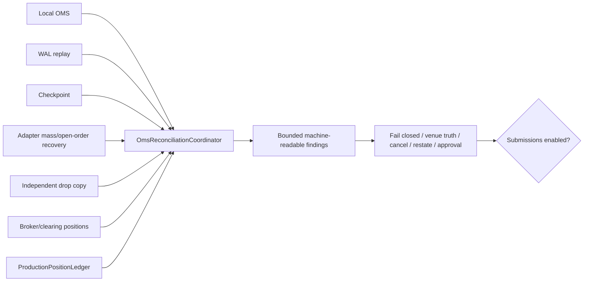

Sources are [`OmsReconciliationSource::LocalOms`], `WalReplay`, `Checkpoint`,
`AdapterRecovery`, `DropCopy`, `BrokerPositions`, and `PositionLedger`.
[`OmsReconciliationSourceSet`] declares which are mandatory for a deployment.
Each watermark carries integrity status, complete sequence, as-of time, and
claimed order/position counts. The coordinator turns missing, corrupt, stale,
incomplete, sequence-lagged, or row-count-inconsistent evidence into findings.

Order comparison uses `(account, route, venue, symbol, client_order_id)` scope,
preserves deterministic input order, reports duplicate identities instead of
overwriting them, and classifies:

- `Matched`, `VenueOnly`, and `LocalOnly`;
- `StatusMismatch`, `QuantityMismatch`, and `PriceMismatch`;
- `Unknown` for direction or accepted/venue identity conflicts; and
- `DuplicateEvidence`.

Position comparison remains owned by [`reconcile_production_positions`]. Pass
its [`PositionReconciliationBuffer`] to `observe_position_report`; all exact
position issue flags become `PositionMismatch`, while duplicate external keys
remain `DuplicateEvidence`.

```rust
use of_execution::{
    OmsEvidenceStatus, OmsEvidenceWatermark, OmsReconciliationBuffer,
    OmsReconciliationConfig, OmsReconciliationCoordinator,
    OmsReconciliationPolicy, OmsReconciliationSource,
    OmsReconciliationSourceSet,
};
# let local_orders: &[of_execution_core::OrderState] = &[];
# let venue_orders: &[of_execution_core::OrderState] = &[];

let required = OmsReconciliationSourceSet::one(OmsReconciliationSource::LocalOms)
    .with(OmsReconciliationSource::WalReplay)
    .with(OmsReconciliationSource::Checkpoint)
    .with(OmsReconciliationSource::AdapterRecovery);
let mut cycle = OmsReconciliationCoordinator::new(
    OmsReconciliationConfig::new(required)
        .with_max_sequence_lag(0)
        .with_stale_after_ns(5_000_000_000),
    OmsReconciliationPolicy::fail_closed(),
);
let mut findings = OmsReconciliationBuffer::with_capacity(10_000);
cycle.begin_cycle(7, 42_000, 10_000_000_000, &mut findings)?;
for source in [
    OmsReconciliationSource::LocalOms,
    OmsReconciliationSource::WalReplay,
    OmsReconciliationSource::Checkpoint,
    OmsReconciliationSource::AdapterRecovery,
] {
    cycle.observe_source(
        OmsEvidenceWatermark::new(
            source,
            OmsEvidenceStatus::Valid,
            42_000,
            9_999_000_000,
            local_orders.len() as u32,
            0,
        ),
        &mut findings,
    )?;
}
cycle.reconcile_orders(
    OmsReconciliationSource::AdapterRecovery,
    local_orders,
    venue_orders,
    &mut findings,
)?;
let summary = cycle.finish(&mut findings)?;
assert_eq!(summary.submissions_enabled, findings.as_slice().is_empty());
# Ok::<(), Box<dyn std::error::Error>>(())
```

[`OmsReconciliationPolicy`] defaults every discrepancy to `FailClosed` and can
map individual issues to `AcceptObservedTruth`, `CancelObservedOrder`,
`RestateLocal`, or `RequireOperatorApproval`. These actions describe required
host work; they never mutate state automatically. After action completion,
start a new cycle with fresh evidence before enabling submissions.

Reconciliation is a recovery/operations path, not an order hot path. Snapshot
comparison allocates temporary hash indexes, while findings use caller-owned
bounded storage. [`OmsReconciliationError::BufferFull`] is explicit and never
silently truncates evidence. Size output for the worst-case sum of source,
duplicate, order, and position discrepancies.

### Independent drop copy

[`DropCopyAdapter`] is deliberately separate from [`ExecutionAdapter`]. A
provider can therefore run order entry and independent execution evidence on
different transports, credentials, sessions, and recovery sequences without
changing existing execution adapter implementations.

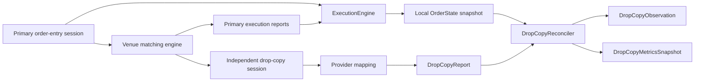

Provider adapters decode their wire message into an [`ExecutionEvent`] and
place it in [`DropCopyReport`]. The envelope adds the independent source id,
provider report id, source sequence, and local receive timestamp needed for
deduplication and audit. Report identity is scoped by source. When a provider
does not expose a report id, a nonzero source sequence is the fallback key;
when neither exists, [`DropCopyIssueFlags::MISSING_DUPLICATE_KEY`] makes the
loss of protection explicit.

[`DropCopyReconciler`] correlates venue order id first, then current, previous,
or original client order id. It compares account, route, symbol, status,
cumulative quantity, leaves quantity, average price, and trade quantity
invariants. It reports differences as a compact [`DropCopyIssueFlags`] bitset
without mutating the engine. Venue-only evidence remains visible instead of
being silently inserted into local state.

```rust
use of_execution::{
    DropCopyLateReportPolicy, DropCopyReconciler, DropCopyReport,
};
use of_execution_core::OrderState;

fn inspect_drop_copy(report: &DropCopyReport, local_orders: &[OrderState]) {
    let mut reconciler = DropCopyReconciler::new(
        16_384, // retained report identities
        8_192,  // local/progress order identities
        DropCopyLateReportPolicy::AuditOnly,
    );
    reconciler.replace_local_orders(local_orders);

    let observation = reconciler.observe(report);
    if observation.reconciliation_eligible() && observation.has_state_mismatch() {
        // Keep submissions fail-closed and send the issue bitset to the
        // operator/reconciliation control plane.
    }
    let metrics = reconciler.metrics();
    assert_eq!(metrics.reports_received, 1);
}
```

Late handling is explicit. A lower exchange timestamp or cumulative fill than
previous independent evidence is classified as late. `AcceptAndFlag` keeps it
eligible, `AuditOnly` retains evidence without treating it as current, and
`Reject` excludes it from reconciliation. Duplicate reports are always marked
`Duplicate` and are not reconciled twice.

Capacity is part of the operational contract:

- [`DropCopyReportBuffer`] and [`InMemoryDropCopyAdapter`] never grow beyond
  their configured queue bounds;
- duplicate retention uses a fixed-capacity FIFO window;
- progress tracking does not grow on the report path after its configured
  capacity is reached;
- [`DropCopyIssueFlags::TRACKING_CAPACITY_EXHAUSTED`] and
  [`DropCopyMetricsSnapshot::tracking_capacity_exhaustions`] expose undersized
  deployments;
- caller-supplied timestamps keep clock reads outside the reconciliation path;
- JSON, logging, metric formatting, alerting, and policy actions stay in the
  host control plane.

Refreshing local orders is a control-plane operation and can allocate if the
new snapshot exceeds the initial capacity. Size the reconciler from expected
peak open-order cardinality, and alert on duplicate-window turnover,
`venue_only_reports`, `mismatched_reports`, `late_reports`, source state, and
drop-copy lag.

### Scoped kill switches

The existing `RiskLimits::kill_switch` route flag remains valid. The additive
[`KillSwitchRegistry`] handles production workflows that need several active,
independently auditable scopes at once:

- global;
- venue;
- route;
- account;
- strategy;
- symbol;
- order type; and
- adapter/session.

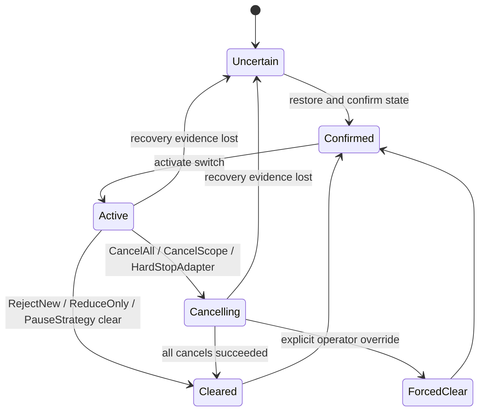

[`KillSwitchRegistry::new`] starts in
[`KillSwitchStateCertainty::Uncertain`], and all new orders fail closed until
the host restores durable state and calls `confirm_state`. Use
[`KillSwitchRegistry::confirmed_empty`] only when the host has authoritative
evidence that a new session has no active switches. Mark state uncertain again
whenever WAL, checkpoint, or operator-control recovery is incomplete.

Evaluate a request before normal route risk and before provider I/O:

```rust
use of_execution::{KillSwitchRegistry, KillSwitchSessionId};
use of_execution_core::OrderRequest;

fn can_submit(
    registry: &KillSwitchRegistry,
    request: &OrderRequest,
    signed_position: i64,
) -> bool {
    let session = KillSwitchSessionId::new("fix-order-entry-a").unwrap();
    registry
        .evaluate_request(request, signed_position, session)
        .allow_new_order
}
```

Modes have distinct operational meaning:

- `RejectNew` blocks matching submissions but keeps cancels available;
- `CancelAll` blocks every submission and selects every supplied open order,
  regardless of the scope value;
- `CancelScope` blocks and selects only matching orders;
- `ReduceOnly` permits an order only when side and quantity strictly reduce the
  supplied signed position without crossing through zero;
- `PauseStrategy` blocks matching strategy commands while preserving cancels;
- `HardStopAdapter` selects matching open orders, blocks submissions, marks
  cancel flow unavailable after shutdown, and tells the host to stop the
  adapter/session.

Activation accepts current open-order contexts and writes cancellation targets
to a caller-owned [`KillSwitchAffectedOrderBuffer`]. The returned
[`KillSwitchEvent`] contains the full scope, mode, actor/system source, reason,
timestamp, WAL sequence, affected/captured counts, truncation status, cancel
counts, aggregate outcome, state certainty, and forced-clear status. Journal
the event and each later cancel-progress/clear event before exposing them to
operator tooling.

Cancellation targets and results are bounded and preallocated. A result is
accepted once, only for an order captured at activation. If target output or
internal result capacity is too small, the activation event remains visibly
truncated and cannot reach `AllSucceeded`; clearing then requires a deliberate
forced override. This prevents a partial cancellation list from being mistaken
for a clean kill.

The registry does not call adapters, write a WAL, authenticate operators, or
invent timestamps. Those actions belong to the host because venue APIs,
permissions, durability policies, and adapter shutdown mechanics differ. The
typed outputs make those actions explicit while the matching and decision path
stays allocation-free after construction.

Operational references:

- [CME Globex Kill Switch](https://www.cmegroup.com/tools-information/webhelp/globex-credit-controls/Content/Kill-Switch.html)
- [CFTC automated-trading risk-control discussion](https://www.cftc.gov/LawRegulation/FederalRegister/finalrules/2013-22185.html)

### Production risk engine

[`ProductionRiskEngine`] is an additive, scoped pre-trade policy engine for
deployments that need controls beyond [`RiskLimits`] and
[`AdvancedRiskLimits`]. Existing engines, risk traits, request layouts, and
bindings are unchanged. A host opts in by evaluating a canonical
[`ProductionRiskCommand`] before submitting to [`ExecutionEngine`].

Policies compose across global, account, strategy, route, symbol, venue, and
host-defined instrument-group scopes. They evaluate in stable `(priority,
policy_id)` order. Every matching policy is checked so its independent rate
window advances, while the first ordered rejection remains the primary
explanation. An empty policy set or a command matching no policy fails closed.

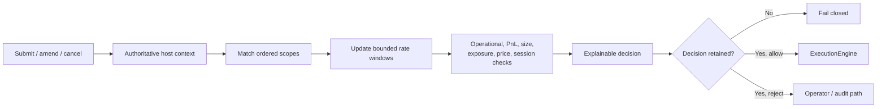

The limit model covers:

- order quantity and normalized notional;
- projected position, gross exposure, net exposure, and open-order count;
- independent trailing one-second submit/amend and cancel rates;
- reference-price collars and typical-quantity fat-finger limits;
- duplicate client ids, restricted scopes, and host self-trade checks;
- UTC day, overnight, and full-day trading windows;
- strict reduce-only behavior that cannot cross through flat;
- loss and peak-to-current daily drawdown limits; and
- fail-closed market-data, adapter, persistence, and risk-state health gates.

The host supplies [`ProductionRiskContext`] from its authoritative position,
PnL, market-data, duplicate-id, self-trade, and health stores. The default
context reports unavailable risk state. [`ProductionRiskLimits::conservative`]
enables operational blocks; [`ProductionRiskLimits::permissive`] is an
explicit simulation/test profile.

```rust
use of_execution::{
    InMemoryProductionRiskJournal, ProductionRiskCommand,
    ProductionRiskContext, ProductionRiskEngine, ProductionRiskLimits,
    ProductionRiskPolicy, ProductionRiskScope,
};
use of_execution_core::{
    AccountId, ClientOrderId, ExecutionSymbol, OrderPrice, OrderQty,
    OrderRequest, OrderSide, OrderType, RouteId, StrategyId, TimeInForce,
};

let mut limits = ProductionRiskLimits::conservative();
limits.max_order_qty = 50;
limits.max_order_notional = 50_000_000;
limits.max_position_abs = 250;
limits.max_order_rate_per_sec = 1_000;
limits.price_collar_ticks = 20;

let mut risk = ProductionRiskEngine::with_capacity(16);
risk.add_policy(ProductionRiskPolicy::from_id(
    "global-default",
    ProductionRiskScope::Global,
    100,
    limits,
)?)?;

let request = OrderRequest {
    client_order_id: ClientOrderId::new("strategy-a-42")?,
    account_id: AccountId::new("account-a")?,
    route_id: RouteId::new("fix-a")?,
    strategy_id: StrategyId::new("strategy-a")?,
    symbol: ExecutionSymbol::new("XCME", "ESM6")?,
    side: OrderSide::Buy,
    order_type: OrderType::Limit,
    time_in_force: TimeInForce::Day,
    quantity: OrderQty(2),
    limit_price: OrderPrice(5_000),
    stop_price: OrderPrice(0),
    ts_exchange_ns: 0,
    ts_recv_ns: 1_000_000_000,
};
let group = of_execution::RiskInstrumentGroupId::new("equity-index")?;
let command = ProductionRiskCommand::submit(&request, group);
let mut context = ProductionRiskContext::available();
context.reference_price = OrderPrice(4_995);
let mut journal = InMemoryProductionRiskJournal::with_capacity(1_024);
let decision = risk.evaluate_and_record(command, context, &mut journal);
if decision.allowed {
    // Submit `request` through the existing ExecutionEngine.
} else {
    // Persist and expose decision.reason, policy_id, observed, and limit.
}
# Ok::<(), Box<dyn std::error::Error>>(())
```

Construction reserves policy and rate-window storage. Evaluation uses
fixed-size identifiers, mutates only preallocated rate queues, performs no I/O,
and does not read clocks. The caller supplies timestamps and owns
synchronization; one worker should own one mutable risk engine.
[`ProductionRiskEngine::evaluate_and_record`] records before routing, and
journal failure converts even an allowed result to
[`ProductionRiskReason::DecisionJournalUnavailable`]. Replace the bounded
in-memory journal with a durable implementation in production.

Policy installation rejects empty policy ids, negative signed limits, duplicate
ids, exhausted policy capacity, and rate limits above the documented maximum.
For amend evaluation, current gross and net context must include the order being
replaced; the engine subtracts that existing exposure before adding the
replacement.

Cancels intentionally bypass exposure, market-data, and PnL blocks so
operators can reduce risk during degradation, while their independent
cancel-rate and timestamp controls remain active. Amend context includes the
replaced quantity and price so projected position and exposure are computed
from the delta.

Regulatory design references include the
[SEC Market Access Rule](https://www.sec.gov/rules-regulations/2010/11/risk-management-controls-brokers-dealers-market-access)
and [FINRA market-access guidance](https://www.finra.org/rules-guidance/guidance/reports/2021-finras-examination-and-risk-monitoring-program/market-access-rule).

### Order intent and parent/child lifecycle

[`OrderIntentLifecycle`] is the additive OMS-owned bridge between a strategy or
execution-algorithm decision and venue child orders. It does not alter the
existing single-order [`ExecutionEngine`] API and does not make `of_execution`
depend on `of_execution_algos`. Algorithm planners translate their child plans
into [`ExecutionInstruction`] plus quantity, then submit every resulting child
through the existing kill-switch, production-risk, journal, and execution
paths.

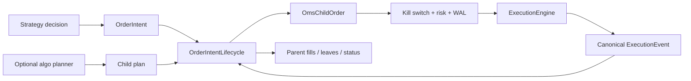

[`OrderIntent`] fixes the account, strategy, symbol, side, target quantity,
parent limit, child-size cap, simultaneous open-child cap, participation target,
and release window. [`ExecutionInstruction`] carries route, order type, TIF,
limit/stop price, display/minimum quantity, post-only, and reduce-only intent.
The participation field is declared metadata: the host or algorithm computes
market volume and decides whether a proposed child is eligible. Every child
still receives normal OMS risk; this lifecycle never bypasses it.

```rust
use of_execution::{
    ExecutionInstruction, OmsChildOrderId, OrderIntent, OrderIntentId,
    OrderIntentLifecycle, OmsParentOrderId,
};
use of_execution_core::{
    AccountId, ClientOrderId, ExecutionSymbol, OrderPrice, OrderQty, OrderSide,
    OrderType, RouteId, StrategyId, TimeInForce,
};

let intent = OrderIntent::new(
    OrderIntentId::new("intent-20260809-1")?,
    OmsParentOrderId::new("parent-20260809-1")?,
    AccountId::new("account-a")?,
    StrategyId::new("twap-a")?,
    ExecutionSymbol::new("XCME", "ESM6")?,
    OrderSide::Buy,
    OrderQty(100),
    OrderPrice(5_100),
    OrderQty(10),
    2,
    2_000,
    1_000_000,
    2_000_000,
    900_000,
)?;
let mut tree = OrderIntentLifecycle::new(intent, 128)?;
tree.activate(1, 950_000)?;
let instruction = ExecutionInstruction::new(
    RouteId::new("fix-order-entry-a")?,
    OrderType::Limit,
    TimeInForce::Day,
    OrderPrice(5_095),
);
let child = tree.plan_child(
    2,
    1_000_000,
    OmsChildOrderId::new("parent-1-child-1")?,
    ClientOrderId::new("twap-a-1")?,
    OrderQty(10),
    instruction,
)?;
assert_eq!(child.leaves_qty, OrderQty(10));
# Ok::<(), Box<dyn std::error::Error>>(())
```

The parent state machine supports pending, active, paused, pending-cancel,
completed, cancelled, rejected, failed, and recovering states. Child state
covers planned, submitted, working, partial/full fill, pending cancel,
cancelled, replaced, rejected, expired, and unknown. Mutation sequences are
strictly increasing and caller/WAL supplied; the lifecycle never reads a clock.

Child allocation enforces parent leaves, per-child quantity, total child-record
capacity, simultaneous open-child count, release window, display/minimum
quantity, route identity, order-type price requirements, and side-aware parent
limit. Child records are lifetime-bounded rather than recycled silently, so
undersized capacity fails explicitly.

[`OrderIntentLifecycle::apply_execution_event`] accepts only a matching
account, symbol, route, and client id. A cumulative fill advance must be a
canonical trade whose `last_qty` exactly equals the advance. Parent and child
fill notionals, averages, working quantity, leaves, and completion state update
atomically. Regressing fills and parent overfills leave state unchanged.

[`OrderIntentLifecycle::replace_child`] records old/new lineage and transfers
working allocation only after complete validation. Call it when replacement is
authoritatively accepted or ownership has otherwise transferred; pending venue
replace transport still belongs to [`ExecutionEngine::amend`]. Late fills on
replaced, cancelled, or expired children remain counted without reopening the
child. Other terminal-state reports fail closed.

Parent cancellation writes stable child-id-ordered targets into caller-owned
[`OmsChildCancelBuffer`]. Planned children cancel locally; submitted/working/
unknown children become pending-cancel and produce route/client targets. Output
capacity is checked before any mutation, and selection reuses preallocated
scratch storage. Failed parents retain emergency cancel access.

[`OrderIntentRecoverySnapshot`] sorts child rows for deterministic persistence.
Restore independently validates ids, quantities, leaves, averages, fill
notional, child sequences, indexes, and recomputed parent aggregates. A
non-terminal tree always restores as `Recovering`; the host must reconcile OMS
and venue state before `activate` permits release. Terminal trees stay terminal.

FIX identifiers remain adapter concerns. Hosts may map the intent/parent id to
provider metadata such as `ListID` or a custom field, while every actual child
uses a unique `ClOrdID`. FIX documents `ClOrdID` uniqueness and `ListID` as an
association mechanism in the
[FIX Latest field reference](https://fiximate.fixtrading.org/en/FIX.Latest/fields_sorted_by_name.html).
FINRA also explicitly treats parent/child routing and automated cancellations
as algorithmic trading activity in
[Regulatory Notice 15-06](https://www.finra.org/rules-guidance/notices/15-06).

### Multi-account allocation

[`AllocationGroup`] defines optional post-trade allocation across account,
route, and strategy legs. [`allocate_block_fill`] supports deterministic
average-price block allocation with:

- [`AllocationMethod::Proportional`] using largest-remainder balancing, and
- [`AllocationMethod::Priority`] using priority and target quantities.

[`AllocationReport`] records the balanced allocated quantity, average price, and
per-leg [`AllocationFill`] values. [`reconcile_allocations`] compares expected
and actual fills with allocation-native mismatch classes such as missing actual
fills, unexpected actual fills, quantity mismatch, and price mismatch. These
helpers do not submit child orders or mutate OMS state; hosts decide when to
emit allocations to middle-office, FIX allocation, file export, or accounting
systems.

### Safety policies

[`DisconnectPolicy`] describes route behavior during disconnects:

- `Hold`
- `RejectNew`
- `CancelOpenOrders`
- `Freeze`

[`RouteSafetyPolicy`] combines disconnect policy, kill switch state, and whether
cancels are allowed while killed.

[`SafetyPolicy`] provides a configurable fail-open/fail-closed matrix across
production conditions such as stale market data, degraded persistence, degraded
OMS WAL, checkpoint failure, adapter disconnect, drop-copy disconnect,
reconciliation mismatch, unavailable risk, position ledger mismatch, and route
health degradation.

`SafetyPolicy::fail_closed()` is the default. It rejects new submissions for
active conditions while preserving cancel flow. `SafetyPolicy::fail_open_degraded()`
must be selected explicitly and records every active allowance in
[`SafetyPolicyDecision::fail_open_count`]. [`evaluate_safety_policy`] returns
whether submissions and cancels remain enabled, whether operator approval is
required, and whether the decision is degraded.

### Advanced risk

[`AdvancedRiskLimits`] and [`AdvancedRiskGate`] add helpers beyond
`RiskLimits`:

- message-rate limit,
- absolute position limit,
- gross notional limit,
- reduce-only mode,
- basic route limits.

### Position ledger

[`PositionLedger`] folds trade execution events into [`Position`] values keyed
by [`PositionKey`]. It tracks net quantity, buy quantity, sell quantity, gross
notional, and average price. It is an OMS-side exposure helper, not a complete
accounting system. Its API and historical behavior remain unchanged.

[`ProductionPositionLedger`] is the additive authoritative alternative for
pre-trade risk, recovery, and broker/clearing reconciliation. A position is
keyed by account, strategy, venue-native symbol, and settlement currency. It
tracks exact normalized open cost, derived average price, signed quantity,
buy/sell totals, gross realized and marked unrealized PnL, commissions, other
fees, cash adjustments, gross traded notional, contract multiplier, sequence,
and timestamp.

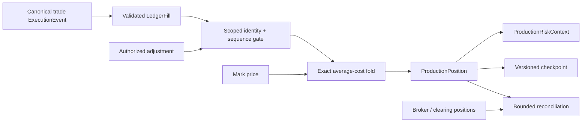

#### Fill and PnL flow

Use [`LedgerFill::from_execution_event`] only for canonical
[`ExecutionType::Trade`](of_execution_core::ExecutionType::Trade) events. The
host supplies strategy, side, settlement currency, contract multiplier,
commission, fees, and a globally monotonic mutation/WAL sequence.

```rust
use of_execution::{
    LedgerCurrency, LedgerFill, LedgerFxRate,
    ProductionPositionLedger, ProductionPositionLedgerConfig,
};
use of_execution_core::{ExecutionEvent, OrderSide, StrategyId};

fn apply_trade(
    ledger: &mut ProductionPositionLedger,
    event: &ExecutionEvent,
    sequence: u64,
) -> Result<i128, Box<dyn std::error::Error>> {
    let fill = LedgerFill::from_execution_event(
        event,
        sequence,
        StrategyId::new("strategy-a")?,
        OrderSide::Buy,
        LedgerCurrency::new("USD")?,
        50, // contract multiplier
        125, // commission in normalized USD units
        25, // clearing/exchange fees
    )?;
    let result = ledger.apply_fill(fill)?;
    Ok(result.realized_pnl_delta)
}

let config = ProductionPositionLedgerConfig::new(4_096, 1_000_000, 16_384);
let mut ledger = ProductionPositionLedger::new(config);
// `apply_trade(&mut ledger, &trade_event, wal_sequence)?`;
let usd_to_base = LedgerFxRate::new(1, 1)?;
assert_eq!(usd_to_base.convert(10), 10);
# let _ = &mut ledger;
# Ok::<(), Box<dyn std::error::Error>>(())
```

Open cost is retained exactly as `i128`; `average_price` is derived and may be
truncated only for display. Closing fills allocate exact retained cost, so
fractional average-price remainder is not lost from eventual realized PnL.
Long, short, partial close, flat, and reversal paths use one deterministic
average-cost method. `net_realized_pnl` subtracts commissions and fees and adds
cash adjustments; `total_pnl` also adds unrealized PnL. [`LedgerFxRate`] uses a
positive rational instead of floating point for caller-selected base-currency
conversion.

Execution identity is scoped by route, account, symbol, and provider execution
id. Adjustment identity is scoped by position key. These identities are never
evicted during a ledger session: if configured identity capacity is exhausted,
the mutation fails closed instead of weakening deduplication. Diagnostic fill
attribution is separately bounded and may retain only the newest configured
records.

#### Adjustments and corporate actions

[`LedgerAdjustment`] represents opening balances, trade corrections,
corporate actions, manual changes, and cash effects. Builders make quantity,
resulting average price, PnL, cost, cash, and multiplier changes explicit.
The ledger does not authorize an adjustment: the host must authenticate the
operator/system source and journal the command before application. A zero-to-
open or cross-zero adjustment requires an average-price override, and failed
validation leaves state unchanged. Quantity adjustments change position and
cost basis but do not masquerade as executed `buy_qty` or `sell_qty` volume.

#### Checkpoint and recovery

[`PositionLedgerCheckpoint`] contains sorted positions, the complete retained
deduplication set, recent attribution, last sequence, schema version, and
checksum. [`ProductionPositionLedger::restore`] validates the complete payload
and configured capacities before returning state.

[`FilePositionLedgerCheckpointStore`] writes a temporary file, optionally
syncs it, atomically renames it, optionally syncs the parent directory, and
prunes by checkpoint id. Existing ids are not overwritten. Corrupt,
unsupported, oversized, duplicate-key, inconsistent-cost, or sequence-invalid
checkpoints fail closed. Replay only ledger mutations after the checkpoint's
`last_sequence`.

#### External reconciliation

[`reconcile_production_positions`] compares local state with broker, clearing,
venue, or independent drop-copy [`ExternalPositionSnapshot`] rows. It reports
local-only, external-only, duplicate source keys, net quantity, average price,
multiplier, realized PnL, commission, and fee differences under explicit
absolute tolerances. The function never mutates the ledger and never silently
truncates its caller-owned [`PositionReconciliationBuffer`].

This API follows the separation in the FIX position-maintenance model: trade
reports update local state, while independent position reports establish an
external reconciliation boundary. Useful references are the
[FIX Latest Position Report definition](https://fiximate.fixtrading.org/en/FIX.Latest/tag35.html)
and [IBKR realized/unrealized cost-basis guidance](https://guides.interactivebrokers.com/rg/reportguide/realized&unrealizedperformancesummary_default.htm).

All fill, mark, and adjustment operations are single-owner and perform no file
I/O, clock reads, serialization, logging, or callbacks. Pre-size position,
identity, and attribution capacities before starting the execution worker.
Checkpointing and reconciliation are control-plane operations and may allocate.

### Normalization

[`VenueOrderCapabilities`] and [`normalize_order_type`] validate canonical
order type and TIF choices against provider capabilities. Unsupported order
types and TIFs return structured [`RiskRejectReason`] values from
`of_execution_core`.

### Telemetry

[`ExecutionTelemetry`] tracks counts and latency totals. It is intentionally
small so deployments can export metrics to Prometheus, statsd, OpenTelemetry,
or internal systems without making this crate depend on any one telemetry
stack.

For production service-level indicators, [`ExecutionSloCollector`] adds a
fixed-memory, single-owner collector. Its observation path performs no heap
allocation, locking, clock reads, formatting, serialization, or exporter I/O.
It tracks:

- submit-to-send, send-to-ack, submit-to-ack, cancel-to-ack,
  replace-to-ack, fill, recovery, and drop-copy latency;
- submit, cancel, and replace reject rates in parts per million;
- current/maximum adapter, command, and event queue depth;
- current/maximum WAL sequence lag, durable-WAL age, checkpoint age, and
  reconciliation mismatch count; and
- route-health observations/transitions and operational sample count.

Latency populations use [`ExecutionLatencyHistogram`], a 257-bucket
logarithmic histogram with four sub-buckets per power-of-two range. Exact
count, minimum, maximum, and integer mean accompany bounded p50, p95, and p99
bucket-upper-bound estimates. The collector retains no individual samples.

```rust
use of_execution::{
    ExecutionLatencyKind, ExecutionOperationalObservation, ExecutionQueueKind,
    ExecutionRouteHealth, ExecutionSloCollector, ExecutionSloTargets,
    ExecutionSubmitObservation, ExecutionSubmitOutcome,
};

let mut metrics = ExecutionSloCollector::new();
metrics.observe_submit(
    ExecutionSubmitObservation::new(1_000, 1_100, 1_500, ExecutionSubmitOutcome::Ack)
        .with_fill_ns(2_000),
)?;
metrics.observe_operational(
    ExecutionOperationalObservation::new(10_000)
        .with_queue_depths(2, 1, 0)
        .with_wal_progress(100, 100, Some(9_900))
        .with_checkpoint_ns(9_000)
        .with_reconciliation_mismatches(0)
        .with_route_health(ExecutionRouteHealth::Healthy)
        .with_drop_copy_lag_ns(50),
)?;

let snapshot = metrics.snapshot();
let report = snapshot.evaluate(
    ExecutionSloTargets::new()
        .with_latency_p99_ns(ExecutionLatencyKind::SubmitToAck, 1_000)
        .with_queue_depth(ExecutionQueueKind::Adapter, 16)
        .with_reject_rate_ppm(10_000)
        .with_healthy_route_required(true),
);
assert!(report.is_compliant());
# Ok::<(), of_execution::ExecutionMetricsError>(())
```

All timestamps in a latency observation must share one host-monotonic clock
domain. Do not subtract an exchange clock from a host clock directly; validate
and attribute it with [`ExecutionTimestampTrace`] first. Build one collector
per stable route/account scope, snapshot it off the command path, and map the
typed values to a host exporter. This prevents unbounded route, symbol, client,
or order identifiers from becoming high-cardinality metric labels.

The design follows the separation between collection and export described by
the [OpenTelemetry Metrics SDK](https://opentelemetry.io/docs/specs/otel/metrics/sdk/),
the [Prometheus histogram guidance](https://prometheus.io/docs/practices/histograms/),
and [Google SRE SLO guidance](https://sre.google/workbook/implementing-slos/).

### Clock and timestamp discipline

[`ExecutionTimestampTrace`] is an optional, host-owned timestamp envelope for
production execution workflows. It tracks:

- strategy decision time,
- OMS receive time,
- WAL append time,
- adapter send time,
- exchange/venue time,
- OMS report receive time,
- drop-copy receive time, and
- checkpoint time.

[`TimestampSource`] and [`ExecutionTimestampSources`] record where those values
came from, such as host software clocks, monotonic clocks, hardware clocks,
venues, journals, drop copy, or checkpoint stores. The trace can produce
[`ExecutionLatencyAttribution`] without forcing the engine to read clocks on
every command.

[`TimestampDisciplineConfig`] and [`TimestampDisciplineReport`] validate known
internal timestamps for monotonic order and compare venue timestamps with OMS
report receive time for clock-skew checks. The helpers are additive and do not
change existing `repr(C)` request or event layouts.

### Sharding

[`ShardRouter`] maps [`ShardKey`] values to deterministic shard indexes.
Sharding should preserve order lifecycle ordering within a route/account/symbol
scope while allowing independent scopes to run on separate workers.

### Throttling

[`OrderThrottle`] is a token-bucket style helper:

- `new(capacity, refill_per_sec)`
- `allow(now_ns)`
- `tokens()`

Use it before enqueueing commands when a venue or broker has strict message
limits.

### Replay simulation

[`ReplayDecision`], [`ReplayResult`], and [`replay_simulated_oms`] support
deterministic strategy decision replay using the simulated adapter.

### Provider adapter SDK helpers

[`ProviderAdapterContext`], [`ExecutionAdapterFactory`], and
[`ProviderAdapterSdk`] provide reusable scaffolding for adapter authors.

## Error Model

[`ExecutionError`] variants:

- `Disconnected`
- `BufferFull`
- `RouteNotFound`
- `RiskRejected`
- `Core`
- `Adapter`
- `Journal`

[`ConcurrentExecutionError`] variants:

- `Backpressure`
- `Disconnected`
- `Stopped`
- `WorkerPanic`
- `Execution`

Risk rejection is not an adapter failure. It is a structured local decision,
usually accompanied by a rejection event.

## Low-Latency Notes

- Use typed requests, not JSON, on the command path.
- Keep adapter output in caller-owned [`ExecutionEventBuffer`] values.
- Prefer bounded queues for worker and fanout paths.
- Apply pre-trade risk before provider I/O.
- Keep one owner for order-state mutation.
- Do not call strategy code while holding adapter locks.
- Export metrics out of band rather than formatting strings on the hot path.

## When To Use Which API

Use [`ExecutionEngine`] when:

- you are writing Rust,
- one owner thread already exists,
- deterministic synchronous control is desired,
- you are building tests, replay harnesses, or simulations.

Use [`ConcurrentExecutionEngine`] when:

- many producer threads submit commands,
- explicit queue backpressure matters,
- one worker should own adapter and order state,
- you do not want to depend on Tokio.

Use the C/Python/Java concurrent bindings when:

- host-language code needs non-blocking command queueing,
- host code should poll command reports,
- native code should preserve deterministic state internally.

## What This Crate Does Not Do

This crate does not:

- implement a live provider transport,
- parse FIX/REST/WebSocket messages,
- provide financial advice,
- guarantee venue-side execution behavior,
- replace broker-side risk controls,
- make the dashboard secure for remote production access.

Use `of_execution_adapters` for reusable provider scaffolds, and implement
custom [`ExecutionAdapter`] types for broker-specific behavior.

## Documentation

Additional project documentation:

- `docs/handbook/05h-of-execution-reference.md`
- `docs/handbook/09-oms-architecture.md`
- `docs/handbook/10-oms-cookbook.md`
- `docs/handbook/11-low-latency-design.md`
- `docs/handbook/13-recovery-and-operations.md`
