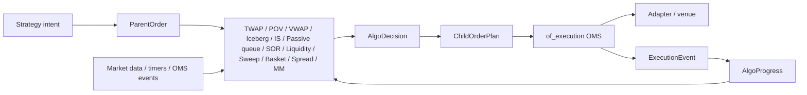

# `of_execution_algos`

[](https://crates.io/crates/of_execution_algos)
[](https://docs.rs/of_execution_algos)
[](../../LICENSE)

`of_execution_algos` contains additive execution-algorithm primitives for
Orderflow. The crate is intentionally separate from `of_execution` so users who
only need a direct OMS do not compile algorithmic execution machinery.

`of_execution_algos` starts at `0.1.0` in the broader Orderflow `0.4.0`
development line because it is a new public Rust surface.

The first foundation focuses on deterministic parent/child order handling:

- fixed-size parent, child, intent, and algo-instance identifiers,
- parent order metadata and lifecycle status,
- child order plans that convert into canonical OMS `OrderRequest` values,
- fixed-capacity `AlgoDecision` buffers for allocation-aware decision paths,
- fixed-capacity algorithm risk reports for pre-submit child-plan checks,
- progress folding from canonical `ExecutionEvent` reports,
- host-serializable algorithm checkpoints and deterministic recovery plans,
- deterministic child-order simulation reports that emit canonical
  `ExecutionEvent` values for progress folding,
- allocation-free execution metrics and TCA snapshots from child submissions
  and canonical execution events,
- typed algorithm configuration structs that build existing `ParentOrder`,
  risk, and recovery policies without free-form maps,
- deterministic TWAP slice planning with explicit clip limits,
- deterministic POV/participation planning from observed market volume,
- deterministic VWAP planning from a borrowed cumulative volume curve,
- deterministic synthetic iceberg replenishment planning,
- deterministic implementation-shortfall planning from urgency, arrival price,
  adverse move, volatility, spread, and impact estimates,
- deterministic passive queue planning from host-owned best bid/ask, queue
  depth, expected contra volume, and adverse-selection estimates,
- deterministic smart order routing from route price, available quantity,
  capability, health/status, latency, reject rate, fill probability, fees, and
  toxicity metrics,
- deterministic liquidity-seeking planning for probe/take decisions using SOR
  route candidates, hidden-liquidity estimates, price improvement, and toxicity
  controls,
- deterministic sweep/aggressive-take planning that walks route candidates up
  to a side-aware price collar,
- deterministic basket planning for synchronized multi-leg child
  release with leg roles and hedge-ratio metadata,
- deterministic pairs/spread planning with hedge-ratio sizing, spread-edge
  gating, synchronized buy/sell child plans, and explicit legging-risk
  boundaries,
- deterministic market-making quote planning from fair value, inventory,
  volatility, adverse-selection estimates, tick size, and quote quantity,
- deterministic TWAP replay over explicit timer/execution/status inputs.

The crate does not submit orders, open sockets, own an OMS, bypass risk, or
claim strategy profitability. Host applications still send every child order
through `of_execution`, where risk gates, journals, adapters, kill switches, and
reconciliation remain authoritative.

## Architecture



## Low-Latency Principles

The crate is designed for predictable live execution paths:

- identifiers reuse `of_execution_core::FixedAscii`,
- parent and child plans are `Copy` where practical,
- `AlgoDecision` uses a fixed-capacity array instead of a growing `Vec`,
- `AlgoRiskReport` uses a fixed-capacity array instead of a growing `Vec`,
- TWAP planning uses integer arithmetic and no wall-clock reads,
- built-in planning does not allocate strings or maps per decision,
- hosts provide client order ids and timestamps explicitly for auditability.

## Risk Controls

`AlgoRiskPolicy` validates planned child orders before the host submits them to
`of_execution`. It is intentionally separate from every planner method, so
existing TWAP/POV/VWAP/SOR/spread/market-making APIs remain unchanged and hosts
can opt into the checks they need.

Configurable limits include:

- parent maximum quantity,
- child maximum quantity,
- child notional,
- participation cap from observed market volume,
- price collar around a host-supplied reference price,
- open child quantity,
- child submissions per decision,
- child submissions in a caller-defined rate window,
- stale market-data block,
- route degradation block,
- persistence degradation block,
- kill switch and operator pause.

Risk reports are explainable and allocation-aware: `AlgoRiskReport` retains a
fixed number of `AlgoRiskViolation` values and exposes `truncated()` when more
violations occurred than the caller chose to retain.

```rust
use of_execution_algos::{
    AlgoProgress, AlgoRiskContext, AlgoRiskLimits, AlgoRiskPolicy,
    ChildOrderId, ParentOrder, ParentOrderId, DEFAULT_ALGO_RISK_VIOLATION_CAPACITY,
};
use of_execution_core::{
    AccountId, ClientOrderId, ExecutionSymbol, OrderPrice, OrderQty, OrderSide,
    OrderType, RouteId, StrategyId, TimeInForce,
};

let parent = ParentOrder::new(
    ParentOrderId::new("parent-risk")?,
    AccountId::new("acct")?,
    RouteId::new("sim")?,
    StrategyId::new("risk")?,
    ExecutionSymbol::new("SIM", "ESZ6")?,
    OrderSide::Buy,
    OrderType::Limit,
    TimeInForce::Day,
    OrderQty::new(100)?,
    OrderPrice::new(500_000)?,
    OrderPrice(0),
    1_000,
    11_000,
    OrderQty::new(10)?,
    OrderQty::new(25)?,
    0,
)?;
let child = of_execution_algos::ChildOrderPlan::new(
    ChildOrderId::new("risk-child")?,
    parent.id(),
    of_execution_core::OrderRequest {
        client_order_id: ClientOrderId::new("risk-cl")?,
        account_id: parent.account_id(),
        route_id: parent.route_id(),
        strategy_id: parent.strategy_id(),
        symbol: parent.symbol(),
        side: parent.side(),
        order_type: parent.order_type(),
        time_in_force: parent.time_in_force(),
        quantity: OrderQty::new(10)?,
        limit_price: OrderPrice::new(500_000)?,
        stop_price: OrderPrice(0),
        ts_exchange_ns: 0,
        ts_recv_ns: 2_000,
    },
    2_000,
)?;
let limits = AlgoRiskLimits::new(
    OrderQty::new(100)?,
    OrderQty::new(25)?,
    10_000_000,
    1_500,
    100,
    OrderQty::new(50)?,
    2,
    10,
)?;
let context = AlgoRiskContext::new(OrderPrice::new(500_000)?)?
    .with_observed_market_volume(OrderQty::new(1_000)?);
let report = AlgoRiskPolicy::new(limits).evaluate_child::<
    DEFAULT_ALGO_RISK_VIOLATION_CAPACITY,
>(
    &parent,
    AlgoProgress::new(parent.id(), parent.total_qty()),
    &child,
    context,
)?;

assert!(report.is_allowed());
# Ok::<(), Box<dyn std::error::Error>>(())
```

## Typed Configuration

`AlgoParentConfig` and `AlgoConfig` give hosts a typed configuration surface for
audit and replay without changing `ParentOrder::new`. Config validation still
uses `ParentOrder`, so the order-ticket rules have one implementation.

```rust
use of_execution_algos::{AlgoConfig, AlgoKind, AlgoParentConfig, ParentOrderId};
use of_execution_core::{
    AccountId, ExecutionSymbol, OrderPrice, OrderQty, OrderSide, OrderType,
    RouteId, StrategyId, TimeInForce,
};

let parent_config = AlgoParentConfig::new(
    ParentOrderId::new("parent-config")?,
    AccountId::new("acct")?,
    RouteId::new("sim")?,
    StrategyId::new("twap")?,
    ExecutionSymbol::new("SIM", "ESZ6")?,
    OrderSide::Buy,
    OrderType::Limit,
    TimeInForce::Day,
    OrderQty::new(100)?,
    OrderPrice::new(500_000)?,
    OrderPrice(0),
    1_000,
    11_000,
    OrderQty::new(10)?,
    OrderQty::new(25)?,
    0,
)?;
let config = AlgoConfig::new(AlgoKind::Twap, parent_config);
let parent = config.to_parent_order()?;

assert_eq!(parent.total_qty(), OrderQty::new(100)?);
# Ok::<(), Box<dyn std::error::Error>>(())
```

## TWAP Example

```rust
use of_execution_algos::{
    AlgoProgress, ChildOrderId, ParentOrder, ParentOrderId, TwapSlicePlanner,
};
use of_execution_core::{
    AccountId, ClientOrderId, ExecutionSymbol, OrderPrice, OrderQty, OrderSide,
    OrderType, RouteId, StrategyId, TimeInForce,
};

let parent = ParentOrder::new(
    ParentOrderId::new("parent-1")?,
    AccountId::new("acct")?,
    RouteId::new("sim")?,
    StrategyId::new("twap")?,
    ExecutionSymbol::new("SIM", "ESZ6")?,
    OrderSide::Buy,
    OrderType::Limit,
    TimeInForce::Day,
    OrderQty::new(100)?,
    OrderPrice::new(500_000)?,
    OrderPrice(0),
    1_000,
    11_000,
    OrderQty::new(10)?,
    OrderQty::new(25)?,
    0,
)?;

let planner = TwapSlicePlanner::new(1_000);
let progress = AlgoProgress::new(parent.id(), parent.total_qty());
let plan = planner
    .plan_due_slice(
        &parent,
        progress,
        1_000,
        ChildOrderId::new("child-1")?,
        ClientOrderId::new("cl-1")?,
        1_000,
    )?
    .expect("first slice is due");

assert_eq!(plan.request().quantity, OrderQty(10));
# Ok::<(), Box<dyn std::error::Error>>(())
```

## Deterministic Replay

`replay_twap_into` evaluates TWAP planning over explicit replay inputs:

- `AlgoReplayInput` carries a monotonic input sequence and an `AlgoReplayEvent`;
- `AlgoReplayEvent::Timer` drives schedule decisions;
- `AlgoReplayEvent::Execution` folds canonical OMS events into progress;
- `AlgoReplayEvent::ParentStatus` changes parent lifecycle status;
- `AlgoReplayIdScheme` deterministically generates child/client ids;
- `AlgoReplayStep` captures progress before/after each input and the decision;
- `AlgoReplaySummary` reports final progress and a deterministic hash.

The replay output vector is caller-owned and cleared before use. This keeps
allocation policy visible to test, benchmark, and simulation hosts.

## Child-Order Simulation

`AlgoSimulator` turns generated `ChildOrderPlan` values into deterministic
simulated `ExecutionEvent` values. This lets tests and replay harnesses drive
`AlgoProgress::on_execution_event` without a live venue or adapter.

The first simulator is intentionally simple and explicit:

- host supplies available quantity,
- host supplies fill price,
- host controls reject behavior,
- host controls whether unfilled leaves are cancelled,
- host supplies simulated latency,
- simulator generates deterministic venue/execution ids from a sequence.

```rust
use of_execution_algos::{
    AlgoProgress, AlgoSimMarket, AlgoSimOutcome, AlgoSimulator, ChildOrderId,
    ParentOrder, ParentOrderId,
};
use of_execution_core::{
    AccountId, ClientOrderId, ExecutionSymbol, OrderPrice, OrderQty, OrderSide,
    OrderType, RouteId, StrategyId, TimeInForce,
};

let parent = ParentOrder::new(
    ParentOrderId::new("parent-sim")?,
    AccountId::new("acct")?,
    RouteId::new("sim")?,
    StrategyId::new("twap")?,
    ExecutionSymbol::new("SIM", "ESZ6")?,
    OrderSide::Buy,
    OrderType::Limit,
    TimeInForce::Day,
    OrderQty::new(100)?,
    OrderPrice::new(500_000)?,
    OrderPrice(0),
    1_000,
    11_000,
    OrderQty::new(10)?,
    OrderQty::new(25)?,
    0,
)?;
let child = of_execution_algos::ChildOrderPlan::new(
    ChildOrderId::new("sim-child")?,
    parent.id(),
    of_execution_core::OrderRequest {
        client_order_id: ClientOrderId::new("sim-cl")?,
        account_id: parent.account_id(),
        route_id: parent.route_id(),
        strategy_id: parent.strategy_id(),
        symbol: parent.symbol(),
        side: parent.side(),
        order_type: parent.order_type(),
        time_in_force: parent.time_in_force(),
        quantity: OrderQty::new(10)?,
        limit_price: OrderPrice::new(500_000)?,
        stop_price: OrderPrice(0),
        ts_exchange_ns: 0,
        ts_recv_ns: 2_000,
    },
    2_000,
)?;
let simulator = AlgoSimulator::new(
    AlgoSimMarket::new(OrderQty::new(10)?, OrderPrice::new(500_025)?, false, false, 25)?,
);
let step = simulator.simulate_child(&child, 1)?;
let mut progress = AlgoProgress::new(parent.id(), parent.total_qty());
progress.on_child_released(&child)?;
progress.on_execution_event(&step.event());

assert_eq!(step.outcome(), AlgoSimOutcome::Filled);
assert_eq!(progress.completed_qty(), OrderQty::new(10)?);
# Ok::<(), Box<dyn std::error::Error>>(())
```

## Metrics And TCA

`AlgoMetricsAccumulator` folds child submissions and canonical execution
events into a compact TCA snapshot. It tracks completion, child counts,
average execution price, side-aware slippage versus arrival/VWAP/TWAP
benchmarks, and average event latency.

```rust
use of_execution_algos::{
    AlgoMetricsAccumulator, AlgoTcaBenchmark, ChildOrderId, ParentOrder,
    ParentOrderId,
};
use of_execution_core::{
    AccountId, ClientOrderId, ExecutionEvent, ExecutionId, ExecutionSymbol,
    ExecutionText, ExecutionType, OrderPrice, OrderQty, OrderSide, OrderStatus,
    OrderType, RiskRejectReason, RouteId, StrategyId, TimeInForce, VenueOrderId,
};

let parent = ParentOrder::new(
    ParentOrderId::new("parent-tca")?,
    AccountId::new("acct")?,
    RouteId::new("sim")?,
    StrategyId::new("tca")?,
    ExecutionSymbol::new("SIM", "ESZ6")?,
    OrderSide::Buy,
    OrderType::Limit,
    TimeInForce::Day,
    OrderQty::new(100)?,
    OrderPrice::new(500_000)?,
    OrderPrice(0),
    1_000,
    11_000,
    OrderQty::new(10)?,
    OrderQty::new(25)?,
    0,
)?;
let child = of_execution_algos::ChildOrderPlan::new(
    ChildOrderId::new("tca-child")?,
    parent.id(),
    of_execution_core::OrderRequest {
        client_order_id: ClientOrderId::new("tca-cl")?,
        account_id: parent.account_id(),
        route_id: parent.route_id(),
        strategy_id: parent.strategy_id(),
        symbol: parent.symbol(),
        side: parent.side(),
        order_type: parent.order_type(),
        time_in_force: parent.time_in_force(),
        quantity: OrderQty::new(10)?,
        limit_price: OrderPrice::new(500_000)?,
        stop_price: OrderPrice(0),
        ts_exchange_ns: 0,
        ts_recv_ns: 2_000,
    },
    2_000,
)?;
let mut metrics = AlgoMetricsAccumulator::new(
    &parent,
    AlgoTcaBenchmark::new(OrderPrice::new(500_000)?, OrderPrice(0), OrderPrice(0))?,
)?;
metrics.on_child_submitted(&child);
metrics.on_execution_event(&ExecutionEvent {
    exec_type: ExecutionType::Trade,
    order_status: OrderStatus::Filled,
    client_order_id: child.request().client_order_id,
    orig_client_order_id: ClientOrderId::empty(),
    venue_order_id: VenueOrderId::new("venue-tca")?,
    execution_id: ExecutionId::new("exec-tca")?,
    account_id: parent.account_id(),
    route_id: parent.route_id(),
    symbol: parent.symbol(),
    last_qty: OrderQty::new(10)?,
    last_price: OrderPrice::new(505_000)?,
    cumulative_qty: OrderQty::new(10)?,
    leaves_qty: OrderQty(0),
    average_price: OrderPrice::new(505_000)?,
    ts_exchange_ns: 2_000,
    ts_recv_ns: 2_025,
    reason: RiskRejectReason::None,
    text: ExecutionText::empty(),
});
let snapshot = metrics.snapshot();

assert_eq!(snapshot.completion_bps(), 1_000);
assert_eq!(snapshot.arrival_slippage_bps(), 100);
# Ok::<(), Box<dyn std::error::Error>>(())
```

## Checkpoints And Recovery

`AlgoCheckpoint` captures deterministic algorithm state for one parent:

- schema version,
- parent ticket,
- progress snapshot,
- next decision sequence,
- last consumed input sequence.

It deliberately does not persist venue order ids, adapter sessions, socket
state, or OMS journal records. Those remain owned by `of_execution` and the
host persistence layer. This crate only provides copyable state that the host
can serialize into its own WAL/checkpoint store.

`AlgoRecoveryPlan` combines a checkpoint with `AlgoRecoveryPolicy` to decide
whether the recovered parent should resume, pause, complete, or escalate for
risk/operator handling.

```rust
use of_execution_algos::{
    AlgoCheckpoint, AlgoProgress, AlgoRecoveryAction, AlgoRecoveryPlan,
    AlgoRecoveryPolicy, ParentOrder, ParentOrderId,
};
use of_execution_core::{
    AccountId, ExecutionSymbol, OrderPrice, OrderQty, OrderSide, OrderType,
    RouteId, StrategyId, TimeInForce,
};

let parent = ParentOrder::new(
    ParentOrderId::new("parent-recovery")?,
    AccountId::new("acct")?,
    RouteId::new("sim")?,
    StrategyId::new("twap")?,
    ExecutionSymbol::new("SIM", "ESZ6")?,
    OrderSide::Buy,
    OrderType::Limit,
    TimeInForce::Day,
    OrderQty::new(100)?,
    OrderPrice::new(500_000)?,
    OrderPrice(0),
    1_000,
    11_000,
    OrderQty::new(10)?,
    OrderQty::new(25)?,
    0,
)?;
let progress = AlgoProgress::new(parent.id(), parent.total_qty());
let checkpoint = AlgoCheckpoint::new(parent, progress, 7, 42)?;
let plan = AlgoRecoveryPlan::new(checkpoint, AlgoRecoveryPolicy::default())?;

assert_eq!(plan.action(), AlgoRecoveryAction::Pause);
assert_eq!(plan.replay_from_sequence(), 43);
# Ok::<(), Box<dyn std::error::Error>>(())
```

## POV Example

`PovSlicePlanner` plans child orders from cumulative observed market volume.
Hosts should provide a volume source that excludes the algorithm's own fills
when possible.

```rust
use of_execution_algos::{
    AlgoProgress, ChildOrderId, ParentOrder, ParentOrderId, PovSlicePlanner,
};
use of_execution_core::{
    AccountId, ClientOrderId, ExecutionSymbol, OrderPrice, OrderQty, OrderSide,
    OrderType, RouteId, StrategyId, TimeInForce,
};

let parent = ParentOrder::new(
    ParentOrderId::new("parent-1")?,
    AccountId::new("acct")?,
    RouteId::new("sim")?,
    StrategyId::new("pov")?,
    ExecutionSymbol::new("SIM", "ESZ6")?,
    OrderSide::Buy,
    OrderType::Limit,
    TimeInForce::Day,
    OrderQty::new(100)?,
    OrderPrice::new(500_000)?,
    OrderPrice(0),
    1_000,
    11_000,
    OrderQty::new(10)?,
    OrderQty::new(25)?,
    1_500,
)?;

let planner = PovSlicePlanner::new(1_000, 1_500);
let progress = AlgoProgress::new(parent.id(), parent.total_qty());
let plan = planner
    .plan_volume_slice(
        &parent,
        progress,
        OrderQty::new(1_000)?,
        2_000,
        ChildOrderId::new("child-1")?,
        ClientOrderId::new("cl-1")?,
        2_000,
    )?
    .expect("volume participation slice is due");

assert_eq!(plan.request().quantity, OrderQty(25));
# Ok::<(), Box<dyn std::error::Error>>(())
```

## Iceberg Example

`IcebergSlicePlanner` keeps the displayed child quantity bounded and plans a
new child when the open displayed quantity falls to the configured replenish
threshold.

```rust
use of_execution_algos::{
    AlgoProgress, ChildOrderId, IcebergSlicePlanner, ParentOrder, ParentOrderId,
};
use of_execution_core::{
    AccountId, ClientOrderId, ExecutionSymbol, OrderPrice, OrderQty, OrderSide,
    OrderType, RouteId, StrategyId, TimeInForce,
};

let parent = ParentOrder::new(
    ParentOrderId::new("parent-1")?,
    AccountId::new("acct")?,
    RouteId::new("sim")?,
    StrategyId::new("iceberg")?,
    ExecutionSymbol::new("SIM", "ESZ6")?,
    OrderSide::Buy,
    OrderType::Limit,
    TimeInForce::Day,
    OrderQty::new(100)?,
    OrderPrice::new(500_000)?,
    OrderPrice(0),
    1_000,
    11_000,
    OrderQty::new(10)?,
    OrderQty::new(25)?,
    0,
)?;

let planner = IcebergSlicePlanner::new(OrderQty::new(20)?, OrderQty(0));
let progress = AlgoProgress::new(parent.id(), parent.total_qty());
let plan = planner
    .plan_replenishment(
        &parent,
        progress,
        1_000,
        ChildOrderId::new("child-1")?,
        ClientOrderId::new("cl-1")?,
        1_000,
    )?
    .expect("displayed child is due");

assert_eq!(plan.request().quantity, OrderQty(20));
# Ok::<(), Box<dyn std::error::Error>>(())
```

## Implementation Shortfall Example

`ImplementationShortfallPlanner` balances timing risk and temporary impact using
explicit host-provided market context. It exposes an estimate before planning so
callers can audit urgency and target release quantity.

```rust
use of_execution_algos::{
    AlgoProgress, ChildOrderId, ImplementationShortfallConfig,
    ImplementationShortfallContext, ImplementationShortfallPlanner, ParentOrder,
    ParentOrderId,
};
use of_execution_core::{
    AccountId, ClientOrderId, ExecutionSymbol, OrderPrice, OrderQty, OrderSide,
    OrderType, RouteId, StrategyId, TimeInForce,
};

let parent = ParentOrder::new(
    ParentOrderId::new("parent-1")?,
    AccountId::new("acct")?,
    RouteId::new("sim")?,
    StrategyId::new("is")?,
    ExecutionSymbol::new("SIM", "ESZ6")?,
    OrderSide::Buy,
    OrderType::Limit,
    TimeInForce::Day,
    OrderQty::new(100)?,
    OrderPrice::new(500_000)?,
    OrderPrice(0),
    1_000,
    11_000,
    OrderQty::new(10)?,
    OrderQty::new(25)?,
    0,
)?;

let planner = ImplementationShortfallPlanner::new(
    ImplementationShortfallConfig::default(),
);
let context = ImplementationShortfallContext::new(
    OrderPrice::new(500_000)?,
    OrderPrice::new(510_000)?,
    200,
    20,
    10,
)?;
let progress = AlgoProgress::new(parent.id(), parent.total_qty());
let estimate = planner.estimate(&parent, progress, 1_000, context)?;
let plan = planner
    .plan_shortfall_slice(
        &parent,
        progress,
        1_000,
        context,
        ChildOrderId::new("child-1")?,
        ClientOrderId::new("cl-1")?,
        1_000,
    )?
    .expect("shortfall slice is due");

assert!(estimate.urgency_bps() > 0);
assert!(plan.request().quantity.0 >= parent.min_clip().0);
# Ok::<(), Box<dyn std::error::Error>>(())
```

## Passive Queue Example

`PassiveQueuePlanner` chooses whether to wait, join a passive queue, improve
inside the spread, or optionally cross late in the parent interval. The host
owns market-data normalization, queue-depth estimation, and adverse-selection
models; the planner stays deterministic and allocation-light.

```rust
use of_execution_algos::{
    AlgoProgress, ChildOrderId, ParentOrder, ParentOrderId, PassivePegMode,
    PassiveQueueConfig, PassiveQueueContext, PassiveQueuePlanner,
};
use of_execution_core::{
    AccountId, ClientOrderId, ExecutionSymbol, OrderPrice, OrderQty, OrderSide,
    OrderType, RouteId, StrategyId, TimeInForce,
};

let parent = ParentOrder::new(
    ParentOrderId::new("parent-1")?,
    AccountId::new("acct")?,
    RouteId::new("sim")?,
    StrategyId::new("passive")?,
    ExecutionSymbol::new("SIM", "ESZ6")?,
    OrderSide::Buy,
    OrderType::Limit,
    TimeInForce::Day,
    OrderQty::new(100)?,
    OrderPrice::new(500_000)?,
    OrderPrice(0),
    1_000,
    11_000,
    OrderQty::new(10)?,
    OrderQty::new(25)?,
    0,
)?;

let config = PassiveQueueConfig::new(PassivePegMode::SameSide, OrderPrice(25))?;
let planner = PassiveQueuePlanner::new(config);
let context = PassiveQueueContext::new(
    OrderPrice::new(499_975)?,
    OrderPrice::new(500_025)?,
    OrderQty::new(25)?,
    OrderQty::new(100)?,
    10,
)?;
let progress = AlgoProgress::new(parent.id(), parent.total_qty());
let decision = planner.plan_passive_slice(
    &parent,
    progress,
    2_000,
    context,
    ChildOrderId::new("child-1")?,
    ClientOrderId::new("cl-1")?,
    2_000,
)?;

assert!(decision.action().releases_child());
assert!(decision.child().is_some());
# Ok::<(), Box<dyn std::error::Error>>(())
```

## SOR Example

`SorPlanner` scores host-provided route candidates and emits fixed-capacity
child allocations. It does not own adapters or venue sessions; every allocation
is still a canonical `ChildOrderPlan` for submission through the OMS.

```rust
use of_execution_algos::{
    AlgoProgress, ChildOrderId, ParentOrder, ParentOrderId, SorConfig,
    SorPlanner, SorRouteCandidate,
};
use of_execution_core::{
    AccountId, ClientOrderId, ExecutionSymbol, OrderPrice, OrderQty, OrderSide,
    OrderType, RouteId, StrategyId, TimeInForce,
};

let parent = ParentOrder::new(
    ParentOrderId::new("parent-1")?,
    AccountId::new("acct")?,
    RouteId::new("default")?,
    StrategyId::new("sor")?,
    ExecutionSymbol::new("SIM", "ESZ6")?,
    OrderSide::Buy,
    OrderType::Limit,
    TimeInForce::Day,
    OrderQty::new(100)?,
    OrderPrice::new(500_000)?,
    OrderPrice(0),
    1_000,
    11_000,
    OrderQty::new(10)?,
    OrderQty::new(25)?,
    0,
)?;

let candidates = [
    SorRouteCandidate::new(
        RouteId::new("r1")?,
        OrderPrice::new(499_975)?,
        OrderQty::new(25)?,
    )?,
    SorRouteCandidate::new(
        RouteId::new("r2")?,
        OrderPrice::new(500_000)?,
        OrderQty::new(25)?,
    )?,
];
let child_ids = [ChildOrderId::new("child-1")?, ChildOrderId::new("child-2")?];
let client_ids = [ClientOrderId::new("cl-1")?, ClientOrderId::new("cl-2")?];
let planner = SorPlanner::new(SorConfig::default());
let decision = planner.plan_routes::<2>(
    &parent,
    AlgoProgress::new(parent.id(), parent.total_qty()),
    2_000,
    &candidates,
    &child_ids,
    &client_ids,
    2_000,
)?;

assert!(!decision.is_empty());
# Ok::<(), Box<dyn std::error::Error>>(())
```

## Liquidity-Seeking Example

`LiquiditySeekingPlanner` ranks route candidates, skips toxic venues, probes
uncertain hidden liquidity, and takes larger clips when fill probability is
high. It builds on SOR route candidates and still emits ordinary child orders
for the OMS.

```rust
use of_execution_algos::{
    AlgoProgress, ChildOrderId, LiquiditySeekingCandidate,
    LiquiditySeekingConfig, LiquiditySeekingPlanner, ParentOrder, ParentOrderId,
    SorConfig, SorRouteCandidate, SorRouteMetrics,
};
use of_execution_core::{
    AccountId, ClientOrderId, ExecutionSymbol, OrderPrice, OrderQty, OrderSide,
    OrderType, RouteId, StrategyId, TimeInForce,
};

let parent = ParentOrder::new(
    ParentOrderId::new("parent-1")?,
    AccountId::new("acct")?,
    RouteId::new("default")?,
    StrategyId::new("liq")?,
    ExecutionSymbol::new("SIM", "ESZ6")?,
    OrderSide::Buy,
    OrderType::Limit,
    TimeInForce::Day,
    OrderQty::new(100)?,
    OrderPrice::new(500_000)?,
    OrderPrice(0),
    1_000,
    11_000,
    OrderQty::new(10)?,
    OrderQty::new(25)?,
    0,
)?;

let route = SorRouteCandidate::new(
    RouteId::new("dark-1")?,
    OrderPrice::new(500_000)?,
    OrderQty::new(100)?,
)?
.with_metrics(SorRouteMetrics::new(0, 200, 0, 4_000, 100, 9_000)?);
let candidates = [LiquiditySeekingCandidate::new(route, 2_500, 50, OrderQty::new(10)?)?];
let child_ids = [ChildOrderId::new("child-1")?];
let client_ids = [ClientOrderId::new("cl-1")?];
let planner = LiquiditySeekingPlanner::new(
    LiquiditySeekingConfig::new(1, OrderQty::new(10)?, 0, 7_500, 1_500, 3, 4)?,
    SorConfig::default(),
);
let decision = planner.plan_liquidity::<1>(
    &parent,
    AlgoProgress::new(parent.id(), parent.total_qty()),
    2_000,
    &candidates,
    &child_ids,
    &client_ids,
    2_000,
)?;

assert!(!decision.is_empty());
# Ok::<(), Box<dyn std::error::Error>>(())
```

## Sweep Example

`SweepPlanner` walks host-provided route candidates aggressively up to a
side-aware price collar. It is meant for urgent liquidity removal; hosts still
own IOC/FOK mapping, protected-market rules, market-data validation, and
adapter-specific routing instructions.

```rust
use of_execution_algos::{
    AlgoProgress, ChildOrderId, ParentOrder, ParentOrderId, SorRouteCandidate,
    SweepConfig, SweepPlanner,
};
use of_execution_core::{
    AccountId, ClientOrderId, ExecutionSymbol, OrderPrice, OrderQty, OrderSide,
    OrderType, RouteId, StrategyId, TimeInForce,
};

let parent = ParentOrder::new(
    ParentOrderId::new("parent-1")?,
    AccountId::new("acct")?,
    RouteId::new("default")?,
    StrategyId::new("sweep")?,
    ExecutionSymbol::new("SIM", "ESZ6")?,
    OrderSide::Buy,
    OrderType::Limit,
    TimeInForce::Day,
    OrderQty::new(100)?,
    OrderPrice::new(500_000)?,
    OrderPrice(0),
    1_000,
    11_000,
    OrderQty::new(10)?,
    OrderQty::new(25)?,
    0,
)?;

let levels = [
    SorRouteCandidate::new(RouteId::new("r1")?, OrderPrice::new(499_975)?, OrderQty::new(10)?)?,
    SorRouteCandidate::new(RouteId::new("r2")?, OrderPrice::new(500_000)?, OrderQty::new(15)?)?,
];
let child_ids = [ChildOrderId::new("child-1")?, ChildOrderId::new("child-2")?];
let client_ids = [ClientOrderId::new("cl-1")?, ClientOrderId::new("cl-2")?];
let planner = SweepPlanner::new(SweepConfig::new(2, OrderPrice::new(500_000)?, OrderQty(0))?);
let decision = planner.plan_sweep::<2>(
    &parent,
    AlgoProgress::new(parent.id(), parent.total_qty()),
    2_000,
    &levels,
    &child_ids,
    &client_ids,
    2_000,
)?;

assert_eq!(decision.total_qty(), OrderQty(25));
# Ok::<(), Box<dyn std::error::Error>>(())
```

## Basket Example

`BasketPlanner` synchronizes child release across multiple leg parents. It does
not claim venue-atomic package execution; hosts still own linked-order support,
hedge drift controls, and venue-specific recovery.

```rust
use of_execution_algos::{
    AlgoProgress, BasketLeg, BasketLegRole, BasketPlanner, ChildOrderId,
    ParentOrder, ParentOrderId,
};
use of_execution_core::{
    AccountId, ClientOrderId, ExecutionSymbol, OrderPrice, OrderQty, OrderSide,
    OrderType, RouteId, StrategyId, TimeInForce,
};

let parent = ParentOrder::new(
    ParentOrderId::new("parent-1")?,
    AccountId::new("acct")?,
    RouteId::new("default")?,
    StrategyId::new("basket")?,
    ExecutionSymbol::new("SIM", "ESZ6")?,
    OrderSide::Buy,
    OrderType::Limit,
    TimeInForce::Day,
    OrderQty::new(100)?,
    OrderPrice::new(500_000)?,
    OrderPrice(0),
    1_000,
    11_000,
    OrderQty::new(10)?,
    OrderQty::new(25)?,
    0,
)?;

let leg = BasketLeg::new(parent, BasketLegRole::Primary, 10_000)?;
let progress = AlgoProgress::new(parent.id(), parent.total_qty());
let child_ids = [ChildOrderId::new("child-1")?];
let client_ids = [ClientOrderId::new("cl-1")?];
let decision = BasketPlanner::new().plan_synchronized_slice::<1>(
    &[leg],
    &[progress],
    6_000,
    &child_ids,
    &client_ids,
    6_000,
)?;

assert_eq!(decision.len(), 1);
# Ok::<(), Box<dyn std::error::Error>>(())
```

## Pairs / Spread Example

`SpreadPlanner` is a deterministic two-leg planner for long/short spread
execution. It uses a sell-leg hedge ratio in basis points, computes the
current executable edge from host-provided leg prices, and only releases both
child orders when the edge and clip constraints pass.

It does not claim venue-atomic package execution. Hosts still own linked-order
support, legging-risk policy, hedge drift controls, kill switches, and recovery
if one leg fills before the other.

```rust
use of_execution_algos::{
    AlgoProgress, ChildOrderId, ParentOrder, ParentOrderId, SpreadConfig,
    SpreadPlanner, SpreadQuote,
};
use of_execution_core::{
    AccountId, ClientOrderId, ExecutionSymbol, OrderPrice, OrderQty, OrderSide,
    OrderType, RouteId, StrategyId, TimeInForce,
};

let buy_parent = ParentOrder::new(
    ParentOrderId::new("spread-buy")?,
    AccountId::new("acct")?,
    RouteId::new("buy-route")?,
    StrategyId::new("pairs")?,
    ExecutionSymbol::new("SIM", "LEG_A")?,
    OrderSide::Buy,
    OrderType::Limit,
    TimeInForce::Day,
    OrderQty::new(100)?,
    OrderPrice::new(500_000)?,
    OrderPrice(0),
    1_000,
    11_000,
    OrderQty::new(10)?,
    OrderQty::new(25)?,
    0,
)?;
let sell_parent = ParentOrder::new(
    ParentOrderId::new("spread-sell")?,
    AccountId::new("acct")?,
    RouteId::new("sell-route")?,
    StrategyId::new("pairs")?,
    ExecutionSymbol::new("SIM", "LEG_B")?,
    OrderSide::Sell,
    OrderType::Limit,
    TimeInForce::Day,
    OrderQty::new(100)?,
    OrderPrice::new(505_000)?,
    OrderPrice(0),
    1_000,
    11_000,
    OrderQty::new(10)?,
    OrderQty::new(25)?,
    0,
)?;

let planner = SpreadPlanner::new(SpreadConfig::new(10_000, 50)?);
let decision = planner.plan_spread(
    &buy_parent,
    AlgoProgress::new(buy_parent.id(), buy_parent.total_qty()),
    &sell_parent,
    AlgoProgress::new(sell_parent.id(), sell_parent.total_qty()),
    2_000,
    SpreadQuote::new(OrderPrice::new(500_000)?, OrderPrice::new(505_000)?)?,
    ChildOrderId::new("spread-buy-child")?,
    ClientOrderId::new("spread-buy-cl")?,
    ChildOrderId::new("spread-sell-child")?,
    ClientOrderId::new("spread-sell-cl")?,
    2_000,
)?;

assert!(decision.estimate().executable());
assert!(decision.buy().is_some());
assert!(decision.sell().is_some());
# Ok::<(), Box<dyn std::error::Error>>(())
```

## Market Making Example

`MarketMakerPlanner` generates two-sided quote child plans from fair value,
inventory, volatility, and adverse-selection estimates. It does not own
position state, cancel/replace loops, or adapter sessions.

```rust
use of_execution_algos::{
    ChildOrderId, MarketMakerConfig, MarketMakerContext, MarketMakerPlanner,
    ParentOrder, ParentOrderId,
};
use of_execution_core::{
    AccountId, ClientOrderId, ExecutionSymbol, OrderPrice, OrderQty, OrderSide,
    OrderType, RouteId, StrategyId, TimeInForce,
};

let template = ParentOrder::new(
    ParentOrderId::new("mm-parent")?,
    AccountId::new("acct")?,
    RouteId::new("maker")?,
    StrategyId::new("mm")?,
    ExecutionSymbol::new("SIM", "ESZ6")?,
    OrderSide::Buy,
    OrderType::Limit,
    TimeInForce::Day,
    OrderQty::new(100)?,
    OrderPrice::new(500_000)?,
    OrderPrice(0),
    1_000,
    11_000,
    OrderQty::new(1)?,
    OrderQty::new(10)?,
    0,
)?;

let planner = MarketMakerPlanner::new(MarketMakerConfig::default());
let context = MarketMakerContext::new(
    OrderPrice::new(500_000)?,
    OrderPrice::new(499_975)?,
    OrderPrice::new(500_025)?,
    OrderQty(0),
    OrderQty::new(100)?,
    10,
    10,
)?;
let decision = planner.plan_quotes(
    &template,
    2_000,
    context,
    ChildOrderId::new("bid-1")?,
    ClientOrderId::new("bid-cl-1")?,
    ChildOrderId::new("ask-1")?,
    ClientOrderId::new("ask-cl-1")?,
    2_000,
)?;

assert!(decision.bid().is_some());
assert!(decision.ask().is_some());
# Ok::<(), Box<dyn std::error::Error>>(())
```

## VWAP Example

`VwapSlicePlanner` follows a historical or configured cumulative volume curve.
The curve is borrowed and pre-cumulative so live planning does not sum the
profile on every decision.

```rust
use of_execution_algos::{
    AlgoProgress, ChildOrderId, ParentOrder, ParentOrderId, VwapSlicePlanner,
    VwapVolumeCurve,
};
use of_execution_core::{
    AccountId, ClientOrderId, ExecutionSymbol, OrderPrice, OrderQty, OrderSide,
    OrderType, RouteId, StrategyId, TimeInForce,
};

let curve = VwapVolumeCurve::new(1_000, 1_000, &[10, 30, 60, 100])?;
let planner = VwapSlicePlanner::new(curve);
let parent = ParentOrder::new(
    ParentOrderId::new("parent-1")?,
    AccountId::new("acct")?,
    RouteId::new("sim")?,
    StrategyId::new("vwap")?,
    ExecutionSymbol::new("SIM", "ESZ6")?,
    OrderSide::Buy,
    OrderType::Limit,
    TimeInForce::Day,
    OrderQty::new(100)?,
    OrderPrice::new(500_000)?,
    OrderPrice(0),
    1_000,
    11_000,
    OrderQty::new(10)?,
    OrderQty::new(25)?,
    0,
)?;

let progress = AlgoProgress::new(parent.id(), parent.total_qty());
let plan = planner
    .plan_curve_slice(
        &parent,
        progress,
        2_000,
        ChildOrderId::new("child-1")?,
        ClientOrderId::new("cl-1")?,
        2_000,
    )?
    .expect("curve slice is due");

assert_eq!(plan.request().quantity, OrderQty(25));
# Ok::<(), Box<dyn std::error::Error>>(())
```

## Compatibility

This crate is additive. It does not change existing `of_execution`,
`of_execution_core`, C ABI, Python, or Java APIs. The intended integration path
is:

1. build a parent order in `of_execution_algos`,
2. ask an algorithm planner for child-order decisions,
3. submit the resulting `OrderRequest` through the existing OMS,
4. feed resulting `ExecutionEvent` values back into algo progress state.

Future execution helpers should build on this substrate instead of bypassing
it.
