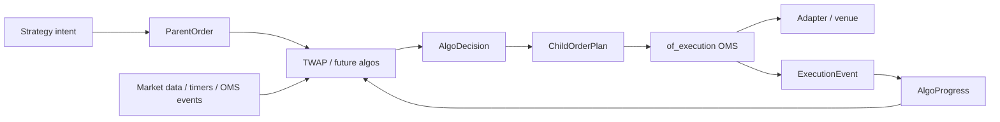

# `of_execution_algos`

[](https://crates.io/crates/of_execution_algos)
[](https://docs.rs/of_execution_algos)
[](../../LICENSE)

`of_execution_algos` contains additive execution-algorithm primitives for
Orderflow. The crate is intentionally separate from `of_execution` so users who
only need a direct OMS do not compile algorithmic execution machinery.

`of_execution_algos` starts at `0.1.0` in the broader Orderflow `0.4.0`
development line because it is a new public Rust surface.

The first foundation focuses on deterministic parent/child order handling:

- fixed-size parent, child, intent, and algo-instance identifiers,
- parent order metadata and lifecycle status,
- child order plans that convert into canonical OMS `OrderRequest` values,
- fixed-capacity `AlgoDecision` buffers for allocation-aware decision paths,
- progress folding from canonical `ExecutionEvent` reports,
- deterministic TWAP slice planning with explicit clip limits,
- deterministic TWAP replay over explicit timer/execution/status inputs.

The crate does not submit orders, open sockets, own an OMS, bypass risk, or
claim strategy profitability. Host applications still send every child order
through `of_execution`, where risk gates, journals, adapters, kill switches, and
reconciliation remain authoritative.

## Architecture



## Low-Latency Principles

The crate is designed for predictable live execution paths:

- identifiers reuse `of_execution_core::FixedAscii`,
- parent and child plans are `Copy` where practical,
- `AlgoDecision` uses a fixed-capacity array instead of a growing `Vec`,
- TWAP planning uses integer arithmetic and no wall-clock reads,
- built-in planning does not allocate strings or maps per decision,
- hosts provide client order ids and timestamps explicitly for auditability.

## TWAP Example

```rust
use of_execution_algos::{
    AlgoProgress, ChildOrderId, ParentOrder, ParentOrderId, TwapSlicePlanner,
};
use of_execution_core::{
    AccountId, ClientOrderId, ExecutionSymbol, OrderPrice, OrderQty, OrderSide,
    OrderType, RouteId, StrategyId, TimeInForce,
};

let parent = ParentOrder::new(
    ParentOrderId::new("parent-1")?,
    AccountId::new("acct")?,
    RouteId::new("sim")?,
    StrategyId::new("twap")?,
    ExecutionSymbol::new("SIM", "ESZ6")?,
    OrderSide::Buy,
    OrderType::Limit,
    TimeInForce::Day,
    OrderQty::new(100)?,
    OrderPrice::new(500_000)?,
    OrderPrice(0),
    1_000,
    11_000,
    OrderQty::new(10)?,
    OrderQty::new(25)?,
    0,
)?;

let planner = TwapSlicePlanner::new(1_000);
let progress = AlgoProgress::new(parent.id(), parent.total_qty());
let plan = planner
    .plan_due_slice(
        &parent,
        progress,
        1_000,
        ChildOrderId::new("child-1")?,
        ClientOrderId::new("cl-1")?,
        1_000,
    )?
    .expect("first slice is due");

assert_eq!(plan.request().quantity, OrderQty(10));
# Ok::<(), Box<dyn std::error::Error>>(())
```

## Deterministic Replay

`replay_twap_into` evaluates TWAP planning over explicit replay inputs:

- `AlgoReplayInput` carries a monotonic input sequence and an `AlgoReplayEvent`;
- `AlgoReplayEvent::Timer` drives schedule decisions;
- `AlgoReplayEvent::Execution` folds canonical OMS events into progress;
- `AlgoReplayEvent::ParentStatus` changes parent lifecycle status;
- `AlgoReplayIdScheme` deterministically generates child/client ids;
- `AlgoReplayStep` captures progress before/after each input and the decision;
- `AlgoReplaySummary` reports final progress and a deterministic hash.

The replay output vector is caller-owned and cleared before use. This keeps
allocation policy visible to test, benchmark, and simulation hosts.

## Compatibility

This crate is additive. It does not change existing `of_execution`,
`of_execution_core`, C ABI, Python, or Java APIs. The intended integration path
is:

1. build a parent order in `of_execution_algos`,
2. ask an algorithm planner for child-order decisions,
3. submit the resulting `OrderRequest` through the existing OMS,
4. feed resulting `ExecutionEvent` values back into algo progress state.

Future algorithms such as VWAP, POV, iceberg, implementation shortfall, passive
peg, SOR, basket, and market-making helpers should build on this substrate
instead of bypassing it.
