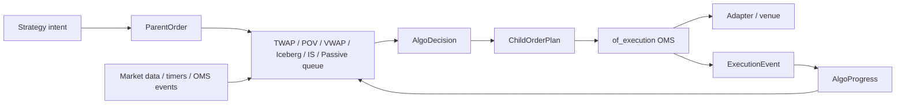

# `of_execution_algos`

[](https://crates.io/crates/of_execution_algos)
[](https://docs.rs/of_execution_algos)
[](../../LICENSE)

`of_execution_algos` contains additive execution-algorithm primitives for
Orderflow. The crate is intentionally separate from `of_execution` so users who
only need a direct OMS do not compile algorithmic execution machinery.

`of_execution_algos` starts at `0.1.0` in the broader Orderflow `0.4.0`
development line because it is a new public Rust surface.

The first foundation focuses on deterministic parent/child order handling:

- fixed-size parent, child, intent, and algo-instance identifiers,
- parent order metadata and lifecycle status,
- child order plans that convert into canonical OMS `OrderRequest` values,
- fixed-capacity `AlgoDecision` buffers for allocation-aware decision paths,
- progress folding from canonical `ExecutionEvent` reports,
- deterministic TWAP slice planning with explicit clip limits,
- deterministic POV/participation planning from observed market volume,
- deterministic VWAP planning from a borrowed cumulative volume curve,
- deterministic synthetic iceberg replenishment planning,
- deterministic implementation-shortfall planning from urgency, arrival price,
  adverse move, volatility, spread, and impact estimates,
- deterministic passive queue planning from host-owned best bid/ask, queue
  depth, expected contra volume, and adverse-selection estimates,
- deterministic TWAP replay over explicit timer/execution/status inputs.

The crate does not submit orders, open sockets, own an OMS, bypass risk, or
claim strategy profitability. Host applications still send every child order
through `of_execution`, where risk gates, journals, adapters, kill switches, and
reconciliation remain authoritative.

## Architecture



## Low-Latency Principles

The crate is designed for predictable live execution paths:

- identifiers reuse `of_execution_core::FixedAscii`,
- parent and child plans are `Copy` where practical,
- `AlgoDecision` uses a fixed-capacity array instead of a growing `Vec`,
- TWAP planning uses integer arithmetic and no wall-clock reads,
- built-in planning does not allocate strings or maps per decision,
- hosts provide client order ids and timestamps explicitly for auditability.

## TWAP Example

```rust
use of_execution_algos::{
    AlgoProgress, ChildOrderId, ParentOrder, ParentOrderId, TwapSlicePlanner,
};
use of_execution_core::{
    AccountId, ClientOrderId, ExecutionSymbol, OrderPrice, OrderQty, OrderSide,
    OrderType, RouteId, StrategyId, TimeInForce,
};

let parent = ParentOrder::new(
    ParentOrderId::new("parent-1")?,
    AccountId::new("acct")?,
    RouteId::new("sim")?,
    StrategyId::new("twap")?,
    ExecutionSymbol::new("SIM", "ESZ6")?,
    OrderSide::Buy,
    OrderType::Limit,
    TimeInForce::Day,
    OrderQty::new(100)?,
    OrderPrice::new(500_000)?,
    OrderPrice(0),
    1_000,
    11_000,
    OrderQty::new(10)?,
    OrderQty::new(25)?,
    0,
)?;

let planner = TwapSlicePlanner::new(1_000);
let progress = AlgoProgress::new(parent.id(), parent.total_qty());
let plan = planner
    .plan_due_slice(
        &parent,
        progress,
        1_000,
        ChildOrderId::new("child-1")?,
        ClientOrderId::new("cl-1")?,
        1_000,
    )?
    .expect("first slice is due");

assert_eq!(plan.request().quantity, OrderQty(10));
# Ok::<(), Box<dyn std::error::Error>>(())
```

## Deterministic Replay

`replay_twap_into` evaluates TWAP planning over explicit replay inputs:

- `AlgoReplayInput` carries a monotonic input sequence and an `AlgoReplayEvent`;
- `AlgoReplayEvent::Timer` drives schedule decisions;
- `AlgoReplayEvent::Execution` folds canonical OMS events into progress;
- `AlgoReplayEvent::ParentStatus` changes parent lifecycle status;
- `AlgoReplayIdScheme` deterministically generates child/client ids;
- `AlgoReplayStep` captures progress before/after each input and the decision;
- `AlgoReplaySummary` reports final progress and a deterministic hash.

The replay output vector is caller-owned and cleared before use. This keeps
allocation policy visible to test, benchmark, and simulation hosts.

## POV Example

`PovSlicePlanner` plans child orders from cumulative observed market volume.
Hosts should provide a volume source that excludes the algorithm's own fills
when possible.

```rust
use of_execution_algos::{
    AlgoProgress, ChildOrderId, ParentOrder, ParentOrderId, PovSlicePlanner,
};
use of_execution_core::{
    AccountId, ClientOrderId, ExecutionSymbol, OrderPrice, OrderQty, OrderSide,
    OrderType, RouteId, StrategyId, TimeInForce,
};

let parent = ParentOrder::new(
    ParentOrderId::new("parent-1")?,
    AccountId::new("acct")?,
    RouteId::new("sim")?,
    StrategyId::new("pov")?,
    ExecutionSymbol::new("SIM", "ESZ6")?,
    OrderSide::Buy,
    OrderType::Limit,
    TimeInForce::Day,
    OrderQty::new(100)?,
    OrderPrice::new(500_000)?,
    OrderPrice(0),
    1_000,
    11_000,
    OrderQty::new(10)?,
    OrderQty::new(25)?,
    1_500,
)?;

let planner = PovSlicePlanner::new(1_000, 1_500);
let progress = AlgoProgress::new(parent.id(), parent.total_qty());
let plan = planner
    .plan_volume_slice(
        &parent,
        progress,
        OrderQty::new(1_000)?,
        2_000,
        ChildOrderId::new("child-1")?,
        ClientOrderId::new("cl-1")?,
        2_000,
    )?
    .expect("volume participation slice is due");

assert_eq!(plan.request().quantity, OrderQty(25));
# Ok::<(), Box<dyn std::error::Error>>(())
```

## Iceberg Example

`IcebergSlicePlanner` keeps the displayed child quantity bounded and plans a
new child when the open displayed quantity falls to the configured replenish
threshold.

```rust
use of_execution_algos::{
    AlgoProgress, ChildOrderId, IcebergSlicePlanner, ParentOrder, ParentOrderId,
};
use of_execution_core::{
    AccountId, ClientOrderId, ExecutionSymbol, OrderPrice, OrderQty, OrderSide,
    OrderType, RouteId, StrategyId, TimeInForce,
};

let parent = ParentOrder::new(
    ParentOrderId::new("parent-1")?,
    AccountId::new("acct")?,
    RouteId::new("sim")?,
    StrategyId::new("iceberg")?,
    ExecutionSymbol::new("SIM", "ESZ6")?,
    OrderSide::Buy,
    OrderType::Limit,
    TimeInForce::Day,
    OrderQty::new(100)?,
    OrderPrice::new(500_000)?,
    OrderPrice(0),
    1_000,
    11_000,
    OrderQty::new(10)?,
    OrderQty::new(25)?,
    0,
)?;

let planner = IcebergSlicePlanner::new(OrderQty::new(20)?, OrderQty(0));
let progress = AlgoProgress::new(parent.id(), parent.total_qty());
let plan = planner
    .plan_replenishment(
        &parent,
        progress,
        1_000,
        ChildOrderId::new("child-1")?,
        ClientOrderId::new("cl-1")?,
        1_000,
    )?
    .expect("displayed child is due");

assert_eq!(plan.request().quantity, OrderQty(20));
# Ok::<(), Box<dyn std::error::Error>>(())
```

## Implementation Shortfall Example

`ImplementationShortfallPlanner` balances timing risk and temporary impact using
explicit host-provided market context. It exposes an estimate before planning so
callers can audit urgency and target release quantity.

```rust
use of_execution_algos::{
    AlgoProgress, ChildOrderId, ImplementationShortfallConfig,
    ImplementationShortfallContext, ImplementationShortfallPlanner, ParentOrder,
    ParentOrderId,
};
use of_execution_core::{
    AccountId, ClientOrderId, ExecutionSymbol, OrderPrice, OrderQty, OrderSide,
    OrderType, RouteId, StrategyId, TimeInForce,
};

let parent = ParentOrder::new(
    ParentOrderId::new("parent-1")?,
    AccountId::new("acct")?,
    RouteId::new("sim")?,
    StrategyId::new("is")?,
    ExecutionSymbol::new("SIM", "ESZ6")?,
    OrderSide::Buy,
    OrderType::Limit,
    TimeInForce::Day,
    OrderQty::new(100)?,
    OrderPrice::new(500_000)?,
    OrderPrice(0),
    1_000,
    11_000,
    OrderQty::new(10)?,
    OrderQty::new(25)?,
    0,
)?;

let planner = ImplementationShortfallPlanner::new(
    ImplementationShortfallConfig::default(),
);
let context = ImplementationShortfallContext::new(
    OrderPrice::new(500_000)?,
    OrderPrice::new(510_000)?,
    200,
    20,
    10,
)?;
let progress = AlgoProgress::new(parent.id(), parent.total_qty());
let estimate = planner.estimate(&parent, progress, 1_000, context)?;
let plan = planner
    .plan_shortfall_slice(
        &parent,
        progress,
        1_000,
        context,
        ChildOrderId::new("child-1")?,
        ClientOrderId::new("cl-1")?,
        1_000,
    )?
    .expect("shortfall slice is due");

assert!(estimate.urgency_bps() > 0);
assert!(plan.request().quantity.0 >= parent.min_clip().0);
# Ok::<(), Box<dyn std::error::Error>>(())
```

## Passive Queue Example

`PassiveQueuePlanner` chooses whether to wait, join a passive queue, improve
inside the spread, or optionally cross late in the parent interval. The host
owns market-data normalization, queue-depth estimation, and adverse-selection
models; the planner stays deterministic and allocation-light.

```rust
use of_execution_algos::{
    AlgoProgress, ChildOrderId, ParentOrder, ParentOrderId, PassivePegMode,
    PassiveQueueConfig, PassiveQueueContext, PassiveQueuePlanner,
};
use of_execution_core::{
    AccountId, ClientOrderId, ExecutionSymbol, OrderPrice, OrderQty, OrderSide,
    OrderType, RouteId, StrategyId, TimeInForce,
};

let parent = ParentOrder::new(
    ParentOrderId::new("parent-1")?,
    AccountId::new("acct")?,
    RouteId::new("sim")?,
    StrategyId::new("passive")?,
    ExecutionSymbol::new("SIM", "ESZ6")?,
    OrderSide::Buy,
    OrderType::Limit,
    TimeInForce::Day,
    OrderQty::new(100)?,
    OrderPrice::new(500_000)?,
    OrderPrice(0),
    1_000,
    11_000,
    OrderQty::new(10)?,
    OrderQty::new(25)?,
    0,
)?;

let config = PassiveQueueConfig::new(PassivePegMode::SameSide, OrderPrice(25))?;
let planner = PassiveQueuePlanner::new(config);
let context = PassiveQueueContext::new(
    OrderPrice::new(499_975)?,
    OrderPrice::new(500_025)?,
    OrderQty::new(25)?,
    OrderQty::new(100)?,
    10,
)?;
let progress = AlgoProgress::new(parent.id(), parent.total_qty());
let decision = planner.plan_passive_slice(
    &parent,
    progress,
    2_000,
    context,
    ChildOrderId::new("child-1")?,
    ClientOrderId::new("cl-1")?,
    2_000,
)?;

assert!(decision.action().releases_child());
assert!(decision.child().is_some());
# Ok::<(), Box<dyn std::error::Error>>(())
```

## VWAP Example

`VwapSlicePlanner` follows a historical or configured cumulative volume curve.
The curve is borrowed and pre-cumulative so live planning does not sum the
profile on every decision.

```rust
use of_execution_algos::{
    AlgoProgress, ChildOrderId, ParentOrder, ParentOrderId, VwapSlicePlanner,
    VwapVolumeCurve,
};
use of_execution_core::{
    AccountId, ClientOrderId, ExecutionSymbol, OrderPrice, OrderQty, OrderSide,
    OrderType, RouteId, StrategyId, TimeInForce,
};

let curve = VwapVolumeCurve::new(1_000, 1_000, &[10, 30, 60, 100])?;
let planner = VwapSlicePlanner::new(curve);
let parent = ParentOrder::new(
    ParentOrderId::new("parent-1")?,
    AccountId::new("acct")?,
    RouteId::new("sim")?,
    StrategyId::new("vwap")?,
    ExecutionSymbol::new("SIM", "ESZ6")?,
    OrderSide::Buy,
    OrderType::Limit,
    TimeInForce::Day,
    OrderQty::new(100)?,
    OrderPrice::new(500_000)?,
    OrderPrice(0),
    1_000,
    11_000,
    OrderQty::new(10)?,
    OrderQty::new(25)?,
    0,
)?;

let progress = AlgoProgress::new(parent.id(), parent.total_qty());
let plan = planner
    .plan_curve_slice(
        &parent,
        progress,
        2_000,
        ChildOrderId::new("child-1")?,
        ClientOrderId::new("cl-1")?,
        2_000,
    )?
    .expect("curve slice is due");

assert_eq!(plan.request().quantity, OrderQty(25));
# Ok::<(), Box<dyn std::error::Error>>(())
```

## Compatibility

This crate is additive. It does not change existing `of_execution`,
`of_execution_core`, C ABI, Python, or Java APIs. The intended integration path
is:

1. build a parent order in `of_execution_algos`,
2. ask an algorithm planner for child-order decisions,
3. submit the resulting `OrderRequest` through the existing OMS,
4. feed resulting `ExecutionEvent` values back into algo progress state.

Future algorithms such as SOR, basket, and market-making helpers should build
on this substrate instead of bypassing it.
