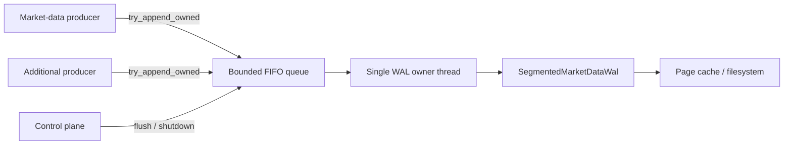

# of_persist

`of_persist` provides append-only persistence for normalized orderflow events.
The stable [`RollingStore`] API writes human-readable JSONL for replay,
auditability, and post-trade research workflows. Additive single-file and
segmented WAL APIs provide binary normalized capture, while
[`BoundedMarketDataWalWriter`] moves filesystem work to one bounded,
single-owner worker for latency-sensitive producers. Additive raw-capture types
store provider-native evidence before normalization without coupling this crate
to any exchange or transport implementation.

## Main Types

- [`RollingStore`] - append-only store for `book` and `trades` streams.
- [`StoredBookEvent`] / [`StoredTradeEvent`] - typed readback records parsed from existing JSONL files.
- [`StoredEvent`] - merged replay-oriented enum for interleaved symbol reads.
- [`RetentionPolicy`] - bounded retention by total bytes and/or max file age.
- [`MarketDataWal`] - single-file binary WAL for normalized market-data frames.
- [`MarketDataWalConfig`] - WAL path and sync policy configuration.
- [`MarketDataWalRecordKind`] - fixed record kind vocabulary.
- [`MarketDataWalRecord`] - decoded WAL replay record.
- [`MarketDataWalSequence`] - monotonic writer sequence.
- [`MarketDataWalReplayResult`] - replay summary.
- [`MarketDataWalReplayFilter`] - deterministic WAL replay selector.
- [`MarketDataWalIntegrityReport`] - checksum and sequence validation summary.
- [`MarketDataWalMetrics`] - append/sync counters.
- [`SegmentedMarketDataWal`] - checksum-linked rotated WAL directory.
- [`SegmentedMarketDataWalConfig`] - segment size, payload limit, and sync policy.
- [`MarketDataWalSyncPolicy`] - explicit record/seal sync cadence.
- [`MarketDataWalManifest`] - manifest rebuilt from validated segment truth.
- [`MarketDataWalSegmentIntegrityReport`] - aggregate segment/link validation.
- [`BoundedMarketDataWalWriter`] - single-owner background segmented WAL writer.
- [`BoundedRawCaptureWriter`] - bounded provider-native evidence writer.
- [`RawCaptureProducer`] - cloneable nonblocking raw-capture producer.
- [`RawCaptureRecordInput`] / [`RawCaptureRecord`] - owned input and decoded replay record.
- [`RawCaptureMetadata`] - compact provider, session, venue, and instrument identity.
- [`RawCaptureTimestampSource`] / [`RawCaptureFlags`] - timestamp provenance and payload handling metadata.
- [`MarketDataWalProducer`] - cloneable nonblocking producer handle.
- [`MarketDataWalRecordInput`] - owned queue input with reusable payload storage.
- [`NormalizedMarketDataRecordInput`] - owned canonical book/trade input with quality flags.
- [`NormalizedMarketDataCodecError`] - fail-closed normalized payload codec error.
- [`BoundedMarketDataWriterConfig`] - record and payload-byte queue limits.
- [`BoundedMarketDataWriterMetrics`] - queue, write, sync, and failure counters.
- [`MarketDataWriterTryError`] - ownership-preserving admission error.
- [`MarketDataWriterControlError`] - flush/shutdown barrier error.
- [`MarketDataCheckpointId`] - monotonic checkpoint identifier.
- [`MarketDataCheckpointKind`] - checkpoint payload category.
- [`MarketDataCheckpointConfig`] - checkpoint root, retention, and sync policy.
- [`MarketDataCheckpoint`] - opaque checkpoint payload with sequence anchors.
- [`MarketDataCheckpointManifest`] - checkpoint metadata without payload bytes.
- [`MarketDataCheckpointValidation`] - checkpoint integrity report.
- [`FileMarketDataCheckpointStore`] - file-backed checkpoint store.
- [`MarketDataRecoveryStatus`] - recovery classification.
- [`MarketDataRecoveryAction`] - host action selected by recovery planning.
- [`MarketDataRecoveryPolicy`] - fail-closed or replay-from-start recovery policy.
- [`MarketDataRecoveryInput`] - checkpoint and WAL integrity inputs.
- [`MarketDataRecoveryPlan`] - deterministic recovery decision.
- [`MarketDataColdExportFormat`] - cold research export format vocabulary.
- [`MarketDataJsonlExportConfig`] - JSONL export root and sync policy.
- [`MarketDataColdExportPartition`] - one exported partition summary.
- [`MarketDataColdExportManifest`] - total export manifest.
- [`FileMarketDataJsonlExportWriter`] - dependency-free JSONL cold-export writer.
- [`MarketDataRetentionAction`] - retention/tiering host action.
- [`MarketDataRetentionReason`] - reason attached to retention decisions.
- [`MarketDataRetentionPolicy`] - hot WAL and cold export retention policy.
- [`MarketDataRetentionInput`] - WAL range retention inputs.
- [`MarketDataRetentionDecision`] - deterministic retention/tiering decision.
- [`MarketDataPersistenceMode`] - production writer mode vocabulary.
- [`MarketDataPersistenceFailureAction`] - host action when persistence degrades.
- [`MarketDataPersistencePolicy`] - configured persistence mode and failure action.
- [`MarketDataPersistenceHealth`] - health, lag, drop, and error snapshot.
- [`MarketDataRecordCriticality`] - relative record importance under pressure.
- [`MarketDataBackpressureDropPolicy`] - bounded writer drop strategy.
- [`MarketDataBackpressureReason`] - active pressure reason.
- [`MarketDataBackpressureAction`] - selected action for one candidate record.
- [`MarketDataBackpressurePolicy`] - queue/lag/byte pressure thresholds.
- [`MarketDataBackpressureDecision`] - evaluated action and flags.
- [`PersistError`] / [`PersistResult<T>`] - persistence error contract.

## New In 0.5.0

`0.5.0` keeps the existing market-data persistence API stable and adds the
production normalized/raw WAL, bounded writer, checkpoint, recovery, cold
export, and retention layers described below. `of_persist`
continues to store normalized book/trade event streams; execution command and
report journaling belongs to `of_execution`.

What changes for persistence users:

- market-data replay remains deterministic and sequence-bounded;
- strategy validation examples now pair market-data replay with simulated OMS
  execution so analytics and order decisions can be reviewed together;
- JSONL schema metadata remains backward-compatible for existing persisted
  streams;
- execution journals are intentionally separate from market-data stores so
  audit, retention, and recovery policies can differ;
- binary normalized market-data WAL helpers are available as additive building
  blocks for production capture without replacing JSONL workflows;
- checksum-linked segmented WAL rotation preserves one global record sequence
  and checksum chain across files, writes explicit seal records, and rebuilds
  atomic manifests from segment truth on every open;
- a bounded background writer supports cloneable nonblocking producers,
  independently limits queued records and payload bytes, and returns ownership
  of rejected buffers instead of blocking or silently dropping them;
- canonical book/trade inputs carry quality bits into a versioned fixed binary
  envelope and are encoded with reusable scratch storage on the WAL worker;
- writer metrics expose event-time backlog from the highest accepted and
  written receive timestamps without reading a wall clock on admission;
- provider-native raw capture adds a versioned fixed envelope, explicit receive-
  timestamp provenance, compression/encryption/redaction/truncation flags,
  zero-copy admission for pre-encoded pooled buffers, ownership-preserving
  validation/rejection, and checksum-linked segmented replay;
- reusable frame scratch storage removes the previous per-append frame
  allocation from single-file and segmented WAL writers after capacity is warm;
- production persistence policy and health helpers let hosts tie writer
  degradation into execution safety policy;
- market-data backpressure helpers make slow-consumer and bounded-writer
  behavior explicit without silently dropping records;
- market-data checkpoint helpers persist opaque book, analytics, signal,
  sequence, or runtime state with WAL sequence anchors so recovery can replay
  from the latest valid checkpoint instead of the whole session;
- recovery planner helpers classify checkpoint/WAL restore states into clean,
  degraded, snapshot-gated, or fail-closed plans without forcing runtime
  integration;
- WAL replay filters select records by WAL sequence, provider sequence,
  normalized event sequence, exchange/receive timestamp, and record kind while
  preserving existing unfiltered replay behavior;
- JSONL cold-export helpers write decoded WAL records into partition files with
  raw payload hex, sequence/timestamp metadata, checksums, and export manifests;
- the separate `of_persist_parquet 0.1.0` companion adds verified bounded
  columnar export without adding Arrow/Parquet dependencies to this hot crate;
- retention planner helpers decide when to retain hot WAL, export cold data, or
  delete hot ranges while preserving incident windows and checkpoint
  dependencies;
- production deployments should keep market-data replay files and execution
  command/event journals correlated by strategy id, session id, and timestamp.

Version policy:

- `of_persist` publishes as `0.5.0`;
- `of_execution` publishes as `0.1.0` and owns execution journaling helpers.

## Public API Inventory

Public types:

- [`PersistError`]
- [`PersistResult<T>`]
- [`RetentionPolicy`]
- [`RollingStore`]
- [`StoredBookEvent`]
- [`StoredTradeEvent`]
- [`StoredEvent`]
- [`MarketDataWalSequence`]
- [`MarketDataWalRecordKind`]
- [`MarketDataWalConfig`]
- [`MarketDataWalRecord`]
- [`MarketDataWalReplayResult`]
- [`MarketDataWalReplayFilter`]
- [`MarketDataWalIntegrityReport`]
- [`MarketDataWalMetrics`]
- [`MarketDataWalSegmentId`]
- [`MarketDataWalSyncPolicy`]
- [`SegmentedMarketDataWalConfig`]
- [`MarketDataWalSegmentMetadata`]
- [`MarketDataWalManifest`]
- [`MarketDataWalSegmentIntegrityReport`]
- [`SegmentedMarketDataWalMetrics`]
- [`SegmentedMarketDataWal`]
- [`MarketDataWalRecordInput`]
- [`BoundedMarketDataWriterConfig`]
- [`MarketDataWriterTryError`]
- [`MarketDataWriterControlError`]
- [`BoundedMarketDataWriterMetrics`]
- [`MarketDataWalProducer`]
- [`BoundedMarketDataWalWriter`]
- [`RawCaptureTimestampSource`]
- [`RawCaptureFlags`]
- [`RawCaptureMetadata`]
- [`RawCaptureDecodeError`]
- [`RawCaptureInputError`]
- [`RawCaptureRecordInput`]
- [`RawCaptureRecord`]
- [`RawCaptureTryError`]
- [`RawCaptureProducer`]
- [`BoundedRawCaptureWriter`]
- [`MarketDataCheckpointId`]
- [`MarketDataCheckpointKind`]
- [`MarketDataCheckpointConfig`]
- [`MarketDataCheckpoint`]
- [`MarketDataCheckpointManifest`]
- [`MarketDataCheckpointValidation`]
- [`FileMarketDataCheckpointStore`]
- [`MarketDataRecoveryStatus`]
- [`MarketDataRecoveryAction`]
- [`MarketDataRecoveryPolicy`]
- [`MarketDataRecoveryInput`]
- [`MarketDataRecoveryPlan`]
- [`MarketDataColdExportFormat`]
- [`MarketDataJsonlExportConfig`]
- [`MarketDataColdExportPartition`]
- [`MarketDataColdExportManifest`]
- [`FileMarketDataJsonlExportWriter`]
- [`MarketDataRetentionAction`]
- [`MarketDataRetentionReason`]
- [`MarketDataRetentionPolicy`]
- [`MarketDataRetentionInput`]
- [`MarketDataRetentionDecision`]
- [`MarketDataPersistenceMode`]
- [`MarketDataPersistenceFailureAction`]
- [`MarketDataPersistencePolicy`]
- [`MarketDataPersistenceHealth`]
- [`MarketDataRecordCriticality`]
- [`MarketDataBackpressureDropPolicy`]
- [`MarketDataBackpressureReason`]
- [`MarketDataBackpressureAction`]
- [`MarketDataBackpressurePolicy`]
- [`MarketDataBackpressureDecision`]
- [`MarketDataWal`]

Public methods:

- [`StoredEvent::sequence`]
- [`RollingStore::new`]
- [`RollingStore::with_retention`]
- [`RollingStore::append_book`]
- [`RollingStore::append_trade`]
- [`RollingStore::read_books`]
- [`RollingStore::read_books_in_range`]
- [`RollingStore::read_trades`]
- [`RollingStore::read_trades_in_range`]
- [`RollingStore::read_events`]
- [`RollingStore::read_events_in_range`]
- [`RollingStore::list_venues`]
- [`RollingStore::list_symbols`]
- [`RollingStore::list_streams`]
- [`MarketDataWalConfig::new`]
- [`MarketDataWalConfig::with_sync_on_write`]
- [`MarketDataWalConfig::path`]
- [`MarketDataWalConfig::sync_on_write`]
- [`MarketDataWal::open`]
- [`MarketDataWal::path`]
- [`MarketDataWal::next_sequence`]
- [`MarketDataWal::metrics`]
- [`MarketDataWal::append_record`]
- [`MarketDataWal::replay`]
- [`MarketDataWal::replay_filtered`]
- [`MarketDataWal::inspect_path`]
- [`SegmentedMarketDataWalConfig::new`]
- [`SegmentedMarketDataWalConfig::with_max_segment_bytes`]
- [`SegmentedMarketDataWalConfig::with_max_payload_bytes`]
- [`SegmentedMarketDataWalConfig::with_sync_policy`]
- [`SegmentedMarketDataWalConfig::with_sync_manifest`]
- [`SegmentedMarketDataWal::open`]
- [`SegmentedMarketDataWal::config`]
- [`SegmentedMarketDataWal::next_sequence`]
- [`SegmentedMarketDataWal::manifest`]
- [`SegmentedMarketDataWal::metrics`]
- [`SegmentedMarketDataWal::append_record`]
- [`SegmentedMarketDataWal::seal_active_segment`]
- [`SegmentedMarketDataWal::sync_data`]
- [`SegmentedMarketDataWal::replay`]
- [`SegmentedMarketDataWal::replay_filtered`]
- [`SegmentedMarketDataWal::inspect_root`]
- [`MarketDataWalRecordInput::new`]
- [`MarketDataWalRecordInput::into_payload`]
- [`BoundedMarketDataWriterConfig::new`]
- [`BoundedMarketDataWriterConfig::with_queue_capacity`]
- [`BoundedMarketDataWriterConfig::with_max_queued_payload_bytes`]
- [`BoundedMarketDataWriterConfig::with_thread_name`]
- [`MarketDataWriterTryError::into_input`]
- [`BoundedMarketDataWalWriter::start`]
- [`BoundedMarketDataWalWriter::producer`]
- [`BoundedMarketDataWalWriter::try_append_owned`]
- [`BoundedMarketDataWalWriter::try_append_copy`]
- [`BoundedMarketDataWalWriter::try_append_normalized_owned`]
- [`BoundedMarketDataWalWriter::flush`]
- [`BoundedMarketDataWalWriter::metrics`]
- [`BoundedMarketDataWalWriter::last_error`]
- [`BoundedMarketDataWalWriter::shutdown`]
- [`MarketDataWalProducer::try_append_owned`]
- [`MarketDataWalProducer::try_append_copy`]
- [`MarketDataWalProducer::try_append_normalized_owned`]
- [`MarketDataWalProducer::metrics`]
- [`MarketDataWalProducer::last_error`]
- [`RawCaptureMetadata::new`]
- [`RawCaptureMetadata::with_subscription_id`]
- [`RawCaptureMetadata::with_venue_id`]
- [`RawCaptureMetadata::with_instrument_id`]
- [`RawCaptureMetadata::with_timestamp_source`]
- [`RawCaptureMetadata::with_flags`]
- [`prepare_raw_capture_payload`]
- [`encode_raw_capture_payload_into`]
- [`RawCaptureRecordInput::copy_from_slice`]
- [`RawCaptureRecordInput::from_encoded_payload`]
- [`RawCaptureRecordInput::into_encoded_payload`]
- [`RawCaptureInputError::into_parts`]
- [`RawCaptureTryError::into_input`]
- [`RawCaptureProducer::try_capture_owned`]
- [`RawCaptureProducer::try_capture_copy`]
- [`RawCaptureProducer::metrics`]
- [`RawCaptureProducer::last_error`]
- [`BoundedRawCaptureWriter::start`]
- [`BoundedRawCaptureWriter::producer`]
- [`BoundedRawCaptureWriter::try_capture_owned`]
- [`BoundedRawCaptureWriter::flush`]
- [`BoundedRawCaptureWriter::metrics`]
- [`BoundedRawCaptureWriter::last_error`]
- [`BoundedRawCaptureWriter::shutdown`]
- [`MarketDataWalReplayFilter::new`]
- [`MarketDataWalReplayFilter::with_sequence_range`]
- [`MarketDataWalReplayFilter::with_provider_sequence_range`]
- [`MarketDataWalReplayFilter::with_event_sequence_range`]
- [`MarketDataWalReplayFilter::with_exchange_time_range`]
- [`MarketDataWalReplayFilter::with_receive_time_range`]
- [`MarketDataWalReplayFilter::with_kind`]
- [`MarketDataCheckpointConfig::new`]
- [`MarketDataCheckpointConfig::with_retain_last`]
- [`MarketDataCheckpointConfig::with_sync_on_save`]
- [`MarketDataCheckpointConfig::root`]
- [`MarketDataCheckpointConfig::retain_last`]
- [`MarketDataCheckpointConfig::sync_on_save`]
- [`MarketDataCheckpoint::new`]
- [`MarketDataCheckpoint::with_id`]
- [`MarketDataCheckpoint::with_provider_sequence`]
- [`MarketDataCheckpoint::with_event_sequence`]
- [`MarketDataCheckpoint::with_created_ns`]
- [`MarketDataCheckpoint::with_payload_version`]
- [`FileMarketDataCheckpointStore::open`]
- [`FileMarketDataCheckpointStore::config`]
- [`FileMarketDataCheckpointStore::save_checkpoint`]
- [`FileMarketDataCheckpointStore::load_checkpoint`]
- [`FileMarketDataCheckpointStore::load_latest`]
- [`FileMarketDataCheckpointStore::list_checkpoints`]
- [`FileMarketDataCheckpointStore::validate_checkpoint`]
- [`FileMarketDataCheckpointStore::prune_old`]
- [`MarketDataRecoveryPolicy::fail_closed`]
- [`MarketDataRecoveryPolicy::replay_from_wal_start`]
- [`MarketDataRecoveryPolicy::with_require_checkpoint`]
- [`MarketDataRecoveryPolicy::with_allow_truncated_tail`]
- [`MarketDataRecoveryPolicy::with_allow_sequence_gaps`]
- [`MarketDataRecoveryPolicy::with_request_snapshot_on_gap`]
- [`MarketDataRecoveryPolicy::with_disable_trading_until_clean`]
- [`MarketDataRecoveryInput::new`]
- [`MarketDataRecoveryPlan::is_impossible`]
- [`plan_market_data_recovery`]
- [`MarketDataJsonlExportConfig::new`]
- [`MarketDataJsonlExportConfig::with_sync_on_write`]
- [`MarketDataJsonlExportConfig::root`]
- [`MarketDataJsonlExportConfig::sync_on_write`]
- [`MarketDataColdExportManifest::from_partitions`]
- [`FileMarketDataJsonlExportWriter::open`]
- [`FileMarketDataJsonlExportWriter::config`]
- [`FileMarketDataJsonlExportWriter::export_records`]
- [`FileMarketDataJsonlExportWriter::export_wal`]
- [`MarketDataRetentionPolicy::conservative`]
- [`MarketDataRetentionPolicy::with_hot_retention_ns`]
- [`MarketDataRetentionPolicy::with_max_hot_bytes`]
- [`MarketDataRetentionPolicy::with_require_verified_cold_export`]
- [`MarketDataRetentionPolicy::with_preserve_incident_windows`]
- [`MarketDataRetentionPolicy::with_min_checkpoints_retained`]
- [`MarketDataRetentionInput::new`]
- [`MarketDataRetentionInput::with_cold_export_verified`]
- [`MarketDataRetentionInput::with_incident_window`]
- [`MarketDataRetentionInput::with_dependent_checkpoint_sequence`]
- [`MarketDataRetentionInput::with_retained_checkpoints`]
- [`plan_market_data_retention`]
- [`MarketDataPersistencePolicy::disabled`]
- [`MarketDataPersistencePolicy::inline_strict`]
- [`MarketDataPersistencePolicy::bounded_async`]
- [`MarketDataPersistencePolicy::with_failure_action`]
- [`MarketDataPersistencePolicy::enabled`]
- [`MarketDataPersistenceHealth::from_wal_metrics`]
- [`MarketDataPersistenceHealth::with_lag`]
- [`MarketDataPersistenceHealth::with_dropped_records`]
- [`MarketDataPersistenceHealth::with_error`]
- [`MarketDataPersistenceHealth::is_healthy`]
- [`MarketDataBackpressurePolicy::reject_new`]
- [`MarketDataBackpressurePolicy::with_max_records_lag`]
- [`MarketDataBackpressurePolicy::with_max_lag_ns`]
- [`MarketDataBackpressurePolicy::with_max_bytes_pending`]
- [`MarketDataBackpressurePolicy::with_drop_policy`]
- [`MarketDataBackpressurePolicy::with_protected_criticality`]
- [`MarketDataBackpressurePolicy::with_failure_action`]
- [`MarketDataBackpressureDecision::is_stop`]
- [`evaluate_market_data_backpressure`]

## Storage Layout

Events are written to:

`<root>/<venue>/<symbol>/(book|trades).jsonl`

This makes stream files easy to map into replay and analytics pipelines.

## Record Schema Reference

Persisted JSONL records are additive and versioned with `"schema": 1`.
Newly-written records include event timestamps (`ts_exchange_ns`,
`ts_recv_ns`) alongside sequence and payload fields. The typed readback API
continues to accept legacy records that do not contain schema or timestamp
fields.

[`StoredBookEvent`] contains:

- `side`, `level`, `price`, `size`, `action`
- `sequence`

[`StoredTradeEvent`] contains:

- `price`, `size`, `aggressor_side`
- `sequence`

[`StoredEvent`] is the merged replay enum:

- `StoredEvent::Book(StoredBookEvent)`
- `StoredEvent::Trade(StoredTradeEvent)`

[`StoredEvent::sequence`] returns the merged event sequence regardless of variant.

## Readback API

`RollingStore` now supports additive typed readback over the same files it already writes:

- `list_venues()` enumerates discovered venue directories
- `list_symbols(venue)` enumerates discovered symbols for one venue
- `list_streams(venue, symbol)` enumerates discovered JSONL streams for one symbol
- `read_books(venue, symbol)` reads `book.jsonl` into [`StoredBookEvent`] values
- `read_books_in_range(venue, symbol, from_sequence, to_sequence)` applies inclusive sequence filtering to book reads
- `read_trades(venue, symbol)` reads `trades.jsonl` into [`StoredTradeEvent`] values
- `read_trades_in_range(venue, symbol, from_sequence, to_sequence)` applies inclusive sequence filtering to trade reads
- `read_events(venue, symbol)` merges both streams into [`StoredEvent`] values ordered by sequence
- `read_events_in_range(venue, symbol, from_sequence, to_sequence)` applies inclusive sequence filtering to merged reads
- missing streams return an empty vector
- malformed lines return `PersistError::Io` with `InvalidData`

## Ordering and Range Semantics

- append methods always write one JSON object per line
- `read_books*` and `read_trades*` preserve file order
- `read_events*` merges book and trade streams by ascending sequence
- `*_in_range` methods use inclusive `from_sequence` / `to_sequence` bounds
- `None` for a bound means it is open-ended on that side
- missing `book.jsonl` or `trades.jsonl` files are treated as empty streams, not hard errors

## RollingStore Contract

- [`RollingStore::new`] creates the persistence root if needed.
- [`RollingStore::with_retention`] returns an updated store handle with retention settings attached.
- [`RollingStore::append_book`] and [`RollingStore::append_trade`] write normalized events, not provider-native payloads.
- Discovery APIs operate on directory/file presence and do not require a separate index.
- Readback APIs parse the same JSONL files the writer produces, so replay stays aligned with persisted runtime output.

## MarketDataWal Contract

[`MarketDataWal`] is an additive binary WAL foundation for normalized
market-data capture. It does not replace [`RollingStore`]; JSONL remains the
compatibility, dashboard, and research-friendly format.

The WAL uses fixed-size headers with:

- magic and version,
- record kind,
- WAL sequence,
- provider and normalized event sequences,
- exchange and receive timestamps,
- payload length,
- checksum, and
- previous-record checksum link.

[`MarketDataWal::open`] validates existing bytes before appending. Corrupt
records, broken checksum links, invalid record kinds, and truncated tails fail
closed through [`PersistError::Io`] with `InvalidData`. [`MarketDataWal::replay`]
materializes decoded [`MarketDataWalRecord`] values, and
[`MarketDataWal::inspect_path`] validates a file without returning payloads.
[`MarketDataWal::replay_filtered`] scans in the same deterministic order and
only materializes records matching [`MarketDataWalReplayFilter`].

Sync policy is intentionally small in this first foundation:

- `sync_on_write = false`: append to the OS page cache;
- `sync_on_write = true`: call `sync_data` after each append.

The single-file type remains unchanged for existing callers. New deployments
that need rotation and asynchronous file ownership can select the additive
segmented and bounded-writer APIs below. Raw provider capture and optional
columnar export remain separate layers because their payload and dependency
contracts differ from normalized WAL persistence.

## Segmented WAL Contract

[`SegmentedMarketDataWal`] stores files as:

`<root>/segment-<20-digit-id>.ofmw`

and installs an atomic recovery manifest at:

`<root>/manifest.ofmm`

The manifest is an accelerator, not the authority. Every open scans segment
files in id order and validates:

- ids begin at `1` and remain contiguous;
- every non-final segment ends with an explicit `SegmentSeal` frame;
- WAL sequences remain globally contiguous across files;
- each first frame links to the previous segment's final checksum;
- frame checksum, payload length, kind, and version are valid;
- only the final segment may be unsealed or empty.

Corruption fails closed before an append handle is returned. Filtered replay
still validates every frame and rolls back records added to the caller's output
if any segment or link fails. Existing single-file frame version and record
discriminants remain unchanged.

Rotation uses a soft byte target: a single valid record may exceed the target,
but records never split across segments. The writer reserves room for a seal
when deciding whether to rotate a non-empty segment. `SegmentSeal` is
writer-reserved; callers seal through
[`SegmentedMarketDataWal::seal_active_segment`].

### Sync policies

- [`MarketDataWalSyncPolicy::Never`] leaves durability to an explicit
  [`SegmentedMarketDataWal::sync_data`] barrier.
- [`MarketDataWalSyncPolicy::EveryRecord`] calls `sync_data` after every frame.
- [`MarketDataWalSyncPolicy::EveryRecords`] syncs after the configured frame
  count.
- [`MarketDataWalSyncPolicy::OnSegmentSeal`] syncs when a segment is sealed and
  is the default.

An append returning successfully means the frame reached the file/page-cache
write path. It does not mean stable-storage durability unless the selected sync
policy performed a sync or the caller completed an explicit sync barrier.

## Bounded Writer Contract



[`BoundedMarketDataWalWriter`] opens one [`SegmentedMarketDataWal`] and moves it
to one background thread. Cloneable [`MarketDataWalProducer`] handles call
[`MarketDataWalProducer::try_append_owned`] without waiting for queue space or
performing filesystem I/O. The bounded standard-library FIFO preserves the
order in which accepted commands reach its receiver; simultaneous producers
must not infer a venue-global ordering beyond that accepted queue order.

Two independent limits bound memory:

- record count through [`BoundedMarketDataWriterConfig::with_queue_capacity`];
- aggregate queued payload bytes through
  [`BoundedMarketDataWriterConfig::with_max_queued_payload_bytes`].

The record-count bound also bounds command overhead. The payload-byte bound
covers queued payload buffers, not the one record currently being written.
`try_append_owned` consumes a [`MarketDataWalRecordInput`], and every rejection
variant exposes [`MarketDataWriterTryError::into_input`] so callers can retry,
route to alternate storage, or return the `Vec<u8>` to a pool. No pressure path
silently discards an input.

[`MarketDataWalProducer::try_append_copy`] is a convenience API and allocates a
payload copy. Use owned, preallocated buffers on latency-sensitive paths.
[`MarketDataWalProducer::try_append_normalized_owned`] transfers a canonical
[`BookUpdate`](of_core::BookUpdate) or [`TradePrint`](of_core::TradePrint) to
the worker. The producer computes only encoded length and queue accounting;
the worker writes the versioned `OFNE` envelope into reusable scratch storage.
[`decode_normalized_market_data_record`] restores the event and persisted
quality bits for deterministic live-versus-replay behavior. Queue or codec
failure returns the canonical event through
[`NormalizedMarketDataWriterTryError::into_input`].
[`BoundedMarketDataWalWriter::flush`] and
[`BoundedMarketDataWalWriter::shutdown`] are intentionally blocking control-
plane barriers. `shutdown` fences new submissions, waits for submissions
already entering the nonblocking call, drains earlier accepted records, syncs,
and joins the worker.

Metrics distinguish:

- accepted records and payload bytes;
- queued depth/bytes and high-water marks;
- written records and last written sequence;
- highest accepted/written receive timestamps and event-time backlog;
- last sequence covered by a known sync barrier;
- full, byte-full, oversized, reserved-kind, and stopped rejections;
- write/sync failures, abandoned queued records, degraded state, and stop state.

On an append or sync failure, the worker stops admission, records diagnostic
text, marks itself degraded, accounts for queued records it cannot write, and
disconnects producers. Hosts should map this state through their configured
[`MarketDataPersistenceFailureAction`] instead of continuing silently.

## Provider-Native Raw Capture

Raw capture is an evidence stream before normalization. It supports forensic
replay, adapter regression tests, provider certification, and proof of which
bytes an adapter observed. It does not replace the normalized WAL: keep raw and
normalized roots separate and correlate them by provider sequence and time.

[`RawCaptureMetadata`] stores compact numeric identities instead of allocating
provider, venue, or symbol strings per message. The host owns the dictionaries
that map those ids to deployment metadata. The enclosing WAL frame supplies
the global capture sequence, provider sequence, exchange and receive
timestamps, payload checksum, and previous-checksum link. The fixed `OFRC`
envelope supplies provider, adapter, connection, subscription, venue,
instrument, timestamp-source, and payload-handling metadata.

[`RawCaptureTimestampSource`] distinguishes userspace, kernel-software, and
hardware receive timestamps. Preserve provenance with the numeric value; do
not compare hardware-clock and system-clock timestamps until the host applies
its clock-correlation policy.

[`prepare_raw_capture_payload`] clears a reusable `Vec<u8>` and writes only the
fixed envelope. A transport can append provider bytes and construct
[`RawCaptureRecordInput::from_encoded_payload`] without another payload copy.
[`RawCaptureRecordInput::copy_from_slice`] is the convenient one-copy path.
Malformed envelopes return [`RawCaptureInputError`] with the allocation; queue
rejections return [`RawCaptureTryError`] with the complete record.

[`BoundedRawCaptureWriter`] delegates queue bounds, sync policy, failure
fencing, and lock-free metrics to the single-owner segmented writer. Capture
has no silent drop policy: callers handle `Full`, `BytesFull`,
`PayloadTooLarge`, and `Stopped` explicitly.

Security remains host policy. Never capture credentials, access tokens,
private keys, or unredacted authentication messages. Set
[`RawCaptureFlags::REDACTED`] only after redaction succeeds. Compression and
encryption codecs and key management are deliberately outside this crate; the
flags describe bytes but do not transform them.

## WAL Replay Filters

[`MarketDataWalReplayFilter`] lets replay tools narrow a WAL scan without
changing the append format or the existing unfiltered [`MarketDataWal::replay`]
API.

Filters are inclusive and can be combined:

- WAL sequence range;
- provider-native sequence range;
- normalized event sequence range;
- exchange timestamp range;
- receive timestamp range;
- exact [`MarketDataWalRecordKind`].

The scanner still validates every complete frame in order and reports bytes
consumed from the scan. Only matching records are pushed into the caller-owned
output vector, which avoids retaining unrelated payloads during sequence- or
time-bounded recovery and research workflows.

## Cold JSONL Export

[`FileMarketDataJsonlExportWriter`] provides the first cold research export path
without adding Arrow or Parquet dependencies to the hot persistence crate. It
exports decoded [`MarketDataWalRecord`] values to partition files under:

`<root>/<venue>/<symbol>/<stream>-<first-seq>-<last-seq>.jsonl`

Each JSONL row includes:

- schema version,
- venue, symbol, and stream,
- record kind,
- WAL, provider, and normalized event sequences,
- exchange and receive timestamps,
- raw payload bytes as lowercase hex.

[`FileMarketDataJsonlExportWriter::export_records`] writes records already held
by the caller. [`FileMarketDataJsonlExportWriter::export_wal`] combines
[`MarketDataWal::replay_filtered`] with JSONL export for sequence/time/kind
bounded cold-store jobs.

[`MarketDataColdExportPartition`] records file path, format, record count,
bytes written, first/last WAL sequence, first/last exchange timestamp, and a
checksum over exported bytes. [`MarketDataColdExportManifest::from_partitions`]
combines one or more partition summaries for batch jobs.

[`MarketDataColdExportFormat`] includes JSONL, CSV, Parquet, Arrow, and custom
variants so future exporters can share manifest semantics. This crate currently
ships the dependency-free JSONL writer only.

## Retention And Tiering Planner

[`plan_market_data_retention`] is a pure retention policy helper for one WAL
range. It does not delete files or run a background worker. Hosts pass in the
range age, byte size, cold-export verification state, incident-window state, and
checkpoint dependency state; the planner returns explicit actions and reasons.

[`MarketDataRetentionPolicy::conservative`] defaults to:

- require verified cold export before hot WAL deletion;
- preserve incident windows;
- keep at least two checkpoints after WAL dependencies are gone;
- no age or byte pressure until configured by the host.

The planner keeps hot WAL when:

- the range is still inside the hot retention window;
- the range is inside an incident window;
- a checkpoint still depends on that WAL range;
- cold export is required but not verified.

It permits hot WAL deletion only when age or byte pressure is active, no
checkpoint depends on the range, and cold export policy is satisfied.

## Market-Data Checkpoints

[`FileMarketDataCheckpointStore`] persists opaque checkpoint payloads beside the
market-data WAL. The crate does not dictate the payload codec. A host may store
a serialized order book, analytics accumulator, signal state, sequence cache,
runtime subscription baseline, or a custom binary blob.

Each checkpoint records:

- checkpoint id and kind,
- venue and symbol through its store path,
- last applied [`MarketDataWalSequence`],
- provider and normalized event sequence anchors when known,
- creation timestamp,
- payload version,
- payload byte length, and
- checksum over the binary frame.

The layout is:

`<root>/<venue>/<symbol>/checkpoints/<checkpoint-id>.ofmc`

`save_checkpoint` writes a temporary file and renames it into place. A zero id
lets the store assign the next id for the venue/symbol. Explicit ids must be
greater than all existing ids for that venue/symbol, and an existing id fails
with `AlreadyExists` instead of overwriting evidence. `load_latest` walks
backward by id and returns the newest valid checkpoint, optionally filtered by
[`MarketDataCheckpointKind`].

Retention is explicit:

- `with_retain_last(0)` disables automatic pruning;
- `with_retain_last(n)` keeps the newest `n` checkpoint files after each save;
- `prune_old` can be called manually by operators or runtime maintenance code.

Recovery-oriented hosts should load the latest valid checkpoint, restore the
opaque payload into their domain state, then replay WAL records with sequence
greater than `checkpoint.wal_sequence`.

## Market-Data Recovery Planner

[`plan_market_data_recovery`] is a pure policy helper for production restore
flows. It combines an optional checkpoint manifest with a
[`MarketDataWalIntegrityReport`] and returns a [`MarketDataRecoveryPlan`] with
explicit host actions.

The planner distinguishes:

- clean replay from checkpoint;
- clean replay from WAL start when policy permits it;
- missing checkpoint under fail-closed policy;
- checksum or header corruption;
- truncated WAL tail;
- sequence-gap replay;
- sequence-gap replay requiring a fresh provider snapshot.

[`MarketDataRecoveryPolicy::fail_closed`] is the conservative default: require a
checkpoint, reject truncated tails, reject sequence gaps, request snapshots for
gaps when gaps are explicitly allowed, and keep trading disabled unless replay is
clean. [`MarketDataRecoveryPolicy::replay_from_wal_start`] lets research or
bootstrap tools recover from sequence `1` when no checkpoint exists.

The planner does not open files, spawn workers, mutate runtime state, or replay
payloads. Hosts should use it after checkpoint lookup and WAL inspection, then
execute the returned actions in order:

- restore checkpoint payload when present;
- replay WAL tail from `replay_from_sequence` to `replay_to_sequence`;
- request fresh provider snapshot when `requires_fresh_snapshot` is true;
- keep trading disabled when `trading_enabled` is false;
- abort when `MarketDataRecoveryPlan::is_impossible()` is true.

## Production Persistence Policy And Health

[`MarketDataPersistencePolicy`] gives hosts an explicit vocabulary for
production market-data persistence modes:

- [`MarketDataPersistenceMode::Disabled`]
- [`MarketDataPersistenceMode::InlineStrict`]
- [`MarketDataPersistenceMode::BoundedAsync`]
- [`MarketDataPersistenceMode::BestEffort`]

[`MarketDataPersistenceFailureAction`] records what the host should do when the
path degrades: mark degraded, stop market data, stop trading, fail the process,
or switch to memory-only retention. The policy does not start a worker or change
[`MarketDataWal`] behavior; it is stable configuration metadata for runtimes,
dashboards, and safety-policy integration.

[`MarketDataPersistenceHealth`] reports whether persistence is enabled,
degraded, lagging, dropping records, or surfacing write/sync errors. Hosts can
derive it from [`MarketDataWalMetrics`] with
[`MarketDataPersistenceHealth::from_wal_metrics`] and then attach queue-depth,
lag, pending bytes, drops, or last-error metadata from their writer.

## Backpressure Policy

[`MarketDataBackpressurePolicy`] evaluates writer queue depth, record lag,
nanosecond lag, pending bytes, and degraded persistence state for one candidate
record. It returns a [`MarketDataBackpressureDecision`] with a single action:
accept, reject, drop the current record, ask the host queue to drop an older or
lower-priority record, stop market data, stop trading, fail the process, or
switch to memory-only retention.

The helper is deterministic and allocation-free. Hosts still own the actual
queue, circuit breaker, adapter disconnect, and alerting behavior.

Useful policies:

- [`MarketDataBackpressureDropPolicy::RejectNew`] for strict capture paths,
- [`MarketDataBackpressureDropPolicy::DropNewest`] for best-effort diagnostics,
- [`MarketDataBackpressureDropPolicy::DropOldest`] for bounded rolling queues,
- [`MarketDataBackpressureDropPolicy::DropLowestPriority`] for priority queues,
- [`MarketDataBackpressureDropPolicy::PreserveTrades`] when trades should be
  retained before ordinary depth updates.

## Quick Example

```rust
use of_core::{Side, SymbolId, TradePrint};
use of_persist::RollingStore;

let store = RollingStore::new("data").expect("store");

store.append_trade(&TradePrint {
    symbol: SymbolId {
        venue: "CME".to_string(),
        symbol: "ESM6".to_string(),
    },
    price: 505_000,
    size: 2,
    aggressor_side: Side::Ask,
    sequence: 1,
    ts_exchange_ns: 1,
    ts_recv_ns: 2,
}).expect("append");
```

## Readback Example

```rust
use of_persist::RollingStore;

let store = RollingStore::new("data").expect("store");
let venues = store.list_venues().expect("list venues");
let symbols = store.list_symbols("CME").expect("list symbols");
let streams = store.list_streams("CME", "ESM6").expect("list streams");
let trades = store
    .read_trades_in_range("CME", "ESM6", Some(10), Some(100))
    .expect("read trades");

println!("venues={venues:?} symbols={symbols:?} streams={streams:?}");
for trade in trades {
    println!("seq={} price={} size={}", trade.sequence, trade.price, trade.size);
}
```

## Binary WAL Example

```rust,no_run
use of_persist::{MarketDataWal, MarketDataWalConfig, MarketDataWalRecordKind};

let path = "data/CME/ESM6/normalized.wal";
let mut wal = MarketDataWal::open(
    MarketDataWalConfig::new(path).with_sync_on_write(false),
)?;

let sequence = wal.append_record(
    MarketDataWalRecordKind::TradePrint,
    42,
    1001,
    1_700_000_000,
    1_700_000_050,
    b"encoded-normalized-trade",
)?;

let mut records = Vec::new();
let replay = wal.replay(&mut records)?;
println!("sequence={sequence:?} replayed={}", replay.records);
# Ok::<(), of_persist::PersistError>(())
```

## Segmented WAL Example

```rust,no_run
use of_persist::{
    MarketDataWalRecordKind, MarketDataWalSyncPolicy, SegmentedMarketDataWal,
    SegmentedMarketDataWalConfig,
};

let config = SegmentedMarketDataWalConfig::new("data/CME/ESM6/normalized-wal")
    .with_max_segment_bytes(256 * 1024 * 1024)
    .with_max_payload_bytes(1024 * 1024)
    .with_sync_policy(MarketDataWalSyncPolicy::OnSegmentSeal);
let mut wal = SegmentedMarketDataWal::open(config)?;

wal.append_record(
    MarketDataWalRecordKind::TradePrint,
    42,
    1001,
    1_700_000_000,
    1_700_000_050,
    b"encoded-normalized-trade",
)?;
wal.sync_data()?;

let report = SegmentedMarketDataWal::inspect_root("data/CME/ESM6/normalized-wal")?;
assert!(report.valid);
# Ok::<(), of_persist::PersistError>(())
```

## Bounded Writer Example

```rust,no_run
use of_persist::{
    BoundedMarketDataWalWriter, BoundedMarketDataWriterConfig,
    MarketDataWalRecordInput, MarketDataWalRecordKind, SegmentedMarketDataWalConfig,
};

let wal = SegmentedMarketDataWalConfig::new("data/CME/ESM6/normalized-wal")
    .with_max_payload_bytes(1024 * 1024);
let writer = BoundedMarketDataWalWriter::start(
    wal,
    BoundedMarketDataWriterConfig::new()
        .with_queue_capacity(8_192)
        .with_max_queued_payload_bytes(64 * 1024 * 1024),
)?;
let producer = writer.producer();

let input = MarketDataWalRecordInput::new(
    MarketDataWalRecordKind::TradePrint,
    42,
    1001,
    1_700_000_000,
    1_700_000_050,
    Vec::from(&b"encoded-normalized-trade"[..]),
);
if let Err(rejected) = producer.try_append_owned(input) {
    let input = rejected.into_input();
    eprintln!("persistence pressure; retained {} payload bytes", input.payload_len());
}

// Control-plane only: drains accepted records, synchronizes, and joins.
let metrics = writer.shutdown().expect("writer shutdown");
assert!(metrics.stopped);
# Ok::<(), of_persist::PersistError>(())
```

## Raw Capture Example

```rust,no_run
use of_persist::{
    prepare_raw_capture_payload, BoundedMarketDataWriterConfig,
    BoundedRawCaptureWriter, RawCaptureFlags, RawCaptureMetadata,
    RawCaptureRecordInput, RawCaptureTimestampSource,
    SegmentedMarketDataWalConfig,
};

let writer = BoundedRawCaptureWriter::start(
    SegmentedMarketDataWalConfig::new("data/binance/raw-wal")
        .with_max_payload_bytes(2 * 1024 * 1024),
    BoundedMarketDataWriterConfig::new()
        .with_queue_capacity(16_384)
        .with_max_queued_payload_bytes(128 * 1024 * 1024),
)?;
let producer = writer.producer();
let metadata = RawCaptureMetadata::new(1, 7, 42)
    .with_subscription_id(9)
    .with_venue_id(100)
    .with_instrument_id(200)
    .with_timestamp_source(RawCaptureTimestampSource::KernelSoftware)
    .with_flags(RawCaptureFlags::REDACTED);

// Reuse this allocation. A transport can append after the fixed header.
let mut encoded = Vec::with_capacity(64 * 1024);
prepare_raw_capture_payload(metadata, &mut encoded);
encoded.extend_from_slice(br#"{"stream":"btcusdt@trade"}"#);
let input = RawCaptureRecordInput::from_encoded_payload(
    101,
    1_800_000_000,
    1_800_000_050,
    encoded,
).expect("capture envelope built by this process");

if let Err(rejected) = producer.try_capture_owned(input) {
    let encoded = rejected.into_input().into_encoded_payload();
    // Route explicitly or return `encoded` to the caller's buffer pool.
    drop(encoded);
}

writer.shutdown().expect("capture shutdown");
# Ok::<(), of_persist::PersistError>(())
```

## Replay Read Example

```rust
use of_persist::{RollingStore, StoredEvent};

let store = RollingStore::new("data").expect("store");
let events = store.read_events("CME", "ESM6").expect("read events");

for event in events {
    match event {
        StoredEvent::Book(book) => println!("book seq={} px={}", book.sequence, book.price),
        StoredEvent::Trade(trade) => println!("trade seq={} px={}", trade.sequence, trade.price),
    }
}
```

## Retention Example

```rust,no_run
use of_persist::{RetentionPolicy, RollingStore};

let store = RollingStore::new("data")?
    .with_retention(Some(RetentionPolicy {
        max_total_bytes: 2 * 1024 * 1024 * 1024,
        max_age_secs: 7 * 24 * 60 * 60,
    }));

let _ = store;
# Ok::<(), of_persist::PersistError>(())
```

## Retention Behavior

- `max_age_secs > 0`: files older than threshold are pruned.
- `max_total_bytes > 0`: oldest files are pruned until under limit.
- `0` means that limit is disabled.

## Error Semantics

- [`PersistError::Io`] wraps filesystem and parse failures.
- directory creation happens eagerly on store creation, so path permission issues surface early.
- retention pruning is best-effort within normal append flows; it is not a separate daemon or background compactor.

## Real-World Use Cases

### 1. Incident review after a bad fill or missed signal

Read back the exact normalized book/trade stream that the runtime saw and
reconstruct the session around the problematic sequence range.

### 2. Research dataset generation

Persist normalized data during live or simulated sessions, then read back only
the venue/symbol windows needed for offline analysis.

### 3. Deterministic replay

Use `read_events(...)` or `read_events_in_range(...)` to feed ordered events
back into test or replay tooling.

## Detailed Example: Investigate A Sequence Window

```rust
use of_persist::{RollingStore, StoredEvent};

fn main() {
    let store = RollingStore::new("data").expect("store");
    let events = store
        .read_events_in_range("CME", "ESM6", Some(10_000), Some(10_150))
        .expect("events");

    for event in events {
        match event {
            StoredEvent::Book(book) => {
                println!(
                    "BOOK seq={} level={} px={} size={}",
                    book.sequence, book.level, book.price, book.size
                );
            }
            StoredEvent::Trade(trade) => {
                println!(
                    "TRADE seq={} px={} size={}",
                    trade.sequence, trade.price, trade.size
                );
            }
        }
    }
}
```

## Detailed Example: Discovery-First Replay Preparation

```rust
use of_persist::RollingStore;

fn main() {
    let store = RollingStore::new("data").expect("store");

    for venue in store.list_venues().expect("venues") {
        println!("venue={venue}");
        for symbol in store.list_symbols(&venue).expect("symbols") {
            let streams = store.list_streams(&venue, &symbol).expect("streams");
            println!("  symbol={symbol} streams={streams:?}");
        }
    }
}
```
