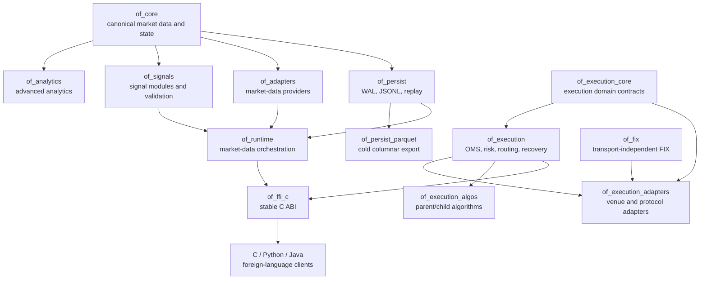
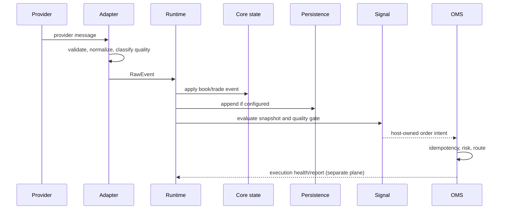

# Architecture

Orderflow is a layered Rust workspace with a stable C ABI and language
bindings. The layers are deliberately separated so market-data analytics,
execution, persistence, and integration concerns can evolve independently.

## Workspace Layers

## Two Runtime Planes

Orderflow has two operational planes:

| Plane | Responsibility | Primary crates |
| --- | --- | --- |
| Market-data plane | Ingest, normalize, materialize books, compute analytics, emit signals, persist/replay | `of_adapters`, `of_core`, `of_analytics`, `of_signals`, `of_runtime`, `of_persist` |
| Execution plane | Validate intent, apply risk, route orders, process reports, reconcile state, recover | `of_execution_core`, `of_execution`, `of_execution_adapters`, `of_fix`, `of_execution_algos` |

The planes may be hosted in one process, but their state and failure semantics
remain separate. An analytics snapshot is input to a strategy decision; it is
not an execution acknowledgement. An execution report is authoritative for
order state; it does not rewrite market-data analytics.

## Ownership Boundaries

The public ownership rules are:

- Adapters own provider-specific transport and decoding.
- `of_core` owns normalized market events and deterministic accumulator state.
- Runtime owns lifecycle, subscriptions, health, and orchestration.
- Persistence owns durable representation and replay contracts.
- Signals own interpretation of analytics, not transport state.
- Execution core owns canonical identifiers, requests, reports, and state rules.
- OMS/execution owns routing, risk, journaling, and reconciliation.
- FFI owns handle validation, buffer negotiation, and ABI-safe conversion.
- Bindings own language-specific lifecycle and ergonomic error handling.

No layer should reach through another layer to mutate its private state. New
behavior belongs in the narrowest layer that can express its invariant.

## Event and Control Flow

The synchronous poll model is intentional. `poll_once` provides a deterministic
host-controlled boundary and remains compatible with the C, Python, and Java
bindings. An implementation may use internal workers where explicitly exposed,
but it must not change the established behavior of the synchronous API.

## Hot Path and Control Plane

### Hot path

The hot path includes provider event handling, normalization, book mutation,
analytics accumulation, bounded queue admission, and order-state transitions.
It should use typed values, integer arithmetic, bounded memory, and explicit
ownership. It must not perform unbounded logging, network calls, blocking file
I/O, or unexpected allocations without a documented exception.

### Control plane

The control plane includes configuration loading, subscription changes, flush
and shutdown barriers, WAL rotation, checkpoint publication, schema inspection,
certification, dashboards, and diagnostics. These operations may allocate or
block, but their effects on hot-path readiness must be explicit.

## Failure Domains

| Failure | Affected state | Required behavior |
| --- | --- | --- |
| Provider disconnect | Adapter/session | Health transition, reconnect policy, quality degradation |
| Sequence gap | Stream/book/analytics | Mark quality, apply documented recovery or halt unsafe output |
| Persistence append failure | Durable history | Fail closed according to policy; expose health and lost/abandoned counts |
| Snapshot buffer too small | Caller output only | Return required capacity; never truncate |
| Invalid order request | Proposed order | Reject before route submission with typed reason |
| Execution report gap | OMS state | Reconcile or hold state; never assume fill success |
| Process restart | In-memory state | Recover from checkpoint/WAL and reconcile external truth |

## Compatibility Boundaries

Existing public Rust methods, C function signatures, `repr(C)` layouts, binding
methods, serialized fields, and default behaviors are compatibility surfaces.
Additive behavior must use new methods, types, fields with compatible defaults,
new feature flags, or new symbols. A change that alters the meaning of an old
field is breaking even when the compiler accepts it.

## Architecture References

- [Workspace coverage inventory](../knowledge-system/coverage-inventory.md)
- [API compatibility policy](../handbook/05-api-reference.md)
- [OMS architecture](../handbook/09-oms-architecture.md)
- [Low-latency design](../handbook/11-low-latency-design.md)
- [Contributor guide](../handbook/06-contributor-guide.md)
