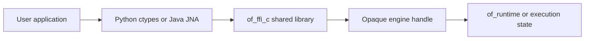

# Binding Integration Model

The C ABI is the compatibility boundary. Python and Java are ergonomic
facades over that boundary; they are not alternate implementations of runtime
state.

## Loading and Ownership

The application owns the handle lifecycle. It must close/destroy every handle
exactly once and must not use a handle after close. Returned strings and output
buffers follow the ownership contract of the specific C function.

## Snapshot Buffer Negotiation

Variable-size JSON outputs use a caller-owned buffer and capacity value:

1. Allocate an initial buffer.
2. Call the C function.
3. If the result is `BufferTooSmall`, read the required capacity.
4. Allocate the requested buffer and retry.
5. Decode only initialized bytes.
6. Treat any other error as a failed operation.

Bindings may hide this loop, but must not silently truncate output or retry
forever. Hosts exposing untrusted depth or diagnostics should apply a memory
ceiling around convenience retries.

## Python

The Python facade provides idiomatic names, context-manager lifecycle, JSON
decoding, and Python exceptions. Production integration should pin the Python
package and native runtime together, check architecture compatibility, keep
callbacks short, account for native callback threads and the GIL, close the
engine deterministically, and preserve native error codes during translation.

## Java

The Java facade provides `AutoCloseable` lifecycle, JNA mappings, Java
exceptions, and Java-friendly snapshot values. Production integration should
select the native library explicitly, keep callback objects alive, avoid wrong
ownership frees, treat callbacks as potentially native-threaded, close engines
on exceptional paths, and keep the JNA interface synchronized with the ABI.

## Compatibility Checklist

- C header matches manifest.
- Exported symbols match the manifest.
- Python ctypes registrations match the header.
- Java JNA declarations match the header.
- High-level methods document ownership and errors.
- Snapshot retries have a bounded application policy.
- Binding smoke tests run against the built native library.

## References

- [C ABI guide](./c.md)
- [Python guide](./python.md)
- [Java guide](./java.md)
- [Binding API inventory](./api-inventory.md)
