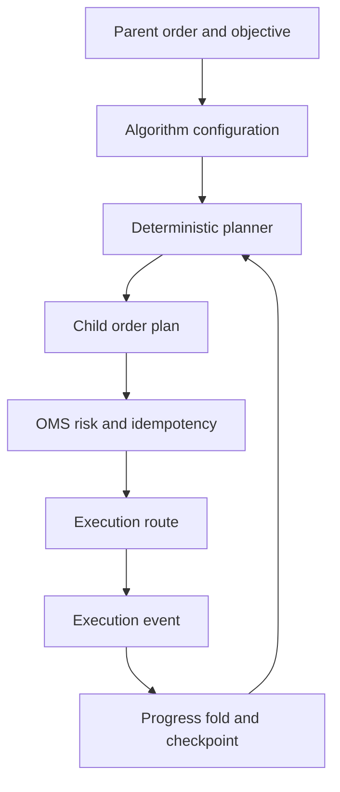

# Execution Algorithms

`of_execution_algos` provides deterministic parent/child planning primitives.
It does not own a venue connection, persistence worker, or asynchronous event
loop. Hosts submit the resulting canonical child requests through the OMS.

## Parent/Child Model

The parent order expresses total quantity, side, instrument, urgency, and
execution objective. A child plan is a proposed action. It is not proof of
submission or fill. Progress is folded only from canonical execution events.

## Planner Families

The crate includes deterministic planning primitives for:

- TWAP time slices;
- POV/participation slices;
- VWAP cumulative-volume curves;
- synthetic iceberg replenishment;
- implementation shortfall;
- passive queue placement;
- smart order routing;
- liquidity-seeking probes/takes;
- aggressive sweeps with price collars;
- spread and multi-leg planning;
- basket synchronization;
- adaptive and conditional planning where configured.

Every planner must document its inputs, rounding, clip limits, remaining
quantity behavior, invalid-input response, price collar, and whether it can
produce zero, passive, or aggressive child actions.

## Determinism and Rounding

The same parent, configuration, market observations, and elapsed-time inputs
must produce the same child plan. Hosts must supply time and observed volume;
planners must not read wall-clock time internally. Integer quantity arithmetic,
explicit remainder handling, and side-aware price rules avoid hidden drift.

## Safety Boundary

Algorithm output still passes through OMS validation, risk, idempotency, route
capability, and kill-switch checks. Algorithm configuration cannot authorize a
route that the execution engine rejects. A failed or uncertain child submission
must be represented in progress and recovery state.

## References

- [Algorithm crate reference](../handbook/05k-of-execution-algos-reference.md)
- [OMS execution manual](../execution/README.md)
- [Low-latency design](../handbook/11-low-latency-design.md)
