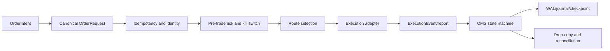

# OMS and Execution

The execution plane converts host-owned order intent into validated, routed,
observable order state. It is independent from market-data analytics and must
remain safe when feeds, venues, processes, or reports fail.

## Execution Flow

## Canonical Identity

Execution identifiers use bounded ASCII types in `of_execution_core`:

| Alias | Capacity | Purpose |
| --- | ---: | --- |
| `ClientOrderId` | 40 bytes | Host/client order identity |
| `VenueOrderId` | 48 bytes | Venue order identity |
| `ExecutionId` | 48 bytes | Fill/report identity |
| `AccountId` | 32 bytes | Trading account |
| `RouteId` | 32 bytes | Execution route |
| `StrategyId` | 32 bytes | Attribution |
| `VenueId` | 16 bytes | Venue identity |
| `InstrumentId` | 32 bytes | Venue/native instrument |
| `ExecutionText` | 128 bytes | Bounded diagnostics |

The bounded representation avoids heap allocation in core identity operations
and rejects non-ASCII or over-capacity values explicitly.

## State and Reports

The OMS state is derived from accepted commands and execution reports. Submit,
cancel, amend, reject, partial fill, complete fill, cancel acknowledgement,
disconnect, and recovery transitions must be explicit. A request sent to a
venue is not evidence that the venue accepted it; an execution report is not
valid merely because it has a plausible symbol.

## One Order Through the OMS

The durable order path is: validate identity and shape, check idempotency,
apply risk and kill-switch policy, journal the accepted command, route through
the adapter, fold authoritative reports into canonical state, and journal the
result. A transport acknowledgement is not a fill. A timeout after submission
is uncertain state, not permission to create a new client order id.

For multiple symbols and routes, every command and report retains account,
route, strategy, instrument, client-order, venue-order, execution, quantity,
side, and sequence identity. A basket can coordinate legs, but a partial fill
in one leg must not become a complete basket fill.

## Safety Controls

Before routing, the execution engine can apply:

- idempotency and duplicate-command checks;
- quantity, price, notional, and position limits;
- route capability and health checks;
- account/session scope;
- kill-switch and reduce-only policy;
- stale or degraded market-data policy owned by the host;
- rate and outstanding-order limits.

Risk rejection must be deterministic and auditable. It must not partially
mutate order state before the rejection is known.

## Recovery and Reconciliation

After restart or uncertain connectivity, the OMS must recover its journal and
checkpoint, restore open commands, and reconcile with venue/drop-copy truth.
Unknown, duplicate, late, or conflicting reports are diagnostic outcomes, not
permission to guess. Trading readiness should remain false until the configured
reconciliation policy is satisfied.

## Connectivity

`of_fix` owns transport-independent FIX codec and session primitives.
`of_execution_adapters` maps protocol/venue behavior into canonical execution
events. The execution core must not depend on a specific broker SDK or network
runtime.

## References

- [Execution core reference](../handbook/05g-of-execution-core-reference.md)
- [OMS reference](../handbook/05h-of-execution-reference.md)
- [FIX reference](../handbook/05j-of-fix-reference.md)
- [Execution adapters](../handbook/05i-of-execution-adapters-reference.md)
- [OMS recovery](../handbook/13-recovery-and-operations.md)
