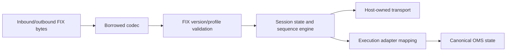

# FIX and Execution Connectivity

`of_fix` is the reusable transport-independent FIX foundation. It owns
tag-value parsing/encoding, validation, session sequencing, resend planning,
sequence snapshots, and certification-oriented evidence. The execution adapter
maps those protocol events into canonical OMS events.

## Layering



The codec must not own sockets or a broker SDK. The session engine receives
caller-supplied time/timer ticks and transport actions, which keeps it
deterministic and testable.

## Codec Contract

The low-allocation path uses borrowed field views and caller-owned scratch
buffers. Validation covers framing, `BodyLength(9)`, `CheckSum(10)`, required
tags, disallowed tags, message type, and profile rules. Malformed input is
rejected with a typed error; it is not partially mapped into an order report.

## Session State

Session behavior includes Logon/Logout, heartbeat, TestRequest, component
identity, inbound sequence tracking, gap detection, ResendRequest,
SequenceReset, duplicate handling, and custom application messages. Sequence
snapshots and resend stores support restart/reconnect recovery. A decreasing or
ambiguous sequence must fail closed according to the session policy.

## Execution Mapping

The adapter translates accepted canonical order requests to profile-specific
messages and maps execution reports back to `ExecutionEvent`. It must preserve
client identity, venue identity, execution identity, quantities, prices,
timestamps, report type, and rejection text. A transport acknowledgement is not
the same as a fill.

## Certification

Certification scripts should cover valid submit/cancel/amend flows, rejects,
partial fills, disconnect/reconnect, malformed messages, sequence gaps,
duplicate reports, and recovery. Evidence must identify the profile, session
configuration, input transcript, expected actions, and actual outputs.

## FIX Session Reasoning

FIX has session messages that maintain the conversation and application
messages that carry business intent and reports. Resend requests, sequence
resets, duplicate flags, and heartbeats therefore cannot be handled as
ordinary business data. The session layer decides whether to hold, replay,
gap-fill, reject, or advance before the execution adapter sees a business
event.

```text
bytes -> framing/checksum -> typed message -> session sequence policy
      -> profile validation -> adapter mapping -> OMS event
```

Before reconnecting, restore the sequence snapshot and resend evidence,
validate the durable log, and establish whether the peer expects reset or
resend. If the store cannot prove what was sent, expose unresolved recovery
instead of assigning new identities or guessing order state.

## References

- [FIX crate reference](../handbook/05j-of-fix-reference.md)
- [Execution adapter reference](../handbook/05i-of-execution-adapters-reference.md)
- [Provider certification](../ops/provider_certification.md)
- [Execution core](../execution/README.md)
