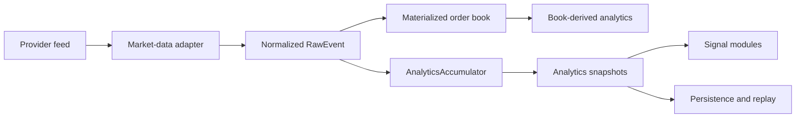

# Foundations

This manual defines the vocabulary and data contracts used by every Orderflow
subsystem. Read it before the crate references: the API names are easier to use
correctly when the event, unit, ordering, and quality rules are explicit.

## What Orderflow Processes

Orderflow consumes normalized market events and produces deterministic state:

The market-data runtime and execution/OMS runtime are separate planes. Market
data can inform an order intent, but analytics state does not itself submit an
order.

## Identity

### `SymbolId`

`of_core::SymbolId` is the canonical instrument identity:

| Field | Type | Meaning | Contract |
| --- | --- | --- | --- |
| `venue` | `String` | Venue or exchange identifier | Provider-normalized, case policy is adapter-defined |
| `symbol` | `String` | Venue-native instrument symbol | Must remain stable for the stream lifetime |

The pair `(venue, symbol)` is the identity key used by subscriptions, book
state, analytics state, persistence discovery, and replay filters. It is not a
globally unique financial instrument definition: contract expiry, currency,
tick size, and multiplier remain instrument metadata supplied by the host or
adapter.

## Price, Quantity, and Time

### Integer normalization

Core market-data prices and quantities use integer fields. A value such as
`500050` is not inherently dollars or points; it is a provider-normalized price
unit. The symbol metadata must supply the scale used for presentation and
cross-system conversion.

This rule avoids floating-point drift in accumulation, comparison, hashing,
replay, and state transitions. Converting to a decimal or floating value is a
boundary operation and must not be performed repeatedly in a hot loop.

### Timestamps

`ts_exchange_ns` is the provider/exchange event timestamp in nanoseconds.
`ts_recv_ns` is the local receive timestamp in nanoseconds. They answer
different questions:

- Exchange time supports event-time windows, replay, and venue chronology.
- Receive time supports latency, freshness, and host-side health analysis.

Zero or missing values are provider-quality concerns, not permission to infer a
timestamp silently. Adapters must document their timestamp provenance.

### Sequence numbers

`sequence` is a provider sequence when available. It is used to detect gaps,
duplicates, regressions, and resets. A sequence number is not a timestamp and
must not be used as one. A provider that has no sequence must use the documented
absence policy rather than synthesizing an apparently authoritative sequence.

## Normalized Events

### `TradePrint`

| Field | Type | Meaning |
| --- | --- | --- |
| `symbol` | `SymbolId` | Instrument identity |
| `price` | `i64` | Normalized trade price |
| `size` | `i64` | Positive traded quantity |
| `aggressor_side` | `Side` | `Bid` or `Ask` aggressor classification |
| `sequence` | `u64` | Provider sequence when available |
| `ts_exchange_ns` | `u64` | Provider event time |
| `ts_recv_ns` | `u64` | Local receive time |

`Side::Bid` and `Side::Ask` describe the aggressor side in a trade print, not
the side of a resting order. The adapter owns the provider-specific
classification rule.

### `BookUpdate`

| Field | Type | Meaning |
| --- | --- | --- |
| `symbol` | `SymbolId` | Instrument identity |
| `side` | `Side` | Bid or ask book side |
| `level` | `u16` | Level index from the top of book |
| `price` | `i64` | Normalized level price |
| `size` | `i64` | Aggregated level quantity |
| `action` | `BookAction` | `Upsert` or `Delete` |
| `sequence` | `u64` | Provider sequence when available |
| `ts_exchange_ns` | `u64` | Provider event time |
| `ts_recv_ns` | `u64` | Local receive time |

`BookAction::Upsert` inserts or replaces the level identified by the side and
level. `BookAction::Delete` removes it according to the adapter/runtime book
contract. A book update is not a complete snapshot.

## Materialized Book State

`BookSnapshot` contains the latest materialized levels for one symbol:

- `bids` and `asks` are level-indexed vectors;
- `last_sequence` is the sequence of the last applied book event;
- the timestamps describe that last applied event;
- consumers must not assume a complete depth is present unless the adapter
  advertises that guarantee;
- gaps, truncation, stale data, and out-of-order events are represented through
  `DataQualityFlags` and health state rather than silently repaired.

## Analytics Snapshots

### Session analytics

`AnalyticsSnapshot` is the compact session view:

| Field | Meaning |
| --- | --- |
| `delta` | Current buy volume minus sell volume |
| `cumulative_delta` | Session accumulation of directional delta |
| `buy_volume` | Total volume classified on the buy/aggressor side |
| `sell_volume` | Total volume classified on the sell/aggressor side |
| `last_price` | Most recent trade price |
| `point_of_control` | Price with the highest accumulated volume |
| `value_area_low` | Lower value-area boundary |
| `value_area_high` | Upper value-area boundary |

`DerivedAnalyticsSnapshot` adds total volume, trade count, integer VWAP, mean
trade size, and directional imbalance in basis points. A zero trade count must
be handled as an empty-session state; consumers must not treat zero-valued
prices as a valid observed price without checking session state.

### Candles

`SessionCandleSnapshot` summarizes the current session. `IntervalCandleSnapshot`
summarizes a rolling exchange-time window and includes `window_ns`, OHLC,
trade count, volume, VWAP, and first/last exchange timestamps.

`CompletedBar` is a completed fixed-interval bar. Its `timestamp_ns` identifies
the interval start, while `open`, `high`, `low`, `close`, `volume`, `tick_count`,
and `vwap` describe only trades assigned to that interval.

## Quality and Gating

`DataQualityFlags` is a bitset describing conditions that can make analytics or
signals unsafe to interpret:

- stale feed;
- sequence gaps;
- clock skew;
- truncated depth;
- out-of-order events;
- degraded adapter/runtime state.

Quality is part of the meaning of a snapshot. A strategy that ignores quality
flags is choosing to act on potentially incomplete state. Signal gates and
execution risk controls should make that choice explicit.

## Determinism Rules

For the same normalized event sequence, symbol metadata, configuration, and
initial state, the accumulator and replay path must produce the same snapshots.
Determinism requires:

1. Stable event ordering or an explicit out-of-order policy.
2. Integer arithmetic in stateful calculations.
3. No wall-clock reads in analytics calculations.
4. Bounded histories with documented eviction behavior.
5. Versioned persistence schemas and explicit migration behavior.

## Next References

- [Core crate reference](../handbook/05a-of-core-reference.md)
- [Adapter reference](../handbook/05b-of-adapters-reference.md)
- [Persistence and replay](../handbook/05d-of-persist-reference.md)
- [Low-latency design](../handbook/11-low-latency-design.md)
