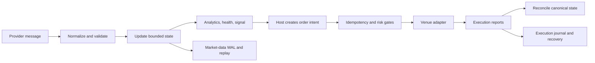
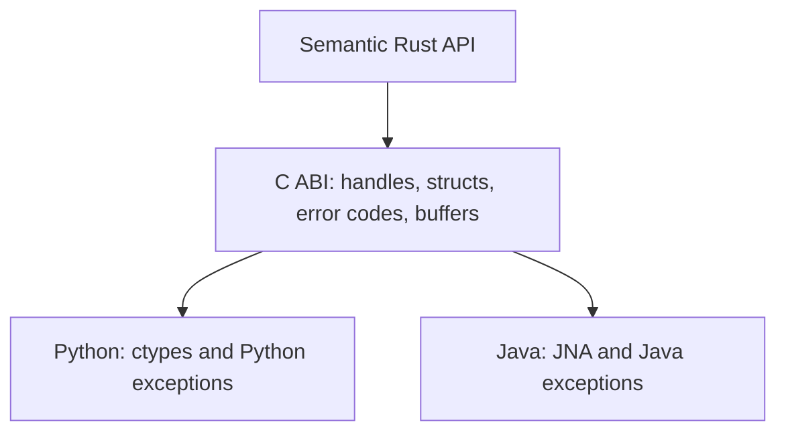

# How to Read the Orderflow Documentation

Orderflow is large because it describes a complete path from a provider's
wire message to a durable, reviewable trading decision. The documentation is
therefore organized around the questions a developer actually has while
building a system, rather than around the order in which crates happen to be
published.

## The Short Version

Orderflow has two related but independent stories:

1. **Market data** tells the system what is happening: trades, book changes,
   quality state, analytics, and signals.
2. **Execution** tells the system what it is allowed to attempt and what the
   venue actually accepted, rejected, cancelled, or filled.

The first story may produce an order intent. It never turns an intent into a
fill by itself. The second story owns that transition and must remain correct
when messages are duplicated, delayed, rejected, reordered, or interrupted by
process failure.

If you remember only one rule, remember this: **an observation is not an
instruction, and an instruction is not an execution**.

## Choose a Starting Point

### I want to understand the domain

Read [What Orderflow Is](./01-orderflow-primer.md), then
[Domain Foundations](../foundations/README.md). The primer explains the
trading concepts in ordinary language. Foundations then defines the exact
meaning of symbols, sides, prices, quantities, timestamps, sequence numbers,
quality flags, and snapshots.

### I want to build a market-data application

Read [System Architecture](./04-architecture.md), then
[the market-data manual](../market-data/README.md) and
[the runtime manual](../runtime/README.md). Finish with the
[end-to-end binding guide](../bindings/end-to-end.md) if the application is
written in C, Python, or Java.

### I want to build a strategy

Read [Strategy Design](./02-strategy-design.md). It explains how to turn a
market hypothesis into observable inputs, a quality gate, a risk decision, and
an execution request. Then read [Signals](../signals/README.md) and the
[strategy cookbook](./08-strategy-cookbook.md).

### I want to submit and manage orders

Read [OMS Architecture](./09-oms-architecture.md), then
[the execution manual](../execution/README.md). These explain the difference
between an order request, a canonical order, a child route, a venue report,
and the state that is recovered after a restart.

### I want to connect a venue

Read [Provider Adapter Authoring](./12-provider-adapter-authoring.md) for
market data, or [FIX and Connectivity](../fix/README.md) and
[execution adapter authoring](./05i-of-execution-adapters-reference.md) for
execution. Do not begin by copying a message parser. Begin by writing down
the provider's identity, sequencing, timestamp, acknowledgement, retry,
reconnect, and recovery contracts.

### I want to operate the system

Read [Recovery and Operations](./13-recovery-and-operations.md),
[the operations manual](../operations/README.md), and the
[release checklist](../ops/release_checklist.md). A system is not production
ready merely because it can connect and submit an order. It must explain what
it knows, what it does not know, what it persisted, and what an operator must
do after uncertainty.

## How Every Reference Page Is Written

Each public concept should be documented at four levels.

### 1. Meaning

What problem does the type or function represent? What is its place in the
event flow? This is the part that lets a new reader build a correct mental
model before seeing syntax.

### 2. Contract

What are the inputs, outputs, units, ownership rules, state transitions,
ordering assumptions, error conditions, and compatibility guarantees? This is
the part an experienced developer uses to review an integration.

### 3. Worked use

What is the smallest complete example? The example must show construction,
configuration, event flow, observation, error handling, and cleanup. A code
fragment that omits the lifecycle is not an end-to-end example.

### 4. Reason and limits

Why was the API designed this way? What does it deliberately not do? What is
safe on the hot path, what belongs on the control plane, and what behavior is
only suitable for simulation? This prevents a technically correct API from
being used incorrectly.

## Reading Rust, C, Python, and Java Together

Rust is the semantic source of truth. The C ABI is the stable binary boundary.
Python and Java are ergonomic projections of that boundary.

When an example is shown in Python or Java, read the Rust reference to answer
what the operation means and the binding reference to answer how ownership,
buffer sizing, errors, and cleanup are expressed in that language.

The bindings do not create a second execution model. For example, a Python
`analytics_snapshot()` call still observes the same snapshot boundary as its
Rust equivalent. The wrapper may retry a buffer allocation, but it must not
silently truncate, reinterpret, or invent fields.

## How to Use the Reference Tables

Generated pages such as the [Rust surface audit](../reference/rust-surface.md)
and [Rust values audit](../reference/rust-values.md) answer a different
question from the narrative manuals:

- the narrative explains relationships and decisions;
- the generated index provides a searchable inventory;
- Rustdoc provides compiler-checked signatures and examples;
- the source provides the final implementation truth.

An inventory is not a tutorial. A tutorial is not a substitute for a field
contract. Use all four layers together.

## The Documentation's Safety Vocabulary

The words below are deliberate:

- **must** means an invariant required for correctness;
- **should** means the production default unless the host has a documented
  reason to choose otherwise;
- **may** means an extension point or optional behavior;
- **best effort** means the result is informative and must not be treated as
  authoritative state;
- **fail closed** means the system refuses to claim a successful or safe state
  when required evidence is missing;
- **additive** means existing signatures, layouts, meanings, and defaults are
  preserved.

## A Complete Example Is More Than a Code Block

When you build an integration, trace one event all the way through the system:

1. Identify the provider message and its timestamp and sequence provenance.
2. Normalize it into a `TradePrint` or `BookUpdate`.
3. Apply it to runtime state and observe quality flags.
4. Persist it if durable replay is enabled.
5. Compute analytics and evaluate a signal only when its inputs are valid.
6. Create an explicit order request owned by the host strategy.
7. Pass it through idempotency, risk, and route checks.
8. Apply venue reports to canonical execution state.
9. Persist enough journal/checkpoint state to recover after a restart.
10. Reconcile with external venue truth before resuming uncertain work.

That sequence is the thread connecting the rest of the documentation. If a
page cannot explain where its API sits in that sequence, the page is not yet
complete.

