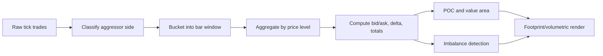

# What Orderflow Is

Orderflow analysis studies how aggressive buyers and sellers interact at each price level.

In practical terms:

- **Order book** shows resting liquidity (limit orders waiting to trade).
- **Trade prints** show actual executions (what really traded).
- **Orderflow** focuses on executions and how they were absorbed or pushed price.

## Why Traders Use It

Traditional candles show where price moved.  
Orderflow helps explain **how** price moved:

- Was the move driven by persistent aggressive buying/selling?
- Was aggression absorbed by passive liquidity?
- Did flow weaken before reversal (exhaustion/divergence)?

## Core Concepts (Plain Language)

- **Bid/Ask Aggression**: if a trade executes at ask (or above), buyers are lifting offers; if at bid (or below), sellers are hitting bids.
- **Delta**: buy volume minus sell volume over a period.
- **Cumulative Delta (CVD)**: running sum of delta over time.
- **POC (Point of Control)**: price with the highest traded volume.
- **Value Area**: price range containing most traded volume (often 70% convention).
- **Imbalance**: unusually strong dominance of buy or sell volume at neighboring price cells.
- **Absorption**: heavy aggressive flow fails to continue price movement because passive liquidity absorbs it.
- **Exhaustion**: trend continues on weaker aggressive participation, often before rotation/reversal.

## Footprint Chart Construction

A footprint (numbers bars / volumetric bars) is built from tick-level executions.

### Input Data Required

At minimum, for each trade:

- symbol
- price
- size
- timestamp
- aggressor side (or classification rule)

Optional but useful:

- sequence numbers (gap/out-of-order checks)
- order book updates for context

### Construction Steps

1. **Choose bar segmentation**: time bars, volume bars, range bars, or session windows.
2. **Create price ladder per bar**: all price levels traded inside the bar.
3. **Accumulate bid/ask volume per price**.
4. **Compute per-price delta and bar delta**.
5. **Apply highlighting rules**: imbalances, stacked imbalances, max delta cells.
6. **Derive profile metrics**: POC and value area bounds.
7. **Render** as `bid x ask` cells or delta cells.



### Typical Cell Math

For a price level `p` in a bar:

- `ask_vol[p] = sum(size where aggressor = buy at p)`
- `bid_vol[p] = sum(size where aggressor = sell at p)`
- `delta[p] = ask_vol[p] - bid_vol[p]`

For bar totals:

- `bar_delta = sum(delta[p])`
- `bar_volume = sum(ask_vol[p] + bid_vol[p])`

### Example Cell Block

```text
Price     Bid x Ask    Delta
5052.25   18 x 62      +44
5052.00   40 x 21      -19
5051.75   55 x 12      -43
```

Interpretation example:

- Upper level has strong buy aggression (`18 x 62`).
- Lower levels show stronger sell aggression.
- Context decides whether this is continuation or absorption.

## How This Repository Maps to These Concepts

Current runtime analytics (`of_core::AnalyticsAccumulator`) compute:

- `delta`
- `cumulative_delta`
- `buy_volume`
- `sell_volume`
- `last_price`
- `point_of_control`
- `value_area_low`
- `value_area_high`

Implementation detail:

- Value area uses a 70% target of total volume around POC.
- Session reset support exists to clear per-symbol analytics context.

## Platform Terminology Mapping

- NinjaTrader: "Order Flow Volumetric Bars"
- Sierra Chart: "Numbers Bars"
- This project dashboard: footprint-style and profile-derived panels over runtime analytics

## External Visual References

If you want platform visuals while reading this primer:

- NinjaTrader volumetric bars help page (includes annotated examples):  
  https://ninjatrader.com/support/helpguides/nt8/order_flow_volumetric_bars.htm
- NinjaTrader overview article with screenshots:  
  https://ninjatrader.com/futures/blogs/order-flow-trading-with-volumetric-bars/
- Sierra Chart Numbers Bars documentation (visual options and coloring rules):  
  https://www.sierrachart.com/index.php?page=doc/NumbersBars.php

See source-backed references in [References](./07-references.md).
