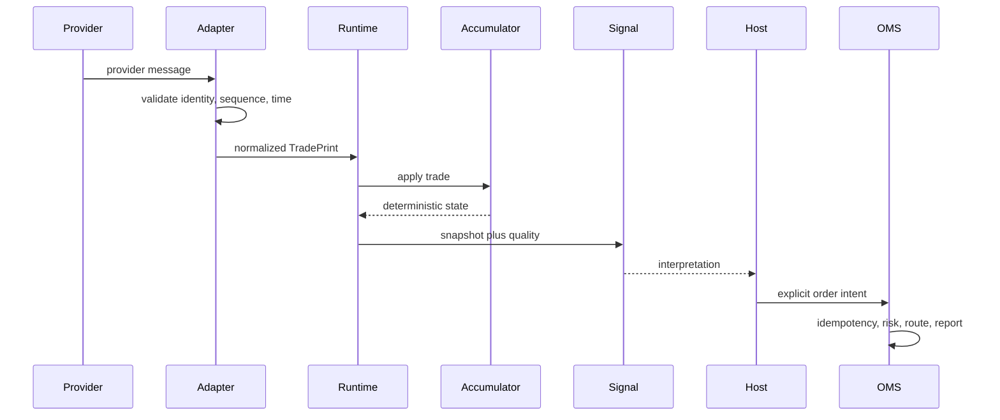
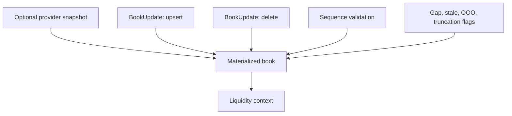
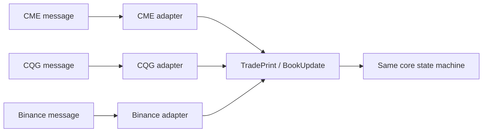
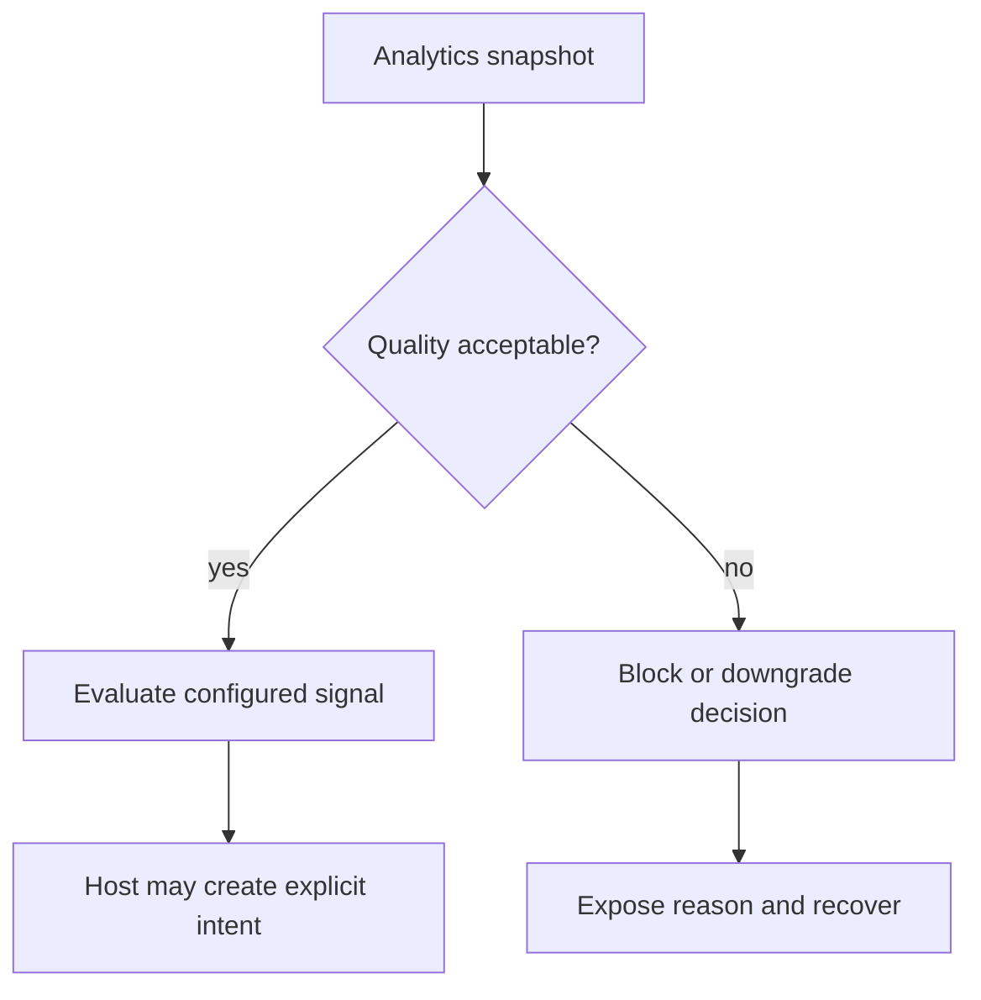

# What Orderflow Is

Orderflow is the study of executed business and the resting liquidity that
surrounds it. A candle tells you that price moved from one value to another.
Orderflow asks what participation produced that movement: who crossed the
spread, where liquidity accepted or rejected that aggression, and whether the
observed activity is complete enough to support a decision.

This distinction matters because a market contains two different kinds of
information:

- **intent**: orders resting in the book and waiting to be matched;
- **evidence**: trades that were actually matched.

An order book can change without a trade. A trade can occur between two book
updates. Neither source is a complete description of the market by itself.
Orderflow systems become useful when they preserve the distinction and relate
the two streams without pretending that one is the other.

## The Causal Chain

Consider a buy trade executed at the offer. The useful interpretation is not
simply “price went up.” The complete chain is:

1. A market-data provider emits a provider-specific message.
2. The adapter validates its identity, sequence, timestamps, and payload.
3. The adapter normalizes it into a `TradePrint`.
4. The runtime applies the trade to the symbol's bounded analytics state.
5. The accumulator updates directional volume, delta, cumulative delta, VWAP,
   profile, and any configured derived measurements.
6. A snapshot exposes the result together with quality state.
7. A signal module may interpret that snapshot under an explicit policy.
8. The host application may create an order intent, but the execution plane
   must still validate, risk-check, route, and reconcile it.


```mermaid
sequenceDiagram
    participant Provider
    participant Adapter
    participant Runtime
    participant Accumulator
    participant Signal
    participant Host
    participant OMS

    Provider->>Adapter: provider message
    Adapter->>Adapter: validate identity, sequence, time
    Adapter->>Runtime: normalized TradePrint
    Runtime->>Accumulator: apply trade
    Accumulator-->>Runtime: deterministic state
    Runtime->>Signal: snapshot plus quality
    Signal-->>Host: interpretation
    Host->>OMS: explicit order intent
    OMS->>OMS: idempotency, risk, route, report
```

The rest of this page explains each step and the assumptions attached to it.

## A Trade Is an Observation, Not a Recommendation

`TradePrint` represents a completed match. Its `price` and `size` describe
what traded; `aggressor_side` describes which side crossed to make the trade.
For example, a buyer lifting the offer is represented as buy aggression. That
does not prove that the buyer will continue buying, that the price will rise,
or that a long position is appropriate. It is one observation in a sequence.

The distinction is important when designing signals:

| Observation | What it can establish | What it cannot establish alone |
| --- | --- | --- |
| Large buy-aggressor trade | Buyers were willing to cross for that quantity | Buyers will continue or price must rise |
| Negative delta | More sell-aggressor volume than buy-aggressor volume in the measured scope | Sellers controlled the next price move |
| Repeated trades at one price | Activity was accepted at that price | Passive liquidity was necessarily absorbing it |
| Price fails to extend despite aggression | Aggression did not produce proportional movement | The failure is a reversal signal without context |
| Book depth disappears | Quoted liquidity changed or was removed | The orders were cancelled rather than executed |

Orderflow makes these observations measurable. It does not remove the need for
context, risk limits, validation, or a no-trade decision.

## The Order Book Is a State Reconstruction

`BookUpdate` is a change to a book, not a book by itself. A provider may send
an upsert for level zero, a delete for level three, a snapshot followed by
increments, or a venue-specific representation of price levels. The adapter
must translate those messages into the normalized action and level contract.

The runtime materializes the current view by applying updates in the accepted
order. This is why sequence and quality state are part of the data model:


```mermaid
flowchart TD
    Snapshot[Optional provider snapshot] --> Book[Materialized book]
    Update1[BookUpdate: upsert] --> Book
    Update2[BookUpdate: delete] --> Book
    Sequence[Sequence validation] --> Book
    Quality[Gap, stale, OOO, truncation flags] --> Book
    Book --> Context[Liquidity context]
```

If update 101 is missing and update 102 arrives, the runtime cannot safely
claim that its book is complete unless the provider's recovery protocol has
repaired the gap. It may continue to expose a degraded book for diagnostics,
or it may block downstream decisions according to policy. The correct choice
is explicit; silently treating 102 as if it followed 101 is not recovery.

## Normalization Preserves Meaning Across Providers

Every provider has its own symbols, integer scales, side conventions, sequence
rules, timestamps, and reconnect behavior. `of_core` should not know those
wire-level details. Adapters translate them at the boundary:


```mermaid
flowchart LR
    CME[CME message] --> CMEAdapter[CME adapter]
    CQG[CQG message] --> CQGAdapter[CQG adapter]
    Binance[Binance message] --> BinanceAdapter[Binance adapter]
    CMEAdapter --> Trade[TradePrint / BookUpdate]
    CQGAdapter --> Trade
    BinanceAdapter --> Trade
    Trade --> Core[Same core state machine]
```

The normalized types deliberately use integer prices and quantities. An
integer is not automatically a dollar, point, contract, or coin amount. The
instrument metadata must explain its scale, tick size, multiplier, and
quantity semantics. Conversion to display decimals belongs at the boundary,
not inside every accumulator operation.

This design gives the project two properties that are easy to lose in a
multi-provider system:

1. Replaying the same normalized event sequence does not depend on which
   provider originally produced it.
2. The core calculations do not accumulate floating-point representation drift
   simply because the live feed and replay feed used different parsing paths.

## What the Accumulator Actually Computes

`AnalyticsAccumulator` is a deterministic state machine. It receives an
ordered stream of normalized trades and updates state. It does not fetch data,
poll a provider, write files, or decide whether to trade.

For a trade (i) with size (q_i), price (p_i), and directional sign
(s_i), the central quantities are conceptually:

```text
buy_volume  = sum(q_i where s_i = buy)
sell_volume = sum(q_i where s_i = sell)
delta       = buy_volume - sell_volume
cumulative_delta = prior_cumulative_delta + delta
vwap        = sum(p_i * q_i) / sum(q_i)
```

The implementation uses the project's normalized integer representation and
its documented rounding/scaling rules. The formulas explain the meaning; the
type and method references define the exact storage and output contract.

### Session scope and window scope

Session analytics accumulate from the last explicit session reset. An interval
or rolling snapshot asks a narrower question: what happened inside a defined
exchange-time window? These scopes must not be mixed:

- a session delta answers a cumulative question;
- an interval delta answers a local question;
- a completed tickbar answers a fixed aggregation question;
- a book snapshot answers current resting-liquidity state, not historical
  traded volume.

The caller must choose the scope that matches the hypothesis. Comparing a
session cumulative delta with a five-second price movement without stating the
scopes is not a reproducible rule.

### Profile, POC, and value area

The accumulator groups traded volume by normalized price. The point of control
is the price bucket with the greatest accumulated volume. The value area is a
volume-based region around the POC according to the configured convention.
These are descriptions of where business occurred; they are not guaranteed
support or resistance levels.

## Quality Is Part of the Result

A snapshot without quality context is incomplete. `DataQualityFlags` records
conditions such as stale data, sequence gaps, clock skew, truncated depth,
out-of-order events, and degraded adapter state.


```mermaid
flowchart TD
    Snapshot[Analytics snapshot] --> Check{Quality acceptable?}
    Check -- yes --> Signal[Evaluate configured signal]
    Check -- no --> Block[Block or downgrade decision]
    Block --> Diagnose[Expose reason and recover]
    Signal --> Intent[Host may create explicit intent]
```

A strategy may choose to trade through a particular warning, but that choice
must be represented as policy rather than hidden inside the analytics layer.
For example, a research replay may retain a signal during a sequence gap to
study sensitivity, while a live execution policy may reject all new orders
until a snapshot recovery is complete.

## Signals Are Interpretations

`of_signals` consumes analytics and context. A signal module can express a
direction, confidence, explanation, lifecycle state, and gating result. It
does not own the provider connection or the order lifecycle.

That separation makes testing clearer:

- test the accumulator with an event sequence and expected snapshots;
- test the signal with snapshots and quality contexts;
- test execution with explicit order requests and venue reports;
- test the integration by connecting those contracts in replay.

It also prevents a common design error: embedding order submission in a
market-data callback. A callback should be able to say “this observation meets
the signal policy.” The host decides whether that observation is actionable,
and the OMS decides whether an action is permitted and durable.

## From Signal to Execution

The execution plane adds controls that market-data analytics cannot provide:

1. **Identity**: which account, route, instrument, and strategy own the order?
2. **Shape validation**: is the side, quantity, price, and time-in-force valid?
3. **Idempotency**: is this a retry of an already accepted command?
4. **Risk**: does the request fit limits, collars, exposure, and kill-switch
   state?
5. **Routing**: which adapter and venue receive the command?
6. **Truth**: what did the venue report, and does canonical state agree?
7. **Recovery**: what must be reconciled after a restart or uncertain timeout?


```mermaid
flowchart LR
    Signal[Signal interpretation] --> Host[Host-owned intent]
    Host --> Validate[Shape and identity validation]
    Validate --> Idempotency[Duplicate and retry policy]
    Idempotency --> Risk[Risk and kill switch]
    Risk --> Route[Route adapter]
    Route --> Reports[Execution reports]
    Reports --> State[Canonical order state]
    State --> Recovery[Journal, checkpoint, reconciliation]
```

The order is not complete because a function returned successfully. It is
complete when the execution state has an authoritative terminal outcome, or
when the system has explicitly recorded that the outcome is uncertain and
requires reconciliation.

## A Worked Miniature

Suppose a provider reports:

1. bid level zero at normalized price `10000`, size `20`;
2. ask level zero at normalized price `10001`, size `15`;
3. a trade at `10001`, size `5`, classified as buy aggression.

The correct interpretation is:

- the trade consumed or matched liquidity at the offer-side price;
- buy volume increases by five and sell volume does not;
- delta increases by five for the relevant scope;
- the book snapshot may or may not show ask size ten afterward, depending on
  whether a corresponding book update has arrived;
- analytics can report the trade immediately, but the book is not allowed to
  be inferred from the trade alone;
- a signal may use the positive delta, but no order is submitted unless the
  host creates one and the execution plane accepts it.

This example is intentionally small. Production behavior adds sequence checks,
timestamps, persistence, reconnects, backpressure, and recovery, but it does
not change the causal meaning of the event.

## What Orderflow Does Not Promise

Orderflow does not promise that:

- a positive delta predicts a positive return;
- displayed depth represents firm executable liquidity;
- a provider's reconnect restored a complete book;
- a signal is profitable because it is deterministic;
- a successful submit call is a fill;
- a replay is valid when its input quality is degraded;
- a cross-language wrapper can remove the host's lifecycle responsibility.

The project's value is that these uncertainties are represented at explicit
boundaries. That makes a system inspectable, testable, and safer to extend.

## Continue Learning

- [How to Read the Documentation](./00-how-to-read.md)
- [Domain Foundations](../foundations/README.md)
- [System Architecture](./04-architecture.md)
- [Building a Strategy](./02-strategy-design.md)
- [Persistence and Replay](../persistence/README.md)
- [OMS Architecture](./09-oms-architecture.md)
- [Low-Latency Design](./11-low-latency-design.md)
