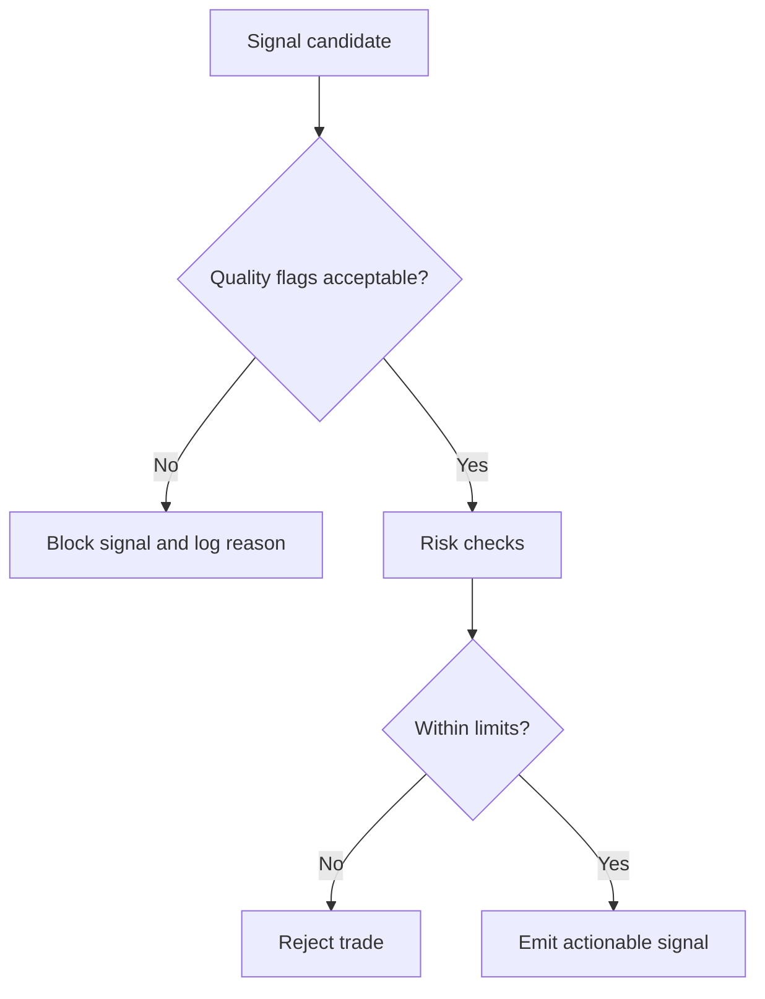

# Building an Orderflow Strategy

This section shows how to build a strategy from idea to executable rules.

## Strategy Development Stack

1. **Market hypothesis**: what behavior do you expect and why?
2. **Observable evidence**: which orderflow signals should appear?
3. **Entry rule**: exact trigger conditions.
4. **Risk rule**: stop, invalidation, and size.
5. **Exit rule**: target, trail, or condition-based exit.
6. **Review loop**: measure and refine.

## Example Hypotheses

- **Absorption reversal**: persistent sell aggression into support fails to make new lows.
- **Imbalance continuation**: stacked buy imbalances after value acceptance continue higher.
- **Delta divergence**: price makes new high but cumulative delta does not confirm.

## Turning Concepts into Rules

Good rule sets are machine-checkable, not narrative.

### Rule Template

- Context:
  - Session profile relation (inside/outside value area)
  - Trend filter (optional)
- Trigger:
  - Threshold(s) on delta/imbalance/volume
  - Timing condition (bar close, N ticks, etc.)
- Invalidation:
  - Price level breach
  - Quality flag breach (stale feed, sequence gaps)
- Risk:
  - Max loss per trade
  - Max exposure per session
- Exit:
  - Target by structure
  - Time stop
  - Opposite signal

## Example: Absorption Reversal (Pseudo Rules)

```text
IF
  price tests prior support
  AND bar_delta is strongly negative
  AND low does not extend materially
  AND next bar closes back above support
THEN
  enter long
  stop = below support - buffer
  target = POC or prior swing
  cancel if data_quality has STALE_FEED or SEQUENCE_GAP
```

## Example: Continuation with Stacked Imbalance

```text
IF
  market is above session POC
  AND >= 3 adjacent ask-side imbalances
  AND pullback holds above imbalance stack
THEN
  enter long on continuation trigger
  stop = below stack base
  target = measured move or next liquidity zone
```

## Quality Gating Is Not Optional

The runtime includes quality flags (`STALE_FEED`, `SEQUENCE_GAP`, `OUT_OF_ORDER`, `ADAPTER_DEGRADED`, etc.).  
A production strategy should gate entries/exits when data quality is degraded.



## Validation Workflow

1. Build replay dataset by venue/symbol/session.
2. Run deterministic replays with fixed configuration.
3. Record outcomes, false positives, and adverse excursions.
4. Stress test around known volatile windows.
5. Promote only after risk and data-quality behavior are acceptable.

## Common Failure Modes

- Rules too discretionary ("looks strong") instead of measurable.
- Ignoring feed degradation and sequence issues.
- Optimizing thresholds on one regime only.
- No explicit stop or invalidation logic.
- Conflating pattern recognition with causality.
