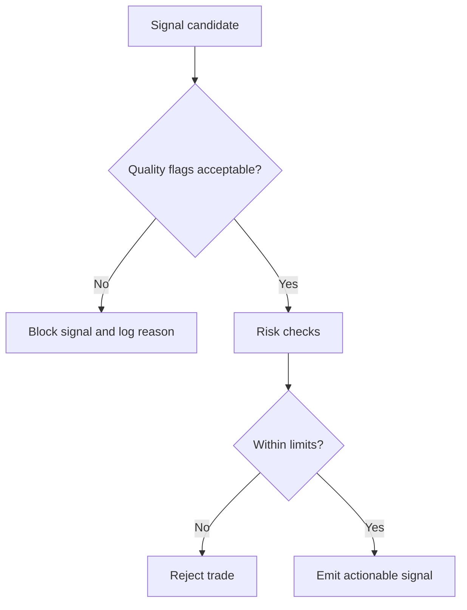

# Building an Orderflow Strategy

This section shows how to build a strategy from idea to executable rules.

## Strategy Development Stack

1. **Market hypothesis**: what behavior do you expect and why?
2. **Observable evidence**: which orderflow signals should appear?
3. **Entry rule**: exact trigger conditions.
4. **Risk rule**: stop, invalidation, and size.
5. **Exit rule**: target, trail, or condition-based exit.
6. **Review loop**: measure and refine.

## Example Hypotheses

- **Absorption reversal**: persistent sell aggression into support fails to make new lows.
- **Imbalance continuation**: stacked buy imbalances after value acceptance continue higher.
- **Delta divergence**: price makes new high but cumulative delta does not confirm.

## Turning Concepts into Rules

Good rule sets are machine-checkable, not narrative.

### Rule Template

- Context:
  - Session profile relation (inside/outside value area)
  - Trend filter (optional)
- Trigger:
  - Threshold(s) on delta/imbalance/volume
  - Timing condition (bar close, N ticks, etc.)
- Invalidation:
  - Price level breach
  - Quality flag breach (stale feed, sequence gaps)
- Risk:
  - Max loss per trade
  - Max exposure per session
- Exit:
  - Target by structure
  - Time stop
  - Opposite signal

## Example: Absorption Reversal (Pseudo Rules)

```text
IF
  price tests prior support
  AND bar_delta is strongly negative
  AND low does not extend materially
  AND next bar closes back above support
THEN
  enter long
  stop = below support - buffer
  target = POC or prior swing
  cancel if data_quality has STALE_FEED or SEQUENCE_GAP
```

## Example: Continuation with Stacked Imbalance

```text
IF
  market is above session POC
  AND >= 3 adjacent ask-side imbalances
  AND pullback holds above imbalance stack
THEN
  enter long on continuation trigger
  stop = below stack base
  target = measured move or next liquidity zone
```

## Quality Gating Is Not Optional

The runtime includes quality flags (`STALE_FEED`, `SEQUENCE_GAP`, `OUT_OF_ORDER`, `ADAPTER_DEGRADED`, etc.).  
A production strategy should gate entries/exits when data quality is degraded.



## Validation Workflow

1. Build replay dataset by venue/symbol/session.
2. Run deterministic replays with fixed configuration.
3. Record outcomes, false positives, and adverse excursions.
4. Stress test around known volatile windows.
5. Promote only after risk and data-quality behavior are acceptable.

## Building Strategies With These Crates

The project is intentionally split so a strategy can be developed in layers.

### Layer 1: Feature discovery with `of_core`

Use `of_core::AnalyticsAccumulator` when you want to answer:

- does delta actually lead the move I care about?
- does VWAP or value-area context matter?
- what rolling window or session boundary is appropriate?

This is the fastest way to validate a market hypothesis with deterministic
inputs and no transport/runtime complexity.

### Layer 2: Formalize the decision with `of_signals`

Once the hypothesis is measurable, move it into a `SignalModule`.

This gives you:

- deterministic replay behavior
- explicit quality gating
- a stable `SignalSnapshot` contract

### Layer 3: Operationalize with `of_runtime`

Once the model is worth running in practice, use `of_runtime` for:

- adapter or external-feed ingest
- symbol/session tracking
- health gating
- persistence and replay
- cross-language exposure through C/Python/Java

## Real Strategy Example: Absorption Reversal

### Hypothesis

Aggressive selling into support should fail before a reversal if the traded
volume stays heavy but price cannot displace meaningfully below value or POC.

### Crate mapping

- `of_core`: compute `delta`, `point_of_control`, `value_area_low`
- `of_signals::AbsorptionSignal`: convert that context into `LongBias` or `ShortBias`
- `of_runtime`: block the signal when feed quality degrades and persist the
  session for post-trade review

### Execution outline

1. collect a replay dataset for one venue/symbol/session regime
2. compute analytics via `AnalyticsAccumulator`
3. test multiple `AbsorptionSignal::new(threshold, price_band)` settings
4. choose one setting that holds across more than one session type
5. run the signal inside `of_runtime`
6. persist and replay bad outcomes for review

## Real Strategy Example: Continuation Breakout

### Hypothesis

When cumulative delta and current delta both confirm a move outside value area,
follow-through is more likely than immediate reversal.

### Crate mapping

- `of_core`: session value area, POC, delta, cumulative delta
- `of_signals::SweepDetectionSignal`: breakout trigger
- `of_signals::CumulativeDeltaSignal`: directional context
- `of_signals::CompositeSignal`: require agreement between context and trigger

### Practical rule shape

```text
IF
  cumulative_delta > regime_threshold
  AND delta > trigger_threshold
  AND price breaks above value_area_high by breakout_ticks
  AND quality flags are clear
THEN
  emit LongBias
ELSE
  remain Neutral or Blocked
```

## Strategy Engineering Rules

- treat data quality as part of the strategy, not as infrastructure trivia
- prefer additive features first, then more complex state machines later
- keep every threshold tied to a measurable concept
- preserve replay parity by using normalized event types and deterministic modules
- persist enough data to inspect losses and false positives after the fact

## Common Failure Modes

- Rules too discretionary ("looks strong") instead of measurable.
- Ignoring feed degradation and sequence issues.
- Optimizing thresholds on one regime only.
- No explicit stop or invalidation logic.
- Conflating pattern recognition with causality.
