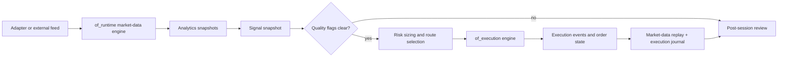
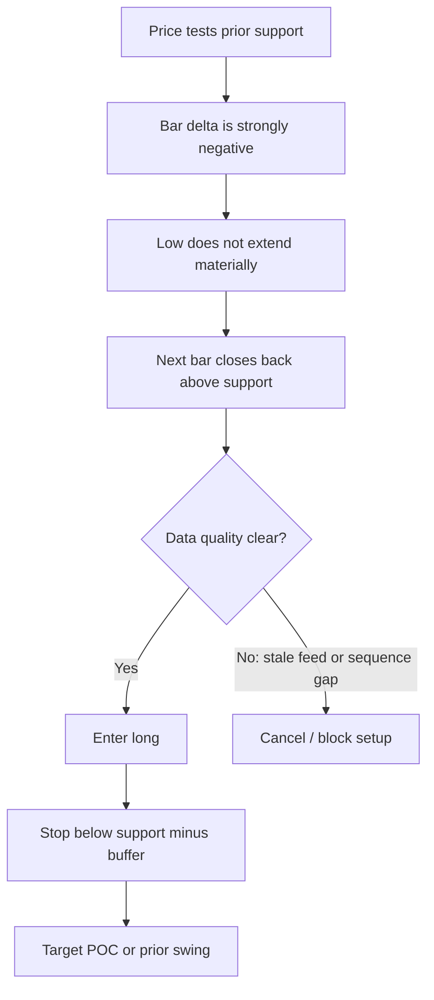
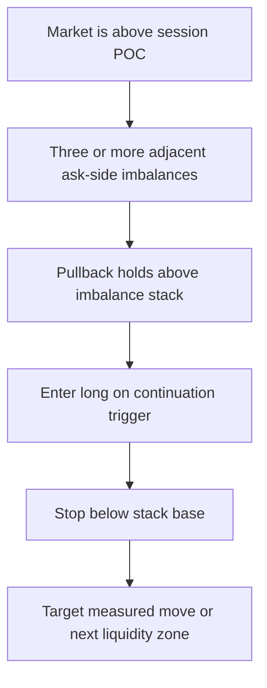
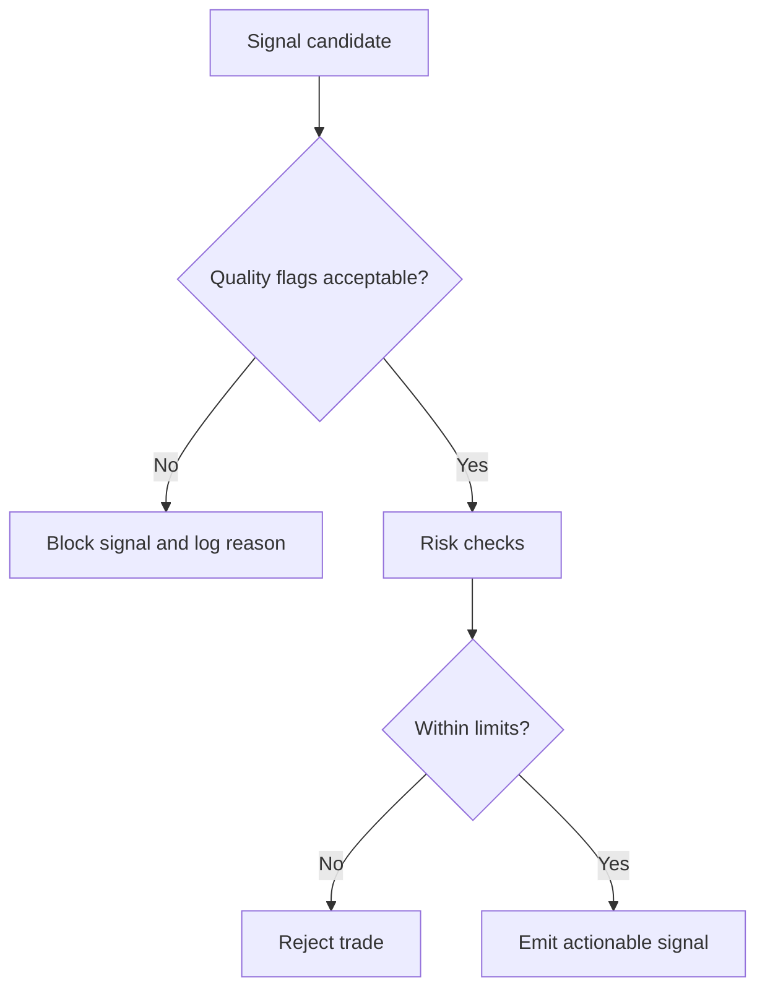
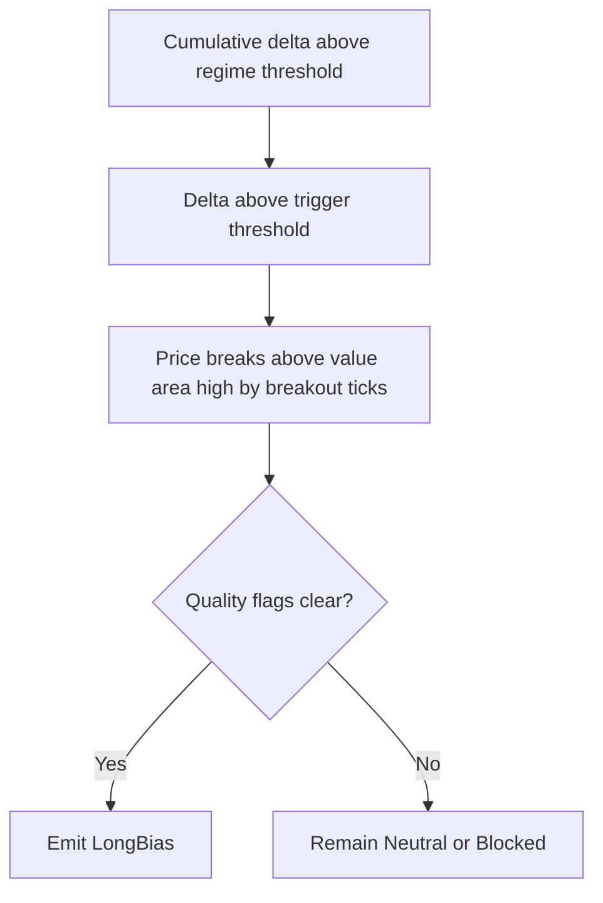

# Building an Orderflow Strategy

This section shows how to build a strategy from idea to executable rules.

## Strategy Development Stack

1. **Market hypothesis**: what behavior do you expect and why?
2. **Observable evidence**: which orderflow signals should appear?
3. **Entry rule**: exact trigger conditions.
4. **Risk rule**: stop, invalidation, and size.
5. **Exit rule**: target, trail, or condition-based exit.
6. **Review loop**: measure and refine.

In `0.4.0`, a complete Orderflow strategy should be described as two explicit
planes:

- **market-data plane**: adapters, external ingest, analytics, signals,
  quality flags, persistence, and replay
- **execution plane**: route selection, risk checks, submit/cancel/amend,
  order-state transitions, command reports, journals, recovery, and
  reconciliation

Keep those planes separate in code. A signal is not an order. A strategy should
first prove that market data is clean, the setup is measurable, and risk allows
the intent. Only then should it create an execution request.


```mermaid
flowchart LR
  Feed[Adapter or external feed]
  Runtime[of_runtime market-data engine]
  Analytics[Analytics snapshots]
  Signal[Signal snapshot]
  Quality{Quality flags clear?}
  Sizing[Risk sizing and route selection]
  Exec[of_execution engine]
  Report[Execution events and order state]
  Journal[Market-data replay + execution journal]
  Review[Post-session review]

  Feed --> Runtime --> Analytics --> Signal --> Quality
  Quality -- no --> Review
  Quality -- yes --> Sizing --> Exec --> Report --> Journal --> Review
```

## End-To-End Strategy Shape

This section shows the full shape developers should copy when they are learning
the library. It uses deterministic external ingest and simulated execution so
the example is safe to run without a broker.

The example implements a small continuation strategy:

- ingest book and trade events,
- read analytics and signal snapshots,
- block trading when data quality is degraded,
- size a route/account/symbol-scoped order,
- submit through simulated execution,
- inspect the resulting execution events,
- poll final metrics for review.

```python
from orderflow import (
    BookAction,
    DataQualityFlags,
    Engine,
    EngineConfig,
    ExecutionEngine,
    ExecutionOrderType,
    ExecutionSide,
    ExecutionTimeInForce,
    ExternalFeedPolicy,
    OrderRequest,
    RiskLimits,
    RouteConfig,
    Side,
    StreamKind,
    Symbol,
)


def quality_is_clear(snapshot: dict) -> bool:
    return int(snapshot.get("quality_flags", 0)) == DataQualityFlags.NONE


def continuation_bias(analytics: dict, signal: dict) -> bool:
    delta = int(analytics.get("delta", 0))
    cumulative_delta = float(analytics.get("cumulative_delta", 0.0))
    confidence = float(signal.get("confidence", 0.0))
    return delta > 0 and cumulative_delta > 0.0 and confidence >= 0.50


symbol = Symbol("SIM", "ES", depth_levels=10)
limits = RiskLimits(
    kill_switch=False,
    max_order_qty=10,
    max_order_notional=1_000_000,
    max_open_orders=1,
    max_open_notional=1_000_000,
    price_band_ticks=0,
)
routes = [RouteConfig("SIM", "ACC", "SIM", "ES", True, limits)]

with Engine(EngineConfig(instance_id="strategy-demo")) as market, ExecutionEngine(routes) as execution:
    market.configure_external_feed(ExternalFeedPolicy(stale_after_ms=2_000, enforce_sequence=True))
    market.subscribe(symbol, StreamKind.ANALYTICS)
    market.subscribe(symbol, StreamKind.SIGNALS)

    market.ingest_book(symbol, Side.BID, 0, 500_000, 100, BookAction.UPSERT, sequence=1)
    market.ingest_book(symbol, Side.ASK, 0, 500_025, 120, BookAction.UPSERT, sequence=2)
    market.ingest_trade(symbol, 500_025, 3, Side.ASK, sequence=3)
    market.poll_once(DataQualityFlags.NONE)

    analytics = market.analytics_snapshot(symbol)
    signal = market.signal_snapshot(symbol)

    if quality_is_clear(analytics) and continuation_bias(analytics, signal):
        order = OrderRequest(
            client_order_id="STRAT-0001",
            account_id="ACC",
            route_id="SIM",
            strategy_id="CONT",
            venue="SIM",
            instrument="ES",
            side=ExecutionSide.BUY,
            order_type=ExecutionOrderType.LIMIT,
            time_in_force=ExecutionTimeInForce.DAY,
            quantity=1,
            limit_price=500_025,
            ts_recv_ns=4,
        )
        events = execution.submit_order(order)
        state = execution.order_state("STRAT-0001")
        metrics = execution.execution_metrics()

        print("events", events)
        print("state", state)
        print("metrics", metrics)
    else:
        print("blocked", analytics, signal)
```

This is still a simulated example. A production application must add:

- real adapter or external broker-feed ownership,
- symbol metadata for tick-size and decimal conversion,
- explicit strategy ids and client-order-id generation,
- durable market-data persistence and execution journaling,
- venue/broker adapter certification checks,
- reconnect, recovery, and reconciliation policy,
- operational metrics and alerting.

## Concurrent Strategy Shape

Use the concurrent execution worker when several strategy components may create
execution intent at the same time. The worker preserves one native owner for
order state while producer code gets bounded queue access.

```python
from orderflow import ConcurrentExecutionConfig, ConcurrentExecutionEngine

config = ConcurrentExecutionConfig(
    command_capacity=256,
    report_capacity=256,
    event_buffer_capacity=32,
)

with ConcurrentExecutionEngine(routes, config) as execution:
    sequence = execution.submit_order(OrderRequest(
        "STRAT-0002",
        "ACC",
        "SIM",
        "CONT",
        "SIM",
        "ES",
        ExecutionSide.BUY,
        ExecutionOrderType.LIMIT,
        ExecutionTimeInForce.DAY,
        1,
        500_025,
    ))

    report = None
    while report is None:
        report = execution.try_recv_report()

    assert report.sequence == sequence
    if report.result_code == 0:
        print("accepted", report.events)
    else:
        print("rejected or failed", report.result_code, report.events)
```

Backpressure is a real strategy outcome. If a command cannot be queued, the
strategy should not assume the order exists. It should log the failed intent,
pause or retry according to policy, and avoid creating duplicate client order
ids for uncertain commands.

## Example Hypotheses

- **Absorption reversal**: persistent sell aggression into support fails to make new lows.
- **Imbalance continuation**: stacked buy imbalances after value acceptance continue higher.
- **Delta divergence**: price makes new high but cumulative delta does not confirm.

## Turning Concepts into Rules

Good rule sets are machine-checkable, not narrative.

### Rule Template

- Context:
  - Session profile relation (inside/outside value area)
  - Trend filter (optional)
- Trigger:
  - Threshold(s) on delta/imbalance/volume
  - Timing condition (bar close, N ticks, etc.)
- Invalidation:
  - Price level breach
  - Quality flag breach (stale feed, sequence gaps)
- Risk:
  - Max loss per trade
  - Max exposure per session
- Exit:
  - Target by structure
  - Time stop
  - Opposite signal

## Example: Absorption Reversal (Pseudo Rules)


```mermaid
flowchart TD
  A[Price tests prior support]
  B[Bar delta is strongly negative]
  C[Low does not extend materially]
  D[Next bar closes back above support]
  E{Data quality clear?}
  F[Enter long]
  G[Stop below support minus buffer]
  H[Target POC or prior swing]
  I[Cancel / block setup]

  A --> B --> C --> D --> E
  E -- Yes --> F --> G --> H
  E -- No: stale feed or sequence gap --> I
```

## Example: Continuation with Stacked Imbalance


```mermaid
flowchart TD
  A[Market is above session POC]
  B[Three or more adjacent ask-side imbalances]
  C[Pullback holds above imbalance stack]
  D[Enter long on continuation trigger]
  E[Stop below stack base]
  F[Target measured move or next liquidity zone]

  A --> B --> C --> D --> E --> F
```

## Quality Gating Is Not Optional

The runtime includes quality flags (`STALE_FEED`, `SEQUENCE_GAP`, `OUT_OF_ORDER`, `ADAPTER_DEGRADED`, etc.).  
A production strategy should gate entries/exits when data quality is degraded.


```mermaid
flowchart TD
  A[Signal candidate] --> B{Quality flags acceptable?}
  B -- No --> C[Block signal and log reason]
  B -- Yes --> D[Risk checks]
  D --> E{Within limits?}
  E -- No --> F[Reject trade]
  E -- Yes --> G[Emit actionable signal]
```

## Validation Workflow

1. Build replay dataset by venue/symbol/session.
2. Run deterministic replays with fixed configuration.
3. Record outcomes, false positives, and adverse excursions.
4. Stress test around known volatile windows.
5. Promote only after risk and data-quality behavior are acceptable.

## Building Strategies With These Crates

The project is intentionally split so a strategy can be developed in layers.

### Layer 1: Feature discovery with `of_core`

Use `of_core::AnalyticsAccumulator` when you want to answer:

- does delta actually lead the move I care about?
- does VWAP or value-area context matter?
- what rolling window or session boundary is appropriate?

This is the fastest way to validate a market hypothesis with deterministic
inputs and no transport/runtime complexity.

### Layer 2: Formalize the decision with `of_signals`

Once the hypothesis is measurable, move it into a `SignalModule`.

This gives you:

- deterministic replay behavior
- explicit quality gating
- a stable `SignalSnapshot` contract

### Layer 3: Operationalize with `of_runtime`

Once the model is worth running in practice, use `of_runtime` for:

- adapter or external-feed ingest
- symbol/session tracking
- health gating
- persistence and replay
- cross-language exposure through C/Python/Java

## Real Strategy Example: Absorption Reversal

### Hypothesis

Aggressive selling into support should fail before a reversal if the traded
volume stays heavy but price cannot displace meaningfully below value or POC.

### Crate mapping

- `of_core`: compute `delta`, `point_of_control`, `value_area_low`
- `of_signals::AbsorptionSignal`: convert that context into `LongBias` or `ShortBias`
- `of_runtime`: block the signal when feed quality degrades and persist the
  session for post-trade review

### Execution outline

1. collect a replay dataset for one venue/symbol/session regime
2. compute analytics via `AnalyticsAccumulator`
3. test multiple `AbsorptionSignal::new(threshold, price_band)` settings
4. choose one setting that holds across more than one session type
5. run the signal inside `of_runtime`
6. persist and replay bad outcomes for review

## Real Strategy Example: Continuation Breakout

### Hypothesis

When cumulative delta and current delta both confirm a move outside value area,
follow-through is more likely than immediate reversal.

### Crate mapping

- `of_core`: session value area, POC, delta, cumulative delta
- `of_signals::SweepDetectionSignal`: breakout trigger
- `of_signals::CumulativeDeltaSignal`: directional context
- `of_signals::CompositeSignal`: require agreement between context and trigger

### Practical rule shape


```mermaid
flowchart TD
  A[Cumulative delta above regime threshold]
  B[Delta above trigger threshold]
  C[Price breaks above value area high by breakout ticks]
  D{Quality flags clear?}
  E[Emit LongBias]
  F[Remain Neutral or Blocked]

  A --> B --> C --> D
  D -- Yes --> E
  D -- No --> F
```

## Strategy Engineering Rules

- treat data quality as part of the strategy, not as infrastructure trivia
- prefer additive features first, then more complex state machines later
- keep every threshold tied to a measurable concept
- preserve replay parity by using normalized event types and deterministic modules
- persist enough data to inspect losses and false positives after the fact

## Common Failure Modes

- Rules too discretionary ("looks strong") instead of measurable.
- Ignoring feed degradation and sequence issues.
- Optimizing thresholds on one regime only.
- No explicit stop or invalidation logic.
- Conflating pattern recognition with causality.
