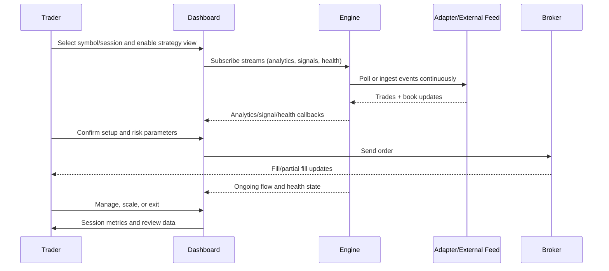

# Real Trade Workflow

This is a production-oriented flow from pre-market analysis to post-trade review.

## Phase 1: Preparation

- Define the instrument, session, and risk limits.
- Mark key higher-timeframe levels and expected volatility windows.
- Load data feed and confirm quality status (connectivity, sequence health).
- Prepare scenarios:
  - continuation
  - reversal
  - no-trade conditions

## Phase 2: Live Analysis

- Monitor flow around decision levels (support/resistance, value area boundaries, POC).
- Watch aggression versus price response:
  - aggression + movement = continuation candidate
  - aggression + no movement = absorption candidate
- Confirm with session context (inside/outside value area, rotational vs directional behavior).

## Phase 3: Decision and Execution

- Trigger only when rule conditions are satisfied.
- Enforce position sizing and max-risk limits.
- Submit order and attach invalidation logic (hard stop or automation equivalent).

## Phase 4: Management

- Reassess after each significant event:
  - fresh imbalance
  - structural break
  - quality degradation flag
- Reduce or exit when premise breaks.
- Avoid adding risk during degraded data quality.

## Phase 5: Post-trade Review

- Capture:
  - setup type
  - entry quality
  - adverse excursion
  - exit efficiency
- Compare expected orderflow behavior versus observed behavior.
- Update thresholds/rules only with enough sample size.

## End-to-End Sequence

## Decision Checklist (Operational)

- Is the setup type clearly identified?
- Is data quality acceptable?
- Is stop distance valid for current volatility?
- Is max loss within plan?
- Is the exit logic explicit before entry?

## Risk and Compliance Notes

- Futures and leveraged products carry substantial risk.
- Simulated/hypothetical performance has structural limitations.
- Use proper disclosures when presenting simulated strategy results.

See [References](./07-references.md) for CFTC and NFA links.
