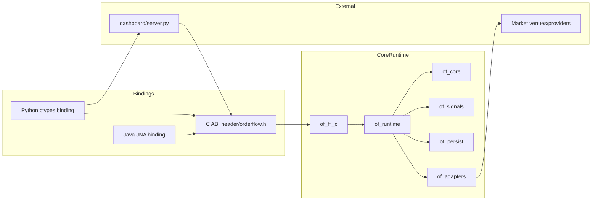
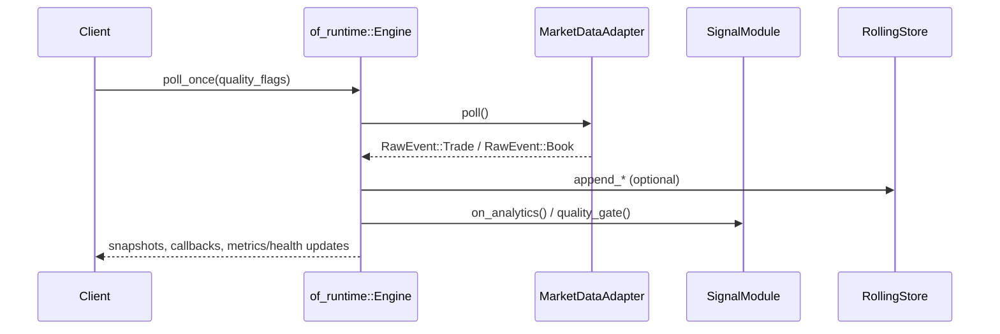
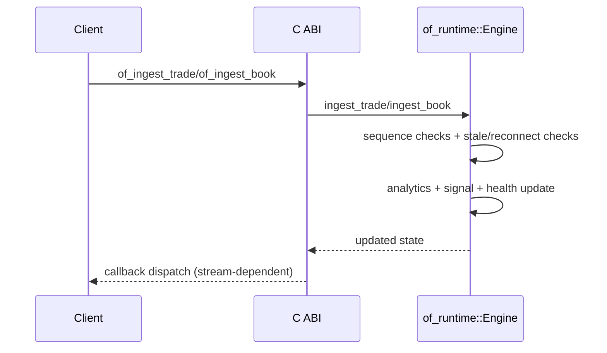
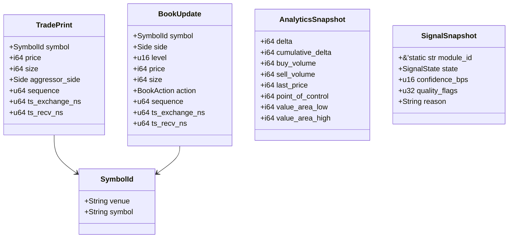

# Architecture

This section explains how components interact and where responsibilities live.

## High-Level Component Map

## Responsibility Boundaries

- `of_core`: canonical data structures + analytics accumulator.
- `of_signals`: signal trait + built-in delta momentum, volume imbalance, and cumulative delta implementations.
- `of_adapters`: provider abstraction and concrete adapters (feature-gated).
- `of_persist`: rolling JSONL persistence, typed readback, and retention pruning.
- `of_runtime`: lifecycle, polling/ingest processing, quality supervision, health state.
- `of_ffi_c`: stable C ABI and callback dispatch.
- `bindings/python`: ctypes wrapper over C ABI.
- `bindings/java`: JNA wrapper over C ABI.

## Runtime Event Paths

### Path A: Adapter-driven polling

### Path B: External ingest (no adapter stream required)

## Key Runtime Data Models (UML-style)

## Stream and Callback Semantics

The C ABI subscription kind values are:

- `1` = `BOOK`
- `2` = `TRADES`
- `3` = `ANALYTICS`
- `4` = `SIGNALS`
- `5` = `HEALTH` (emits on health transitions, not every poll)
- `6` = `BOOK_SNAPSHOT` (emits materialized book state after book changes)

Health uses a monotonic `health_seq` and only emits when the runtime fingerprint changes.

## Quality Supervision Model

Runtime quality state can include:

- `STALE_FEED`
- `SEQUENCE_GAP`
- `CLOCK_SKEW`
- `DEPTH_TRUNCATED`
- `OUT_OF_ORDER`
- `ADAPTER_DEGRADED`

External ingest supports:

- stale threshold (`stale_after_ms`)
- sequence enforcement (`enforce_sequence`)
- reconnecting state toggle

## Important Current Behavior

- `of_get_book_snapshot(...)` returns a materialized snapshot with `bids`, `asks`, `last_sequence`, and timestamps once book updates have been observed for the symbol.
- Analytics and signal snapshots are implemented and populated.
- Metrics and health payloads are implemented and used by bindings/dashboard.
