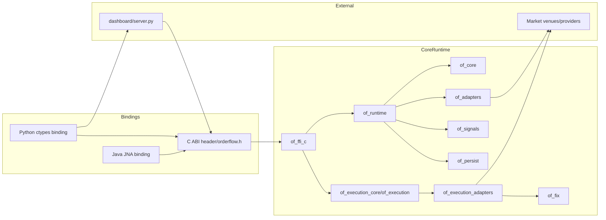
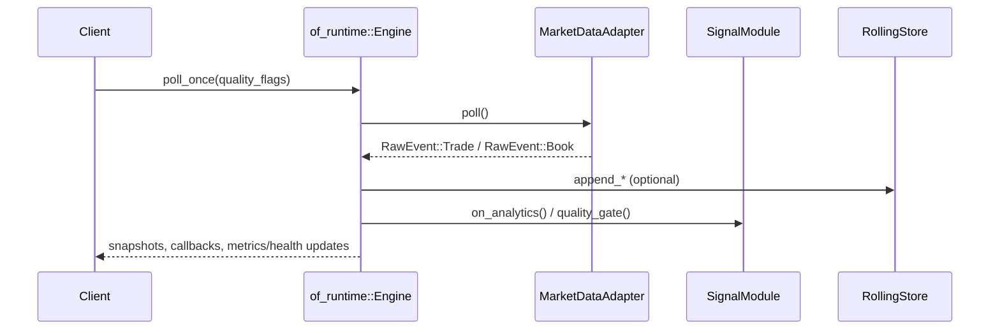
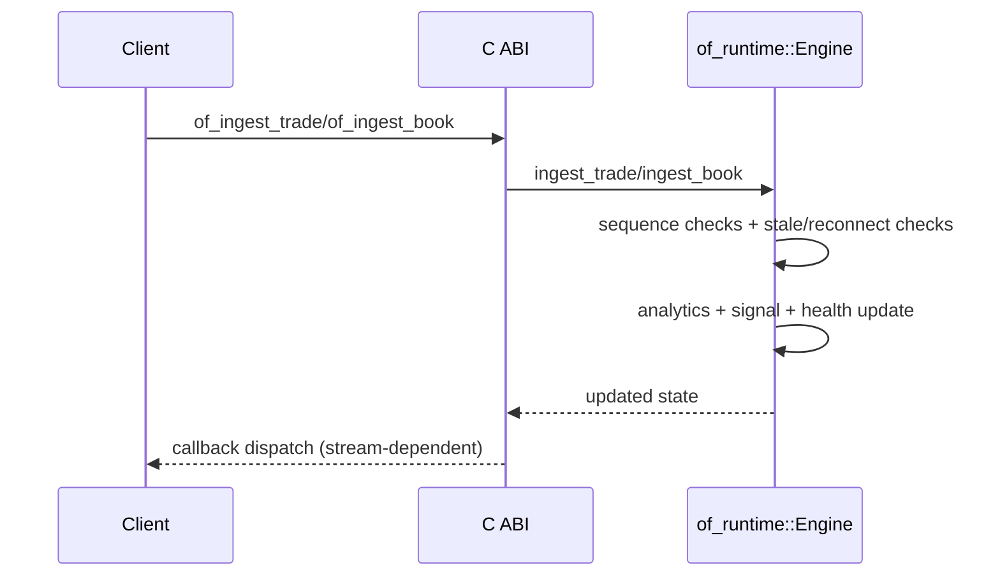
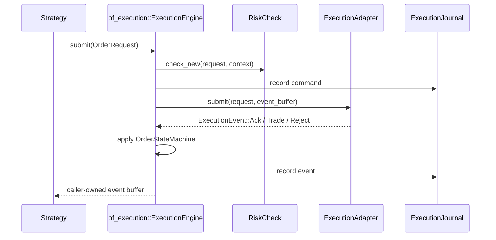
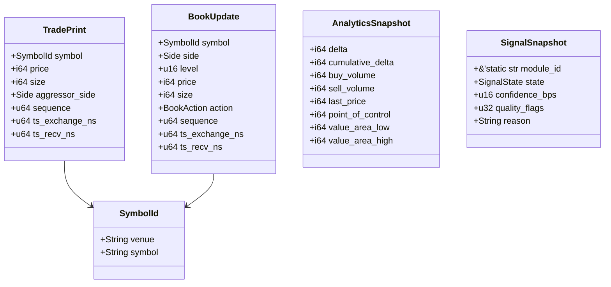

# Architecture

This section explains how components interact and where responsibilities live.

## High-Level Component Map

```mermaid
flowchart LR
  subgraph Bindings
    PY[Python ctypes binding]
    JV[Java JNA binding]
    CAPI[C ABI header/orderflow.h]
  end

  subgraph CoreRuntime
    FFI[of_ffi_c]
    RT[of_runtime]
    CORE[of_core]
    EXC[of_execution_core/of_execution]
    FIX[of_fix]
    EXA[of_execution_adapters]
    SIG[of_signals]
    PST[of_persist]
    ADP[of_adapters]
  end

  subgraph External
    VENUE[Market venues/providers]
    DASH[dashboard/server.py]
  end

  PY --> CAPI
  JV --> CAPI
  CAPI --> FFI
  FFI --> RT
  FFI --> EXC
  EXA --> FIX
  RT --> CORE
  RT --> SIG
  RT --> PST
  RT --> ADP
  EXC --> EXA
  ADP --> VENUE
  EXA --> VENUE
  PY --> DASH
  DASH --> CAPI
```

## Responsibility Boundaries

- `of_core`: canonical data structures + analytics accumulator.
- `of_signals`: signal trait + built-in delta momentum, imbalance, cumulative delta, absorption, exhaustion, sweep, and composite implementations.
- `of_adapters`: provider abstraction and concrete adapters (feature-gated).
- `of_persist`: rolling JSONL persistence, typed readback, and retention pruning.
- `of_runtime`: lifecycle, polling/ingest processing, quality supervision, health state.
- `of_execution_core`: additive execution-domain IDs, requests, events, state machine, and risk primitives.
- `of_fix`: reusable low-allocation FIX tag-value codec and transport-independent session engine with borrowed field views, body-length/checksum validation, caller-owned encoding buffers, deterministic liveness, and sequence recovery.
- `of_execution`: execution adapter trait, routing engine, bounded event buffers, simulated execution, journal/recovery hooks.
- `of_execution_adapters`: feature-gated execution adapter scaffolds, starting with FIX mapping.
- `of_ffi_c`: stable C ABI and callback dispatch.
- `bindings/python`: ctypes wrapper over C ABI.
- `bindings/java`: JNA wrapper over C ABI.

Execution is intentionally separate from market-data analytics. Market-data
adapters emit `RawEvent::Book` and `RawEvent::Trade`; execution adapters emit
typed `ExecutionEvent` values. Strategy code may consume both, but the two
domains do not share mutable runtime state.

## Runtime Event Paths

### Path A: Adapter-driven polling

```mermaid
sequenceDiagram
  participant Client
  participant Engine as of_runtime::Engine
  participant Adapter as MarketDataAdapter
  participant Signals as SignalModule
  participant Persist as RollingStore

  Client->>Engine: poll_once(quality_flags)
  Engine->>Adapter: poll()
  Adapter-->>Engine: RawEvent::Trade / RawEvent::Book
  Engine->>Persist: append_* (optional)
  Engine->>Signals: on_analytics() / quality_gate()
  Engine-->>Client: snapshots, callbacks, metrics/health updates
```

### Path B: External ingest (no adapter stream required)

```mermaid
sequenceDiagram
  participant Client
  participant FFI as C ABI
  participant Engine as of_runtime::Engine

  Client->>FFI: of_ingest_trade/of_ingest_book
  FFI->>Engine: ingest_trade/ingest_book
  Engine->>Engine: sequence checks + stale/reconnect checks
  Engine->>Engine: analytics + signal + health update
Engine-->>FFI: updated state
  FFI-->>Client: callback dispatch (stream-dependent)
```

### Path C: Execution simulation / OMS foundation

```mermaid
sequenceDiagram
  participant Strategy
  participant Exec as of_execution::ExecutionEngine
  participant Risk as RiskCheck
  participant Adapter as ExecutionAdapter
  participant Journal as ExecutionJournal

  Strategy->>Exec: submit(OrderRequest)
  Exec->>Risk: check_new(request, context)
  Exec->>Journal: record command
  Exec->>Adapter: submit(request, event_buffer)
  Adapter-->>Exec: ExecutionEvent::Ack / Trade / Reject
  Exec->>Exec: apply OrderStateMachine
  Exec->>Journal: record event
  Exec-->>Strategy: caller-owned event buffer
```

Low-latency execution paths use fixed-size identifiers, integer-normalized
price/quantity fields, and caller-owned event buffers. JSON is not used on the
submit/cancel/amend hot path.

Execution routing is configured as a set of route/account/symbol scopes. The
engine builds an indexed route table for constant-time lookup and applies open
order and open notional limits within the matching scope before the adapter is
called. This lets one execution engine manage multiple symbols without allowing
activity on one instrument to consume another instrument's route budget.

Concurrency is additive and built around ownership rather than shared mutable
state. `ConcurrentExecutionEngine` runs the synchronous engine on one dedicated
worker thread, accepts commands from cloneable producer handles through a
bounded channel, and emits command reports through a bounded report channel.
This supports many caller threads without introducing async scheduler jitter or
parallel order-state mutation.

The OMS layer also provides reusable safety and operations primitives around
that core: command correlation, bounded event fanout, lifecycle snapshots,
durable journaling, open-order reconciliation, disconnect and kill-switch
policies, advanced risk helpers, position ledgers, order-type/TIF
normalization, telemetry, deterministic sharding, token-bucket throttling,
replay simulation, and provider adapter SDK helpers.

## Key Runtime Data Models (UML-style)

```mermaid
classDiagram
  class SymbolId {
    +String venue
    +String symbol
  }

  class TradePrint {
    +SymbolId symbol
    +i64 price
    +i64 size
    +Side aggressor_side
    +u64 sequence
    +u64 ts_exchange_ns
    +u64 ts_recv_ns
  }

  class BookUpdate {
    +SymbolId symbol
    +Side side
    +u16 level
    +i64 price
    +i64 size
    +BookAction action
    +u64 sequence
    +u64 ts_exchange_ns
    +u64 ts_recv_ns
  }

  class AnalyticsSnapshot {
    +i64 delta
    +i64 cumulative_delta
    +i64 buy_volume
    +i64 sell_volume
    +i64 last_price
    +i64 point_of_control
    +i64 value_area_low
    +i64 value_area_high
  }

  class SignalSnapshot {
    +&'static str module_id
    +SignalState state
    +u16 confidence_bps
    +u32 quality_flags
    +String reason
  }

  TradePrint --> SymbolId
  BookUpdate --> SymbolId
```

## Stream and Callback Semantics

The C ABI subscription kind values are:

- `1` = `BOOK`
- `2` = `TRADES`
- `3` = `ANALYTICS`
- `4` = `SIGNALS`
- `5` = `HEALTH` (emits on health transitions, not every poll)
- `6` = `BOOK_SNAPSHOT` (emits materialized book state after book changes)

Health uses a monotonic `health_seq` and only emits when the runtime fingerprint changes.

## Quality Supervision Model

Runtime quality state can include:

- `STALE_FEED`
- `SEQUENCE_GAP`
- `CLOCK_SKEW`
- `DEPTH_TRUNCATED`
- `OUT_OF_ORDER`
- `ADAPTER_DEGRADED`

External ingest supports:

- stale threshold (`stale_after_ms`)
- sequence enforcement (`enforce_sequence`)
- reconnecting state toggle

## Important Current Behavior

- `of_get_book_snapshot(...)` returns a materialized snapshot with `bids`, `asks`, `last_sequence`, and timestamps once book updates have been observed for the symbol.
- Analytics and signal snapshots are implemented and populated.
- Metrics and health payloads are implemented and used by bindings/dashboard.
