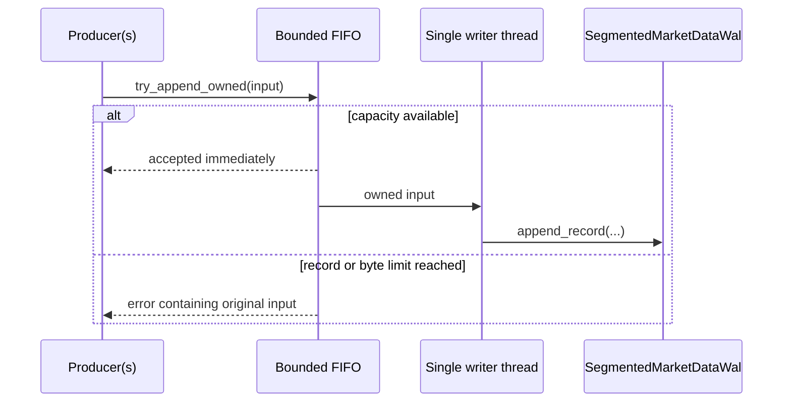
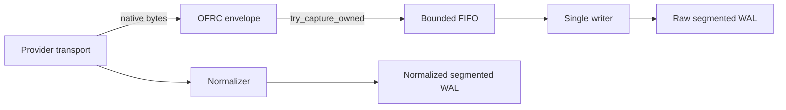

# `of_persist` Reference

`of_persist` provides append-only storage for normalized orderflow data.
`RollingStore` remains the stable JSONL store for auditability, replay, and
post-trade research. `MarketDataWal` adds a binary normalized market-data WAL
foundation for lower-latency production capture paths.

## Public API Map

| Item | Kind | Purpose |
| --- | --- | --- |
| `PersistError` | enum | Persistence error contract |
| `PersistResult<T>` | type alias | `Result<T, PersistError>` |
| `RetentionPolicy` | struct | Retention settings |
| `RollingStore` | struct | Main persistence handle |
| `StoredBookEvent` | struct | Typed book readback record |
| `StoredTradeEvent` | struct | Typed trade readback record |
| `StoredEvent` | enum | Merged replay-oriented event |
| `MarketDataWalSequence` | newtype | Monotonic binary WAL writer sequence |
| `MarketDataWalRecordKind` | enum | Binary WAL record kind vocabulary |
| `MarketDataWalConfig` | struct | Binary WAL path and sync configuration |
| `MarketDataWalRecord` | struct | Decoded binary WAL replay record |
| `MarketDataWalReplayResult` | struct | Binary WAL replay summary |
| `MarketDataWalReplayFilter` | struct | Deterministic binary WAL replay selector |
| `MarketDataWalIntegrityReport` | struct | Checksum/sequence integrity report |
| `MarketDataWalMetrics` | struct | Binary WAL append/sync counters |
| `MarketDataWalSegmentId` | newtype | Monotonic segment identity |
| `MarketDataWalSyncPolicy` | enum | Segmented WAL sync cadence |
| `SegmentedMarketDataWalConfig` | struct | Segment root, limits, and sync configuration |
| `MarketDataWalSegmentMetadata` | struct | Validated segment inventory row |
| `MarketDataWalManifest` | struct | Rebuilt ordered segment manifest |
| `MarketDataWalSegmentIntegrityReport` | struct | Aggregate segment/link integrity result |
| `SegmentedMarketDataWalMetrics` | struct | Rotation, seal, manifest, write, and sync counters |
| `SegmentedMarketDataWal` | struct | Checksum-linked rotated normalized WAL |
| `MarketDataWalRecordInput` | struct | Owned bounded-writer input |
| `NormalizedMarketDataRecordInput` | enum | Owned canonical event plus quality bits |
| `NormalizedMarketDataCodecError` | enum | Versioned normalized-envelope validation error |
| `NormalizedMarketDataWriterTryError` | enum | Ownership-preserving typed admission error |
| `BoundedMarketDataWriterConfig` | struct | Record/byte queue and worker configuration |
| `MarketDataWriterTryError` | enum | Ownership-preserving nonblocking rejection |
| `MarketDataWriterControlError` | enum | Flush/shutdown barrier failure |
| `BoundedMarketDataWriterMetrics` | struct | Queue, durability, and failure snapshot |
| `MarketDataWalProducer` | struct | Cloneable nonblocking producer |
| `BoundedMarketDataWalWriter` | struct | Single-owner segmented WAL worker |
| `RawCaptureTimestampSource` | enum | Receive-timestamp provenance |
| `RawCaptureFlags` | newtype | Compression, encryption, redaction, and truncation flags |
| `RawCaptureMetadata` | struct | Fixed provider/session/instrument identity |
| `RawCaptureRecordInput` | struct | Owned provider-native capture input |
| `RawCaptureRecord` | struct | Decoded provider-native replay record |
| `RawCaptureDecodeError` | enum | Fail-closed envelope decode failure |
| `RawCaptureInputError` | struct | Invalid envelope plus returned allocation |
| `RawCaptureTryError` | enum | Ownership-preserving admission failure |
| `RawCaptureProducer` | struct | Cloneable nonblocking capture producer |
| `BoundedRawCaptureWriter` | struct | Bounded provider-native evidence writer |
| `prepare_raw_capture_payload` | function | Writes an envelope into reusable storage |
| `encode_raw_capture_payload_into` | function | Writes an envelope and copies provider bytes |
| `MarketDataCheckpointId` | newtype | Monotonic checkpoint identifier |
| `MarketDataCheckpointKind` | enum | Opaque checkpoint payload category |
| `MarketDataCheckpointConfig` | struct | Checkpoint root, retention, and sync configuration |
| `MarketDataCheckpoint` | struct | Opaque checkpoint payload with sequence anchors |
| `MarketDataCheckpointManifest` | struct | Checkpoint metadata without payload bytes |
| `MarketDataCheckpointValidation` | struct | Checkpoint integrity report |
| `FileMarketDataCheckpointStore` | struct | File-backed checkpoint store |
| `MarketDataRecoveryStatus` | enum | Recovery classification |
| `MarketDataRecoveryAction` | enum | Host action selected by recovery planning |
| `MarketDataRecoveryPolicy` | struct | Fail-closed or replay-from-start recovery policy |
| `MarketDataRecoveryInput` | struct | Checkpoint and WAL integrity inputs |
| `MarketDataRecoveryPlan` | struct | Deterministic recovery decision |
| `plan_market_data_recovery` | function | Builds a recovery plan from policy and inputs |
| `MarketDataColdExportFormat` | enum | Cold research export format vocabulary |
| `MarketDataJsonlExportConfig` | struct | JSONL export root and sync policy |
| `MarketDataColdExportPartition` | struct | One exported partition summary |
| `MarketDataColdExportManifest` | struct | Total export manifest |
| `FileMarketDataJsonlExportWriter` | struct | Dependency-free JSONL cold-export writer |
| `MarketDataRetentionAction` | enum | Retention/tiering host action |
| `MarketDataRetentionReason` | enum | Reason attached to retention decisions |
| `MarketDataRetentionPolicy` | struct | Hot WAL and cold export retention policy |
| `MarketDataRetentionInput` | struct | WAL range retention inputs |
| `MarketDataRetentionDecision` | struct | Deterministic retention/tiering decision |
| `plan_market_data_retention` | function | Builds a retention/tiering decision |
| `MarketDataPersistenceMode` | enum | Production writer mode vocabulary |
| `MarketDataPersistenceFailureAction` | enum | Host action when persistence degrades |
| `MarketDataPersistencePolicy` | struct | Production persistence policy |
| `MarketDataPersistenceHealth` | struct | Production persistence health snapshot |
| `MarketDataRecordCriticality` | enum | Relative record importance under pressure |
| `MarketDataBackpressureDropPolicy` | enum | Bounded writer drop strategy |
| `MarketDataBackpressureReason` | enum | Active pressure reason |
| `MarketDataBackpressureAction` | enum | Selected action for one candidate record |
| `MarketDataBackpressurePolicy` | struct | Queue/lag/byte pressure thresholds |
| `MarketDataBackpressureDecision` | struct | Evaluated action and flags |
| `evaluate_market_data_backpressure` | function | Evaluates one candidate persistence record |
| `MarketDataWal` | struct | Single-file binary normalized market-data WAL |

## Storage Layout

Files are stored as:

`<root>/<venue>/<symbol>/book.jsonl`

`<root>/<venue>/<symbol>/trades.jsonl`

Each line is one JSON object representing one normalized event.

Newly-written JSONL records include additive metadata:

- `schema`: record schema version, currently `1`
- `ts_exchange_ns`: exchange timestamp from the normalized event
- `ts_recv_ns`: receive timestamp from the normalized event

Legacy records without these metadata fields remain readable.

## Configuration Type

### `RetentionPolicy`

| Field | Type | Meaning |
| --- | --- | --- |
| `max_total_bytes` | `u64` | Max retained bytes under the persistence root |
| `max_age_secs` | `u64` | Max allowed file age in seconds |

Rules:

- `0` disables that limit.
- If both limits are `0`, retention is effectively disabled.

## Readback Record Types

### `StoredBookEvent`

| Field | Type | Meaning |
| --- | --- | --- |
| `side` | `Side` | Bid or ask |
| `level` | `u16` | Depth index |
| `price` | `i64` | Integer-normalized price |
| `size` | `i64` | Integer-normalized size |
| `action` | `BookAction` | Upsert or delete |
| `sequence` | `u64` | Event sequence |

### `StoredTradeEvent`

| Field | Type | Meaning |
| --- | --- | --- |
| `price` | `i64` | Integer-normalized price |
| `size` | `i64` | Integer-normalized size |
| `aggressor_side` | `Side` | Trade direction |
| `sequence` | `u64` | Event sequence |

### `StoredEvent`

| Variant | Payload | Meaning |
| --- | --- | --- |
| `Book` | `StoredBookEvent` | One stored book mutation |
| `Trade` | `StoredTradeEvent` | One stored trade |

#### Method

| Method | Returns | Meaning |
| --- | --- | --- |
| `sequence()` | `u64` | Sequence number regardless of variant |

## `RollingStore`

### Constructors and configuration

| Method | Returns | Meaning |
| --- | --- | --- |
| `new(root)` | `PersistResult<RollingStore>` | Creates or opens a persistence root |
| `with_retention(retention)` | `RollingStore` | Returns a store handle with retention settings attached |

### Append methods

| Method | Returns | Meaning |
| --- | --- | --- |
| `append_book(&BookUpdate)` | `PersistResult<()>` | Appends one normalized book event |
| `append_trade(&TradePrint)` | `PersistResult<()>` | Appends one normalized trade event |

### Discovery methods

| Method | Returns | Meaning |
| --- | --- | --- |
| `list_venues()` | `PersistResult<Vec<String>>` | Discovers venue directories |
| `list_symbols(venue)` | `PersistResult<Vec<String>>` | Discovers symbols under one venue |
| `list_streams(venue, symbol)` | `PersistResult<Vec<String>>` | Discovers stream files under one symbol |

### Readback methods

| Method | Returns | Meaning |
| --- | --- | --- |
| `read_books(venue, symbol)` | `PersistResult<Vec<StoredBookEvent>>` | Reads all stored book events |
| `read_books_in_range(venue, symbol, from, to)` | `PersistResult<Vec<StoredBookEvent>>` | Reads book events within inclusive sequence bounds |
| `read_trades(venue, symbol)` | `PersistResult<Vec<StoredTradeEvent>>` | Reads all stored trade events |
| `read_trades_in_range(venue, symbol, from, to)` | `PersistResult<Vec<StoredTradeEvent>>` | Reads trade events within inclusive sequence bounds |
| `read_events(venue, symbol)` | `PersistResult<Vec<StoredEvent>>` | Merges stored book and trade events by sequence |
| `read_events_in_range(venue, symbol, from, to)` | `PersistResult<Vec<StoredEvent>>` | Merged read within inclusive sequence bounds |

## `MarketDataWal`

`MarketDataWal` is a binary append-only WAL for normalized market-data frames.
It is additive and does not change `RollingStore` JSONL semantics.

### Configuration

| Method | Returns | Meaning |
| --- | --- | --- |
| `MarketDataWalConfig::new(path)` | `MarketDataWalConfig` | Creates WAL config for a single file path |
| `with_sync_on_write(bool)` | `MarketDataWalConfig` | Enables or disables `sync_data` after each append |
| `path()` | `&Path` | Returns the configured WAL path |
| `sync_on_write()` | `bool` | Returns the sync policy |

### Writer and replay

| Method | Returns | Meaning |
| --- | --- | --- |
| `MarketDataWal::open(config)` | `PersistResult<MarketDataWal>` | Opens a WAL and validates existing bytes before appending |
| `path()` | `&Path` | Returns the WAL path |
| `next_sequence()` | `MarketDataWalSequence` | Returns the next sequence to be assigned |
| `metrics()` | `MarketDataWalMetrics` | Returns append/sync counters |
| `append_record(...)` | `PersistResult<MarketDataWalSequence>` | Appends one binary frame |
| `replay(out)` | `PersistResult<MarketDataWalReplayResult>` | Replays decoded records into `out` |
| `replay_filtered(filter, out)` | `PersistResult<MarketDataWalReplayResult>` | Replays matching decoded records into `out` |
| `inspect_path(path)` | `PersistResult<MarketDataWalIntegrityReport>` | Validates a WAL file without materializing payloads |

### Frame contract

Each frame carries magic/version, record kind, WAL sequence, provider sequence,
normalized event sequence, exchange timestamp, receive timestamp, payload
length, checksum, and previous-record checksum link. Existing bytes must
validate before append state is initialized.

The existing implementation remains intentionally single-file and unchanged.
The additive segmented WAL and bounded writer below provide rotation and
background file ownership without changing that API. Raw provider-message
capture remains an adapter-owned evidence layer.

## `SegmentedMarketDataWal`

The segmented WAL reuses the single-file frame contract while maintaining one
global WAL sequence and previous-checksum chain across all files.

### Layout and authority

```text
<root>/manifest.ofmm
<root>/segment-00000000000000000001.ofmw
<root>/segment-00000000000000000002.ofmw
...
```

`manifest.ofmm` is installed by temporary-file rename, but it is not trusted as
the recovery authority. `open` scans segment files, validates them, rebuilds
the in-memory inventory, and replaces stale or corrupt manifest text.

### Configuration

| Method | Meaning |
| --- | --- |
| `SegmentedMarketDataWalConfig::new(root)` | Creates default configuration rooted at `root` |
| `with_max_segment_bytes(bytes)` | Sets the soft rotation target |
| `with_max_payload_bytes(bytes)` | Sets the hard per-record payload limit |
| `with_sync_policy(policy)` | Sets data sync cadence |
| `with_sync_manifest(bool)` | Controls manifest-file sync before rename |
| `root()` / limit getters | Return effective configuration |

`max_segment_bytes` is a soft target because one frame is never split. A frame
larger than the target can occupy one segment if it remains under
`max_payload_bytes`.

### Sync policy

| Variant | Durability behavior |
| --- | --- |
| `Never` | No implicit data sync; caller uses `sync_data` |
| `EveryRecord` | Sync after each frame |
| `EveryRecords(n)` | Sync after each `n` frames; zero is rejected |
| `OnSegmentSeal` | Sync when a segment is sealed; default |

### Writer and replay methods

| Method | Meaning |
| --- | --- |
| `open(config)` | Validates/rebuilds existing root and opens the final active segment |
| `config()` | Returns effective configuration |
| `next_sequence()` | Returns next global sequence |
| `manifest()` | Returns rebuilt in-memory segment inventory |
| `metrics()` | Returns append/rotation/seal/manifest counters |
| `append_record(...)` | Appends one complete normalized frame and rotates when needed |
| `seal_active_segment()` | Writes an explicit seal frame and refreshes the manifest |
| `sync_data()` | Flushes userspace state and calls `sync_data` |
| `replay(out)` | Validates and replays all segments |
| `replay_filtered(filter, out)` | Validates all frames and retains matches only |
| `inspect_root(root)` | Performs read-only aggregate integrity inspection |

`SegmentSeal` is reserved to `seal_active_segment`; passing it through ordinary
`append_record` is rejected. Segment ids and WAL sequences fail on exhaustion
instead of saturating into duplicate identities.

### Integrity invariants

- Segment ids start at `1`, are unique, and are contiguous.
- Every non-final segment ends with an on-disk seal frame.
- The final segment may be active or empty.
- Global WAL sequence never resets at a file boundary.
- The first frame of each segment links to the prior segment checksum.
- Missing files, unsealed middle segments, broken checksums, invalid kinds,
  invalid versions, and truncated tails make the aggregate report invalid.
- Failed replay truncates records it added to the caller's output before
  returning an error.

## `BoundedMarketDataWalWriter`



The worker deliberately uses no Tokio/global async runtime. It uses a bounded
standard-library multi-producer/single-consumer FIFO, one native thread, and
one WAL owner. Producers never call filesystem APIs and never wait for queue
space.

### Configuration and startup

| Method | Meaning |
| --- | --- |
| `BoundedMarketDataWriterConfig::new()` | Defaults to 4,096 records and 64 MiB queued payload bytes |
| `with_queue_capacity(n)` | Sets hard queued command count; zero is rejected |
| `with_max_queued_payload_bytes(n)` | Sets hard aggregate queued payload bytes; zero is rejected |
| `with_thread_name(name)` | Sets non-empty worker thread name |
| `BoundedMarketDataWalWriter::start(wal, writer)` | Opens the WAL before spawning the worker |

The payload-byte bound excludes the record currently being written. The record
bound still bounds per-command/channel overhead.

### Producer methods

| Method | Hot-path behavior |
| --- | --- |
| `producer()` | Clones a lightweight sender/state handle |
| `try_append_owned(input)` | Nonblocking; transfers the existing payload allocation on success |
| `try_append_copy(..., payload)` | Nonblocking queue operation but allocates/copies payload first |
| `try_append_normalized_owned(input)` | Moves a canonical event; worker performs binary encoding |
| `metrics()` | Reads atomics and returns a snapshot |
| `last_error()` | Locks only the cold diagnostic string path |

`MarketDataWriterTryError` distinguishes record capacity, payload-byte
capacity, per-record size, reserved record kinds, and stopped writers. Every
variant owns the rejected `MarketDataWalRecordInput`; `into_input` returns it
losslessly.

The normalized `OFNE` envelope is versioned and length-delimited. It preserves
venue, symbol, signed price/size, side/action/level, provider event sequence,
exchange/receive timestamps, and `DataQualityFlags` bits. Unknown versions,
invalid enums, malformed lengths, trailing bytes, and outer-kind mismatches
fail closed. Replaying through `decode_normalized_market_data_record` therefore
reconstructs the same quality-gated runtime state as live processing.

### Control methods

| Method | Behavior |
| --- | --- |
| `flush()` | Blocking FIFO barrier: waits for prior records and syncs active data |
| `shutdown()` | Fences admission, waits for submissions already entering, drains, syncs, joins, and returns final metrics |

These methods belong on control/maintenance threads. Dropping without
`shutdown` stops admission; explicit shutdown is the deterministic durability
contract applications should use.

### Metrics and failure semantics

Metrics separate accepted, queued, written, and synced states. Queue depth and
payload-byte values exclude the in-progress write, while high-water marks
capture accepted queue occupancy. `last_written_sequence` means append
completed; `last_synced_sequence` means a known sync policy/barrier covered that
sequence.

`latest_accepted_ts_recv_ns`, `latest_written_ts_recv_ns`, and
`event_time_lag_ns` measure event-time backlog. They use atomic maxima over
event receive timestamps, avoiding wall-clock reads in producer admission.
This is a backlog signal, not a substitute for a queue-residency histogram.

On append/sync failure the worker:

1. stops admission,
2. records a diagnostic and marks itself degraded,
3. waits for producer calls already entering the nonblocking operation,
4. accounts for accepted queued records that cannot be written,
5. disconnects producer/control handles.

The crate reports this condition; the host chooses stop-market-data,
stop-trading, fail-process, or another explicit
`MarketDataPersistenceFailureAction`.

### Replay filters

`MarketDataWalReplayFilter` is additive and leaves unfiltered replay unchanged.
All bounds are inclusive.

| Method | Meaning |
| --- | --- |
| `MarketDataWalReplayFilter::new()` | Creates a filter that matches all records |
| `with_sequence_range(from, to)` | Filters by WAL sequence |
| `with_provider_sequence_range(from, to)` | Filters by provider-native sequence |
| `with_event_sequence_range(from, to)` | Filters by normalized event sequence |
| `with_exchange_time_range(from, to)` | Filters by exchange timestamp |
| `with_receive_time_range(from, to)` | Filters by receive timestamp |
| `with_kind(kind)` | Filters by exact record kind |

Filtered replay still scans and validates frames in deterministic file order.
Only matching payloads are materialized into the caller-provided vector.

## Provider-Native Raw Capture

Raw capture records provider bytes before normalization. Use a different WAL
root from normalized events and correlate streams with provider sequence,
exchange time, and receive time.



### Envelope

| Field | Meaning |
| --- | --- |
| magic/version/header length | Fail-closed schema identity |
| `provider_id`, `adapter_id` | Host-assigned source identities |
| `connection_id`, `subscription_id` | Session and subscription correlation |
| `venue_id`, `instrument_id` | Dictionary keys without per-message strings |
| `timestamp_source` | Unknown, userspace, kernel software, or hardware |
| `flags` | Compressed, encrypted, redacted, or truncated payload state |
| reserved bytes | Must be zero for forward-compatible decoding |

The enclosing checksum-linked WAL frame supplies capture sequence, provider
sequence, exchange/receive timestamps, payload length, checksum, and previous-
record link.

### Low-latency admission

`prepare_raw_capture_payload(metadata, out)` clears reusable storage and writes
the envelope prefix. Append provider bytes, then call
`RawCaptureRecordInput::from_encoded_payload`; validation does not copy the
provider payload. `copy_from_slice` is the convenient one-copy path.

All failed ownership transfers are reversible:

- malformed input returns `RawCaptureInputError` and its encoded `Vec<u8>`;
- pressure or stop returns `RawCaptureTryError` and its complete input;
- queue count and aggregate queued bytes are independently bounded;
- producers do no filesystem I/O and never wait for queue capacity;
- `flush` and `shutdown` remain blocking control-plane operations.

### Timestamp and security rules

Linux kernel software receive timestamps are generated shortly after a driver
hands a packet to the receive stack; hardware timestamps use the NIC clock.
Preserve `RawCaptureTimestampSource` and correlate clock domains before latency
calculations. Userspace timestamps include socket wake-up and scheduling delay.

The library stores opaque bytes and does not sanitize them. Hosts exclude
credentials and private keys, redact authentication messages before admission,
provision encryption and key rotation externally, and set flags only after the
represented transformation succeeds.

### Replay

Filter segmented replay by `MarketDataWalRecordKind::RawProviderMessage`, then
convert each `MarketDataWalRecord` with `RawCaptureRecord::try_from`. Envelope
magic, version, header length, timestamp source, flags, and reserved bytes are
validated. The WAL scan separately validates frame checksums, sequence
continuity, and cross-segment links.

## Cold JSONL Export

`FileMarketDataJsonlExportWriter` exports decoded WAL records to a research
friendly JSONL partition without adding columnar-format dependencies to the
persistence hot path.

### Configuration and writer

| Method | Returns | Meaning |
| --- | --- | --- |
| `MarketDataJsonlExportConfig::new(root)` | `MarketDataJsonlExportConfig` | Creates export config rooted at `root` |
| `with_sync_on_write(bool)` | `MarketDataJsonlExportConfig` | Enables or disables `sync_data` after export |
| `root()` | `&Path` | Returns the export root |
| `sync_on_write()` | `bool` | Returns the sync policy |
| `FileMarketDataJsonlExportWriter::open(config)` | `PersistResult<FileMarketDataJsonlExportWriter>` | Creates or opens the export root |
| `config()` | `&MarketDataJsonlExportConfig` | Returns the writer config |
| `export_records(venue, symbol, stream, records)` | `PersistResult<MarketDataColdExportPartition>` | Exports caller-provided decoded WAL records |
| `export_wal(venue, symbol, stream, wal, filter)` | `PersistResult<MarketDataColdExportPartition>` | Replays matching WAL records and exports them |

### Partition manifest

| Field | Meaning |
| --- | --- |
| `format` | Export format, currently JSONL for the built-in writer |
| `venue`, `symbol`, `stream` | Partition identity |
| `path` | Exported file path |
| `records` | Number of exported records |
| `bytes` | Bytes written |
| `first_sequence`, `last_sequence` | Exported WAL sequence range |
| `first_ts_exchange_ns`, `last_ts_exchange_ns` | Exported exchange timestamp range |
| `checksum` | FNV-style checksum over exported bytes |

### JSONL row contract

Each exported row includes schema version, venue, symbol, stream, record kind,
WAL sequence, provider sequence, normalized event sequence, exchange timestamp,
receive timestamp, and raw payload bytes as lowercase hex.

`MarketDataColdExportFormat` also names CSV, Parquet, Arrow, and custom formats
so future exporters can share the same partition and manifest semantics.

## Retention And Tiering Planner

`plan_market_data_retention` is a pure helper. It does not delete files,
compact segments, or start a background task.

### Policy

| Method | Returns | Meaning |
| --- | --- | --- |
| `MarketDataRetentionPolicy::conservative()` | `MarketDataRetentionPolicy` | Requires verified cold export, preserves incidents, and retains at least two checkpoints |
| `with_hot_retention_ns(u64)` | `MarketDataRetentionPolicy` | Sets hot WAL age pressure |
| `with_max_hot_bytes(u64)` | `MarketDataRetentionPolicy` | Sets hot WAL byte pressure |
| `with_require_verified_cold_export(bool)` | `MarketDataRetentionPolicy` | Requires verified cold export before deletion |
| `with_preserve_incident_windows(bool)` | `MarketDataRetentionPolicy` | Preserves incident windows |
| `with_min_checkpoints_retained(usize)` | `MarketDataRetentionPolicy` | Keeps a minimum checkpoint count after WAL dependencies are gone |

### Inputs

| Field | Meaning |
| --- | --- |
| `first_sequence`, `last_sequence` | WAL sequence range |
| `created_ns` | WAL range creation timestamp |
| `hot_bytes` | Hot storage bytes occupied by the range |
| `cold_export_verified` | Whether cold export for this range has been verified |
| `incident_window` | Whether the range is protected for incident review |
| `dependent_checkpoint_sequence` | Latest checkpoint that still depends on the range |
| `retained_checkpoints` | Current checkpoint count for the stream |

### Decision

| Field | Meaning |
| --- | --- |
| `actions` | Retain hot WAL, export cold, delete hot WAL, retain/delete checkpoint, preserve incident window |
| `reasons` | Window, age, bytes, export, checkpoint dependency, or incident reason |
| `may_delete_hot_wal` | True only when deletion is safe under policy |
| `should_export_cold` | True when cold export should happen before deletion |
| `should_retain_checkpoints` | True when checkpoint retention floor still applies |

Deletion is allowed only when age or byte pressure is active, the range is not
incident-protected, no checkpoint depends on it, and cold export requirements
are satisfied.

## `FileMarketDataCheckpointStore`

`FileMarketDataCheckpointStore` persists opaque binary checkpoints for
market-data recovery. It is additive and codec-neutral: callers decide how to
serialize order books, analytics accumulators, signal state, sequence caches, or
runtime baselines.

### Configuration

| Method | Returns | Meaning |
| --- | --- | --- |
| `MarketDataCheckpointConfig::new(root)` | `MarketDataCheckpointConfig` | Creates checkpoint config rooted at `root` |
| `with_retain_last(usize)` | `MarketDataCheckpointConfig` | Keeps only the newest N checkpoints per venue/symbol after save; `0` disables pruning |
| `with_sync_on_save(bool)` | `MarketDataCheckpointConfig` | Enables or disables `sync_data` before rename |
| `root()` | `&Path` | Returns the configured checkpoint root |
| `retain_last()` | `usize` | Returns the automatic retention count |
| `sync_on_save()` | `bool` | Returns the sync policy |

### Checkpoint payload

| Field | Type | Meaning |
| --- | --- | --- |
| `id` | `MarketDataCheckpointId` | Checkpoint id; zero lets the file store assign the next id |
| `kind` | `MarketDataCheckpointKind` | Payload category |
| `venue` | `String` | Venue path component |
| `symbol` | `String` | Symbol path component |
| `wal_sequence` | `MarketDataWalSequence` | Last applied market-data WAL sequence |
| `provider_sequence` | `u64` | Last provider-native sequence when known |
| `event_sequence` | `u64` | Last normalized event sequence when known |
| `created_ns` | `u64` | Creation timestamp in nanoseconds since Unix epoch |
| `payload_version` | `u32` | Caller-owned payload schema/version tag |
| `payload` | `Vec<u8>` | Opaque encoded checkpoint bytes |

### Store methods

| Method | Returns | Meaning |
| --- | --- | --- |
| `FileMarketDataCheckpointStore::open(config)` | `PersistResult<FileMarketDataCheckpointStore>` | Creates or opens the checkpoint root |
| `config()` | `&MarketDataCheckpointConfig` | Returns the store configuration |
| `save_checkpoint(checkpoint)` | `PersistResult<MarketDataCheckpointManifest>` | Writes a temp file and renames it into place |
| `load_checkpoint(venue, symbol, id)` | `PersistResult<MarketDataCheckpoint>` | Loads and validates one checkpoint payload |
| `load_latest(venue, symbol, kind)` | `PersistResult<Option<MarketDataCheckpoint>>` | Returns the newest valid checkpoint, optionally filtered by kind |
| `list_checkpoints(venue, symbol)` | `PersistResult<Vec<MarketDataCheckpointManifest>>` | Lists checkpoint metadata ordered by id |
| `validate_checkpoint(venue, symbol, id)` | `PersistResult<MarketDataCheckpointValidation>` | Validates checksum and payload length |
| `prune_old(venue, symbol, retain_last)` | `PersistResult<usize>` | Removes older checkpoint files and returns the count |

### Layout and recovery contract

Checkpoint files are stored as:

`<root>/<venue>/<symbol>/checkpoints/<checkpoint-id>.ofmc`

Each file carries magic/version, checkpoint kind, checkpoint id, WAL sequence,
provider sequence, normalized event sequence, creation timestamp, payload
version, payload length, and checksum. Existing ids are not overwritten, and
explicit ids must be greater than all existing ids for the venue/symbol.

A production recovery flow should:

1. call `load_latest` for the venue/symbol and desired kind,
2. restore the opaque payload into the host-owned book/analytics/signal state,
3. replay WAL records after `checkpoint.wal_sequence`,
4. validate sequence continuity before allowing strategy submission.

## Market-Data Recovery Planner

The recovery planner turns checkpoint metadata and WAL integrity inspection into
an ordered host plan. It is pure and does not touch the filesystem.

### Policy

| Method | Returns | Meaning |
| --- | --- | --- |
| `MarketDataRecoveryPolicy::fail_closed()` | `MarketDataRecoveryPolicy` | Requires checkpoints and aborts on gaps/corruption by default |
| `MarketDataRecoveryPolicy::replay_from_wal_start()` | `MarketDataRecoveryPolicy` | Allows recovery from WAL sequence `1` when no checkpoint exists |
| `with_require_checkpoint(bool)` | `MarketDataRecoveryPolicy` | Sets whether a checkpoint is mandatory |
| `with_allow_truncated_tail(bool)` | `MarketDataRecoveryPolicy` | Sets whether an incomplete tail can recover in degraded mode |
| `with_allow_sequence_gaps(bool)` | `MarketDataRecoveryPolicy` | Sets whether sequence gaps can recover in degraded mode |
| `with_request_snapshot_on_gap(bool)` | `MarketDataRecoveryPolicy` | Sets whether allowed gaps require provider snapshot reconciliation |
| `with_disable_trading_until_clean(bool)` | `MarketDataRecoveryPolicy` | Sets whether degraded recovery keeps strategy submission disabled |

### Inputs and plan

| Item | Meaning |
| --- | --- |
| `MarketDataRecoveryInput::new(checkpoint, wal_integrity)` | Bundles selected checkpoint metadata and WAL integrity report |
| `plan_market_data_recovery(policy, input)` | Returns a deterministic recovery plan |
| `MarketDataRecoveryPlan::is_impossible()` | Returns true when recovery selected `AbortRecovery` |

### Plan fields

| Field | Meaning |
| --- | --- |
| `status` | Clean, missing-checkpoint, gap, corrupt, truncated, snapshot-required, or impossible classification |
| `checkpoint_sequence` | WAL sequence restored by the selected checkpoint |
| `replay_from_sequence` | First WAL sequence to replay |
| `replay_to_sequence` | Last known WAL sequence from inspection |
| `requires_fresh_snapshot` | Whether provider snapshot reconciliation is required |
| `trading_enabled` | Whether strategy order submission can resume under this plan |
| `actions` | Ordered host actions such as restore, replay, request snapshot, disable trading, resume, or abort |

### Recovery behavior

- Missing checkpoint aborts under `fail_closed`.
- Checksum/header corruption aborts.
- Sequence gaps abort unless `allow_sequence_gaps` is true.
- Allowed gaps can require fresh provider snapshots.
- Truncated tails abort unless `allow_truncated_tail` is true.
- Clean recovery enables trading.
- Degraded recovery keeps trading disabled when
  `disable_trading_until_clean` is true.

## Production Persistence Policy And Health

`MarketDataPersistencePolicy` describes the host's production writer mode:
disabled, inline strict, bounded async, or best effort. It also records the
failure action to take when persistence degrades.

`MarketDataPersistenceHealth` reports enabled/degraded state, queue depth,
record lag, nanosecond lag, pending bytes, dropped records, WAL write/sync
failures, and last error text. These fields are intentionally host-owned so a
runtime can wire persistence degradation into OMS safety policy without forcing
an async writer into `of_persist`.

## Backpressure Policy

`MarketDataBackpressurePolicy` evaluates writer queue depth, record lag,
nanosecond lag, pending bytes, and degraded persistence state for one candidate
record. `evaluate_market_data_backpressure` returns a deterministic decision
that tells the host whether to accept, reject, drop current, drop queued oldest,
drop queued lowest-priority, stop market data, stop trading, fail the process,
or switch to memory-only retention.

The helper does not own a queue or spawn a writer. It is a stable policy surface
for runtimes that need explicit slow-consumer handling without silently losing
market-data evidence.

## Ordering and Range Rules

- Append methods preserve append order inside each file.
- `read_books*` and `read_trades*` preserve the stored file order.
- `read_events*` merges both streams by ascending sequence.
- Range bounds are inclusive.
- `None` as a bound means open-ended on that side.
- Missing stream files return an empty vector instead of an error.

## Error Semantics

### `PersistError`

| Variant | Meaning |
| --- | --- |
| `Io(std::io::Error)` | Filesystem or parse failure |

Malformed JSONL lines are surfaced as `Io` with `InvalidData`.

## Retention Behavior

- Retention is enforced during normal append flows.
- Oldest files are pruned first when `max_total_bytes` is exceeded.
- Files older than `max_age_secs` are pruned when age retention is enabled.
- The crate does not run a background compactor or daemon.
- Binary WAL sync is configured per writer with `sync_on_write`.

## When To Use `of_persist`

- Use it from the runtime when you want normalized event persistence.
- Use it directly when building replay, audit, or research tools.
- Use `examples/replay_cli` when you want a ready-made discovery-and-replay
  command-line workflow.
- Add [`of_persist_parquet`](./05m-of-persist-parquet-reference.md) when sealed,
  sequence-bounded WAL ranges need verified columnar export for research,
  batch analytics, or storage tiering. Keeping it separate avoids Arrow and
  compression dependencies in live capture builds.
