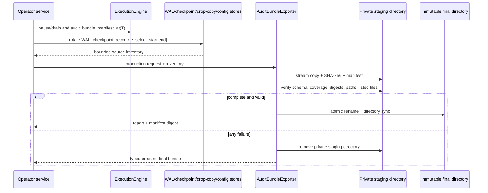
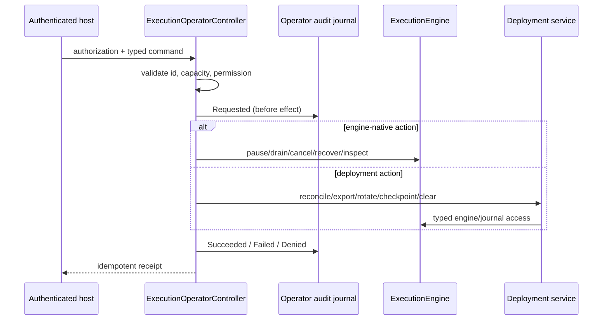
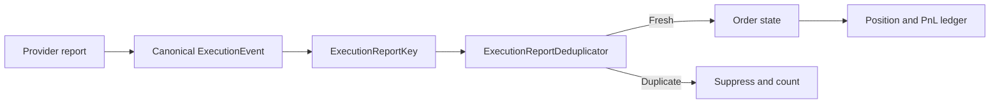
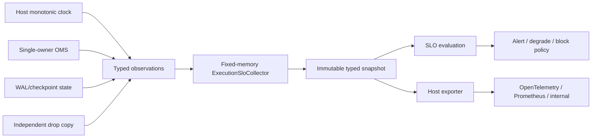

# `of_execution` Reference

`of_execution` is the execution routing and OMS crate. It builds on
`of_execution_core` by adding adapter contracts, route configuration, risk
context construction, bounded event buffers, simulated execution, journaling,
concurrent worker ownership, and reusable OMS primitives.

The crate has two execution layers:

- `ExecutionEngine` — Synchronous deterministic owner of canonical order state and execution transitions.
- `ConcurrentExecutionEngine` — Worker-thread owner that serializes access to an `ExecutionEngine`.

The synchronous engine is the canonical state machine. The concurrent engine is
an additive producer/worker wrapper.

`ExecutionRunbookSnapshot` is the factual operator summary for dashboards and
runbooks. `ExecutionEngine::runbook_snapshot()` reports adapter connectivity,
route availability/drain/degradation, global submission pause, route-level kill
switches, open/terminal orders, execution counters, submission readiness, and
whether operator attention is required.

`ExecutionOperatorController` is the mutating control plane. It verifies a
host-supplied permission, rejects id regression/collision, journals intent,
dispatches one typed action, journals outcome, and retains an idempotent
receipt. Authentication, role assignment, escalation, and dual-control policy
remain host responsibilities.

`ExecutionAuditBundleManifest` is the engine-state input to the audit exporter.
`ExecutionEngine::audit_bundle_manifest()` combines the runbook snapshot,
execution metrics, and journal command/event counts into a small manifest that
operators can attach to incident exports. Use
`audit_bundle_manifest_at(generated_ns)` for deterministic tests and replay
drills. `ExecutionAuditBundleExporter` then performs bounded file collection,
SHA-256 inventory generation, staged verification, and atomic directory
publication without adding any work to the engine hot path.

## Audit Bundle API

| Type | Contract |
| --- | --- |
| `ExecutionAuditArtifactKind` | Stable evidence taxonomy; `PRODUCTION_REQUIRED` contains the 12 required evidence classes |
| `ExecutionAuditArtifact` | File or small in-memory source, portable bundle path, non-sensitive label, required/optional policy |
| `ExecutionAuditTimeRange` | Inclusive Unix-nanosecond evidence boundary |
| `ExecutionAuditBundleProfile` | Fail-closed production coverage or explicit custom coverage |
| `ExecutionAuditBundleRequest` | Incident id, generation time, range, optional engine manifest, ordered artifacts |
| `ExecutionAuditBundleConfig` | Root, count/byte/manifest/buffer ceilings, and durability sync policy |
| `ExecutionAuditBundleExporter` | `export` and independent `verify` operations |
| `ExecutionAuditBundleReport` | Installed paths, counts, aggregate bytes, and exact manifest SHA-256 |
| `ExecutionAuditBundleVerification` | Independently recomputed package facts |
| `ExecutionAuditBundleError` | Typed validation, capacity, I/O, schema, and integrity failures |

The default production profile requires present execution WAL, execution
checkpoint, recovery report, reconciliation report, redacted route config,
redacted risk config, adapter health, execution metrics, market-data WAL,
strategy intent, drop-copy, and build metadata artifacts. Multiple WAL segments
may share one kind. `OperatorAudit` and deployment-specific `Other` evidence are
supported in addition to that required set.

Validation is fail closed:

- incident ids are bounded filename-safe ASCII;
- ranges must be ordered;
- paths must be relative, UTF-8, traversal-free, and portable across Unix and
  Windows separators;
- reserved manifest names and ASCII-case collisions are rejected;
- sources and package entries must be regular non-symlink files;
- entry count, per-artifact bytes, aggregate bytes, manifest bytes, and scan
  entries are bounded;
- each present artifact and the exact JSON manifest bytes carry SHA-256;
- independent verification rejects payload changes, manifest changes, absent
  required evidence, unexpected optional evidence, and unlisted files;
- an existing destination is immutable and is never overwritten.

The manifest intentionally omits source filesystem paths. The host supplies
already-redacted content and a non-sensitive source label. Capture from closed
or rotated files when a point-in-time boundary matters; hashing a file that is
still being appended produces a self-consistent copy, but not necessarily the
intended incident cut.

SHA-256 is an integrity primitive, not producer authentication. NIST FIPS 180-4
defines SHA-256 digests for detecting changed messages, while CISA's chain-of-
custody guidance calls for identity, collection/transfer time, purpose, and
handling records. Keep the destination access-controlled and add the
organization's encryption, signature/attestation, custody log, retention, and
legal-hold policy after export. See [NIST FIPS 180-4](https://csrc.nist.gov/pubs/fips/180-4/upd1/final),
[NIST SP 800-92](https://nvlpubs.nist.gov/nistpubs/legacy/SP/nistspecialpublication800-92.pdf),
and [CISA Chain of Custody](https://www.cisa.gov/sites/default/files/2023-12/Chain%20of%20Custody_2023.8.14_508.pdf).

## Operator Runbook API

| Action | Native OMS behavior | Deployment-owned behavior |
| --- | --- | --- |
| Pause/resume submissions | Constant-time global gate; cancel/report flow remains active | Authentication and approval |
| Drain/restore route | Constant-time route-key set; blocks only new flow | Decide when open orders are sufficiently drained |
| Mark/restore degraded route | Constant-time route-key set and runbook visibility | Derive health and escalation policy |
| Cancel all/by scope | Deterministic open-order selection and canonical adapter cancels | Venue mass-cancel may be used by a custom service in addition |
| Recover open orders | Calls the existing adapter recovery contract | Verify completeness and sequence boundaries |
| Inspect stuck orders | Bounded all-or-nothing output sorted by age/id | Select stale threshold and alert policy |
| Reconcile | Typed service receives the mutable engine | Gather external evidence and enforce fresh verification |
| Export audit bundle | Typed service receives the mutable engine and can invoke bounded `ExecutionAuditBundleExporter` | Select a quiescent evidence range; own redaction, encryption, signature, retention, and access control |
| Rotate WAL | Typed service can call `engine.journal_mut()` on a concrete segmented journal | Select segment policy and durability |
| Force checkpoint | Typed service can snapshot engine/open orders and install through a concrete store | Assign checkpoint id/sequence and include external ledgers |
| Clear kill switch | Typed service receives switch id, force flag, command actor/reason | Enforce cancellation completion, approvals, and registry WAL sequence |

`ExecutionOperatorPermissions` is a fixed bitset. The controller does not trust
command text to confer authority; the application supplies an authenticated
`ExecutionOperatorAuthorization` for every invocation. A denied command still
gets requested/denied audit records and consumes its command id, preventing a
later identity from silently changing its meaning.

`ExecutionOperatorAuditSink` reserves a complete two-record intent/outcome
pair before dispatch. `InMemoryExecutionOperatorAudit` is bounded and
preallocated. `FileExecutionOperatorAudit` uses append-only versioned binary
frames, complete command/scope/actor/reason/outcome encoding, FNV checksum,
optional `sync_data`, and strict contiguous audit sequence validation.

If intent persistence fails, no action runs. If terminal persistence fails
after dispatch, the controller pauses submissions, retains the outcome, and
rejects every different command with `AuditRepairRequired`. Retrying the exact
same command writes the missing outcome without redispatching the side effect.

On restart, validate/replay the file journal, call
`ExecutionOperatorController::restore`, then call `restore_engine_controls`.
Incomplete intent/outcome pairs fail closed because the process cannot infer
whether an external cancel, checkpoint, or clear happened before failure.

This design reflects exchange operational behavior: CME's Mass Order Cancel
blocks order entry and cancels working orders while producing an audit trail,
and FIX defines typed mass-cancel request/response messages. See
[CME Order Functionalities](https://cmegroupclientsite.atlassian.net/wiki/display/EPICSANDBOX/Order+Functionalities)
and the [FIX OrderMassCancelRequest](https://fiximate.fixtrading.org/en/FIX.Latest/msg40.html)
reference. Deployment retention and field requirements remain subject to the
applicable venue and jurisdiction.

## Core Traits

### `ExecutionAdapter`

Adapters implement:

| Method | Purpose |
| --- | --- |
| `connect()` | Establish transport/session |
| `submit(req, out)` | Send new order and write generated events |
| `cancel(req, out)` | Send cancel and write generated events |
| `amend(req, out)` | Send replace and write generated events |
| `poll(out)` | Drain async venue reports |
| `recover_open_orders(out)` | Emit recovery/restatement reports |
| `capabilities()` | Report order-type/TIF support |
| `health()` | Report adapter health |

The adapter writes events into caller-owned `ExecutionEventBuffer`. It should
not allocate per report on the hot path unless the provider protocol requires
it.

### `CertificationVenue`

`CertificationVenue` is an additive implementation of `ExecutionAdapter` for
deterministic pre-production certification. It does not alter the trait or the
existing `SimExecutionAdapter` behavior.

| Type | Purpose |
| --- | --- |
| `CertificationScenario` | Scripted order/session outcome with typed parameters |
| `CertificationScenarioKind` | Stable 18-kind coverage classification |
| `CertificationVenueConfig` | Script/order/pending/history/transcript bounds |
| `CertificationVenue` | Single-owner deterministic mock exchange |
| `CertificationReport` | Canonical event plus preserved venue report sequence |
| `CertificationTranscriptEntry` | Bounded evidence for one consumed step |
| `CertificationCoverage` | Per-kind counts and complete-suite predicate |
| `CertificationVenueSnapshot` | Health, queues, evictions, sequence, delay, coverage |
| `CertificationVenueError` | Typed configuration, script, capacity, and state failures |

Command scenarios are consumed only by the matching adapter method. Control
scenarios are processed one per `poll`, after ready delayed reports are drained.
Scenario validation and output-capacity reservation happen before script
consumption, state mutation, or report generation. `DuplicateReports`,
`OutOfOrderReports`, and `Resend` re-emit retained events without assigning new
report sequences. `MalformedProviderResponse` returns an adapter error and
marks health degraded because malformed wire bytes cannot safely satisfy the
canonical `ExecutionEvent` contract.

All collections are bounded and reserved at construction. Report history and
transcript use bounded rings and expose eviction counters; script, order, and
delayed-report overflow fail explicitly. The venue is a test/certification
primitive and does not claim provider approval.

### `ExecutionJournal`

Journals implement:

- `record_command`
- `record_event`
- `replay`

`InMemoryJournal` is used for tests and embedded simulation. `FileExecutionJournal`
in the OMS helper layer provides an append-only text file implementation.
`WalExecutionJournal` provides an additive binary WAL implementation backed by
`of_execution_core` WAL frames, sequence numbers, checksums, and configurable
sync policy.
`SegmentedWalExecutionJournal` extends that WAL model across ordered segment
files without changing the `ExecutionJournal` trait.

| Journal | Use |
| --- | --- |
| `InMemoryJournal` | Tests, simulation, volatile embedded hosts |
| `FileExecutionJournal` | Human-readable append-only text journal |
| `WalExecutionJournal` | Binary append-only WAL with integrity validation |
| `SegmentedWalExecutionJournal` | Binary WAL directory with manifest, rotation, segment seals, and cross-segment integrity validation |

`WalExecutionJournal::open(WalJournalConfig::new(path))` validates existing WAL
bytes before accepting new records. It fails closed on corrupt frames or
non-contiguous sequences. `replay_from(WalSequence, out)` supports bounded
startup replay once checkpoints are added later.

Segmented WAL types:

| Type | Use |
| --- | --- |
| `WalJournalMetrics` | Copyable write/sync/rotation/failure metrics for binary WAL implementations |
| `WalSegmentConfig` | Root directory, sync policy, byte rotation threshold, and record rotation threshold |
| `WalSegmentMetadata` | Segment id, file path, first/last sequence, byte count, record count, seal state, and timestamps |
| `WalSegmentManifest` | Ordered segment inventory with active/first/last helpers |
| `WalSegmentIntegrityReport` | Aggregate cross-segment integrity summary |
| `SegmentedWalExecutionJournal` | `ExecutionJournal` implementation backed by rotated binary WAL segment files |

`SegmentedWalExecutionJournal::open(WalSegmentConfig::new(root))` scans
`wal-*.ofwal` files in segment-id order and reconstructs the manifest from the
frames themselves. The manifest is useful for operators and discovery, but
recovery validates the segment files directly. Rotation writes a `SegmentSeal`
frame, opens the next segment, and continues the same monotonic WAL sequence.
Replay skips seal frames while still validating their checksum links.

`WalExecutionJournal::metrics()` and `SegmentedWalExecutionJournal::metrics()`
return `WalJournalMetrics`. The snapshot tracks successful frames and bytes,
write latency, sync latency, write/sync failures, segment rotations, and
manifest writes. Hosts should export this snapshot outside the hot path.

The C ABI and bindings expose path-based integrity diagnostics for WAL files
and checkpoint stores:

| Layer | API |
| --- | --- |
| C | `of_execution_wal_integrity_report(...)`, `of_execution_segmented_wal_integrity_report(...)`, `of_execution_checkpoint_store_integrity_report(...)`, and `of_execution_recovery_report_json(...)` |
| Python | `inspect_execution_wal(...)`, `inspect_execution_segmented_wal(...)`, `inspect_execution_checkpoint_store(...)`, and `inspect_execution_recovery(...)` |
| Java | `OrderflowExecutionEngine.inspectWal(...)`, `inspectSegmentedWal(...)`, `inspectCheckpointStore(...)`, and `inspectRecovery(...)` |

This diagnostic is intentionally offline/operator-oriented. It does not create
an execution engine, does not submit orders, and does not mutate OMS state. It
reads WAL bytes, reports valid records and byte position, optional first/last
sequence, checksum failures, sequence failures, truncated-tail status, and an
overall validity flag. Use the segmented APIs for rotated production WAL roots;
they validate `wal-*.ofwal` files in segment-id order and preserve the same
cross-segment checksum and sequence rules used by replay.

Checkpoint diagnostics are the matching read-only restart check for
`FileExecutionCheckpointStore`. They count discovered, valid, and invalid
checkpoint files, total checkpoint bytes, and the latest valid checkpoint id,
covered WAL sequence, and creation timestamp. They do not create the checkpoint
directory, prune files, save checkpoints, or mutate OMS state.

### Checkpoints

Checkpoint types:

| Type | Use |
| --- | --- |
| `ExecutionCheckpoint` | Versioned OMS snapshot payload |
| `CheckpointPosition` | Position-key plus position snapshot |
| `CheckpointConfig` | File store root, sync, retention, and policy metadata |
| `CheckpointPolicy` | Manual/time/count/risk/shutdown policy vocabulary |
| `CheckpointManifest` | Installed checkpoint file metadata |
| `ExecutionCheckpointStore` | Store trait for save/load/list/validate/prune |
| `FileExecutionCheckpointStore` | Atomic file-backed checkpoint store |

`ExecutionCheckpoint` currently captures the last applied WAL sequence, route
configuration hash, open order states, position snapshots, kill-switch state,
and checksum. It is intentionally separate from `ExecutionEngine`; hosts decide
when to collect a consistent snapshot and save it.

`FileExecutionCheckpointStore` writes to a temporary file, flushes it,
optionally syncs it, atomically renames it to the final checkpoint path, and
optionally syncs the directory on Unix platforms. Loading rejects unsupported
schema versions and checksum mismatches.

Use `FileExecutionCheckpointStore::inspect_root(root)` for startup checks,
recovery drills, and operator dashboards that need to validate a checkpoint
root without opening a mutable store. Corrupt checkpoint files are counted in
the report and set `valid` to false; missing or unreadable roots return an
error. Binding users should call the C/Python/Java checkpoint-store integrity
helpers listed above.

### Recovery

Recovery types:

| Type | Use |
| --- | --- |
| `RecoveryCorruptionPolicy` | Fail-closed corruption policy vocabulary |
| `RecoveryVenuePolicy` | Venue reconciliation requirement vocabulary |
| `RecoveryPlan` | Replay start sequence, expected latest sequence, policy, and submission gate |
| `RecoveredOmsState` | Reconstructed checkpoint-plus-WAL state snapshot |
| `RecoveryResult` | Recovery plan, state, replay summary, counters, and submission/reconciliation flags |

Recovery functions:

| Function | Use |
| --- | --- |
| `recover_oms_state_from_records` | Rebuild state from decoded journal records |
| `recover_oms_state_from_segmented_wal` | Replay a segmented WAL tail from a supplied plan |
| `recover_oms_state_from_segmented_wal_root` | Replay an existing segmented-WAL root read-only from a supplied plan |
| `recover_latest_checkpoint_from_segmented_wal` | Load latest checkpoint and replay the segmented WAL tail after it |
| `recover_latest_checkpoint_from_segmented_wal_roots` | Select an optional checkpoint and reconstruct existing roots read-only |

The recovery path is deterministic and fail closed. It starts from
`checkpoint.last_applied_sequence.next()`, applies complete version-2 command
intent and execution events, and reconstructs post-checkpoint pending orders.
Legacy command-only frames remain replay-compatible but cannot recreate an
absent order. Venue reconciliation remains required by default before strategy
submissions resume, and the read-only report facade never enables submissions.

## Route Configuration

`RouteConfig` binds:

- `route_id`
- `account_id`
- `symbol`
- `enabled`
- `risk_limits`

The engine builds an internal `HashMap<RouteKey, usize>` for constant-time
lookup. The key is `(route_id, account_id, symbol)`.

This is how one engine can handle many symbols while keeping risk limits scoped
to the exact route/account/symbol.

## `ExecutionEventBuffer`

`ExecutionEventBuffer` is a bounded vector used by adapters and engine calls.
It enforces capacity with `ExecutionError::BufferFull`.

Important behaviors:

- `clear()` retains allocation.
- `push()` fails when capacity is reached.
- `drain_into()` moves events into another bounded buffer.
- FFI uses the same bounded-copy semantics through caller-owned arrays.

## Synchronous Engine

`ExecutionEngine<A, R, J>` owns:

- adapter `A`,
- risk gate `R`,
- journal `J`,
- route table,
- order state machines,
- order price cache for open-notional accounting,
- metrics,
- scratch event buffer.

### Lifecycle

1. Construct with `ExecutionEngine::new(adapter, risk, journal, routes)`.
2. Call `start()`.
3. Call `submit`, `cancel`, `amend`, `poll`, or `recover_open_orders`.
4. Read `order_state`, `metrics`, `health`, `runbook_snapshot`, or
   `replay_journal`.
5. For incident response, call `audit_bundle_manifest_at`, build a typed
   production-profile request, and invoke `ExecutionAuditBundleExporter` from
   the operator control plane.

### Submit Path

Submit does the following in order:

1. rejects if not started,
2. validates the request shape,
3. finds the configured route,
4. builds route-scoped `RiskContext`,
5. checks route risk limits,
6. checks custom risk gate,
7. records command in journal,
8. creates local pending state,
9. calls adapter,
10. applies returned events,
11. records events in journal,
12. copies events to caller buffer.

This order is important. The adapter never sees a request that failed local
validation or pre-trade risk.

### Cancel and Amend Paths

Cancel and amend require known local state for `orig_client_order_id`. Amend
also performs route-scoped size/notional checks and then custom risk checks.

### Route-Scoped Risk

Open order count and open notional are computed only for the matched
route/account/symbol. A partially filled ES order does not consume the NQ open
order budget unless both orders share the exact same execution symbol.

## Simulated Execution

`SimExecutionAdapter` is deterministic and intended for integration testing,
binding smoke tests, strategy validation, and examples.

Helpers:

- `simulated_engine(route)`
- `simulated_engine_with_routes(routes)`

The single-route helper preserves the original return type and risk behavior.
The multi-route helper uses route-scoped limits and `AllowAllRiskGate`, because
route limits are enforced directly by the engine.

## Concurrent Worker

`ConcurrentExecutionEngine` owns a synchronous engine on one worker thread.
It exposes:

- cloneable `ExecutionCommandSender`,
- bounded command queue,
- bounded report queue,
- non-blocking `try_send`,
- blocking `send`,
- report receive methods,
- graceful stop and join.

Command kinds:

- `Submit` — Submit a new order request through the selected route.
- `Cancel` — Request cancellation of an existing order.
- `Amend` — Request a quantity or price amendment.
- `Poll` — Advance adapter polling and process available reports.
- `RecoverOpenOrders` — Reconcile and recover open orders after restart.
- `Stop` — Stop the worker and release its owned engine.

The worker preserves deterministic order-state mutation. Producers can be
concurrent, but the engine remains single-owner.

## OMS Helper Surface

The `oms` module is re-exported from `of_execution`. Each row below names a
cohesive public declaration family; the area description explains the purpose
of that family before the detailed sections that follow.

| Area | Types / Functions |
| --- | --- |
| Correlation | `CommandId`, `RequestId`, `CommandIdGenerator`, `CommandCorrelation` |
| Command idempotency | `IdempotencyKey`, `IdempotentExecutionCommand`, `IdempotencyRegistry`, `IdempotencyRecord`, `IdempotencyCheckpoint`, `IdempotencyDecision`, `IdempotencyMetrics` |
| Report deduplication | `ExecutionReportKey`, `ExecutionReportDeduplicator`, `ExecutionReportDisposition`, `ExecutionReportDedupCheckpoint`, `ExecutionReportDedupMetrics` |
| Event fanout | `ExecutionEventFanout`, `ExecutionEventSubscriber` |
| Lifecycle | `ExecutionLifecycle`, `ExecutionAdapterState`, `ExecutionLifecycleSnapshot` |
| Durable journal | `FileExecutionJournal` |
| Reconciliation | `reconcile_open_orders`, `reconcile_open_orders_detailed`, `evaluate_reconciliation_policy`, `ReconciliationReport`, `VenueReconciliationReport`, `ReconciliationPolicy` |
| General reconciliation | `OmsReconciliationCoordinator`, `OmsReconciliationSourceSet`, `OmsEvidenceWatermark`, `OmsReconciliationPolicy`, `OmsReconciliationBuffer`, `OmsReconciliationSummary` |
| Independent drop copy | `DropCopyAdapter`, `DropCopyReport`, `DropCopyReportBuffer`, `DropCopyReconciler`, `DropCopyObservation`, `DropCopyMetricsSnapshot` |
| Scoped kill switches | `KillSwitchRegistry`, `KillSwitchScope`, `KillSwitchMode`, `KillSwitchEvent`, `KillSwitchDecision`, `KillSwitchAffectedOrderBuffer` |
| Production risk | `ProductionRiskEngine`, `ProductionRiskPolicy`, `ProductionRiskLimits`, `ProductionRiskContext`, `ProductionRiskDecision`, `ProductionRiskDecisionJournal` |
| Order intent | `OrderIntentLifecycle`, `OrderIntent`, `ExecutionInstruction`, `OmsChildOrder`, `OmsChildCancelBuffer`, `OrderIntentRecoverySnapshot` |
| Allocation | `AllocationGroup`, `AllocationLeg`, `AllocationMethod`, `AllocationReport`, `allocate_block_fill`, `reconcile_allocations` |
| Safety policies | `DisconnectPolicy`, `RouteSafetyPolicy`, `SafetyPolicy`, `SafetyContext`, `evaluate_safety_policy` |
| Advanced risk | `AdvancedRiskLimits`, `AdvancedRiskGate` |
| Ledger | `PositionLedger`, `ProductionPositionLedger`, `ProductionPosition`, `LedgerFill`, `LedgerAdjustment`, `PositionLedgerCheckpoint`, `reconcile_production_positions` |
| Normalization | `VenueOrderCapabilities`, `normalize_order_type` |
| Telemetry | `ExecutionTelemetry`, `ExecutionTimestampTrace`, `ExecutionLatencyAttribution`, `TimestampDisciplineConfig`, `TimestampDisciplineReport` |
| Sharding | `ShardKey`, `ShardRouter` |
| Throttling | `OrderThrottle` |
| Replay | `ReplayDecision`, `ReplayResult`, `replay_simulated_oms` |
| Adapter SDK | `ProviderAdapterContext`, `ExecutionAdapterFactory`, `ProviderAdapterSdk` |

## Command Idempotency And Report Deduplication

`IdempotencyRegistry` is an additive guard for mutating submit, cancel, and
amend commands. It does not change or wrap `ExecutionEngine`; the host places
it before WAL append and adapter send. Keys are scoped by
`IdempotencyScopeId + RequestId`, while `CommandId`, client order ID, and
`AdapterCommandId` preserve traceability through local and provider layers.

| Operation | Required prior state | Durable/side-effect boundary |
| --- | --- | --- |
| `reserve` | key absent, or exact semantic retry | no external side effect |
| `mark_journaled` | `Reserved` | call only after durable command append |
| `mark_sent` | `Journaled` | call when adapter owns the send |
| `complete` | non-terminal; ack requires sent/reconciled state | fold authoritative outcome |
| `mark_recovery_pending` | non-terminal | disconnect/timeout/restart uncertainty |
| `retry_after_reconciliation` | `RecoveryPending` | only after authoritative absence |
| `retire_terminal` | definitive terminal | only after archive and retry expiry |

The first accepted command owns its IDs and semantic parameters. A matching
retry returns `IdempotencyDecision::Duplicate` with the original record and
does not consume the supplied mutation sequence. The same key with changed
economics, routing, ownership, symbol, or lifecycle parameters returns
`ParameterMismatch`. Transport timestamps are deliberately excluded from
semantic matching but included in checkpoint integrity.

Separate bounded indexes enforce uniqueness for OMS command IDs, client order
IDs, and provider command IDs across all retained records. This catches a
cross-request `ClOrdID`/provider-token collision before adapter I/O.

`IdempotencyCheckpoint` records the complete command and provider-ID mapping,
uses a stable key order and checksum, and restores every non-terminal entry as
`RecoveryPending`. This forces venue/drop-copy reconciliation before retry.
The registry preallocates all identity indexes, never evicts implicitly, and fails
closed at capacity.

`IdempotencyCheckpoint::encoded_len` and `encode_into` write a canonical binary
image into caller storage without allocation. `decode` validates framing,
schema, bounded ASCII lengths, typed enum discriminants, full-record checksum,
and trailing data. The report-dedup checkpoint exposes the same codec contract.
Hosts still own atomic file installation, generation naming, fsync policy, and
retention.

`ExecutionReportDeduplicator` handles execution-report identities separately.
It prefers `(source_id, execution_id)` and falls back to
`(source_id, source_sequence)`. It is a bounded FIFO horizon, so capacity
turnover is visible through `ExecutionReportDedupMetrics::evicted`. Its
checkpoint retains exact FIFO order so restart does not alter the next identity
to be evicted.

Use this order on an ingestion path:

`DropCopyReconciler` and `ProductionPositionLedger` also provide specialized
deduplication. Assign one authoritative duplicate owner for each path and keep
its checkpoint in the same recovery generation as the state it protects.

## Independent Drop Copy

`DropCopyAdapter` defines a transport/session contract that is independent of
the primary `ExecutionAdapter`. It emits canonical `DropCopyReport` values into
a caller-owned `DropCopyReportBuffer`. The contract has explicit connect,
disconnect, poll, and source-health operations; it does not add methods to the
existing execution adapter trait.

`DropCopyReport` carries:

- `DropCopySourceId`, which scopes identity to one source/session;
- `DropCopyReportId`, normally a provider report or execution identity;
- a source/session sequence fallback;
- the local drop-copy receive timestamp; and
- a canonical `ExecutionEvent` mapped by the provider adapter.

`DropCopyReconciler::new(duplicate_capacity, local_order_capacity, policy)`
preallocates duplicate, local-order, and progress indexes. Load local OMS state
with `replace_local_orders`, then call `observe` for each report. Correlation
uses venue order id first and client/original-client aliases second.

`DropCopyObservation` returns a `DropCopyDisposition`,
`DropCopyCorrelation`, allocation-free `DropCopyIssueFlags`, matched local
client id, and receive-minus-exchange lag. The issue bitset distinguishes
identity, account, route, symbol, status, cumulative quantity, leaves quantity,
average-price, invalid fill-total, late timestamp, regressive fill, and bounded
tracking-capacity failures.

`DropCopyLateReportPolicy::AuditOnly` is the conservative default. It keeps
late evidence available but marks it ineligible for current-state
reconciliation. `AcceptAndFlag` and `Reject` are explicit alternatives.
Duplicate reports never pass through reconciliation twice.

`DropCopyMetricsSnapshot` exposes report, duplicate, late, match, mismatch,
venue-only, fill, missing-key, capacity-exhaustion, and lag counters without
allocating or formatting. `DropCopySourceHealth` separately describes one
adapter session. Hosts should combine both with `SafetyPolicy` and block new
submissions when independent evidence is required but stale, disconnected, or
unreconciled.

`InMemoryDropCopyAdapter` is a bounded deterministic source for replay,
certification, and provider bridge tests. A full provider implementation should
decode into `DropCopyReport`, preserve provider sequencing, and never perform
operator callbacks on its poll path.

## Scoped Kill Switches

`KillSwitchRegistry` provides additive scoped controls beyond the existing
route-level `RiskLimits::kill_switch` boolean. `KillSwitchScope` supports
global, venue, route, account, strategy, symbol, order type, and adapter-session
matching. `KillSwitchMode` supports reject-new, cancel-all, cancel-scope,
reduce-only, pause-strategy, and hard-stop-adapter behavior.

The registry has explicit `Uncertain` and `Confirmed` states. `new` defaults to
`Uncertain`, and `evaluate_request` rejects new flow until state has been
restored and confirmed. `confirmed_empty` is an explicit convenience for an
authoritatively new session, not a recovery shortcut.

Activation receives borrowed `KillSwitchOrderContext` values and writes
matching cancellation targets into a bounded `KillSwitchAffectedOrderBuffer`.
It emits a `KillSwitchEvent` containing the scope, source, reason, timestamp,
WAL sequence, affected/captured/truncated counts, cancellation progress, state
certainty, and forced-clear flag.

`record_cancel_result` accepts each captured client-order id once. An unknown
or repeated result is rejected. `clear` requires `NotRequired` or
`AllSucceeded`; pending or failed cancellations require
`KillSwitchClear::with_force(true)`, which remains visible in the clear event.

`evaluate_new_order` and `evaluate_request` do not allocate. The latter builds
the fixed-size context directly from `OrderRequest`, signed position, and
adapter-session id. `KillSwitchDecision` tells the host whether to allow new
flow or cancels, enforce reduce-only, pause strategy commands, or stop an
adapter. The host remains responsible for authorization, WAL writes, actual
cancel dispatch, adapter shutdown, and operator notification.

## Production Risk Engine

`ProductionRiskEngine` is an opt-in pre-trade layer placed before the existing
`ExecutionEngine`. It does not replace `RiskCheck`, alter request layouts, or
change existing route limits. This separation lets established integrations
adopt the controls incrementally.

Policies can match global, account, strategy, route, symbol, venue, and
instrument-group scopes. Matching policies execute in deterministic priority
then policy-id order. The first rejection supplies the primary reason, observed
value, and limit, but all matching policies advance their independent bounded
message-rate windows.

| Control family | Checks |
| --- | --- |
| Identity | Duplicate client order id, restricted scope, host self-trade hook |
| Order shape | Quantity, notional, price collar, typical-size multiple |
| Exposure | Projected position, gross exposure, net exposure, open orders |
| Flow | Independent submit/amend and cancel rates, timestamp regression |
| Session | UTC daytime, overnight, and full-day windows |
| Runtime | Reduce-only, loss, drawdown, stale data, adapter, persistence, unavailable state |

The caller must construct `ProductionRiskContext` from authoritative ledgers
and supervision state. Its default is unavailable and therefore fail closed
under conservative limits. Cancels remain available during data, PnL, and
exposure degradation, but continue through cancel-rate and timestamp checks.

`ProductionRiskDecision` is allocation-free and carries command identity,
policy-set version, matched count, scope, policy id, observed value, configured
limit, reason, timestamp, and journal outcome. Use `evaluate_and_record` before
OMS submission. Any decision-journal failure forces rejection. The supplied
`InMemoryProductionRiskJournal` is bounded and suited to tests or a handoff
stage; production hosts should implement `ProductionRiskDecisionJournal` over
their durable audit path.

Capacity is configured up front. Rate queues reserve their maximum policy
limits during policy installation, evaluation does not read a clock, and the
engine is intentionally mutable and single-owner. Put it on the same ordered
worker as the OMS or shard both by a compatible ownership key.

Installation rejects empty ids, negative signed limits, duplicate ids,
capacity exhaustion, and unsafe rate-window sizes. Amend contexts must include
the replaced order in current gross and net exposure so replacement deltas are
projected correctly.

## Order Intent And Parent/Child Lifecycle

`OrderIntentLifecycle` owns bounded OMS parent/child state without changing the
single-order engine or depending on the algorithm crate. `OrderIntent` records
strategy ownership, symbol/side, target, limit, child and open-child bounds,
participation metadata, and release window. `ExecutionInstruction` records the
provider-neutral route and order constraints for one child.

Planning is allowed only for active parents and enforces parent leaves, release
time, parent price, clip size, open count, lifetime child capacity, displayed
quantity, minimum quantity, and valid order-type prices. Planned children then
pass through the ordinary kill switch, production risk, WAL, normalization,
and `ExecutionEngine`; the lifecycle is not a routing shortcut.

Canonical reports are correlated by client id and validated against account,
symbol, and route. Fill advances require matching trade `last_qty`. Aggregates
are exact fill notional plus derived average, filled, working, allocatable, and
leaves quantities. Regressions and overfills fail atomically.

Pause blocks release but not child management. Replace records immutable
old/new lineage and transfers working allocation after validation. Late fills
on replaced/cancelled/expired children are counted while terminal state is
preserved. Parent cancel-tree selection is preallocated, deterministic, and
all-or-nothing; planned children cancel locally and live children produce
caller-owned cancel targets. Failed parents may still cancel risk.

Recovery snapshots sort children and duplicate every parent aggregate for
integrity checking. Restore recomputes those aggregates and validates child
leaves, average, ids, indexes, and sequences. Non-terminal trees restore as
`Recovering` and require explicit activation after venue reconciliation.

## Authoritative Position And PnL Ledger

The legacy `PositionLedger` remains a lightweight exposure helper with
unchanged behavior. `ProductionPositionLedger` is an additive, bounded,
single-owner ledger for risk and recovery.

| State | Semantics |
| --- | --- |
| Key | Account, strategy, venue-native symbol, settlement currency |
| Cost basis | Exact normalized `i128` open cost; derived display average |
| PnL | Gross realized, marked unrealized, net realized, total local/base |
| Costs | Commission and other fees tracked separately |
| Cash | Dividend, funding, interest, settlement, or manual cash effects |
| Attribution | Route, client id, venue order id, execution id, side, price, quantity |
| Ordering | Strict caller/WAL global mutation sequence |
| Idempotency | Route/account/symbol-scoped fills; position-scoped adjustments |

`LedgerFill::from_execution_event` accepts canonical trade events and explicit
strategy, side, currency, multiplier, commission, fees, and sequence. Exact
open cost prevents rounded average prices from drifting final realized PnL.
Closing and reversal logic works for long and short positions. Marks update
unrealized PnL without changing cost basis.

`LedgerAdjustment` provides typed opening-balance, correction,
corporate-action, manual, and cash mutations. The host owns authorization and
durable command audit. Validation is atomic; an error leaves positions,
sequence, and dedup state unchanged. Adjustment quantities do not increment
executed buy/sell totals.

Mutation identities remain retained until ledger-session rollover. Identity
capacity exhaustion rejects the mutation rather than evicting protection.
Recent fill attribution has an independent rolling bound because it is
diagnostic, not the authority for deduplication.

`PositionLedgerCheckpoint` is schema-versioned and checksummed. It contains
sorted positions, every retained mutation identity, recent attribution, and
the last fully applied sequence. `FilePositionLedgerCheckpointStore` installs
via temporary file and atomic rename, optionally syncs file/directory, refuses
id overwrite, limits bytes, and prunes old ids. Restore validates all rows and
capacities before returning a ledger.

`reconcile_production_positions` compares an external broker/clearing/venue
snapshot without mutating local state. Its bounded output distinguishes missing
rows, duplicate external keys, quantity, average, multiplier, realized PnL,
commission, and fee differences. Treat unresolved mismatches as a
`PositionLedgerMismatch` safety condition.

Fill, mark, and adjustment paths perform no I/O or clock reads. Configure and
reserve capacities before the worker starts. Checkpoint creation, file writes,
and reconciliation are explicit control-plane operations.

## Error Model

`ExecutionError` includes:

- `Disconnected` — The execution route or adapter is disconnected.
- `BufferFull` — A bounded event or command buffer cannot accept more data.
- `RouteNotFound` — The requested route is not configured.
- `RiskRejected` — The risk layer rejected the order operation.
- `Core` — The canonical execution core returned an error.
- `Adapter` — An execution adapter returned an error.
- `Journal` — The execution journal returned an error.

Concurrent wrapper errors are separated as `ConcurrentExecutionError`, mapping
queue backpressure, stopped workers, worker panic, and underlying execution
errors.

## When To Use Which API

Use `ExecutionEngine` when:

- you are in Rust,
- one owner thread already exists,
- deterministic synchronous control is desired,
- you are writing tests or a replay harness.

Use `ConcurrentExecutionEngine` when:

- multiple producer threads submit commands,
- you need explicit queue backpressure,
- you want one thread to own the adapter and state machine,
- you do not want a Tokio dependency.

Use C/Python/Java concurrent bindings when:

- host languages need non-blocking command queueing,
- host code should poll command reports,
- the native worker should preserve deterministic state internally.

## Execution SLI And SLO API

`ExecutionSloCollector` is the allocation-free metrics authority for one
single-owner execution scope. Existing `ExecutionMetrics` and
`ExecutionTelemetry` remain unchanged; the new collector is additive and is
appropriate when an operator needs percentile distributions and explicit
objectives.

| API | Purpose |
| --- | --- |
| `observe_submit` | Atomically validate and record submit-to-send, send-to-ack, submit-to-ack, optional fill, and submit outcome |
| `observe_cancel` | Record cancel acknowledgement latency and reject outcome |
| `observe_replace` | Record replace acknowledgement latency and reject outcome |
| `observe_fill` | Record later partial-fill latency without fabricating another acknowledgement |
| `observe_operational` | Atomically sample queue depths, WAL/checkpoint state, recovery, reconciliation, route health, and drop-copy lag |
| `record_latency` | Record a host-derived value for a typed latency population |
| `snapshot` | Copy a compact immutable snapshot for off-path export/evaluation |
| `clear` | Reset all fixed storage without reallocating |

`ExecutionLatencyHistogram` has 257 fixed buckets. Values are grouped into
four subdivisions of each power-of-two interval. `min_ns`, `max_ns`, count,
and integer mean are exact unless counters saturate; p50/p95/p99 are the upper
bounds of the selected buckets. This bounded approximation avoids retaining
samples and keeps observation cost independent of history length.

`ExecutionOperationalObservation` uses `Option<u64>` for timestamps and
durations that may be unknown. Zero is therefore a valid measured duration,
not a missing-value sentinel. Validation occurs before any metric mutation:
regressing timestamps, zero required timestamps, durable WAL sequence beyond
the head, and rejected submits carrying fills fail atomically.

`ExecutionSloTargets` starts with all objectives disabled. Builder methods
enable selected p99 latency, reject-rate, queue-depth, WAL, checkpoint,
reconciliation, and route-health objectives. Each enabled objective increments
`objectives_evaluated`; each failure increments `objectives_violated` even when
several failures share the `InsufficientSamples` classification bit.

Use one monotonic clock domain for all local latency endpoints. Venue exchange
timestamps are not interchangeable with local monotonic timestamps. Route
them through timestamp-discipline/skew validation and export their lag as a
separate observation. Keep exporter I/O, label generation, aggregation across
routes, and alert delivery off the execution worker.
