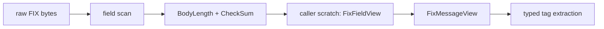

# `of_fix` Reference

`of_fix` is the reusable FIX tag-value codec layer for Orderflow execution
adapters. It is intentionally lower level than `of_execution_adapters::fix`:
`of_fix` understands wire-format FIX frames, while the execution adapter layer
maps parsed execution reports into canonical OMS events.

## Public API Map

| Item | Kind | Purpose |
| --- | --- | --- |
| `SOH` | constant | FIX field delimiter byte `0x01` |
| `FixTag` | struct | Numeric FIX tag identifier with common tag constants |
| `FixVersion` | enum | Known FIX begin-string versions |
| `FixMsgType` | struct | Static FIX `MsgType(35)` identifier |
| `FixFieldView` | struct | Borrowed tag/value field view |
| `FixMessageView` | struct | Borrowed validated FIX frame view |
| `FixParseError` | enum | Strict parse and validation failures |
| `FixEncodeError` | enum | Encode-time validation failures |
| `FixProfileError` | enum | Dictionary/profile validation failures |
| `FixRejectParseError` | enum | Reject-message parse failures |
| `FixSessionRejectView` | struct | Borrowed Session Reject `<3>` diagnostics |
| `FixBusinessMessageRejectView` | struct | Borrowed BusinessMessageReject `<j>` diagnostics |
| `FixMessageRule` | struct | Required/disallowed tag rule for one message type |
| `FixDictionary` | struct | Static FIX version/profile rule set |
| `FixDecoder` | struct | Stateless decoder facade over caller-owned scratch |
| `FixEncoder` | struct | Reusable encoder with an owned output buffer |
| `FixSessionState` | enum | Session lifecycle state vocabulary |
| `FixSequenceTracker` | struct | Deterministic inbound/outbound sequence tracker |
| `FixSequenceAction` | enum | Result of observing an inbound sequence number |
| `FixSequenceError` | enum | Sequence validation/reset errors |
| `FixResendRange` | struct | Missing sequence range for resend request generation |
| `FixSessionId` | struct | Borrowed FIX session identity |
| `FixSequenceSnapshot` | struct | Borrowed persistable sequence-state snapshot |
| `FixSentMessageKind` | enum | Replayability classification for outbound messages |
| `FixResendStoreConfig` | struct | Bounded in-memory resend-store limits |
| `FixResendStore` | struct | Retained outbound frame store for resend planning |
| `FixStoredMessage` | struct | Retained outbound FIX frame |
| `FixResendRetention` | struct | Result of recording a sent frame |
| `FixResendStoreMetrics` | struct | Retention/drop/eviction counters |
| `FixResendStoreError` | enum | Resend-store append validation errors |
| `FixResendAction` | enum | Replay or gap-fill action for a resend response |
| `FixResendPlanSummary` | struct | Replay/gap-fill counts from planning |
| `FixTranscriptDirection` | enum | Inbound/outbound transcript frame direction |
| `FixTranscriptMsgType` | struct | Fixed-size transcript message-type copy |
| `FixTranscriptConfig` | struct | Bounded transcript capture limits |
| `FixTranscriptError` | enum | Transcript capture validation errors |
| `FixTranscriptRecord` | struct | Retained transcript metadata and optional raw bytes |
| `FixTranscriptRetention` | struct | Result of recording a transcript frame |
| `FixTranscriptMetrics` | struct | Transcript counters and rolling hash |
| `FixTranscriptCapture` | struct | Bounded in-memory transcript capture |
| `FixSessionHeader` | struct | Borrowed standard header fields for admin builders |
| `FixOrderSide` | enum | Common `Side(54)` values |
| `FixOrdType` | enum | Common `OrdType(40)` values |
| `FixTimeInForce` | enum | Common `TimeInForce(59)` values |
| `FixMassCancelRequestType` | enum | Common `MassCancelRequestType(530)` values |
| `FixMassStatusReqType` | enum | Common `MassStatusReqType(585)` values |
| `FixNewOrderSingle` | struct | Borrowed NewOrderSingle `<D>` request fields |
| `FixOrderCancelRequest` | struct | Borrowed OrderCancelRequest `<F>` request fields |
| `FixOrderCancelReplaceRequest` | struct | Borrowed OrderCancelReplaceRequest `<G>` request fields |
| `FixOrderStatusRequest` | struct | Borrowed OrderStatusRequest `<H>` request fields |
| `FixOrderMassCancelRequest` | struct | Borrowed OrderMassCancelRequest `<q>` request fields |
| `FixOrderMassStatusRequest` | struct | Borrowed OrderMassStatusRequest `<AF>` request fields |
| `parse_message` | function | Parses and validates raw FIX bytes into caller scratch |
| `parse_session_reject` | function | Parses Reject `<3>` into a borrowed diagnostic view |
| `parse_business_message_reject` | function | Parses BusinessMessageReject `<j>` into a borrowed diagnostic view |
| `encode_message` | function | Encodes a message into a caller-owned `Vec<u8>` |
| `encode_logon` | function | Encodes Logon `<A>` |
| `encode_heartbeat` | function | Encodes Heartbeat `<0>` |
| `encode_test_request` | function | Encodes TestRequest `<1>` |
| `encode_resend_request` | function | Encodes ResendRequest `<2>` |
| `encode_sequence_reset_gap_fill` | function | Encodes SequenceReset `<4>` gap fill |
| `encode_logout` | function | Encodes Logout `<5>` |
| `encode_new_order_single` | function | Encodes NewOrderSingle `<D>` |
| `encode_order_cancel_request` | function | Encodes OrderCancelRequest `<F>` |
| `encode_order_cancel_replace_request` | function | Encodes OrderCancelReplaceRequest `<G>` |
| `encode_order_status_request` | function | Encodes OrderStatusRequest `<H>` |
| `encode_order_mass_cancel_request` | function | Encodes OrderMassCancelRequest `<q>` |
| `encode_order_mass_status_request` | function | Encodes OrderMassStatusRequest `<AF>` |
| `encode_poss_dup_replay` | function | Re-encodes a retained frame with `PossDupFlag(43)=Y` |
| `checksum` | function | Computes FIX modulo-256 checksum |
| `debug_render` | function | Renders diagnostics with `|` separators |

## Design Boundary

`of_fix` does not implement a broker-certified session engine yet. It provides
the allocation-light codec foundation required by that future session layer.

Included:

- borrowed parsing from `&[u8]`;
- caller-provided `&mut [FixFieldView]` scratch;
- strict `BeginString(8)`, `BodyLength(9)`, and `CheckSum(10)` validation;
- common execution/session tag constants;
- typed version and known message-type helpers;
- direct extraction helpers for `MsgType(35)`, `MsgSeqNum(34)`, and
  `PossDupFlag(43)`;
- static dictionary/profile validation for required and disallowed tags;
- borrowed Session Reject and BusinessMessageReject diagnostics;
- reusable encoder/decoder facades for components that prefer explicit codec
  objects;
- session-state and sequence-tracking primitives for future transports and
  adapters;
- borrowed session identity and sequence snapshot primitives;
- bounded in-memory resend-store planning for replay versus gap-fill decisions;
- bounded in-memory transcript capture for certification/audit evidence;
- possible-duplicate replay encoding with `PossDupFlag(43)` and
  `OrigSendingTime(122)`;
- typed session/admin message builders for common session flow;
- typed order-entry builders for common single-order flow;
- encoding into caller-owned buffers with computed `BodyLength` and `CheckSum`;
- diagnostic rendering outside the hot path.

Not included:

- TCP/TLS transport;
- TCP/TLS-driven Logon/Logout/Heartbeat/TestRequest lifecycle;
- durable resend message storage;
- automatic resend response transmission;
- persistent session store;
- repeating group dictionaries;
- scripted certification harness;
- OMS execution-event mapping.

Those layers should build on top of `of_fix` rather than duplicating wire codec
logic in each adapter.

## Low-Latency Rules

The codec follows the production FIX plan in `new_features.md`:

- parse from bytes, not strings;
- borrow field values from the raw frame;
- avoid `HashMap<Tag, String>` as the primary representation;
- avoid allocation during parse after the caller supplies scratch;
- validate body length and checksum directly over the raw buffer;
- keep dictionary rules as static borrowed slices;
- expose reject diagnostics as borrowed views;
- track sequence state with plain integer counters;
- keep persistence snapshots storage-neutral;
- keep resend retention bounded by message and byte budgets;
- write resend plans into caller-owned buffers;
- rewrite retained replay frames without a generic object model;
- encode admin/session messages with preallocated caller buffers;
- pass order identifiers, quantities, prices, and timestamps as borrowed bytes;
- keep debug formatting opt-in;
- encode into reusable caller-owned buffers.

## Decode Flow



## Decode Example

```rust
use of_fix::{encode_message, parse_message, FixFieldView, FixTag};

let mut raw = Vec::new();
encode_message(
    &mut raw,
    b"FIX.4.4",
    b"0",
    &[(FixTag::MSG_SEQ_NUM, b"1".as_slice())],
)?;

let mut scratch = [FixFieldView::empty(); 8];
let message = parse_message(&raw, &mut scratch)?;

assert_eq!(message.msg_type(), Some(b"0".as_slice()));
assert_eq!(message.msg_seq_num(), Some(1));
# Ok::<(), Box<dyn std::error::Error>>(())
```

## Encode Example

```rust
use of_fix::{encode_message, parse_message, FixFieldView, FixTag};

let mut raw = Vec::with_capacity(256);
encode_message(
    &mut raw,
    b"FIX.4.4",
    b"D",
    &[
        (FixTag::MSG_SEQ_NUM, b"7".as_slice()),
        (FixTag::CL_ORD_ID, b"ORD-1".as_slice()),
        (FixTag::SYMBOL, b"BTCUSDT".as_slice()),
    ],
)?;

let mut scratch = [FixFieldView::empty(); 16];
let message = parse_message(&raw, &mut scratch)?;
assert_eq!(message.get(FixTag::CL_ORD_ID), Some(b"ORD-1".as_slice()));
# Ok::<(), Box<dyn std::error::Error>>(())
```

## Typed Encoder/Decoder Example

```rust
use of_fix::{FixDecoder, FixEncoder, FixFieldView, FixMsgType, FixTag, FixVersion};

let mut encoder = FixEncoder::with_capacity(256);
let raw = encoder.encode_typed(
    FixVersion::Fix44,
    FixMsgType::NEW_ORDER_SINGLE,
    &[
        (FixTag::MSG_SEQ_NUM, b"7".as_slice()),
        (FixTag::CL_ORD_ID, b"ORD-1".as_slice()),
    ],
)?;

let decoder = FixDecoder::new();
let mut scratch = [FixFieldView::empty(); 16];
let message = decoder.parse(raw, &mut scratch)?;
assert_eq!(message.version(), Some(FixVersion::Fix44));
assert_eq!(message.typed_msg_type(), Some(FixMsgType::NEW_ORDER_SINGLE));
# Ok::<(), Box<dyn std::error::Error>>(())
```

## Profile Validation Example

`FixDictionary` performs an optional validation pass after raw wire validation.
It is deliberately static and borrowed: rules can be defined once, shared across
sessions, and evaluated without per-message heap allocation.

```rust
use of_fix::{
    encode_message, parse_message, FixDictionary, FixFieldView, FixMessageRule,
    FixMsgType, FixTag, FixVersion,
};

static REQUIRED: &[FixTag] = &[FixTag::CL_ORD_ID, FixTag::SYMBOL, FixTag::SIDE];
static RULES: &[FixMessageRule<'static>] = &[FixMessageRule::new(
    FixMsgType::NEW_ORDER_SINGLE,
    REQUIRED,
    &[],
)];

let dictionary = FixDictionary::new(FixVersion::Fix44, RULES);

let mut raw = Vec::new();
encode_message(
    &mut raw,
    b"FIX.4.4",
    b"D",
    &[
        (FixTag::CL_ORD_ID, b"ORD-1".as_slice()),
        (FixTag::SYMBOL, b"BTCUSDT".as_slice()),
        (FixTag::SIDE, b"1".as_slice()),
    ],
)?;

let mut scratch = [FixFieldView::empty(); 16];
let message = parse_message(&raw, &mut scratch)?;
dictionary.validate(&message)?;
# Ok::<(), Box<dyn std::error::Error>>(())
```

Profile validation checks:

- the parsed `BeginString(8)` matches the dictionary `FixVersion`;
- a rule exists for raw `MsgType(35)`;
- all configured required tags are present;
- all configured disallowed tags are absent.

It does not replace session validation, resend handling, venue certification, or
counterparty-specific business validation.

## Reject Parsing Example

Reject parsers provide borrowed diagnostics for session and business rejects.
They validate message type, required reject fields, and numeric reason fields,
but do not allocate diagnostic strings or decide operational policy.

```rust
use of_fix::{encode_message, parse_message, parse_session_reject, FixFieldView, FixTag};

let mut raw = Vec::new();
encode_message(
    &mut raw,
    b"FIX.4.4",
    b"3",
    &[
        (FixTag::REF_SEQ_NUM, b"12".as_slice()),
        (FixTag::REF_TAG_ID, b"55".as_slice()),
        (FixTag::REF_MSG_TYPE, b"D".as_slice()),
        (FixTag::SESSION_REJECT_REASON, b"1".as_slice()),
        (FixTag::TEXT, b"missing symbol".as_slice()),
    ],
)?;

let mut scratch = [FixFieldView::empty(); 16];
let message = parse_message(&raw, &mut scratch)?;
let reject = parse_session_reject(&message)?;

assert_eq!(reject.ref_seq_num(), 12);
assert_eq!(reject.ref_tag_id(), Some(FixTag::SYMBOL));
assert_eq!(reject.ref_msg_type(), Some(b"D".as_slice()));
# Ok::<(), Box<dyn std::error::Error>>(())
```

Reject parser boundary:

- `parse_session_reject` handles Reject `<3>` and requires `RefSeqNum(45)`;
- `parse_business_message_reject` handles BusinessMessageReject `<j>` and
  requires `RefMsgType(372)` plus `BusinessRejectReason(380)`;
- optional `Text(58)` and reference ids remain borrowed slices;
- severity classification, disconnect policy, and trading safety policy belong
  in the session/adapter layer.

## Sequence Tracking Example

`FixSequenceTracker` is the first session primitive. It does not open sockets,
send Logon, persist sequence numbers, or replay resend ranges. It gives future
session engines one deterministic place for inbound/outbound sequence rules.

```rust
use of_fix::{FixSequenceAction, FixSequenceTracker};

let mut tracker = FixSequenceTracker::new();

assert_eq!(
    tracker.observe_inbound(1, false)?,
    FixSequenceAction::Accept { seq_no: 1 },
);

let action = tracker.observe_inbound(4, false)?;
assert!(matches!(
    action,
    FixSequenceAction::Gap { expected: 2, received: 4, .. },
));
# Ok::<(), of_fix::FixSequenceError>(())
```

Sequence behavior:

- accepted expected inbound messages advance `next_inbound`;
- higher inbound messages return `FixSequenceAction::Gap` with a resend range
  and do not advance state;
- lower inbound messages with `PossDupFlag(43)=Y` return `Duplicate`;
- lower inbound messages without `PossDupFlag(43)=Y` return `TooLow`;
- outbound sequence numbers are assigned monotonically;
- `apply_sequence_reset` can advance, but not decrease, the next expected
  inbound sequence.

## Sequence Snapshot Example

`FixSessionId` and `FixSequenceSnapshot` give storage layers a stable, borrowed
shape for persistence without forcing a file format, database schema, or serde
dependency into the codec crate.

```rust
use of_fix::{FixSequenceTracker, FixSessionId, FixVersion};

let session = FixSessionId::new(FixVersion::Fix44, b"CLIENT", b"BROKER")?;
let tracker = FixSequenceTracker::from_next(12, 34);

let snapshot = tracker.snapshot(session, b"20260717")?;
let restored = FixSequenceTracker::from_snapshot(&snapshot);

assert_eq!(restored.next_inbound(), 12);
assert_eq!(restored.next_outbound(), 34);
# Ok::<(), of_fix::FixEncodeError>(())
```

Snapshot boundary:

- captures session identity, trading day, next inbound, and next outbound;
- clamps zero counters to one;
- rejects SOH in identity/session-date values;
- does not persist to disk;
- does not decide end-of-day reset policy;
- does not retain sent application messages for resend replay.

## Resend Store Example

`FixResendStore` is a bounded in-memory helper for the resend path. A session
engine records original outbound frames after assigning `MsgSeqNum(34)` and
then asks the store to plan a counterparty `ResendRequest(2)` range.

```rust
use of_fix::{
    FixResendAction, FixResendRange, FixResendStore, FixResendStoreConfig,
    FixSentMessageKind,
};

let mut store = FixResendStore::new(FixResendStoreConfig::new(128, 64 * 1024));
store.record_sent(1, FixSentMessageKind::Application, b"new-order")?;
store.record_sent(2, FixSentMessageKind::Administrative, b"heartbeat")?;
store.record_sent(3, FixSentMessageKind::Application, b"cancel")?;

let mut actions = Vec::new();
let summary = store.plan_resend_range(
    FixResendRange {
        begin_seq_no: 1,
        end_seq_no: 3,
    },
    &mut actions,
);

assert_eq!(summary.replay_messages(), 2);
assert_eq!(
    actions,
    vec![
        FixResendAction::Replay {
            seq_no: 1,
            raw: b"new-order".as_slice(),
        },
        FixResendAction::GapFill {
            begin_seq_no: 2,
            end_seq_no: 2,
        },
        FixResendAction::Replay {
            seq_no: 3,
            raw: b"cancel".as_slice(),
        },
    ],
);
# Ok::<(), of_fix::FixResendStoreError>(())
```

Resend-store behavior:

- `Application` and `Reject` messages are replayable by default;
- `Administrative` messages are gap-filled by default;
- missing, aged, evicted, or disabled-retention ranges become gap-fill spans;
- `EndSeqNo(16)=0` is interpreted as "through newest observed outbound
  sequence" for bounded planning;
- original outbound sequence numbers must be strictly increasing;
- retention metrics expose retained, dropped, and evicted messages and bytes.

Resend-store boundary:

- it does not persist frames durably;
- it does not mutate sequence counters;
- it does not send SequenceReset gap fills;
- it does not decide whether an aged application message should be suppressed
  by venue policy.

## Transcript Capture

`FixTranscriptCapture` keeps bounded transcript metadata for certification,
audit, and test evidence. It can retain raw FIX frames when they fit configured
limits, or keep metadata-only records while still advancing counters and the
rolling hash.

```rust
use of_fix::{
    encode_heartbeat, parse_message, FixFieldView, FixSessionHeader,
    FixTranscriptCapture, FixTranscriptConfig, FixTranscriptDirection,
    FixVersion,
};

let header = FixSessionHeader::new(
    b"CLIENT",
    b"BROKER",
    42,
    b"20260717-12:00:00.000",
);

let mut raw = Vec::new();
encode_heartbeat(&mut raw, FixVersion::Fix44, header, None)?;

let mut scratch = [FixFieldView::empty(); 16];
let message = parse_message(&raw, &mut scratch)?;

let mut capture =
    FixTranscriptCapture::new(FixTranscriptConfig::new(128, 64 * 1024, true));
capture.record_message(
    FixTranscriptDirection::Outbound,
    1_784_275_200_000_000_000,
    &message,
)?;

let metrics = capture.metrics();
assert_eq!(metrics.captured_records(), 1);
assert_eq!(metrics.retained_records(), 1);
assert_ne!(metrics.rolling_hash(), 0);
# Ok::<(), Box<dyn std::error::Error>>(())
```

Transcript-capture boundary:

- it does not open files or sockets;
- it does not redact credentials or custom sensitive tags;
- it does not script counterparty scenarios;
- it does not decide pass/fail certification status;
- it does not replace durable compliance archival.

## Possible-Duplicate Replay Encoding

`encode_poss_dup_replay` performs the common resend rewrite for a retained
source message. It preserves the original message sequence number and
application fields, writes `PossDupFlag(43)=Y`, replaces `SendingTime(52)` with
the current send time, writes `OrigSendingTime(122)` from the original
`SendingTime(52)` or existing `OrigSendingTime(122)`, then recomputes
`BodyLength(9)` and `CheckSum(10)`.

```rust
use of_fix::{
    encode_heartbeat, encode_poss_dup_replay, parse_message, FixFieldView,
    FixSessionHeader, FixTag, FixVersion,
};

let header = FixSessionHeader::new(
    b"CLIENT",
    b"BROKER",
    42,
    b"20260717-12:00:00.000",
);

let mut original = Vec::new();
encode_heartbeat(&mut original, FixVersion::Fix44, header, None)?;

let mut scratch = [FixFieldView::empty(); 16];
let source = parse_message(&original, &mut scratch)?;

let mut replay = Vec::new();
encode_poss_dup_replay(&mut replay, &source, b"20260717-12:00:05.000")?;

let mut replay_scratch = [FixFieldView::empty(); 20];
let replayed = parse_message(&replay, &mut replay_scratch)?;

assert_eq!(replayed.msg_seq_num(), Some(42));
assert_eq!(replayed.get(FixTag::POSS_DUP_FLAG), Some(b"Y".as_slice()));
assert_eq!(
    replayed.get(FixTag::ORIG_SENDING_TIME),
    Some(b"20260717-12:00:00.000".as_slice())
);
# Ok::<(), Box<dyn std::error::Error>>(())
```

Replay encoding boundary:

- it does not decide whether a message should be replayed;
- it does not send the replayed bytes;
- it does not persist the replayed bytes as a new outbound send;
- it does not implement venue-specific aged-order suppression policy.

## Session Admin Builder Example

The admin builders write standard header fields and common session body fields
through the same strict encoder path as `encode_message`.

```rust
use of_fix::{
    encode_logon, encode_resend_request, FixResendRange, FixSessionHeader, FixVersion,
};

let header = FixSessionHeader::new(
    b"CLIENT",
    b"BROKER",
    1,
    b"20260717-12:00:00.000",
);

let mut out = Vec::with_capacity(256);
encode_logon(&mut out, FixVersion::Fix44, header, 30, true)?;

let resend_header = FixSessionHeader::new(
    b"CLIENT",
    b"BROKER",
    2,
    b"20260717-12:00:01.000",
);
encode_resend_request(
    &mut out,
    FixVersion::Fix44,
    resend_header,
    FixResendRange { begin_seq_no: 4, end_seq_no: 9 },
)?;
# Ok::<(), of_fix::FixEncodeError>(())
```

Builder boundary:

- Logon writes `EncryptMethod(98)=0`, `HeartBtInt(108)`, and optional
  `ResetSeqNumFlag(141)=Y`;
- Heartbeat optionally writes `TestReqID(112)`;
- TestRequest writes `TestReqID(112)`;
- ResendRequest writes `BeginSeqNo(7)` and `EndSeqNo(16)`;
- SequenceReset gap fill writes `GapFillFlag(123)=Y` and `NewSeqNo(36)`;
- Logout optionally writes `Text(58)`.

The builders do not authenticate, open connections, run timers, persist sent
messages, or decide whether an application message may be resent.

## Order Builder Example

Order builders cover the common single-order execution messages used by many
FIX order-entry sessions:

- NewOrderSingle `<D>`;
- OrderCancelRequest `<F>`;
- OrderCancelReplaceRequest `<G>`;
- OrderStatusRequest `<H>`;
- OrderMassCancelRequest `<q>`;
- OrderMassStatusRequest `<AF>`.

```rust
use of_fix::{
    encode_new_order_single, encode_order_mass_cancel_request,
    encode_order_mass_status_request, encode_order_status_request,
    FixMassCancelRequestType, FixMassStatusReqType, FixNewOrderSingle, FixOrdType,
    FixOrderMassCancelRequest, FixOrderMassStatusRequest, FixOrderSide,
    FixOrderStatusRequest, FixSessionHeader, FixTimeInForce, FixVersion,
};

let header = FixSessionHeader::new(
    b"CLIENT",
    b"BROKER",
    7,
    b"20260717-12:00:05.000",
);

let order = FixNewOrderSingle::new(
    b"ORD-1",
    b"BTCUSDT",
    FixOrderSide::Buy,
    b"20260717-12:00:05.000",
    b"1.25",
    FixOrdType::Limit,
)
.with_price(b"65000.5")
.with_time_in_force(FixTimeInForce::Day);

let mut out = Vec::with_capacity(512);
encode_new_order_single(&mut out, FixVersion::Fix44, header, order)?;

let status = FixOrderStatusRequest::new(b"ORD-1").with_order_id(b"VENUE-1");
encode_order_status_request(&mut out, FixVersion::Fix44, header, status)?;

let mass_cancel = FixOrderMassCancelRequest::new(
    b"MASS-1",
    FixMassCancelRequestType::Security,
    b"20260717-12:00:06.000",
)
.with_symbol(b"BTCUSDT");
encode_order_mass_cancel_request(&mut out, FixVersion::Fix44, header, mass_cancel)?;

let mass_status =
    FixOrderMassStatusRequest::new(b"MS-1", FixMassStatusReqType::AllOrders);
encode_order_mass_status_request(&mut out, FixVersion::Fix44, header, mass_status)?;
# Ok::<(), of_fix::FixEncodeError>(())
```

Order-builder boundary:

- quantities and prices are borrowed wire-format bytes;
- the codec does not round, scale, or validate tick size;
- the codec does not enforce that limit orders include price fields or that
  stop orders include stop-price fields;
- the codec does not decide which replace fields a venue allows to change;
- the codec does not decide whether a mass-cancel or mass-status scope is
  permitted by a venue;
- party groups, clearing instructions, custom tags, and venue certification
  rules belong in profiles or higher adapter layers.

## Validation Semantics

`parse_message` rejects:

- empty frames;
- malformed fields;
- non-numeric tags;
- missing required tags `8`, `9`, or `10`;
- too-small scratch buffers;
- invalid or mismatched `BodyLength(9)`;
- invalid or mismatched `CheckSum(10)`.

The strict default is intentional. Venue-specific relaxed behavior belongs in a
future profile layer so operators can see exactly what a counterparty requires.

`FixTranscriptCapture` accepts parsed messages or caller-supplied raw metadata
and records bounded evidence for certification/debugging workflows. It keeps
raw retention optional and bounded; when raw bytes are not retained, metadata
counters and the rolling hash still advance.

## Encoder Semantics

`encode_message` owns tags `8`, `9`, `35`, and `10`.

The caller provides:

- begin string;
- message type;
- ordered body fields.

The encoder:

- clears the output buffer;
- writes `BeginString`;
- reserves and patches `BodyLength`;
- writes `MsgType` and caller fields;
- computes and appends `CheckSum`.

It rejects SOH bytes inside values and rejects caller-provided reserved tags.

## Roadmap

The next layers should remain additive:

- typed builders for NewOrderSingle, Cancel, Replace, and session admin
  messages;
- sequence persistence and resend message stores;
- resend/gap-fill policy and message generation;
- transcript capture;
- integration into `of_execution_adapters::fix`.
