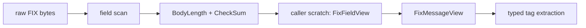

# `of_fix` Reference

`of_fix` is the reusable FIX tag-value codec layer for Orderflow execution
adapters. It is intentionally lower level than `of_execution_adapters::fix`:
`of_fix` understands wire-format FIX frames, while the execution adapter layer
maps parsed execution reports into canonical OMS events.

## Public API Map

| Item | Kind | Purpose |
| --- | --- | --- |
| `SOH` | constant | FIX field delimiter byte `0x01` |
| `FixTag` | struct | Numeric FIX tag identifier with common tag constants |
| `FixFieldView` | struct | Borrowed tag/value field view |
| `FixMessageView` | struct | Borrowed validated FIX frame view |
| `FixParseError` | enum | Strict parse and validation failures |
| `FixEncodeError` | enum | Encode-time validation failures |
| `parse_message` | function | Parses and validates raw FIX bytes into caller scratch |
| `encode_message` | function | Encodes a message into a caller-owned `Vec<u8>` |
| `checksum` | function | Computes FIX modulo-256 checksum |
| `debug_render` | function | Renders diagnostics with `|` separators |

## Design Boundary

`of_fix` does not implement a broker-certified session engine yet. It provides
the allocation-light codec foundation required by that future session layer.

Included:

- borrowed parsing from `&[u8]`;
- caller-provided `&mut [FixFieldView]` scratch;
- strict `BeginString(8)`, `BodyLength(9)`, and `CheckSum(10)` validation;
- common execution/session tag constants;
- direct extraction helpers for `MsgType(35)`, `MsgSeqNum(34)`, and
  `PossDupFlag(43)`;
- encoding into caller-owned buffers with computed `BodyLength` and `CheckSum`;
- diagnostic rendering outside the hot path.

Not included:

- TCP/TLS transport;
- Logon/Logout/Heartbeat/TestRequest session lifecycle;
- resend request handling;
- sequence reset/gap fill;
- persistent session store;
- repeating group dictionaries;
- venue profile validation;
- certification harness;
- OMS execution-event mapping.

Those layers should build on top of `of_fix` rather than duplicating wire codec
logic in each adapter.

## Low-Latency Rules

The codec follows the production FIX plan in `new_features.md`:

- parse from bytes, not strings;
- borrow field values from the raw frame;
- avoid `HashMap<Tag, String>` as the primary representation;
- avoid allocation during parse after the caller supplies scratch;
- validate body length and checksum directly over the raw buffer;
- keep debug formatting opt-in;
- encode into reusable caller-owned buffers.

## Decode Flow



## Decode Example

```rust
use of_fix::{encode_message, parse_message, FixFieldView, FixTag};

let mut raw = Vec::new();
encode_message(
    &mut raw,
    b"FIX.4.4",
    b"0",
    &[(FixTag::MSG_SEQ_NUM, b"1".as_slice())],
)?;

let mut scratch = [FixFieldView::empty(); 8];
let message = parse_message(&raw, &mut scratch)?;

assert_eq!(message.msg_type(), Some(b"0".as_slice()));
assert_eq!(message.msg_seq_num(), Some(1));
# Ok::<(), Box<dyn std::error::Error>>(())
```

## Encode Example

```rust
use of_fix::{encode_message, parse_message, FixFieldView, FixTag};

let mut raw = Vec::with_capacity(256);
encode_message(
    &mut raw,
    b"FIX.4.4",
    b"D",
    &[
        (FixTag::MSG_SEQ_NUM, b"7".as_slice()),
        (FixTag::CL_ORD_ID, b"ORD-1".as_slice()),
        (FixTag::SYMBOL, b"BTCUSDT".as_slice()),
    ],
)?;

let mut scratch = [FixFieldView::empty(); 16];
let message = parse_message(&raw, &mut scratch)?;
assert_eq!(message.get(FixTag::CL_ORD_ID), Some(b"ORD-1".as_slice()));
# Ok::<(), Box<dyn std::error::Error>>(())
```

## Validation Semantics

`parse_message` rejects:

- empty frames;
- malformed fields;
- non-numeric tags;
- missing required tags `8`, `9`, or `10`;
- too-small scratch buffers;
- invalid or mismatched `BodyLength(9)`;
- invalid or mismatched `CheckSum(10)`.

The strict default is intentional. Venue-specific relaxed behavior belongs in a
future profile layer so operators can see exactly what a counterparty requires.

## Encoder Semantics

`encode_message` owns tags `8`, `9`, `35`, and `10`.

The caller provides:

- begin string;
- message type;
- ordered body fields.

The encoder:

- clears the output buffer;
- writes `BeginString`;
- reserves and patches `BodyLength`;
- writes `MsgType` and caller fields;
- computes and appends `CheckSum`.

It rejects SOH bytes inside values and rejects caller-provided reserved tags.

## Roadmap

The next layers should remain additive:

- FIX 4.2/4.4 dictionary helpers;
- profile validation;
- typed builders for NewOrderSingle, Cancel, Replace, and session admin
  messages;
- session sequence state;
- resend/gap-fill policy;
- transcript capture;
- integration into `of_execution_adapters::fix`.
