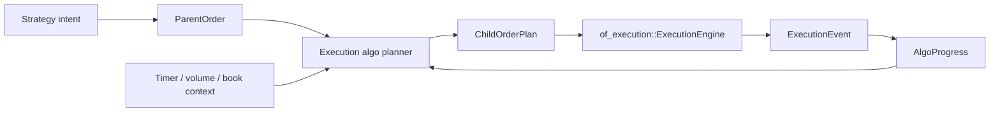
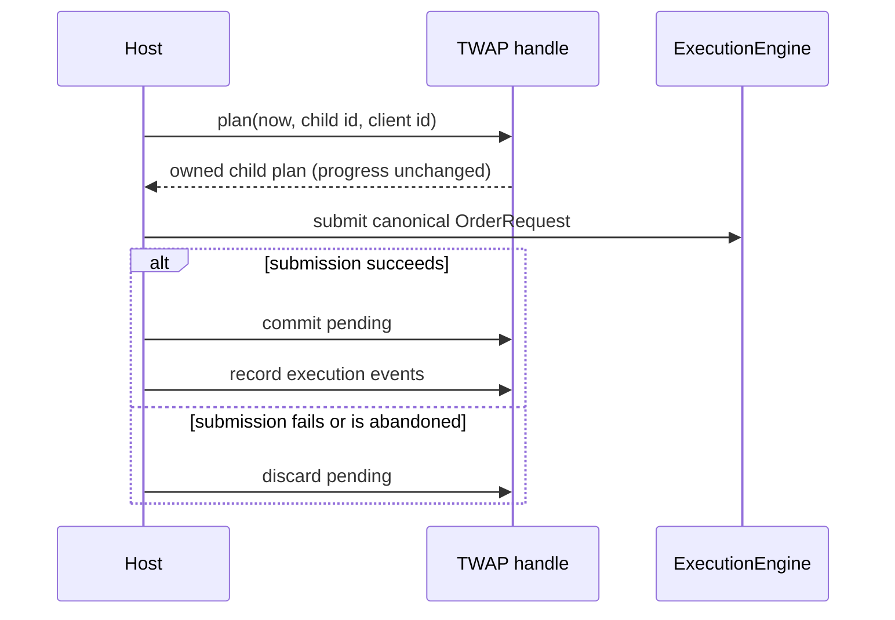

# `of_execution_algos` Reference

`of_execution_algos` is the optional execution-algorithm crate for Orderflow.
It contains a parent/child substrate plus deterministic TWAP, POV, VWAP,
iceberg, implementation-shortfall, passive queue, smart-order-routing,
liquidity-seeking, sweep/aggressive-take, basket, pairs/spread, and market-making
planning primitives. The crate deliberately does not own sockets, adapters,
risk gates, journals, or OMS state. Child orders generated by this crate should
still be submitted through `of_execution`.

## Boundary



The split keeps direct OMS users lightweight while giving algorithmic execution
users a dedicated crate for parent orders, child-order planning, replayable
decisions, and future TWAP/VWAP/POV/iceberg/SOR modules.

## Public Types

Identifiers reuse `of_execution_core::FixedAscii`:

- `ParentOrderId` — Algorithm parent-order identifier.
- `ChildOrderId` — Algorithm child-order identifier.
- `AlgoIntentId` — Strategy intent identifier.
- `AlgoInstanceId` — Running algorithm instance identifier.

Lifecycle and planning types:

- `ParentOrderStatus` — Execution-algorithm status for a parent order.
- `ChildOrderStatus` — Execution-algorithm status for a child order.
- `AlgoError` — Execution-algorithm error.
- `ParentOrder` — Parent order controlled by an execution algorithm.
- `ChildOrderPlan` — Planned child order generated by an execution algorithm.
- `AlgoProgress` — Aggregate parent execution progress.
- `AlgoAction` — Execution-algorithm action.
- `AlgoDecision` — Fixed-capacity algorithm decision.
- `AlgoRiskOutcome` — Algorithm risk-policy outcome.
- `AlgoRiskViolationKind` — Algorithm risk violation category.
- `AlgoRiskViolation` — One algorithm risk violation retained in a report.
- `AlgoRiskLimits` — Algorithm risk limits.
- `AlgoRiskContext` — Host-supplied risk context for one algorithm decision.
- `AlgoRiskReport` — Fixed-capacity risk report.
- `AlgoRiskPolicy` — Additive algorithm risk policy for validating child plans before OMS submit.
- `AlgoRecoveryAction` — Recovery action recommended for an algorithm instance.
- `AlgoCheckpoint` — Deterministic checkpoint for one algorithm parent instance.
- `AlgoRecoveryPolicy` — Algorithm recovery policy.
- `AlgoRecoveryPlan` — Deterministic recovery plan derived from a checkpoint and policy.
- `AlgoSimOutcome` — Deterministic child-order simulation outcome.
- `AlgoSimMarket` — Deterministic market/fill model for one simulation pass.
- `AlgoSimStep` — One simulated child-order result.
- `AlgoSimReport` — Fixed-capacity algorithm simulation report.
- `AlgoSimulator` — Deterministic simulator for generated child plans.
- `AlgoTcaBenchmark` — Optional TCA benchmark prices for an algorithm parent.
- `AlgoMetricsSnapshot` — Snapshot of algorithm execution metrics and TCA fields.
- `AlgoMetricsAccumulator` — Allocation-free accumulator for algo execution metrics and TCA.
- `AlgoKind` — Execution algorithm category for typed configuration.
- `AlgoParentConfig` — Typed parent-order configuration for algorithm construction.
- `AlgoConfig` — Typed top-level algorithm configuration.
- `TwapSlicePlanner` — Deterministic TWAP slice planner.
- `AlgoReplayEvent` — Replay event consumed by an algorithm harness.
- `AlgoReplayInput` — Sequenced replay input.
- `AlgoReplayIdScheme` — Deterministic child/client id generation prefixes for replay.
- `AlgoReplayStep` — Replay step emitted for one input event.
- `AlgoReplaySummary` — Summary returned by deterministic TWAP replay.
- `replay_twap_into` — Replays TWAP planning over explicit deterministic inputs.
- `PovSlicePlanner` — Deterministic percentage-of-volume child slice planner.
- `VwapVolumeCurve` — Borrowed cumulative volume curve for VWAP planning.
- `VwapSlicePlanner` — Deterministic VWAP child slice planner.
- `IcebergSlicePlanner` — Deterministic synthetic iceberg replenishment planner.
- `PassivePegMode` — Passive peg reference used by [`PassiveQueuePlanner`].
- `PassiveQueueAction` — Passive queue action selected by [`PassiveQueuePlanner`].
- `PassiveQueueContext` — Market context for passive queue planning.
- `PassiveQueueConfig` — Configuration for passive queue planning.
- `PassiveQueueEstimate` — Passive queue planning estimate.
- `PassiveQueueDecision` — Passive queue decision with an optional child order plan.
- `PassiveQueuePlanner` — Deterministic passive peg and queue-position planner.
- `SorRouteStatus` — Route availability state used by [`SorPlanner`].
- `SorRouteCapability` — Order-type capability advertised by a SOR route.
- `SorRouteMetrics` — Route quality metrics used for smart-order-router scoring.
- `SorRouteCandidate` — Routable liquidity candidate consumed by [`SorPlanner`].
- `SorScoreWeights` — Integer score weights for [`SorPlanner`].
- `SorConfig` — Smart-order-router configuration.
- `SorChildAllocation` — Scored child allocation produced by [`SorPlanner`].
- `SorDecision` — Fixed-capacity SOR decision.
- `SorPlanner` — Deterministic smart-order-router planner.
- `LiquiditySeekingAction` — Liquidity-seeking action selected for one route.
- `LiquiditySeekingCandidate` — Liquidity-seeking candidate derived from a routable venue.
- `LiquiditySeekingConfig` — Configuration for liquidity-seeking route selection.
- `LiquiditySeekingAllocation` — One liquidity-seeking allocation.
- `LiquiditySeekingDecision` — Fixed-capacity liquidity-seeking decision.
- `LiquiditySeekingPlanner` — Deterministic liquidity-seeking planner.
- `SweepConfig` — Aggressive sweep configuration.
- `SweepAllocation` — One aggressive sweep allocation.
- `SweepDecision` — Fixed-capacity aggressive sweep decision.
- `SweepPlanner` — Deterministic aggressive sweep planner.
- `BasketLegRole` — Basket or spread leg side in the portfolio objective.
- `BasketLeg` — One parent order participating in a basket or spread execution.
- `BasketChildAllocation` — Planned child allocation for one basket leg.
- `BasketDecision` — Fixed-capacity basket decision.
- `BasketPlanner` — Deterministic synchronized basket/spread planner.
- `SpreadConfig` — Two-leg spread execution configuration.
- `SpreadQuote` — Current executable two-leg spread prices.
- `SpreadEstimate` — Spread estimate used by [`SpreadPlanner`].
- `SpreadDecision` — Two-leg spread decision.
- `SpreadPlanner` — Deterministic two-leg pairs/spread planner.
- `MarketMakerContext` — Market-making context supplied by the host quote model.
- `MarketMakerConfig` — Market-making quote configuration.
- `MarketMakerQuoteEstimate` — Market-making quote estimate.
- `MarketMakerQuoteDecision` — Market-making quote decision.
- `MarketMakerPlanner` — Deterministic market-making quote planner.
- `ImplementationShortfallContext` — Market context for implementation-shortfall planning.
- `ImplementationShortfallConfig` — Configuration for implementation-shortfall planning.
- `ImplementationShortfallEstimate` — Implementation-shortfall planning estimate.
- `ImplementationShortfallPlanner` — Deterministic implementation-shortfall planner.

## Parent Orders

`ParentOrder` captures the order ticket fields an algorithm needs before it can
release child orders:

- parent id,
- account id,
- default route id,
- strategy id,
- symbol,
- side,
- order type,
- time-in-force,
- total quantity,
- limit and stop prices,
- start and end timestamps,
- minimum and maximum child clips,
- optional participation cap in basis points,
- lifecycle status.

The constructor validates schedule and clip bounds, then validates the
underlying OMS order shape using `of_execution_core::OrderRequest::validate`.

## Child Plans

`ChildOrderPlan` is the bridge from an algo decision to the OMS. It contains:

- child id,
- parent id,
- canonical `OrderRequest`,
- due timestamp,
- child lifecycle status.

Hosts decide when to submit the child. The crate does not call
`ExecutionEngine::submit` directly because the host owns permissions, route
policy, risk context, journaling, and operational controls.

## Progress Folding

`AlgoProgress` tracks:

- target quantity,
- released quantity,
- completed quantity,
- open quantity estimate,
- rejected child count,
- terminal child count.

`AlgoProgress::on_child_released` records planned child quantity before
submission. `AlgoProgress::on_execution_event` folds canonical OMS
`ExecutionEvent` values back into parent progress. This keeps algorithm state
replayable from the same OMS event stream.

## Fixed-Capacity Decisions

`AlgoDecision` stores actions in a fixed-capacity array. This is intentional:
production algo loops should avoid hidden `Vec` growth in the live decision
path. The default capacity is `DEFAULT_ALGO_DECISION_CAPACITY`, and users can
select another capacity with the const generic parameter.

Supported actions in the first slice:

- submit child order,
- pause parent,
- complete parent,
- escalate risk/operator attention.

## Algorithm Risk Controls

`AlgoRiskPolicy` is an additive pre-submit guard for child plans generated by
any execution planner. It does not submit orders and does not replace OMS risk;
it gives algorithm hosts a deterministic, explainable checkpoint before child
orders enter `of_execution`.

The policy checks `ChildOrderPlan` values against `AlgoRiskLimits` and
`AlgoRiskContext`. Limits are explicit typed fields rather than a free-form
configuration map. Zero-valued optional limits are disabled, letting hosts
start with only kill-switch or collar checks and add stricter controls later.

Supported controls:

- parent maximum quantity,
- child maximum quantity,
- child notional,
- participation cap from host-supplied market volume,
- price collar around a host-supplied reference price,
- open child quantity,
- child submissions per decision,
- child submissions in a caller-defined rate window,
- stale market-data block,
- route degradation block,
- persistence degradation block,
- kill switch,
- operator pause.

Risk output uses fixed-capacity reports:

- `AlgoRiskOutcome::Allow` means configured checks passed;
- `AlgoRiskOutcome::Block` means one or more configured limits failed;
- `AlgoRiskOutcome::KillSwitch` means kill switch or operator pause is active;
- `AlgoRiskViolation` records the violation kind, optional child id, measured
  value, and configured limit;
- `AlgoRiskReport::truncated()` tells the host when more violations occurred
  than the chosen report capacity retained.

The hot path uses integer arithmetic, caller-provided context, and fixed-size
arrays. It performs no wall-clock reads and does not allocate for reports.

```rust
use of_execution_algos::{
    AlgoProgress, AlgoRiskContext, AlgoRiskLimits, AlgoRiskPolicy,
    ChildOrderId, ParentOrder, ParentOrderId, DEFAULT_ALGO_RISK_VIOLATION_CAPACITY,
};
use of_execution_core::{
    AccountId, ClientOrderId, ExecutionSymbol, OrderPrice, OrderQty,
    OrderRequest, OrderSide, OrderType, RouteId, StrategyId, TimeInForce,
};

let parent = ParentOrder::new(
    ParentOrderId::new("parent-risk")?,
    AccountId::new("acct")?,
    RouteId::new("sim")?,
    StrategyId::new("risk")?,
    ExecutionSymbol::new("SIM", "ESZ6")?,
    OrderSide::Buy,
    OrderType::Limit,
    TimeInForce::Day,
    OrderQty::new(100)?,
    OrderPrice::new(500_000)?,
    OrderPrice(0),
    1_000,
    11_000,
    OrderQty::new(10)?,
    OrderQty::new(25)?,
    0,
)?;
let request = OrderRequest {
    client_order_id: ClientOrderId::new("risk-cl")?,
    account_id: parent.account_id(),
    route_id: parent.route_id(),
    strategy_id: parent.strategy_id(),
    symbol: parent.symbol(),
    side: parent.side(),
    order_type: parent.order_type(),
    time_in_force: parent.time_in_force(),
    quantity: OrderQty::new(10)?,
    limit_price: OrderPrice::new(500_000)?,
    stop_price: OrderPrice(0),
    ts_exchange_ns: 0,
    ts_recv_ns: 2_000,
};
let child = of_execution_algos::ChildOrderPlan::new(
    ChildOrderId::new("risk-child")?,
    parent.id(),
    request,
    2_000,
)?;
let limits = AlgoRiskLimits::new(
    OrderQty::new(100)?,
    OrderQty::new(25)?,
    10_000_000,
    1_500,
    100,
    OrderQty::new(50)?,
    2,
    10,
)?;
let context = AlgoRiskContext::new(OrderPrice::new(500_000)?)?
    .with_observed_market_volume(OrderQty::new(1_000)?);
let report = AlgoRiskPolicy::new(limits).evaluate_child::<
    DEFAULT_ALGO_RISK_VIOLATION_CAPACITY,
>(
    &parent,
    AlgoProgress::new(parent.id(), parent.total_qty()),
    &child,
    context,
)?;

assert!(report.is_allowed());
# Ok::<(), Box<dyn std::error::Error>>(())
```

## Typed Configuration

`AlgoParentConfig` mirrors the parent order ticket fields in a host-friendly
configuration type. It validates by building a `ParentOrder`, so parent
schedule, clip, quantity, and price rules remain centralized.

`AlgoConfig` combines:

- `AlgoKind`,
- parent config,
- `AlgoRiskLimits`,
- `AlgoRecoveryPolicy`.

It can build:

- `ParentOrder` for the planner,
- `AlgoRiskPolicy` for pre-submit checks,
- recovery policy for checkpoint restore.

The crate does not prescribe a file format. Hosts can serialize these typed
values as JSON, TOML, database rows, binary snapshots, or generated language
binding models without forcing a serialization dependency into
`of_execution_algos`.

```rust
use of_execution_algos::{AlgoConfig, AlgoKind, AlgoParentConfig, ParentOrderId};
use of_execution_core::{
    AccountId, ExecutionSymbol, OrderPrice, OrderQty, OrderSide, OrderType,
    RouteId, StrategyId, TimeInForce,
};

let parent_config = AlgoParentConfig::new(
    ParentOrderId::new("parent-config")?,
    AccountId::new("acct")?,
    RouteId::new("sim")?,
    StrategyId::new("twap")?,
    ExecutionSymbol::new("SIM", "ESZ6")?,
    OrderSide::Buy,
    OrderType::Limit,
    TimeInForce::Day,
    OrderQty::new(100)?,
    OrderPrice::new(500_000)?,
    OrderPrice(0),
    1_000,
    11_000,
    OrderQty::new(10)?,
    OrderQty::new(25)?,
    0,
)?;
let config = AlgoConfig::new(AlgoKind::Twap, parent_config);
let parent = config.to_parent_order()?;

assert_eq!(parent.total_qty(), OrderQty::new(100)?);
# Ok::<(), Box<dyn std::error::Error>>(())
```

## Child-Order Simulation

`AlgoSimulator` provides deterministic child-order simulation for planner tests
and replay harnesses. It does not model a full limit-order book or market
impact curve. Instead, the host supplies an explicit `AlgoSimMarket` for the
scenario being tested:

- available fill quantity,
- fill price,
- reject flag,
- cancel-unfilled-leaves flag,
- simulated latency.

For every submitted child, the simulator emits an `AlgoSimStep` containing:

- simulation sequence,
- child id,
- outcome,
- filled quantity,
- leaves quantity,
- fill price,
- canonical `ExecutionEvent`.

Because the output event is canonical, hosts can feed it directly into
`AlgoProgress::on_execution_event`. Decision-level simulation uses
`AlgoSimReport`, a fixed-capacity report that can retain a bounded number of
steps while still aggregating totals over all processed child submissions.

```rust
use of_execution_algos::{
    AlgoProgress, AlgoSimMarket, AlgoSimOutcome, AlgoSimulator, ChildOrderId,
    ParentOrder, ParentOrderId,
};
use of_execution_core::{
    AccountId, ClientOrderId, ExecutionSymbol, OrderPrice, OrderQty,
    OrderRequest, OrderSide, OrderType, RouteId, StrategyId, TimeInForce,
};

let parent = ParentOrder::new(
    ParentOrderId::new("parent-sim")?,
    AccountId::new("acct")?,
    RouteId::new("sim")?,
    StrategyId::new("twap")?,
    ExecutionSymbol::new("SIM", "ESZ6")?,
    OrderSide::Buy,
    OrderType::Limit,
    TimeInForce::Day,
    OrderQty::new(100)?,
    OrderPrice::new(500_000)?,
    OrderPrice(0),
    1_000,
    11_000,
    OrderQty::new(10)?,
    OrderQty::new(25)?,
    0,
)?;
let request = OrderRequest {
    client_order_id: ClientOrderId::new("sim-cl")?,
    account_id: parent.account_id(),
    route_id: parent.route_id(),
    strategy_id: parent.strategy_id(),
    symbol: parent.symbol(),
    side: parent.side(),
    order_type: parent.order_type(),
    time_in_force: parent.time_in_force(),
    quantity: OrderQty::new(10)?,
    limit_price: OrderPrice::new(500_000)?,
    stop_price: OrderPrice(0),
    ts_exchange_ns: 0,
    ts_recv_ns: 2_000,
};
let child = of_execution_algos::ChildOrderPlan::new(
    ChildOrderId::new("sim-child")?,
    parent.id(),
    request,
    2_000,
)?;
let simulator = AlgoSimulator::new(
    AlgoSimMarket::new(
        OrderQty::new(10)?,
        OrderPrice::new(500_025)?,
        false,
        false,
        25,
    )?,
);
let step = simulator.simulate_child(&child, 1)?;
let mut progress = AlgoProgress::new(parent.id(), parent.total_qty());
progress.on_child_released(&child)?;
progress.on_execution_event(&step.event());

assert_eq!(step.outcome(), AlgoSimOutcome::Filled);
assert_eq!(progress.completed_qty(), OrderQty::new(10)?);
# Ok::<(), Box<dyn std::error::Error>>(())
```

## Metrics And TCA

`AlgoMetricsAccumulator` is an allocation-free event accumulator for
parent-level execution quality. Hosts call `on_child_submitted` when a child is
released and `on_execution_event` for every canonical OMS execution event.

Metrics include:

- submitted child count,
- filled child count,
- rejected child count,
- cancelled/expired child count,
- completed quantity,
- completion in basis points,
- average execution price,
- side-aware arrival slippage,
- optional VWAP benchmark slippage,
- optional TWAP benchmark slippage,
- first child submit timestamp,
- last event timestamp,
- average event latency.

Slippage is side-aware. For buys, fills above benchmark are positive cost and
fills below benchmark are negative improvement. For sells, fills below
benchmark are positive cost and fills above benchmark are negative improvement.

```rust
use of_execution_algos::{
    AlgoMetricsAccumulator, AlgoTcaBenchmark, ChildOrderId, ParentOrder,
    ParentOrderId,
};
use of_execution_core::{
    AccountId, ClientOrderId, ExecutionEvent, ExecutionId, ExecutionSymbol,
    ExecutionText, ExecutionType, OrderPrice, OrderQty, OrderRequest,
    OrderSide, OrderStatus, OrderType, RiskRejectReason, RouteId, StrategyId,
    TimeInForce, VenueOrderId,
};

let parent = ParentOrder::new(
    ParentOrderId::new("parent-tca")?,
    AccountId::new("acct")?,
    RouteId::new("sim")?,
    StrategyId::new("tca")?,
    ExecutionSymbol::new("SIM", "ESZ6")?,
    OrderSide::Buy,
    OrderType::Limit,
    TimeInForce::Day,
    OrderQty::new(100)?,
    OrderPrice::new(500_000)?,
    OrderPrice(0),
    1_000,
    11_000,
    OrderQty::new(10)?,
    OrderQty::new(25)?,
    0,
)?;
let request = OrderRequest {
    client_order_id: ClientOrderId::new("tca-cl")?,
    account_id: parent.account_id(),
    route_id: parent.route_id(),
    strategy_id: parent.strategy_id(),
    symbol: parent.symbol(),
    side: parent.side(),
    order_type: parent.order_type(),
    time_in_force: parent.time_in_force(),
    quantity: OrderQty::new(10)?,
    limit_price: OrderPrice::new(500_000)?,
    stop_price: OrderPrice(0),
    ts_exchange_ns: 0,
    ts_recv_ns: 2_000,
};
let child = of_execution_algos::ChildOrderPlan::new(
    ChildOrderId::new("tca-child")?,
    parent.id(),
    request,
    2_000,
)?;
let mut metrics = AlgoMetricsAccumulator::new(
    &parent,
    AlgoTcaBenchmark::new(OrderPrice::new(500_000)?, OrderPrice(0), OrderPrice(0))?,
)?;
metrics.on_child_submitted(&child);
metrics.on_execution_event(&ExecutionEvent {
    exec_type: ExecutionType::Trade,
    order_status: OrderStatus::Filled,
    client_order_id: child.request().client_order_id,
    orig_client_order_id: ClientOrderId::empty(),
    venue_order_id: VenueOrderId::new("venue-tca")?,
    execution_id: ExecutionId::new("exec-tca")?,
    account_id: parent.account_id(),
    route_id: parent.route_id(),
    symbol: parent.symbol(),
    last_qty: OrderQty::new(10)?,
    last_price: OrderPrice::new(505_000)?,
    cumulative_qty: OrderQty::new(10)?,
    leaves_qty: OrderQty(0),
    average_price: OrderPrice::new(505_000)?,
    ts_exchange_ns: 2_000,
    ts_recv_ns: 2_025,
    reason: RiskRejectReason::None,
    text: ExecutionText::empty(),
});
let snapshot = metrics.snapshot();

assert_eq!(snapshot.completion_bps(), 1_000);
assert_eq!(snapshot.arrival_slippage_bps(), 100);
assert_eq!(snapshot.average_latency_ns(), 25);
# Ok::<(), Box<dyn std::error::Error>>(())
```

## Checkpoints And Recovery

`AlgoCheckpoint` is the algorithm-layer recovery record for one parent order.
It is intentionally small and copyable. The host can serialize it into a WAL,
checkpoint store, database row, or custom binary format without this crate
owning any storage dependency.

Checkpoint contents:

- `ALGO_CHECKPOINT_SCHEMA_VERSION`,
- parent order,
- progress snapshot,
- next decision sequence,
- last consumed input sequence.

The checkpoint does not include OMS journal entries, venue order ids, adapter
connection state, sequence numbers from execution venues, or market-data WAL
offsets. Those belong to `of_execution`, `of_persist`, adapters, and the host
runtime. This separation prevents the algorithm crate from becoming a second
OMS journal and keeps recovery deterministic.

`AlgoRecoveryPolicy` controls the first action after checkpoint load:

- pause by default after recovery,
- require OMS/venue reconciliation before resume,
- complete a parent when recovered progress already reached target quantity.

`AlgoRecoveryPlan` returns:

- the source checkpoint,
- recommended `AlgoRecoveryAction`,
- first input sequence to replay after the checkpoint,
- next decision sequence,
- whether reconciliation must gate resume.

```rust
use of_execution_algos::{
    AlgoCheckpoint, AlgoProgress, AlgoRecoveryAction, AlgoRecoveryPlan,
    AlgoRecoveryPolicy, ParentOrder, ParentOrderId,
};
use of_execution_core::{
    AccountId, ExecutionSymbol, OrderPrice, OrderQty, OrderSide, OrderType,
    RouteId, StrategyId, TimeInForce,
};

let parent = ParentOrder::new(
    ParentOrderId::new("parent-recovery")?,
    AccountId::new("acct")?,
    RouteId::new("sim")?,
    StrategyId::new("twap")?,
    ExecutionSymbol::new("SIM", "ESZ6")?,
    OrderSide::Buy,
    OrderType::Limit,
    TimeInForce::Day,
    OrderQty::new(100)?,
    OrderPrice::new(500_000)?,
    OrderPrice(0),
    1_000,
    11_000,
    OrderQty::new(10)?,
    OrderQty::new(25)?,
    0,
)?;
let progress = AlgoProgress::new(parent.id(), parent.total_qty());
let checkpoint = AlgoCheckpoint::new(parent, progress, 7, 42)?;
let plan = AlgoRecoveryPlan::new(checkpoint, AlgoRecoveryPolicy::default())?;

assert_eq!(plan.action(), AlgoRecoveryAction::Pause);
assert_eq!(plan.replay_from_sequence(), 43);
assert!(plan.reconciliation_required());
# Ok::<(), Box<dyn std::error::Error>>(())
```

## TWAP Planner

`TwapSlicePlanner` is deterministic and host-clock-neutral. It takes:

- a validated parent order,
- current progress,
- caller-provided `now_ns`,
- caller-provided child id,
- caller-provided client order id,
- caller-provided receive timestamp.

It returns `Ok(None)` when no child slice is due. When a slice is due, it
returns a `ChildOrderPlan` whose `OrderRequest` can be submitted to the OMS.

TWAP quantity calculation is integer-only:

1. divide the parent time window into fixed buckets,
2. compute the cumulative quantity due for elapsed buckets,
3. subtract already released quantity,
4. cap by `max_clip`,
5. suppress non-final slices below `min_clip`,
6. never release more than remaining parent quantity.

## Example

```rust
use of_execution_algos::{
    AlgoProgress, ChildOrderId, ParentOrder, ParentOrderId, TwapSlicePlanner,
};
use of_execution_core::{
    AccountId, ClientOrderId, ExecutionSymbol, OrderPrice, OrderQty, OrderSide,
    OrderType, RouteId, StrategyId, TimeInForce,
};

let parent = ParentOrder::new(
    ParentOrderId::new("parent-1")?,
    AccountId::new("acct")?,
    RouteId::new("sim")?,
    StrategyId::new("twap")?,
    ExecutionSymbol::new("SIM", "ESZ6")?,
    OrderSide::Buy,
    OrderType::Limit,
    TimeInForce::Day,
    OrderQty::new(100)?,
    OrderPrice::new(500_000)?,
    OrderPrice(0),
    1_000,
    11_000,
    OrderQty::new(10)?,
    OrderQty::new(25)?,
    0,
)?;

let planner = TwapSlicePlanner::new(1_000);
let progress = AlgoProgress::new(parent.id(), parent.total_qty());
let child = planner
    .plan_due_slice(
        &parent,
        progress,
        1_000,
        ChildOrderId::new("child-1")?,
        ClientOrderId::new("cl-1")?,
        1_000,
    )?
    .expect("slice due");

assert_eq!(child.request().quantity, OrderQty(10));
# Ok::<(), Box<dyn std::error::Error>>(())
```

## Deterministic Replay

`replay_twap_into` runs TWAP planning over caller-provided input events and
writes replay steps into a caller-owned `Vec`.

Replay inputs are explicit:

- `AlgoReplayEvent::Timer` drives schedule evaluation,
- `AlgoReplayEvent::Execution` folds canonical OMS reports into progress,
- `AlgoReplayEvent::ParentStatus` changes parent lifecycle state.

The harness does not read wall-clock time, does not submit orders, and does not
generate random child ids. `AlgoReplayIdScheme` derives child and client ids
from deterministic prefixes plus a child counter.

```rust
use of_execution_algos::{
    replay_twap_into, AlgoReplayEvent, AlgoReplayIdScheme, AlgoReplayInput,
    ParentOrder, ParentOrderId, TwapSlicePlanner,
};
use of_execution_core::{
    AccountId, ExecutionSymbol, OrderPrice, OrderQty, OrderSide, OrderType,
    RouteId, StrategyId, TimeInForce,
};

let parent = ParentOrder::new(
    ParentOrderId::new("parent-1")?,
    AccountId::new("acct")?,
    RouteId::new("sim")?,
    StrategyId::new("twap")?,
    ExecutionSymbol::new("SIM", "ESZ6")?,
    OrderSide::Buy,
    OrderType::Limit,
    TimeInForce::Day,
    OrderQty::new(100)?,
    OrderPrice::new(500_000)?,
    OrderPrice(0),
    1_000,
    11_000,
    OrderQty::new(10)?,
    OrderQty::new(25)?,
    0,
)?;

let inputs = [
    AlgoReplayInput::new(1, AlgoReplayEvent::Timer { timestamp_ns: 1_000 }),
    AlgoReplayInput::new(2, AlgoReplayEvent::Timer { timestamp_ns: 2_000 }),
];
let mut steps = Vec::new();
let summary = replay_twap_into::<16>(
    parent,
    TwapSlicePlanner::new(1_000),
    &inputs,
    AlgoReplayIdScheme::default(),
    &mut steps,
)?;

assert_eq!(summary.submitted_children(), 2);
# Ok::<(), Box<dyn std::error::Error>>(())
```

Use `AlgoReplaySummary::deterministic_hash()` in regression tests when you want
to compare replay outputs without diffing every step.

## POV Planner

`PovSlicePlanner` implements the first percentage-of-volume planner. It uses
cumulative observed market volume and explicit participation limits:

- target participation in basis points,
- maximum participation in basis points,
- optional parent participation cap,
- parent min/max child clips,
- caller-provided child id,
- caller-provided client order id,
- caller-provided timestamps.

POV is volume-responsive rather than time-scheduled. When observed market
volume increases, the desired released quantity increases. If the due quantity
is below the parent minimum clip, the planner waits unless the parent is in a
final-slice condition.

Hosts should exclude the algorithm's own fills from observed market volume when
possible. If that is not possible, use conservative participation rates because
self-volume feedback can make participation algos too aggressive.

```rust
use of_execution_algos::{
    AlgoProgress, ChildOrderId, ParentOrder, ParentOrderId, PovSlicePlanner,
};
use of_execution_core::{
    AccountId, ClientOrderId, ExecutionSymbol, OrderPrice, OrderQty, OrderSide,
    OrderType, RouteId, StrategyId, TimeInForce,
};

let parent = ParentOrder::new(
    ParentOrderId::new("parent-1")?,
    AccountId::new("acct")?,
    RouteId::new("sim")?,
    StrategyId::new("pov")?,
    ExecutionSymbol::new("SIM", "ESZ6")?,
    OrderSide::Buy,
    OrderType::Limit,
    TimeInForce::Day,
    OrderQty::new(100)?,
    OrderPrice::new(500_000)?,
    OrderPrice(0),
    1_000,
    11_000,
    OrderQty::new(10)?,
    OrderQty::new(25)?,
    1_500,
)?;

let planner = PovSlicePlanner::new(1_000, 1_500);
let progress = AlgoProgress::new(parent.id(), parent.total_qty());
let child = planner
    .plan_volume_slice(
        &parent,
        progress,
        OrderQty::new(1_000)?,
        2_000,
        ChildOrderId::new("child-1")?,
        ClientOrderId::new("cl-1")?,
        2_000,
    )?
    .expect("slice due");

assert_eq!(child.request().quantity, OrderQty(25));
# Ok::<(), Box<dyn std::error::Error>>(())
```

## VWAP Planner

`VwapSlicePlanner` follows a borrowed cumulative volume profile. The profile is
pre-cumulative so live planning can read one bucket and avoid summing a full
curve on every timer tick.

`VwapVolumeCurve` requires:

- non-empty cumulative weights,
- positive final total weight,
- non-decreasing cumulative values,
- positive bucket interval.

The planner maps elapsed time to a profile bucket, computes the target parent
quantity from cumulative weight divided by total weight, subtracts released
quantity, and applies the same min/max clip rules used by TWAP and POV.

```rust
use of_execution_algos::{
    AlgoProgress, ChildOrderId, ParentOrder, ParentOrderId, VwapSlicePlanner,
    VwapVolumeCurve,
};
use of_execution_core::{
    AccountId, ClientOrderId, ExecutionSymbol, OrderPrice, OrderQty, OrderSide,
    OrderType, RouteId, StrategyId, TimeInForce,
};

let curve = VwapVolumeCurve::new(1_000, 1_000, &[10, 30, 60, 100])?;
let planner = VwapSlicePlanner::new(curve);
let parent = ParentOrder::new(
    ParentOrderId::new("parent-1")?,
    AccountId::new("acct")?,
    RouteId::new("sim")?,
    StrategyId::new("vwap")?,
    ExecutionSymbol::new("SIM", "ESZ6")?,
    OrderSide::Buy,
    OrderType::Limit,
    TimeInForce::Day,
    OrderQty::new(100)?,
    OrderPrice::new(500_000)?,
    OrderPrice(0),
    1_000,
    11_000,
    OrderQty::new(10)?,
    OrderQty::new(25)?,
    0,
)?;

let progress = AlgoProgress::new(parent.id(), parent.total_qty());
let child = planner
    .plan_curve_slice(
        &parent,
        progress,
        2_000,
        ChildOrderId::new("child-1")?,
        ClientOrderId::new("cl-1")?,
        2_000,
    )?
    .expect("slice due");

assert_eq!(child.request().quantity, OrderQty(25));
# Ok::<(), Box<dyn std::error::Error>>(())
```

## Iceberg Planner

`IcebergSlicePlanner` is a synthetic reserve/iceberg replenishment helper. It
does not assume a venue-native reserve order type. Instead, it plans another
canonical child order when the parent has remaining unreleased quantity and the
current open displayed quantity is at or below the replenish threshold.

The host decides whether to:

- submit the child as a normal synthetic slice,
- map it to venue-native reserve/iceberg tags,
- wait for a refresh delay,
- add randomized display sizing in a future policy layer.

```rust
use of_execution_algos::{
    AlgoProgress, ChildOrderId, IcebergSlicePlanner, ParentOrder, ParentOrderId,
};
use of_execution_core::{
    AccountId, ClientOrderId, ExecutionSymbol, OrderPrice, OrderQty, OrderSide,
    OrderType, RouteId, StrategyId, TimeInForce,
};

let parent = ParentOrder::new(
    ParentOrderId::new("parent-1")?,
    AccountId::new("acct")?,
    RouteId::new("sim")?,
    StrategyId::new("iceberg")?,
    ExecutionSymbol::new("SIM", "ESZ6")?,
    OrderSide::Buy,
    OrderType::Limit,
    TimeInForce::Day,
    OrderQty::new(100)?,
    OrderPrice::new(500_000)?,
    OrderPrice(0),
    1_000,
    11_000,
    OrderQty::new(10)?,
    OrderQty::new(25)?,
    0,
)?;

let planner = IcebergSlicePlanner::new(OrderQty::new(20)?, OrderQty(0));
let progress = AlgoProgress::new(parent.id(), parent.total_qty());
let child = planner
    .plan_replenishment(
        &parent,
        progress,
        1_000,
        ChildOrderId::new("child-1")?,
        ClientOrderId::new("cl-1")?,
        1_000,
    )?
    .expect("slice due");

assert_eq!(child.request().quantity, OrderQty(20));
# Ok::<(), Box<dyn std::error::Error>>(())
```

## Implementation Shortfall Planner

`ImplementationShortfallPlanner` is a deterministic first slice of
arrival-price execution. It does not solve a full stochastic control problem on
the hot path. Instead, it computes an explainable urgency-adjusted release
target from:

- elapsed parent interval,
- arrival price,
- current reference price,
- adverse move from arrival by side,
- volatility estimate,
- spread estimate,
- temporary impact estimate,
- configured urgency and weights.

Higher volatility, spread, and adverse movement increase urgency. Higher
temporary impact reduces urgency so the planner can wait when immediate impact
is too expensive. The resulting cumulative target is capped, compared with
already released quantity, and bounded by the parent min/max clip rules.

```rust
use of_execution_algos::{
    AlgoProgress, ChildOrderId, ImplementationShortfallConfig,
    ImplementationShortfallContext, ImplementationShortfallPlanner, ParentOrder,
    ParentOrderId,
};
use of_execution_core::{
    AccountId, ClientOrderId, ExecutionSymbol, OrderPrice, OrderQty, OrderSide,
    OrderType, RouteId, StrategyId, TimeInForce,
};

let parent = ParentOrder::new(
    ParentOrderId::new("parent-1")?,
    AccountId::new("acct")?,
    RouteId::new("sim")?,
    StrategyId::new("is")?,
    ExecutionSymbol::new("SIM", "ESZ6")?,
    OrderSide::Buy,
    OrderType::Limit,
    TimeInForce::Day,
    OrderQty::new(100)?,
    OrderPrice::new(500_000)?,
    OrderPrice(0),
    1_000,
    11_000,
    OrderQty::new(10)?,
    OrderQty::new(25)?,
    0,
)?;

let planner = ImplementationShortfallPlanner::new(
    ImplementationShortfallConfig::default(),
);
let context = ImplementationShortfallContext::new(
    OrderPrice::new(500_000)?,
    OrderPrice::new(510_000)?,
    200,
    20,
    10,
)?;
let progress = AlgoProgress::new(parent.id(), parent.total_qty());
let estimate = planner.estimate(&parent, progress, 1_000, context)?;
let child = planner
    .plan_shortfall_slice(
        &parent,
        progress,
        1_000,
        context,
        ChildOrderId::new("child-1")?,
        ClientOrderId::new("cl-1")?,
        1_000,
    )?
    .expect("slice due");

assert!(estimate.urgency_bps() > 0);
assert!(child.request().quantity.0 >= parent.min_clip().0);
# Ok::<(), Box<dyn std::error::Error>>(())
```

## Passive Queue Planner

`PassiveQueuePlanner` is a deterministic passive peg and queue-position helper.
It consumes host-owned order-book context rather than subscribing to feeds or
assuming a venue-native pegged-order implementation.

Inputs include:

- best bid and best ask,
- tick size in normalized price units,
- estimated quantity ahead at the candidate queue,
- expected short-horizon contra-side take volume,
- adverse-selection estimate in basis points,
- parent elapsed time,
- parent min/max clips and leaves.

The planner chooses one of:

- `Wait` — Keep the parent order working without submitting a new child.
- `JoinQueue` — Submit a passive child at the selected queue price.
- `ImprovePrice` — Submit a passive child at an improved price when configured.
- `CrossSpread` when explicitly enabled and the parent is late.

This first slice deliberately avoids stochastic queue modeling in the live
path. Hosts can calibrate fill-probability and adverse-selection inputs from
venue-specific research, simulation, or production telemetry, then pass the
current integer estimates into the planner.

```rust
use of_execution_algos::{
    AlgoProgress, ChildOrderId, ParentOrder, ParentOrderId, PassivePegMode,
    PassiveQueueConfig, PassiveQueueContext, PassiveQueuePlanner,
};
use of_execution_core::{
    AccountId, ClientOrderId, ExecutionSymbol, OrderPrice, OrderQty, OrderSide,
    OrderType, RouteId, StrategyId, TimeInForce,
};

let parent = ParentOrder::new(
    ParentOrderId::new("parent-1")?,
    AccountId::new("acct")?,
    RouteId::new("sim")?,
    StrategyId::new("passive")?,
    ExecutionSymbol::new("SIM", "ESZ6")?,
    OrderSide::Buy,
    OrderType::Limit,
    TimeInForce::Day,
    OrderQty::new(100)?,
    OrderPrice::new(500_000)?,
    OrderPrice(0),
    1_000,
    11_000,
    OrderQty::new(10)?,
    OrderQty::new(25)?,
    0,
)?;

let config = PassiveQueueConfig::new(PassivePegMode::SameSide, OrderPrice(25))?
    .with_thresholds(2_500, 250, 1_500)?;
let planner = PassiveQueuePlanner::new(config);
let context = PassiveQueueContext::new(
    OrderPrice::new(499_975)?,
    OrderPrice::new(500_025)?,
    OrderQty::new(25)?,
    OrderQty::new(100)?,
    10,
)?;
let progress = AlgoProgress::new(parent.id(), parent.total_qty());
let decision = planner.plan_passive_slice(
    &parent,
    progress,
    2_000,
    context,
    ChildOrderId::new("child-1")?,
    ClientOrderId::new("cl-1")?,
    2_000,
)?;

assert!(decision.action().releases_child());
assert!(decision.child().is_some());
# Ok::<(), Box<dyn std::error::Error>>(())
```

## Smart Order Router

`SorPlanner` scores host-provided route candidates and emits fixed-capacity
child allocations. It is intentionally a routing decision primitive, not a
venue adapter, market-data consolidator, or best-execution policy engine.

Route candidates include:

- route id,
- candidate price,
- available quantity,
- route status,
- order-type capability,
- fee or rebate estimate,
- latency estimate,
- recent reject rate,
- fill probability,
- toxicity estimate,
- market-data quality score.

The scoring model is deterministic and integer-only. Higher scores are
preferred. Non-routable, blocked, degraded, cooldown, unsupported, empty, or
invalid candidates are skipped. The planner allocates across selected routes up
to the configured route count, parent `max_clip`, available route quantity, and
caller-provided fixed output capacity.

```rust
use of_execution_algos::{
    AlgoProgress, ChildOrderId, ParentOrder, ParentOrderId, SorConfig,
    SorPlanner, SorRouteCandidate,
};
use of_execution_core::{
    AccountId, ClientOrderId, ExecutionSymbol, OrderPrice, OrderQty, OrderSide,
    OrderType, RouteId, StrategyId, TimeInForce,
};

let parent = ParentOrder::new(
    ParentOrderId::new("parent-1")?,
    AccountId::new("acct")?,
    RouteId::new("default")?,
    StrategyId::new("sor")?,
    ExecutionSymbol::new("SIM", "ESZ6")?,
    OrderSide::Buy,
    OrderType::Limit,
    TimeInForce::Day,
    OrderQty::new(100)?,
    OrderPrice::new(500_000)?,
    OrderPrice(0),
    1_000,
    11_000,
    OrderQty::new(10)?,
    OrderQty::new(25)?,
    0,
)?;

let candidates = [
    SorRouteCandidate::new(
        RouteId::new("r1")?,
        OrderPrice::new(499_975)?,
        OrderQty::new(25)?,
    )?,
    SorRouteCandidate::new(
        RouteId::new("r2")?,
        OrderPrice::new(500_000)?,
        OrderQty::new(25)?,
    )?,
];
let child_ids = [ChildOrderId::new("child-1")?, ChildOrderId::new("child-2")?];
let client_ids = [ClientOrderId::new("cl-1")?, ClientOrderId::new("cl-2")?];
let planner = SorPlanner::new(SorConfig::default());
let decision = planner.plan_routes::<2>(
    &parent,
    AlgoProgress::new(parent.id(), parent.total_qty()),
    2_000,
    &candidates,
    &child_ids,
    &client_ids,
    2_000,
)?;

assert!(!decision.is_empty());
# Ok::<(), Box<dyn std::error::Error>>(())
```

## Liquidity-Seeking Planner

`LiquiditySeekingPlanner` ranks route candidates, skips toxic venues, probes
uncertain hidden liquidity, and takes larger clips when fill probability is
high. It composes with `SorRouteCandidate` so hosts can share route health,
capability, fee, latency, reject-rate, fill-probability, toxicity, and
data-quality inputs across SOR and liquidity-seeking workflows.

Additional liquidity-seeking inputs include:

- hidden-liquidity estimate,
- price-improvement estimate,
- minimum executable quantity,
- probe quantity,
- take/sweep fill-probability threshold,
- maximum tolerated toxicity,
- score weights for hidden liquidity and price improvement.

The planner does not own dark-pool access, IOIs, venue-specific minimum-quantity
order types, or anti-gaming policy. It emits route-specific child plans for the
OMS.

```rust
use of_execution_algos::{
    AlgoProgress, ChildOrderId, LiquiditySeekingCandidate,
    LiquiditySeekingConfig, LiquiditySeekingPlanner, ParentOrder, ParentOrderId,
    SorConfig, SorRouteCandidate, SorRouteMetrics,
};
use of_execution_core::{
    AccountId, ClientOrderId, ExecutionSymbol, OrderPrice, OrderQty, OrderSide,
    OrderType, RouteId, StrategyId, TimeInForce,
};

let parent = ParentOrder::new(
    ParentOrderId::new("parent-1")?,
    AccountId::new("acct")?,
    RouteId::new("default")?,
    StrategyId::new("liq")?,
    ExecutionSymbol::new("SIM", "ESZ6")?,
    OrderSide::Buy,
    OrderType::Limit,
    TimeInForce::Day,
    OrderQty::new(100)?,
    OrderPrice::new(500_000)?,
    OrderPrice(0),
    1_000,
    11_000,
    OrderQty::new(10)?,
    OrderQty::new(25)?,
    0,
)?;

let route = SorRouteCandidate::new(
    RouteId::new("dark-1")?,
    OrderPrice::new(500_000)?,
    OrderQty::new(100)?,
)?
.with_metrics(SorRouteMetrics::new(0, 200, 0, 4_000, 100, 9_000)?);
let candidates = [LiquiditySeekingCandidate::new(route, 2_500, 50, OrderQty::new(10)?)?];
let child_ids = [ChildOrderId::new("child-1")?];
let client_ids = [ClientOrderId::new("cl-1")?];
let planner = LiquiditySeekingPlanner::new(
    LiquiditySeekingConfig::new(1, OrderQty::new(10)?, 0, 7_500, 1_500, 3, 4)?,
    SorConfig::default(),
);
let decision = planner.plan_liquidity::<1>(
    &parent,
    AlgoProgress::new(parent.id(), parent.total_qty()),
    2_000,
    &candidates,
    &child_ids,
    &client_ids,
    2_000,
)?;

assert!(!decision.is_empty());
# Ok::<(), Box<dyn std::error::Error>>(())
```

## Sweep / Aggressive Take Planner

`SweepPlanner` walks host-provided route candidates aggressively up to a
side-aware price collar. It targets urgent liquidity removal while keeping
price and quantity guardrails visible in the API.

Inputs include:

- route/level candidates,
- side-aware price collar,
- minimum fill quantity,
- maximum route/level allocation count,
- parent clip limits and leaves.

The planner chooses the best eligible price first for the parent side, skips
non-routable or unsupported candidates, stops at the collar, and reports total
planned quantity plus average planned price. It does not own IOC/FOK mapping,
protected-market rules, market-data validation, or venue-specific routing
instructions.

```rust
use of_execution_algos::{
    AlgoProgress, ChildOrderId, ParentOrder, ParentOrderId, SorRouteCandidate,
    SweepConfig, SweepPlanner,
};
use of_execution_core::{
    AccountId, ClientOrderId, ExecutionSymbol, OrderPrice, OrderQty, OrderSide,
    OrderType, RouteId, StrategyId, TimeInForce,
};

let parent = ParentOrder::new(
    ParentOrderId::new("parent-1")?,
    AccountId::new("acct")?,
    RouteId::new("default")?,
    StrategyId::new("sweep")?,
    ExecutionSymbol::new("SIM", "ESZ6")?,
    OrderSide::Buy,
    OrderType::Limit,
    TimeInForce::Day,
    OrderQty::new(100)?,
    OrderPrice::new(500_000)?,
    OrderPrice(0),
    1_000,
    11_000,
    OrderQty::new(10)?,
    OrderQty::new(25)?,
    0,
)?;

let levels = [
    SorRouteCandidate::new(RouteId::new("r1")?, OrderPrice::new(499_975)?, OrderQty::new(10)?)?,
    SorRouteCandidate::new(RouteId::new("r2")?, OrderPrice::new(500_000)?, OrderQty::new(15)?)?,
];
let child_ids = [ChildOrderId::new("child-1")?, ChildOrderId::new("child-2")?];
let client_ids = [ClientOrderId::new("cl-1")?, ClientOrderId::new("cl-2")?];
let planner = SweepPlanner::new(SweepConfig::new(2, OrderPrice::new(500_000)?, OrderQty(0))?);
let decision = planner.plan_sweep::<2>(
    &parent,
    AlgoProgress::new(parent.id(), parent.total_qty()),
    2_000,
    &levels,
    &child_ids,
    &client_ids,
    2_000,
)?;

assert_eq!(decision.total_qty(), OrderQty(25));
# Ok::<(), Box<dyn std::error::Error>>(())
```

## Basket And Spread Planner

`BasketPlanner` synchronizes child release across multiple leg parents. It is a
deterministic orchestration helper, not an atomic multi-leg venue order type.
Hosts remain responsible for linked-order semantics, hedge drift controls,
route selection, cancel/replace recovery, and portfolio-level risk.

Basket leg metadata includes:

- leg parent order,
- leg role (`Primary`, `Hedge`, or `Offset`),
- hedge-ratio metadata in basis points.

The first planner slice uses each leg's own parent quantity, schedule, route,
symbol, and clip bounds. It emits at most one child per due leg into a
fixed-capacity decision and requires caller-provided child/client ids.

```rust
use of_execution_algos::{
    AlgoProgress, BasketLeg, BasketLegRole, BasketPlanner, ChildOrderId,
    ParentOrder, ParentOrderId,
};
use of_execution_core::{
    AccountId, ClientOrderId, ExecutionSymbol, OrderPrice, OrderQty, OrderSide,
    OrderType, RouteId, StrategyId, TimeInForce,
};

let parent = ParentOrder::new(
    ParentOrderId::new("parent-1")?,
    AccountId::new("acct")?,
    RouteId::new("default")?,
    StrategyId::new("basket")?,
    ExecutionSymbol::new("SIM", "ESZ6")?,
    OrderSide::Buy,
    OrderType::Limit,
    TimeInForce::Day,
    OrderQty::new(100)?,
    OrderPrice::new(500_000)?,
    OrderPrice(0),
    1_000,
    11_000,
    OrderQty::new(10)?,
    OrderQty::new(25)?,
    0,
)?;

let leg = BasketLeg::new(parent, BasketLegRole::Primary, 10_000)?;
let progress = AlgoProgress::new(parent.id(), parent.total_qty());
let child_ids = [ChildOrderId::new("child-1")?];
let client_ids = [ClientOrderId::new("cl-1")?];
let decision = BasketPlanner::new().plan_synchronized_slice::<1>(
    &[leg],
    &[progress],
    6_000,
    &child_ids,
    &client_ids,
    6_000,
)?;

assert_eq!(decision.len(), 1);
# Ok::<(), Box<dyn std::error::Error>>(())
```

## Pairs / Spread Planner

`SpreadPlanner` handles the common two-leg case where a strategy wants to buy
one instrument and sell another only when the executable spread edge is good
enough. It is more specific than `BasketPlanner`: the basket planner schedules
many legs, while the spread planner computes hedge-ratio sizing and a current
edge before releasing synchronized buy/sell child plans.

The planner uses this integer calculation:

```text
edge_bps = ((sell_price * ratio_bps / 10_000) - buy_price) * 10_000 / buy_price
```

`ratio_bps` is the sell-leg hedge ratio relative to the buy leg. A ratio of
`10_000` means one sell unit for one buy unit. A ratio of `5_000` means the
sell leg is half the buy-leg quantity. Prices are the caller's executable leg
prices, usually best offer for the buy leg and best bid for the sell leg after
adapter-specific validation.

Public spread types:

- `SpreadConfig` — Hedge ratio and minimum edge threshold for a two-leg spread.
- `SpreadQuote` — Executable buy- and sell-leg prices used for spread evaluation.
- `SpreadEstimate` — Current edge, executable flag, and planned leg quantities.
- `SpreadDecision` — Spread estimate plus optional buy and sell child plans.
- `SpreadPlanner` — Deterministic planner for coordinated two-leg child orders.

Planning rules:

- buy parent must be `OrderSide::Buy`;
- sell parent must be `OrderSide::Sell`;
- both parent/progress pairs must match;
- neither parent may be terminal;
- both legs must be inside their configured time windows;
- both child quantities must satisfy parent clip constraints;
- both child ids and client order ids are caller-provided;
- no heap allocation is required by the hot planning path.

The planner does not make multi-venue execution atomic. Hosts still own linked
order support, hedge drift policy, cancel/replace behavior, timeout handling,
and recovery if one leg fills while the other misses.

```rust
use of_execution_algos::{
    AlgoProgress, ChildOrderId, ParentOrder, ParentOrderId, SpreadConfig,
    SpreadPlanner, SpreadQuote,
};
use of_execution_core::{
    AccountId, ClientOrderId, ExecutionSymbol, OrderPrice, OrderQty, OrderSide,
    OrderType, RouteId, StrategyId, TimeInForce,
};

let buy_parent = ParentOrder::new(
    ParentOrderId::new("spread-buy")?,
    AccountId::new("acct")?,
    RouteId::new("buy-route")?,
    StrategyId::new("pairs")?,
    ExecutionSymbol::new("SIM", "LEG_A")?,
    OrderSide::Buy,
    OrderType::Limit,
    TimeInForce::Day,
    OrderQty::new(100)?,
    OrderPrice::new(500_000)?,
    OrderPrice(0),
    1_000,
    11_000,
    OrderQty::new(10)?,
    OrderQty::new(25)?,
    0,
)?;
let sell_parent = ParentOrder::new(
    ParentOrderId::new("spread-sell")?,
    AccountId::new("acct")?,
    RouteId::new("sell-route")?,
    StrategyId::new("pairs")?,
    ExecutionSymbol::new("SIM", "LEG_B")?,
    OrderSide::Sell,
    OrderType::Limit,
    TimeInForce::Day,
    OrderQty::new(100)?,
    OrderPrice::new(505_000)?,
    OrderPrice(0),
    1_000,
    11_000,
    OrderQty::new(10)?,
    OrderQty::new(25)?,
    0,
)?;

let decision = SpreadPlanner::new(SpreadConfig::new(10_000, 50)?).plan_spread(
    &buy_parent,
    AlgoProgress::new(buy_parent.id(), buy_parent.total_qty()),
    &sell_parent,
    AlgoProgress::new(sell_parent.id(), sell_parent.total_qty()),
    2_000,
    SpreadQuote::new(OrderPrice::new(500_000)?, OrderPrice::new(505_000)?)?,
    ChildOrderId::new("spread-buy-child")?,
    ClientOrderId::new("spread-buy-cl")?,
    ChildOrderId::new("spread-sell-child")?,
    ClientOrderId::new("spread-sell-cl")?,
    2_000,
)?;

if let (Some(buy), Some(sell)) = (decision.buy(), decision.sell()) {
    // Submit both child orders through of_execution so normal OMS risk,
    // journaling, adapter capability checks, and reconciliation still apply.
    assert_eq!(buy.request().side, OrderSide::Buy);
    assert_eq!(sell.request().side, OrderSide::Sell);
}
# Ok::<(), Box<dyn std::error::Error>>(())
```

## Market-Making Quote Planner

`MarketMakerPlanner` generates two-sided quote child plans from host-owned fair
value and risk context. It is not a complete market-making strategy: hosts
still own inventory accounting, fair-value models, cancel/replace loops, stale
quote protection, adapter sessions, and kill-switch policy.

Quote context includes:

- fair value,
- best bid and ask,
- signed inventory,
- maximum inventory,
- volatility estimate,
- adverse-selection estimate.

The planner widens spread for volatility/adverse selection and skews fair value
against inventory. At the long inventory limit it suppresses bids; at the short
inventory limit it suppresses asks.

```rust
use of_execution_algos::{
    ChildOrderId, MarketMakerConfig, MarketMakerContext, MarketMakerPlanner,
    ParentOrder, ParentOrderId,
};
use of_execution_core::{
    AccountId, ClientOrderId, ExecutionSymbol, OrderPrice, OrderQty, OrderSide,
    OrderType, RouteId, StrategyId, TimeInForce,
};

let template = ParentOrder::new(
    ParentOrderId::new("mm-parent")?,
    AccountId::new("acct")?,
    RouteId::new("maker")?,
    StrategyId::new("mm")?,
    ExecutionSymbol::new("SIM", "ESZ6")?,
    OrderSide::Buy,
    OrderType::Limit,
    TimeInForce::Day,
    OrderQty::new(100)?,
    OrderPrice::new(500_000)?,
    OrderPrice(0),
    1_000,
    11_000,
    OrderQty::new(1)?,
    OrderQty::new(10)?,
    0,
)?;

let planner = MarketMakerPlanner::new(MarketMakerConfig::default());
let context = MarketMakerContext::new(
    OrderPrice::new(500_000)?,
    OrderPrice::new(499_975)?,
    OrderPrice::new(500_025)?,
    OrderQty(0),
    OrderQty::new(100)?,
    10,
    10,
)?;
let decision = planner.plan_quotes(
    &template,
    2_000,
    context,
    ChildOrderId::new("bid-1")?,
    ClientOrderId::new("bid-cl-1")?,
    ChildOrderId::new("ask-1")?,
    ClientOrderId::new("ask-cl-1")?,
    2_000,
)?;

assert!(decision.bid().is_some());
assert!(decision.ask().is_some());
# Ok::<(), Box<dyn std::error::Error>>(())
```

## Compatibility

This crate is additive:

- it does not change `of_execution_core` layouts,
- it does not change `of_execution::ExecutionEngine`,
- it does not add C/Python/Java APIs yet,
- it does not force algorithm support on direct OMS users.

## Portable TWAP Binding Facade

`of_ffi_c`, Python, and Java expose the stable TWAP subset through an additive
opaque handle. Its lifecycle is transactional:



This prevents retries from double-counting released quantity and keeps risk,
journaling, adapter dispatch, kill switches, and reconciliation inside the OMS.
Planning uses fixed layouts and integer arithmetic with no JSON, I/O, clock
reads, or heap allocation. The handle is single-owner; applications sharing it
across threads must serialize access.

Rust retains the complete typed planner family. Borrowed VWAP curves and
caller-owned SOR/liquidity/basket candidate arrays remain native-only because
copying them into general-purpose language wrappers would hide allocation and
lifetime costs.
