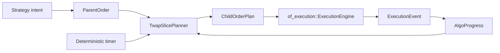

# `of_execution_algos` Reference

`of_execution_algos` is the optional execution-algorithm crate for Orderflow.
It starts with a parent/child substrate and a deterministic TWAP planner. The
crate deliberately does not own sockets, adapters, risk gates, journals, or OMS
state. Child orders generated by this crate should still be submitted through
`of_execution`.

## Boundary



The split keeps direct OMS users lightweight while giving algorithmic execution
users a dedicated crate for parent orders, child-order planning, replayable
decisions, and future TWAP/VWAP/POV/iceberg/SOR modules.

## Public Types

Identifiers reuse `of_execution_core::FixedAscii`:

- `ParentOrderId`
- `ChildOrderId`
- `AlgoIntentId`
- `AlgoInstanceId`

Lifecycle and planning types:

- `ParentOrderStatus`
- `ChildOrderStatus`
- `AlgoError`
- `ParentOrder`
- `ChildOrderPlan`
- `AlgoProgress`
- `AlgoAction`
- `AlgoDecision`
- `TwapSlicePlanner`
- `AlgoReplayEvent`
- `AlgoReplayInput`
- `AlgoReplayIdScheme`
- `AlgoReplayStep`
- `AlgoReplaySummary`
- `replay_twap_into`

## Parent Orders

`ParentOrder` captures the order ticket fields an algorithm needs before it can
release child orders:

- parent id,
- account id,
- default route id,
- strategy id,
- symbol,
- side,
- order type,
- time-in-force,
- total quantity,
- limit and stop prices,
- start and end timestamps,
- minimum and maximum child clips,
- optional participation cap in basis points,
- lifecycle status.

The constructor validates schedule and clip bounds, then validates the
underlying OMS order shape using `of_execution_core::OrderRequest::validate`.

## Child Plans

`ChildOrderPlan` is the bridge from an algo decision to the OMS. It contains:

- child id,
- parent id,
- canonical `OrderRequest`,
- due timestamp,
- child lifecycle status.

Hosts decide when to submit the child. The crate does not call
`ExecutionEngine::submit` directly because the host owns permissions, route
policy, risk context, journaling, and operational controls.

## Progress Folding

`AlgoProgress` tracks:

- target quantity,
- released quantity,
- completed quantity,
- open quantity estimate,
- rejected child count,
- terminal child count.

`AlgoProgress::on_child_released` records planned child quantity before
submission. `AlgoProgress::on_execution_event` folds canonical OMS
`ExecutionEvent` values back into parent progress. This keeps algorithm state
replayable from the same OMS event stream.

## Fixed-Capacity Decisions

`AlgoDecision` stores actions in a fixed-capacity array. This is intentional:
production algo loops should avoid hidden `Vec` growth in the live decision
path. The default capacity is `DEFAULT_ALGO_DECISION_CAPACITY`, and users can
select another capacity with the const generic parameter.

Supported actions in the first slice:

- submit child order,
- pause parent,
- complete parent,
- escalate risk/operator attention.

## TWAP Planner

`TwapSlicePlanner` is deterministic and host-clock-neutral. It takes:

- a validated parent order,
- current progress,
- caller-provided `now_ns`,
- caller-provided child id,
- caller-provided client order id,
- caller-provided receive timestamp.

It returns `Ok(None)` when no child slice is due. When a slice is due, it
returns a `ChildOrderPlan` whose `OrderRequest` can be submitted to the OMS.

TWAP quantity calculation is integer-only:

1. divide the parent time window into fixed buckets,
2. compute the cumulative quantity due for elapsed buckets,
3. subtract already released quantity,
4. cap by `max_clip`,
5. suppress non-final slices below `min_clip`,
6. never release more than remaining parent quantity.

## Example

```rust
use of_execution_algos::{
    AlgoProgress, ChildOrderId, ParentOrder, ParentOrderId, TwapSlicePlanner,
};
use of_execution_core::{
    AccountId, ClientOrderId, ExecutionSymbol, OrderPrice, OrderQty, OrderSide,
    OrderType, RouteId, StrategyId, TimeInForce,
};

let parent = ParentOrder::new(
    ParentOrderId::new("parent-1")?,
    AccountId::new("acct")?,
    RouteId::new("sim")?,
    StrategyId::new("twap")?,
    ExecutionSymbol::new("SIM", "ESZ6")?,
    OrderSide::Buy,
    OrderType::Limit,
    TimeInForce::Day,
    OrderQty::new(100)?,
    OrderPrice::new(500_000)?,
    OrderPrice(0),
    1_000,
    11_000,
    OrderQty::new(10)?,
    OrderQty::new(25)?,
    0,
)?;

let planner = TwapSlicePlanner::new(1_000);
let progress = AlgoProgress::new(parent.id(), parent.total_qty());
let child = planner
    .plan_due_slice(
        &parent,
        progress,
        1_000,
        ChildOrderId::new("child-1")?,
        ClientOrderId::new("cl-1")?,
        1_000,
    )?
    .expect("slice due");

assert_eq!(child.request().quantity, OrderQty(10));
# Ok::<(), Box<dyn std::error::Error>>(())
```

## Deterministic Replay

`replay_twap_into` runs TWAP planning over caller-provided input events and
writes replay steps into a caller-owned `Vec`.

Replay inputs are explicit:

- `AlgoReplayEvent::Timer` drives schedule evaluation,
- `AlgoReplayEvent::Execution` folds canonical OMS reports into progress,
- `AlgoReplayEvent::ParentStatus` changes parent lifecycle state.

The harness does not read wall-clock time, does not submit orders, and does not
generate random child ids. `AlgoReplayIdScheme` derives child and client ids
from deterministic prefixes plus a child counter.

```rust
use of_execution_algos::{
    replay_twap_into, AlgoReplayEvent, AlgoReplayIdScheme, AlgoReplayInput,
    ParentOrder, ParentOrderId, TwapSlicePlanner,
};
use of_execution_core::{
    AccountId, ExecutionSymbol, OrderPrice, OrderQty, OrderSide, OrderType,
    RouteId, StrategyId, TimeInForce,
};

let parent = ParentOrder::new(
    ParentOrderId::new("parent-1")?,
    AccountId::new("acct")?,
    RouteId::new("sim")?,
    StrategyId::new("twap")?,
    ExecutionSymbol::new("SIM", "ESZ6")?,
    OrderSide::Buy,
    OrderType::Limit,
    TimeInForce::Day,
    OrderQty::new(100)?,
    OrderPrice::new(500_000)?,
    OrderPrice(0),
    1_000,
    11_000,
    OrderQty::new(10)?,
    OrderQty::new(25)?,
    0,
)?;

let inputs = [
    AlgoReplayInput::new(1, AlgoReplayEvent::Timer { timestamp_ns: 1_000 }),
    AlgoReplayInput::new(2, AlgoReplayEvent::Timer { timestamp_ns: 2_000 }),
];
let mut steps = Vec::new();
let summary = replay_twap_into::<16>(
    parent,
    TwapSlicePlanner::new(1_000),
    &inputs,
    AlgoReplayIdScheme::default(),
    &mut steps,
)?;

assert_eq!(summary.submitted_children(), 2);
# Ok::<(), Box<dyn std::error::Error>>(())
```

Use `AlgoReplaySummary::deterministic_hash()` in regression tests when you want
to compare replay outputs without diffing every step.

## Compatibility

This crate is additive:

- it does not change `of_execution_core` layouts,
- it does not change `of_execution::ExecutionEngine`,
- it does not add C/Python/Java APIs yet,
- it does not force algorithm support on direct OMS users.

Bindings can expose algorithmic execution later through additive handles or
high-level wrappers after the Rust surface has stabilized.
