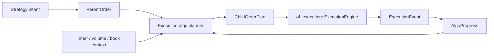

# `of_execution_algos` Reference

`of_execution_algos` is the optional execution-algorithm crate for Orderflow.
It contains a parent/child substrate plus deterministic TWAP, POV, VWAP,
iceberg, implementation-shortfall, and passive queue planning primitives. The
crate deliberately does not own sockets, adapters, risk gates, journals, or OMS
state. Child orders generated by this crate should still be submitted through
`of_execution`.

## Boundary



The split keeps direct OMS users lightweight while giving algorithmic execution
users a dedicated crate for parent orders, child-order planning, replayable
decisions, and future TWAP/VWAP/POV/iceberg/SOR modules.

## Public Types

Identifiers reuse `of_execution_core::FixedAscii`:

- `ParentOrderId`
- `ChildOrderId`
- `AlgoIntentId`
- `AlgoInstanceId`

Lifecycle and planning types:

- `ParentOrderStatus`
- `ChildOrderStatus`
- `AlgoError`
- `ParentOrder`
- `ChildOrderPlan`
- `AlgoProgress`
- `AlgoAction`
- `AlgoDecision`
- `TwapSlicePlanner`
- `AlgoReplayEvent`
- `AlgoReplayInput`
- `AlgoReplayIdScheme`
- `AlgoReplayStep`
- `AlgoReplaySummary`
- `replay_twap_into`
- `PovSlicePlanner`
- `VwapVolumeCurve`
- `VwapSlicePlanner`
- `IcebergSlicePlanner`
- `PassivePegMode`
- `PassiveQueueAction`
- `PassiveQueueContext`
- `PassiveQueueConfig`
- `PassiveQueueEstimate`
- `PassiveQueueDecision`
- `PassiveQueuePlanner`
- `ImplementationShortfallContext`
- `ImplementationShortfallConfig`
- `ImplementationShortfallEstimate`
- `ImplementationShortfallPlanner`

## Parent Orders

`ParentOrder` captures the order ticket fields an algorithm needs before it can
release child orders:

- parent id,
- account id,
- default route id,
- strategy id,
- symbol,
- side,
- order type,
- time-in-force,
- total quantity,
- limit and stop prices,
- start and end timestamps,
- minimum and maximum child clips,
- optional participation cap in basis points,
- lifecycle status.

The constructor validates schedule and clip bounds, then validates the
underlying OMS order shape using `of_execution_core::OrderRequest::validate`.

## Child Plans

`ChildOrderPlan` is the bridge from an algo decision to the OMS. It contains:

- child id,
- parent id,
- canonical `OrderRequest`,
- due timestamp,
- child lifecycle status.

Hosts decide when to submit the child. The crate does not call
`ExecutionEngine::submit` directly because the host owns permissions, route
policy, risk context, journaling, and operational controls.

## Progress Folding

`AlgoProgress` tracks:

- target quantity,
- released quantity,
- completed quantity,
- open quantity estimate,
- rejected child count,
- terminal child count.

`AlgoProgress::on_child_released` records planned child quantity before
submission. `AlgoProgress::on_execution_event` folds canonical OMS
`ExecutionEvent` values back into parent progress. This keeps algorithm state
replayable from the same OMS event stream.

## Fixed-Capacity Decisions

`AlgoDecision` stores actions in a fixed-capacity array. This is intentional:
production algo loops should avoid hidden `Vec` growth in the live decision
path. The default capacity is `DEFAULT_ALGO_DECISION_CAPACITY`, and users can
select another capacity with the const generic parameter.

Supported actions in the first slice:

- submit child order,
- pause parent,
- complete parent,
- escalate risk/operator attention.

## TWAP Planner

`TwapSlicePlanner` is deterministic and host-clock-neutral. It takes:

- a validated parent order,
- current progress,
- caller-provided `now_ns`,
- caller-provided child id,
- caller-provided client order id,
- caller-provided receive timestamp.

It returns `Ok(None)` when no child slice is due. When a slice is due, it
returns a `ChildOrderPlan` whose `OrderRequest` can be submitted to the OMS.

TWAP quantity calculation is integer-only:

1. divide the parent time window into fixed buckets,
2. compute the cumulative quantity due for elapsed buckets,
3. subtract already released quantity,
4. cap by `max_clip`,
5. suppress non-final slices below `min_clip`,
6. never release more than remaining parent quantity.

## Example

```rust
use of_execution_algos::{
    AlgoProgress, ChildOrderId, ParentOrder, ParentOrderId, TwapSlicePlanner,
};
use of_execution_core::{
    AccountId, ClientOrderId, ExecutionSymbol, OrderPrice, OrderQty, OrderSide,
    OrderType, RouteId, StrategyId, TimeInForce,
};

let parent = ParentOrder::new(
    ParentOrderId::new("parent-1")?,
    AccountId::new("acct")?,
    RouteId::new("sim")?,
    StrategyId::new("twap")?,
    ExecutionSymbol::new("SIM", "ESZ6")?,
    OrderSide::Buy,
    OrderType::Limit,
    TimeInForce::Day,
    OrderQty::new(100)?,
    OrderPrice::new(500_000)?,
    OrderPrice(0),
    1_000,
    11_000,
    OrderQty::new(10)?,
    OrderQty::new(25)?,
    0,
)?;

let planner = TwapSlicePlanner::new(1_000);
let progress = AlgoProgress::new(parent.id(), parent.total_qty());
let child = planner
    .plan_due_slice(
        &parent,
        progress,
        1_000,
        ChildOrderId::new("child-1")?,
        ClientOrderId::new("cl-1")?,
        1_000,
    )?
    .expect("slice due");

assert_eq!(child.request().quantity, OrderQty(10));
# Ok::<(), Box<dyn std::error::Error>>(())
```

## Deterministic Replay

`replay_twap_into` runs TWAP planning over caller-provided input events and
writes replay steps into a caller-owned `Vec`.

Replay inputs are explicit:

- `AlgoReplayEvent::Timer` drives schedule evaluation,
- `AlgoReplayEvent::Execution` folds canonical OMS reports into progress,
- `AlgoReplayEvent::ParentStatus` changes parent lifecycle state.

The harness does not read wall-clock time, does not submit orders, and does not
generate random child ids. `AlgoReplayIdScheme` derives child and client ids
from deterministic prefixes plus a child counter.

```rust
use of_execution_algos::{
    replay_twap_into, AlgoReplayEvent, AlgoReplayIdScheme, AlgoReplayInput,
    ParentOrder, ParentOrderId, TwapSlicePlanner,
};
use of_execution_core::{
    AccountId, ExecutionSymbol, OrderPrice, OrderQty, OrderSide, OrderType,
    RouteId, StrategyId, TimeInForce,
};

let parent = ParentOrder::new(
    ParentOrderId::new("parent-1")?,
    AccountId::new("acct")?,
    RouteId::new("sim")?,
    StrategyId::new("twap")?,
    ExecutionSymbol::new("SIM", "ESZ6")?,
    OrderSide::Buy,
    OrderType::Limit,
    TimeInForce::Day,
    OrderQty::new(100)?,
    OrderPrice::new(500_000)?,
    OrderPrice(0),
    1_000,
    11_000,
    OrderQty::new(10)?,
    OrderQty::new(25)?,
    0,
)?;

let inputs = [
    AlgoReplayInput::new(1, AlgoReplayEvent::Timer { timestamp_ns: 1_000 }),
    AlgoReplayInput::new(2, AlgoReplayEvent::Timer { timestamp_ns: 2_000 }),
];
let mut steps = Vec::new();
let summary = replay_twap_into::<16>(
    parent,
    TwapSlicePlanner::new(1_000),
    &inputs,
    AlgoReplayIdScheme::default(),
    &mut steps,
)?;

assert_eq!(summary.submitted_children(), 2);
# Ok::<(), Box<dyn std::error::Error>>(())
```

Use `AlgoReplaySummary::deterministic_hash()` in regression tests when you want
to compare replay outputs without diffing every step.

## POV Planner

`PovSlicePlanner` implements the first percentage-of-volume planner. It uses
cumulative observed market volume and explicit participation limits:

- target participation in basis points,
- maximum participation in basis points,
- optional parent participation cap,
- parent min/max child clips,
- caller-provided child id,
- caller-provided client order id,
- caller-provided timestamps.

POV is volume-responsive rather than time-scheduled. When observed market
volume increases, the desired released quantity increases. If the due quantity
is below the parent minimum clip, the planner waits unless the parent is in a
final-slice condition.

Hosts should exclude the algorithm's own fills from observed market volume when
possible. If that is not possible, use conservative participation rates because
self-volume feedback can make participation algos too aggressive.

```rust
use of_execution_algos::{
    AlgoProgress, ChildOrderId, ParentOrder, ParentOrderId, PovSlicePlanner,
};
use of_execution_core::{
    AccountId, ClientOrderId, ExecutionSymbol, OrderPrice, OrderQty, OrderSide,
    OrderType, RouteId, StrategyId, TimeInForce,
};

let parent = ParentOrder::new(
    ParentOrderId::new("parent-1")?,
    AccountId::new("acct")?,
    RouteId::new("sim")?,
    StrategyId::new("pov")?,
    ExecutionSymbol::new("SIM", "ESZ6")?,
    OrderSide::Buy,
    OrderType::Limit,
    TimeInForce::Day,
    OrderQty::new(100)?,
    OrderPrice::new(500_000)?,
    OrderPrice(0),
    1_000,
    11_000,
    OrderQty::new(10)?,
    OrderQty::new(25)?,
    1_500,
)?;

let planner = PovSlicePlanner::new(1_000, 1_500);
let progress = AlgoProgress::new(parent.id(), parent.total_qty());
let child = planner
    .plan_volume_slice(
        &parent,
        progress,
        OrderQty::new(1_000)?,
        2_000,
        ChildOrderId::new("child-1")?,
        ClientOrderId::new("cl-1")?,
        2_000,
    )?
    .expect("slice due");

assert_eq!(child.request().quantity, OrderQty(25));
# Ok::<(), Box<dyn std::error::Error>>(())
```

## VWAP Planner

`VwapSlicePlanner` follows a borrowed cumulative volume profile. The profile is
pre-cumulative so live planning can read one bucket and avoid summing a full
curve on every timer tick.

`VwapVolumeCurve` requires:

- non-empty cumulative weights,
- positive final total weight,
- non-decreasing cumulative values,
- positive bucket interval.

The planner maps elapsed time to a profile bucket, computes the target parent
quantity from cumulative weight divided by total weight, subtracts released
quantity, and applies the same min/max clip rules used by TWAP and POV.

```rust
use of_execution_algos::{
    AlgoProgress, ChildOrderId, ParentOrder, ParentOrderId, VwapSlicePlanner,
    VwapVolumeCurve,
};
use of_execution_core::{
    AccountId, ClientOrderId, ExecutionSymbol, OrderPrice, OrderQty, OrderSide,
    OrderType, RouteId, StrategyId, TimeInForce,
};

let curve = VwapVolumeCurve::new(1_000, 1_000, &[10, 30, 60, 100])?;
let planner = VwapSlicePlanner::new(curve);
let parent = ParentOrder::new(
    ParentOrderId::new("parent-1")?,
    AccountId::new("acct")?,
    RouteId::new("sim")?,
    StrategyId::new("vwap")?,
    ExecutionSymbol::new("SIM", "ESZ6")?,
    OrderSide::Buy,
    OrderType::Limit,
    TimeInForce::Day,
    OrderQty::new(100)?,
    OrderPrice::new(500_000)?,
    OrderPrice(0),
    1_000,
    11_000,
    OrderQty::new(10)?,
    OrderQty::new(25)?,
    0,
)?;

let progress = AlgoProgress::new(parent.id(), parent.total_qty());
let child = planner
    .plan_curve_slice(
        &parent,
        progress,
        2_000,
        ChildOrderId::new("child-1")?,
        ClientOrderId::new("cl-1")?,
        2_000,
    )?
    .expect("slice due");

assert_eq!(child.request().quantity, OrderQty(25));
# Ok::<(), Box<dyn std::error::Error>>(())
```

## Iceberg Planner

`IcebergSlicePlanner` is a synthetic reserve/iceberg replenishment helper. It
does not assume a venue-native reserve order type. Instead, it plans another
canonical child order when the parent has remaining unreleased quantity and the
current open displayed quantity is at or below the replenish threshold.

The host decides whether to:

- submit the child as a normal synthetic slice,
- map it to venue-native reserve/iceberg tags,
- wait for a refresh delay,
- add randomized display sizing in a future policy layer.

```rust
use of_execution_algos::{
    AlgoProgress, ChildOrderId, IcebergSlicePlanner, ParentOrder, ParentOrderId,
};
use of_execution_core::{
    AccountId, ClientOrderId, ExecutionSymbol, OrderPrice, OrderQty, OrderSide,
    OrderType, RouteId, StrategyId, TimeInForce,
};

let parent = ParentOrder::new(
    ParentOrderId::new("parent-1")?,
    AccountId::new("acct")?,
    RouteId::new("sim")?,
    StrategyId::new("iceberg")?,
    ExecutionSymbol::new("SIM", "ESZ6")?,
    OrderSide::Buy,
    OrderType::Limit,
    TimeInForce::Day,
    OrderQty::new(100)?,
    OrderPrice::new(500_000)?,
    OrderPrice(0),
    1_000,
    11_000,
    OrderQty::new(10)?,
    OrderQty::new(25)?,
    0,
)?;

let planner = IcebergSlicePlanner::new(OrderQty::new(20)?, OrderQty(0));
let progress = AlgoProgress::new(parent.id(), parent.total_qty());
let child = planner
    .plan_replenishment(
        &parent,
        progress,
        1_000,
        ChildOrderId::new("child-1")?,
        ClientOrderId::new("cl-1")?,
        1_000,
    )?
    .expect("slice due");

assert_eq!(child.request().quantity, OrderQty(20));
# Ok::<(), Box<dyn std::error::Error>>(())
```

## Implementation Shortfall Planner

`ImplementationShortfallPlanner` is a deterministic first slice of
arrival-price execution. It does not solve a full stochastic control problem on
the hot path. Instead, it computes an explainable urgency-adjusted release
target from:

- elapsed parent interval,
- arrival price,
- current reference price,
- adverse move from arrival by side,
- volatility estimate,
- spread estimate,
- temporary impact estimate,
- configured urgency and weights.

Higher volatility, spread, and adverse movement increase urgency. Higher
temporary impact reduces urgency so the planner can wait when immediate impact
is too expensive. The resulting cumulative target is capped, compared with
already released quantity, and bounded by the parent min/max clip rules.

```rust
use of_execution_algos::{
    AlgoProgress, ChildOrderId, ImplementationShortfallConfig,
    ImplementationShortfallContext, ImplementationShortfallPlanner, ParentOrder,
    ParentOrderId,
};
use of_execution_core::{
    AccountId, ClientOrderId, ExecutionSymbol, OrderPrice, OrderQty, OrderSide,
    OrderType, RouteId, StrategyId, TimeInForce,
};

let parent = ParentOrder::new(
    ParentOrderId::new("parent-1")?,
    AccountId::new("acct")?,
    RouteId::new("sim")?,
    StrategyId::new("is")?,
    ExecutionSymbol::new("SIM", "ESZ6")?,
    OrderSide::Buy,
    OrderType::Limit,
    TimeInForce::Day,
    OrderQty::new(100)?,
    OrderPrice::new(500_000)?,
    OrderPrice(0),
    1_000,
    11_000,
    OrderQty::new(10)?,
    OrderQty::new(25)?,
    0,
)?;

let planner = ImplementationShortfallPlanner::new(
    ImplementationShortfallConfig::default(),
);
let context = ImplementationShortfallContext::new(
    OrderPrice::new(500_000)?,
    OrderPrice::new(510_000)?,
    200,
    20,
    10,
)?;
let progress = AlgoProgress::new(parent.id(), parent.total_qty());
let estimate = planner.estimate(&parent, progress, 1_000, context)?;
let child = planner
    .plan_shortfall_slice(
        &parent,
        progress,
        1_000,
        context,
        ChildOrderId::new("child-1")?,
        ClientOrderId::new("cl-1")?,
        1_000,
    )?
    .expect("slice due");

assert!(estimate.urgency_bps() > 0);
assert!(child.request().quantity.0 >= parent.min_clip().0);
# Ok::<(), Box<dyn std::error::Error>>(())
```

## Passive Queue Planner

`PassiveQueuePlanner` is a deterministic passive peg and queue-position helper.
It consumes host-owned order-book context rather than subscribing to feeds or
assuming a venue-native pegged-order implementation.

Inputs include:

- best bid and best ask,
- tick size in normalized price units,
- estimated quantity ahead at the candidate queue,
- expected short-horizon contra-side take volume,
- adverse-selection estimate in basis points,
- parent elapsed time,
- parent min/max clips and leaves.

The planner chooses one of:

- `Wait`,
- `JoinQueue`,
- `ImprovePrice`,
- `CrossSpread` when explicitly enabled and the parent is late.

This first slice deliberately avoids stochastic queue modeling in the live
path. Hosts can calibrate fill-probability and adverse-selection inputs from
venue-specific research, simulation, or production telemetry, then pass the
current integer estimates into the planner.

```rust
use of_execution_algos::{
    AlgoProgress, ChildOrderId, ParentOrder, ParentOrderId, PassivePegMode,
    PassiveQueueConfig, PassiveQueueContext, PassiveQueuePlanner,
};
use of_execution_core::{
    AccountId, ClientOrderId, ExecutionSymbol, OrderPrice, OrderQty, OrderSide,
    OrderType, RouteId, StrategyId, TimeInForce,
};

let parent = ParentOrder::new(
    ParentOrderId::new("parent-1")?,
    AccountId::new("acct")?,
    RouteId::new("sim")?,
    StrategyId::new("passive")?,
    ExecutionSymbol::new("SIM", "ESZ6")?,
    OrderSide::Buy,
    OrderType::Limit,
    TimeInForce::Day,
    OrderQty::new(100)?,
    OrderPrice::new(500_000)?,
    OrderPrice(0),
    1_000,
    11_000,
    OrderQty::new(10)?,
    OrderQty::new(25)?,
    0,
)?;

let config = PassiveQueueConfig::new(PassivePegMode::SameSide, OrderPrice(25))?
    .with_thresholds(2_500, 250, 1_500)?;
let planner = PassiveQueuePlanner::new(config);
let context = PassiveQueueContext::new(
    OrderPrice::new(499_975)?,
    OrderPrice::new(500_025)?,
    OrderQty::new(25)?,
    OrderQty::new(100)?,
    10,
)?;
let progress = AlgoProgress::new(parent.id(), parent.total_qty());
let decision = planner.plan_passive_slice(
    &parent,
    progress,
    2_000,
    context,
    ChildOrderId::new("child-1")?,
    ClientOrderId::new("cl-1")?,
    2_000,
)?;

assert!(decision.action().releases_child());
assert!(decision.child().is_some());
# Ok::<(), Box<dyn std::error::Error>>(())
```

## Compatibility

This crate is additive:

- it does not change `of_execution_core` layouts,
- it does not change `of_execution::ExecutionEngine`,
- it does not add C/Python/Java APIs yet,
- it does not force algorithm support on direct OMS users.

Bindings can expose algorithmic execution later through additive handles or
high-level wrappers after the Rust surface has stabilized.
