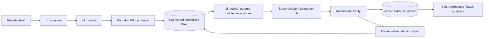
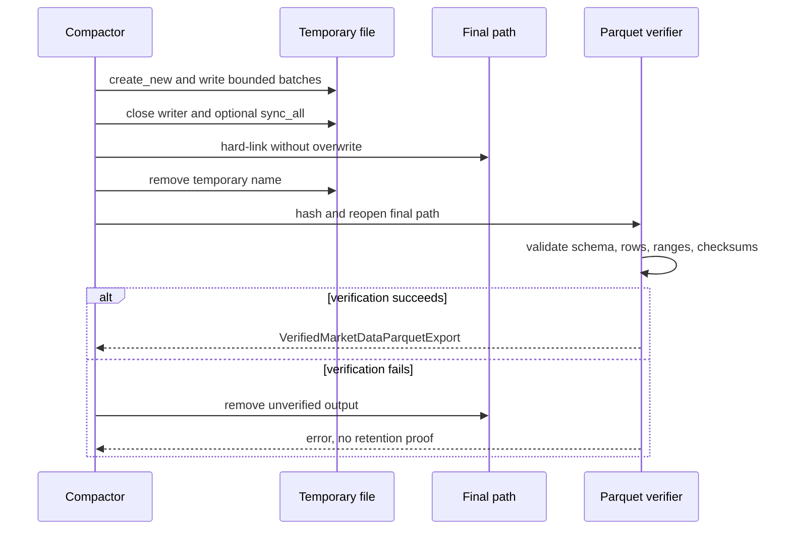

# `of_persist_parquet` Reference

`of_persist_parquet` is Orderflow's optional, verified Apache Parquet cold
exporter. It converts normalized `of_persist` WAL records into query-friendly
columnar files without placing Arrow, Parquet, compression, or cryptographic
hashing dependencies in the live capture crate.

The crate starts at version `0.1.0`. It is additive: existing JSONL, WAL,
runtime, C ABI, Python, and Java APIs are unchanged.

## Placement In The Data Lifecycle



The live path ends at bounded WAL admission. Parquet encoding is synchronous,
CPU-intensive control-plane work and belongs on a dedicated maintenance worker
or external compactor. Do not run it on an adapter poll, ingest, signal, or
execution thread.

## Public Types

### `MarketDataParquetExportConfig`

Controls the export root and bounded writer resources:

| Setting | Default | Meaning |
| --- | ---: | --- |
| `root` | required | Dataset root directory |
| `compression` | Zstandard | Parquet column compression |
| `batch_rows` | `32_768` | Maximum records materialized in one Arrow batch |
| `row_group_rows` | `131_072` | Maximum rows in one Parquet row group |
| `sync_on_write` | `true` | Synchronize temporary bytes before publication |

`batch_rows` and `row_group_rows` must be non-zero, and `batch_rows` cannot
exceed `row_group_rows`. These are explicit memory and file-layout controls,
not performance hints.

### `MarketDataParquetCompression`

- `Uncompressed` avoids codec CPU cost but increases I/O and storage.
- `Snappy` favors broad interoperability and fast decompression.
- `Zstd` is the default for stronger storage reduction.

Keep options consistent across files in one logical dataset. Benchmark with
representative payload sizes and downstream readers before changing production
defaults.

### `MarketDataParquetPartitionKey`

Identifies `date`, `venue`, `symbol`, and `stream`. The exporter creates this
Hive-style directory hierarchy:

```text
<root>/date=2026-08-12/venue=CME/symbol=ESM6/stream=market-data/
  wal-00000000000000000001-00000000000000100000.parquet
```

The host supplies the date because futures sessions and local operational days
do not always align with UTC midnight. Date validation rejects impossible
calendar dates. Partition components reject traversal markers, separators,
control characters, `=`, and reserved temporary suffixes.

### `MarketDataParquetSourceMetadata`

Stores `source_id`, `adapter_id`, and `session_id` in every row. Use stable,
non-secret identifiers that let operators correlate a dataset with capture
configuration and incident evidence. Never place credentials in these fields.

### `MarketDataDerivedSnapshotRef`

Optionally joins caller-serialized analytics snapshots to exact WAL sequences.
Snapshots must:

- have a non-zero caller-owned schema id;
- be strictly ordered by WAL sequence;
- fall inside the exported sequence range; and
- match an actual exported record.

The exporter uses a linear merge, so joining ordered snapshots does not require
a hash map or per-row lookup allocation.

### `VerifiedMarketDataParquetExport`

This proof is returned only after the final file is reopened and validated. It
contains partition metadata, schema version, SHA-256 digest, row-group count,
quality/derived row counts, and source provenance.

`retention_input(created_ns, hot_bytes)` is deliberately defined on the
verified proof. It produces an `of_persist::MarketDataRetentionInput` with
`cold_export_verified = true`; an unverified path or handwritten manifest
cannot accidentally authorize hot-WAL deletion through this API.

## Export APIs

### `export_records`

Exports an already decoded, strictly ordered record slice. This is the base API
for custom compactors and test fixtures.

### `export_wal`

Applies `MarketDataWalReplayFilter` to a single-file WAL, then exports the
selected records.

### `export_segmented_wal`

Applies the same filter to `SegmentedMarketDataWal`. Prefer sealed,
sequence-bounded ranges. The convenience replay bridges materialize the
selected range before Arrow encoding, so rotating and exporting bounded
segments is required for predictable compactor memory at large scale.

### `verify_export`

Revalidates an existing proof by checking:

- byte count, whole-file FNV checksum, and SHA-256 digest;
- exact Arrow schema and export schema version;
- Parquet row-group count;
- row count and first/last WAL sequence;
- constant partition and source columns;
- quality-flagged and derived-snapshot row counts; and
- every payload's stored FNV checksum.

Verification failure never yields retention evidence.

## Schema Version 1

| Column | Arrow type | Null | Contract |
| --- | --- | --- | --- |
| `schema_version` | `UInt16` | no | Cold schema version (`1`) |
| `partition_date` | `Utf8` | no | Host-selected session/UTC date |
| `venue` | `Utf8` | no | Canonical venue |
| `symbol` | `Utf8` | no | Canonical symbol |
| `stream` | `Utf8` | no | Logical source stream |
| `source_id` | `Utf8` | no | Deployment source identity |
| `adapter_id` | `Utf8` | no | Adapter/profile identity |
| `session_id` | `Utf8` | no | Capture session identity |
| `record_kind` | `UInt16` | no | Stable WAL record-kind number |
| `record_kind_name` | `Utf8` | no | Human-readable kind name |
| `wal_sequence` | `UInt64` | no | Global persisted ordering key |
| `provider_sequence` | `UInt64` | no | Provider ordering key |
| `event_sequence` | `UInt64` | no | Canonical event ordering key |
| `ts_exchange_ns` | `UInt64` | no | Exchange event timestamp |
| `ts_recv_ns` | `UInt64` | no | Host receive timestamp |
| `quality_flags` | `UInt32` | no | Effective live quality bits |
| `payload` | `Binary` | no | Original decoded WAL payload |
| `payload_checksum` | `UInt32` | no | Per-payload FNV-1a checksum |
| `derived_schema_id` | `UInt32` | yes | Caller-defined snapshot schema |
| `derived_payload` | `Binary` | yes | Caller-defined snapshot bytes |

Normalized `OFNE` trade/book payloads are strictly decoded during export.
Their venue/symbol must match the target partition, and their effective quality
flags become the `quality_flags` column. Malformed or cross-partition records
fail the operation instead of producing misleading research data.

## Publication Protocol



The hard-link publication step is same-directory and refuses existing final
paths. It prevents an export retry from replacing an already verified range.
Filesystems or object stores without equivalent atomic semantics require a
host-level staging and publication protocol.

## End-To-End Example

```rust,no_run
use of_persist::{
    MarketDataWal, MarketDataWalConfig, MarketDataWalReplayFilter,
    MarketDataWalSequence,
};
use of_persist_parquet::{
    MarketDataParquetCompression, MarketDataParquetExportConfig,
    MarketDataParquetPartitionKey, MarketDataParquetSourceMetadata,
    MarketDataParquetWriter,
};

let wal = MarketDataWal::open(MarketDataWalConfig::new("data/live.ofmw"))?;
let exporter = MarketDataParquetWriter::open(
    MarketDataParquetExportConfig::new("data/cold")
        .with_compression(MarketDataParquetCompression::Zstd)
        .with_batch_rows(32_768)
        .with_row_group_rows(131_072)
        .with_sync_on_write(true),
)?;
let partition = MarketDataParquetPartitionKey::new(
    "2026-08-12",
    "CME",
    "ESM6",
    "market-data",
);
let source = MarketDataParquetSourceMetadata::new(
    "primary-feed",
    "cqg-webapi",
    "session-20260812",
);
let filter = MarketDataWalReplayFilter::new()
    .with_sequence_range(
        Some(MarketDataWalSequence(1)),
        Some(MarketDataWalSequence(100_000)),
    );

let proof = exporter.export_wal(&partition, &source, &wal, filter, &[])?;
exporter.verify_export(&proof)?;

let retention = proof.retention_input(1_754_953_200_000_000_000, 512 << 20);
assert!(retention.cold_export_verified);
# Ok::<(), of_persist_parquet::MarketDataParquetError>(())
```

## Production Runbook

1. Seal or select an immutable, sequence-bounded WAL range.
2. Export on a dedicated compactor worker with fixed batch/row-group limits.
3. Persist the returned proof beside the dataset catalog or object metadata.
4. Upload the verified file with a no-overwrite key policy.
5. Recompute and compare SHA-256 after upload.
6. Confirm checkpoint and incident-window dependencies through
   `plan_market_data_retention`.
7. Delete hot WAL only when the conservative planner returns
   `DeleteHotWal`.
8. Periodically call `verify_export` or an equivalent object-store verifier as
   part of integrity scrubbing.

The crate does not own scheduling, object-store credentials, catalog updates,
distributed locks, or encryption keys. Those remain deployment concerns so
the library stays portable and does not silently choose operational policy.

## Compatibility And Dependency Boundary

- Existing `of_persist` methods and serialized formats are unchanged.
- Arrow/Parquet dependencies compile only for users selecting this crate.
- The crate has no C, Python, or Java surface in `0.1.0`; those users can keep
  capture latency isolated by running a Rust compactor process over WAL files.
- Future incompatible cold schema changes require a new schema version and a
  migration/reader policy; schema version `1` is never reinterpreted in place.

See the [Apache Arrow Rust Parquet writer documentation](https://arrow.apache.org/rust/parquet/arrow/arrow_writer/struct.ArrowWriter.html)
and the [Apache Arrow Rust implementation repository](https://github.com/apache/arrow-rs)
for upstream writer and format behavior.
