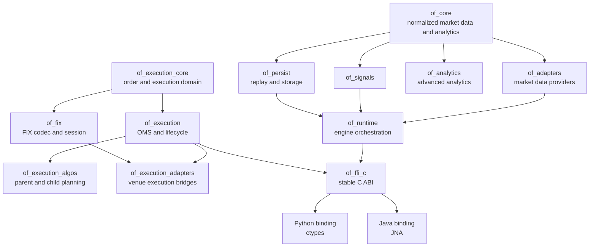
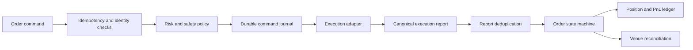
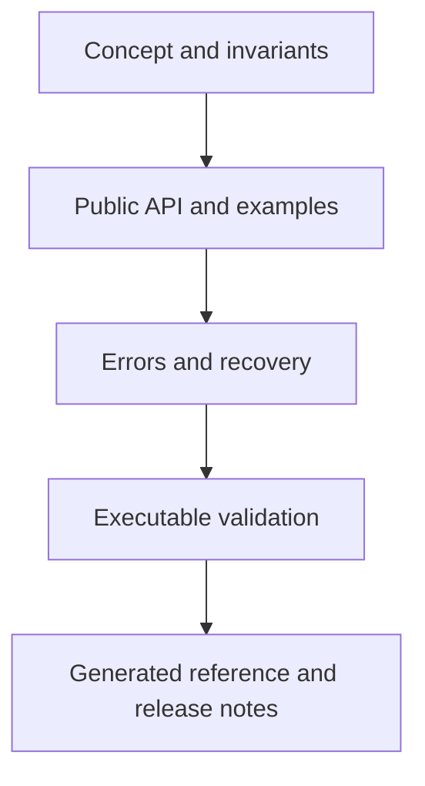

# Contributor Guide

This guide is the working contract for contributing to Orderflow. It explains
how to understand the repository, choose the correct ownership boundary, make
compatible changes, validate them, and document the resulting behavior. It is
written for contributors working on the Rust crates, native ABI, language
bindings, adapters, persistence, OMS, dashboard, and documentation portal.

The central rule is simple: a change is incomplete until its implementation,
public contract, failure behavior, tests, and documentation agree.

## 1. Before You Change Code

### 1.1 Establish the repository state

Start from the workspace root and record the branch and working-tree state:

```bash
pwd
git status --short --branch
git log -5 --oneline --decorate
```

Do not discard existing user changes. If the working tree is not clean, identify
which files are relevant to the requested change and work with those changes.
Do not use `git reset --hard`, `git checkout --`, or broad cleanup commands to
make a task easier.

Read the tracked contribution instructions before editing:

```text
CONTRIBUTING.md              public coding standards and repository rules
docs/handbook/README.md      handbook navigation and audience
docs/contributors/README.md  documentation workflow and source-of-truth rules
```

`CONTRIBUTING.md` is the public, versioned source for coding style, API
compatibility, testing, documentation, security, performance, and review rules.
Any local maintainer or agent instructions are supplemental and must not be
required for an external contributor to understand or validate a change.

### 1.2 Classify the change

Classify the requested work before selecting files. The classification predicts
the compatibility surface and the validation required.

| Change | Primary owner | Required evidence |
| --- | --- | --- |
| Normalized trade, book, or analytics behavior | `of_core` or `of_analytics` | Deterministic unit tests, numeric edge cases, API docs |
| Signal behavior | `of_signals` | Quality-gate tests, transition tests, explanation docs |
| Market-data provider | `of_adapters` | Provider conformance, reconnect/sequence tests, capability docs |
| Storage or replay | `of_persist` or `of_persist_parquet` | Schema/version tests, round-trip tests, recovery semantics |
| Runtime orchestration | `of_runtime` | Lifecycle, health, backpressure, and integration tests |
| Order or execution semantics | `of_execution_core` or `of_execution` | State-machine, risk, idempotency, recovery, and replay tests |
| Execution algorithm | `of_execution_algos` | Allocation-free planning tests and deterministic replay |
| FIX protocol/session behavior | `of_fix` | Codec/session conformance and malformed-frame tests |
| Venue execution bridge | `of_execution_adapters` | Adapter contract, certification scenarios, recovery tests |
| C ABI | `of_ffi_c` | Header, manifest, export, ABI, and native integration tests |
| Python or Java facade | `bindings/python` or `bindings/java` | Binding parity, lifecycle, error, and smoke tests |
| Dashboard or operational endpoint | `dashboard` | Endpoint, replay, security, and smoke tests |
| Documentation or generated inventory | `docs`, `tools` | Generator checks and strict MkDocs build |

If a change appears to belong in several crates, identify the smallest stable
domain contract first. Keep provider protocol details in adapters, execution
state in execution crates, and presentation or binding concerns at the edge.

### 1.3 Find the source of truth

Use the [source-of-truth map](../knowledge-system/source-of-truth.md) before
editing a copied reference. In general:

- Rust types, methods, invariants, and algorithms are authoritative in the
  owning crate source.
- C symbols and ABI layouts are authoritative in the C header, API manifest,
  and `of_ffi_c` implementation together.
- Python and Java low-level signatures are generated or synchronized from the
  C surface; high-level behavior belongs in their wrapper APIs.
- Generated inventories must be regenerated with their tools.
- Handbook explanations are authoritative for concepts, lifecycle, examples,
  and operational behavior, but not for exact signatures.

Never fix a generated file by hand when the source or generator is wrong.

## 2. Repository Map

The workspace is intentionally layered. Dependencies point from stable domain
contracts toward integrations and presentation surfaces.



### 2.1 Crate responsibilities

| Crate | Responsibility | It must not own |
| --- | --- | --- |
| `of_core` | Provider-neutral symbols, sides, book/trade events, accumulator state, snapshots, and quality flags | Provider SDKs, sockets, persistence, order submission |
| `of_analytics` | Optional advanced market microstructure and TCA models | Runtime ownership, sockets, OMS state, or persistence |
| `of_signals` | Signal trait, built-in signals, confidence, and quality gating | Provider-specific decoding or order routing |
| `of_adapters` | Market-data adapter contract and provider normalization | Strategy logic, persistence policy, or execution OMS state |
| `of_persist` | Normalized event storage, replay, WAL primitives, retention, and recovery contracts | Live provider connections or UI state |
| `of_persist_parquet` | Columnar cold export and verified readback | Hot-path event ownership or live polling |
| `of_runtime` | Lifecycle, subscriptions, polling, supervision, snapshots, and metrics | Provider wire formats or binding-specific behavior |
| `of_execution_core` | Integer-safe order, report, risk, state-machine, and WAL frame primitives | Venue protocols and file I/O |
| `of_execution` | OMS routing, journaling, reconciliation, positions, concurrency, and recovery | Provider wire encoding and language-specific APIs |
| `of_execution_algos` | Deterministic parent/child planners, risk, simulation, replay, and TCA | Venue sessions, random behavior, and hidden I/O |
| `of_fix` | FIX tags, framing, codecs, session state, timers, and profiles | OMS ownership and venue-specific business policy |
| `of_execution_adapters` | Maps canonical OMS requests/reports to execution venues and certification harnesses | Generic FIX definitions already owned by `of_fix` |
| `of_ffi_c` | Stable C ABI, opaque handles, buffers, callbacks, and error codes | Rust implementation details exposed as ABI |

### 2.2 Supporting directories

- `bindings/python` contains the Python package. `_ffi.py` is the low-level
  ctypes layer; `api.py` is the user-facing lifecycle and convenience layer.
- `bindings/java` contains the JNA interface and `AutoCloseable` engine wrapper.
- `dashboard` contains the local operational UI and replay presentation.
- `examples` contains executable usage paths and integration-oriented examples.
- `tools` contains validation, inventory generation, smoke tests, release checks,
  and documentation maintenance scripts.
- `docs/handbook` explains concepts and workflows; `docs/reference` contains
  generated crate-level indexes; `docs/bindings` contains binding audits.

## 3. Compatibility Is a Design Constraint

Orderflow is an open-source library consumed by developers. Existing users may
depend on Rust names and signatures, C symbols and struct layouts, Python and
Java methods, serialized records, feature flags, environment variables, and
operational defaults.

### 3.1 Additive change rules

Prefer additions that preserve old callers:

- add a new Rust method instead of changing an existing method's parameters;
- add a new C function instead of changing an existing function signature;
- append new ABI declarations and error values without reordering old values;
- add an optional feature rather than changing the default feature behavior;
- add a new serialized field only when old readers can ignore it safely;
- add a new binding method while preserving existing names and exceptions;
- introduce a new configuration type or constructor alongside the old one.

Do not silently change the meaning of an existing field, enum discriminant,
error code, default, serialized key, environment variable, or callback rule.

### 3.2 Compatibility review checklist

Before opening a change, inspect:

```bash
cargo fmt --all -- --check
cargo clippy --workspace --all-targets --all-features -- -D warnings
cargo test --workspace --all-features
cargo semver-checks check-release -p <crate>
python3 tools/check_api_manifest.py
python3 tools/check_binding_parity.py
```

For a public change, also ask:

1. Does a previous source call still compile?
2. Does an old C binary still link to every old symbol?
3. Does the C header preserve every `repr(C)` layout and declaration order?
4. Does an old Python or Java caller receive the same success/error behavior?
5. Can old persisted data still be read, or is migration explicit?
6. Does the change alter allocation, blocking, ordering, or thread guarantees?

## 4. Rust Development Standards

### 4.1 Public API documentation

Every public item needs rustdoc that explains meaning, not merely its name.
Document:

- what the type represents and where it sits in the lifecycle;
- every public field, including units, normalization, defaults, and sentinel
  values;
- enum variants and their transition or wire meaning;
- method inputs, outputs, mutation, allocation, and failure conditions;
- ownership, borrowing, thread-safety, and blocking behavior;
- deterministic ordering and sequence requirements;
- examples for meaningful construction and use.

Use complete sentences and present tense. For fallible methods, include
`# Errors`; for unsafe or FFI-facing methods, include `# Safety`; for bounded
or latency-sensitive operations, explain the hot-path contract.

### 4.2 Numeric and temporal correctness

Market prices and quantities use integer-normalized representations in the
core. Do not introduce floating-point state into an accumulator, order state
machine, risk gate, or execution planner merely for convenience. If a
calculation requires a ratio or basis-point value:

- state the scale and denominator;
- define rounding and overflow behavior;
- use checked or explicitly bounded arithmetic;
- test zero, negative, maximum, and insufficient-denominator cases;
- preserve the caller's tick-size and quantity-unit contract.

Timestamps must retain their source meaning. Keep exchange time and receive
time distinct, use nanosecond units where the API specifies them, and never
replace a missing exchange timestamp with a receive timestamp without marking
the quality consequence.

### 4.3 Hot-path discipline

The live path must be predictable. Before adding code to a poll, ingest,
accumulator, risk, state-transition, or planner method, determine whether it:

- allocates or grows a collection;
- takes a lock or may block;
- performs file, network, clock, logging, or environment I/O;
- performs unbounded work proportional to history or book depth;
- changes cache locality or introduces a hidden clone;
- can overflow or panic on provider-controlled input.

Move serialization, checkpoint writes, metrics export, reconciliation, and
human-readable diagnostics to explicit control-plane operations. Preallocate
bounded buffers where the API permits it. Use criterion or the repository's
performance harness when a change affects a measured path.

## 5. Adding or Changing Market-Data Adapters

An adapter translates provider behavior into the normalized domain. It should
not leak provider SDK types beyond the adapter boundary.

### 5.1 Adapter implementation sequence

1. Identify provider capabilities: trades, book actions, depth, sequence,
   timestamps, subscriptions, reconnect, authentication, and rate limits.
2. Add an opt-in Cargo feature. Keep the default build provider-neutral.
3. Implement the existing adapter trait and its lifecycle semantics.
4. Normalize all payloads into `RawEvent::Trade` or `RawEvent::Book`.
5. Preserve provider sequence and timestamps; mark gaps, stale data, clock
   skew, truncation, or out-of-order events using quality flags.
6. Define reconnect and resubscribe behavior, including duplicate suppression.
7. Report health transitions with stable sequence numbers.
8. Add provider conformance tests and documentation of unsupported capabilities.

### 5.2 Adapter invariants

- `poll` must be bounded by the caller's event buffer and return the number of
  events actually emitted.
- A disconnected adapter must return its documented error rather than silently
  synthesizing live data.
- Subscription and unsubscription must be deterministic and idempotent where
  the trait promises it.
- Provider-native errors stay at the adapter boundary and map to stable adapter
  errors or health state.
- Sequence policy must be explicit: preserve, reject, flag, or reorder. Do not
  silently reorder events because it changes replay semantics.
- Mock or synthesized data must be clearly marked and never presented as a
  production provider implementation.

### 5.3 Adapter test matrix

Test at least:

- connect, disconnect, reconnect, and repeated reconnect failure;
- subscribe before connect, duplicate subscribe, and unsubscribe of unknown;
- empty poll, one event, burst, provider error, and bounded output capacity;
- sequence gap, duplicate, out-of-order, stale timestamp, and clock skew;
- malformed payload and provider rate-limit response;
- health transition and `health_seq` behavior;
- session reset and resubscription after reconnect.

Run provider-specific tests with the feature enabled:

```bash
cargo test -p of_adapters --features rithmic
cargo test -p of_adapters --features cqg
cargo test -p of_adapters --features "cqg cqg_proto"
cargo test -p of_adapters --features binance
python3 tools/provider_conformance.py --help
```

## 6. Analytics, Signals, and Replay

### 6.1 Analytics

Analytics should consume normalized data and return typed, deterministic
results. Keep advanced or expensive modules behind opt-in features or in
`of_analytics` so users of the basic accumulator do not pay unnecessary compile
time or dependency cost.

For each analytic feature, document:

- input event types and required ordering;
- units, windows, sample requirements, and reset behavior;
- empty or under-sampled output;
- integer scaling and rounding;
- quality flags that invalidate or degrade a result;
- allocation and ownership behavior;
- whether the result is suitable for live decisions, research, or both.

### 6.2 Signals

Signals consume analytics snapshots rather than provider payloads. A signal must
define its state machine, confidence calculation, quality gates, unknown state,
and reset behavior. A degraded or incomplete feed should fail closed according
to the signal policy, not produce a confident directional result from invalid
input.

Test normal transitions, repeated identical input, reset, stale/gapped data,
under-sampled data, and confidence boundaries.

### 6.3 Deterministic replay

Replay is a correctness tool, not only a dashboard feature. Preserve event
order, sequence values, timestamps, and quality flags. A replay test should
show that the same input produces the same snapshots, signals, order decisions,
and persisted output.

When adding replay behavior, test:

```text
persist normalized events -> discover stream -> replay bounded range
-> fold analytics -> evaluate signal -> compare deterministic output
```

Do not use wall-clock time, random ids, network calls, or hidden mutable global
state in deterministic replay paths.

## 7. OMS and Execution Contributions

Execution code has stronger safety requirements than ordinary application code.
The canonical path is:



### 7.1 State and event rules

- State transitions must be explicit and reject impossible reports.
- Duplicate commands and duplicate execution reports must not double-apply.
- Unknown execution outcomes must remain recoverable; never retry blindly after
  a timeout when venue acceptance is uncertain.
- Risk checks must fail closed when required context is missing.
- Position and PnL updates must be derived from authoritative fills and remain
  separate from presentation or telemetry.
- Checkpoints must include schema/version and integrity validation.
- Recovery must reconcile open orders and venue state before retrying uncertain
  commands.

### 7.2 Concurrency rules

`ExecutionEngine` is the deterministic state owner. The concurrent wrapper may
accept commands from multiple producers, but mutation remains serialized by the
owner worker. Document queue capacity, `try_send` versus blocking `send`, stop
behavior, worker panic behavior, and report ordering for any change.

Do not add async or thread spawning to a synchronous hot path without a measured
design. An asynchronous boundary can change ordering, backpressure, shutdown,
and error semantics even when the public method names stay the same.

## 8. FIX and Execution Adapters

Keep FIX infrastructure reusable:

- `of_fix` owns tag definitions, framing, encoding/decoding, session state,
  sequence handling, timers, profiles, and certification primitives;
- `of_execution_adapters` maps canonical OMS requests and reports to a venue;
- `of_execution` owns order lifecycle, journal, reconciliation, and risk.

FIX changes must define message type, required/optional tags, validation,
sequence behavior, resend/reject behavior, session timing, checksum/body
length handling, and mapping to canonical execution events. Add malformed input,
duplicate report, unknown tag, invalid enum, missing required field, and replay
tests. Never make a venue-specific assumption part of the generic codec without
an explicit profile boundary.

## 9. Persistence and Schema Changes

Persistence has two compatibility dimensions: the file or WAL format and the
replay meaning of the records. For every storage change document:

- schema version and record type;
- field units, requiredness, defaults, and unknown-field behavior;
- ordering and sequence guarantees;
- atomicity and durability expectations;
- truncation/corruption recovery;
- retention, compaction, and cold-export implications;
- compatibility with old readers and writers;
- migration or dual-read strategy.

`of_persist` should remain usable for normalized history and replay without
requiring the columnar export crate. `of_persist_parquet` is a cold-path export
boundary; it must not introduce Parquet dependencies into the core hot path.

Test round trips, empty streams, bounded sequence reads, interrupted writes,
truncated tails, duplicate records, gaps, old-version fixtures, and deterministic
replay after recovery.

## 10. C ABI and Binding Changes

### 10.1 C ABI contract

The C header is a public ABI. Preserve:

- exported symbol names and calling convention;
- `repr(C)` field order, field types, alignment, and meaning;
- enum/error numeric values;
- opaque-handle ownership and destruction rules;
- null-pointer and invalid-handle behavior;
- caller-provided buffer negotiation and null termination;
- callback lifetime, thread, and user-data rules.

New functionality should use a new symbol. Do not change an existing function
signature to add an argument. If a new struct is required, add a new type and
function family. Update the header, Rust export, manifest, generated signatures,
and binding parity together.

### 10.2 Buffer and ownership pattern

For a caller-owned output buffer:

1. validate the handle and all pointer arguments;
2. calculate required capacity without writing past the caller's buffer;
3. write the required size and return `BufferTooSmall` when necessary;
4. write the payload and required terminator on success;
5. return a stable error code for serialization or lifecycle failure.

Document who allocates, who frees, whether a pointer may be retained, and which
thread may invoke a callback. Never allow Rust panics or unwinding across the
ABI boundary.

### 10.3 Binding workflow

When adding a C ABI function:

1. update the Rust implementation and `orderflow.h`;
2. update the API manifest and generated low-level signatures;
3. run `check_api_manifest.py`, binding signature generation, and parity checks;
4. expose the operation in Python `_ffi.py` and the high-level `Engine` API;
5. expose it in Java `OrderflowNative` and `OrderflowEngine`;
6. map errors to established Python/Java exceptions without changing old maps;
7. add a lifecycle, buffer, error, and success test in each binding;
8. update examples and binding READMEs with an end-to-end call.

Run the relevant checks:

```bash
python3 tools/check_api_manifest.py
python3 tools/generate_binding_signatures.py --check
python3 tools/test_generate_binding_signatures.py
python3 tools/check_binding_parity.py
python3 tools/generate_api_inventory.py --check
```

## 11. Documentation Requirements

Documentation is part of the public API. For every user-visible change, update
the smallest complete set of documents:

- crate-level README and rustdoc;
- handbook concept/reference page;
- C header and binding READMEs when applicable;
- examples for the normal path and relevant failure path;
- changelog/release notes when the change is release-facing;
- generated inventories through their generators.

When listing a public struct, enum, trait, class, method, constant, or feature,
define what it represents and what it does. Do not produce inventories that
only repeat names. Explain fields, values, defaults, units, lifecycle position,
error behavior, allocation, blocking, thread ownership, and compatibility.

Prefer diagrams for lifecycle and dependency relationships:



Validate documentation changes with:

```bash
python3 tools/docs_coverage.py --enforce
python3 tools/generate_docs_inventory.py --check
python3 tools/generate_rust_surface.py --check
python3 tools/generate_rust_values.py --check
python3 tools/generate_binding_surface.py --check
python3 tools/generate_package_matrix.py --check
python3 tools/generate_crate_pages.py --check
python3 tools/enrich_api_reference.py --check
python3 tools/enrich_handbook_public_lists.py --check
bash tools/build_docs.sh /tmp/orderflow-docs-site
```

## 12. Testing Strategy

Use the narrowest test first, then expand to the full contract.

### 12.1 Test layers

1. **Unit tests** validate arithmetic, state transitions, validation, and
   bounded data structures without I/O.
2. **Crate integration tests** validate public construction and cross-module
   contracts.
3. **ABI tests** load the native library and validate symbols, layouts,
   buffers, handles, callbacks, and errors.
4. **Binding tests** validate language ownership, exceptions, lifecycle, and
   parity with the C ABI.
5. **Provider conformance tests** validate adapter trait behavior independent
   of a live credentialed venue.
6. **End-to-end tests** validate ingest/persist/replay/analytics/signal or
   order/journal/adapter/report/ledger flows.
7. **Documentation tests** validate generated inventories and strict site build.

### 12.2 Recommended commands

```bash
# Formatting and linting
cargo fmt --all -- --check
cargo clippy --workspace --all-targets --all-features -- -D warnings

# Rust behavior
cargo test --workspace --all-features
cargo test --workspace --no-default-features
cargo test -p of_adapters --features "cqg cqg_proto"

# Native and bindings
cargo build -p of_ffi_c
./tools/check_ffi_exports.sh target/debug/libof_ffi_c.so
PYTHONPATH=bindings/python python3 -m unittest discover -s bindings/python/tests -v
mvn -q -f bindings/java/pom.xml test

# Documentation and compatibility
python3 tools/docs_coverage.py --enforce
python3 tools/check_api_manifest.py
python3 tools/check_binding_parity.py
```

For timeout-sensitive tests, use bounded deadlines rather than yield-only loops.
For worker or callback tests, ensure all threads are stopped and joined even
when an assertion fails. For shared FFI test state, recover poisoned locks so a
primary failure is not obscured by a cascade of secondary lock errors.

## 13. Performance and Observability

Performance claims must identify the path, workload, hardware, build profile,
and measurement method. “Low latency” is not a sufficient benchmark result.

When a change affects a hot path, record:

- event or command rate and burst size;
- symbol/order-book depth or order count;
- allocation count and bytes allocated;
- p50, p95, p99, and worst-case latency where meaningful;
- queue occupancy and dropped/backpressured events;
- CPU, memory, and lock contention;
- behavior under reconnect, replay, and shutdown.

Use `cargo build --release` or the repository performance harness for meaningful
measurements. Keep metrics collection bounded and avoid making optional
telemetry a mandatory hot-path allocation.

## 14. Security and Operational Safety

Treat provider payloads, configuration, persisted files, and dashboard requests
as untrusted input. Validate lengths, enum values, timestamps, sequences,
symbols, prices, quantities, and buffer capacities before use.

Do not log credentials, session secrets, or full private payloads. Dashboard
changes must preserve its local binding assumptions and explicitly document any
authentication, TLS, or remote-access behavior. File persistence must define
permissions, corruption handling, and atomic installation. Never turn a test
mock into a default live provider path.

For execution changes, review failure modes before success paths: duplicate
submit, uncertain timeout, stale quote, venue disconnect, partial fill,
reconnect replay, journal failure, checkpoint mismatch, and position mismatch.

## 15. Commit and Review Discipline

Keep commits atomic and use Conventional Commit messages:

```text
feat(crate): add additive capability
fix(crate): correct deterministic transition
docs: explain public lifecycle contract
test(crate): cover reconnect sequence gap
chore: refresh generated inventories
```

One commit should represent one coherent change and its tests/docs. Do not mix
formatting churn, generated artifacts, unrelated refactors, or release actions
into a feature commit. Before committing:

```bash
git diff --check
git status --short
git diff --stat
git diff -- <relevant files>
```

The commit should state the behavior changed, not merely the file edited.
Reviewers should be able to identify compatibility impact and validation from
the diff and commit message.

## 16. Pull Request Checklist

Before requesting review, confirm:

- [ ] The change is in the correct crate or boundary.
- [ ] Existing public Rust, C, Python, Java, config, and serialized APIs remain compatible.
- [ ] New public items describe meaning, fields, values, errors, and lifecycle.
- [ ] Hot-path allocation, blocking, ordering, and thread behavior were reviewed.
- [ ] Unit and integration tests cover normal, boundary, and failure paths.
- [ ] Persistence or protocol changes include version and recovery evidence.
- [ ] C header, manifest, generated signatures, and bindings are synchronized.
- [ ] Generated documentation was refreshed with tools.
- [ ] Strict documentation and coverage checks pass.
- [ ] No credentials, generated build output, local plans, or unrelated files are included.
- [ ] Commits are atomic and use Conventional Commit format.

## 17. Troubleshooting

### Generated documentation is stale

Run the generator without `--check`, inspect the resulting diff, then rerun all
`--check` commands. Generated output should change because source or manifests
changed, not because a manual edit was made to the generated file.

### FFI tests fail with an invalid handle or buffer error

Check initialization order, library path, null termination, capacity updates,
and whether the handle was closed earlier. Rebuild `of_ffi_c` before diagnosing
binding behavior.

### Binding signatures disagree

Run `check_api_manifest.py`, then regenerate signatures. Confirm that the C
header, manifest, Rust export, Python ctypes declaration, and Java JNA mapping
all describe the same argument widths and return code.

### Replay differs from live output

Compare persisted event order, sequence numbers, exchange and receive
timestamps, quality flags, reset boundaries, and symbol normalization. Look for
adapter reordering, hidden wall-clock reads, random identifiers, or omitted
duplicate events.

### A worker test hangs

Check bounded queue capacity, whether the worker received its stop command, and
whether the test joins the worker after draining reports. Replace unbounded
retry loops with a deadline and include the last observed state in the failure.

### Documentation builds locally but fails in CI

Use the repository `.venv`, run `bash tools/build_docs.sh /tmp/orderflow-docs-site`,
and inspect warnings under strict mode. CI also checks generated inventories,
Rust documentation, API manifests, and coverage; a successful browser preview
alone is not sufficient.

## 18. Definition of Done

A contribution is ready when a fresh developer can understand the concept,
compile the example, exercise the normal path, observe the failure behavior,
recover from the documented fault, and identify the compatibility guarantee
without reading implementation code. The repository must be able to reproduce
that understanding through tests, generated references, and a strict
documentation build.
