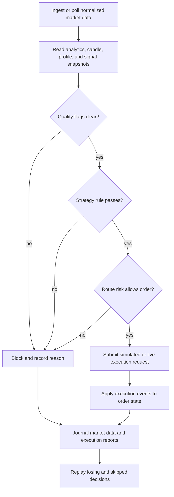
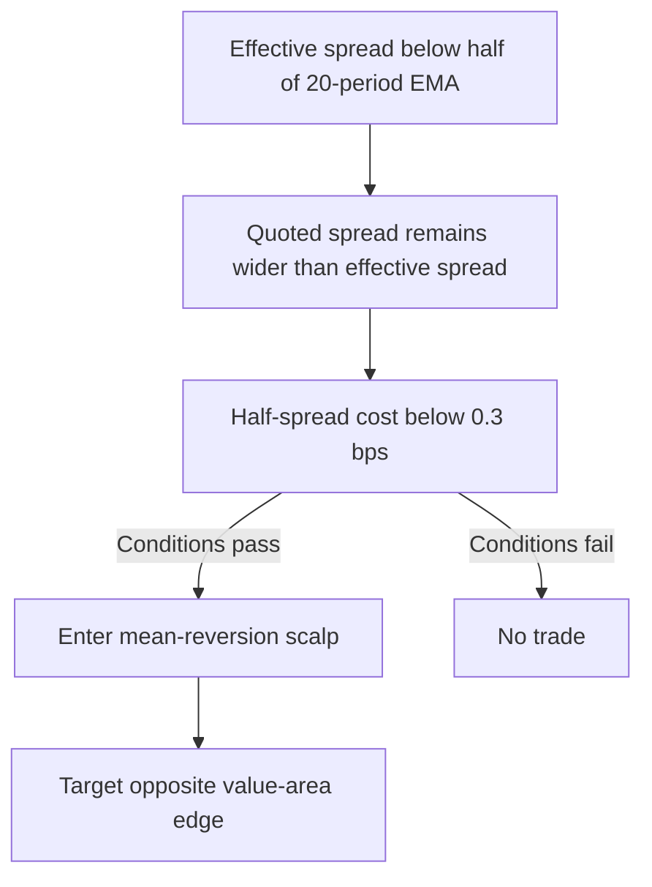
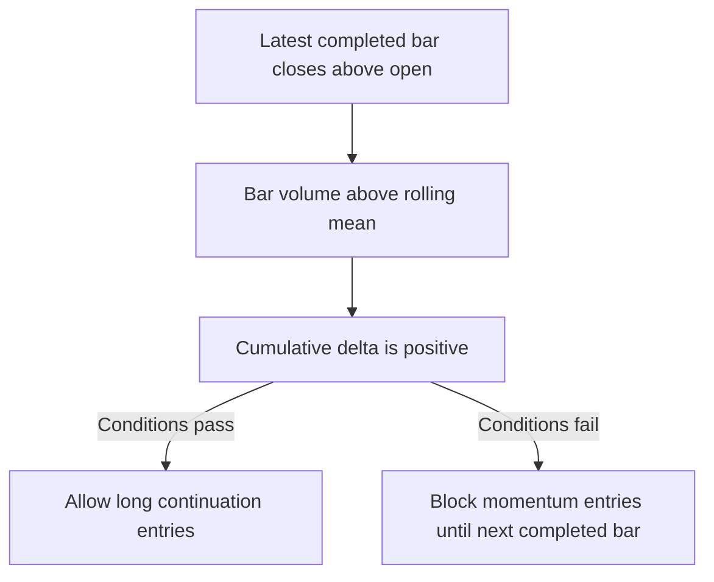

# Strategy Cookbook — Exhaustive Examples Across Every API Layer

> This cookbook covers every analytics concept in the orderflow engine with
> concrete, copy-paste strategy examples in **Python**, **Java**, **C**, and
> **Rust**. Each example targets a specific market hypothesis, shows which analytics
> to read, how to interpret them, and how to wire them into a decision.

---

## Table of Contents

0. [Complete 0.4.0 Analytics-To-Execution Loop](#0-complete-040-analytics-to-execution-loop)
1. [Spread Regime Scalping](#1-spread-regime-scalping)
2. [Depth-Imbalance Mean Reversion](#2-depth-imbalance-mean-reversion)
3. [Book-Event Momentum Detection](#3-book-event-momentum-detection)
4. [Resiliency-Driven Reversal](#4-resiliency-driven-reversal)
5. [VPIN Toxicity Gating](#5-vpin-toxicity-gating)
6. [Kyle's Lambda Liquidity Scoring](#6-kyles-lambda-liquidity-scoring)
7. [Amihud Cost-Aware Position Sizing](#7-amihud-cost-aware-position-sizing)
8. [CVD Divergence for Exhaustion Signals](#8-cvd-divergence-for-exhaustion-signals)
9. [Pattern-Detector Combo (Absorption + Imbalance)](#9-pattern-detector-combo-absorption-imbalance)
10. [Footprint Imbalance Continuation](#10-footprint-imbalance-continuation)
11. [DOM Iceberg Detection](#11-dom-iceberg-detection)
12. [Session Classification — Trend vs Range Day](#12-session-classification-trend-vs-range-day)
13. [Volume Profile — HVN/LVN Support and Resistance](#13-volume-profile-hvnlvn-support-and-resistance)
14. [Volatility-Regime Position Sizing](#14-volatility-regime-position-sizing)
15. [Microstructure Noise Filter](#15-microstructure-noise-filter)
16. [Hasbrouck Information Share](#16-hasbrouck-information-share)
17. [Almgren-Chriss Execution Cost Model](#17-almgren-chriss-execution-cost-model)
18. [Spread Decomposition — Adverse Selection Warning](#18-spread-decomposition-adverse-selection-warning)
19. [ACD Trade-Timing Regime](#19-acd-trade-timing-regime)
20. [Regime-Detector Multi-Filter](#20-regime-detector-multi-filter)
21. [Kinetic Energy Breakout Confirmation](#21-kinetic-energy-breakout-confirmation)
22. [Agent-Type HFT Reflexivity](#22-agent-type-hft-reflexivity)
23. [Dark Pool Siphon Detection](#23-dark-pool-siphon-detection)
24. [Institutional Flow Crowding Warning](#24-institutional-flow-crowding-warning)
25. [Options Flow — Gamma Positioning](#25-options-flow-gamma-positioning)
26. [OI Divergence for Trend Exhaustion](#26-oi-divergence-for-trend-exhaustion)
27. [LOB Feature ML Inference Pipeline](#27-lob-feature-ml-inference-pipeline)
28. [Futures Basis Calendar Spread Arbitrage](#28-futures-basis-calendar-spread-arbitrage)
29. [AnalyticsConfig Tuning Workflow](#29-analyticsconfig-tuning-workflow)
30. [Tickbar OHLCV Momentum Confirmation](#30-tickbar-ohlcv-momentum-confirmation)

---

## 0. Complete 0.4.0 Analytics-To-Execution Loop

Use this as the reference shape for the rest of the cookbook. Individual
recipes later in this document focus on one analytics idea; real strategies
need the full loop: clean data, measurable signal, risk decision, execution
request, report handling, and review.



Python reference implementation:

```python
from orderflow import (
    BookAction,
    DataQualityFlags,
    Engine,
    EngineConfig,
    ExecutionEngine,
    ExecutionOrderType,
    ExecutionSide,
    ExecutionTimeInForce,
    ExternalFeedPolicy,
    OrderRequest,
    RiskLimits,
    RouteConfig,
    Side,
    StreamKind,
    Symbol,
)


def should_buy(analytics: dict, signal: dict) -> bool:
    return (
        int(analytics.get("quality_flags", 0)) == DataQualityFlags.NONE
        and int(analytics.get("delta", 0)) > 0
        and float(analytics.get("cumulative_delta", 0.0)) > 0.0
        and float(signal.get("confidence", 0.0)) >= 0.50
    )


sym = Symbol("SIM", "ES", 10)
limits = RiskLimits(False, 5, 1_000_000, 1, 1_000_000, 0)
routes = [RouteConfig("SIM", "ACC", "SIM", "ES", True, limits)]

with Engine(EngineConfig(instance_id="cookbook-loop")) as market, ExecutionEngine(routes) as oms:
    market.configure_external_feed(ExternalFeedPolicy(2_000, True))
    market.subscribe(sym, StreamKind.ANALYTICS)
    market.subscribe(sym, StreamKind.SIGNALS)

    market.ingest_book(sym, Side.BID, 0, 500_000, 100, BookAction.UPSERT, sequence=1)
    market.ingest_book(sym, Side.ASK, 0, 500_025, 120, BookAction.UPSERT, sequence=2)
    market.ingest_trade(sym, 500_025, 2, Side.ASK, sequence=3)
    market.poll_once(DataQualityFlags.NONE)

    analytics = market.analytics_snapshot(sym)
    signal = market.signal_snapshot(sym)

    if should_buy(analytics, signal):
        events = oms.submit_order(OrderRequest(
            "COOK-0001",
            "ACC",
            "SIM",
            "COOK",
            "SIM",
            "ES",
            ExecutionSide.BUY,
            ExecutionOrderType.LIMIT,
            ExecutionTimeInForce.DAY,
            1,
            500_025,
        ))
        print("execution events", events)
        print("order state", oms.order_state("COOK-0001"))
    else:
        print("blocked", {"analytics": analytics, "signal": signal})
```

The same structure applies to C, Java, and Rust:

| Step | Rust crate/API | C ABI | Python | Java |
| --- | --- | --- | --- | --- |
| Market-data runtime | `of_runtime::Engine` | `of_engine_*` | `Engine` | `OrderflowEngine` |
| Analytics snapshot | `analytics_snapshot` | `of_get_analytics_snapshot` | `analytics_snapshot` | `analyticsSnapshot` |
| Signal snapshot | `signal_snapshot` | `of_get_signal_snapshot` | `signal_snapshot` | `signalSnapshot` |
| Route/risk config | `RouteConfig`, `RiskLimits` | `of_execution_route_config_t` | `RouteConfig`, `RiskLimits` | `RouteConfig`, `RiskLimits` |
| Submit order | `ExecutionEngine::submit` | `of_execution_submit_order` | `submit_order` | `submitOrder` |
| Concurrent order path | `ConcurrentExecutionEngine` | `of_execution_concurrent_*` | `ConcurrentExecutionEngine` | `ConcurrentOrderflowExecutionEngine` |
| Review | `of_persist`, `ExecutionJournal` | host-owned files | market snapshots + execution events | JSON snapshots + execution events |

---

## 1. Spread Regime Scalping

**Hypothesis.** When the effective spread contracts below its recent average,
market makers are competing aggressively — a signal that the market is liquid
and ready for a quick mean-reversion scalp.

**Analytics used.** `effective_spread_bps`, `realised_spread_bps`,
`quoted_spread`, `half_spread_cost_bps`.

**Rust (of_core).**
```rust
use of_core::{AnalyticsAccumulator, Side, SpreadTracker, SymbolId, TradePrint};

let mut spread_tracker = SpreadTracker::new(100);
let mut acc = AnalyticsAccumulator::default();

let trade = TradePrint {
    symbol: SymbolId { venue: "CME".into(), symbol: "ESM6".into() },
    price: 500_050,
    size: 100,
    aggressor_side: Side::Bid,
    sequence: 1,
    ts_exchange_ns: 1_000_000,
    ts_recv_ns: 1_000_100,
};
let mid = 500_000;
spread_tracker.on_trade(trade.price, mid, trade.ts_exchange_ns);
acc.on_trade(&trade);

let eff = spread_tracker.last_effective_spread_bps();
let real = spread_tracker.realised_spread_bps(10);
dbg!(eff, real);
```

**Python.**
```python
from orderflow import Engine, EngineConfig, Symbol

engine = Engine(EngineConfig())
engine.start()
engine.subscribe(Symbol("CME", "ESM6", 10))
engine.poll_once()

eff = engine.effective_spread_bps(Symbol("CME", "ESM6", 10))["bps"]
real = engine.realised_spread_bps(Symbol("CME", "ESM6", 10))["bps"]
print(f"Effective: {eff} bps | Realised: {real} bps")
```

**Java.**
```java
OrderflowEngine engine = new OrderflowEngine();
engine.start();
Symbol sym = new Symbol("CME", "ESM6", (short)10);
engine.subscribe(sym, StreamKind.ANALYTICS);

JSONObject eff = new JSONObject(engine.effectiveSpreadBps(sym));
JSONObject real = new JSONObject(engine.realisedSpreadBps(sym, 5));
```

**Strategy rule.**


---

## 2. Depth-Imbalance Mean Reversion

**Hypothesis.** When one side of the book carries more than 2× the volume of
the other, the price is biased toward the thinner side as liquidity gets
tested.

**Analytics used.** `depth_imbalance_bps`, `mid_price`, `bid_depth`,
`ask_depth`, `book_level` snapshots.

**Rust.**
```rust
use of_core::{compute_book_analytics, BookLevel, BookSnapshot, SymbolId};

let book = BookSnapshot {
    symbol: SymbolId { venue: "CME".into(), symbol: "ESM6".into() },
    bids: vec![BookLevel { level: 0, price: 100, size: 5000 }],
    asks: vec![BookLevel { level: 0, price: 101, size: 2000 }],
    last_sequence: 1,
    ts_exchange_ns: 1_000_000,
    ts_recv_ns: 1_000_100,
};
let ba = compute_book_analytics(&book);
// ba.depth_imbalance_bps => roughly 4285 bps bid-heavy.
if ba.depth_imbalance_bps.abs() > 3_000 {
    println!("Imbalance signal: {} bps", ba.depth_imbalance_bps);
}
```

**Python.**
```python
snap = engine.book_analytics_snapshot(Symbol("CME", "ES", 10))
if abs(snap["depth_imbalance_bps"]) > 3_000:
    direction = "SHORT" if snap["depth_imbalance_bps"] > 0 else "LONG"
    print(f"Enter {direction} — imbalance {snap['depth_imbalance_bps']} bps")
```

**C.**
```c
char json[512];
uint32_t len = sizeof json;
int32_t rc = of_get_book_analytics_snapshot(engine, &sym, json, &len);
if (rc == OF_OK) {
    /* Parse JSON field "depth_imbalance_bps". */
}
```

---

## 3. Book-Event Momentum Detection

**Hypothesis.** A sudden spike in order arrival rate without a corresponding
increase in cancellation rate signals genuine new interest — momentum is
building.

**Analytics used.** `arrival_rate_per_sec`, `cancel_rate_per_sec`,
`book_event_arrivals`, `book_event_cancels`, `event_tracker_max_len`
(via `AnalyticsConfig`).

**Rust (engine level).**
```rust
use of_core::{DataQualityFlags, SymbolId};

engine.start();
let symbol = SymbolId { venue: "CME".into(), symbol: "ESM6".into() };
let _ = engine.subscribe(symbol.clone(), 10);
let _ = engine.poll_once(DataQualityFlags::NONE);

let event = engine.book_event_analytics(&symbol, 1_000_000_000);
let arrivals = event.bid_arrival_rate + event.ask_arrival_rate;
let cancels = event.bid_cancel_rate + event.ask_cancel_rate;
if arrivals > cancels * 1.5 && arrivals > 10.0 {
    println!("Momentum building — arrivals {:.1}/s > cancels {:.1}/s", arrivals, cancels);
}
```

**Python.**
```python
event = engine.book_event_analytics(Symbol("BINANCE", "BTCUSDT", 10))
arrivals = event["bid_arrival_rate"] + event["ask_arrival_rate"]
cancels = event["bid_cancel_rate"] + event["ask_cancel_rate"]
if arrivals > cancels * 1.5:
    print("Momentum influx detected")
```

---

## 4. Resiliency-Driven Reversal

**Hypothesis.** If depth snaps back quickly after a large trade (high
resiliency), the market absorbed the flow — the move is likely to reverse.
If depth stays depressed (low resiliency), the move has conviction.

**Analytics used.** `recovery_time_ms`, `depth_elasticity`,
`resiliency_snapshot`.

**Rust.**
```rust
let resil = engine.resiliency_snapshot(&symbol);
if resil.recovery_time_ms < 500.0 && resil.depth_elasticity > 0.8 {
    println!("High resiliency — reversal candidate");
} else if resil.recovery_time_ms > 2_000.0 {
    println!("Low resiliency — trend continuation likely");
}
```

**Python.**
```python
r = engine.resiliency_snapshot(Symbol("CME", "ESM6", 10))
if r["recovery_time_ms"] < 500.0 and r["depth_elasticity"] > 0.8:
    print("High resiliency — fade the move")
```

---

## 5. VPIN Toxicity Gating

**Hypothesis.** When VPIN is above its toxicity threshold, order-flow is
toxic and mean-reversion strategies should be disabled.

**Analytics used.** `vpin`, `vpin_zscore`, `is_toxic`, `bucket_count`,
`vpin_rolling_buckets`, `VpinSnapshot`.

**Python.**
```python
v = engine.vpin_snapshot(Symbol("CME", "ESM6", 10))
if v["is_toxic"]:
    engine.disable_trading("vpin_toxic")
    print(f"Toxic VPIN: z={v['vpin_zscore']:.1f}")
```

**Java.**
```java
JSONObject v = new JSONObject(engine.vpinSnapshot(sym));
if (v.getBoolean("is_toxic")) {
    disableTrading("vpin_toxic");
}
```

---

## 6. Kyle's Lambda Liquidity Scoring

**Hypothesis.** Low lambda means a trade moves price less — the market is
deep. High lambda means you pay more to get size. Scale bids/asks accordingly.

**Analytics used.** `lambda_bps`, `r_squared`, `average_lambda_bps`,
`KyleLambdaSnapshot`.

**Rust.**
```rust
let kl = engine.kyle_lambda_snapshot(&symbol);
if kl.lambda_bps < 1.0 {
    println!("Deep market — can enter full size");
} else if kl.lambda_bps > 5.0 {
    println!("Thin market — reduce size, use limit orders");
}
```

---

## 7. Amihud Cost-Aware Position Sizing

**Hypothesis.** When Amihud illiquidity is elevated, each dollar of volume
moves price more. Scale down when the ratio is high.

**Analytics used.** `amihud_ratio`, `AmihudTracker`, `amihud_snapshot`.

**Python.**
```python
a = engine.amihud_snapshot(Symbol("NYSE", "AAPL", 10))
ratio = a["amihud_ratio"]
size_pct = max(0.1, 1.0 - ratio * 1_000)
print(f"Scale size to {size_pct:.0%} of max")
```

---

## 8. CVD Divergence for Exhaustion Signals

**Hypothesis.** Price makes a higher high, but cumulative delta does not
confirm — buyers are exhausting and a reversal is imminent.

**Analytics used.** `delta_ratio`, `delta_zscore`, `divergence_detected`,
`cvd_enhancement_snapshot`.

**Rust.**
```rust
let cvd = engine.cvd_enhancement_snapshot(&symbol);
if cvd.divergence_detected {
    println!("CVD divergence detected — prepare for reversal");
}
```

**Python.**
```python
cvd = engine.cvd_enhancement_snapshot(Symbol("CME", "ESM6", 10))
if cvd.get("divergence_detected"):
    direction = "SHORT" if cvd["delta_ratio"] < 0 else "LONG"
    print(f"{direction} divergence signal | z={cvd['delta_zscore']:.2f}")
```

---

## 9. Pattern-Detector Combo (Absorption + Imbalance)

**Hypothesis.** When a footprint stacked-imbalance pattern appears while an
absorption pattern is active, the absorption is breaking — enter in the
imbalance direction.

**Analytics used.** `PatternDetector`, `PatternSnapshot` with flags:
`stacked_imbalance_detected`, `absorption_detected`,
`exhaustion_detected`, `initiation_detected`.

**Python.**
```python
p = engine.pattern_snapshot(Symbol("CME", "ESM6", 10))
if p["stacked_imbalance_detected"] and p["absorption_detected"]:
    print("Breakout from absorption — enter in imbalance direction")
if p["exhaustion_detected"]:
    print("Exhaustion pattern — fade extreme")
```

**All pattern fields exposed.**
```python
p["imbalance_detected"]        # 2.1
p["stacked_imbalance_detected"]
p["absorption_detected"]
p["exhaustion_detected"]
p["initiation_detected"]
p["tailing_detected"]
p["iceberg_detected"]          # 2.2
p["spoofing_detected"]
p["flip_detected"]
p["liquidity_gap_detected"]
p["stop_hunt_detected"]
p["hidden_accumulation"]       # 2.3
p["hidden_distribution"]
p["trapped_traders_detected"]
p["delta_clock_ns"]
p["trend_day"]                 # 2.4
p["range_day"]
p["reversal_day"]
p["session_type_score"]                # 0.0 (range) to 1.0 (trend)
```

---

## 10. Footprint Imbalance Continuation

**Hypothesis.** Three or more consecutive bars with buy-initiated imbalance
above 1.5× average size — buyers are in control and continuation is likely.

**Analytics used.** `imbalance_detected`, `initiation_detected`,
`stacked_imbalance_detected`.

**Python.**
```python
p = engine.pattern_snapshot(Symbol("CME", "ESM6", 10))
if p["stacked_imbalance_detected"] and p["initiation_detected"]:
    print("Strong initiation + stacked buys — continuation long")
```

---

## 11. DOM Iceberg Detection

**Hypothesis.** When a large order repeatedly reappears at the same price
level after being filled, an iceberg is present. Stop hunting usually
follows.

**Analytics used.** `iceberg_detected`, `stop_hunt_detected`.

**Python.**
```python
p = engine.pattern_snapshot(Symbol("CME", "ESM6", 10))
if p["iceberg_detected"]:
    print("Iceberg detected — expect stop hunt")
if p["stop_hunt_detected"]:
    print("Stop hunt active — fade wick")
```

---

## 12. Session Classification — Trend vs Range Day

**Hypothesis.** Classify the session type to determine the right strategy:
trend days get trend-following, range days get mean-reversion.

**Analytics used.** `trend_day`, `range_day`, `reversal_day`,
`session_type_score`.

**Rust.**
```rust
let snap = engine.pattern_snapshot(&symbol);
if snap.session_type_score > 0.7 {
    // Trend day — use momentum entries
} else if snap.session_type_score < 0.3 {
    // Range day — fade extremes
}
```

---

## 13. Volume Profile — HVN/LVN Support and Resistance

**Hypothesis.** High-volume nodes (HVN) act as support/resistance. Low-volume
nodes (LVN) are gaps that price moves through quickly. Composite multi-session
HVN/LVN identifies structural zones.

**Analytics used.** `volume_profile_entropy`, `volume_profile_skew`,
`hvn_count`, `lvn_count`, `vwap_per_bin_json`, `composite_hvn`,
`composite_lvn`, `initial_balance_high`, `initial_balance_low`.

**Python.**
```python
p = engine.pattern_snapshot(Symbol("CME", "ESM6", 10))
if p["hvn_count"] > 3:
    print(f"Strong support zone — {p['hvn_count']} HVNs nearby")
if p["lvn_count"] > 2:
    print("Multiple LVNs — price likely to sweep through gaps")
```

---

## 14. Volatility-Regime Position Sizing

**Hypothesis.** Scale position size inversely to volatility. Use Parkinson
(Garman-Klass / Yang-Zhang) for a more robust estimate than simple RV.

**Analytics used.** `VolatilitySnapshot` with `classic_rv`, `parkinson`,
`garman_klass`, `yang_zhang`.

**Rust.**
```rust
let v = engine.volatility_snapshot(&symbol);
let vol = v.yang_zhang;
let size = if vol < 0.01 {
    1.0       // full size
} else if vol < 0.02 {
    0.5       // half size
} else {
    0.25      // quarter size
};
```

**Python.**
```python
v = engine.volatility_snapshot(Symbol("CME", "ESM6", 10))
vol = v["yang_zhang"]  # or parkinson, garman_klass, classic_rv
size = max(0.1, 1.0 - vol * 100)
print(f"Position size: {size:.0%}")
```

---

## 15. Microstructure Noise Filter

**Hypothesis.** When microstructure noise variance is high relative to signal,
price moves are noise-dominated. Avoid trading until SNR improves.

**Analytics used.** `NoiseSnapshot` with `noise_variance`, `signal_to_noise`.

**Python.**
```python
n = engine.noise_snapshot(Symbol("CME", "ESM6", 10))
if n["signal_to_noise"] < 0.5:
    print("Noise-dominated market — stay flat")
else:
    print(f"Tradable SNR: {n['signal_to_noise']:.2f}")
```

---

## 16. Hasbrouck Information Share

**Hypothesis.** When the permanent impact component dominates the temporary
component, the trade carries information — follow it. When temporary dominates,
it's noise — fade it.

**Analytics used.** `HasbrouckSnapshot` with `permanent_impact`,
`temporary_impact`, `information_share`.

**Rust.**
```rust
let h = engine.hasbrouck_snapshot(&symbol);
if h.permanent_impact > h.temporary_impact * 2.0 {
    println!("Informational trade — follow direction");
} else if h.temporary_impact > h.permanent_impact * 2.0 {
    println!("Noise trade — fade direction");
}
```

**Python.**
```python
h = engine.hasbrouck_snapshot(Symbol("CME", "ESM6", 10))
if h["permanent_impact"] > h["temporary_impact"] * 2:
    print("Informational flow detected")
```

---

## 17. Almgren-Chriss Execution Cost Model

**Hypothesis.** Estimate the market impact cost before entering a large order.
If total predicted impact exceeds acceptable slippage, slice the order or
use a dark pool.

**Analytics used.** `AlmgrenChrissSnapshot` with `permanent_impact_coef`,
`temporary_impact_coef`.

**Rust.**
```rust
let ac = engine.almgren_chriss_snapshot(&symbol);
let order_size = 500_000.0;
let cost = ac.permanent_impact_coef * order_size
         + ac.temporary_impact_coef * order_size.sqrt();
if cost > 1.0 { /* bps — use dark pool */ }
```

---

## 18. Spread Decomposition — Adverse Selection Warning

**Hypothesis.** When the adverse-selection component of the spread is
elevated, informed traders are present — your limit orders are likely to be
picked off. Tighten quotes or switch to market orders.

**Analytics used.** `SpreadDecompositionSnapshot` with `adverse_selection`,
`order_processing_cost`, `inventory_component`, `pin`.

**Python.**
```python
sd = engine.spread_decomp_snapshot(Symbol("CME", "ESM6", 10))
if sd["adverse_selection"] > 0.5:
    print("Adverse selection high — use market orders")
if sd["pin"] > 0.3:
    print("High probability of informed trading")
```

---

## 19. ACD Trade-Timing Regime

**Hypothesis.** When mean duration between trades shrinks (high intensity),
the market is active and you can trade frequently. When duration expands
(low intensity), let the market come to you.

**Analytics used.** `ACDSnapshot` with `mean_duration_ns`, `intensity`,
`alpha`, `beta`.

**Rust.**
```rust
let acd = engine.acd_snapshot(&symbol);
if acd.intensity > 5.0 {
    println!("Active market — 5+ trades/sec");
} else if acd.intensity < 1.0 {
    println!("Quiet market — reduce frequency");
}
```

---

## 20. Regime-Detector Multi-Filter

**Hypothesis.** Combine spread z-score, volatility z-score, and VPIN z-score
to classify the market regime. Disable trend strategies in stressed/quiet
regimes; enable only in normal.

**Analytics used.** `RegimeSnapshot` with `regime` (0=normal, 1=stressed,
2=flash_crash, 3=quiet), `spread_z`, `vol_z`, `vpin_z`.

**Python.**
```python
r = engine.regime_snapshot(Symbol("CME", "ESM6", 10))
regime_map = {0: "NORMAL", 1: "STRESSED", 2: "FLASH_CRASH", 3: "QUIET"}
print(f"Regime: {regime_map[r['regime']]}")
print(f"  spread_z={r['spread_z']:.1f} vol_z={r['vol_z']:.1f} vpin_z={r['vpin_z']:.1f}")

if r["regime"] == 0:
    enable_all_strategies()
elif r["regime"] == 1:
    disable_trend_strategies()
elif r["regime"] == 2:
    halt_trading()
else:
    enable_mean_reversion_only()
```

---

## 21. Kinetic Energy Breakout Confirmation

**Hypothesis.** A breakout with high kinetic energy (signed volume × price
change) is genuine. A breakout with low energy is a false move.

**Analytics used.** `KineticEnergySnapshot` with `kinetic_energy`,
`order_flow_momentum`, `energy_change`.

**Rust.**
```rust
let ke = engine.kinetic_energy_snapshot(&symbol);
if ke.energy_change > 0.5 && ke.kinetic_energy > 1000.0 {
    println!("High-energy breakout — follow");
} else if ke.energy_change < -0.5 {
    println!("Energy collapsing — exit positions");
}
```

---

## 22. Agent-Type HFT Reflexivity

**Hypothesis.** When the HFT reflexivity score is high, algos are driving
the tape. Price moves are self-reinforcing and tend to overshoot. Fade the
extreme.

**Analytics used.** `AgentTypeSnapshot` with `irp`, `ipin`, `ivpin`,
`hft_reflexivity`.

**Python.**
```python
a = engine.agent_type_snapshot(Symbol("CME", "ESM6", 10))
print(f"iRP={a['irp']:.2f} iPIN={a['ipin']:.4f} iVPIN={a['ivpin']:.4f} HFT={a['hft_reflexivity']:.2f}")
if a["hft_reflexivity"] > 0.7:
    print("HFT-driven market — expect overshoot, fade extremes")
if a["irp"] > 0.6:
    print("High retail participation — trade against retail flow")
```

---

## 23. Dark Pool Siphon Detection

**Hypothesis.** When dark-lit correlation drops below -0.5, dark volume is
diverging from lit flow — institutions are working large orders in the dark.
Follow the dark vector.

**Analytics used.** `DarkLitCorrelationSnapshot` with `correlation`,
`siphon_active`.

**Python.**
```python
dc = engine.dark_lit_correlation_snapshot(Symbol("NASDAQ", "AAPL", 10))
if dc["siphon_active"]:
    print("Dark pool siphon detected — institutional order in progress")
elif dc["correlation"] < -0.5:
    print("Dark-lit diverging — follow dark direction")
```

---

## 24. Institutional Flow Crowding Warning

**Hypothesis.** When the institutional buy ratio is above 0.8 and crowding
score is elevated, too many smart-money participants are on the same side —
a snap-back is likely.

**Analytics used.** `InstitutionalFlowSnapshot` with `institutional_buy_ratio`,
`crowding_score`.

**Rust.**
```rust
let inst = engine.institutional_flow_snapshot(&symbol);
if inst.institutional_buy_ratio > 0.8 && inst.crowding_score > 0.6 {
    println!("Crowded long — prepare for reversal");
} else if inst.institutional_buy_ratio < 0.2 && inst.crowding_score > 0.6 {
    println!("Crowded short — squeeze candidate");
}
```

---

## 25. Options Flow — Gamma Positioning

**Hypothesis.** Rising delta notional with positive gamma means dealers are
long gamma — they hedge by buying into weakness (supportive). Rising delta
notional with negative gamma means dealers are short gamma — they hedge by
selling into strength (destabilizing).

**Analytics used.** `OptionsFlowSnapshot` with `sweep_detected`,
`put_call_ratio`, `delta_notional`, `gamma_positioning`.

**Python.**
```python
opt = engine.options_flow_snapshot(Symbol("NYSE", "SPY", 10))
print(f"PCR={opt['put_call_ratio']:.2f} Delta={opt['delta_notional']:.0f} Gamma={opt['gamma_positioning']}")
if opt['gamma_positioning'] > 0:
    print("Dealers long gamma — buy dips")
elif opt['gamma_positioning'] < 0:
    print("Dealers short gamma — sell rips")
if opt['sweep_detected']:
    print("Option sweep detected — large positioning")
```

---

## 26. OI Divergence for Trend Exhaustion

**Hypothesis.** When price rises but open interest falls, the trend is
losing participants — reversal imminent. OI build with price confirms.

**Analytics used.** `OIAnalysisSnapshot` with `oi_divergence`,
`oi_build_rate`, `max_pain_distance_bps`.

**Rust.**
```rust
let oi = engine.oi_analysis_snapshot(&symbol);
if oi.oi_divergence {
    println!("OI divergence — trend exhaustion");
}
if oi.oi_build_rate > 0.05 {
    println!("OI building — conviction behind move");
}
```

---

## 27. LOB Feature ML Inference Pipeline

**Hypothesis.** Use 16 numerical LOB features as inputs to an XGBoost model
trained offline. The model predicts 1-minute-award price direction.

**Analytics used.** `LOBFeatureSnapshot` — 16 fields returned as JSON from
`compute_lob_features()` across all API layers.

**Python (full pipeline).**
```python
import xgboost as xgb
from orderflow import Engine, EngineConfig, Symbol, OfAnalyticsConfig

cfg = OfAnalyticsConfig.defaults()
cfg.spread_tracker_max_len = 500   # longer lookback for stable features

with Engine(EngineConfig()) as engine:
    engine.set_analytics_config(cfg)
    engine.start()
    sym = Symbol("CME", "ESM6", 10)
    engine.subscribe(sym)

    model = xgb.Booster()
    model.load_model("lob_model.json")

    while True:
        engine.poll_once()
        # Grab flow metrics from existing snapshots
        cvd = engine.cvd_enhancement_snapshot(sym)
        event = engine.book_event_analytics(sym)
        ti = cvd.get("delta_ratio", 0.0)
        cr = event.get("bid_cancel_rate", 0.0) + event.get("ask_cancel_rate", 0.0)
        ar = event.get("bid_arrival_rate", 0.0) + event.get("ask_arrival_rate", 0.0)

        # Compute features
        f = engine.lob_features(sym, trade_imbalance=ti, cancel_rate=cr, arrival_rate=ar)
        row = [f[k] for k in sorted(f)]
        pred = model.predict(xgb.DMatrix([row]))[0]

        if pred > 0.6:
            print("ML predicts UP — enter long")
        elif pred < 0.4:
            print("ML predicts DOWN — enter short")
```

**Java.**
```java
JSONObject f = new JSONObject(engine.lobFeatures(sym, ti, cr, ar));
// feed to your ML pipeline (ONNX, TensorFlow Java, etc.)
```

**C.**
```c
char json[1024];
uint32_t len = sizeof json;
int32_t rc = of_compute_lob_features(
    engine, &sym, trade_imb, cancel_rate, arrival_rate, json, &len);
if (rc == OF_OK) {
    /* Parse JSON fields: spread_bps, depth_imbalance, microprice, ... */
}
```

---

## 28. Futures Basis Calendar Spread Arbitrage

**Hypothesis.** When the front-month / next-month basis widens beyond its
recent distribution, enter a calendar spread to capture the convergence.

**Analytics used.** `FuturesSnapshot` with `basis_bps`, `calendar_spread`,
`settlement_pressure`, `roll_progress`.

**Python.**
```python
fut = engine.futures_snapshot(Symbol("CME", "ESM6", 10))
if abs(fut["basis_bps"]) > 10:
    print(f"Basis wide at {fut['basis_bps']:.1f} bps — calendar spread candidate")
if fut["roll_progress"] > 0.8:
    print("Roll nearly complete — unwind spread")
```

---

## 29. AnalyticsConfig Tuning Workflow

**Hypothesis.** Different market regimes need different buffer sizes. A
fast-moving crypto market needs shorter windows than US Treasuries. Tune
`AnalyticsConfig` at startup.

**All 22 configurable fields:**
```python
from orderflow import OfAnalyticsConfig

cfg = OfAnalyticsConfig.defaults()
cfg.vpin_volume_bucket         = 2500       # smaller buckets for crypto
cfg.vpin_max_buckets           = 30
cfg.vol_signature_max_len      = 100        # shorter signature for FX
cfg.institutional_trade_threshold = 10000   # larger threshold for ES
cfg.cancel_arrival_window_ns   = 500_000_000  # 500ms for HFT
cfg.agent_small_trade_threshold = 50.0
cfg.spread_tracker_max_len     = 256
cfg.resiliency_max_len         = 512
engine.set_analytics_config(cfg)
```

**Rust.**
```rust
let mut cfg = AnalyticsConfig::default();
cfg.vpin_volume_bucket = 2500;
cfg.vol_estimator_max_len = 200;
engine.set_analytics_config(cfg);
```

**C.**
```c
of_analytics_config_t cfg = {
    .agent_small_trade_threshold = 100.0,
    .institutional_trade_threshold = 10000,
    .cancel_arrival_window_ns = 1000000000ULL,
    .vpin_volume_bucket = 5000,
    .vpin_max_buckets = 50,
    .kyle_lambda_max_len = 200,
    .cvd_max_len = 50,
    .vol_estimator_max_len = 100,
    .noise_max_len = 100,
    .hasbrouck_max_len = 100,
    .almgren_chriss_max_len = 100,
    .acd_max_len = 100,
    .vol_signature_max_len = 500,
    .agent_max_len = 100,
    .agent_min_samples = 5,
    .institutional_max_len = 100,
    .resiliency_max_len = 1024,
    .spread_decomp_max_len = 100,
    .regime_max_len = 100,
    .event_tracker_max_len = 65536,
    .spread_tracker_max_len = 1024,
    .default_max_len = 100,
};
of_engine_set_analytics_config(engine, &cfg);
```

C callers should either pass `NULL` to reset defaults or populate every field
explicitly. A partially-zeroed `of_analytics_config_t` intentionally disables
the corresponding rolling windows.

---

## 30. Tickbar OHLCV Momentum Confirmation

**Hypothesis.** Fixed-interval OHLCV bars provide a stable decision cadence
above raw prints. Confirm orderflow entries only when completed bars agree
with the trade-driven analytics direction.

**Analytics used.** `CompletedBar`, `AnalyticsAccumulator::with_tickbar`,
`of_engine_set_tickbar_interval`, `of_get_bar_series`, `bar_series`.

Tickbar aggregation is optional and requires the native library to be built
with the `tickbar` feature. Configure the interval before the first trade for
the symbol, because existing per-symbol accumulators are intentionally not
retrofitted.

**Rust.**
```rust
use of_core::{AnalyticsAccumulator, Side, SymbolId, TradePrint};

let mut acc = AnalyticsAccumulator::with_tickbar(1_000_000_000); // 1s bars
let symbol = SymbolId { venue: "CME".into(), symbol: "ESM6".into() };

for (i, price) in [500_000, 500_025, 500_050].into_iter().enumerate() {
    acc.on_trade(&TradePrint {
        symbol: symbol.clone(),
        price,
        size: 10,
        aggressor_side: Side::Ask,
        sequence: i as u64 + 1,
        ts_exchange_ns: i as u64 * 1_000_000_000,
        ts_recv_ns: i as u64 * 1_000_000_000 + 100,
    });
}

if let Some(bars) = acc.bar_series() {
    let latest = bars.last().unwrap();
    if latest.close > latest.open && latest.volume > 0.0 {
        println!("Completed bullish tickbar confirms long bias");
    }
}
```

**Python.**
```python
from orderflow import Engine, EngineConfig, Symbol

sym = Symbol("CME", "ESM6", 10)

with Engine(EngineConfig()) as engine:
    engine.start()
    engine.set_tickbar_interval(1_000_000_000)  # 1s bars; call before first trade
    engine.subscribe(sym)

    for _ in range(10):
        engine.poll_once()

    bars = engine.bar_series(sym)
    if bars:
        last = bars[-1]
        if last["close"] > last["open"] and last["volume"] > 0:
            print("Bullish completed bar confirms long bias")
```

**Java.**
```java
try (OrderflowEngine engine = new OrderflowEngine()) {
    Symbol sym = new Symbol("CME", "ESM6", (short) 10);
    engine.start();
    engine.setTickbarInterval(1_000_000_000L);
    engine.subscribe(sym, StreamKind.ANALYTICS);
    engine.pollOnce(DataQualityFlags.NONE);

    JSONArray bars = new JSONArray(engine.barSeries(sym));
    if (bars.length() > 0) {
        JSONObject last = bars.getJSONObject(bars.length() - 1);
        if (last.getDouble("close") > last.getDouble("open")) {
            System.out.println("Bullish tickbar confirmation");
        }
    }
}
```

**C.**
```c
of_engine_set_tickbar_interval(engine, 1000000000LL);
/* Subscribe or ingest trades after setting the interval. */

char json[4096];
uint32_t len = sizeof json;
int32_t rc = of_get_bar_series(engine, &sym, json, &len);
if (rc == OF_OK) {
    /* Parse JSON array of bars:
       [{"timestamp_ns":...,"open":...,"high":...,"low":...,
         "close":...,"volume":...,"tick_count":...,"vwap":...}] */
}
```

**Strategy rule.**


---

## Putting It All Together — A Multi-Concept Strategy

The following Python script combines 12 analytics concepts into a single live
trading loop with configurable thresholds, data quality gating, and per-regime
strategy selection.

```python
"""multi_concept_strategy.py — exhaustive orderflow strategy example."""

import json
import time
from orderflow import (
    Engine, Symbol, OfAnalyticsConfig,
    EngineConfig, ExternalFeedPolicy,
)

def strategy_loop(engine, sym):
    # ── Snapshot everything ──
    try:
        a_   = engine.analytics_snapshot(sym)
        sp_  = engine.spread_decomp_snapshot(sym)
        v_   = engine.volatility_snapshot(sym)
        n_   = engine.noise_snapshot(sym)
        h_   = engine.hasbrouck_snapshot(sym)
        ac_  = engine.almgren_chriss_snapshot(sym)
        k_   = engine.kinetic_energy_snapshot(sym)
        r_   = engine.regime_snapshot(sym)
        p_   = engine.pattern_snapshot(sym)
        cvd_ = engine.cvd_enhancement_snapshot(sym)
        a2_  = engine.agent_type_snapshot(sym)
        o_   = engine.options_flow_snapshot(sym)
    except Exception:
        return None

    # ── 1. Regime gate ──
    if r_["regime"] != 0:          # not normal = no trading
        return {"action": "HOLD", "reason": f"regime_{r_['regime']}"}

    # ── 2. Noise gate ──
    if n_.get("signal_to_noise", 0) < 0.5:
        return {"action": "HOLD", "reason": "noise_dominated"}

    # ── 3. VPIN toxicity gate (from pattern detector's regime context) ──
    # (already reflected in regime_detector via vpin_z)

    # ── 4. CVD divergence check ──
    if cvd_.get("divergence_detected"):
        direction = "SHORT" if cvd_["delta_ratio"] < 0 else "LONG"
        return {"action": "ENTER", "direction": direction,
                "reason": "cvd_divergence", "confidence": 0.7}

    # ── 5. Absorption + stacked imbalance (footprint combo) ──
    if p_.get("absorption_detected") and p_.get("stacked_imbalance_detected"):
        return {"action": "ENTER", "direction": "LONG",
                "reason": "absorption_breakout", "confidence": 0.8}

    # ── 6. Hidden accumulation / distribution ──
    if p_.get("hidden_accumulation"):
        return {"action": "ENTER", "direction": "LONG",
                "reason": "hidden_accumulation", "confidence": 0.6}
    if p_.get("hidden_distribution"):
        return {"action": "ENTER", "direction": "SHORT",
                "reason": "hidden_distribution", "confidence": 0.6}

    # ── 7. High-energy breakout ──
    if k_["energy_change"] > 0.5 and k_["kinetic_energy"] > 1000:
        return {"action": "ENTER", "direction": "LONG" if k_["order_flow_momentum"] > 0 else "SHORT",
                "reason": "kinetic_breakout", "confidence": 0.65}

    # ── 8. HFT reflexivity fade ──
    if a2_["hft_reflexivity"] > 0.7:
        return {"action": "ENTER", "direction": "SHORT",
                "reason": "hft_fade", "confidence": 0.55}

    # ── 9. Options gamma positioning ──
    if o_["gamma_positioning"] > 0:
        return {"action": "PREP_LONG", "reason": "gamma_support", "confidence": 0.4}
    elif o_["gamma_positioning"] < 0:
        return {"action": "PREP_SHORT", "reason": "gamma_resistance", "confidence": 0.4}

    return {"action": "HOLD", "reason": "no_setup"}


if __name__ == "__main__":
    cfg = OfAnalyticsConfig.defaults()
    cfg.institutional_trade_threshold = 10000

    with Engine(EngineConfig(
        instance_id="cookbook-strategy",
        enable_persistence=False,
        signal_threshold=100,
    )) as engine:
        engine.set_analytics_config(cfg)
        engine.start()
        sym = Symbol("CME", "ESM6", 10)
        engine.subscribe(sym)

        for _ in range(100):
            engine.poll_once()
            decision = strategy_loop(engine, sym)
            if decision and decision["action"] != "HOLD":
                print(f"[{decision['reason']}] {decision['action']} "
                      f"{decision.get('direction','')} "
                      f"(conf={decision.get('confidence',0):.0%})")
            time.sleep(0.2)
```

---

## API Compatibility Map

| Concept                | Rust `of_core`          | C ABI                           | Python                          | Java                            |
|------------------------|-------------------------|----------------------------------|--------------------------------|---------------------------------|
| Spread analytics       | `SpreadTracker`         | `of_get_effective_spread_bps`    | `engine.effective_spread_bps`  | `engine.effectiveSpreadBps`     |
| Book analytics         | `compute_book_analytics`| `of_get_book_analytics_snapshot` | `engine.book_analytics_snapshot`| `engine.bookAnalyticsSnapshot`  |
| Book events            | `BookEventTracker`      | `of_get_book_event_analytics`    | `engine.book_event_analytics`  | `engine.bookEventAnalytics`     |
| Resiliency             | `ResiliencyTracker`     | `of_get_resiliency_snapshot`     | `engine.resiliency_snapshot`   | `engine.resiliencySnapshot`     |
| VPIN                   | `VpinTracker`           | `of_get_vpin_snapshot`           | `engine.vpin_snapshot`         | `engine.vpinSnapshot`           |
| Kyle's Lambda          | `KyleLambdaTracker`     | `of_get_kyle_lambda_snapshot`    | `engine.kyle_lambda_snapshot`  | `engine.kyleLambdaSnapshot`     |
| Amihud                 | `AmihudTracker`         | `of_get_amihud_snapshot`         | `engine.amihud_snapshot`       | `engine.amihudSnapshot`         |
| CVD                    | `CvdEnhancements`       | `of_get_cvd_enhancement_snapshot`| `engine.cvd_enhancement_snapshot`| `engine.cvdEnhancementSnapshot`|
| Patterns               | `PatternDetector`       | `of_get_pattern_snapshot`        | `engine.pattern_snapshot`      | `engine.patternSnapshot`        |
| Volatility             | `VolatilityEstimator`   | `of_get_volatility_snapshot`     | `engine.volatility_snapshot`   | `engine.volatilitySnapshot`     |
| Noise                  | `MicrostructureNoise`   | `of_get_noise_snapshot`          | `engine.noise_snapshot`        | `engine.noiseSnapshot`          |
| Hasbrouck VAR          | `HasbrouckVAR`          | `of_get_hasbrouck_snapshot`      | `engine.hasbrouck_snapshot`    | `engine.hasbrouckSnapshot`      |
| Almgren-Chriss         | `AlmgrenChriss`         | `of_get_almgren_chriss_snapshot` | `engine.almgren_chriss_snapshot`| `engine.almgrenChrissSnapshot` |
| Spread decomp          | `SpreadDecomposition`   | `of_get_spread_decomp_snapshot`  | `engine.spread_decomp_snapshot`| `engine.spreadDecompSnapshot`   |
| ACD                    | `ACDModel`              | `of_get_acd_snapshot`            | `engine.acd_snapshot`          | `engine.acdSnapshot`            |
| Regime                 | `RegimeDetector`        | `of_get_regime_snapshot`         | `engine.regime_snapshot`       | `engine.regimeSnapshot`         |
| Kinetic energy         | `KineticEnergyTracker`  | `of_get_kinetic_energy_snapshot` | `engine.kinetic_energy_snapshot`| `engine.kineticEnergySnapshot` |
| Dark pool              | `DarkPoolTracker`       | `of_get_dark_pool_snapshot`      | `engine.dark_pool_snapshot`    | `engine.darkPoolSnapshot`       |
| Options flow           | `OptionsFlowTracker`    | `of_get_options_flow_snapshot`   | `engine.options_flow_snapshot` | `engine.optionsFlowSnapshot`    |
| Futures                | `FuturesTracker`        | `of_get_futures_snapshot`        | `engine.futures_snapshot`      | `engine.futuresSnapshot`        |
| Vol signature          | `VolatilitySignature`   | `of_get_vol_signature_snapshot`  | `engine.vol_signature_snapshot`| `engine.volSignatureSnapshot`   |
| Agent type             | `AgentTypeDetector`     | `of_get_agent_type_snapshot`     | `engine.agent_type_snapshot`   | `engine.agentTypeSnapshot`      |
| Dark-lit correlation   | `DarkLitCorrelator`     | `of_get_dark_lit_correlation_snapshot`| `engine.dark_lit_correlation_snapshot`| `engine.darkLitCorrelationSnapshot`|
| Institutional flow     | `InstitutionalFlowTracker`| `of_get_institutional_flow_snapshot`| `engine.institutional_flow_snapshot`| `engine.institutionalFlowSnapshot`|
| OI analysis            | `OIAnalyzer`            | `of_get_oi_analysis_snapshot`    | `engine.oi_analysis_snapshot`  | `engine.oiAnalysisSnapshot`     |
| LOB features           | `compute_lob_features`  | `of_compute_lob_features`        | `engine.lob_features`          | `engine.lobFeatures`            |
| Analytics config       | `AnalyticsConfig`       | `of_engine_set_analytics_config` | `engine.set_analytics_config`  | `engine.setAnalyticsConfig`     |
| Tickbar                | `AnalyticsAccumulator::with_tickbar`| `of_engine_set_tickbar_interval`| `engine.set_tickbar_interval`  | `engine.setTickbarInterval`     |
| Execution simulation   | `of_execution::simulated_engine`| `of_execution_submit_order` | `ExecutionEngine.submit_order` | `OrderflowExecutionEngine.submitOrder` |
| Multi-route execution  | `simulated_engine_with_routes` | `of_execution_engine_create_multi` | `ExecutionEngine([routes...])` | `new OrderflowExecutionEngine(path, routes)` |
| Concurrent execution   | `ConcurrentExecutionEngine` | `of_execution_concurrent_submit_order` | `ConcurrentExecutionEngine.submit_order` | `ConcurrentOrderflowExecutionEngine.submitOrder` |

---

## Execution Recipe: Simulated Risk-Gated Order

Use the execution layer when a strategy decision needs to become a typed order
command. The execution API is separate from analytics and starts with simulated
execution plus structured risk rejection.

```python
from orderflow import (
    ExecutionEngine, ExecutionOrderType, ExecutionSide, ExecutionTimeInForce,
    OrderRequest, OrderflowRiskError, RiskLimits, RouteConfig,
)

es_route = RouteConfig(
    route_id="SIM",
    account_id="ACC",
    venue="SIM",
    instrument="ES",
    enabled=True,
    risk_limits=RiskLimits(
        kill_switch=False,
        max_order_qty=100,
        max_order_notional=1_000_000,
        max_open_orders=10,
        max_open_notional=10_000_000,
        price_band_ticks=0,
    ),
)
nq_route = RouteConfig(
    route_id="SIM",
    account_id="ACC",
    venue="SIM",
    instrument="NQ",
    enabled=True,
    risk_limits=es_route.risk_limits,
)

with ExecutionEngine([es_route, nq_route]) as execution:
    try:
        events = execution.submit_order(OrderRequest(
            client_order_id="C1",
            account_id="ACC",
            route_id="SIM",
            strategy_id="STRAT",
            venue="SIM",
            instrument="ES",
            side=ExecutionSide.BUY,
            order_type=ExecutionOrderType.LIMIT,
            time_in_force=ExecutionTimeInForce.DAY,
            quantity=10,
            limit_price=5000,
        ))
    except OrderflowRiskError as exc:
        print("risk rejected", exc.events)
    else:
        print("final status", events[-1].order_status)
```

For multi-symbol strategies, configure one route per `(route_id, account_id,
venue, instrument)` scope and submit each order with the matching route fields.
The execution engine indexes those routes and enforces open-order and open
notional limits within that exact scope, so a busy ES route does not consume the
NQ route's open-order budget.

For low-latency integrations, use the Rust or C APIs directly so requests and
events stay as typed structs in caller-owned buffers.

For concurrent producers, use the concurrent execution worker instead of adding
locks around the synchronous engine. Producers enqueue submit/cancel/amend
commands through bounded queues and consume command reports from a bounded
report channel. The worker remains the single owner of order state, preserving
deterministic state-machine ordering while allowing many caller threads.

---

## Disclaimer

All strategy examples in this cookbook are educational. They do not constitute
financial advice. Always validate with proper risk controls, back-testing, and
data quality gates before any live deployment.
