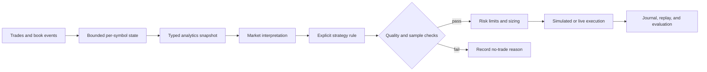
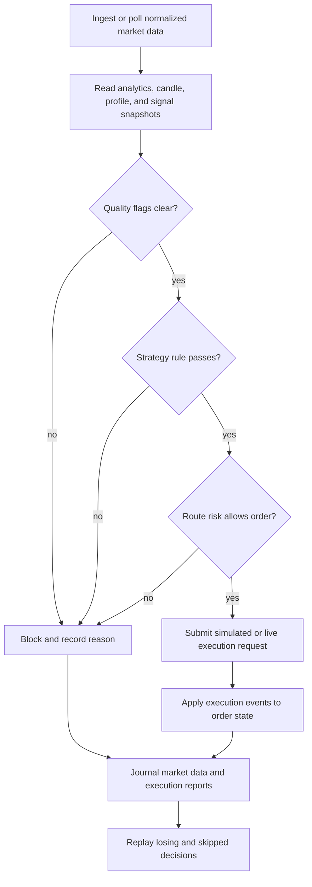
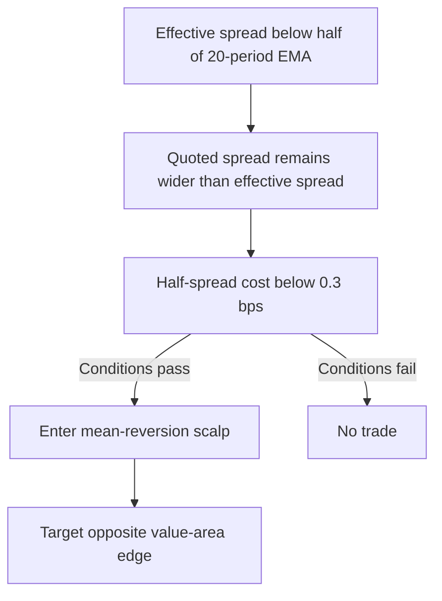
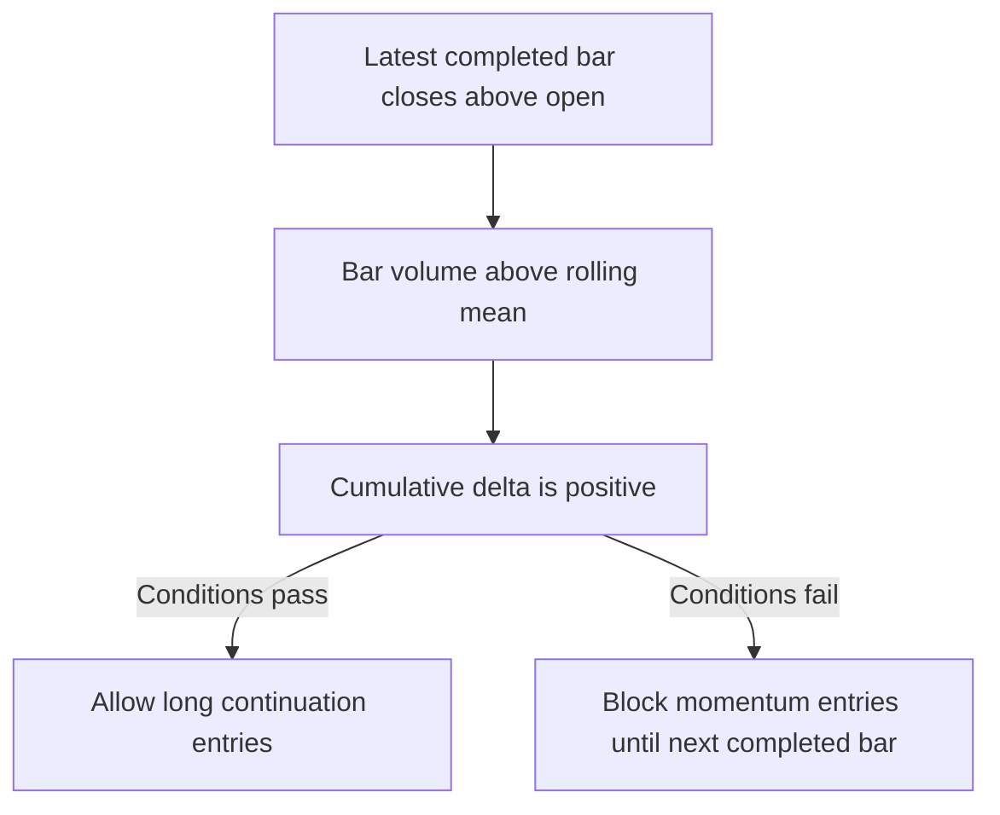

# Strategy Cookbook — Exhaustive Examples Across Every API Layer

> This cookbook covers every analytics concept in the orderflow engine with
> concrete, copy-paste strategy examples in **Python**, **Java**, **C**, and
> **Rust**. Each example targets a specific market hypothesis, shows which analytics
> to read, how to interpret them, and how to wire them into a decision.

---

## Table of Contents

1. [Complete 0.5.0 Analytics-To-Execution Loop](#1-complete-050-analytics-to-execution-loop)
2. [Spread Regime Scalping](#2-spread-regime-scalping)
3. [Depth-Imbalance Mean Reversion](#3-depth-imbalance-mean-reversion)
4. [Book-Event Momentum Detection](#4-book-event-momentum-detection)
5. [Resiliency-Driven Reversal](#5-resiliency-driven-reversal)
6. [VPIN Toxicity Gating](#6-vpin-toxicity-gating)
7. [Kyle's Lambda Liquidity Scoring](#7-kyles-lambda-liquidity-scoring)
8. [Amihud Cost-Aware Position Sizing](#8-amihud-cost-aware-position-sizing)
9. [CVD Divergence for Exhaustion Signals](#9-cvd-divergence-for-exhaustion-signals)
10. [Pattern-Detector Combo (Absorption + Imbalance)](#10-pattern-detector-combo-absorption-imbalance)
11. [Footprint Imbalance Continuation](#11-footprint-imbalance-continuation)
12. [DOM Iceberg Detection](#12-dom-iceberg-detection)
13. [Session Classification — Trend vs Range Day](#13-session-classification-trend-vs-range-day)
14. [Volume Profile — HVN/LVN Support and Resistance](#14-volume-profile-hvnlvn-support-and-resistance)
15. [Volatility-Regime Position Sizing](#15-volatility-regime-position-sizing)
16. [Microstructure Noise Filter](#16-microstructure-noise-filter)
17. [Hasbrouck Information Share](#17-hasbrouck-information-share)
18. [Almgren-Chriss Execution Cost Model](#18-almgren-chriss-execution-cost-model)
19. [Spread Decomposition — Adverse Selection Warning](#19-spread-decomposition-adverse-selection-warning)
20. [ACD Trade-Timing Regime](#20-acd-trade-timing-regime)
21. [Regime-Detector Multi-Filter](#21-regime-detector-multi-filter)
22. [Kinetic Energy Breakout Confirmation](#22-kinetic-energy-breakout-confirmation)
23. [Agent-Type HFT Reflexivity](#23-agent-type-hft-reflexivity)
24. [Dark Pool Siphon Detection](#24-dark-pool-siphon-detection)
25. [Institutional Flow Crowding Warning](#25-institutional-flow-crowding-warning)
26. [Options Flow — Gamma Positioning](#26-options-flow-gamma-positioning)
27. [OI Divergence for Trend Exhaustion](#27-oi-divergence-for-trend-exhaustion)
28. [LOB Feature ML Inference Pipeline](#28-lob-feature-ml-inference-pipeline)
29. [Futures Basis Calendar Spread Arbitrage](#29-futures-basis-calendar-spread-arbitrage)
30. [AnalyticsConfig Tuning Workflow](#30-analyticsconfig-tuning-workflow)
31. [Tickbar OHLCV Momentum Confirmation](#31-tickbar-ohlcv-momentum-confirmation)

---

## How to Use This Cookbook

This cookbook is an engineering and research reference, not a list of trading
claims. Each analytics value is an observation derived from a particular event
stream, lookback window, normalization rule, and data-quality state. The value
does not become a trade signal until a user defines a decision rule, validates
the rule out of sample, applies risk controls, and chooses an execution policy.

The correct mental model is:



### Observation is not prediction

An analytics snapshot describes what the normalized data currently says. It
does not guarantee that the next price move will follow a hypothesis. A useful
strategy must specify:

1. the observation and its units;
2. the market mechanism that could produce it;
3. the condition under which the observation is considered meaningful;
4. the direction, timing, and holding horizon of the trade rule;
5. what invalidates the observation;
6. the risk and execution response;
7. how the result will be measured in replay and live review.

For example, a positive depth imbalance means displayed bid quantity exceeds
displayed ask quantity under the configured depth and event ordering. It does
not prove that buyers are informed, that displayed bids will remain, or that
the next trade will be higher. A strategy must account for cancellation,
spoofing, hidden liquidity, stale books, queue position, and transaction cost.

### Data-quality gate

Every live or replay decision should inspect quality and sample sufficiency
before using an analytics value. At minimum, check:

- no stale-feed flag when freshness is required;
- no sequence-gap or out-of-order flag when ordering matters;
- no clock-skew flag when event-time alignment matters;
- no depth-truncated flag when depth comparisons require the full requested
  book;
- no adapter-degraded flag when the provider is not ready;
- enough observations, buckets, trades, or bars for the estimator;
- non-empty values and valid denominators.

An empty or under-sampled snapshot is not a bearish or bullish value. It is a
reason to wait, record a no-trade decision, or use a separately documented
fallback.

### Units and normalization

Orderflow's canonical prices and quantities are integer-normalized. The value
500025 may mean 5000.25 when the symbol scale is two decimal places; it is not
automatically a floating-point price. Basis points, parts per million, ratios,
nanoseconds, milliseconds, and provider-native quantities must be read from the
snapshot contract and not inferred from a display string.

Use the symbol's tick size, price scale, quantity scale, contract multiplier,
and currency when converting a snapshot into a risk or execution value. A
decision rule should never compare values from two symbols until their units
have been normalized.

### Lookback and warm-up

Most analytics are estimators over bounded state. Their first values can be
empty, zero, unstable, or deliberately conservative. The cookbook therefore
uses the following terms:

- **warm-up**: the minimum observations needed before using a value;
- **lookback**: the retained event or sample horizon;
- **window**: the time or event interval used for one calculation;
- **threshold**: a decision boundary chosen from research and costs;
- **regime**: a classification used to select or disable a strategy;
- **quality gate**: a condition that blocks use of otherwise valid numbers.

Thresholds in examples are starting points, not universal market constants.
They must be calibrated by symbol, venue, session, fee schedule, latency, and
execution style, then tested on data that was not used to choose them.

### Complete runnable Python setup

The following program is the common setup used by the Python examples. It is
complete: it imports the public classes, creates the engine, configures the
external-feed policy, subscribes the symbol, ingests deterministic book and
trade events, polls the runtime, and closes the native handle. Replace the
synthetic ingest function with a provider adapter or replay source for real
work.

```python
from __future__ import annotations

from collections.abc import Iterator
from dataclasses import dataclass
from typing import Any

from orderflow import (
    BookAction,
    DataQualityFlags,
    Engine,
    EngineConfig,
    ExternalFeedPolicy,
    Side,
    StreamKind,
    Symbol,
)


@dataclass(frozen=True)
class Event:
    kind: str
    side: int
    level: int
    price: int
    size: int
    sequence: int
    timestamp_ns: int


def synthetic_events(start_ns: int = 1_000_000_000) -> Iterator[Event]:
    """Yield a deterministic two-sided book and trade stream for examples."""
    yield Event("book", Side.BID, 0, 500_000, 500, 1, start_ns)
    yield Event("book", Side.ASK, 0, 500_025, 300, 2, start_ns + 1_000)
    yield Event("trade", Side.ASK, 0, 500_025, 25, 3, start_ns + 2_000)


def ingest(engine: Engine, symbol: Symbol, event: Event) -> None:
    """Translate one canonical example event into the Python runtime API."""
    if event.kind == "book":
        engine.ingest_book(
            symbol,
            event.side,
            event.level,
            event.price,
            event.size,
            BookAction.UPSERT,
            event.sequence,
            event.timestamp_ns,
            event.timestamp_ns + 100,
            DataQualityFlags.NONE,
        )
    elif event.kind == "trade":
        engine.ingest_trade(
            symbol,
            event.price,
            event.size,
            event.side,
            event.sequence,
            event.timestamp_ns,
            event.timestamp_ns + 100,
            DataQualityFlags.NONE,
        )
    else:
        raise ValueError(f"unsupported event kind: {event.kind}")


def run_once() -> dict[str, Any]:
    symbol = Symbol("SIM", "ES", 10)
    with Engine(EngineConfig(instance_id="cookbook-reference")) as engine:
        engine.configure_external_feed(ExternalFeedPolicy(15_000, True))
        engine.start()
        engine.subscribe(symbol, StreamKind.ANALYTICS)
        engine.subscribe(symbol, StreamKind.BOOK)

        for event in synthetic_events():
            ingest(engine, symbol, event)
            engine.poll_once(DataQualityFlags.NONE)

        book = engine.book_analytics_snapshot(symbol)
        analytics = engine.analytics_snapshot(symbol)
        quality_flags = int(analytics.get("quality_flags", 0))
        return {
            "book": book,
            "analytics": analytics,
            "quality_ok": quality_flags == DataQualityFlags.NONE,
        }


if __name__ == "__main__":
    print(run_once())
```

Run it after building the native library and setting the normal library lookup
environment or explicit library path:

```bash
cargo build -p of_ffi_c
PYTHONPATH=bindings/python python3 cookbook_reference.py
```

The C and Java binding examples use the same lifecycle: construct, start,
configure/subscribe, ingest or poll, query a snapshot, apply a quality gate,
and close. Their JSON snapshot methods are presentation boundaries; low-latency
applications should keep typed data in Rust or C when JSON parsing is not needed.

## Concept Atlas

The atlas gives the market meaning before the recipes show code. Each entry
answers: what is measured, why market participants use it, what can make it
misleading, and how it becomes a responsible strategy input.

### Spread and execution quality

The quoted spread is the distance between the best ask and best bid. It is the
immediate displayed cost of crossing the market before fees and slippage. A
narrow spread usually indicates competition for liquidity, but it can also be
fragile when displayed size is small or the feed is stale.

The effective spread compares an executed trade with the midpoint at the time
of the trade. It includes whether the aggressor paid above or below the
midpoint. The realized spread compares the execution with a later midpoint and
therefore includes the short-horizon price response after the trade. Effective
spread is useful for measuring immediate trading cost; realized spread is useful
for asking whether the liquidity provider was adversely selected.

Use spread metrics to choose between passive and aggressive execution, filter
high-cost entries, and compare venue quality. Do not use a single narrow spread
observation as proof that a market is liquid. Require a warm-up window, stable
quotes, sufficient displayed quantity, and a fee/latency budget.

### Depth imbalance and microprice

Depth imbalance compares displayed bid and ask quantity over selected levels.
Positive imbalance means more displayed bid quantity; negative imbalance means
more displayed ask quantity. It is used as a short-horizon pressure indicator,
as an input to queue and execution models, and as a filter for trade direction.

Microprice weights the midpoint toward the side with less available liquidity.
It is useful because a symmetric midpoint ignores the fact that one side may be
easier to consume. Both measures are vulnerable to cancellations, hidden
liquidity, feed truncation, and spoofing. Use them as conditional evidence, not
as standalone direction predictors.

### Book-event arrivals and cancellations

Arrival and cancellation rates describe how quickly displayed liquidity changes.
High arrivals can mean genuine quoting interest, but may also be automated
quote churn. High cancellations can signal withdrawal, risk reduction, a quote
refresh policy, or spoofing. Comparing the rates with executed volume and price
response helps distinguish passive activity from pressure.

Use this family to choose whether a book signal is stable enough to trade and
to detect transitions into an active or fragile market. Rates need a time
window, event-type definition, and minimum event count. Comparing rates from
different window lengths or providers without normalization is invalid.

### Resiliency

Resiliency measures how quickly displayed depth and price conditions recover
after a liquidity shock such as a large trade or book depletion. Fast recovery
can indicate replenishment and absorption; slow recovery can indicate that
liquidity was genuinely removed. The same observation can support reversal or
continuation depending on the initiating price move and broader regime.

Use recovery time and depth elasticity for execution timing and as a regime
filter. A recovery measurement requires an identifiable shock and enough post-
shock observations. Missing book updates or a provider reset can look like slow
recovery, so sequence and freshness gates are essential.

### VPIN-style toxicity

VPIN-style measures compare buy and sell volume imbalance across volume buckets.
The idea is that persistent imbalance may indicate informed or toxic flow for
liquidity providers. It is used to widen or cancel passive quotes, disable
mean-reversion strategies, and reduce size during adverse conditions.

VPIN is not a direct measure of informed traders. Bucket size, trade
classification, sampling, session boundaries, and feed quality materially
change the result. Require enough complete buckets, calibrate by instrument,
and treat a high value as a risk-control input rather than a guaranteed price
direction.

### Kyle's lambda and Amihud illiquidity

Kyle's lambda estimates price response per unit of signed order flow. Higher
lambda means a given amount of signed volume is associated with a larger price
move. It is useful for comparing liquidity regimes and choosing order size or
execution style.

Amihud illiquidity relates absolute return to traded notional or volume. Higher
Amihud means more price movement per unit of trading activity. It is useful for
cost-aware sizing and cross-period liquidity comparison, especially when a
book snapshot is incomplete.

Both are scale-sensitive and noisy at short horizons. Use robust windows,
minimum samples, stable price and quantity units, and a cost model that includes
fees, spread, impact, and latency. Never multiply a raw ratio by an arbitrary
constant without documenting its calibration.

### Cumulative volume delta and divergence

Cumulative volume delta accumulates aggressor-side volume. It attempts to
separate buying and selling pressure from price alone. A divergence occurs when
price makes a new extreme without comparable delta confirmation. Traders use
this to investigate exhaustion, absorption, or hidden liquidity.

Divergence is a context signal, not an immediate reversal order. It can persist
through a strong trend, and trade classification errors can manufacture it.
Require a defined price window, delta window, sample count, and invalidation
level. Record whether the rule is fade, wait-for-confirmation, or continuation.

### Absorption, imbalance, and footprint patterns

Absorption describes aggressive trade volume meeting substantial passive
liquidity without proportional price progress. A stacked imbalance describes
repeated side-dominant volume across adjacent levels or bars. Together they can
describe a battle between aggressive initiative and passive defense.

Patterns are derived labels, not independent evidence. Their thresholds depend
on tick size, depth, bucket construction, and session. Use the underlying
volume, price progress, and quality fields to validate a label, and avoid
double-counting absorption and imbalance as unrelated signals.

### Icebergs and stop-hunt patterns

An iceberg hypothesis arises when executed quantity repeatedly replenishes at a
price despite limited displayed quantity. A stop-hunt label describes a rapid
liquidity sweep or wick-like event that may trigger clustered stops. Both are
inferences from observable prints and book changes; they do not identify a
hidden participant with certainty.

Use them for execution caution, queue decisions, and post-event analysis. Do
not submit a fade solely because an iceberg or stop-hunt flag is true. Require
replenishment evidence, event ordering, minimum size, and a defined failure
condition.

### Session classification and volume profile

Session classification uses distribution, range, volume, and directional
behavior to distinguish trend, range, and reversal conditions. It helps choose
which strategy family is allowed. Classification is retrospective or slowly
changing; it should not be treated as an instant forecast.

A volume profile groups traded volume by price. High-volume nodes are areas of
acceptance where many transactions occurred; low-volume nodes are areas of
less acceptance that price may cross quickly. HVN/LVN behavior depends on
session boundaries, tick size, volume quality, and whether the profile is
composite or session-specific. Define the profile period before evaluating a
level.

### Volatility and microstructure noise

Realized volatility estimates variation over observed returns. Parkinson uses
high/low range, Garman-Klass uses OHLC information, and Yang-Zhang combines
overnight and open-to-close components under its assumptions. They are useful
for sizing, stop distance, regime selection, and execution urgency.

Microstructure noise is the part of observed price variation attributable to
bid/ask bounce, discrete ticks, asynchronous observations, and short-horizon
market mechanics rather than durable movement. A low signal-to-noise ratio is a
reason to reduce trading frequency or lengthen the horizon. Volatility estimates
must not be compared across different units or sampling intervals without
normalization.

### Hasbrouck impact and information share

Hasbrouck-style models separate short-lived and more persistent price responses
using trades, quotes, and a time-series model. An information-share estimate is
model-dependent and sensitive to sampling and market selection. It is useful
for studying which flow or venue contributes to price discovery, and for
deciding whether an execution should be passive or urgent.

It is not a real-time oracle. Require enough observations, stable model
parameters, and out-of-sample validation. Keep model fitting off the hot path.

### Almgren-Chriss and spread decomposition

Almgren-Chriss models the trade-off between execution risk and market impact
when a parent order is sliced over time. Permanent impact represents a durable
price effect; temporary impact represents the execution pressure that decays.
Use it to choose a schedule, participation rate, and urgency, not to promise a
precise fill cost.

Spread decomposition separates components such as adverse selection, order
processing, and inventory effects. High adverse selection warns that passive
orders may be filled just before price moves against them. It can justify
cancel/requote or aggressive execution, but only after fees, queue position,
and fill probability are included.

### ACD and regime detection

An autoregressive conditional duration model describes the time between trades.
Higher intensity means events arrive more frequently; lower intensity means
the market is quieter. ACD is useful for timing participation and deciding
whether an event-driven strategy has enough opportunity.

Regime detection combines standardized measures such as spread, volatility,
and toxicity. The output is a policy input: allow, reduce, or disable strategy
families. The numeric labels and thresholds are configuration contracts, not
universal truths. Document the mapping and test transitions at boundaries.

### Kinetic energy and agent-type inference

Kinetic-energy analytics combine signed flow and price movement to represent
the strength and change of order-flow motion. Agent-type inference estimates
behavioral signatures such as retail, institutional, or high-frequency
participation from observable activity. These are feature models, not identities.

Use them as confirmation or risk filters. They are especially sensitive to
venue selection, trade classification, aggregation, and sample size. Do not
describe inferred agent labels as facts about a participant.

### Dark-lit correlation and institutional flow

Dark-lit correlation compares opaque or off-exchange activity with lit-market
flow. Divergence can indicate that large activity is being executed through a
different channel, but incomplete prints and delayed reporting can create the
same pattern. Institutional-flow analytics classify size or behavior according
to configured thresholds; they do not prove institutional identity.

Use these features for participation, crowding, and execution-risk analysis.
Define reporting delay, venue coverage, size thresholds, and missing-data policy.

### Options flow, gamma, and open interest

Options-flow analytics summarize contracts, direction, delta or notional, and
possibly sweep behavior. Gamma positioning describes how dealer hedging could
amplify or damp price moves under a positioning assumption. Open-interest
analysis compares changes in price and open interest to investigate whether
positions are being opened, closed, or transferred.

These interpretations require contract metadata, expiry, strike, multiplier,
underlying mapping, and reporting timing. Put/call ratio or positive gamma is
not sufficient to infer a market direction. Use options features as contextual
inputs and validate against underlying execution and settlement behavior.

### LOB features and machine learning

LOB features turn book shape and flow into a fixed numerical vector for an
offline-trained model. Feature order, scaling, missing-value policy, training
period, label horizon, and leakage controls are part of the model contract.

The runtime computes features; it does not validate that an external model is
well-trained or free of look-ahead bias. Persist feature schema and model
version, reject mismatched vectors, monitor feature drift, and keep inference
separate from model training.

### Futures basis, calendar spreads, and tickbars

Futures basis compares a futures price with a reference or related contract.
Calendar-spread analysis compares expiries and must account for carry, funding,
roll, expiry, multiplier, and liquidity. A wide basis is not automatically an
arbitrage opportunity.

Tickbars aggregate trades into fixed time intervals. A completed bar provides a
stable decision cadence above raw events, but it introduces close timing and
aggregation assumptions. Configure tickbars before the first symbol trade and
use only completed bars for confirmation.

### Complete decision and execution boundary

The following complete Python example shows how an analytics observation becomes
a quality-gated, risk-gated simulated order. It intentionally uses only public
binding types and does not claim that the rule is profitable.

```python
from __future__ import annotations

from typing import Any

from orderflow import (
    BookAction,
    DataQualityFlags,
    Engine,
    EngineConfig,
    ExecutionEngine,
    ExecutionOrderType,
    ExecutionSide,
    ExecutionTimeInForce,
    ExternalFeedPolicy,
    OrderRequest,
    RiskLimits,
    RouteConfig,
    Side,
    StreamKind,
    Symbol,
)


def quality_ok(analytics: dict[str, Any]) -> bool:
    """Allow decisions only when the snapshot reports clean input quality."""
    return int(analytics.get("quality_flags", 0)) == DataQualityFlags.NONE


def spread_and_imbalance_rule(
    book: dict[str, Any],
    analytics: dict[str, Any],
) -> str | None:
    """Return BUY/SELL only for a complete, explicitly defined observation."""
    if not quality_ok(analytics):
        return None
    if int(analytics.get("trade_count", 0)) < 20:
        return None
    imbalance = int(book.get("depth_imbalance_bps", 0))
    spread = int(book.get("spread_bps", 0))
    if spread <= 0 or spread > 20:
        return None
    if imbalance >= 3_000:
        return "BUY"
    if imbalance <= -3_000:
        return "SELL"
    return None


def main() -> None:
    symbol = Symbol("SIM", "ES", 10)
    limits = RiskLimits(
        kill_switch=False,
        max_order_qty=1,
        max_order_notional=1_000_000,
        max_open_orders=1,
        max_open_notional=1_000_000,
        price_band_ticks=0,
    )
    route = RouteConfig("SIM", "ACC", "SIM", "ES", True, limits)

    with Engine(EngineConfig(instance_id="cookbook-decision")) as market, \
            ExecutionEngine([route]) as execution:
        market.configure_external_feed(ExternalFeedPolicy(15_000, True))
        market.start()
        market.subscribe(symbol, StreamKind.BOOK)
        market.subscribe(symbol, StreamKind.ANALYTICS)

        market.ingest_book(symbol, Side.BID, 0, 500_000, 500, BookAction.UPSERT, 1, 1_000_000_000, 1_000_000_100)
        market.ingest_book(symbol, Side.ASK, 0, 500_025, 300, BookAction.UPSERT, 2, 1_000_000_001, 1_000_000_101)
        market.ingest_trade(symbol, 500_025, 25, Side.ASK, 3, 1_000_000_002, 1_000_000_102)
        market.poll_once(DataQualityFlags.NONE)

        book = market.book_analytics_snapshot(symbol)
        analytics = market.analytics_snapshot(symbol)
        direction = spread_and_imbalance_rule(book, analytics)
        if direction is None:
            print("NO_TRADE", {"book": book, "analytics": analytics})
            return

        side = ExecutionSide.BUY if direction == "BUY" else ExecutionSide.SELL
        events = execution.submit_order(OrderRequest(
            client_order_id="COOKBOOK-0001",
            account_id="ACC",
            route_id="SIM",
            strategy_id="spread-imbalance-demo",
            venue="SIM",
            instrument="ES",
            side=side,
            order_type=ExecutionOrderType.LIMIT,
            time_in_force=ExecutionTimeInForce.DAY,
            quantity=1,
            limit_price=500_025 if side == ExecutionSide.BUY else 500_000,
        ))
        print("SUBMITTED", direction, events)


if __name__ == "__main__":
    main()
```

This is a simulated execution example. A live adapter requires provider
credentials, capability validation, a journal/recovery policy, reconciliation,
and operational approval. A strategy must also define exits, cancellation,
position limits, and restart behavior before it is deployable.

## Recipe Specification Matrix

Use this matrix before copying a recipe into a strategy. The “use” column is
the market question; the “invalidated by” column is the evidence that makes the
observation unsafe; the “response” column is an execution or risk action, not a
prediction of price.

| Recipe | Market question | Invalidated by | Appropriate response |
| --- | --- | --- | --- |
| Spread regime | Is displayed execution cost stable enough for passive liquidity? | Stale quote, thin size, high realized spread, or fee budget breach | Reduce size, widen/cancel, or use a bounded aggressive order |
| Depth imbalance | Which side has more displayed depth over the chosen levels? | Truncated book, rapid cancellations, gap, or spoof-like churn | Use as directional confirmation or queue filter |
| Book events | Is displayed liquidity arriving, withdrawing, or churning unusually fast? | Low sample count, provider reset, or mixed event definitions | Delay entry and reduce participation during unstable flow |
| Resiliency | Does liquidity replenish after a shock? | Missing deltas, no identifiable shock, or stale recovery clock | Distinguish absorption from continuation; size conservatively |
| VPIN | Is signed volume persistently imbalanced across volume buckets? | Incomplete buckets, bad classification, or wrong bucket scale | Disable passive mean reversion or widen risk budget |
| Kyle lambda | How much price response accompanies signed flow? | Too few samples, unstable regression, or unit mismatch | Reduce quantity and increase execution patience when high |
| Amihud | How much return is produced per unit of traded activity? | Zero notional, sparse returns, or cross-symbol scale mismatch | Scale quantity by measured liquidity cost |
| CVD divergence | Does aggressive volume confirm the price extreme? | Trade-side errors, changing window, or persistent trend | Wait for confirmation or define a strict invalidation level |
| Pattern combination | Do multiple order-flow patterns describe the same event? | Pattern double-counting, low sample, or feed quality failure | Require underlying volume and price-progress confirmation |
| Footprint imbalance | Is side-dominant activity repeated across adjacent bars/levels? | Isolated print, thin book, or incomplete bar | Use as continuation confirmation, not a standalone entry |
| Iceberg | Is executed volume replenishing at one price? | Hidden venue coverage, duplicate prints, or queue changes | Avoid joining a defended level without fill/exit planning |
| Session type | Is the session behaving as trend, range, or reversal? | Early-session warm-up or regime transition | Enable only the strategy family allowed for the class |
| Volume profile | Where did the session accept or reject price? | Wrong session boundary, rollover, or sparse volume | Set reference zones and avoid blind support/resistance trades |
| Volatility | What is the current realized movement scale? | Estimator warm-up or sampling-frequency mismatch | Scale size, stop distance, and urgency |
| Noise | Is short-horizon movement mostly market microstructure noise? | Bounce-dominated sampling or stale quotes | Lengthen horizon or remain flat |
| Hasbrouck | Is observed price response persistent or temporary? | Model instability or insufficient time series | Choose passive versus urgent execution and validate out of sample |
| Almgren-Chriss | What schedule balances impact and execution risk? | Wrong impact parameters, liquidity change, or urgency change | Slice, participate, or stop when cost budget fails |
| Spread decomposition | Is passive liquidity being adversely selected? | Incomplete quote/trade alignment or stale midpoint | Cancel/requote or reduce passive exposure |
| ACD | How frequently are trades arriving? | Sparse duration sample or session break | Change participation frequency, not direction automatically |
| Regime detector | Which combined market state is active? | Boundary instability or unknown class | Apply allow/reduce/halt policy |
| Kinetic energy | Is signed flow producing accelerating price movement? | Single outlier, bad sign, or low sample | Confirm breakout or exit when energy collapses |
| Agent type | Which behavioral signature best explains the flow? | Model ambiguity or insufficient sample | Use as context and never as participant identity |
| Dark-lit correlation | Is opaque activity diverging from lit activity? | Reporting delay, incomplete venue coverage, or stale data | Treat as participation context, not guaranteed direction |
| Institutional flow | Is configured large-flow activity one-sided and crowded? | Arbitrary size threshold or incomplete market coverage | Reduce crowding risk or wait for confirmation |
| Options gamma | Could dealer hedging dampen or amplify movement? | Missing contract metadata or positioning uncertainty | Adjust expected range and hedge policy |
| Open interest | Are price and open interest confirming or diverging? | Settlement delay, contract roll, or stale OI | Use for context and expiry-aware risk management |
| LOB features | Does a fixed feature vector match the trained model contract? | Schema drift, leakage, missing values, or feature drift | Reject inference and fall back to deterministic rules |
| Futures basis | Is relative pricing outside a carry/liquidity-adjusted range? | Roll, funding, multiplier, or execution-leg mismatch | Quote both legs with synchronized risk |
| AnalyticsConfig | Are windows and thresholds appropriate for this instrument? | Unvalidated tuning or excessive memory | Change configuration only at controlled boundaries |
| Tickbar | Does the completed bar confirm event-level direction? | Incomplete bar, late event, or disabled feature | Wait for completion and trade only with a fresh signal |

## 1. Complete 0.5.0 Analytics-To-Execution Loop

Use this as the reference shape for the rest of the cookbook. Individual
recipes later in this document focus on one analytics idea; real strategies
need the full loop: clean data, measurable signal, risk decision, execution
request, report handling, and review.



Python reference implementation:

```python
from orderflow import (
    BookAction,
    DataQualityFlags,
    Engine,
    EngineConfig,
    ExecutionEngine,
    ExecutionOrderType,
    ExecutionSide,
    ExecutionTimeInForce,
    ExternalFeedPolicy,
    OrderRequest,
    RiskLimits,
    RouteConfig,
    Side,
    StreamKind,
    Symbol,
)


def should_buy(analytics: dict, signal: dict) -> bool:
    return (
        int(analytics.get("quality_flags", 0)) == DataQualityFlags.NONE
        and int(analytics.get("delta", 0)) > 0
        and float(analytics.get("cumulative_delta", 0.0)) > 0.0
        and float(signal.get("confidence", 0.0)) >= 0.50
    )


sym = Symbol("SIM", "ES", 10)
limits = RiskLimits(False, 5, 1_000_000, 1, 1_000_000, 0)
routes = [RouteConfig("SIM", "ACC", "SIM", "ES", True, limits)]

with Engine(EngineConfig(instance_id="cookbook-loop")) as market, ExecutionEngine(routes) as oms:
    market.configure_external_feed(ExternalFeedPolicy(2_000, True))
    market.subscribe(sym, StreamKind.ANALYTICS)
    market.subscribe(sym, StreamKind.SIGNALS)

    market.ingest_book(sym, Side.BID, 0, 500_000, 100, BookAction.UPSERT, sequence=1)
    market.ingest_book(sym, Side.ASK, 0, 500_025, 120, BookAction.UPSERT, sequence=2)
    market.ingest_trade(sym, 500_025, 2, Side.ASK, sequence=3)
    market.poll_once(DataQualityFlags.NONE)

    analytics = market.analytics_snapshot(sym)
    signal = market.signal_snapshot(sym)

    if should_buy(analytics, signal):
        events = oms.submit_order(OrderRequest(
            "COOK-0001",
            "ACC",
            "SIM",
            "COOK",
            "SIM",
            "ES",
            ExecutionSide.BUY,
            ExecutionOrderType.LIMIT,
            ExecutionTimeInForce.DAY,
            1,
            500_025,
        ))
        print("execution events", events)
        print("order state", oms.order_state("COOK-0001"))
    else:
        print("blocked", {"analytics": analytics, "signal": signal})
```

The same structure applies to C, Java, and Rust:

| Step | Rust crate/API | C ABI | Python | Java |
| --- | --- | --- | --- | --- |
| Market-data runtime | `of_runtime::Engine` | `of_engine_*` | `Engine` | `OrderflowEngine` |
| Analytics snapshot | `analytics_snapshot` | `of_get_analytics_snapshot` | `analytics_snapshot` | `analyticsSnapshot` |
| Signal snapshot | `signal_snapshot` | `of_get_signal_snapshot` | `signal_snapshot` | `signalSnapshot` |
| Route/risk config | `RouteConfig`, `RiskLimits` | `of_execution_route_config_t` | `RouteConfig`, `RiskLimits` | `RouteConfig`, `RiskLimits` |
| Submit order | `ExecutionEngine::submit` | `of_execution_submit_order` | `submit_order` | `submitOrder` |
| Concurrent order path | `ConcurrentExecutionEngine` | `of_execution_concurrent_*` | `ConcurrentExecutionEngine` | `ConcurrentOrderflowExecutionEngine` |
| Review | `of_persist`, `ExecutionJournal` | host-owned files | market snapshots + execution events | JSON snapshots + execution events |

### How to read each recipe

Each recipe below has four distinct layers. Keep them separate in code and in
research notes:

1. **Market concept**: what the observable quantity represents and why it can
   matter to liquidity, price discovery, risk, or execution;
2. **Measurement**: which snapshot fields provide the observation, including
   units, warm-up, window, and quality requirements;
3. **Decision rule**: the explicit threshold and direction used in the example;
4. **Execution policy**: how sizing, order type, cancellation, exit, and
   recovery should respond if the rule passes or becomes invalid.

The example thresholds are deliberately visible so they can be challenged.
They are not recommendations. A researcher should replace them with values
estimated from a training period, validate them on a separate period, include
fees and slippage, and test behavior during gaps, reconnects, and sparse data.

---

## 2. Spread Regime Scalping

**Hypothesis.** When the effective spread contracts below its recent average,
market makers are competing aggressively — a signal that the market is liquid
and ready for a quick mean-reversion scalp.

**Analytics used.** `effective_spread_bps`, `realised_spread_bps`,
`quoted_spread`, `half_spread_cost_bps`.

**Rust (of_core).**
```rust
use of_core::{AnalyticsAccumulator, Side, SpreadTracker, SymbolId, TradePrint};

let mut spread_tracker = SpreadTracker::new(100);
let mut acc = AnalyticsAccumulator::default();

let trade = TradePrint {
    symbol: SymbolId { venue: "CME".into(), symbol: "ESM6".into() },
    price: 500_050,
    size: 100,
    aggressor_side: Side::Bid,
    sequence: 1,
    ts_exchange_ns: 1_000_000,
    ts_recv_ns: 1_000_100,
};
let mid = 500_000;
spread_tracker.on_trade(trade.price, mid, trade.ts_exchange_ns);
acc.on_trade(&trade);

let eff = spread_tracker.last_effective_spread_bps();
let real = spread_tracker.realised_spread_bps(10);
dbg!(eff, real);
```

**Python.**
```python
from orderflow import Engine, EngineConfig, Symbol

engine = Engine(EngineConfig())
engine.start()
engine.subscribe(Symbol("CME", "ESM6", 10))
engine.poll_once()

eff = engine.effective_spread_bps(Symbol("CME", "ESM6", 10))["bps"]
real = engine.realised_spread_bps(Symbol("CME", "ESM6", 10))["bps"]
print(f"Effective: {eff} bps | Realised: {real} bps")
```

**Java.**
```java
OrderflowEngine engine = new OrderflowEngine();
engine.start();
Symbol sym = new Symbol("CME", "ESM6", (short)10);
engine.subscribe(sym, StreamKind.ANALYTICS);

JSONObject eff = new JSONObject(engine.effectiveSpreadBps(sym));
JSONObject real = new JSONObject(engine.realisedSpreadBps(sym, 5));
```

**Strategy rule.**


---

## 3. Depth-Imbalance Mean Reversion

**Hypothesis.** When one side of the book carries more than 2× the volume of
the other, the price is biased toward the thinner side as liquidity gets
tested.

**Analytics used.** `depth_imbalance_bps`, `mid_price`, `bid_depth`,
`ask_depth`, `book_level` snapshots.

**Rust.**
```rust
use of_core::{compute_book_analytics, BookLevel, BookSnapshot, SymbolId};

let book = BookSnapshot {
    symbol: SymbolId { venue: "CME".into(), symbol: "ESM6".into() },
    bids: vec![BookLevel { level: 0, price: 100, size: 5000 }],
    asks: vec![BookLevel { level: 0, price: 101, size: 2000 }],
    last_sequence: 1,
    ts_exchange_ns: 1_000_000,
    ts_recv_ns: 1_000_100,
};
let ba = compute_book_analytics(&book);
// ba.depth_imbalance_bps => roughly 4285 bps bid-heavy.
if ba.depth_imbalance_bps.abs() > 3_000 {
    println!("Imbalance signal: {} bps", ba.depth_imbalance_bps);
}
```

**Python.**
```python
snap = engine.book_analytics_snapshot(Symbol("CME", "ES", 10))
if abs(snap["depth_imbalance_bps"]) > 3_000:
    direction = "SHORT" if snap["depth_imbalance_bps"] > 0 else "LONG"
    print(f"Enter {direction} — imbalance {snap['depth_imbalance_bps']} bps")
```

**C.**
```c
char json[512];
uint32_t len = sizeof json;
int32_t rc = of_get_book_analytics_snapshot(engine, &sym, json, &len);
if (rc == OF_OK) {
    /* Parse JSON field "depth_imbalance_bps". */
}
```

---

## 4. Book-Event Momentum Detection

**Hypothesis.** A sudden spike in order arrival rate without a corresponding
increase in cancellation rate signals genuine new interest — momentum is
building.

**Analytics used.** `arrival_rate_per_sec`, `cancel_rate_per_sec`,
`book_event_arrivals`, `book_event_cancels`, `event_tracker_max_len`
(via `AnalyticsConfig`).

**Rust (engine level).**
```rust
use of_core::{DataQualityFlags, SymbolId};

engine.start();
let symbol = SymbolId { venue: "CME".into(), symbol: "ESM6".into() };
let _ = engine.subscribe(symbol.clone(), 10);
let _ = engine.poll_once(DataQualityFlags::NONE);

let event = engine.book_event_analytics(&symbol, 1_000_000_000);
let arrivals = event.bid_arrival_rate + event.ask_arrival_rate;
let cancels = event.bid_cancel_rate + event.ask_cancel_rate;
if arrivals > cancels * 1.5 && arrivals > 10.0 {
    println!("Momentum building — arrivals {:.1}/s > cancels {:.1}/s", arrivals, cancels);
}
```

**Python.**
```python
event = engine.book_event_analytics(Symbol("BINANCE", "BTCUSDT", 10))
arrivals = event["bid_arrival_rate"] + event["ask_arrival_rate"]
cancels = event["bid_cancel_rate"] + event["ask_cancel_rate"]
if arrivals > cancels * 1.5:
    print("Momentum influx detected")
```

---

## 5. Resiliency-Driven Reversal

**Hypothesis.** If depth snaps back quickly after a large trade (high
resiliency), the market absorbed the flow — the move is likely to reverse.
If depth stays depressed (low resiliency), the move has conviction.

**Analytics used.** `recovery_time_ms`, `depth_elasticity`,
`resiliency_snapshot`.

**Rust.**
```rust
let resil = engine.resiliency_snapshot(&symbol);
if resil.recovery_time_ms < 500.0 && resil.depth_elasticity > 0.8 {
    println!("High resiliency — reversal candidate");
} else if resil.recovery_time_ms > 2_000.0 {
    println!("Low resiliency — trend continuation likely");
}
```

**Python.**
```python
r = engine.resiliency_snapshot(Symbol("CME", "ESM6", 10))
if r["recovery_time_ms"] < 500.0 and r["depth_elasticity"] > 0.8:
    print("High resiliency — fade the move")
```

---

## 6. VPIN Toxicity Gating

**Hypothesis.** When VPIN is above its toxicity threshold, order-flow is
toxic and mean-reversion strategies should be disabled.

**Analytics used.** `vpin`, `vpin_zscore`, `is_toxic`, `bucket_count`,
`vpin_rolling_buckets`, `VpinSnapshot`.

**Python.**
```python
v = engine.vpin_snapshot(Symbol("CME", "ESM6", 10))
if v["is_toxic"]:
    engine.disable_trading("vpin_toxic")
    print(f"Toxic VPIN: z={v['vpin_zscore']:.1f}")
```

**Java.**
```java
JSONObject v = new JSONObject(engine.vpinSnapshot(sym));
if (v.getBoolean("is_toxic")) {
    disableTrading("vpin_toxic");
}
```

---

## 7. Kyle's Lambda Liquidity Scoring

**Hypothesis.** Low lambda means a trade moves price less — the market is
deep. High lambda means you pay more to get size. Scale bids/asks accordingly.

**Analytics used.** `lambda_bps`, `r_squared`, `average_lambda_bps`,
`KyleLambdaSnapshot`.

**Rust.**
```rust
let kl = engine.kyle_lambda_snapshot(&symbol);
if kl.lambda_bps < 1.0 {
    println!("Deep market — can enter full size");
} else if kl.lambda_bps > 5.0 {
    println!("Thin market — reduce size, use limit orders");
}
```

---

## 8. Amihud Cost-Aware Position Sizing

**Hypothesis.** When Amihud illiquidity is elevated, each dollar of volume
moves price more. Scale down when the ratio is high.

**Analytics used.** `amihud_ratio`, `AmihudTracker`, `amihud_snapshot`.

**Python.**
```python
a = engine.amihud_snapshot(Symbol("NYSE", "AAPL", 10))
ratio = a["amihud_ratio"]
size_pct = max(0.1, 1.0 - ratio * 1_000)
print(f"Scale size to {size_pct:.0%} of max")
```

---

## 9. CVD Divergence for Exhaustion Signals

**Hypothesis.** Price makes a higher high, but cumulative delta does not
confirm — buyers are exhausting and a reversal is imminent.

**Analytics used.** `delta_ratio`, `delta_zscore`, `divergence_detected`,
`cvd_enhancement_snapshot`.

**Rust.**
```rust
let cvd = engine.cvd_enhancement_snapshot(&symbol);
if cvd.divergence_detected {
    println!("CVD divergence detected — prepare for reversal");
}
```

**Python.**
```python
cvd = engine.cvd_enhancement_snapshot(Symbol("CME", "ESM6", 10))
if cvd.get("divergence_detected"):
    direction = "SHORT" if cvd["delta_ratio"] < 0 else "LONG"
    print(f"{direction} divergence signal | z={cvd['delta_zscore']:.2f}")
```

---

## 10. Pattern-Detector Combo (Absorption + Imbalance)

**Hypothesis.** When a footprint stacked-imbalance pattern appears while an
absorption pattern is active, the absorption is breaking — enter in the
imbalance direction.

**Analytics used.** `PatternDetector`, `PatternSnapshot` with flags:
`stacked_imbalance_detected`, `absorption_detected`,
`exhaustion_detected`, `initiation_detected`.

**Python.**
```python
p = engine.pattern_snapshot(Symbol("CME", "ESM6", 10))
if p["stacked_imbalance_detected"] and p["absorption_detected"]:
    print("Breakout from absorption — enter in imbalance direction")
if p["exhaustion_detected"]:
    print("Exhaustion pattern — fade extreme")
```

**All pattern fields exposed.**
```python
p["imbalance_detected"]        # 2.1
p["stacked_imbalance_detected"]
p["absorption_detected"]
p["exhaustion_detected"]
p["initiation_detected"]
p["tailing_detected"]
p["iceberg_detected"]          # 2.2
p["spoofing_detected"]
p["flip_detected"]
p["liquidity_gap_detected"]
p["stop_hunt_detected"]
p["hidden_accumulation"]       # 2.3
p["hidden_distribution"]
p["trapped_traders_detected"]
p["delta_clock_ns"]
p["trend_day"]                 # 2.4
p["range_day"]
p["reversal_day"]
p["session_type_score"]                # 0.0 (range) to 1.0 (trend)
```

---

## 11. Footprint Imbalance Continuation

**Hypothesis.** Three or more consecutive bars with buy-initiated imbalance
above 1.5× average size — buyers are in control and continuation is likely.

**Analytics used.** `imbalance_detected`, `initiation_detected`,
`stacked_imbalance_detected`.

**Python.**
```python
p = engine.pattern_snapshot(Symbol("CME", "ESM6", 10))
if p["stacked_imbalance_detected"] and p["initiation_detected"]:
    print("Strong initiation + stacked buys — continuation long")
```

---

## 12. DOM Iceberg Detection

**Hypothesis.** When a large order repeatedly reappears at the same price
level after being filled, an iceberg is present. Stop hunting usually
follows.

**Analytics used.** `iceberg_detected`, `stop_hunt_detected`.

**Python.**
```python
p = engine.pattern_snapshot(Symbol("CME", "ESM6", 10))
if p["iceberg_detected"]:
    print("Iceberg detected — expect stop hunt")
if p["stop_hunt_detected"]:
    print("Stop hunt active — fade wick")
```

---

## 13. Session Classification — Trend vs Range Day

**Hypothesis.** Classify the session type to determine the right strategy:
trend days get trend-following, range days get mean-reversion.

**Analytics used.** `trend_day`, `range_day`, `reversal_day`,
`session_type_score`.

**Rust.**
```rust
let snap = engine.pattern_snapshot(&symbol);
if snap.session_type_score > 0.7 {
    // Trend day — use momentum entries
} else if snap.session_type_score < 0.3 {
    // Range day — fade extremes
}
```

---

## 14. Volume Profile — HVN/LVN Support and Resistance

**Hypothesis.** High-volume nodes (HVN) act as support/resistance. Low-volume
nodes (LVN) are gaps that price moves through quickly. Composite multi-session
HVN/LVN identifies structural zones.

**Analytics used.** `volume_profile_entropy`, `volume_profile_skew`,
`hvn_count`, `lvn_count`, `vwap_per_bin_json`, `composite_hvn`,
`composite_lvn`, `initial_balance_high`, `initial_balance_low`.

**Python.**
```python
p = engine.pattern_snapshot(Symbol("CME", "ESM6", 10))
if p["hvn_count"] > 3:
    print(f"Strong support zone — {p['hvn_count']} HVNs nearby")
if p["lvn_count"] > 2:
    print("Multiple LVNs — price likely to sweep through gaps")
```

---

## 15. Volatility-Regime Position Sizing

**Hypothesis.** Scale position size inversely to volatility. Use Parkinson
(Garman-Klass / Yang-Zhang) for a more robust estimate than simple RV.

**Analytics used.** `VolatilitySnapshot` with `classic_rv`, `parkinson`,
`garman_klass`, `yang_zhang`.

**Rust.**
```rust
let v = engine.volatility_snapshot(&symbol);
let vol = v.yang_zhang;
let size = if vol < 0.01 {
    1.0       // full size
} else if vol < 0.02 {
    0.5       // half size
} else {
    0.25      // quarter size
};
```

**Python.**
```python
v = engine.volatility_snapshot(Symbol("CME", "ESM6", 10))
vol = v["yang_zhang"]  # or parkinson, garman_klass, classic_rv
size = max(0.1, 1.0 - vol * 100)
print(f"Position size: {size:.0%}")
```

---

## 16. Microstructure Noise Filter

**Hypothesis.** When microstructure noise variance is high relative to signal,
price moves are noise-dominated. Avoid trading until SNR improves.

**Analytics used.** `NoiseSnapshot` with `noise_variance`, `signal_to_noise`.

**Python.**
```python
n = engine.noise_snapshot(Symbol("CME", "ESM6", 10))
if n["signal_to_noise"] < 0.5:
    print("Noise-dominated market — stay flat")
else:
    print(f"Tradable SNR: {n['signal_to_noise']:.2f}")
```

---

## 17. Hasbrouck Information Share

**Hypothesis.** When the permanent impact component dominates the temporary
component, the trade carries information — follow it. When temporary dominates,
it's noise — fade it.

**Analytics used.** `HasbrouckSnapshot` with `permanent_impact`,
`temporary_impact`, `information_share`.

**Rust.**
```rust
let h = engine.hasbrouck_snapshot(&symbol);
if h.permanent_impact > h.temporary_impact * 2.0 {
    println!("Informational trade — follow direction");
} else if h.temporary_impact > h.permanent_impact * 2.0 {
    println!("Noise trade — fade direction");
}
```

**Python.**
```python
h = engine.hasbrouck_snapshot(Symbol("CME", "ESM6", 10))
if h["permanent_impact"] > h["temporary_impact"] * 2:
    print("Informational flow detected")
```

---

## 18. Almgren-Chriss Execution Cost Model

**Hypothesis.** Estimate the market impact cost before entering a large order.
If total predicted impact exceeds acceptable slippage, slice the order or
use a dark pool.

**Analytics used.** `AlmgrenChrissSnapshot` with `permanent_impact_coef`,
`temporary_impact_coef`.

**Rust.**
```rust
let ac = engine.almgren_chriss_snapshot(&symbol);
let order_size = 500_000.0;
let cost = ac.permanent_impact_coef * order_size
         + ac.temporary_impact_coef * order_size.sqrt();
if cost > 1.0 { /* bps — use dark pool */ }
```

---

## 19. Spread Decomposition — Adverse Selection Warning

**Hypothesis.** When the adverse-selection component of the spread is
elevated, informed traders are present — your limit orders are likely to be
picked off. Tighten quotes or switch to market orders.

**Analytics used.** `SpreadDecompositionSnapshot` with `adverse_selection`,
`order_processing_cost`, `inventory_component`, `pin`.

**Python.**
```python
sd = engine.spread_decomp_snapshot(Symbol("CME", "ESM6", 10))
if sd["adverse_selection"] > 0.5:
    print("Adverse selection high — use market orders")
if sd["pin"] > 0.3:
    print("High probability of informed trading")
```

---

## 20. ACD Trade-Timing Regime

**Hypothesis.** When mean duration between trades shrinks (high intensity),
the market is active and you can trade frequently. When duration expands
(low intensity), let the market come to you.

**Analytics used.** `ACDSnapshot` with `mean_duration_ns`, `intensity`,
`alpha`, `beta`.

**Rust.**
```rust
let acd = engine.acd_snapshot(&symbol);
if acd.intensity > 5.0 {
    println!("Active market — 5+ trades/sec");
} else if acd.intensity < 1.0 {
    println!("Quiet market — reduce frequency");
}
```

---

## 21. Regime-Detector Multi-Filter

**Hypothesis.** Combine spread z-score, volatility z-score, and VPIN z-score
to classify the market regime. Disable trend strategies in stressed/quiet
regimes; enable only in normal.

**Analytics used.** `RegimeSnapshot` with `regime` (0=normal, 1=stressed,
2=flash_crash, 3=quiet), `spread_z`, `vol_z`, `vpin_z`.

**Python.**
```python
r = engine.regime_snapshot(Symbol("CME", "ESM6", 10))
regime_map = {0: "NORMAL", 1: "STRESSED", 2: "FLASH_CRASH", 3: "QUIET"}
print(f"Regime: {regime_map[r['regime']]}")
print(f"  spread_z={r['spread_z']:.1f} vol_z={r['vol_z']:.1f} vpin_z={r['vpin_z']:.1f}")

if r["regime"] == 0:
    enable_all_strategies()
elif r["regime"] == 1:
    disable_trend_strategies()
elif r["regime"] == 2:
    halt_trading()
else:
    enable_mean_reversion_only()
```

---

## 22. Kinetic Energy Breakout Confirmation

**Hypothesis.** A breakout with high kinetic energy (signed volume × price
change) is genuine. A breakout with low energy is a false move.

**Analytics used.** `KineticEnergySnapshot` with `kinetic_energy`,
`order_flow_momentum`, `energy_change`.

**Rust.**
```rust
let ke = engine.kinetic_energy_snapshot(&symbol);
if ke.energy_change > 0.5 && ke.kinetic_energy > 1000.0 {
    println!("High-energy breakout — follow");
} else if ke.energy_change < -0.5 {
    println!("Energy collapsing — exit positions");
}
```

---

## 23. Agent-Type HFT Reflexivity

**Hypothesis.** When the HFT reflexivity score is high, algos are driving
the tape. Price moves are self-reinforcing and tend to overshoot. Fade the
extreme.

**Analytics used.** `AgentTypeSnapshot` with `irp`, `ipin`, `ivpin`,
`hft_reflexivity`.

**Python.**
```python
a = engine.agent_type_snapshot(Symbol("CME", "ESM6", 10))
print(f"iRP={a['irp']:.2f} iPIN={a['ipin']:.4f} iVPIN={a['ivpin']:.4f} HFT={a['hft_reflexivity']:.2f}")
if a["hft_reflexivity"] > 0.7:
    print("HFT-driven market — expect overshoot, fade extremes")
if a["irp"] > 0.6:
    print("High retail participation — trade against retail flow")
```

---

## 24. Dark Pool Siphon Detection

**Hypothesis.** When dark-lit correlation drops below -0.5, dark volume is
diverging from lit flow — institutions are working large orders in the dark.
Follow the dark vector.

**Analytics used.** `DarkLitCorrelationSnapshot` with `correlation`,
`siphon_active`.

**Python.**
```python
dc = engine.dark_lit_correlation_snapshot(Symbol("NASDAQ", "AAPL", 10))
if dc["siphon_active"]:
    print("Dark pool siphon detected — institutional order in progress")
elif dc["correlation"] < -0.5:
    print("Dark-lit diverging — follow dark direction")
```

---

## 25. Institutional Flow Crowding Warning

**Hypothesis.** When the institutional buy ratio is above 0.8 and crowding
score is elevated, too many smart-money participants are on the same side —
a snap-back is likely.

**Analytics used.** `InstitutionalFlowSnapshot` with `institutional_buy_ratio`,
`crowding_score`.

**Rust.**
```rust
let inst = engine.institutional_flow_snapshot(&symbol);
if inst.institutional_buy_ratio > 0.8 && inst.crowding_score > 0.6 {
    println!("Crowded long — prepare for reversal");
} else if inst.institutional_buy_ratio < 0.2 && inst.crowding_score > 0.6 {
    println!("Crowded short — squeeze candidate");
}
```

---

## 26. Options Flow — Gamma Positioning

**Hypothesis.** Rising delta notional with positive gamma means dealers are
long gamma — they hedge by buying into weakness (supportive). Rising delta
notional with negative gamma means dealers are short gamma — they hedge by
selling into strength (destabilizing).

**Analytics used.** `OptionsFlowSnapshot` with `sweep_detected`,
`put_call_ratio`, `delta_notional`, `gamma_positioning`.

**Python.**
```python
opt = engine.options_flow_snapshot(Symbol("NYSE", "SPY", 10))
print(f"PCR={opt['put_call_ratio']:.2f} Delta={opt['delta_notional']:.0f} Gamma={opt['gamma_positioning']}")
if opt['gamma_positioning'] > 0:
    print("Dealers long gamma — buy dips")
elif opt['gamma_positioning'] < 0:
    print("Dealers short gamma — sell rips")
if opt['sweep_detected']:
    print("Option sweep detected — large positioning")
```

---

## 27. OI Divergence for Trend Exhaustion

**Hypothesis.** When price rises but open interest falls, the trend is
losing participants — reversal imminent. OI build with price confirms.

**Analytics used.** `OIAnalysisSnapshot` with `oi_divergence`,
`oi_build_rate`, `max_pain_distance_bps`.

**Rust.**
```rust
let oi = engine.oi_analysis_snapshot(&symbol);
if oi.oi_divergence {
    println!("OI divergence — trend exhaustion");
}
if oi.oi_build_rate > 0.05 {
    println!("OI building — conviction behind move");
}
```

---

## 28. LOB Feature ML Inference Pipeline

**Hypothesis.** Use 16 numerical LOB features as inputs to an XGBoost model
trained offline. The model predicts 1-minute-award price direction.

**Analytics used.** `LOBFeatureSnapshot` — 16 fields returned as JSON from
`compute_lob_features()` across all API layers.

**Python (full pipeline).**
```python
import xgboost as xgb
from orderflow import Engine, EngineConfig, Symbol, OfAnalyticsConfig

cfg = OfAnalyticsConfig.defaults()
cfg.spread_tracker_max_len = 500   # longer lookback for stable features

with Engine(EngineConfig()) as engine:
    engine.set_analytics_config(cfg)
    engine.start()
    sym = Symbol("CME", "ESM6", 10)
    engine.subscribe(sym)

    model = xgb.Booster()
    model.load_model("lob_model.json")

    while True:
        engine.poll_once()
        # Grab flow metrics from existing snapshots
        cvd = engine.cvd_enhancement_snapshot(sym)
        event = engine.book_event_analytics(sym)
        ti = cvd.get("delta_ratio", 0.0)
        cr = event.get("bid_cancel_rate", 0.0) + event.get("ask_cancel_rate", 0.0)
        ar = event.get("bid_arrival_rate", 0.0) + event.get("ask_arrival_rate", 0.0)

        # Compute features
        f = engine.lob_features(sym, trade_imbalance=ti, cancel_rate=cr, arrival_rate=ar)
        row = [f[k] for k in sorted(f)]
        pred = model.predict(xgb.DMatrix([row]))[0]

        if pred > 0.6:
            print("ML predicts UP — enter long")
        elif pred < 0.4:
            print("ML predicts DOWN — enter short")
```

**Java.**
```java
JSONObject f = new JSONObject(engine.lobFeatures(sym, ti, cr, ar));
// feed to your ML pipeline (ONNX, TensorFlow Java, etc.)
```

**C.**
```c
char json[1024];
uint32_t len = sizeof json;
int32_t rc = of_compute_lob_features(
    engine, &sym, trade_imb, cancel_rate, arrival_rate, json, &len);
if (rc == OF_OK) {
    /* Parse JSON fields: spread_bps, depth_imbalance, microprice, ... */
}
```

---

## 29. Futures Basis Calendar Spread Arbitrage

**Hypothesis.** When the front-month / next-month basis widens beyond its
recent distribution, enter a calendar spread to capture the convergence.

**Analytics used.** `FuturesSnapshot` with `basis_bps`, `calendar_spread`,
`settlement_pressure`, `roll_progress`.

**Python.**
```python
fut = engine.futures_snapshot(Symbol("CME", "ESM6", 10))
if abs(fut["basis_bps"]) > 10:
    print(f"Basis wide at {fut['basis_bps']:.1f} bps — calendar spread candidate")
if fut["roll_progress"] > 0.8:
    print("Roll nearly complete — unwind spread")
```

---

## 30. AnalyticsConfig Tuning Workflow

**Hypothesis.** Different market regimes need different buffer sizes. A
fast-moving crypto market needs shorter windows than US Treasuries. Tune
`AnalyticsConfig` at startup.

**All 22 configurable fields:**
```python
from orderflow import OfAnalyticsConfig

cfg = OfAnalyticsConfig.defaults()
cfg.vpin_volume_bucket         = 2500       # smaller buckets for crypto
cfg.vpin_max_buckets           = 30
cfg.vol_signature_max_len      = 100        # shorter signature for FX
cfg.institutional_trade_threshold = 10000   # larger threshold for ES
cfg.cancel_arrival_window_ns   = 500_000_000  # 500ms for HFT
cfg.agent_small_trade_threshold = 50.0
cfg.spread_tracker_max_len     = 256
cfg.resiliency_max_len         = 512
engine.set_analytics_config(cfg)
```

**Rust.**
```rust
let mut cfg = AnalyticsConfig::default();
cfg.vpin_volume_bucket = 2500;
cfg.vol_estimator_max_len = 200;
engine.set_analytics_config(cfg);
```

**C.**
```c
of_analytics_config_t cfg = {
    .agent_small_trade_threshold = 100.0,
    .institutional_trade_threshold = 10000,
    .cancel_arrival_window_ns = 1000000000ULL,
    .vpin_volume_bucket = 5000,
    .vpin_max_buckets = 50,
    .kyle_lambda_max_len = 200,
    .cvd_max_len = 50,
    .vol_estimator_max_len = 100,
    .noise_max_len = 100,
    .hasbrouck_max_len = 100,
    .almgren_chriss_max_len = 100,
    .acd_max_len = 100,
    .vol_signature_max_len = 500,
    .agent_max_len = 100,
    .agent_min_samples = 5,
    .institutional_max_len = 100,
    .resiliency_max_len = 1024,
    .spread_decomp_max_len = 100,
    .regime_max_len = 100,
    .event_tracker_max_len = 65536,
    .spread_tracker_max_len = 1024,
    .default_max_len = 100,
};
of_engine_set_analytics_config(engine, &cfg);
```

C callers should either pass `NULL` to reset defaults or populate every field
explicitly. A partially-zeroed `of_analytics_config_t` intentionally disables
the corresponding rolling windows.

---

## 31. Tickbar OHLCV Momentum Confirmation

**Hypothesis.** Fixed-interval OHLCV bars provide a stable decision cadence
above raw prints. Confirm orderflow entries only when completed bars agree
with the trade-driven analytics direction.

**Analytics used.** `CompletedBar`, `AnalyticsAccumulator::with_tickbar`,
`of_engine_set_tickbar_interval`, `of_get_bar_series`, `bar_series`.

Tickbar aggregation is optional and requires the native library to be built
with the `tickbar` feature. Configure the interval before the first trade for
the symbol, because existing per-symbol accumulators are intentionally not
retrofitted.

**Rust.**
```rust
use of_core::{AnalyticsAccumulator, Side, SymbolId, TradePrint};

let mut acc = AnalyticsAccumulator::with_tickbar(1_000_000_000); // 1s bars
let symbol = SymbolId { venue: "CME".into(), symbol: "ESM6".into() };

for (i, price) in [500_000, 500_025, 500_050].into_iter().enumerate() {
    acc.on_trade(&TradePrint {
        symbol: symbol.clone(),
        price,
        size: 10,
        aggressor_side: Side::Ask,
        sequence: i as u64 + 1,
        ts_exchange_ns: i as u64 * 1_000_000_000,
        ts_recv_ns: i as u64 * 1_000_000_000 + 100,
    });
}

if let Some(bars) = acc.bar_series() {
    let latest = bars.last().unwrap();
    if latest.close > latest.open && latest.volume > 0.0 {
        println!("Completed bullish tickbar confirms long bias");
    }
}
```

**Python.**
```python
from orderflow import Engine, EngineConfig, Symbol

sym = Symbol("CME", "ESM6", 10)

with Engine(EngineConfig()) as engine:
    engine.start()
    engine.set_tickbar_interval(1_000_000_000)  # 1s bars; call before first trade
    engine.subscribe(sym)

    for _ in range(10):
        engine.poll_once()

    bars = engine.bar_series(sym)
    if bars:
        last = bars[-1]
        if last["close"] > last["open"] and last["volume"] > 0:
            print("Bullish completed bar confirms long bias")
```

**Java.**
```java
try (OrderflowEngine engine = new OrderflowEngine()) {
    Symbol sym = new Symbol("CME", "ESM6", (short) 10);
    engine.start();
    engine.setTickbarInterval(1_000_000_000L);
    engine.subscribe(sym, StreamKind.ANALYTICS);
    engine.pollOnce(DataQualityFlags.NONE);

    JSONArray bars = new JSONArray(engine.barSeries(sym));
    if (bars.length() > 0) {
        JSONObject last = bars.getJSONObject(bars.length() - 1);
        if (last.getDouble("close") > last.getDouble("open")) {
            System.out.println("Bullish tickbar confirmation");
        }
    }
}
```

**C.**
```c
of_engine_set_tickbar_interval(engine, 1000000000LL);
/* Subscribe or ingest trades after setting the interval. */

char json[4096];
uint32_t len = sizeof json;
int32_t rc = of_get_bar_series(engine, &sym, json, &len);
if (rc == OF_OK) {
    /* Parse JSON array of bars:
       [{"timestamp_ns":...,"open":...,"high":...,"low":...,
         "close":...,"volume":...,"tick_count":...,"vwap":...}] */
}
```

**Strategy rule.**


---

## Complete Python Recipe Module

The short examples in the individual recipes show the decision-specific line
that matters. The following is the complete Python module shape for users who
want to implement several recipes in one process. It includes imports, engine
construction, deterministic input, snapshot acquisition, quality gating,
warm-up handling, decision recording, and cleanup. Replace the deterministic
input function with a market-data adapter or replay reader; do not remove the
quality, warm-up, or no-trade paths when doing so.

```python
from __future__ import annotations

from dataclasses import dataclass
from typing import Any, Callable

from orderflow import (
    BookAction,
    DataQualityFlags,
    Engine,
    EngineConfig,
    ExternalFeedPolicy,
    Side,
    StreamKind,
    Symbol,
)


@dataclass(frozen=True)
class Decision:
    action: str
    reason: str
    value: float | int | None = None


def snapshot_bundle(engine: Engine, symbol: Symbol) -> dict[str, Any]:
    """Read one consistent application-level bundle of public snapshots."""
    analytics = engine.analytics_snapshot(symbol)
    return {
        "analytics": analytics,
        "book": engine.book_analytics_snapshot(symbol),
        "effective_spread": engine.effective_spread_bps(symbol),
        "book_events": engine.book_event_analytics(symbol),
        "resiliency": engine.resiliency_snapshot(symbol),
        "vpin": engine.vpin_snapshot(symbol),
        "kyle": engine.kyle_lambda_snapshot(symbol),
        "amihud": engine.amihud_snapshot(symbol),
        "cvd": engine.cvd_enhancement_snapshot(symbol),
        "patterns": engine.pattern_snapshot(symbol),
        "volatility": engine.volatility_snapshot(symbol),
        "noise": engine.noise_snapshot(symbol),
        "hasbrouck": engine.hasbrouck_snapshot(symbol),
        "almgren_chriss": engine.almgren_chriss_snapshot(symbol),
        "spread_decomposition": engine.spread_decomp_snapshot(symbol),
        "acd": engine.acd_snapshot(symbol),
        "regime": engine.regime_snapshot(symbol),
        "kinetic_energy": engine.kinetic_energy_snapshot(symbol),
        "dark_pool": engine.dark_pool_snapshot(symbol),
        "options": engine.options_flow_snapshot(symbol),
        "futures": engine.futures_snapshot(symbol),
        "vol_signature": engine.vol_signature_snapshot(symbol),
        "agent_type": engine.agent_type_snapshot(symbol),
        "dark_lit": engine.dark_lit_correlation_snapshot(symbol),
        "institutional": engine.institutional_flow_snapshot(symbol),
        "open_interest": engine.oi_analysis_snapshot(symbol),
    }


def has_clean_quality(bundle: dict[str, Any]) -> bool:
    """Reject stale, gapped, skewed, truncated, or degraded observations."""
    flags = int(bundle["analytics"].get("quality_flags", 0))
    return flags == DataQualityFlags.NONE


def warm_enough(bundle: dict[str, Any], minimum_trades: int = 20) -> bool:
    """Apply a strategy-specific minimum sample requirement."""
    return int(bundle["analytics"].get("trade_count", 0)) >= minimum_trades


def decide_spread(bundle: dict[str, Any]) -> Decision:
    if not has_clean_quality(bundle) or not warm_enough(bundle):
        return Decision("HOLD", "quality_or_warmup")
    spread = int(bundle["effective_spread"].get("bps", 0))
    if spread <= 20:
        return Decision("ALLOW_PASSIVE", "spread_within_cost_budget", spread)
    return Decision("HOLD", "spread_exceeds_cost_budget", spread)


def decide_depth(bundle: dict[str, Any]) -> Decision:
    if not has_clean_quality(bundle) or not warm_enough(bundle):
        return Decision("HOLD", "quality_or_warmup")
    imbalance = int(bundle["book"].get("depth_imbalance_bps", 0))
    if imbalance >= 3_000:
        return Decision("BUY_BIAS", "bid_depth_dominates", imbalance)
    if imbalance <= -3_000:
        return Decision("SELL_BIAS", "ask_depth_dominates", imbalance)
    return Decision("HOLD", "balanced_depth", imbalance)


def decide_toxicity(bundle: dict[str, Any]) -> Decision:
    if not has_clean_quality(bundle):
        return Decision("HOLD", "quality_failure")
    vpin = bundle["vpin"]
    if bool(vpin.get("is_toxic", False)):
        return Decision("DISABLE_PASSIVE", "vpin_toxic")
    return Decision("ALLOW_PASSIVE", "vpin_below_toxicity_gate")


def decide_volatility(bundle: dict[str, Any]) -> Decision:
    if not has_clean_quality(bundle) or not warm_enough(bundle):
        return Decision("HOLD", "quality_or_warmup")
    volatility = float(bundle["volatility"].get("yang_zhang", 0.0))
    if volatility <= 0.01:
        return Decision("SIZE_100_PERCENT", "low_volatility", volatility)
    if volatility <= 0.02:
        return Decision("SIZE_50_PERCENT", "medium_volatility", volatility)
    return Decision("SIZE_25_PERCENT", "high_volatility", volatility)


def decide_regime(bundle: dict[str, Any]) -> Decision:
    if not has_clean_quality(bundle):
        return Decision("HALT", "quality_failure")
    regime = int(bundle["regime"].get("regime", -1))
    actions = {
        0: ("ALLOW", "normal_regime"),
        1: ("REDUCE", "stressed_regime"),
        2: ("HALT", "flash_crash_regime"),
        3: ("MEAN_REVERT_ONLY", "quiet_regime"),
    }
    action, reason = actions.get(regime, ("HOLD", "unknown_regime"))
    return Decision(action, reason, regime)


def evaluate_all(bundle: dict[str, Any]) -> list[Decision]:
    """Evaluate independent filters; the caller decides how to combine them."""
    return [
        decide_spread(bundle),
        decide_depth(bundle),
        decide_toxicity(bundle),
        decide_volatility(bundle),
        decide_regime(bundle),
    ]


def run(symbol: Symbol) -> list[Decision]:
    """Run the complete public Python analytics path for one symbol."""
    with Engine(EngineConfig(instance_id="cookbook-module")) as engine:
        engine.configure_external_feed(ExternalFeedPolicy(15_000, True))
        engine.start()
        engine.subscribe(symbol, StreamKind.BOOK)
        engine.subscribe(symbol, StreamKind.TRADES)
        engine.subscribe(symbol, StreamKind.ANALYTICS)
        engine.ingest_book(symbol, Side.BID, 0, 500_000, 500, BookAction.UPSERT, 1, 1_000_000_000, 1_000_000_100)
        engine.ingest_book(symbol, Side.ASK, 0, 500_025, 300, BookAction.UPSERT, 2, 1_000_000_001, 1_000_000_101)
        for sequence in range(3, 23):
            engine.ingest_trade(symbol, 500_025, 25, Side.ASK, sequence, 1_000_000_000 + sequence, 1_000_000_100 + sequence)
            engine.poll_once(DataQualityFlags.NONE)
        return evaluate_all(snapshot_bundle(engine, symbol))


if __name__ == "__main__":
    for decision in run(Symbol("SIM", "ES", 10)):
        print(decision)
```

The functions deliberately return decisions rather than placing orders. This
keeps analytics interpretation separate from risk and execution. To connect a
decision to the OMS, use the complete risk-gated execution example in section
1 and require an explicit route, quantity, price, exit, cancellation, journal,
and recovery policy.

## Putting It All Together — A Multi-Concept Strategy

The following Python script combines 12 analytics concepts into a single live
trading loop with configurable thresholds, data quality gating, and per-regime
strategy selection.

```python
"""multi_concept_strategy.py — exhaustive orderflow strategy example."""

import json
import time
from orderflow import (
    Engine, Symbol, OfAnalyticsConfig,
    EngineConfig, ExternalFeedPolicy,
)

def strategy_loop(engine, sym):
    # ── Snapshot everything ──
    try:
        a_   = engine.analytics_snapshot(sym)
        sp_  = engine.spread_decomp_snapshot(sym)
        v_   = engine.volatility_snapshot(sym)
        n_   = engine.noise_snapshot(sym)
        h_   = engine.hasbrouck_snapshot(sym)
        ac_  = engine.almgren_chriss_snapshot(sym)
        k_   = engine.kinetic_energy_snapshot(sym)
        r_   = engine.regime_snapshot(sym)
        p_   = engine.pattern_snapshot(sym)
        cvd_ = engine.cvd_enhancement_snapshot(sym)
        a2_  = engine.agent_type_snapshot(sym)
        o_   = engine.options_flow_snapshot(sym)
    except Exception:
        return None

    # ── 1. Regime gate ──
    if r_["regime"] != 0:          # not normal = no trading
        return {"action": "HOLD", "reason": f"regime_{r_['regime']}"}

    # ── 2. Noise gate ──
    if n_.get("signal_to_noise", 0) < 0.5:
        return {"action": "HOLD", "reason": "noise_dominated"}

    # ── 3. VPIN toxicity gate (from pattern detector's regime context) ──
    # (already reflected in regime_detector via vpin_z)

    # ── 4. CVD divergence check ──
    if cvd_.get("divergence_detected"):
        direction = "SHORT" if cvd_["delta_ratio"] < 0 else "LONG"
        return {"action": "ENTER", "direction": direction,
                "reason": "cvd_divergence", "confidence": 0.7}

    # ── 5. Absorption + stacked imbalance (footprint combo) ──
    if p_.get("absorption_detected") and p_.get("stacked_imbalance_detected"):
        return {"action": "ENTER", "direction": "LONG",
                "reason": "absorption_breakout", "confidence": 0.8}

    # ── 6. Hidden accumulation / distribution ──
    if p_.get("hidden_accumulation"):
        return {"action": "ENTER", "direction": "LONG",
                "reason": "hidden_accumulation", "confidence": 0.6}
    if p_.get("hidden_distribution"):
        return {"action": "ENTER", "direction": "SHORT",
                "reason": "hidden_distribution", "confidence": 0.6}

    # ── 7. High-energy breakout ──
    if k_["energy_change"] > 0.5 and k_["kinetic_energy"] > 1000:
        return {"action": "ENTER", "direction": "LONG" if k_["order_flow_momentum"] > 0 else "SHORT",
                "reason": "kinetic_breakout", "confidence": 0.65}

    # ── 8. HFT reflexivity fade ──
    if a2_["hft_reflexivity"] > 0.7:
        return {"action": "ENTER", "direction": "SHORT",
                "reason": "hft_fade", "confidence": 0.55}

    # ── 9. Options gamma positioning ──
    if o_["gamma_positioning"] > 0:
        return {"action": "PREP_LONG", "reason": "gamma_support", "confidence": 0.4}
    elif o_["gamma_positioning"] < 0:
        return {"action": "PREP_SHORT", "reason": "gamma_resistance", "confidence": 0.4}

    return {"action": "HOLD", "reason": "no_setup"}


if __name__ == "__main__":
    cfg = OfAnalyticsConfig.defaults()
    cfg.institutional_trade_threshold = 10000

    with Engine(EngineConfig(
        instance_id="cookbook-strategy",
        enable_persistence=False,
        signal_threshold=100,
    )) as engine:
        engine.set_analytics_config(cfg)
        engine.start()
        sym = Symbol("CME", "ESM6", 10)
        engine.subscribe(sym)

        for _ in range(100):
            engine.poll_once()
            decision = strategy_loop(engine, sym)
            if decision and decision["action"] != "HOLD":
                print(f"[{decision['reason']}] {decision['action']} "
                      f"{decision.get('direction','')} "
                      f"(conf={decision.get('confidence',0):.0%})")
            time.sleep(0.2)
```

---

## API Compatibility Map

| Concept                | Rust `of_core`          | C ABI                           | Python                          | Java                            |
|------------------------|-------------------------|----------------------------------|--------------------------------|---------------------------------|
| Spread analytics       | `SpreadTracker`         | `of_get_effective_spread_bps`    | `engine.effective_spread_bps`  | `engine.effectiveSpreadBps`     |
| Book analytics         | `compute_book_analytics`| `of_get_book_analytics_snapshot` | `engine.book_analytics_snapshot`| `engine.bookAnalyticsSnapshot`  |
| Book events            | `BookEventTracker`      | `of_get_book_event_analytics`    | `engine.book_event_analytics`  | `engine.bookEventAnalytics`     |
| Resiliency             | `ResiliencyTracker`     | `of_get_resiliency_snapshot`     | `engine.resiliency_snapshot`   | `engine.resiliencySnapshot`     |
| VPIN                   | `VpinTracker`           | `of_get_vpin_snapshot`           | `engine.vpin_snapshot`         | `engine.vpinSnapshot`           |
| Kyle's Lambda          | `KyleLambdaTracker`     | `of_get_kyle_lambda_snapshot`    | `engine.kyle_lambda_snapshot`  | `engine.kyleLambdaSnapshot`     |
| Amihud                 | `AmihudTracker`         | `of_get_amihud_snapshot`         | `engine.amihud_snapshot`       | `engine.amihudSnapshot`         |
| CVD                    | `CvdEnhancements`       | `of_get_cvd_enhancement_snapshot`| `engine.cvd_enhancement_snapshot`| `engine.cvdEnhancementSnapshot`|
| Patterns               | `PatternDetector`       | `of_get_pattern_snapshot`        | `engine.pattern_snapshot`      | `engine.patternSnapshot`        |
| Volatility             | `VolatilityEstimator`   | `of_get_volatility_snapshot`     | `engine.volatility_snapshot`   | `engine.volatilitySnapshot`     |
| Noise                  | `MicrostructureNoise`   | `of_get_noise_snapshot`          | `engine.noise_snapshot`        | `engine.noiseSnapshot`          |
| Hasbrouck VAR          | `HasbrouckVAR`          | `of_get_hasbrouck_snapshot`      | `engine.hasbrouck_snapshot`    | `engine.hasbrouckSnapshot`      |
| Almgren-Chriss         | `AlmgrenChriss`         | `of_get_almgren_chriss_snapshot` | `engine.almgren_chriss_snapshot`| `engine.almgrenChrissSnapshot` |
| Spread decomp          | `SpreadDecomposition`   | `of_get_spread_decomp_snapshot`  | `engine.spread_decomp_snapshot`| `engine.spreadDecompSnapshot`   |
| ACD                    | `ACDModel`              | `of_get_acd_snapshot`            | `engine.acd_snapshot`          | `engine.acdSnapshot`            |
| Regime                 | `RegimeDetector`        | `of_get_regime_snapshot`         | `engine.regime_snapshot`       | `engine.regimeSnapshot`         |
| Kinetic energy         | `KineticEnergyTracker`  | `of_get_kinetic_energy_snapshot` | `engine.kinetic_energy_snapshot`| `engine.kineticEnergySnapshot` |
| Dark pool              | `DarkPoolTracker`       | `of_get_dark_pool_snapshot`      | `engine.dark_pool_snapshot`    | `engine.darkPoolSnapshot`       |
| Options flow           | `OptionsFlowTracker`    | `of_get_options_flow_snapshot`   | `engine.options_flow_snapshot` | `engine.optionsFlowSnapshot`    |
| Futures                | `FuturesTracker`        | `of_get_futures_snapshot`        | `engine.futures_snapshot`      | `engine.futuresSnapshot`        |
| Vol signature          | `VolatilitySignature`   | `of_get_vol_signature_snapshot`  | `engine.vol_signature_snapshot`| `engine.volSignatureSnapshot`   |
| Agent type             | `AgentTypeDetector`     | `of_get_agent_type_snapshot`     | `engine.agent_type_snapshot`   | `engine.agentTypeSnapshot`      |
| Dark-lit correlation   | `DarkLitCorrelator`     | `of_get_dark_lit_correlation_snapshot`| `engine.dark_lit_correlation_snapshot`| `engine.darkLitCorrelationSnapshot`|
| Institutional flow     | `InstitutionalFlowTracker`| `of_get_institutional_flow_snapshot`| `engine.institutional_flow_snapshot`| `engine.institutionalFlowSnapshot`|
| OI analysis            | `OIAnalyzer`            | `of_get_oi_analysis_snapshot`    | `engine.oi_analysis_snapshot`  | `engine.oiAnalysisSnapshot`     |
| LOB features           | `compute_lob_features`  | `of_compute_lob_features`        | `engine.lob_features`          | `engine.lobFeatures`            |
| Analytics config       | `AnalyticsConfig`       | `of_engine_set_analytics_config` | `engine.set_analytics_config`  | `engine.setAnalyticsConfig`     |
| Tickbar                | `AnalyticsAccumulator::with_tickbar`| `of_engine_set_tickbar_interval`| `engine.set_tickbar_interval`  | `engine.setTickbarInterval`     |
| Execution simulation   | `of_execution::simulated_engine`| `of_execution_submit_order` | `ExecutionEngine.submit_order` | `OrderflowExecutionEngine.submitOrder` |
| Multi-route execution  | `simulated_engine_with_routes` | `of_execution_engine_create_multi` | `ExecutionEngine([routes...])` | `new OrderflowExecutionEngine(path, routes)` |
| Concurrent execution   | `ConcurrentExecutionEngine` | `of_execution_concurrent_submit_order` | `ConcurrentExecutionEngine.submit_order` | `ConcurrentOrderflowExecutionEngine.submitOrder` |

---

## Execution Recipe: Simulated Risk-Gated Order

Use the execution layer when a strategy decision needs to become a typed order
command. The execution API is separate from analytics and starts with simulated
execution plus structured risk rejection.

```python
from orderflow import (
    ExecutionEngine, ExecutionOrderType, ExecutionSide, ExecutionTimeInForce,
    OrderRequest, OrderflowRiskError, RiskLimits, RouteConfig,
)

es_route = RouteConfig(
    route_id="SIM",
    account_id="ACC",
    venue="SIM",
    instrument="ES",
    enabled=True,
    risk_limits=RiskLimits(
        kill_switch=False,
        max_order_qty=100,
        max_order_notional=1_000_000,
        max_open_orders=10,
        max_open_notional=10_000_000,
        price_band_ticks=0,
    ),
)
nq_route = RouteConfig(
    route_id="SIM",
    account_id="ACC",
    venue="SIM",
    instrument="NQ",
    enabled=True,
    risk_limits=es_route.risk_limits,
)

with ExecutionEngine([es_route, nq_route]) as execution:
    try:
        events = execution.submit_order(OrderRequest(
            client_order_id="C1",
            account_id="ACC",
            route_id="SIM",
            strategy_id="STRAT",
            venue="SIM",
            instrument="ES",
            side=ExecutionSide.BUY,
            order_type=ExecutionOrderType.LIMIT,
            time_in_force=ExecutionTimeInForce.DAY,
            quantity=10,
            limit_price=5000,
        ))
    except OrderflowRiskError as exc:
        print("risk rejected", exc.events)
    else:
        print("final status", events[-1].order_status)
```

For multi-symbol strategies, configure one route per `(route_id, account_id,
venue, instrument)` scope and submit each order with the matching route fields.
The execution engine indexes those routes and enforces open-order and open
notional limits within that exact scope, so a busy ES route does not consume the
NQ route's open-order budget.

For low-latency integrations, use the Rust or C APIs directly so requests and
events stay as typed structs in caller-owned buffers.

For concurrent producers, use the concurrent execution worker instead of adding
locks around the synchronous engine. Producers enqueue submit/cancel/amend
commands through bounded queues and consume command reports from a bounded
report channel. The worker remains the single owner of order state, preserving
deterministic state-machine ordering while allowing many caller threads.

---

## Disclaimer

All strategy examples in this cookbook are educational. They do not constitute
financial advice. Always validate with proper risk controls, back-testing, and
data quality gates before any live deployment.
