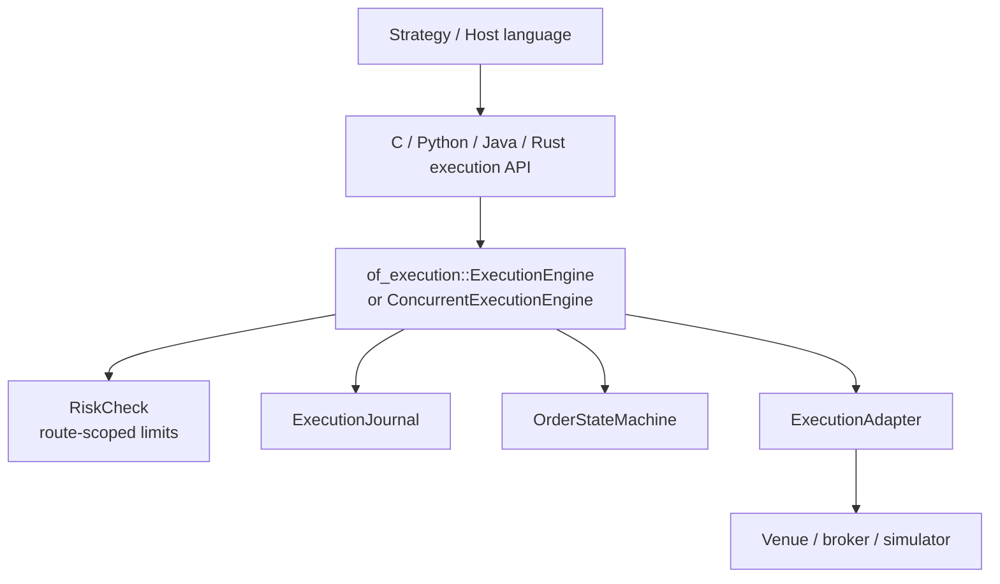
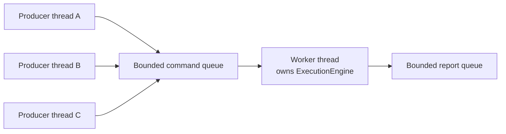
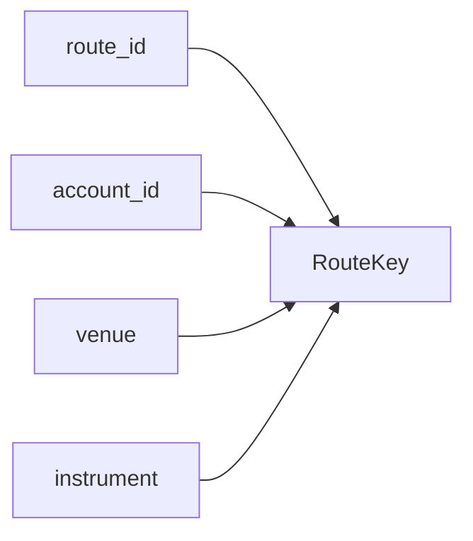
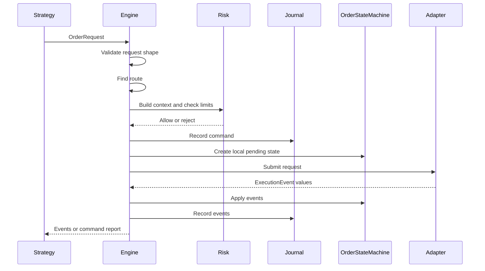
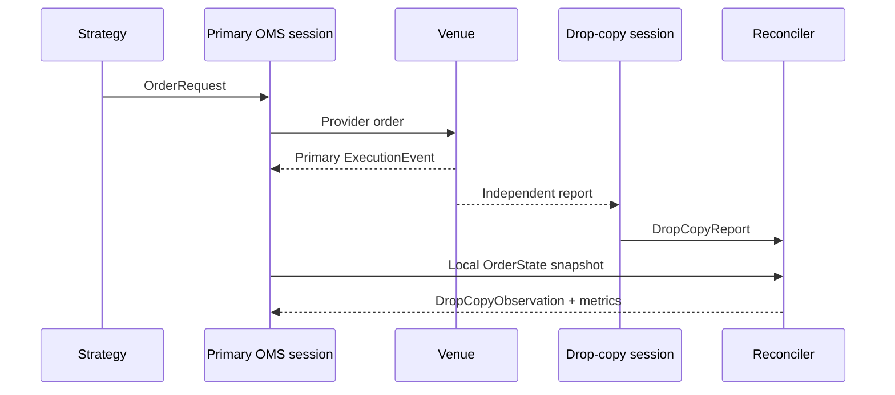
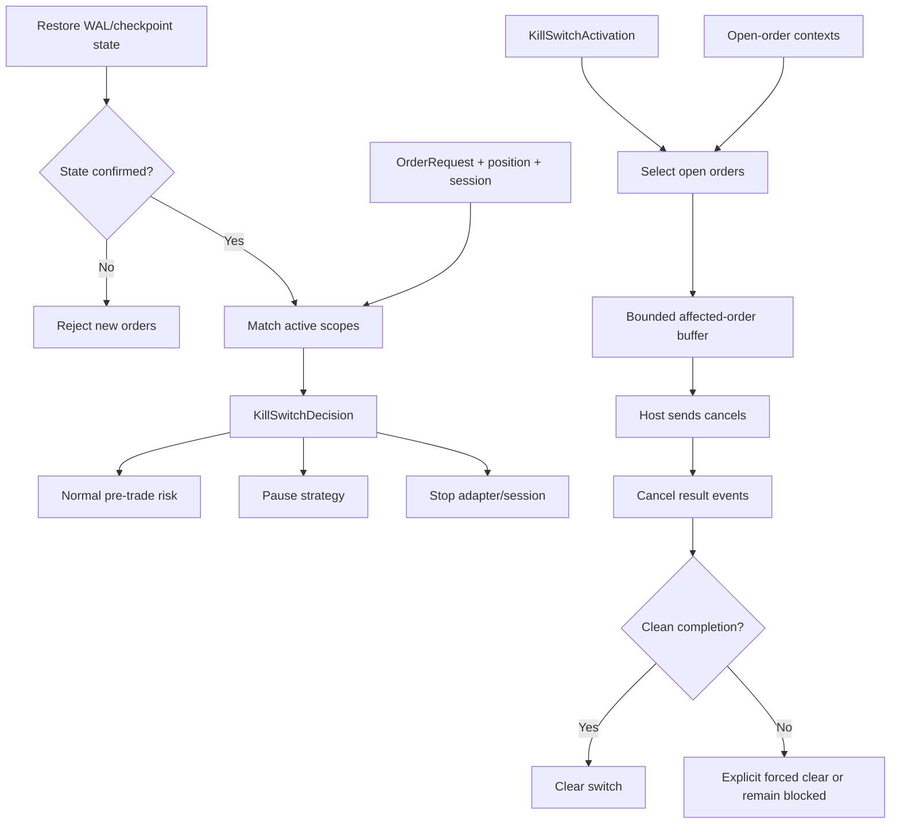

# OMS Architecture

This chapter explains the execution and order-management subsystem as a system,
not just as individual API types.

The OMS is additive to the market-data runtime. It does not replace
`of_runtime`, and it does not mix order execution state with analytics state.
Strategy code can consume analytics from `of_runtime` and send orders through
the execution APIs, but those two domains remain separate.

## Layer Map

## Core Separation

| Layer | Responsibility |
| --- | --- |
| `of_execution_core` | Canonical typed execution model |
| `of_execution` | Routing, risk context, state, journals, workers, OMS helpers |
| `of_execution_adapters` | Provider-specific adapter scaffolds |
| `of_ffi_c` | Stable native ABI for execution handles |
| Python/Java bindings | Ergonomic wrappers over the C ABI |

This split is deliberate. The execution core should not know about sockets,
worker threads, provider APIs, or host-language wrappers. The engine should not
know how a specific broker encodes a request. Bindings should not duplicate
order-state logic.

## Synchronous Engine

`ExecutionEngine` is the deterministic core. It owns mutable order state and is
driven by method calls:

- `start`
- `submit`
- `cancel`
- `amend`
- `poll`
- `recover_open_orders`

It requires `&mut self`, which means callers cannot mutate the engine from two
Rust threads at the same time without adding an owner. That is a feature, not a
limitation. OMS state should not be mutated concurrently without explicit
ordering.

## Concurrent Worker

`ConcurrentExecutionEngine` solves concurrent producer access without making
the state machine concurrent.

Properties:

- many producer handles can enqueue commands,
- command queue is bounded,
- report queue is bounded,
- one worker owns adapter and order state,
- reports include command sequence and events,
- no Tokio runtime is required,
- no order-state mutation happens in parallel.

This model keeps latency predictable and makes replay/audit reasoning simpler.

## Route Scoping

Execution routes are keyed by:

The engine indexes these keys internally. Risk calculations such as open order
count and open notional are scoped to the matching route. This avoids accidental
cross-symbol contamination.

Example:

- ES route has one open order and max open orders of one.
- NQ route has no open orders and max open orders of one.
- A second ES order is rejected.
- A first NQ order is allowed.

## Command Flow

New order flow:

Cancel/replace flow is similar, but starts by verifying the original client
order id is known locally.

## Event Flow

Execution events can come from:

- synchronous adapter responses,
- adapter `poll`,
- recovery/restatement,
- local risk rejection,
- local lifecycle/degradation handling.

Every event should be canonical `ExecutionEvent`. Adapters should not leak
provider-specific report structs past the adapter boundary.

## Journaling and Recovery

The journal records commands and events. A durable journal is the foundation for
crash recovery:

1. replay prior commands/events,
2. rebuild local state,
3. reconnect adapter,
4. request venue open orders,
5. reconcile local vs venue state,
6. emit restatements for differences.

`FileExecutionJournal` is the current append-only durable implementation. It is
small and deterministic; production deployments may replace it with an fsync
policy, WAL, or database-backed journal through the `ExecutionJournal` trait.

## Reconciliation

`reconcile_open_orders(local, venue)` compares two sets of `OrderState` values
and preserves the original simple classification:

- `Matched`
- `VenueOnly`
- `LocalOnly`
- `RestateFromVenue`

The function does not mutate state. It reports differences so the caller can
decide whether to restate, cancel, alert, or halt trading.

`reconcile_open_orders_detailed(local, venue)` adds production-oriented issue
classification:

- `QuantityMismatch`
- `StatusMismatch`
- `PriceMismatch`
- `Unknown`

`ReconciliationPolicy` maps each issue to a host action. The default is fail
closed. Other actions let the host accept venue truth, cancel venue-only
orders, restate venue-only orders locally, or require operator approval. The
policy evaluator returns `ReconciliationPolicyDecision`, which keeps
submissions disabled while any host action is still required.

`ExecutionEngine::reconcile_open_orders_with(venue)` and
`ExecutionEngine::evaluate_reconciliation(venue, policy)` apply those helpers
to the engine's current local non-terminal order states.

## Independent Drop Copy

The primary order-entry session is not the only source of execution truth.
`DropCopyAdapter` models a separate provider session that maps independent
reports into canonical `DropCopyReport` values. Keeping it separate avoids
coupling order submission availability to the credentials, sequence state, or
recovery state of the independent evidence channel.

`DropCopyReconciler` provides four deterministic stages:

1. deduplicate by source plus report id, or source plus sequence;
2. classify timestamp and cumulative-fill regressions under an explicit late
   policy;
3. correlate venue order id first and client-order aliases second; and
4. compare identity, routing, status, fill quantities, leaves, and average
   price without mutating OMS state.

Duplicate identity retention and report/progress queues are bounded. Capacity
exhaustion is observable, not silently expanded. Report timestamps are supplied
by the adapter or host, so the hot path does not read clocks. Policy decisions,
WAL writes, alert delivery, JSON export, and operator actions remain outside the
reconciler and can use the existing safety and recovery gates.

## Scoped Kill-Switch Control Plane

`KillSwitchRegistry` is a separate control-plane state machine. It complements
the route-level risk flag without changing current `ExecutionEngine`
construction or adapter trait requirements.

The decision path is synchronous and allocation-free after registry
construction. Scope matching uses fixed-size identifiers. Emergency actions do
not invoke user callbacks or provider code while registry state is borrowed.
The host journals each typed event, dispatches selected cancels, records unique
results, and performs adapter shutdown outside the registry.

Recovery is conservative. Unknown switch state blocks new orders while keeping
cancel flow available. A switch requiring cancellation cannot be cleared
normally until every captured affected order succeeds. Truncated target output,
failed cancels, or incomplete attempts remain visible and require an explicit
forced-clear event rather than silently reopening flow.

## Safety Policies

`RouteSafetyPolicy` and `DisconnectPolicy` describe what should happen when
the adapter disconnects or a kill switch is active.

Possible policies:

- hold working orders,
- reject new orders,
- cancel open orders,
- freeze all commands,
- allow cancels while killed.

Policies are separate from adapter code so users can apply them consistently
across FIX, REST, WebSocket, or broker SDK adapters.

## Position Ledger

`PositionLedger` folds trade events into position state. It is intentionally
small:

- net quantity,
- buy quantity,
- sell quantity,
- gross notional,
- average price.

The ledger is not a complete accounting system. It is the OMS-side building
block for exposure checks, strategy attribution, and reconciliation with broker
positions.

## Sharding

`ShardRouter` maps route/account/symbol keys to shard indexes. A sharded OMS can
run one worker per shard:

- deterministic within a shard,
- parallel across independent shards,
- useful for many symbols or venues.

The current helper gives deterministic routing. A full sharded runtime can be
built additively around it.

## Binding Model

The C ABI exposes separate handles for:

- synchronous execution engine,
- concurrent execution engine.

Python and Java mirror this separation:

- Python: `ExecutionEngine`, `ConcurrentExecutionEngine`
- Java: `OrderflowExecutionEngine`, `ConcurrentOrderflowExecutionEngine`

Existing synchronous APIs are not changed.
