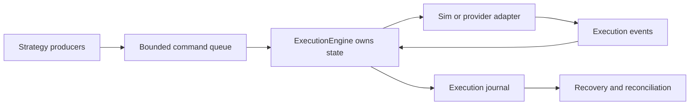

# OMS Cookbook

This cookbook shows common OMS workflows added in the `0.4.0` release. The
examples are safe by default: they use simulated execution, route-scoped risk,
bounded event buffers, and deterministic command reports.

The OMS layer is not a broker-certified production system by itself. It gives
developers the reusable pieces needed to build one:

- typed submit/cancel/amend requests,
- route/account/symbol risk checks,
- strict order-state transitions,
- synchronous and concurrent execution ownership models,
- bounded command/report queues,
- journals and replay helpers,
- reconciliation and recovery primitives,
- provider adapter scaffolding.



## 0. Choosing The Correct Execution Model

| Model | Use When | Tradeoff |
| --- | --- | --- |
| `ExecutionEngine` | one thread owns execution and calls submit/cancel/amend directly | simplest and most deterministic |
| `ConcurrentExecutionEngine` | multiple producers need to enqueue orders into one native owner | adds bounded queues and command reports |
| Custom `ExecutionAdapter` | you are connecting a broker, exchange, REST API, WebSocket API, FIX session, or SDK | you own provider correctness and certification |
| `of_execution_adapters::fix` | you want shared FIX report mapping scaffolding | not a full FIX transport |

Use the synchronous engine first. Move to the concurrent worker only when the
host application really has multiple producers or must isolate execution
ownership from strategy threads.

## 0.1 Full Safe OMS Session

Python:

```python
from orderflow import (
    CancelRequest,
    ExecutionEngine,
    ExecutionOrderType,
    ExecutionSide,
    ExecutionTimeInForce,
    OrderRequest,
    RiskLimits,
    RouteConfig,
)

limits = RiskLimits(
    kill_switch=False,
    max_order_qty=5,
    max_order_notional=1_000_000,
    max_open_orders=1,
    max_open_notional=1_000_000,
    price_band_ticks=0,
)
routes = [RouteConfig("SIM", "ACC", "SIM", "ES", True, limits)]

with ExecutionEngine(routes) as execution:
    submit_events = execution.submit_order(OrderRequest(
        "OMS-0001",
        "ACC",
        "SIM",
        "DOCS",
        "SIM",
        "ES",
        ExecutionSide.BUY,
        ExecutionOrderType.LIMIT,
        ExecutionTimeInForce.DAY,
        1,
        500_000,
    ))
    print("submit", submit_events)

    state = execution.order_state("OMS-0001")
    print("state", state)

    cancel_events = execution.cancel_order(CancelRequest(
        "OMS-CXL-0001",
        "OMS-0001",
        state.venue_order_id,
        "ACC",
        "SIM",
        "SIM",
        "ES",
    ))
    print("cancel", cancel_events)
    print("metrics", execution.execution_metrics())
```

This session demonstrates the important invariants:

- every order has a strategy-generated client order id;
- route, account, venue, and symbol are explicit in the command;
- the engine validates and risk-checks locally before adapter routing;
- returned execution events are the source of order-state truth;
- cancel uses a new cancel client id plus the original client id.

## 1. Configure Multi-Symbol Routes

Python:

```python
from orderflow import RiskLimits, RouteConfig

limits = RiskLimits(
    kill_switch=False,
    max_order_qty=100,
    max_order_notional=1_000_000,
    max_open_orders=10,
    max_open_notional=10_000_000,
    price_band_ticks=0,
)

routes = [
    RouteConfig("SIM", "ACC", "SIM", "ES", True, limits),
    RouteConfig("SIM", "ACC", "SIM", "NQ", True, limits),
]
```

Use one route per route/account/symbol scope. Do not use one generic route and
switch symbols inside adapter code; that weakens risk accounting.

## 2. Submit Through The Synchronous Engine

Python:

```python
from orderflow import (
    ExecutionEngine, ExecutionOrderType, ExecutionSide, ExecutionTimeInForce,
    OrderRequest,
)

with ExecutionEngine(routes) as execution:
    events = execution.submit_order(OrderRequest(
        "C1", "ACC", "SIM", "STRAT", "SIM", "ES",
        ExecutionSide.BUY,
        ExecutionOrderType.LIMIT,
        ExecutionTimeInForce.DAY,
        10,
        5000,
    ))
    print(events[-1].order_status)
```

Use this shape when your host already has a single execution owner thread.

## 3. Submit Through The Concurrent Worker

Python:

```python
from orderflow import ConcurrentExecutionEngine

with ConcurrentExecutionEngine(routes) as execution:
    sequence = execution.submit_order(OrderRequest(
        "C2", "ACC", "SIM", "STRAT", "SIM", "NQ",
        ExecutionSide.BUY,
        ExecutionOrderType.LIMIT,
        ExecutionTimeInForce.DAY,
        10,
        17000,
    ))

    report = None
    while report is None:
        report = execution.try_recv_report()

    assert report.sequence == sequence
    print(report.result_code, report.events)
```

Use this shape when many producers need to enqueue commands but you still want
one native owner for order state.

## 4. Handle Risk Rejection

Python:

```python
from orderflow import OrderflowRiskError

try:
    events = execution.submit_order(request)
except OrderflowRiskError as exc:
    for event in exc.events:
        print(event.reason, event.text)
```

Risk rejections produce structured execution events. Do not infer rejection
from absence of events.

## 5. Use Route-Scoped Open Order Limits

Set `max_open_orders` per route. The engine counts only non-terminal orders for
the matched route/account/symbol.

This supports strategies such as:

- max one ES working order,
- max one NQ working order,
- same account and route id,
- independent per-symbol limits.

## 6. Recover After Restart

Rust:

```rust
use of_execution::{FileExecutionJournal, ExecutionJournal};

let journal = FileExecutionJournal::open("execution.log", true)?;
let mut records = Vec::new();
journal.replay(&mut records)?;
```

The durable journal gives you command/event history. After replay, reconnect to
the venue and reconcile open orders.

## 7. Reconcile Local and Venue State

Rust:

```rust
use of_execution::reconcile_open_orders;

let report = reconcile_open_orders(&local_open_orders, &venue_open_orders);
if !report.is_clean() {
    // restate, alert, cancel, or halt according to policy
}
```

Reconciliation is a decision aid. It does not mutate engine state by itself.

## 8. Add Event Fanout

Rust:

```rust
use of_execution::ExecutionEventFanout;

let fanout = ExecutionEventFanout::new(1024);
let subscriber = fanout.subscribe();
fanout.publish_buffer(&events);
```

Each subscriber has bounded capacity. Full subscriber queues drop deliveries and
increment `dropped_events`.

## 9. Apply Throttling

Rust:

```rust
use of_execution::OrderThrottle;

let mut throttle = OrderThrottle::new(50, 50);
if throttle.allow(now_ns) {
    sender.try_submit(req)?;
}
```

Use throttle checks before enqueueing commands to avoid filling the command
queue with requests the venue would rate-limit anyway.

## 10. Replay A Strategy Decision Sequence

Rust:

```rust
use of_execution::{ReplayDecision, replay_simulated_oms};

let result = replay_simulated_oms(routes, &decisions)?;
assert_eq!(result.reports.len(), decisions.len());
```

Replay simulation is useful for strategy validation and regression tests.

## 11. Java Concurrent Worker

```java
try (ConcurrentOrderflowExecutionEngine execution =
         new ConcurrentOrderflowExecutionEngine(null, routes)) {
    long sequence = execution.submitOrder(request);
    Optional<ExecutionCommandReport> report = execution.tryRecvReport();
}
```

The Java class mirrors the C ABI. It queues commands and polls reports; it does
not duplicate native state-machine logic.

## 12. C Concurrent Worker

```c
uint64_t sequence = 0;
of_execution_concurrent_submit_order(engine, &request, &sequence);

of_execution_command_report_t report;
uint32_t len = 32;
of_execution_event_t events[32];
int32_t rc = of_execution_concurrent_try_recv_report(
    engine, &report, events, &len);
```

If no report is ready, the function returns `OF_ERR_BACKPRESSURE`. That is the
non-blocking empty condition, not a fatal error.

## 13. Make Submit, Cancel, And Amend Retries Idempotent

Use `IdempotencyRegistry` immediately before the durable command journal. The
registry is deliberately separate from `ExecutionEngine`: it cannot claim a
WAL write or network send succeeded, so the host advances it only after those
operations actually complete.

```rust
use of_execution::{
    AdapterCommandId, CommandId, IdempotencyCompletion, IdempotencyDecision,
    IdempotencyKey, IdempotencyRegistry, IdempotencyScopeId,
    IdempotentExecutionCommand, RequestId,
};

let mut idempotency = IdempotencyRegistry::new(100_000)?;
let key = IdempotencyKey::new(
    IdempotencyScopeId::new("strategy-gateway-a")?,
    RequestId::new("strategy-request-000042")?,
)?;
let command = IdempotentExecutionCommand::Submit(req);

match idempotency.reserve(1, now_ns, key, CommandId(42), command)? {
    IdempotencyDecision::Accepted(record) => {
        // Append record.key, record.command_id, record.command, and the OMS
        // mutation sequence to the WAL. Do not send if this fails.
        wal_append_command(record)?;
        idempotency.mark_journaled(2, now_ns + 1, key)?;

        // The adapter maps this stable value to a provider token or FIX
        // ClOrdID according to its profile.
        let provider_id = AdapterCommandId::new("GW-A-000042")?;
        adapter_send(record.command, provider_id)?;
        idempotency.mark_sent(3, now_ns + 2, key, provider_id)?;
    }
    IdempotencyDecision::Duplicate(original) => {
        // Return or inspect original.state. Never call adapter_send here.
        return_existing_result(original)?;
    }
}

// Fold an authoritative ack/reject using the same key.
idempotency.complete(
    4,
    now_ns + 10,
    key,
    IdempotencyCompletion::Acknowledged,
)?;
```

The same flow protects cancel and amend commands by using
`IdempotentExecutionCommand::Cancel` or `::Amend`. A retry may have a different
receive timestamp. It must not change any routing, account, symbol, quantity,
price, side, order type, time-in-force, current client ID, original client ID,
or venue order ID.

### Restart Or Ambiguous Send

Checkpoint after ordered mutations:

```rust
let checkpoint = idempotency.checkpoint();
let mut encoded = vec![0_u8; checkpoint.encoded_len()];
checkpoint.encode_into(&mut encoded)?;
checkpoint_store.save_bytes_atomically(&encoded)?;
```

After restart:

```rust
let encoded = checkpoint_store.load_latest_bytes()?;
let checkpoint = of_execution::IdempotencyCheckpoint::decode(&encoded)?;
let mut idempotency = IdempotencyRegistry::restore(&checkpoint, 100_000)?;
let record = idempotency.get(key).expect("checkpoint retained command");
assert_eq!(record.state, of_execution::IdempotencyState::RecoveryPending);

match venue_query(record.command, record.adapter_command_id)? {
    VenueTruth::Accepted => {
        idempotency.complete(
            next_sequence,
            now_ns,
            key,
            IdempotencyCompletion::Acknowledged,
        )?;
    }
    VenueTruth::Rejected => {
        idempotency.complete(
            next_sequence,
            now_ns,
            key,
            IdempotencyCompletion::Rejected,
        )?;
    }
    VenueTruth::AbsentAfterAuthoritativeRecovery => {
        let original = idempotency.retry_after_reconciliation(
            next_sequence,
            now_ns,
            key,
        )?;
        // Reuse original.command and original.adapter_command_id. Do not
        // manufacture a new semantic request under the old key.
    }
    VenueTruth::Unknown => {
        // Stay fail closed in RecoveryPending and escalate.
    }
}
```

Never infer `AbsentAfterAuthoritativeRecovery` from a timeout alone. For FIX,
complete session sequence recovery and use order-status/mass-status or drop-copy
evidence required by the counterparty profile.

### Suppress Duplicate Reports Before State Mutation

```rust
use of_execution::{
    ExecutionReportDeduplicator, ExecutionReportDisposition,
    ExecutionReportKey, ExecutionReportSourceId,
};

let mut reports = ExecutionReportDeduplicator::new(1_000_000)?;
let key = ExecutionReportKey::from_event(
    ExecutionReportSourceId::new("FIX-DROP-A")?,
    &event,
    provider_sequence,
)?;
if reports.observe(key)? == ExecutionReportDisposition::Fresh {
    apply_to_order_state(event)?;
    apply_to_position_ledger(event)?;
}
```

Checkpoint `reports.checkpoint()` in the same recovery generation as order and
position state. Alert on `reports.metrics().evicted`: it means the retained
identity horizon advanced, and a replay older than that horizon can no longer
be proven duplicate by this window.

Persist the report checkpoint with its `encoded_len`/`encode_into` binary codec
and recover with `ExecutionReportDedupCheckpoint::decode`. Install command,
report, order-tree, and position checkpoints under one host generation only
after every component has reached the same WAL sequence boundary.

## 14. Gate Recovery With All Evidence Sources

After WAL/checkpoint restore, obtain fresh adapter open orders (FIX mass status
or provider equivalent), drain independent drop copy through the recovery
boundary, and reconcile broker positions with `ProductionPositionLedger`.
Create an `OmsEvidenceWatermark` for every required source only after that
source has proved integrity and completeness.

Use `OmsReconciliationCoordinator::reconcile_orders` repeatedly for WAL,
checkpoint, adapter, and drop-copy order snapshots against local OMS state.
Pass the output of `reconcile_production_positions` to
`observe_position_report`. Then call `finish`.

Do not resume when `submissions_enabled` is false. Execute the selected policy
actions, retain the findings in the audit bundle, and run a new cycle from
fresh evidence. A timeout, missing mass-status completion, mismatched claimed
row count, stale sequence, corrupt checkpoint, or exhausted finding buffer is
a blocked recovery, not a clean result.

## 15. Certify OMS Failure Handling Before Provider Testing

Use `CertificationVenue` as the adapter behind an `ExecutionEngine` or call it
directly while testing an adapter-facing component. Build the script in the
same order the host will invoke adapter methods. This example proves an
accepted working order, an in-flight cancel race, duplicate delivery,
disconnect/reconnect, and recovery restatement without sockets or clocks:

```rust
use of_execution::{
    CertificationRaceOutcome, CertificationScenario, CertificationVenue,
    ExecutionAdapter, ExecutionEventBuffer,
};
use of_execution_core::{
    AccountId, CancelRequest, ClientOrderId, ExecutionSymbol, OrderPrice,
    OrderQty, OrderRequest, OrderSide, OrderType, RouteId, StrategyId,
    TimeInForce, VenueOrderId,
};

fn main() -> Result<(), Box<dyn std::error::Error>> {
    let account = AccountId::new("ACCOUNT-A")?;
    let route = RouteId::new("CERT")?;
    let symbol = ExecutionSymbol::new("XCME", "ESM6")?;
    let order_id = ClientOrderId::new("ORDER-1")?;

    let mut venue = CertificationVenue::default();
    venue.enqueue_all([
        CertificationScenario::Accept,
        CertificationScenario::CancelReplaceRace {
            fill_quantity: OrderQty(2),
            fill_price: OrderPrice(5_250_00),
            outcome: CertificationRaceOutcome::Reject,
        },
        CertificationScenario::DuplicateReports { copies: 1 },
        CertificationScenario::Disconnect,
        CertificationScenario::Reconnect,
        CertificationScenario::RecoveryRestatement,
    ])?;
    venue.connect()?;

    let request = OrderRequest {
        client_order_id: order_id,
        account_id: account,
        route_id: route,
        strategy_id: StrategyId::new("TWAP-A")?,
        symbol,
        side: OrderSide::Buy,
        order_type: OrderType::Limit,
        time_in_force: TimeInForce::Day,
        quantity: OrderQty(10),
        limit_price: OrderPrice(5_250_00),
        stop_price: OrderPrice(0),
        ts_exchange_ns: 1_000,
        ts_recv_ns: 1_001,
    };
    let mut reports = ExecutionEventBuffer::with_capacity(32);
    venue.submit(&request, &mut reports)?;

    venue.cancel(
        &CancelRequest {
            client_order_id: ClientOrderId::new("CANCEL-1")?,
            orig_client_order_id: order_id,
            venue_order_id: VenueOrderId::empty(),
            account_id: account,
            route_id: route,
            symbol,
            ts_recv_ns: 1_010,
        },
        &mut reports,
    )?;
    venue.poll(&mut reports)?; // duplicate latest report
    venue.poll(&mut reports)?; // disconnect
    assert!(!venue.health().connected);
    venue.poll(&mut reports)?; // reconnect
    assert!(venue.health().connected);
    venue.recover_open_orders(&mut reports)?;

    let snapshot = venue.snapshot();
    assert_eq!(snapshot.remaining_scenarios(), 0);
    assert!(snapshot.coverage().count(
        of_execution::CertificationScenarioKind::CancelReplaceRace
    ) > 0);
    Ok(())
}
```

For a complete suite, execute every value in
`CertificationScenarioKind::ALL` and require
`snapshot.coverage().is_complete()`. Persist or serialize the host's copy of
`transcript()` and retained report metadata with the test build/version and
adapter profile. The crate intentionally does not write evidence files or
declare a provider certification result.

Operational rules:

1. Use separate scripts for normal flow, recovery, and each provider profile.
2. Keep output buffers large enough for the largest atomic scenario or assert
   the expected `ExecutionError::BufferFull` response.
3. Test duplicates before any state or position mutation by placing the real
   deduplicator in the loop.
4. Test sequence reset and resend against the provider profile's actual FIX or
   native-session rules.
5. Run the same OMS assertions in the provider's official certification
   environment before enabling live routes.

## 16. Measure Execution SLOs Without Polluting The Hot Path

Create one `ExecutionSloCollector` per stable execution scope and keep it next
to the single owner of that scope. Capture timestamps in the host before and
after the adapter boundary, then submit the complete observation in one call.
Never use wall-clock or exchange timestamps as endpoints of host-monotonic
latencies.

```rust
use of_execution::{
    ExecutionLatencyKind, ExecutionOperationalObservation, ExecutionQueueKind,
    ExecutionRouteHealth, ExecutionSloCollector, ExecutionSloTargets,
    ExecutionSubmitObservation, ExecutionSubmitOutcome,
};

fn sample_and_evaluate() -> Result<bool, of_execution::ExecutionMetricsError> {
    let mut sli = ExecutionSloCollector::new();
    sli.observe_submit(ExecutionSubmitObservation::new(
        10_000,
        10_250,
        11_000,
        ExecutionSubmitOutcome::Ack,
    ))?;
    sli.observe_fill(10_000, 12_500)?;
    sli.observe_operational(
        ExecutionOperationalObservation::new(20_000)
            .with_queue_depths(1, 2, 0)
            .with_wal_progress(500, 499, Some(19_900))
            .with_checkpoint_ns(15_000)
            .with_reconciliation_mismatches(0)
            .with_route_health(ExecutionRouteHealth::Healthy)
            .with_drop_copy_lag_ns(400),
    )?;

    let targets = ExecutionSloTargets::new()
        .with_latency_p99_ns(ExecutionLatencyKind::SubmitToAck, 2_000)
        .with_latency_p99_ns(ExecutionLatencyKind::DropCopyLag, 1_000)
        .with_queue_depth(ExecutionQueueKind::Command, 64)
        .with_wal_lag_records(8)
        .with_checkpoint_age_ns(10_000)
        .with_reconciliation_mismatch_count(0)
        .with_healthy_route_required(true)
        .with_minimum_samples(1);
    Ok(sli.snapshot().evaluate(targets).is_compliant())
}

assert!(sample_and_evaluate()?);
# Ok::<(), of_execution::ExecutionMetricsError>(())
```

Production sampling loop:

1. Capture local timestamps from one monotonic source.
2. Validate and record complete command/report observations on the owner.
3. Sample queues, durability, recovery, reconciliation, route, and drop-copy
   state at a bounded control-plane cadence.
4. Copy `snapshot()` to the sampler; do not share/mutex the collector among
   producers.
5. Evaluate explicit targets and map violation flags into alert and safety
   policy.
6. Export stable series such as route, venue, and account group. Never attach
   order id, execution id, client id, or raw symbol unless cardinality is
   independently bounded.
7. Preserve the SLO snapshot and report in an incident audit bundle.

Prometheus users should export histogram buckets only when cross-instance
quantiles are required; otherwise typed p50/p95/p99 gauges are inexpensive but
cannot be re-aggregated as distributions. OpenTelemetry users should define
Views in the host to choose boundaries and attribute sets. See the official
[OpenTelemetry Metrics SDK](https://opentelemetry.io/docs/specs/otel/metrics/sdk/),
[Prometheus histogram practices](https://prometheus.io/docs/practices/histograms/),
and [Google SRE SLO workbook](https://sre.google/workbook/implementing-slos/).
