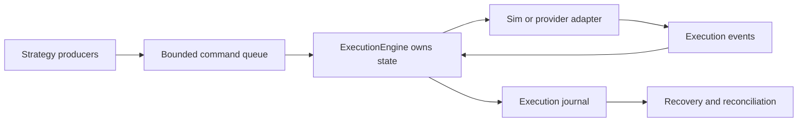

# OMS Cookbook

This cookbook shows common OMS workflows added in the `0.4.0` release. The
examples are safe by default: they use simulated execution, route-scoped risk,
bounded event buffers, and deterministic command reports.

The OMS layer is not a broker-certified production system by itself. It gives
developers the reusable pieces needed to build one:

- typed submit/cancel/amend requests,
- route/account/symbol risk checks,
- strict order-state transitions,
- synchronous and concurrent execution ownership models,
- bounded command/report queues,
- journals and replay helpers,
- reconciliation and recovery primitives,
- provider adapter scaffolding.



## 0. Choosing The Correct Execution Model

| Model | Use When | Tradeoff |
| --- | --- | --- |
| `ExecutionEngine` | one thread owns execution and calls submit/cancel/amend directly | simplest and most deterministic |
| `ConcurrentExecutionEngine` | multiple producers need to enqueue orders into one native owner | adds bounded queues and command reports |
| Custom `ExecutionAdapter` | you are connecting a broker, exchange, REST API, WebSocket API, FIX session, or SDK | you own provider correctness and certification |
| `of_execution_adapters::fix` | you want shared FIX report mapping scaffolding | not a full FIX transport |

Use the synchronous engine first. Move to the concurrent worker only when the
host application really has multiple producers or must isolate execution
ownership from strategy threads.

## 0.1 Full Safe OMS Session

Python:

```python
from orderflow import (
    CancelRequest,
    ExecutionEngine,
    ExecutionOrderType,
    ExecutionSide,
    ExecutionTimeInForce,
    OrderRequest,
    RiskLimits,
    RouteConfig,
)

limits = RiskLimits(
    kill_switch=False,
    max_order_qty=5,
    max_order_notional=1_000_000,
    max_open_orders=1,
    max_open_notional=1_000_000,
    price_band_ticks=0,
)
routes = [RouteConfig("SIM", "ACC", "SIM", "ES", True, limits)]

with ExecutionEngine(routes) as execution:
    submit_events = execution.submit_order(OrderRequest(
        "OMS-0001",
        "ACC",
        "SIM",
        "DOCS",
        "SIM",
        "ES",
        ExecutionSide.BUY,
        ExecutionOrderType.LIMIT,
        ExecutionTimeInForce.DAY,
        1,
        500_000,
    ))
    print("submit", submit_events)

    state = execution.order_state("OMS-0001")
    print("state", state)

    cancel_events = execution.cancel_order(CancelRequest(
        "OMS-CXL-0001",
        "OMS-0001",
        state.venue_order_id,
        "ACC",
        "SIM",
        "SIM",
        "ES",
    ))
    print("cancel", cancel_events)
    print("metrics", execution.execution_metrics())
```

This session demonstrates the important invariants:

- every order has a strategy-generated client order id;
- route, account, venue, and symbol are explicit in the command;
- the engine validates and risk-checks locally before adapter routing;
- returned execution events are the source of order-state truth;
- cancel uses a new cancel client id plus the original client id.

## 1. Configure Multi-Symbol Routes

Python:

```python
from orderflow import RiskLimits, RouteConfig

limits = RiskLimits(
    kill_switch=False,
    max_order_qty=100,
    max_order_notional=1_000_000,
    max_open_orders=10,
    max_open_notional=10_000_000,
    price_band_ticks=0,
)

routes = [
    RouteConfig("SIM", "ACC", "SIM", "ES", True, limits),
    RouteConfig("SIM", "ACC", "SIM", "NQ", True, limits),
]
```

Use one route per route/account/symbol scope. Do not use one generic route and
switch symbols inside adapter code; that weakens risk accounting.

## 2. Submit Through The Synchronous Engine

Python:

```python
from orderflow import (
    ExecutionEngine, ExecutionOrderType, ExecutionSide, ExecutionTimeInForce,
    OrderRequest,
)

with ExecutionEngine(routes) as execution:
    events = execution.submit_order(OrderRequest(
        "C1", "ACC", "SIM", "STRAT", "SIM", "ES",
        ExecutionSide.BUY,
        ExecutionOrderType.LIMIT,
        ExecutionTimeInForce.DAY,
        10,
        5000,
    ))
    print(events[-1].order_status)
```

Use this shape when your host already has a single execution owner thread.

## 3. Submit Through The Concurrent Worker

Python:

```python
from orderflow import ConcurrentExecutionEngine

with ConcurrentExecutionEngine(routes) as execution:
    sequence = execution.submit_order(OrderRequest(
        "C2", "ACC", "SIM", "STRAT", "SIM", "NQ",
        ExecutionSide.BUY,
        ExecutionOrderType.LIMIT,
        ExecutionTimeInForce.DAY,
        10,
        17000,
    ))

    report = None
    while report is None:
        report = execution.try_recv_report()

    assert report.sequence == sequence
    print(report.result_code, report.events)
```

Use this shape when many producers need to enqueue commands but you still want
one native owner for order state.

## 4. Handle Risk Rejection

Python:

```python
from orderflow import OrderflowRiskError

try:
    events = execution.submit_order(request)
except OrderflowRiskError as exc:
    for event in exc.events:
        print(event.reason, event.text)
```

Risk rejections produce structured execution events. Do not infer rejection
from absence of events.

## 5. Use Route-Scoped Open Order Limits

Set `max_open_orders` per route. The engine counts only non-terminal orders for
the matched route/account/symbol.

This supports strategies such as:

- max one ES working order,
- max one NQ working order,
- same account and route id,
- independent per-symbol limits.

## 6. Recover After Restart

Rust:

```rust
use of_execution::{FileExecutionJournal, ExecutionJournal};

let journal = FileExecutionJournal::open("execution.log", true)?;
let mut records = Vec::new();
journal.replay(&mut records)?;
```

The durable journal gives you command/event history. After replay, reconnect to
the venue and reconcile open orders.

## 7. Reconcile Local and Venue State

Rust:

```rust
use of_execution::reconcile_open_orders;

let report = reconcile_open_orders(&local_open_orders, &venue_open_orders);
if !report.is_clean() {
    // restate, alert, cancel, or halt according to policy
}
```

Reconciliation is a decision aid. It does not mutate engine state by itself.

## 8. Add Event Fanout

Rust:

```rust
use of_execution::ExecutionEventFanout;

let fanout = ExecutionEventFanout::new(1024);
let subscriber = fanout.subscribe();
fanout.publish_buffer(&events);
```

Each subscriber has bounded capacity. Full subscriber queues drop deliveries and
increment `dropped_events`.

## 9. Apply Throttling

Rust:

```rust
use of_execution::OrderThrottle;

let mut throttle = OrderThrottle::new(50, 50);
if throttle.allow(now_ns) {
    sender.try_submit(req)?;
}
```

Use throttle checks before enqueueing commands to avoid filling the command
queue with requests the venue would rate-limit anyway.

## 10. Replay A Strategy Decision Sequence

Rust:

```rust
use of_execution::{ReplayDecision, replay_simulated_oms};

let result = replay_simulated_oms(routes, &decisions)?;
assert_eq!(result.reports.len(), decisions.len());
```

Replay simulation is useful for strategy validation and regression tests.

## 11. Java Concurrent Worker

```java
try (ConcurrentOrderflowExecutionEngine execution =
         new ConcurrentOrderflowExecutionEngine(null, routes)) {
    long sequence = execution.submitOrder(request);
    Optional<ExecutionCommandReport> report = execution.tryRecvReport();
}
```

The Java class mirrors the C ABI. It queues commands and polls reports; it does
not duplicate native state-machine logic.

## 12. C Concurrent Worker

```c
uint64_t sequence = 0;
of_execution_concurrent_submit_order(engine, &request, &sequence);

of_execution_command_report_t report;
uint32_t len = 32;
of_execution_event_t events[32];
int32_t rc = of_execution_concurrent_try_recv_report(
    engine, &report, events, &len);
```

If no report is ready, the function returns `OF_ERR_BACKPRESSURE`. That is the
non-blocking empty condition, not a fatal error.
