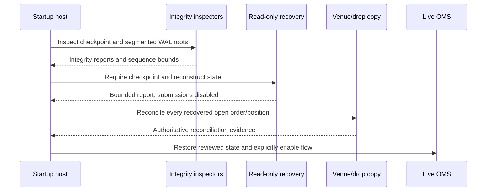

# OMS Recovery And Operations

This chapter is the operational playbook for running the OMS pieces safely.

## Normal Startup

Recommended startup order:

1. load route config,
2. open durable execution journal,
3. replay journal into local state where applicable,
4. create adapter,
5. connect adapter,
6. recover venue open orders,
7. reconcile local and venue state,
8. enable strategy submissions.

Do not allow strategy submissions before recovery and reconciliation are
complete unless the route is explicitly configured for that risk.

## Crash Recovery

After process restart:

1. open journal,
2. replay command/event history,
3. rebuild expected local state,
4. reconnect provider,
5. request open orders,
6. compare with `reconcile_open_orders_detailed`,
7. evaluate a `ReconciliationPolicy`,
8. emit restatements, cancels, or operator-review tasks,
9. enable submissions only after the policy decision no longer blocks them.

If reconciliation finds `VenueOnly` orders, the venue has working orders the
local journal did not know about. Treat this as high severity.

If reconciliation finds `LocalOnly` orders, the local journal thinks something
is working but the venue does not report it. Treat this as a possible missed
terminal report.

Detailed reconciliation also classifies `QuantityMismatch`, `StatusMismatch`,
`PriceMismatch`, and `Unknown`. Use these categories to choose host action:

- default to `ReconciliationPolicy::fail_closed()` during startup recovery;
- use `CancelVenueOrder` only when the venue-only order is definitely unwanted;
- use `AcceptVenueTruth` only after local risk and audit systems can absorb the
  restatement;
- use `RequireOperatorApproval` when the venue snapshot is incomplete or the
  strategy ownership is unclear.

`ExecutionEngine::evaluate_reconciliation(venue_open_orders, policy)` evaluates
the engine's current non-terminal local orders against a venue snapshot. It does
not mutate state or send cancels. Hosts must apply the selected actions, then
re-run reconciliation before resuming strategy submissions.

## Disconnect Handling

Route policy determines behavior:

| Policy | Behavior |
| --- | --- |
| `Hold` | Keep current state and wait |
| `RejectNew` | Stop new orders, allow cancels |
| `CancelOpenOrders` | Attempt cancel of working orders |
| `Freeze` | Reject all strategy commands |

Choose policy per venue and strategy. A market-making strategy may prefer
cancel-on-disconnect; a passive research simulation may prefer hold.

## Kill Switch

There are two relevant kill-switch layers:

- `RiskLimits.kill_switch`: basic risk gate route kill.
- `RouteSafetyPolicy.kill_switch`: operational policy kill.

When a kill switch is active, decide whether cancels should still be allowed.
Most live systems allow cancels while blocking new risk.

## Journal Policy

`FileExecutionJournal::open(path, sync_on_write)` is the human-readable
append-only journal and supports two modes:

- `sync_on_write = true`: safer, slower, fsync-like behavior.
- `sync_on_write = false`: faster, less durable on power loss.

`WalExecutionJournal::open(WalJournalConfig::new(path))` is the binary WAL
option. It validates existing frames before accepting new writes, owns
monotonic WAL sequence assignment, detects checksum failures, and replays into
the same `JournalRecord` model as the text journal.

The engine calls the additive request-aware journal hooks `record_submit`,
`record_cancel`, and `record_amend`. Binary WAL implementations encode complete
typed request payloads, while the default hook implementations preserve the
original `record_command(kind, id, timestamp)` contract for external journal
implementors. Full command payloads let recovery create pending-new state before
execution reports are applied and retain uncertain cancel/replace intent across
a crash. Legacy payload-version-1 frames remain readable; they are projected to
the unchanged public `JournalRecord::Command` shape.

WAL sync policy is explicit:

- `WalSyncPolicy::EveryRecord`: safest and highest latency.
- `WalSyncPolicy::EveryNRecords(n)`: group commit by record count.
- `WalSyncPolicy::EveryDurationNs(ns)`: group commit by elapsed time.
- `WalSyncPolicy::Manual`: caller invokes `sync()`.
- `WalSyncPolicy::Never`: fastest, only appropriate for tests or externally
  replicated environments.
- `WalSyncPolicy::OnRiskBoundary`: sync around command/risk/recovery boundary
  records.

Production deployments should decide based on venue risk, account size, and
host filesystem behavior.

## Segmented WAL Policy

`SegmentedWalExecutionJournal::open(WalSegmentConfig::new(root))` is the
rotated binary WAL option for production-style OMS deployments. It stores
frames under a directory:

```text
execution-wal/
  manifest
  wal-000000000001.ofwal
  wal-000000000002.ofwal
```

Segment rotation is controlled by:

- `WalSegmentConfig::with_max_segment_bytes(bytes)`;
- `WalSegmentConfig::with_max_segment_records(records)`;
- explicit `SegmentedWalExecutionJournal::rotate_segment()`.

Rotation appends a `SegmentSeal` WAL frame to the old file and starts the next
segment id. The seal frame is part of the checksum and sequence chain, but it
does not replay as a command or execution event.

Recovery rules:

- scan segment files by numeric segment id;
- validate every frame checksum;
- validate `previous_checksum` links across segment boundaries;
- validate monotonic WAL sequence continuity;
- rebuild the manifest from segment bytes;
- fail closed on corrupt frames, checksum mismatches, or sequence gaps.
- restore full submit requests as `PendingNew` before applying later reports;
- restore unacknowledged cancel/amend requests as `PendingCancel` or
  `PendingReplace` and require venue reconciliation;
- never invent missing fields for legacy command-only records.

The `manifest` file is an operator inventory. It is not trusted as the source
of truth during recovery because the active segment can be newer than the last
manifest write under relaxed sync policies.

WAL integrity can be inspected through the binding-facing diagnostic APIs:

- C: `of_execution_wal_integrity_report(path, out_report)`;
- Python: `inspect_execution_wal(path, library_path=None)`;
- Java: `OrderflowExecutionEngine.inspectWal(nativePath, walPath)`.
- C segmented root: `of_execution_segmented_wal_integrity_report(root, out_report)`;
- Python segmented root:
  `inspect_execution_segmented_wal(root, library_path=None)`;
- Java segmented root:
  `OrderflowExecutionEngine.inspectSegmentedWal(nativePath, walRoot)`.
- C checkpoint root:
  `of_execution_checkpoint_store_integrity_report(root, out_report)`;
- Python checkpoint root:
  `inspect_execution_checkpoint_store(root, library_path=None)`;
- Java checkpoint root:
  `OrderflowExecutionEngine.inspectCheckpointStore(nativePath, checkpointRoot)`.

Run these diagnostics before a recovery drill, after crash restart, and before
archiving WAL data. Use the segmented-root diagnostic for production rotated
WAL directories because it validates segment files in order and checks
cross-segment continuity. The functions report corrupt or truncated bytes as a
successful call with `valid = false`; missing or unreadable files return an I/O
error. Treat `valid = false` as a fail-closed condition for live submissions
until an operator has reconciled state with the venue.

Checkpoint-store diagnostics are the checkpoint counterpart to WAL scans. They
count discovered `.ofchk` files, valid checkpoints, invalid checkpoints, total
bytes, and the latest valid checkpoint id, covered WAL sequence, and creation
timestamp. Run them before selecting a recovery checkpoint. A corrupt
checkpoint file keeps the API call successful with `valid = false` when the
root is readable, allowing the restart procedure to fall back to the latest
valid checkpoint or require manual venue reconciliation. Missing or unreadable
checkpoint roots return an I/O error.

Low-latency guidance:

- use `WalSyncPolicy::EveryNRecords` or `EveryDurationNs` for group-commit
  behavior when the venue/account risk allows it;
- call `sync()` at explicit risk boundaries if using `Manual`;
- rotate by bytes to bound recovery and retention units;
- rotate by record count when predictable replay batch sizes matter;
- keep the WAL directory on low-latency local storage and archive sealed
  segments off the hot path.
- export `WalJournalMetrics` out of band and alert on write failures, sync
  failures, manifest write failures, unexpected rotation spikes, and write/sync
  latency drift.

## Checkpoint Policy

`FileExecutionCheckpointStore::open(CheckpointConfig::new(root))` provides the
first durable checkpoint store. It is additive to the journal APIs and does not
change engine runtime behavior.

Checkpoint save flow:

1. encode `ExecutionCheckpoint` with schema version and checksum,
2. write bytes to a `.tmp` file in the checkpoint directory,
3. flush the file,
4. call `sync_data()` when `CheckpointConfig::sync_on_save()` is enabled,
5. atomically rename the temp file to `.ofchk`,
6. sync the parent directory on Unix when sync-on-save is enabled.

The checkpoint records the last fully applied WAL sequence. Recovery tooling can
load the latest valid checkpoint and replay WAL records after that sequence.
Current checkpoint contents cover open orders, positions, route config hash,
kill-switch state, and checksum. Venue reconciliation must still run before
strategy submissions resume.

Operational startup should scan the checkpoint root before loading it:

1. call `FileExecutionCheckpointStore::inspect_root(root)` or the binding
   checkpoint diagnostic;
2. fail closed if the root is missing, unreadable, or the report is invalid;
3. ensure `latest_checkpoint_id` is present for checkpoint-based recovery;
4. open the checkpoint store only after the diagnostic result is acceptable;
5. replay WAL records strictly after `latest_last_applied_sequence`;
6. run venue reconciliation before enabling submissions.

The diagnostic path is intentionally outside the low-latency order path. It
does not create directories, save checkpoints, prune old checkpoint files, or
start a background writer.

## Checkpoint Plus WAL Recovery

OMS recovery supports both host-owned stores and a read-only root facade:

- `recover_latest_checkpoint_from_segmented_wal(store, journal)` uses already
  opened store/journal implementations;
- `recover_latest_checkpoint_from_segmented_wal_roots(wal_root,
  checkpoint_root, require_checkpoint)` opens existing roots read-only for
  operator tools and bindings;
- `recover_oms_state_from_segmented_wal_root(wal_root, checkpoint, plan)` uses
  an explicit checkpoint and replay plan without opening an append handle.

Startup flow:



The recovery function loads the latest valid checkpoint, builds
`RecoveryPlan::from_checkpoint`, replays records strictly after
`last_applied_sequence`, applies full command intent and execution events, and
returns `RecoveryResult`. Root-based inspection does not create directories,
open append handles, call a venue, or enable submissions.

`RecoveryPlan` defaults are conservative:

- `RecoveryCorruptionPolicy::FailClosed`;
- `RecoveryVenuePolicy::RequireReconciliation`;
- submissions disabled after recovery.

Current version-2 command frames retain full submit, cancel, and amend requests.
Recovery therefore recreates post-checkpoint orders as `PendingNew`, and
restores unanswered crash-boundary cancel/replace intent as `PendingCancel` or
`PendingReplace`. Version-1 command frames remain readable for compatibility,
but state reconstruction fails closed if one is required to recreate an absent
order because the legacy frame lacks side, strategy, price, and quantity.

This keeps the first recovery layer deterministic:

- same checkpoint plus same WAL bytes produce the same `RecoveredOmsState`;
- corrupt WAL frames are rejected by segmented WAL replay before state rebuild;
- invalid order transitions return errors instead of best-effort state;
- venue reconciliation is explicit, not silently bypassed.

`RecoveryResult::json_report()` and the C/Python/Java recovery facades expose a
bounded schema-versioned summary: checkpoint id, route hash, kill-switch state,
order/position counts, command/event counts, and replay sequence bounds. They
intentionally omit identifiers. This report is restart evidence only; it always
preserves the reconciliation and submission gates.

| Layer | Read-only entry point |
| --- | --- |
| Rust | `recover_latest_checkpoint_from_segmented_wal_roots(...)` |
| C | `of_execution_recovery_report_json(...)` |
| Python | `inspect_execution_recovery(...)` |
| Java | `OrderflowExecutionEngine.inspectRecovery(...)` |

## Metrics To Export

At minimum export:

- submitted count,
- cancel count,
- amend count,
- events applied,
- risk rejections,
- adapter errors,
- recovered events,
- command queue depth,
- report queue depth,
- fanout drops,
- journal write errors,
- reconnect count,
- lifecycle state,
- health sequence.

## Alerting

High-priority alerts:

- adapter disconnected on live route,
- reconciliation not clean,
- fanout drops increasing,
- journal write failure,
- command queue full,
- report queue full,
- kill switch active unexpectedly,
- repeated venue rejects,
- cancel rejects on live working orders.

## Operator Workflow

When an incident occurs:

1. freeze or reject new commands,
2. preserve journal files,
3. capture adapter health,
4. request venue open orders,
5. reconcile,
6. cancel or restate according to policy,
7. restart strategy only after state is understood.

## Backtesting vs Live

Replay and simulation are deterministic tools. They do not prove live adapter
behavior. Live readiness also requires:

- provider conformance tests,
- reconnect tests,
- rate-limit tests,
- cancel/replace tests,
- journal replay tests,
- reconciliation tests.

## Release Checklist For OMS Changes

Before releasing OMS changes:

- run Rust tests with all features,
- run no-default-features tests,
- run clippy with warnings denied,
- run C ABI export check,
- run Python binding smoke,
- run Java binding smoke,
- verify docs coverage,
- verify changelog and handbook updates,
- confirm no API signatures were changed unexpectedly.
