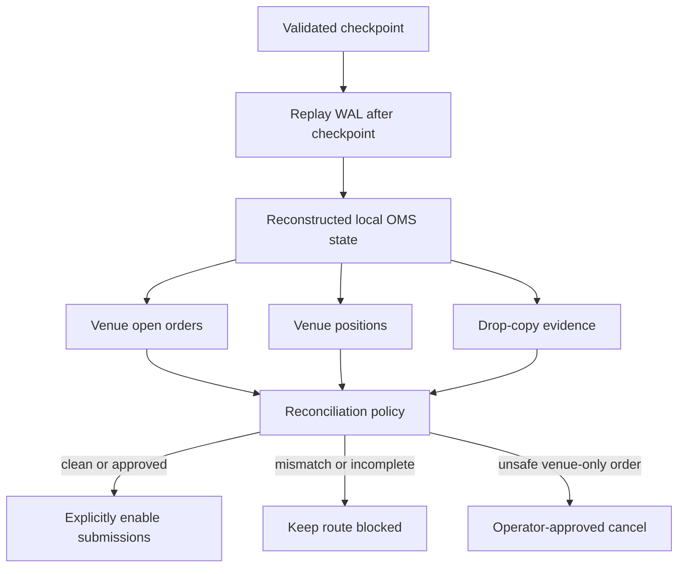
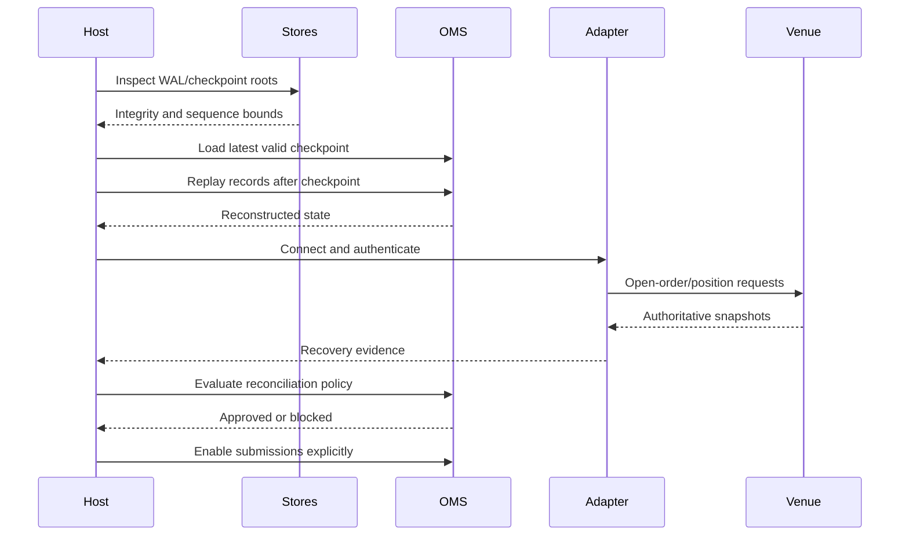
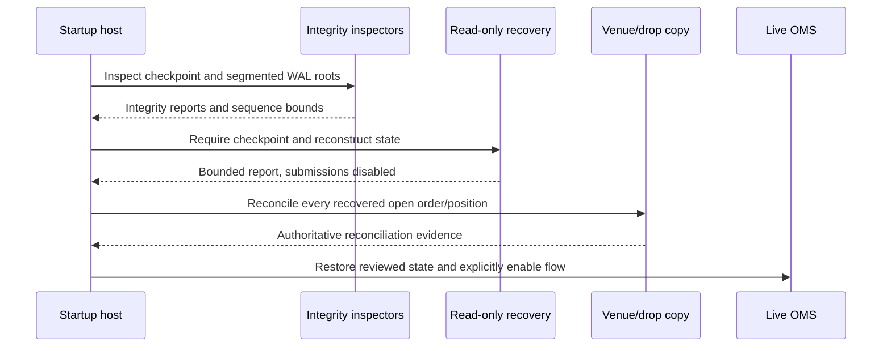

# OMS Recovery And Operations

This chapter is the operational playbook for running the OMS pieces safely. It
is written for the operator, service owner, and integration developer who must
answer three questions during normal operation and failure:

1. What state does Orderflow believe it is in?
2. What state does the venue or external evidence prove?
3. Which actions are safe to take next?

Recovery is not merely restarting a process. It is the controlled reconstruction
of local state, validation of durable evidence, reconciliation against venue
truth, and explicit re-enablement of side effects. A process that starts
successfully but resumes submissions before these gates complete is not
recovered.

## Operating Model

The OMS has several state authorities. They must not be confused:

| Evidence source | What it proves | What it cannot prove alone |
| --- | --- | --- |
| In-memory engine | State applied during the current process lifetime | What happened before process loss or outside the process |
| Execution journal/WAL | Locally accepted commands and observed events | That a provider received an uncertain command |
| Checkpoint | A validated state snapshot through one WAL sequence | Events after the checkpoint or venue truth |
| Provider open-order query | Venue working-order state at its query boundary | Historical fills omitted by the query |
| Drop copy | Independent provider execution evidence | Local command intent that never reached the venue |
| Position snapshot | External position at an as-of point | Why the position differs without correlated evidence |

The safe operating rule is to combine these sources rather than selecting the
most convenient one. Local state is useful for reconstruction; venue and drop
copy evidence are required for external side effects.



### Readiness is a gate, not a boolean shortcut

An adapter may report a connected transport while the OMS is still unsafe to
trade. A useful readiness model evaluates all of these conditions:

- process configuration is valid;
- route and account are enabled;
- journal and checkpoint roots are readable;
- WAL and checkpoint integrity are valid;
- replay completed without corruption;
- adapter authentication and session logon completed;
- provider sequence/session state is synchronized;
- open orders were recovered;
- positions were checked where required;
- reconciliation policy produced an approved result;
- kill-switch and operator controls permit submissions;
- command and report queues have capacity;
- feed freshness and quality are within policy.

If any required condition is unknown, keep the route blocked. “Unknown” is not
equivalent to “healthy.”

## Operational Roles

The following responsibilities may belong to one person in development and to
separate systems in production:

| Role | Responsibility |
| --- | --- |
| Strategy owner | Defines when strategy commands may be enabled and what exposure is acceptable |
| OMS host | Opens stores, replays state, invokes reconciliation, and controls readiness |
| Adapter owner | Maintains provider protocol, capability, session, and recovery behavior |
| Operations owner | Monitors health, queues, latency, incidents, and deployment state |
| Risk owner | Defines kill-switch, limits, disconnect, and mismatch policies |
| Audit owner | Retains journals, checkpoints, transcripts, reports, and operator actions |

The code can enforce many gates, but it cannot infer the business decision for
an ambiguous venue-only order or a position mismatch. Those cases require an
explicit host policy or operator approval.

## State Vocabulary

### Local order states

The canonical order state machine tracks local knowledge of an order. Examples
include pending-new, new, partially-filled, filled, pending-cancel, cancelled,
pending-replace, replaced, rejected, and expired. A local state is the result of
applying accepted canonical events; it is not automatically proof of venue
state.

### Adapter states

Execution adapters commonly move through disconnected, connecting, logon
pending, ready, recovering, degraded, and stopped. Market-data adapters expose
similar concepts through runtime mode and connection state. A route can be
connected but degraded when sequence gaps, stale data, or recovery work remain.

### Recovery states

Use explicit recovery phases in host orchestration:

1. `Created`: process and configuration exist, no durable state loaded.
2. `Inspecting`: integrity reports are being collected.
3. `Replaying`: checkpoint and WAL records are being folded.
4. `Connecting`: provider transport/session is being established.
5. `Recovering`: provider orders, fills, positions, or sequence state are being
   requested.
6. `Reconciling`: local and external evidence are compared.
7. `Blocked`: a required condition is unresolved or policy denied enablement.
8. `Ready`: submissions are explicitly enabled.
9. `Stopping`: new work is disabled and resources are being drained.

Persist or expose these phases in operator diagnostics. Do not represent all
phases as a generic “starting” message.

## Normal Startup In Detail

## Normal Startup

Recommended startup order:

1. load route config,
2. open durable execution journal,
3. replay journal into local state where applicable,
4. create adapter,
5. connect adapter,
6. recover venue open orders,
7. reconcile local and venue state,
8. enable strategy submissions.

Do not allow strategy submissions before recovery and reconciliation are
complete unless the route is explicitly configured for that risk.

### Startup checklist

Before starting the process, verify:

- the route configuration points to the intended environment;
- the account and venue identifiers are correct;
- the WAL and checkpoint roots are on the intended filesystem;
- filesystem ownership and permissions allow the service to read and append;
- the machine clock is synchronized for protocol timestamps and audit records;
- credentials are present through the approved secret mechanism;
- the native adapter feature/profile matches the deployment;
- the previous process was stopped or its ownership lease has expired;
- no second service instance can submit for the same route unintentionally.

### Startup sequence with explicit gates



At every arrow, record the input sequence, result, timestamp, and failure
reason. If the process stops between two steps, the next startup repeats the
safe step; it must not assume the later step happened.

### Starting a new route with no history

A new route has no local orders, but it still requires provider validation:

1. inspect or create approved storage roots;
2. verify route/account/symbol permissions;
3. connect and authenticate;
4. request open orders and positions;
5. confirm the venue response is complete and as-of information is known;
6. confirm there are no unexpected venue-only orders or positions;
7. apply the route's startup policy;
8. enable submissions only after the operator or policy approves.

“No local WAL” does not mean “no external exposure.” The venue may contain
orders created by another process or an earlier deployment.

### Starting after a clean shutdown

A clean shutdown should have written its final journal/checkpoint barriers and
closed the adapter. Still inspect integrity and reconcile open orders if the
venue is capable of changing state outside the process. A clean process exit is
not proof that a network acknowledgement was received before shutdown.

## Crash Recovery

After process restart:

1. open journal,
2. replay command/event history,
3. rebuild expected local state,
4. reconnect provider,
5. request open orders,
6. compare with `reconcile_open_orders_detailed`,
7. evaluate a `ReconciliationPolicy`,
8. emit restatements, cancels, or operator-review tasks,
9. enable submissions only after the policy decision no longer blocks them.

If reconciliation finds `VenueOnly` orders, the venue has working orders the
local journal did not know about. Treat this as high severity.

If reconciliation finds `LocalOnly` orders, the local journal thinks something
is working but the venue does not report it. Treat this as a possible missed
terminal report.

### Crash recovery decision table

| Finding | Default interpretation | Safe default action |
| --- | --- | --- |
| Clean replay, clean venue match | Local and venue evidence agree | Allow policy-controlled enablement |
| Venue-only order | External order lacks local intent | Block; cancel only with approval and evidence |
| Local-only order | Local state lacks terminal venue evidence | Block; query history/drop copy before retry |
| Quantity mismatch | Fill or remaining quantity differs | Block affected symbol/account and investigate |
| Status mismatch | Lifecycle differs between sources | Block mutation until authoritative report is found |
| Price mismatch | Working price differs | Block and inspect replace/fill race |
| Unknown | Evidence is incomplete or malformed | Fail closed |
| Corrupt WAL/checkpoint | Local evidence cannot be trusted | Preserve bytes and require venue reconciliation |

### Never infer cancellation from absence

An order missing from one provider response is not necessarily cancelled. The
query may be paginated, filtered, delayed, scoped to one account, or taken at a
different sequence. Require a complete query boundary and provider semantics
before interpreting absence. When completeness cannot be proven, classify the
result as incomplete and keep submissions blocked.

### Recovery evidence package

For each restart, retain a bounded operator record containing:

- deployment and binary version;
- route/account/environment identifiers;
- checkpoint integrity result;
- WAL integrity result;
- latest checkpoint id and applied sequence;
- replay start/end sequence;
- recovered order and position counts;
- adapter session and sequence information;
- provider query watermarks;
- reconciliation findings and policy decision;
- operator identity and timestamp;
- enablement decision or continuing block reason.

The package should not contain credentials or unrestricted raw provider payloads.

Detailed reconciliation also classifies `QuantityMismatch`, `StatusMismatch`,
`PriceMismatch`, and `Unknown`. Use these categories to choose host action:

- default to `ReconciliationPolicy::fail_closed()` during startup recovery;
- use `CancelVenueOrder` only when the venue-only order is definitely unwanted;
- use `AcceptVenueTruth` only after local risk and audit systems can absorb the
  restatement;
- use `RequireOperatorApproval` when the venue snapshot is incomplete or the
  strategy ownership is unclear.

`ExecutionEngine::evaluate_reconciliation(venue_open_orders, policy)` evaluates
the engine's current non-terminal local orders against a venue snapshot. It does
not mutate state or send cancels. Hosts must apply the selected actions, then
re-run reconciliation before resuming strategy submissions.

## Disconnect Handling

Route policy determines behavior:

| Policy | Behavior |
| --- | --- |
| `Hold` | Keep current state and wait |
| `RejectNew` | Stop new orders, allow cancels |
| `CancelOpenOrders` | Attempt cancel of working orders |
| `Freeze` | Reject all strategy commands |

Choose policy per venue and strategy. A market-making strategy may prefer
cancel-on-disconnect; a passive research simulation may prefer hold.

### Disconnect timeline

Define separate actions for these moments:

1. first transport error;
2. missed heartbeat or stale-feed threshold;
3. provider reconnect attempt;
4. reconnect backoff;
5. authenticated session restored;
6. open-order recovery completed;
7. reconciliation completed.

Do not wait until the final stage to apply an immediate risk policy. A route may
reject new commands at the first failure while still allowing safe cancels, then
remain blocked until recovery and reconciliation complete.

### Cancel-on-disconnect caution

Cancel-on-disconnect is itself an external side effect. A cancel request may be
lost, duplicated, or race with a fill. Journal the intent, preserve the original
order identity, and reconcile after reconnect. Never report “all cancelled” only
because cancel commands were sent.

### Partial route failure

When several symbols or routes share a process, isolate failure scope:

- symbol-scoped failure blocks only the affected symbol when safe;
- account-scoped failure blocks the account's routes;
- session-scoped failure blocks all routes sharing the session;
- process-wide journal or integrity failure blocks every route that depends on
  the store.

Expose the scope in health output so operators do not accidentally resume a
healthy-looking route that shares a failed dependency.

## Kill Switch

There are two relevant kill-switch layers:

- `RiskLimits.kill_switch`: basic risk gate route kill.
- `RouteSafetyPolicy.kill_switch`: operational policy kill.

When a kill switch is active, decide whether cancels should still be allowed.
Most live systems allow cancels while blocking new risk.

### Kill-switch procedure

1. identify the scope: process, venue, route, account, symbol, strategy, or
   order;
2. record who activated it, why, and at what time;
3. stop new strategy commands;
4. decide whether cancels, reductions, and reconciliation remain allowed;
5. inspect working orders, queues, and pending commands;
6. preserve journal and provider evidence;
7. resolve or explicitly accept remaining exposure;
8. clear the switch only through an authorized control path;
9. run a readiness check before re-enabling submissions.

Clearing a kill switch must not automatically submit queued commands. Queued
commands should be expired, reviewed, or revalidated under the current market
and risk state.

### Kill-switch scopes

| Scope | Typical use | Review question |
| --- | --- | --- |
| Process | Severe integrity or security incident | Can any route safely remain in this process? |
| Venue/session | Provider outage or protocol fault | Are all accounts on the session affected? |
| Route/account | Limit, permission, or reconciliation issue | Are other routes independent? |
| Symbol | Bad market data or instrument issue | Is the problem isolated and observable? |
| Strategy | Logic, model, or parameter failure | Should existing orders be reduced or left? |
| Order | Specific duplicate or erroneous command | Can it be identified authoritatively? |

## Journal Policy

`FileExecutionJournal::open(path, sync_on_write)` is the human-readable
append-only journal and supports two modes:

- `sync_on_write = true`: safer, slower, fsync-like behavior.
- `sync_on_write = false`: faster, less durable on power loss.

`WalExecutionJournal::open(WalJournalConfig::new(path))` is the binary WAL
option. It validates existing frames before accepting new writes, owns
monotonic WAL sequence assignment, detects checksum failures, and replays into
the same `JournalRecord` model as the text journal.

The engine calls the additive request-aware journal hooks `record_submit`,
`record_cancel`, and `record_amend`. Binary WAL implementations encode complete
typed request payloads, while the default hook implementations preserve the
original `record_command(kind, id, timestamp)` contract for external journal
implementors. Full command payloads let recovery create pending-new state before
execution reports are applied and retain uncertain cancel/replace intent across
a crash. Legacy payload-version-1 frames remain readable; they are projected to
the unchanged public `JournalRecord::Command` shape.

WAL sync policy is explicit:

- `WalSyncPolicy::EveryRecord`: safest and highest latency.
- `WalSyncPolicy::EveryNRecords(n)`: group commit by record count.
- `WalSyncPolicy::EveryDurationNs(ns)`: group commit by elapsed time.
- `WalSyncPolicy::Manual`: caller invokes `sync()`.
- `WalSyncPolicy::Never`: fastest, only appropriate for tests or externally
  replicated environments.
- `WalSyncPolicy::OnRiskBoundary`: sync around command/risk/recovery boundary
  records.

Production deployments should decide based on venue risk, account size, and
host filesystem behavior.

### Journal durability choices

Durability is a business and infrastructure decision:

| Policy | Protection | Cost and failure consequence |
| --- | --- | --- |
| Every record | Each accepted record is synchronized | Highest latency and write amplification |
| Every N records | Group commit by count | Up to N records may be lost on abrupt failure |
| Every duration | Group commit by time | Loss window is bounded by configured duration and filesystem behavior |
| Manual | Host chooses barriers | Safe only when every risk boundary calls sync correctly |
| Never | No synchronization guarantee | Use only for tests or externally durable environments |
| On risk boundary | Synchronize selected control records | Requires correct classification of boundary records |

Document what “durable” means on the deployment filesystem. A successful write
to a process buffer, kernel page cache, storage controller cache, and stable
media are different guarantees.

### Journal inspection procedure

Before opening an append handle:

1. copy or snapshot the existing journal root for investigation;
2. run the appropriate integrity inspector;
3. record valid/invalid state, byte count, frame count, and sequence bounds;
4. preserve the first invalid offset and surrounding bytes;
5. do not truncate or repair the original in place;
6. choose fail-closed recovery, a validated backup, or venue reconciliation;
7. open the live writer only after the evidence path is selected.

Repair tooling must produce a new output root. It must never silently rewrite
the only copy of an execution journal.

## Segmented WAL Policy

`SegmentedWalExecutionJournal::open(WalSegmentConfig::new(root))` is the
rotated binary WAL option for production-style OMS deployments. It stores
frames under a directory:

```text
execution-wal/
  manifest
  wal-000000000001.ofwal
  wal-000000000002.ofwal
```

Segment rotation is controlled by:

- `WalSegmentConfig::with_max_segment_bytes(bytes)`;
- `WalSegmentConfig::with_max_segment_records(records)`;
- explicit `SegmentedWalExecutionJournal::rotate_segment()`.

Rotation appends a `SegmentSeal` WAL frame to the old file and starts the next
segment id. The seal frame is part of the checksum and sequence chain, but it
does not replay as a command or execution event.

Recovery rules:

- scan segment files by numeric segment id;
- validate every frame checksum;
- validate `previous_checksum` links across segment boundaries;
- validate monotonic WAL sequence continuity;
- rebuild the manifest from segment bytes;
- fail closed on corrupt frames, checksum mismatches, or sequence gaps.
- restore full submit requests as `PendingNew` before applying later reports;
- restore unacknowledged cancel/amend requests as `PendingCancel` or
  `PendingReplace` and require venue reconciliation;
- never invent missing fields for legacy command-only records.

The `manifest` file is an operator inventory. It is not trusted as the source
of truth during recovery because the active segment can be newer than the last
manifest write under relaxed sync policies.

WAL integrity can be inspected through the binding-facing diagnostic APIs:

- C: `of_execution_wal_integrity_report(path, out_report)`;
- Python: `inspect_execution_wal(path, library_path=None)`;
- Java: `OrderflowExecutionEngine.inspectWal(nativePath, walPath)`.
- C segmented root: `of_execution_segmented_wal_integrity_report(root, out_report)`;
- Python segmented root:
  `inspect_execution_segmented_wal(root, library_path=None)`;
- Java segmented root:
  `OrderflowExecutionEngine.inspectSegmentedWal(nativePath, walRoot)`.
- C checkpoint root:
  `of_execution_checkpoint_store_integrity_report(root, out_report)`;
- Python checkpoint root:
  `inspect_execution_checkpoint_store(root, library_path=None)`;
- Java checkpoint root:
  `OrderflowExecutionEngine.inspectCheckpointStore(nativePath, checkpointRoot)`.

Run these diagnostics before a recovery drill, after crash restart, and before
archiving WAL data. Use the segmented-root diagnostic for production rotated
WAL directories because it validates segment files in order and checks
cross-segment continuity. The functions report corrupt or truncated bytes as a
successful call with `valid = false`; missing or unreadable files return an I/O
error. Treat `valid = false` as a fail-closed condition for live submissions
until an operator has reconciled state with the venue.

Checkpoint-store diagnostics are the checkpoint counterpart to WAL scans. They
count discovered `.ofchk` files, valid checkpoints, invalid checkpoints, total
bytes, and the latest valid checkpoint id, covered WAL sequence, and creation
timestamp. Run them before selecting a recovery checkpoint. A corrupt
checkpoint file keeps the API call successful with `valid = false` when the
root is readable, allowing the restart procedure to fall back to the latest
valid checkpoint or require manual venue reconciliation. Missing or unreadable
checkpoint roots return an I/O error.

Low-latency guidance:

- use `WalSyncPolicy::EveryNRecords` or `EveryDurationNs` for group-commit
  behavior when the venue/account risk allows it;
- call `sync()` at explicit risk boundaries if using `Manual`;
- rotate by bytes to bound recovery and retention units;
- rotate by record count when predictable replay batch sizes matter;
- keep the WAL directory on low-latency local storage and archive sealed
  segments off the hot path.
- export `WalJournalMetrics` out of band and alert on write failures, sync
  failures, manifest write failures, unexpected rotation spikes, and write/sync
  latency drift.

### Segment retention

A sealed segment can be archived only when:

- its seal frame validates;
- its checksum chain is complete;
- its sequence range is recorded;
- the archive copy is verified;
- the live recovery policy no longer needs the segment for restart;
- retention and audit requirements permit removal.

Keep active and sealed segments distinguishable. Never delete a segment merely
because a manifest does not mention it; the manifest may lag the active bytes.

### WAL failure actions

When a writer reports failure, the host must apply the configured policy:

- mark degraded and continue only if risk explicitly permits;
- stop market-data persistence while preserving in-memory state;
- stop trading submissions;
- fail the process so a supervisor restarts it;
- switch to memory-only mode only when the deployment explicitly accepts the
  durability loss.

The action must be observable and included in incident evidence. A silent
fallback from durable WAL to memory-only operation is unsafe.

## Checkpoint Policy

`FileExecutionCheckpointStore::open(CheckpointConfig::new(root))` provides the
first durable checkpoint store. It is additive to the journal APIs and does not
change engine runtime behavior.

Checkpoint save flow:

1. encode `ExecutionCheckpoint` with schema version and checksum,
2. write bytes to a `.tmp` file in the checkpoint directory,
3. flush the file,
4. call `sync_data()` when `CheckpointConfig::sync_on_save()` is enabled,
5. atomically rename the temp file to `.ofchk`,
6. sync the parent directory on Unix when sync-on-save is enabled.

The checkpoint records the last fully applied WAL sequence. Recovery tooling can
load the latest valid checkpoint and replay WAL records after that sequence.
Current checkpoint contents cover open orders, positions, route config hash,
kill-switch state, and checksum. Venue reconciliation must still run before
strategy submissions resume.

Operational startup should scan the checkpoint root before loading it:

1. call `FileExecutionCheckpointStore::inspect_root(root)` or the binding
   checkpoint diagnostic;
2. fail closed if the root is missing, unreadable, or the report is invalid;
3. ensure `latest_checkpoint_id` is present for checkpoint-based recovery;
4. open the checkpoint store only after the diagnostic result is acceptable;
5. replay WAL records strictly after `latest_last_applied_sequence`;
6. run venue reconciliation before enabling submissions.

The diagnostic path is intentionally outside the low-latency order path. It
does not create directories, save checkpoints, prune old checkpoint files, or
start a background writer.

### When to checkpoint

Checkpoint at controlled boundaries such as:

- after a clean startup/recovery milestone;
- after a bounded number of applied events;
- before planned deployment shutdown;
- after a route-level reconciliation decision;
- after a kill-switch or operator-control change;
- after a position adjustment approved by policy.

Do not checkpoint in the middle of applying a multi-record transition unless
the checkpoint contract defines exactly which sequence is included. The stored
`last_applied_sequence` must correspond to a complete, validated state.

### Checkpoint selection

Select the newest checkpoint that is both valid and compatible with the current
deployment. Check:

- schema version;
- route configuration hash;
- account and venue scope;
- WAL root/session identity;
- checksum and byte length;
- covered WAL sequence;
- creation timestamp and generation;
- whether required position/order fields are present.

Do not select the newest file by filename alone. Inspect contents and integrity.

## Checkpoint Plus WAL Recovery

OMS recovery supports both host-owned stores and a read-only root facade:

- `recover_latest_checkpoint_from_segmented_wal(store, journal)` uses already
  opened store/journal implementations;
- `recover_latest_checkpoint_from_segmented_wal_roots(wal_root,
  checkpoint_root, require_checkpoint)` opens existing roots read-only for
  operator tools and bindings;
- `recover_oms_state_from_segmented_wal_root(wal_root, checkpoint, plan)` uses
  an explicit checkpoint and replay plan without opening an append handle.

Startup flow:



The recovery function loads the latest valid checkpoint, builds
`RecoveryPlan::from_checkpoint`, replays records strictly after
`last_applied_sequence`, applies full command intent and execution events, and
returns `RecoveryResult`. Root-based inspection does not create directories,
open append handles, call a venue, or enable submissions.

`RecoveryPlan` defaults are conservative:

- `RecoveryCorruptionPolicy::FailClosed`;
- `RecoveryVenuePolicy::RequireReconciliation`;
- submissions disabled after recovery.

Current version-2 command frames retain full submit, cancel, and amend requests.
Recovery therefore recreates post-checkpoint orders as `PendingNew`, and
restores unanswered crash-boundary cancel/replace intent as `PendingCancel` or
`PendingReplace`. Version-1 command frames remain readable for compatibility,
but state reconstruction fails closed if one is required to recreate an absent
order because the legacy frame lacks side, strategy, price, and quantity.

This keeps the first recovery layer deterministic:

- same checkpoint plus same WAL bytes produce the same `RecoveredOmsState`;
- corrupt WAL frames are rejected by segmented WAL replay before state rebuild;
- invalid order transitions return errors instead of best-effort state;
- venue reconciliation is explicit, not silently bypassed.

`RecoveryResult::json_report()` and the C/Python/Java recovery facades expose a
bounded schema-versioned summary: checkpoint id, route hash, kill-switch state,
order/position counts, command/event counts, and replay sequence bounds. They
intentionally omit identifiers. This report is restart evidence only; it always
preserves the reconciliation and submission gates.

| Layer | Read-only entry point |
| --- | --- |
| Rust | `recover_latest_checkpoint_from_segmented_wal_roots(...)` |
| C | `of_execution_recovery_report_json(...)` |
| Python | `inspect_execution_recovery(...)` |
| Java | `OrderflowExecutionEngine.inspectRecovery(...)` |

### Recovery algorithm in detail

The recovery algorithm should be deterministic and auditable:

1. validate configuration and derive the expected route hash;
2. inspect checkpoint and WAL roots without opening append handles;
3. select the latest compatible valid checkpoint;
4. initialize an empty or checkpoint-derived state;
5. replay WAL frames with sequence strictly greater than the checkpoint;
6. validate frame type, checksum, sequence, and transition legality;
7. restore full command intent where available;
8. classify pending-new, pending-cancel, and pending-replace uncertainty;
9. produce a bounded recovery report;
10. keep submissions disabled;
11. obtain provider and drop-copy evidence;
12. evaluate reconciliation policy;
13. apply only explicitly approved restatements or cancels;
14. re-run reconciliation after corrective actions;
15. enable submissions through an explicit operator/host action.

No recovery step should send a new order as an implicit side effect of replay.
Replay reconstructs state; it does not replay external commands.

### Legacy frames

Legacy command-only frames can remain readable while being insufficient for full
state reconstruction. When required fields are absent:

- keep the frame and report the limitation;
- do not invent side, quantity, price, or strategy identifiers;
- require venue reconciliation or an approved migration source;
- preserve the original bytes for audit.

Compatibility means old data remains interpretable; it does not mean incomplete
old data can safely produce a new external side effect.

## Metrics To Export

At minimum export:

- submitted count,
- cancel count,
- amend count,
- events applied,
- risk rejections,
- adapter errors,
- recovered events,
- command queue depth,
- report queue depth,
- fanout drops,
- journal write errors,
- reconnect count,
- lifecycle state,
- health sequence.

### Recovery metrics

Also export:

- startup phase and phase duration;
- checkpoint files discovered, valid, invalid, and selected;
- WAL bytes scanned and replayed;
- replay start/end sequence;
- replayed command and event counts;
- pending uncertain commands;
- venue query duration and watermark;
- reconciliation finding counts by category;
- time spent blocked;
- kill-switch scope and activation count;
- corrective action count;
- last successful recovery timestamp.

Metrics should be emitted without identifiers that expose secrets. Use route,
venue, and symbol labels only when cardinality is bounded and approved.

## Alerting

High-priority alerts:

- adapter disconnected on live route,
- reconciliation not clean,
- fanout drops increasing,
- journal write failure,
- command queue full,
- report queue full,
- kill switch active unexpectedly,
- repeated venue rejects,
- cancel rejects on live working orders.

### Alert severity

| Severity | Examples | Immediate action |
| --- | --- | --- |
| Critical | WAL corruption, unknown venue-only order, position mismatch, process-wide journal failure | Block submissions and page the owner |
| High | Route disconnected, reconciliation incomplete, queue full, repeated cancel rejects | Apply route policy and investigate immediately |
| Medium | Reconnect backoff, rising latency, stale feed, growing drops | Reduce risk and resolve before threshold breach |
| Low | Expected scheduled close, one transient provider reject, checkpoint age warning | Record and review during normal operations |

Avoid alerting on a metric without an action. Every alert should identify the
scope, evidence timestamp, current state, threshold, and runbook entry.

## Operator Workflow

When an incident occurs:

1. freeze or reject new commands,
2. preserve journal files,
3. capture adapter health,
4. request venue open orders,
5. reconcile,
6. cancel or restate according to policy,
7. restart strategy only after state is understood.

### First-response procedure

During the first minutes of an incident:

1. acknowledge the alert and record the incident id;
2. identify process, environment, venue, account, route, and symbol scope;
3. activate the narrowest safe kill switch or reject-new policy;
4. do not restart repeatedly before preserving evidence;
5. capture health, metrics, queue, journal, checkpoint, and adapter status;
6. determine whether external orders or positions may exist;
7. contact the venue or retrieve drop-copy evidence;
8. classify the issue as data, transport, journal, state, reconciliation, or
   risk-control failure;
9. follow the matching recovery procedure;
10. record every operator action and decision.

### Evidence preservation

Preserve copies of:

- application logs with secrets redacted;
- WAL and checkpoint roots;
- integrity reports;
- configuration hash, not secret values;
- adapter health and session metrics;
- provider response identifiers and timestamps;
- drop-copy extracts;
- reconciliation reports;
- operator control audit;
- deployment version and host information.

Do not edit, truncate, compact, or rotate the only evidence copy during an
incident. Work on a copy and record its hash.

### Controlled resumption

Before resuming submissions, confirm:

- the failure cause is understood or bounded by policy;
- all uncertain commands have an evidence-based disposition;
- working orders and positions reconcile;
- queues contain no stale commands that will execute unexpectedly;
- strategy state was restarted from an approved point;
- risk limits and kill switches are correct;
- provider session is ready and not merely connected;
- monitoring and alerting are active;
- an operator approved the resumption where required.

Resume one route or symbol scope at a time when possible. Observe a quiet
period before restoring full strategy participation.

## Backtesting vs Live

Replay and simulation are deterministic tools. They do not prove live adapter
behavior. Live readiness also requires:

- provider conformance tests,
- reconnect tests,
- rate-limit tests,
- cancel/replace tests,
- journal replay tests,
- reconciliation tests.

## Operational Runbooks

The following runbooks describe actions, evidence, and exit criteria. Adapt
timeouts and authority levels to the deployment; do not remove the evidence or
submission gates.

### Runbook: stale feed

**Trigger:** last normalized event age exceeds the configured stale threshold.

1. verify whether the provider transport is connected;
2. compare last provider message age with last normalized event age;
3. inspect queue depth, decoder errors, and sequence gaps;
4. mark the route degraded;
5. stop new strategy commands if the strategy depends on fresh data;
6. retain or cancel working orders according to route policy;
7. reconnect or resubscribe if the provider is silent;
8. clear stale state only after fresh, correctly sequenced events arrive;
9. record the stale interval and affected strategy decisions.

**Exit criteria:** fresh data, no unresolved sequence gap, and readiness policy
passes.

### Runbook: sequence gap

**Trigger:** provider sequence jumps forward or continuity cannot be proven.

1. stop applying events beyond the gap if the contract requires continuity;
2. preserve the last accepted sequence;
3. request provider replay, snapshot, resend, or resubscription;
4. mark affected data and strategy state degraded;
5. rebuild book or execution state according to provider semantics;
6. verify the recovered sequence watermark;
7. replay the buffered suffix in order;
8. record any dropped or superseded events.

**Exit criteria:** continuity is restored or a documented degraded policy is
approved. Never silently skip a gap.

### Runbook: journal write failure

**Trigger:** append, checksum, sync, rotation, manifest, or checkpoint write
fails.

1. stop or reject new external side effects according to durability policy;
2. capture the exact error and journal metrics;
3. preserve the active WAL and filesystem evidence;
4. determine whether the last command may have reached the venue;
5. query venue and drop copy before retrying uncertain commands;
6. repair or replace storage only on a copied root;
7. run integrity inspection;
8. reconcile state;
9. resume only if the configured failure policy permits it.

**Exit criteria:** durable storage is healthy, uncertainty is resolved, and
the route readiness gate passes.

### Runbook: queue pressure

**Trigger:** command/report/event queue approaches or reaches capacity.

1. identify the queue and producer scope;
2. stop the producer that can safely be stopped;
3. prioritize cancellation and risk-control messages according to policy;
4. measure consumer latency and provider response rate;
5. avoid increasing capacity blindly during an incident;
6. preserve unread events and determine whether any were dropped;
7. reduce strategy participation or activate a kill switch;
8. drain under a bounded policy;
9. investigate the throughput or provider-latency cause.

**Exit criteria:** queue is below the operating threshold, no unaccounted drops
remain, and the strategy has been revalidated.

### Runbook: uncertain submit

**Trigger:** send timed out, disconnected, or returned an error after possible
transmission.

1. do not generate a new client order id;
2. mark the command recovery-pending;
3. preserve journal and transport evidence;
4. query provider by client id, provider id, and order history;
5. compare drop-copy evidence;
6. if found, restate and fold the authoritative report;
7. if absent and absence is complete, retry only under policy;
8. if incomplete, remain blocked and require review.

### Runbook: uncertain cancel or replace

**Trigger:** cancel/replace response is missing or the provider disconnects.

1. retain the original order and mutation identifiers;
2. do not submit a second mutation blindly;
3. query current provider order state and recent execution history;
4. resolve fill versus cancel/replace race in sequence order;
5. fold the authoritative event or restatement;
6. retry only after the original mutation is known not to have taken effect;
7. re-run open-order reconciliation.

### Runbook: position mismatch

**Trigger:** local ledger differs from external position evidence.

1. block new risk for the affected account/symbol;
2. preserve local ledger checkpoint and external snapshot;
3. compare fills, fees, multipliers, FX rates, and adjustments;
4. check missing or duplicate reports and drop-copy records;
5. classify local-only, external-only, quantity, price, currency, or unknown;
6. use an approved ledger adjustment only with an audit reason;
7. re-run reconciliation and confirm the resulting position;
8. do not resume until the risk owner approves the exposure.

### Runbook: provider reject storm

**Trigger:** reject rate exceeds the route threshold.

1. separate business rejects from transport/session failures;
2. group by reject code, symbol, order type, TIF, account, and route;
3. stop the strategy or command class producing the rejects;
4. verify capability, precision, permissions, and session state;
5. do not retry a deterministic validation reject;
6. retain representative redacted provider evidence;
7. resume only after the cause and corrected configuration are verified.

## Deployment and Storage Operations

### Filesystem layout

Keep active state separate from archives:

```text
state/
  execution-wal/
    manifest
    wal-000000000001.ofwal
  checkpoints/
    checkpoint-000000000001.ofchk
  market-data-wal/
  audit/
  incident-bundles/
archive/
  execution-wal/
  market-data/
```

Use local low-latency storage for active WAL and checkpoint writes. Archive
sealed data asynchronously after integrity verification. Do not place active
WAL on a network filesystem unless its synchronization and failure semantics
are proven for the deployment.

### Permissions

The service account should have the minimum permissions needed to read and
append its state roots. Operators should be able to inspect copied evidence but
not modify the active journal during normal operation. Credentials and state
files should not be world-readable.

### Disk capacity

Monitor both bytes and inode/file count. Capacity planning must include:

- peak event rate;
- average and maximum frame size;
- sync and segment policy;
- checkpoint frequency;
- retention window;
- archive delay;
- incident evidence copies;
- filesystem overhead.

Full disk is a trading incident. Define whether the route stops, degrades, or
switches to an explicitly approved memory-only policy before capacity is
exhausted.

### Backup and restore

Backups must preserve WAL order, checkpoint bytes, configuration identity, and
metadata. Test restore on a separate root. A backup is not proven until:

1. bytes are copied;
2. hashes are checked;
3. integrity inspection passes;
4. checkpoint selection succeeds;
5. replay produces expected counts and sequence bounds;
6. reconciliation can be performed against a test or recorded venue snapshot.

## Recovery Drills

Run controlled drills before production use and periodically afterward.

### Drill matrix

| Drill | Injected condition | Expected result |
| --- | --- | --- |
| Clean restart | Planned stop after checkpoint | Deterministic replay and clean reconciliation |
| Process crash | Kill during active command flow | Submissions blocked; uncertainty identified |
| WAL tail truncation | Remove bytes from active segment copy | Integrity invalid; original preserved |
| Checksum corruption | Change one copied frame byte | Fail closed; corruption reported |
| Missing checkpoint | Remove checkpoint root in test | Recovery requires venue reconciliation or approved empty start |
| Provider disconnect | Drop transport during submit/fill | Route degraded; no blind retry |
| Sequence gap | Omit provider event | Resend/snapshot/recovery path invoked |
| Duplicate report | Replay same execution id | Deduplicated without double fill |
| Venue-only order | Add external working order | Block and require policy decision |
| Local-only order | Omit terminal provider report | Block and seek history/drop copy |
| Position mismatch | Alter external position | Account blocked and mismatch classified |
| Queue full | Stop consumer or burst producer | Bounded pressure and visible policy |
| Journal full/failure | Deny append/sync | Configured stop/degrade policy |

### Drill evidence

For each drill record the injected fault, starting state hash, route scope,
observed transitions, emitted reports, final state, recovery duration, operator
actions, and whether submissions stayed blocked at the correct points.

### Drill success criteria

A drill passes only when the system:

- does not double-submit or double-apply a fill;
- preserves original evidence;
- surfaces uncertainty instead of guessing;
- keeps unsafe submissions blocked;
- produces deterministic recovery output;
- permits an operator to understand the next safe action.

## Backtesting, Replay, and Live Promotion

Replay and simulation are deterministic tools. They do not prove live adapter
behavior. Live readiness also requires provider conformance, reconnect,
rate-limit, cancel/replace, journal replay, and reconciliation tests.

### Promotion stages

Use explicit stages:

1. **Unit and simulation:** validate arithmetic, state transitions, and policy.
2. **Historical replay:** validate event ordering, analytics, decisions, and
   recovery on representative data.
3. **Paper/sandbox:** validate provider protocol and realistic rejects without
   live capital.
4. **Certification:** complete venue-approved scenarios and retain evidence.
5. **Shadow:** receive live data and compare decisions without submitting.
6. **Limited live:** small scope, strict limits, active operator supervision.
7. **Normal live:** only after metrics, recovery, and incident procedures are
   proven.

At every stage, keep submission enablement separate from process startup.

### Replay equivalence

The same checkpoint and WAL bytes must produce the same reconstructed local
state. Differences usually indicate:

- out-of-order event handling;
- missing or duplicate records;
- hidden wall-clock reads;
- random identifiers;
- changed configuration or route hash;
- legacy frame projection;
- floating-point or rounding drift;
- a different provider reconciliation snapshot.

Report which inputs differ before changing recovery code.

## Shutdown and Maintenance

### Planned shutdown

1. stop accepting new strategy commands;
2. decide whether to cancel or retain working orders;
3. wait for bounded command/report processing;
4. reconcile or record outstanding uncertainty;
5. create a final checkpoint at a complete applied sequence;
6. flush/sync WAL and checkpoint stores;
7. stop adapters and disconnect transports;
8. join owned workers;
9. write shutdown evidence;
10. verify files and release ownership.

Do not call a process stopped while a worker or writer can still mutate its
state root.

### Maintenance window

Before rotating, upgrading, or moving storage:

- activate the maintenance policy;
- block submissions;
- create and verify a checkpoint;
- flush and seal active WAL segments;
- verify archive copies;
- retain the previous deployment and state root;
- test restore before deleting anything.

### Upgrade compatibility

An upgrade must identify:

- binary and crate versions;
- WAL/checkpoint schema versions;
- route/config hash changes;
- feature changes;
- provider profile changes;
- migration requirements;
- rollback path.

Never roll back to a binary that cannot understand the state it may read. Test
upgrade and rollback using copied production-like state before deployment.

## Operator API and Binding Surface

Recovery tools are available through Rust and binding-facing diagnostics. The
binding calls return bounded reports and do not enable trading:

| Surface | Purpose |
| --- | --- |
| Rust integrity inspectors | Validate WAL, segmented WAL, and checkpoint roots |
| C integrity functions | Produce native reports for host operations tooling |
| Python inspection helpers | Run read-only checks from deployment scripts |
| Java inspection helpers | Integrate checks into JVM service startup |
| Recovery report APIs | Summarize checkpoint selection and replay bounds |
| OMS reconciliation APIs | Compare local state and venue snapshots without implicit cancels |

Treat these as control-plane operations. They may allocate, read files, and
take materially longer than order submission. Do not invoke them from an event
hot path.

## Common Failure Interpretations

### “The process started, so it is ready”

False. Startup is only process availability. Readiness requires integrity,
replay, provider session, recovery, reconciliation, controls, and queue gates.

### “The journal contains the order, so the venue has it”

False. The journal proves local intent or observation. It does not prove provider
receipt for an uncertain send.

### “The venue does not show it, so it was cancelled”

False unless query completeness, timing, and provider semantics prove absence.

### “The cancel request succeeded, so the order is cancelled”

False. Only an authoritative cancel report or reconciled venue state proves the
terminal status.

### “The checkpoint is newer, so it is the correct checkpoint”

False. It must be valid, compatible, checksum-verified, and connected to the
expected WAL/session scope.

### “The alert cleared, so the incident is over”

False. Alert recovery is not OMS readiness. Re-run reconciliation and readiness.

## Operations Completion Criteria

An operations implementation is complete when a user can:

1. start a new route safely;
2. inspect WAL and checkpoint integrity;
3. reconstruct state deterministically;
4. identify uncertain commands;
5. reconcile orders and positions against external evidence;
6. apply a scoped kill switch;
7. handle disconnects, gaps, queue pressure, and journal failures;
8. preserve incident evidence without damaging the active store;
9. conduct and pass recovery drills;
10. resume submissions only through an explicit readiness gate;
11. shut down and upgrade without leaving uncontrolled workers or writes;
12. understand every unresolved state and its next safe action.

Release validation belongs in the repository's release operations documentation
and CI; this page remains focused on runtime safety, recovery, and production
operation.
