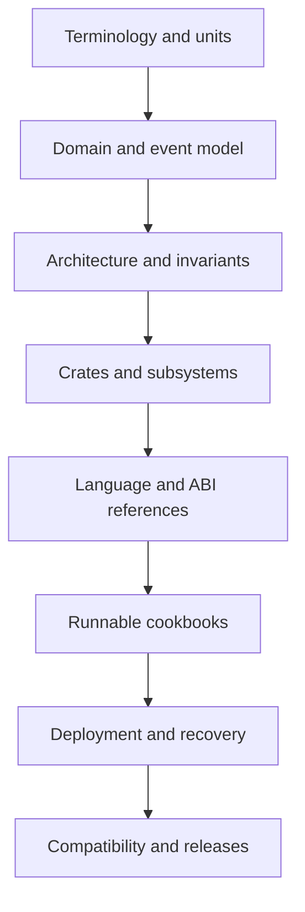

# Orderflow Knowledge System

This directory defines the documentation architecture for Orderflow. It is a
planning and governance layer around the existing handbook, crate READMEs,
binding documentation, API manifests, examples, tests, and operational guides.

The target is a complete knowledge system: readers must be able to learn the
domain, integrate a supported API, inspect exact values and invariants, operate
the system in production, and extend it without relying on undocumented
assumptions.

## Documentation Layers



Each important concept will eventually have four connected views:

1. Explanation: what the concept means and why it exists.
2. How-to: how a user performs a task with it.
3. Reference: exact symbols, fields, constants, values, errors, and defaults.
4. Operations: performance, failure, security, recovery, and deployment behavior.

## Current Documents

- [Documentation charter](./documentation-charter.md)
- [Source-of-truth map](./source-of-truth.md)
- [Coverage inventory](./coverage-inventory.md)
- [Portal tree](./portal-tree.md)
- [Subsystem audit template](./audit-template.md)
- [Rust public surface audit](../reference/rust-surface.md)

The inventory is generated from the repository and should be refreshed whenever
workspace packages or binding surfaces change:

```text
python3 tools/generate_docs_inventory.py
python3 tools/generate_docs_inventory.py --check
```
