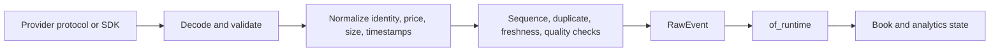

# Market Data and Adapters

Market-data adapters convert provider-specific messages into the normalized
events defined by `of_core`. They also expose health, quality, subscription,
and operational state to the runtime.

## Adapter Boundary

The `MarketDataAdapter` trait is the extension boundary. Provider-specific
types must not leak into `of_core`, `of_runtime`, bindings, or persistence.

## Adapter Lifecycle

The lifecycle is host-controlled and observable:

1. Construct provider configuration.
2. Validate endpoint, credentials references, feature availability, and mode.
3. Start or connect the adapter.
4. Subscribe symbols explicitly.
5. Poll or receive provider events.
6. Emit health transitions and quality changes.
7. Reconnect according to the provider policy after disconnect.
8. Unsubscribe and stop without retaining stale symbol state.

The runtime must not report a provider as production-ready merely because an
adapter object was constructed. Certification, live connectivity, health,
sequence behavior, and observed event flow are separate facts.

## Quality Rules

Adapters must make these conditions visible:

- sequence gaps and regressions;
- duplicate trades or book updates;
- stale event age;
- crossed or locked books where the provider does not permit them;
- depth truncation;
- reconnect and session resets;
- malformed or unsupported provider messages;
- queue pressure and dropped events.

Recovery may request a provider snapshot, restart a stream, or mark the stream
degraded. It must not silently fabricate missing market state.

## Provider Families

| Adapter | Transport/configuration concern | Production documentation requirement |
| --- | --- | --- |
| CQG | WebSocket/protobuf session, symbol resolution, subscription acknowledgements | Endpoint/profile, ack correlation, reconnect, depth, sequence, certification |
| Rithmic | Provider session and vendor credentials | Live boundary, reconnect, event mapping, mock/live distinction |
| Binance | WebSocket streams, subscriptions, depth update IDs, ping/pong | Stream names, update continuity, reconnect, rate limits, raw capture |
| Custom | User-owned transport and normalization | Conformance report, quality policy, ownership, shutdown, tests |

## Adapter Test Matrix

Every provider adapter should test the full lifecycle, not only a happy-path
trade: connect and authenticate; subscribe one and multiple symbols; normalize
trades and book updates with exact units and timestamps; reject malformed,
mis-correlated, duplicate, and out-of-order messages; detect gaps; reconnect
with bounded backoff; shed work under pressure while exposing counts; and
unsubscribe without affecting other symbols.

Normalization may change representation, not meaning. Missing aggressor side,
provider time, or incomplete depth must remain explicit quality facts rather
than being invented to make downstream analytics run.

## Low-Latency Guidance

- Keep provider decoding off the analytics state boundary.
- Reuse buffers where the provider API permits it.
- Bound queues by both records and bytes.
- Avoid logging payloads on the hot path.
- Record receive timestamps at ingress, not after downstream processing.
- Separate reconnect/backoff timers from event processing.
- Never block a producer indefinitely on a slow persistence consumer.

## References

- [Adapter crate reference](../handbook/05b-of-adapters-reference.md)
- [Provider authoring guide](../handbook/12-provider-adapter-authoring.md)
- [Provider certification](../ops/provider_certification.md)
- [Core event foundations](../foundations/README.md)
