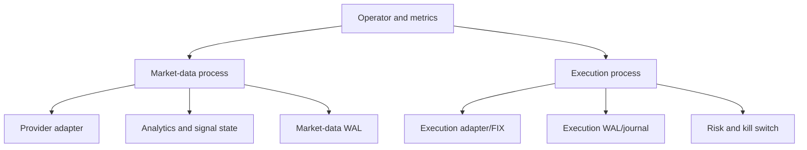

# Production Operations

Operations documentation describes the conditions under which Orderflow can be
trusted, observed, recovered, and upgraded. It does not turn a development
adapter or simulated venue into a production-certified provider.

## Deployment Planes

The market-data and execution planes may be colocated, but deployment must
still define their independent health, readiness, persistence, and recovery
contracts.

## Readiness

A process is ready only when its configured prerequisites are satisfied:

- configuration validation passed;
- provider session is connected or explicitly in an allowed simulation mode;
- subscriptions are acknowledged;
- sequence and freshness policy is satisfied;
- persistence policy is ready or explicitly disabled;
- execution reconciliation is complete before order entry;
- kill-switch state is known;
- metrics and audit output are available.

## Observability

Monitor event throughput, receive-to-process latency, stale age, sequence gaps,
duplicates, queue records and bytes, dropped/admitted/written/synced counts,
adapter reconnects, circuit-breaker state, snapshot latency, WAL integrity,
open-order counts, report lag, reconciliation mismatches, and risk rejects.

Metrics without the corresponding quality and readiness interpretation are not
enough to establish safe operation.

## Recovery

Recovery is a staged process:

1. Stop unsafe new activity.
2. Validate checkpoint and WAL integrity.
3. Reconstruct local state from the latest valid checkpoint and ordered records.
4. Request provider/venue truth where the local log cannot prove state.
5. Reconcile open orders and positions.
6. Restore subscriptions and sequence continuity.
7. Clear degraded/readiness gates only after evidence is complete.

## Security

Credentials belong in a secret manager or injected environment, never in
committed configuration or logs. Dashboard exposure requires authentication,
network restriction, and TLS at the deployment boundary. Endpoint diagnostics
must redact credentials, user information, paths, queries, and fragments.

## Performance and Capacity

Capacity planning must state symbols, depth, events/second, payload sizes,
queue bounds, WAL rotation targets, retention window, snapshot frequency, and
acceptable p99 latency. Benchmark results must identify hardware, features,
build profile, input distribution, and whether persistence or diagnostics were
enabled.

## Incident Decision Tree

When health degrades, first freeze or narrow new risk according to policy.
Inspect health transitions, WAL and checkpoint integrity, adapter evidence,
and venue truth. Resume only when local state is provably complete or external
reconciliation has finished. Otherwise remain blocked and escalate. An
incident record should preserve the timeline, build/configuration identity,
integrity reports, adapter evidence, risk decisions, and operator actions.

## Upgrade Discipline

Before upgrading, compare public signatures, C ABI exports, serialized schema
versions, feature defaults, persistence readers, binding loading, and recovery
behavior. Run replay compatibility and simulated disconnect/restart tests
before live order entry. A binary rollback that cannot read the newer WAL is
not a rollback plan.

## References

- [Operations handbook](../handbook/13-recovery-and-operations.md)
- [Performance guidance](../ops/performance.md)
- [Deployment templates](../ops/deployment_templates.md)
- [Provider certification](../ops/provider_certification.md)
- [Persistence and replay](../persistence/README.md)
