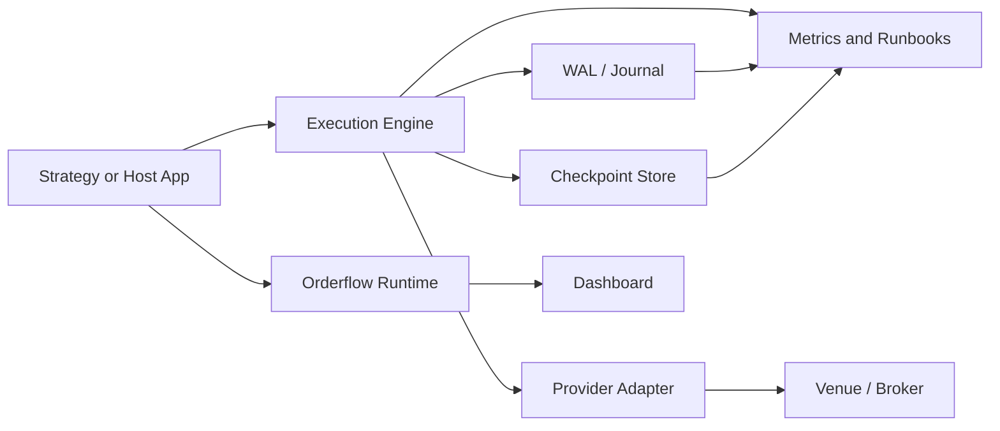

# Production Deployment Templates

This guide gives operators concrete starting points for deploying Orderflow in
research, paper, shadow, live, and recovery workflows. The templates are
intentionally infrastructure-neutral: use the root `Dockerfile`,
`docker-compose.yml`, `k8s/orderflow.yaml`, native binaries, or your own
process supervisor, but keep the same operational contracts.

The default stance is conservative:

- keep live order submission disabled until risk, persistence, and
  reconciliation paths are configured;
- prefer `WalSyncPolicy::EveryRecord` for live OMS state;
- keep `SafetyPolicy::fail_closed()` unless an operator explicitly accepts a
  degraded fail-open condition;
- use `ExecutionTimestampTrace` for latency attribution in any workflow that
  sends or validates orders;
- write an audit bundle manifest for incidents and handoff.

## Common Runtime Shape



## Template Summary

| Template | Order Submission | Persistence | Primary Use |
| --- | --- | --- | --- |
| Simulation only | Simulated | Optional file journal | Local OMS development |
| Paper trading | Broker paper route | WAL recommended | Pre-live strategy rehearsal |
| Live shadow mode | Disabled or shadow-only | WAL plus checkpoints | Candidate validation beside production |
| Single broker live | Enabled | WAL plus checkpoints | One venue/account live trading |
| Multi-route live | Enabled | Segmented WAL plus checkpoints | Multiple accounts/routes/symbols |
| Active/passive recovery | Active primary only | Replicated WAL/checkpoints | Fast failover rehearsal |
| Market-data capture only | Disabled | Market-data persistence | Feed capture and replay |
| Execution capture only | Disabled or controlled | OMS WAL/drop-copy logs | Post-trade audit and reconciliation |
| Research replay | Simulated/replayed | Read-only historical data | Backtest and validation |
| Disaster recovery drill | Controlled | Restored WAL/checkpoints | Recovery procedure proof |

## 1. Simulation Only

Enabled features:

- `SimExecutionAdapter`
- `ExecutionEventBuffer`
- `InMemoryJournal` or `FileExecutionJournal`
- `replay_simulated_oms`
- optional dashboard replay

Durability policy:

- in-memory for fast local iteration;
- file journal when debugging order-state transitions.

Risk policy:

- `AllowAllRiskGate` is acceptable only for local simulation;
- use `BasicRiskGate` or `AdvancedRiskGate` when validating strategy behavior.

Recovery behavior:

- replay deterministic decisions with `replay_simulated_oms`;
- discard state between runs unless a file journal is intentionally enabled.

Operational commands:

```bash
cargo test -p of_execution --lib
cargo run --example demo
python3 dashboard/server.py
```

Metrics to monitor:

- simulated report count;
- rejected order count;
- event buffer fullness;
- replay determinism failures.

## 2. Paper Trading

Enabled features:

- provider paper adapter or host-owned paper bridge;
- `WalExecutionJournal`;
- `FileExecutionCheckpointStore`;
- `SafetyPolicy::fail_closed()`;
- `ExecutionTimestampTrace`.

Durability policy:

- WAL every command and execution event;
- checkpoint on startup, shutdown, and time/count policy;
- store credentials outside the repository using environment variables,
  Kubernetes secrets, or the platform secret manager.

Risk policy:

- pre-trade risk enabled;
- reject new orders when market data is stale, WAL is degraded, or risk is
  unavailable;
- cancels remain enabled unless the adapter is unsafe.

Recovery behavior:

- load latest checkpoint;
- replay WAL from checkpoint sequence;
- compare recovered open orders with broker paper state;
- require operator approval for mismatches.

Operational commands:

```bash
docker compose build
OF_DASH_TOKEN=change-me docker compose up -d
docker compose logs -f orderflow
```

Metrics to monitor:

- adapter health sequence;
- WAL write/sync failures;
- checkpoint save/load failures;
- submit-to-report latency;
- reconciliation mismatches.

## 3. Live Shadow Mode

Enabled features:

- live market data;
- production signal stack;
- `SignalShadowRecorder`;
- execution safety policy with submissions disabled;
- dashboard and audit manifest.

Durability policy:

- persist market data and signal decisions;
- journal shadow execution intents, not live child orders;
- checkpoint shadow state for reproducibility.

Risk policy:

- no live order submission;
- evaluate risk as if orders were live;
- record all would-have-rejected decisions.

Recovery behavior:

- replay market data and shadow intents from the same sequence range;
- compare candidate signal decisions against production baseline;
- keep shadow state isolated from live OMS state.

Operational commands:

```bash
cargo test --workspace --all-features
python3 tools/dashboard_smoke_test.py
```

Metrics to monitor:

- signal drift;
- shadow/live decision disagreement;
- market-data gap flags;
- timestamp skew;
- dashboard health.

## 4. Single Broker Live

Enabled features:

- one production execution adapter;
- `WalExecutionJournal` or `SegmentedWalExecutionJournal`;
- `FileExecutionCheckpointStore`;
- `BasicRiskGate` or `AdvancedRiskGate`;
- `reconcile_open_orders_detailed`;
- `evaluate_safety_policy`.

Durability policy:

- sync WAL according to capital at risk;
- default to `WalSyncPolicy::EveryRecord` for strict durability;
- checkpoint after recovery, after large state changes, and at shutdown.

Risk policy:

- static max order quantity and notional;
- position limit;
- reduce-only emergency switch;
- configurable safety policy defaults to fail closed.

Recovery behavior:

- fail closed on corrupt WAL or checkpoint;
- reconcile open orders with broker/venue before enabling submissions;
- preserve cancels where policy allows.

Operational commands:

```bash
cargo build --release -p of_ffi_c --all-features
kubectl apply -f k8s/orderflow.yaml
kubectl logs deploy/orderflow -f
```

Metrics to monitor:

- order reject reason counts;
- execution report latency;
- WAL average and max sync latency;
- adapter disconnected/degraded state;
- safety policy fail-closed decisions.

## 5. Multi-Route Live

Enabled features:

- route-scoped `RouteConfig` values;
- `ShardRouter`;
- `ConcurrentExecutionEngine` for producer concurrency;
- `ExecutionEventFanout`;
- allocation helpers when using block fills;
- segmented WAL.

Durability policy:

- segmented WAL with explicit segment byte/record limits;
- checkpoint by route/account/symbol snapshot policy;
- archive sealed segments outside the hot path.

Risk policy:

- per-route risk limits;
- route health degradation blocks only affected scopes when possible;
- global kill switch remains available for systemic incidents.

Recovery behavior:

- recover each route/account/symbol scope deterministically;
- reconcile per route;
- keep mismatched routes disabled until operator action completes.

Operational commands:

```bash
cargo test -p of_execution --lib
cargo clippy -p of_execution --all-targets --all-features -- -D warnings
```

Metrics to monitor:

- per-route throughput;
- per-route rejects;
- shard imbalance;
- fanout drops;
- route-specific reconciliation issues.

## 6. Active/Passive Recovery

Enabled features:

- primary live OMS;
- passive process with read-only WAL/checkpoint access or replicated artifacts;
- recovery plan and recovery result reporting;
- operator runbook snapshot.

Durability policy:

- replicate WAL and checkpoints out of the primary failure domain;
- verify copied artifacts with checksum/integrity scans;
- do not allow passive submissions until promotion.

Risk policy:

- passive remains fail closed;
- promotion requires successful recovery and reconciliation;
- any artifact corruption blocks promotion.

Recovery behavior:

- load latest checkpoint;
- replay WAL;
- inspect local open orders;
- reconcile venue truth;
- enable submissions only after explicit promotion.

Operational commands:

```bash
sha256sum <artifact>
cargo test -p of_execution recovery_replays_segmented_wal_after_latest_checkpoint --lib
```

Metrics to monitor:

- replication lag;
- latest checkpoint age;
- latest WAL sequence;
- recovery replay duration;
- promotion approval state.

## 7. Market-Data Capture Only

Enabled features:

- market-data adapters;
- `of_persist` history layout;
- dashboard replay/discovery;
- no execution adapter.

Durability policy:

- persist raw normalized market events;
- rotate/compress archives outside the ingestion hot path;
- keep symbol metadata and tick-size metadata with captured data.

Risk policy:

- no order submission;
- feed stale/gap flags become capture quality signals.

Recovery behavior:

- resume capture from provider-supported sequence or timestamp where possible;
- mark gaps explicitly when backfill cannot prove continuity.

Operational commands:

```bash
python3 tools/capture_public_market_data.py --help
python3 tools/analyze_captured_data.py --help
```

Metrics to monitor:

- events per second;
- sequence gaps;
- stale feed duration;
- disk usage;
- capture lag.

## 8. Execution Capture Only

Enabled features:

- execution adapter or external bridge;
- execution event fanout;
- WAL journal;
- drop-copy ingestion when available;
- allocation reconciliation when applicable.

Durability policy:

- journal every command/report/drop-copy event;
- keep audit bundle manifests for incident exports;
- checkpoint local OMS state at controlled boundaries.

Risk policy:

- new submissions may be disabled if the process is audit-only;
- reconciliation mismatches require operator approval.

Recovery behavior:

- replay WAL into local state;
- reconcile against drop-copy and venue open orders;
- emit discrepancy reports without mutating venue state automatically.

Operational commands:

```bash
cargo test -p of_execution allocation_reconciliation_classifies_mismatches --lib
cargo test -p of_execution detailed_reconciliation_classifies_mismatches --lib
```

Metrics to monitor:

- command/event journal counts;
- drop-copy lag;
- allocation mismatches;
- venue-only/local-only open orders;
- audit manifest artifact counts.

## 9. Research Replay

Enabled features:

- persisted market data;
- deterministic replay;
- signal validation harness;
- simulated OMS;
- dashboard replay controls.

Durability policy:

- input datasets are read-only;
- outputs are versioned by strategy/config hash;
- record replay sequence bounds and data-quality flags.

Risk policy:

- simulated only;
- order-risk checks still run to catch invalid strategy behavior.

Recovery behavior:

- restart from replay sequence bounds;
- compare output summaries across runs for deterministic drift.

Operational commands:

```bash
cargo test --workspace --all-features
python3 tools/dashboard_smoke_test.py
```

Metrics to monitor:

- replay throughput;
- retained signal samples;
- confidence calibration drift;
- simulated reject rates;
- deterministic checksum differences.

## 10. Disaster Recovery Drill

Enabled features:

- WAL integrity reports;
- checkpoint inspect/load;
- recovery plan/result;
- reconciliation policy;
- operator runbook snapshot;
- audit bundle manifest.

Durability policy:

- restore WAL/checkpoints into an isolated environment;
- verify checksums before replay;
- do not reuse production credentials during drills.

Risk policy:

- submissions disabled by default;
- cancels allowed only in controlled live-incident exercises;
- require operator approval before any recovered engine can send orders.

Recovery behavior:

- prove latest checkpoint can load;
- prove WAL can replay from checkpoint sequence;
- prove reconciliation produces an expected decision;
- record recovery duration and unresolved issues.

Operational commands:

```bash
cargo test -p of_execution --lib
cargo semver-checks check-release -p of_execution
python3 tools/docs_coverage.py --enforce
```

Metrics to monitor:

- recovery time objective;
- recovery point objective;
- corrupt artifact count;
- unresolved reconciliation count;
- operator approval latency.

## Low-Latency Notes

- Keep clock reads, JSON formatting, compression, and network uploads outside
  submit/report hot paths unless explicitly required.
- Use caller-owned buffers and bounded queues for adapter output.
- Keep WAL/checkpoint artifact packaging out of the live critical path.
- Prefer per-route or per-symbol sharding over shared global locks.
- Treat container and Kubernetes templates as operational packaging, not a
  substitute for colocated, CPU-pinned, hardware-timestamped deployments when
  microsecond latency targets matter.
