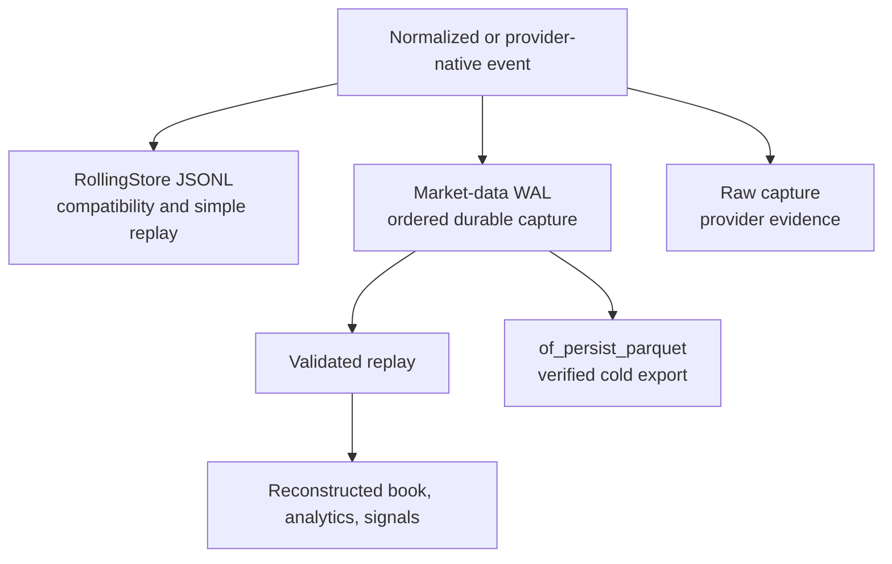
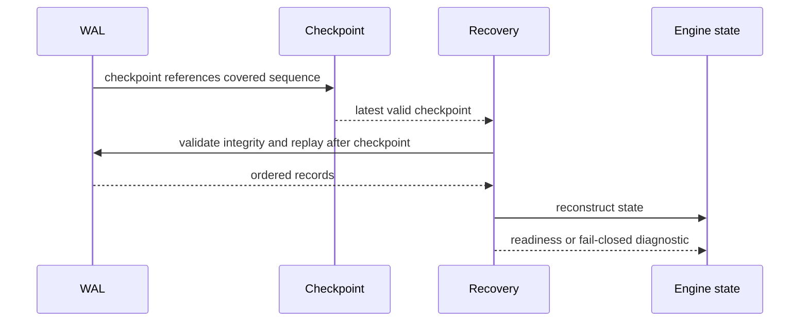

# Persistence and Replay

Orderflow persistence has separate representations for compatibility, hot
capture, raw evidence, and cold research export. The persistence layer is not
just a file writer: it defines what can be recovered and what replay means.

## Storage Tiers

## `RollingStore`

The existing JSONL store remains the compatibility-oriented path. It supports
human inspection, discovery, retention, and legacy readback. Legacy records
must remain readable when schema metadata is added. JSONL is convenient but is
not the most efficient high-volume hot capture format.

## Binary WAL

The normalized WAL provides ordered frames, checksums, record kinds, sequence
tracking, replay filters, integrity reports, and sync policy. Segmented WAL
adds rotation and linked segment integrity. The manifest is an accelerator;
validated segment contents remain the recovery authority.

The bounded writer has one owner for filesystem mutation and cloneable producer
handles for admission. Admission is nonblocking and bounded by both record
count and payload bytes. Flush and shutdown are control-plane barriers.

## Checkpoints and Recovery

A checkpoint is useful only when its covered WAL sequence and state metadata
are valid. Recovery must distinguish:

- clean end-of-log;
- truncated tail permitted by policy;
- checksum corruption;
- sequence gap;
- missing checkpoint dependency;
- replayed state that requires an external provider snapshot;
- successful reconstructed readiness.

## Deterministic Replay

Replay uses persisted event order and explicit filters. It must preserve symbol,
sequence, timestamps, quality flags, and normalized payload values. The same
input and configuration must produce the same reconstructed state. A replay
that silently drops malformed records or rewrites event order is not equivalent
to live processing.

## Retention and Cold Export

Retention may delete hot WAL data only after export and checkpoint dependency
checks prove that deletion is safe. Parquet export is a control-plane path:
bounded batches, row groups, partition keys, compression, atomic publication,
reopen verification, sequence ranges, and checksums are part of the proof.

## References

- [Persistence crate reference](../handbook/05d-of-persist-reference.md)
- [Parquet crate reference](../handbook/05m-of-persist-parquet-reference.md)
- [Recovery operations](../handbook/13-recovery-and-operations.md)
- [Production performance](../ops/performance.md)
