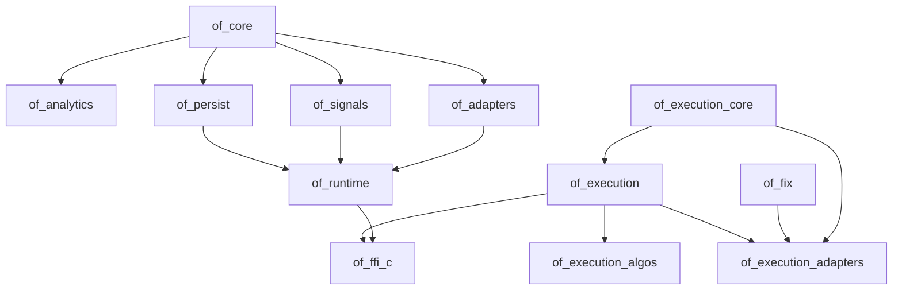

# How to Read a Crate Reference

The generated crate pages are intentionally exhaustive indexes. They answer
“what public declarations exist in this package?” They do not, by themselves,
answer “which package should I use, what state does this method change, or what
does a successful result mean?” This page supplies that missing connective
tissue.

## The Dependency Direction Is a Design Argument

The workspace is arranged so that lower layers can be reused without importing
the concerns of higher layers:

This direction is not merely a build convenience. It determines which layer
is allowed to make a decision:

- `of_core` can define what an event means, but cannot decide whether to trade;
- `of_adapters` can explain how a provider message maps to an event, but cannot
  own a strategy's risk policy;
- `of_runtime` can coordinate lifecycle and health, but cannot manufacture an
  execution acknowledgement;
- `of_execution` can reject an order or hold uncertain state, but cannot
  rewrite the market-data history that led to the intent;
- `of_fix` can validate FIX framing and session sequencing, but should not
  contain a venue's account policy;
- `of_ffi_c` can translate the public contract across a binary boundary, but
  must not invent a second semantic contract.

## Package Guide

### `of_core`

Start here when the question is about market meaning. It defines
`SymbolId`, `Side`, `BookAction`, `TradePrint`, `BookUpdate`, snapshots,
quality flags, and `AnalyticsAccumulator`. The accumulator is deliberately
small in responsibility: it accepts normalized trades and maintains
deterministic state. It does not know whether an event came from CQG, Binance,
or a replay file.

Use `of_core` directly for research and unit tests when you already have
normalized events. Move up to `of_runtime` only when you need subscriptions,
adapter lifecycle, health, persistence, or binding-facing orchestration.

### `of_analytics`

Use this crate when a measurement is useful across applications but does not
belong in the minimal core accumulator. A tracker generally has three parts:
configuration, event/bar input, and a snapshot with explicit warm-up behavior.
Read its insufficient-data behavior before interpreting a zero or default
value. A metric that has not seen enough observations is not necessarily a
metric whose true value is zero.

### `of_adapters`

This is the market-data boundary. The adapter owns wire decoding, provider
identity, subscription state, reconnect behavior, and provider-specific
quality decisions. Its output must be normalized before it reaches the core.

When implementing an adapter, document the mapping for every provider field:
which field becomes the normalized price, how size is scaled, how aggressor
side is inferred, whether sequence numbers are global or per stream, and what
happens after a gap. “The provider sends a trade” is not enough information to
implement a safe adapter.

### `of_persist` and `of_persist_parquet`

`of_persist` is the durable event-history layer. It owns write ordering,
checksums, segment continuity, bounded admission, replay, checkpoints, and
retention evidence. `of_persist_parquet` is a cold-storage export layer. It
should consume verified sealed history; it should not be inserted into the
capture hot path merely because Parquet is convenient for research.

The critical distinction is **capture versus analysis**. Capture must preserve
what arrived and whether it was trustworthy. Analysis may filter or derive
features later. A filtered export must never be mistaken for the original
evidence needed to recover state.

### `of_runtime`

The runtime is the market-data host. It connects the lower-level contracts:
configuration selects an adapter, subscriptions select streams, polling or
external ingest supplies events, and snapshots expose state. Its health model
is part of the output, because a snapshot without freshness and sequence
context can be dangerously persuasive.

The synchronous poll boundary is intentional. It makes replay and embedding
predictable and keeps the C/Python/Java bindings compatible. Do not infer that
the runtime is a general-purpose async scheduler from the existence of worker
facilities in persistence or concurrent execution APIs.

### `of_signals`

Signals turn observations into policy-shaped interpretations. Read the signal
context, lifecycle, quality gate, explanation, and validation rules together.
The useful output is not just `Long` or `Short`; it is the direction plus the
evidence, confidence, warm-up state, and reasons that made the result eligible
or ineligible.

### `of_execution_core`

This crate is the smallest execution vocabulary. It is where order identity,
request shape, report shape, state transitions, and durable execution records
are defined. Keeping it small lets protocol adapters share the same canonical
meaning without importing a complete OMS.

### `of_execution`

This is the OMS and execution control plane. It owns the decisions that must
remain correct when an application retries, submits for multiple symbols,
receives partial fills, loses a connection, or restarts with uncertain work.
Read idempotency, risk, routing, journaling, checkpoints, recovery readiness,
and reconciliation as one contract. A submit method cannot be understood by
reading only its happy-path return value.

### `of_execution_algos`

Algorithms plan child intent from a parent order and bounded context. TWAP,
VWAP, POV, sweep, spread, basket, iceberg, market-making, and liquidity-seeking
components must all preserve parent quantity and feed decisions through the
OMS's risk and idempotency gates. An algorithm is not a privileged route
around execution safety.

### `of_fix` and `of_execution_adapters`

`of_fix` provides reusable FIX framing, typed fields, dictionary/profile
validation, sequence tracking, resend planning, durable resend evidence, and
session behavior. `of_execution_adapters` maps those reusable mechanics into
the OMS's canonical command and report contracts.

This split is important. FIX session correctness is a protocol concern. The
meaning of a venue's account, order type, capability, certification scenario,
and recovery policy is an execution-adapter concern. Keeping them separate
lets another host reuse the codec and lets the adapter remain testable without
reimplementing framing.

### `of_ffi_c`

The C ABI is the compatibility boundary, not a convenience wrapper around
private Rust structs. Read every FFI function in this order: handle validity,
input ownership, output buffer negotiation, return code, callback threading,
and cleanup. Existing layouts and signatures are preserved; additions must be
additive.

## A Repeatable Reference Workflow

For any symbol, follow this sequence:

1. Start with the relevant narrative manual and identify the domain problem.
2. Read the crate page's generated declaration row and source link.
3. Open Rustdoc for the exact signature, feature gate, trait bounds, and
   examples.
4. Read the owning source around the item for state mutation and invariants.
5. Read the tests named by the surrounding module to see edge behavior.
6. Check the values/layout audit for defaults, constants, fields, and variants.
7. Check compatibility and release notes for introduction and migration rules.
8. For bindings, trace the same operation through the C ABI and wrapper.

This prevents two opposite mistakes: using a symbol without understanding its
state contract, and reading implementation details as if they were stable API.

## What “Exhaustive” Means Here

An exhaustive reference does not mean repeating a function name in a table.
For a public item to be genuinely documented, a reader must be able to answer:

- What problem does it solve?
- What state does it read or mutate?
- What units and sentinel values apply?
- What inputs are rejected and how?
- What does success prove, and what does it not prove?
- Does it allocate, block, call user code, or access the clock?
- Is it deterministic under replay?
- Can it be called concurrently or reentrantly?
- What must the caller own, retain, release, or reconcile?
- Which feature and version provide it?
- Which neighboring contract must be read next?

The generated inventories establish the coverage set. The narrative manuals,
Rustdoc, tests, and source are what make that set understandable.

