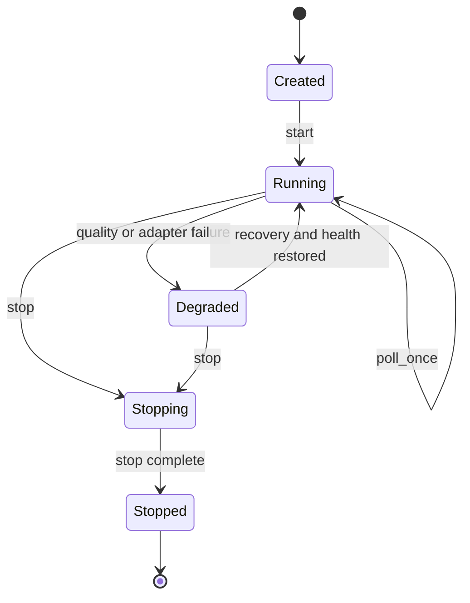

# Runtime Lifecycle and Concurrency

`of_runtime` is the orchestration layer for market-data ingestion, materialized
book state, analytics, signals, persistence, and health. Its public model is
poll-driven and synchronous; this is a compatibility contract for existing
Rust, C, Python, and Java users.

## Lifecycle

`start` establishes runtime readiness. `poll_once` performs one host-controlled
processing step. `stop` ends processing and releases runtime activity. `close`
is the terminal ownership operation for bindings and handles. Calling a method
after terminal close is invalid and must be reported rather than dereferenced.

## Poll Contract

One poll cycle may advance adapter state, receive normalized events, apply book
updates, update analytics, evaluate signals and quality gates, admit persistence
records, and publish health/metrics changes. The exact event count is bounded
by configuration where a poll limit is enabled. Backpressure must be visible in
health and metrics; it must not look like a healthy empty feed.

## Thread-Safety and Reentrancy

The synchronous engine is designed for host-controlled access. Consumers should
serialize mutable engine calls unless a method explicitly documents concurrent
use. Snapshot reads must not race with destruction. Callbacks must not assume
that they run on the caller thread; binding hosts should keep callback bodies
short and hand work to application-owned queues.

The concurrent execution engine is a separate execution-plane API. It does not
make the market-data engine asynchronously safe, and it does not change the
poll-driven contract of existing runtime methods.

## Configuration Loading

Configuration supports typed TOML/JSON loading and a legacy compatibility
fallback. Strict parsing is preferred. A `ConfigLoadReport` records the input
format and whether legacy fallback was used so applications can warn or migrate
without breaking old configuration files.

Startup validation covers instance identity, signal thresholds, audit limits,
persistence roots and retention, provider endpoints, and credential references.
Validation must complete before live processing begins.

## External Feed Bridge

The external bridge is for hosts that own provider connectivity. It must call
the configured health tick even when no event arrives, so stale detection is
time-based rather than dependent on a successful poll. Sequence enforcement,
reconnecting state, and stale thresholds are explicit policy inputs.

## Snapshots

Snapshots are read models. They do not mutate the accumulator, acknowledge an
execution order, or repair a malformed stream. Variable-size binding payloads
use the C ABI capacity-negotiation contract. A host should bound retry memory if
depth or diagnostic payload size can be influenced by an untrusted source.

## Persistence Integration

Runtime-owned persistence is optional and policy-driven. Flush and shutdown are
control-plane barriers. A persistence failure must be represented in health,
metrics, and the configured failure action. It must not be silently converted
into a successful live state.

## Performance Model

- Polling and analytics are synchronous by default.
- Provider I/O and persistence workers are bounded where those APIs are enabled.
- Snapshot serialization may allocate and belongs outside latency-critical
  event processing where possible.
- Advanced analytics are separated into `of_analytics` so hosts that need only
  core analytics do not compile every model.
- Timing uses exchange and receive timestamps; wall-clock reads must not affect
  deterministic analytics state.

## References

- [Runtime crate reference](../handbook/05e-of-runtime-reference.md)
- [Low-latency design](../handbook/11-low-latency-design.md)
- [Persistence and replay](../persistence/README.md)
